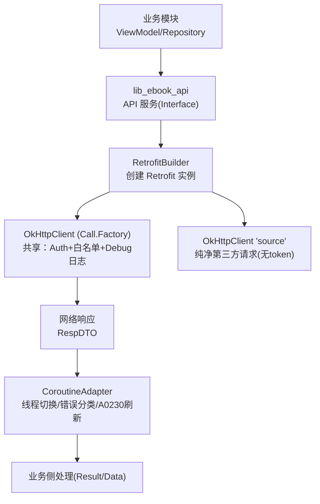
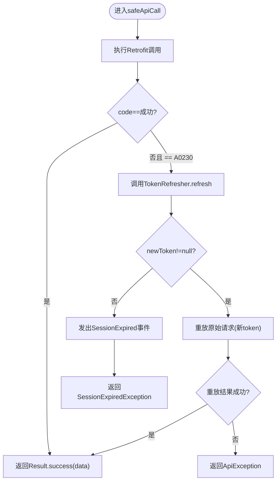
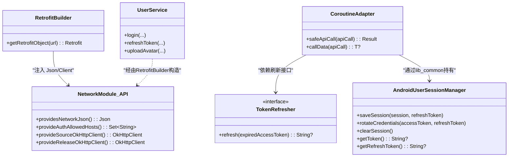

# 网络层设计

<cite>
**本文引用的文件**
- [RetrofitBuilder.kt](file://lib_ebook_api/src/main/java/com/ebook/api/RetrofitBuilder.kt)
- [NetworkModule.kt（lib_ebook_api）](file://lib_ebook_api/src/main/java/com/ebook/api/utils/NetworkModule.kt)
- [NetworkModule.kt（module_app real flavor）](file://module_app/src/real/java/com/ebook/di/NetworkModule.kt)
- [NetworkModule.kt（module_app mock flavor）](file://module_app/src/mock/java/com/ebook/di/NetworkModule.kt)
- [EncodingInterceptor.kt](file://lib_ebook_api/src/main/java/com/ebook/api/intercepter/EncodingInterceptor.kt)
- [CoroutineAdapter.kt](file://lib_ebook_api/src/main/java/com/ebook/api/utils/CoroutineAdapter.kt)
- [UserService.kt](file://lib_ebook_api/src/main/java/com/ebook/api/service/user/UserService.kt)
- [TokenRefresher.kt](file://lib_ebook_api/src/main/java/com/ebook/api/auth/TokenRefresher.kt)
- [UserSessionManager.kt](file://lib_book_common/src/main/java/com/ebook/common/domain/UserSessionManager.kt)
- [AndroidUserSessionManager.kt](file://lib_book_common/src/main/java/com/ebook/common/domain/AndroidUserSessionManager.kt)
- [JsonUtils.kt](file://lib_ebook_api/src/main/java/com/ebook/api/utils/JsonUtils.kt)
- [LoginDTO.kt](file://lib_ebook_api/src/main/java/com/ebook/api/entity/LoginDTO.kt)
</cite>

## 目录
1. [引言](#引言)
2. [项目结构](#项目结构)
3. [核心组件](#核心组件)
4. [架构总览](#架构总览)
5. [详细组件分析](#详细组件分析)
6. [依赖关系分析](#依赖关系分析)
7. [性能与可靠性](#性能与可靠性)
8. [测试策略与Mock](#测试策略与mock)
9. [缓存、离线与网络状态](#缓存离线与网络状态)
10. [故障排查指南](#故障排查指南)
11. [结论](#结论)

## 引言
本设计文档说明本项目在 Retrofit 3.0.0 + OkHttp 5.3.0 基础上的网络层整体方案，围绕以下关键点展开：
- 构建策略：共享 OkHttp 调用链与 Json 配置，按场景拆分客户端（用户业务请求 vs 书源/第三方纯净请求）。
- 拦截器链：编码处理、权限白名单、调试日志等通过 lib_common 的 Call.Factory 统一注入。
- 认证与会话：token 获取、刷新、失效流程与会话三处镜像的一致性。
- 错误与降级：超时、网络异常、会话过期时的静默刷新与全局处置；第三方站点的轻量级超时控制。
- JSON序列化：kotlinx.serialization 的统一配置与边界 DTO 转换。
- API示例：登录、资料更新、头像上传等常见请求。
- 测试：基于 Hilt flavor 切换实现，资产驱动与接口契约测试。

## 项目结构
网络层主要位于 lib_ebook_api 模块，负责服务接口定义、JSON序列化配置、OkHttp 客户端与拦截器；模块 app 根据 product flavor 绑定真实或 mock 的数据源；共享会话管理与拦截器能力由 lib_book_common/lib_common 提供。



图表来源
- [RetrofitBuilder.kt:24-44](file://lib_ebook_api/src/main/java/com/ebook/api/RetrofitBuilder.kt#L24-L44)
- [NetworkModule.kt（lib_ebook_api）:21-71](file://lib_ebook_api/src/main/java/com/ebook/api/utils/NetworkModule.kt#L21-L71)
- [CoroutineAdapter.kt:29-62](file://lib_ebook_api/src/main/java/com/ebook/api/utils/CoroutineAdapter.kt#L29-L62)

章节来源
- [RetrofitBuilder.kt:13-44](file://lib_ebook_api/src/main/java/com/ebook/api/RetrofitBuilder.kt#L13-L44)
- [NetworkModule.kt（lib_ebook_api）:19-71](file://lib_ebook_api/src/main/java/com/ebook/api/utils/NetworkModule.kt#L19-L71)
- [NetworkModule.kt（module_app real）:14-35](file://module_app/src/real/java/com/ebook/di/NetworkModule.kt#L14-L35)
- [NetworkModule.kt（module_app mock）:14-37](file://module_app/src/mock/java/com/ebook/di/NetworkModule.kt#L14-L37)

## 核心组件
- RetrofitBuilder：集中挂载 kotlinx serialization 转换器与 Scalars，复用 Hilt 提供的 OkHttp Call.Factory。
- NetworkModule（lib_ebook_api）：定义公共 Json 配置、为“书源”和“发布检查”分别提供干净的 OkHttpClient，并绑定 Auth 白名单。
- CoroutineAdapter：统一 IO 调度、业务码映射、A0230 静默刷新与会话过期事件发送。
- TokenRefresher：刷新 access token 的接缝，具体实现在上层（lib_book_common），避免反向依赖。
- UserSessionManager / AndroidUserSessionManager：会话持久化、三处镜像同步、token 生命周期管理。
- EncodingInterceptor：第三方站点中文内容的 body 编码兜底设置。
- UserService：用户领域 HTTP 接口定义（含 Multipart 上传）。

章节来源
- [RetrofitBuilder.kt:24-44](file://lib_ebook_api/src/main/java/com/ebook/api/RetrofitBuilder.kt#L24-L44)
- [NetworkModule.kt（lib_ebook_api）:24-71](file://lib_ebook_api/src/main/java/com/ebook/api/utils/NetworkModule.kt#L24-L71)
- [CoroutineAdapter.kt:29-149](file://lib_ebook_api/src/main/java/com/ebook/api/utils/CoroutineAdapter.kt#L29-L149)
- [TokenRefresher.kt:1-27](file://lib_ebook_api/src/main/java/com/ebook/api/auth/TokenRefresher.kt#L1-L27)
- [UserSessionManager.kt:5-62](file://lib_book_common/src/main/java/com/ebook/common/domain/UserSessionManager.kt#L5-L62)
- [AndroidUserSessionManager.kt:17-162](file://lib_book_common/src/main/java/com/ebook/common/domain/AndroidUserSessionManager.kt#L17-L162)
- [EncodingInterceptor.kt:10-55](file://lib_ebook_api/src/main/java/com/ebook/api/intercepter/EncodingInterceptor.kt#L10-L55)
- [UserService.kt:22-72](file://lib_ebook_api/src/main/java/com/ebook/api/service/user/UserService.kt#L22-L72)

## 架构总览
整体采用“接口即API + 统一适配器 + 多客户端隔离”的分层模式：
- 各功能以 Service 接口声明端点，返回统一的 RespDTO<T>，并由 retrofit 自动使用 kotlinx.serialization 进行反序列化。
- 所有网络请求经 CoroutineAdapter.safeApiCall 封装：切到 IO、业务码判定、A0230 单飞刷新与失败事件发送、异常转 Result。
- 客户端隔离：
  - 用户相关请求：复用共享 Call.Factory（带 AuthInterceptor + 白名单 + debug 脱敏日志，默认超时配置来自 lib_common）。
  - 第三方书源请求：使用 Named("source") 纯净 OkHttpClient，不携带 Authorization 头，短超时快速失败。
  - 版本更新检查请求：使用 Named("release") 纯净客户端，不带 token、不走 RespDTO 信封。

```mermaid
sequenceDiagram
    participant VM as "业务VM"
    participant Repo as "仓库/DataSource"
    participant RA as "Retrofit API"
    participant CA as "CoroutineAdapter"
    participant TR as "TokenRefresher"
    participant SE as "SessionEventBus"
    participant OH as "OkHttp(共享)"
    VM->>Repo: 发起业务请求
    Repo->>CA: safeApiCall()
    CA->>RA: 调用API(Suspend)
    RA->>OH: 发起请求(Auth拦截, 白名单)
    OH-->>RA: 响应RespDTO
    alt 业务码=成功
        CA-->>Repo: Result.success
    else code=A0230
        CA->>TR: refresh(expiredToken)
        TR-->>CA: 新token或null
        opt 刷新成功
            CA->>RA: 用新token重放一次
            RA-->>CA: 新的RespDTO
            CA-->>Repo: Result.success
        else 刷新失败
            CA->>SE: emit(SessionExpired)
            CA-->>Repo: Result.failure(SessionExpiredException)
        end
    else 其他错误
        CA-->>Repo: Result.failure(ApiException)
    end
```

图表来源
- [CoroutineAdapter.kt:29-149](file://lib_ebook_api/src/main/java/com/ebook/api/utils/CoroutineAdapter.kt#L29-L149)
- [TokenRefresher.kt:16-27](file://lib_ebook_api/src/main/java/com/ebook/api/auth/TokenRefresher.kt#L16-L27)
- [RetrofitBuilder.kt:24-44](file://lib_ebook_api/src/main/java/com/ebook/api/RetrofitBuilder.kt#L24-L44)

## 详细组件分析

### Retrofit 构建与 JSON 配置
- RetrofitBuilder 只负责挂接转换器与共享 Call.Factory，确保 Retrofit 3.x 环境下 kotlin 序列化可用，并对 String 返回类型保留 Scalars 支持（用于书源 HTML 等）。
- NetworkModule 提供的 Json 开启 prettyPrint 与 ignoreUnknownKeys，保证前后端字段演进兼容与可读日志输出。

章节来源
- [RetrofitBuilder.kt:13-44](file://lib_ebook_api/src/main/java/com/ebook/api/RetrofitBuilder.kt#L13-L44)
- [NetworkModule.kt（lib_ebook_api）:21-28](file://lib_ebook_api/src/main/java/com/ebook/api/utils/NetworkModule.kt#L21-L28)
- [JsonUtils.kt:11-22](file://lib_ebook_api/src/main/java/com/ebook/api/utils/JsonUtils.kt#L11-L22)

### 客户端隔离策略
- 用户业务请求：复用 lib_common 提供的 Call.Factory，包含认证拦截器、Host 白名单、调试脱敏日志以及统一超时（继承自底层客户端）。
- 书源第三方请求：@Named("source") OkHttpClient，仅添加 EncodingInterceptor，设置 10s 连接/写/读超时，严禁附加 Authorization 头，防止 token 泄露至第三方网站。
- 版本更新检查请求：@Named("release") OkHttpClient，同样不带 token，且不走通用 RespDTO 信封适配。

章节来源
- [NetworkModule.kt（lib_ebook_api）:35-71](file://lib_ebook_api/src/main/java/com/ebook/api/utils/NetworkModule.kt#L35-L71)

### 认证拦截与会话管理
- 认证令牌来源于 lib_common 的 TokenHolder，仅在 AuthAllowedHosts 白名单（BuildConfig.EBOOK_SERVER_HOST）的 host 上附加到请求头。
- 登录成功后，AndroidUserSessionManager 将身份写入 SP、内存 StateFlow 及 ProfileRepository 三处镜像，并在冷启动时恢复 TokenHolder。
- A0230 发生时，CoroutineAdapter 触发 TokenRefresher.refresh 单飞刷新；成功则用新 token 重放一次，失败则发出 SessionExpired 事件由全局统一处理。



图表来源
- [CoroutineAdapter.kt:41-149](file://lib_ebook_api/src/main/java/com/ebook/api/utils/CoroutineAdapter.kt#L41-L149)
- [AndroidUserSessionManager.kt:45-133](file://lib_book_common/src/main/java/com/ebook/common/domain/AndroidUserSessionManager.kt#L45-L133)
- [TokenRefresher.kt:16-27](file://lib_ebook_api/src/main/java/com/ebook/api/auth/TokenRefresher.kt#L16-L27)

### 编码处理与第三方站点兼容性
- EncodingInterceptor 针对第三方站点响应体缺少 charset 的情况，设置自定义编码，保障中文内容解析正确。
- 该拦截器仅用于“source”客户端，避免影响服务端 JSON 流的默认解析。

章节来源
- [EncodingInterceptor.kt:10-55](file://lib_ebook_api/src/main/java/com/ebook/api/intercepter/EncodingInterceptor.kt#L10-L55)
- [NetworkModule.kt（lib_ebook_api）:44-56](file://lib_ebook_api/src/main/java/com/ebook/api/utils/NetworkModule.kt#L44-L56)

### API 定义与数据转换
- UserService 定义标准 REST 接口：登录、发码、注册、刷新、登出、修改密码、重置密码、更新信息、头像上传（Multipart）。
- 实体如 LoginDTO 配合 @SerialName 完成 snake_case 键到驼峰 Kotlin 属性的边界翻译。
- 仓库通过 Retrofit 接口获得 RespDTO<T>，再由 CoroutineAdapter 转换为 Result/业务 data。

章节来源
- [UserService.kt:22-72](file://lib_ebook_api/src/main/java/com/ebook/api/service/user/UserService.kt#L22-L72)
- [LoginDTO.kt:1-16](file://lib_ebook_api/src/main/java/com/ebook/api/entity/LoginDTO.kt#L1-L16)
- [CoroutineAdapter.kt:41-62](file://lib_ebook_api/src/main/java/com/ebook/api/utils/CoroutineAdapter.kt#L41-L62)

### 异步与错误处理机制
- CoroutineAdapter.safeApiCall：
  - IO 调度：withContext(Dispatchers.IO) 执行网络调用。
  - 业务码：SUCCESS 直接成功；USER_ERROR_A0230 走刷新并重放；其他转为 ApiException。
  - 取消安全：CancellationException 透传，避免被包装成笼统异常。
- 超时与重试：
  - 用户请求：由共享 Call.Factory 的底层 OkHttp 决定超时策略（参考文档约定）。
  - 第三方请求：10s 短超时快速失败，避免长时间阻塞。
  - 显式重试：当前未在全网层做通用指数退避重试，集中在业务侧或下游处理（例如下载任务），避免滥用导致雪崩。

章节来源
- [CoroutineAdapter.kt:17-62](file://lib_ebook_api/src/main/java/com/ebook/api/utils/CoroutineAdapter.kt#L17-L62)
- [NetworkModule.kt（lib_ebook_api）:48-71](file://lib_ebook_api/src/main/java/com/ebook/api/utils/NetworkModule.kt#L48-L71)

## 依赖关系分析
- 模块装配：app module 通过 Hilt flavor source set 绑定 DataSource 到 UserNetwork/CommentNetwork（real 或 test 实现），ReleaseDataSource 指向 ReleaseNetwork（真实打 GitHub/Gitcode）或其 Mock。
- 依赖方向：业务模块 → lib_book_common（会话/工具） → lib_ebook_api（API/OkHttp/序列化）。



图表来源
- [RetrofitBuilder.kt:24-44](file://lib_ebook_api/src/main/java/com/ebook/api/RetrofitBuilder.kt#L24-L44)
- [NetworkModule.kt（lib_ebook_api）:21-71](file://lib_ebook_api/src/main/java/com/ebook/api/utils/NetworkModule.kt#L21-L71)
- [CoroutineAdapter.kt:29-149](file://lib_ebook_api/src/main/java/com/ebook/api/utils/CoroutineAdapter.kt#L29-L149)
- [AndroidUserSessionManager.kt:17-162](file://lib_book_common/src/main/java/com/ebook/common/domain/AndroidUserSessionManager.kt#L17-L162)
- [UserService.kt:22-72](file://lib_ebook_api/src/main/java/com/ebook/api/service/user/UserService.kt#L22-L72)
- [NetworkModule.kt（module_app real）:14-35](file://module_app/src/real/java/com/ebook/di/NetworkModule.kt#L14-L35)
- [NetworkModule.kt（module_app mock）:14-37](file://module_app/src/mock/java/com/ebook/di/NetworkModule.kt#L14-L37)

章节来源
- [NetworkModule.kt（module_app real）:14-35](file://module_app/src/real/java/com/ebook/di/NetworkModule.kt#L14-L35)
- [NetworkModule.kt（module_app mock）:14-37](file://module_app/src/mock/java/com/ebook/di/NetworkModule.kt#L14-L37)

## 性能与可靠性
- 超时策略
  - 书源/第三方：连接/写/读均为 10s，快速失败，降低拖垮主进程的风险。
  - 用户业务：复用共享 OkHttp，超时由下层统一控制（建议结合业务设置合理值）。
- 并发与会话
  - A0230 采用单飞刷新，避免并发风暴；同一时刻只有一个刷新请求。
- I/O 切换
  - 全部在网络适配器中切换到 IO 线程，避免 UI 卡顿。
- 外部站点兼容性
  - 通过 EncodingInterceptor 修复第三方站点缺失 charset 的场景。

章节来源
- [NetworkModule.kt（lib_ebook_api）:48-71](file://lib_ebook_api/src/main/java/com/ebook/api/utils/NetworkModule.kt#L48-L71)
- [CoroutineAdapter.kt:29-149](file://lib_ebook_api/src/main/java/com/ebook/api/utils/CoroutineAdapter.kt#L29-L149)
- [EncodingInterceptor.kt:10-55](file://lib_ebook_api/src/main/java/com/ebook/api/intercepter/EncodingInterceptor.kt#L10-L55)

## 测试策略与Mock
- Flavor 双链路：集成构建下通过 module_app 的 real/mock 两个 flavor 绑定不同 DataSource 实现（真实后端 vs 内存Mock）。
- 资产驱动的读接口：Mock 实现使用静态 JSON 资产（位于 assets），与线上载荷同形，便于契约测试。
- 上传与动态响应：写接口与上传接口在 Mock 中以代码合成响应，不再套用静态 JSON。
- 发布检查：ReleaseDataSource 的真实实现打公开 Releases API；Mock 下用本地 release_latest.json 稳定演练前端展示。

章节来源
- [NetworkModule.kt（module_app real）:14-35](file://module_app/src/real/java/com/ebook/di/NetworkModule.kt#L14-L35)
- [NetworkModule.kt（module_app mock）:14-37](file://module_app/src/mock/java/com/ebook/di/NetworkModule.kt#L14-L37)

## 缓存、离线与网络状态
- 应用级缓存：lib_ebook_api 提供基础缓存类（ACache）供局部复用；本项目更广泛依赖 Room（lib_ebook_db）进行结构化数据持久化。
- 阅读正文：章节正文在 lib_book_common 通过 ChapterContentCache 实现本地缓存；本地导入与网络正文读取最终汇聚到统一存储，减少重复网络访问。
- 会话与离线：即使网络不可用，已登录态与会话信息可持久化；页面可根据 Result 分支显示离线态或加载历史缓存。

章节来源
- [ACache.kt](file://lib_ebook_api/src/main/java/com/ebook/api/cache/ACache.kt)
- [ChapterContentCache.kt](file://lib_book_common/src/main/java/com/ebook/common/store/ChapterContentCache.kt)
- [AndroidUserSessionManager.kt:45-133](file://lib_book_common/src/main/java/com/ebook/common/domain/AndroidUserSessionManager.kt#L45-L133)

## 故障排查指南
- 会话过期但一直无法回到登录页
  - 检查 CoroutineAdapter.handleTokenExpired 是否正确调用 TokenRefresher.refresh。
  - 确认刷新失败后是否发出 SessionExpired 事件并被全局订阅方处理。
- 第三方站点中文乱码
  - 确认请求走的是 Named("source") 客户端，且 EncodingInterceptor 生效。
- 书源请求误带 token
  - 检查是否误用了共享 Call.Factory；应使用 Named("source") 纯净客户端。
- 短超时导致频繁失败
  - 书源客户端 10s 短超时属预期行为；若业务侧期望更长，请在对应 Repository/Task 级别处理，而非污染共享客户端。

章节来源
- [CoroutineAdapter.kt:71-149](file://lib_ebook_api/src/main/java/com/ebook/api/utils/CoroutineAdapter.kt#L71-L149)
- [EncodingInterceptor.kt:10-55](file://lib_ebook_api/src/main/java/com/ebook/api/intercepter/EncodingInterceptor.kt#L10-L55)
- [NetworkModule.kt（lib_ebook_api）:44-71](file://lib_ebook_api/src/main/java/com/ebook/api/utils/NetworkModule.kt#L44-L71)

## 结论
本项目网络层基于 Retrofit 3.0.0 + OkHttp 5.3.0 构建了清晰的分层与隔离策略：通过 RetrofitBuilder 与 NetworkModule 统一管理序列化与客户端差异；利用 CoroutineAdapter 统一异常与会话刷新；以 TokenRefresher 与 UserSessionManager 实现健壮的认证与会话生命周期；对第三方书源采用纯净客户端与短超时以保障稳定性。测试层面通过 flavor 与资产驱动实现高保真 Mock，便于在不依赖服务器的情况下进行全链路验证。