# 跨模块通信

<cite>
**本文引用的文件**   
- [IBookProvider.kt](file://lib_book_common/src/main/java/com/ebook/common/provider/IBookProvider.kt)
- [BookProvider.kt](file://module_book/src/main/java/com/ebook/book/provider/BookProvider.kt)
- [ILoginProvider.kt](file://lib_book_common/src/main/java/com/ebook/common/provider/ILoginProvider.kt)
- [LoginProvider.kt](file://module_login/src/main/java/com/ebook/login/provider/LoginProvider.kt)
- [IFindProvider.kt](file://lib_book_common/src/main/java/com/ebook/common/provider/IFindProvider.kt)
- [FindProvider.kt](file://module_find/src/main/java/com/ebook/find/provider/FindProvider.kt)
- [IMeProvider.kt](file://lib_book_common/src/main/java/com/ebook/common/provider/IMeProvider.kt)
- [MeProvider.kt](file://module_me/src/main/java/com/ebook/me/provider/MeProvider.kt)
- [MainActivity.kt](file://module_main/src/main/java/com/ebook/main/MainActivity.kt)
- [SplashActivity.kt](file://module_main/src/main/java/com/ebook/main/SplashActivity.kt)
- [MyApplication.kt](file://module_app/src/main/java/com/ebook/MyApplication.kt)
- [LoginInterceptor.kt](file://lib_book_common/src/main/java/com/ebook/common/interceptor/LoginInterceptor.kt)
- [KeyCode.kt](file://lib_book_common/src/main/java/com/ebook/common/event/KeyCode.kt)
- [SessionEventBus.kt](file://lib_ebook_api/src/main/java/com/ebook/api/auth/SessionEventBus.kt)
- [SandboxModule.kt](file://lib_book_common/src/main/java/com/ebook/common/di/SandboxModule.kt)
- [SandboxProcess.kt](file://lib_book_source/src/main/java/com/ebook/source/sandbox/SandboxProcess.kt)
- [JsSandboxClient.kt](file://lib_book_source/src/main/java/com/ebook/source/sandbox/JsSandboxClient.kt)
- [JsSandboxHost.kt](file://lib_book_source/src/main/java/com/ebook/source/sandbox/JsSandboxHost.kt)
- [JsSandboxConnector.kt](file://lib_book_source/src/main/java/com/ebook/source/sandbox/JsSandboxConnector.kt)
- [BinderJsChannel.kt](file://lib_book_source/src/main/java/com/ebook/source/sandbox/BinderJsChannel.kt)
- [SandboxService.kt](file://lib_book_source/src/main/java/com/ebook/source/sandbox/SandboxService.kt)
- [SandboxContract.kt](file://lib_book_source/src/main/java/com/ebook/source/sandbox/SandboxContract.kt)
</cite>

## 目录
1. [引言](#引言)
2. [项目结构](#项目结构)
3. [核心组件](#核心组件)
4. [架构总览](#架构总览)
5. [详细组件分析](#详细组件分析)
6. [依赖关系分析](#依赖关系分析)
7. [性能与安全性考虑](#性能与安全性考虑)
8. [故障排查指南](#故障排查指南)
9. [结论](#结论)

## 引言
本仓库采用“接口定义在公共库、实现放在功能模块、由 TheRouter 发现”的 Provider 模式，结合路由跳转、登录拦截器、基于 SharedFlow 的事件总线，以及独立的 JavaScript 沙箱进程，形成一套面向模块解耦的跨模块通信体系。宿主模块 `module_main` 通过 TheRouter 获取各 Provider 暴露的 Compose 页面；业务模块通过 `TheRouter.build(...).navigation()` 进行无直接依赖的路由跳转；会话状态变化通过全局事件总线统一分发；脚本解析则运行在隔离进程中，主进程与执行器之间通过 Binder 协议通信。

## 项目结构
从跨模块通信视角看，代码组织遵循以下原则：
- 公共接口位于 `lib_book_common`，供宿主与其他模块依赖。
- Provider 实现类位于各自业务模块，并使用 `@ServiceProvider` 注册到 TheRouter。
- 路由路径常量集中在 `KeyCode`，所有模块引用常量而非字符串字面量。
- 登录拦截器作为 TheRouter 替换拦截器，集中处理未登录跳转。
- 事件总线位于 `lib_ebook_api`，网络层发射、UI 层订阅。
- JS 沙箱相关能力位于 `lib_book_source`，并通过 Hilt 装配到 `lib_book_common`。

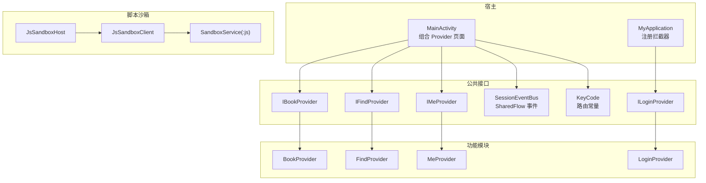

**图表来源**
- [MainActivity.kt:60-120](file://module_main/src/main/java/com/ebook/main/MainActivity.kt#L60-L120)
- [MyApplication.kt:25-40](file://module_app/src/main/java/com/ebook/MyApplication.kt#L25-L40)
- [IBookProvider.kt:1-23](file://lib_book_common/src/main/java/com/ebook/common/provider/IBookProvider.kt#L1-L23)
- [BookProvider.kt:1-16](file://module_book/src/main/java/com/ebook/book/provider/BookProvider.kt#L1-L16)
- [KeyCode.kt:1-111](file://lib_book_common/src/main/java/com/ebook/common/event/KeyCode.kt#L1-L111)
- [SessionEventBus.kt:1-44](file://lib_ebook_api/src/main/java/com/ebook/api/auth/SessionEventBus.kt#L1-L44)
- [JsSandboxHost.kt:1-60](file://lib_book_source/src/main/java/com/ebook/source/sandbox/JsSandboxHost.kt#L1-L60)
- [JsSandboxClient.kt:1-185](file://lib_book_source/src/main/java/com/ebook/source/sandbox/JsSandboxClient.kt#L1-L185)
- [SandboxService.kt:1-200](file://lib_book_source/src/main/java/com/ebook/source/sandbox/SandboxService.kt#L1-L200)

**章节来源**
- [MainActivity.kt:60-120](file://module_main/src/main/java/com/ebook/main/MainActivity.kt#L60-L120)
- [MyApplication.kt:25-40](file://module_app/src/main/java/com/ebook/MyApplication.kt#L25-L40)
- [KeyCode.kt:1-111](file://lib_book_common/src/main/java/com/ebook/common/event/KeyCode.kt#L1-L111)
- [SessionEventBus.kt:1-44](file://lib_ebook_api/src/main/java/com/ebook/api/auth/SessionEventBus.kt#L1-L44)

## 核心组件
本节聚焦三类跨模块通信机制：Provider SPI、路由系统、事件总线与沙箱进程通信。

### Provider 接口设计与生命周期
Provider 是跨模块能力的 SPI 抽象：
- 接口定义在公共库中，避免宿主对具体模块产生编译期依赖。
- 实现类使用 `@ServiceProvider` 注解，交由 TheRouter 扫描并实例化。
- 宿主通过 `TheRouter.get(Interface::class.java)` 获取实现，失败时返回 null，调用方需做空保护。
- 页面级 Provider 返回 Composable 函数，由宿主 NavHost 直接组合；ViewModel 作用域绑定调用处的 `NavBackStackEntry`。
- 非 UI 能力（如登出）以 suspend 函数形式暴露，实现类可通过 Hilt EntryPoint 桥接业务仓库。

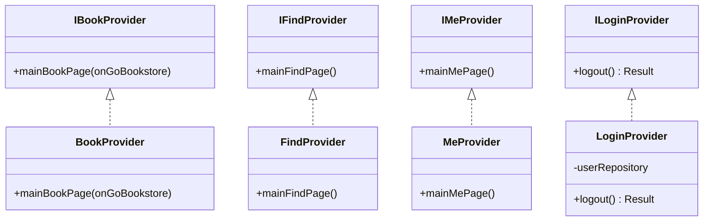

**图表来源**
- [IBookProvider.kt:1-23](file://lib_book_common/src/main/java/com/ebook/common/provider/IBookProvider.kt#L1-L23)
- [IFindProvider.kt:1-13](file://lib_book_common/src/main/java/com/ebook/common/provider/IFindProvider.kt#L1-L13)
- [IMeProvider.kt:1-13](file://lib_book_common/src/main/java/com/ebook/common/provider/IMeProvider.kt#L1-L13)
- [ILoginProvider.kt:1-19](file://lib_book_common/src/main/java/com/ebook/common/provider/ILoginProvider.kt#L1-L19)
- [BookProvider.kt:1-16](file://module_book/src/main/java/com/ebook/book/provider/BookProvider.kt#L1-L16)
- [FindProvider.kt:1-19](file://module_find/src/main/java/com/ebook/find/provider/FindProvider.kt#L1-L19)
- [MeProvider.kt:1-20](file://module_me/src/main/java/com/ebook/me/provider/MeProvider.kt#L1-L20)
- [LoginProvider.kt:1-36](file://module_login/src/main/java/com/ebook/login/provider/LoginProvider.kt#L1-L36)

**章节来源**
- [IBookProvider.kt:1-23](file://lib_book_common/src/main/java/com/ebook/common/provider/IBookProvider.kt#L1-L23)
- [ILoginProvider.kt:1-19](file://lib_book_common/src/main/java/com/ebook/common/provider/ILoginProvider.kt#L1-L19)
- [BookProvider.kt:1-16](file://module_book/src/main/java/com/ebook/book/provider/BookProvider.kt#L1-L16)
- [LoginProvider.kt:1-36](file://module_login/src/main/java/com/ebook/login/provider/LoginProvider.kt#L1-L36)

### 路由系统与拦截器链
路由声明使用 `@Route(path = ...)`，路径常量统一来自 `KeyCode`。典型场景包括：
- 活动页跳转：`TheRouter.build(KeyCode.Book.READ_PATH).navigation(context)`
- 带参数跳转：`TheRouter.build(...).with(bundle).navigation(this)`
- 需要登录的页面：通过 `params = ["needLogin", "true"]` 标记，由拦截器统一判断。

登录拦截器继承 `RouterReplaceInterceptor`，优先级为 6，逻辑如下：
- 若已登录，放行目标路由。
- 若目标不需要登录，放行。
- 否则用 `matchRouteMap` 跳转到登录页。

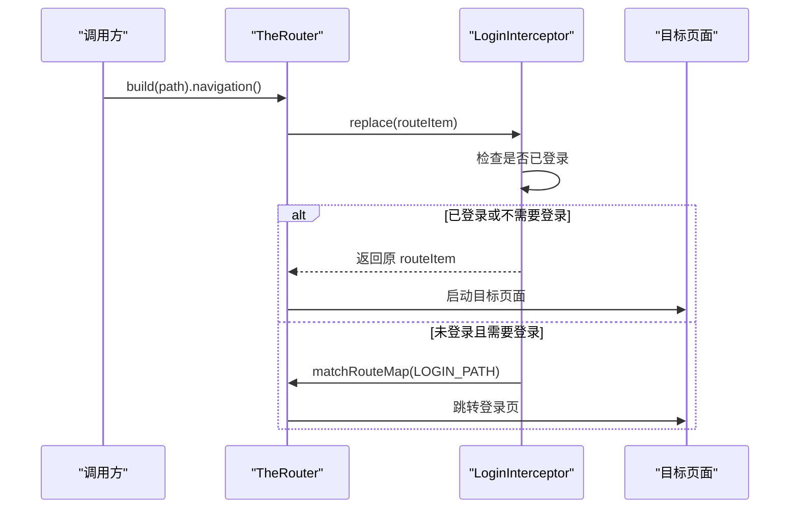

**图表来源**
- [LoginInterceptor.kt:1-42](file://lib_book_common/src/main/java/com/ebook/common/interceptor/LoginInterceptor.kt#L1-L42)
- [KeyCode.kt:1-111](file://lib_book_common/src/main/java/com/ebook/common/event/KeyCode.kt#L1-L111)
- [SplashActivity.kt:220-230](file://module_main/src/main/java/com/ebook/main/SplashActivity.kt#L220-L230)

**章节来源**
- [LoginInterceptor.kt:1-42](file://lib_book_common/src/main/java/com/ebook/common/interceptor/LoginInterceptor.kt#L1-L42)
- [KeyCode.kt:1-111](file://lib_book_common/src/main/java/com/ebook/common/event/KeyCode.kt#L1-L111)
- [SplashActivity.kt:220-230](file://module_main/src/main/java/com/ebook/main/SplashActivity.kt#L220-L230)

### 事件总线机制
会话级事件通过 `SessionEventBus` 统一管理：
- 事件类型为 sealed class，当前仅定义会话过期事件。
- 底层使用 `MutableSharedFlow`，缓冲容量为 1，支持幂等处置。
- 网络层发射事件，UI 层订阅并在主线程消费。
- 主界面订阅后统一执行“清会话 + 提示 + 跳转登录”。

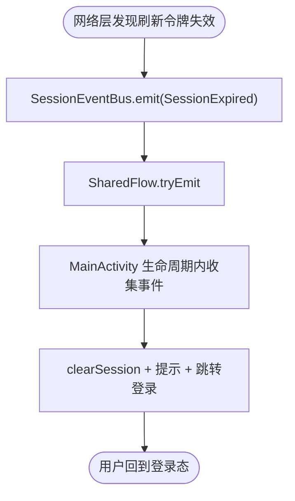

**图表来源**
- [SessionEventBus.kt:1-44](file://lib_ebook_api/src/main/java/com/ebook/api/auth/SessionEventBus.kt#L1-L44)
- [MainActivity.kt:60-90](file://module_main/src/main/java/com/ebook/main/MainActivity.kt#L60-L90)

**章节来源**
- [SessionEventBus.kt:1-44](file://lib_ebook_api/src/main/java/com/ebook/api/auth/SessionEventBus.kt#L1-L44)
- [MainActivity.kt:60-90](file://module_main/src/main/java/com/ebook/main/MainActivity.kt#L60-L90)

## 架构总览
下图展示跨模块通信的整体流程：宿主通过 Provider 组合页面，通过路由发起跨模块跳转，通过事件总线接收会话状态变化，并通过沙箱客户端执行远程脚本。

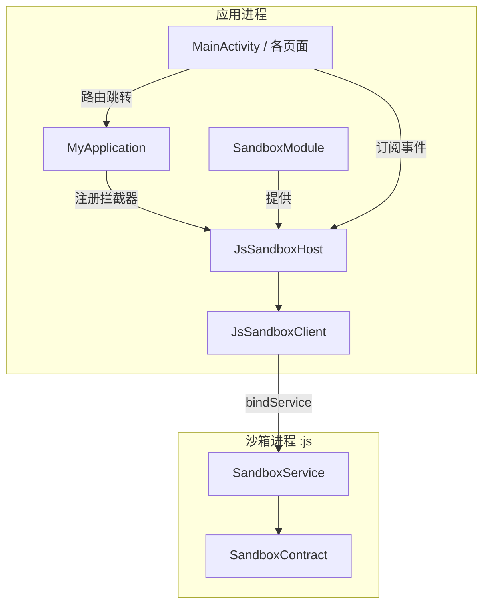

**图表来源**
- [MyApplication.kt:25-40](file://module_app/src/main/java/com/ebook/MyApplication.kt#L25-L40)
- [SandboxModule.kt:1-56](file://lib_book_common/src/main/java/com/ebook/common/di/SandboxModule.kt#L1-L56)
- [JsSandboxHost.kt:1-60](file://lib_book_source/src/main/java/com/ebook/source/sandbox/JsSandboxHost.kt#L1-L60)
- [JsSandboxClient.kt:1-185](file://lib_book_source/src/main/java/com/ebook/source/sandbox/JsSandboxClient.kt#L1-L185)
- [SandboxService.kt:1-200](file://lib_book_source/src/main/java/com/ebook/source/sandbox/SandboxService.kt#L1-L200)
- [SandboxContract.kt:1-47](file://lib_book_source/src/main/java/com/ebook/source/sandbox/SandboxContract.kt#L1-L47)

## 详细组件分析

### Provider 接口规范与实现
Provider 接口规范如下：
- 页面型 Provider 返回 Composable 函数，宿主负责组合和导航。
- 回调能力通过函数参数注入，例如书架页通过 `onGoBookstore` 回调宿主切换书城 Tab。
- 非 UI 能力暴露 suspend 函数，实现类通过 Hilt EntryPoint 获取业务对象。
- 所有 Provider 实现类必须标注 `@ServiceProvider`，由 TheRouter 管理实例化。

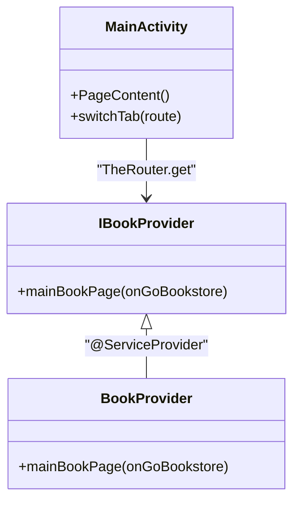

**图表来源**
- [MainActivity.kt:201-240](file://module_main/src/main/java/com/ebook/main/MainActivity.kt#L201-L240)
- [IBookProvider.kt:1-23](file://lib_book_common/src/main/java/com/ebook/common/provider/IBookProvider.kt#L1-L23)
- [BookProvider.kt:1-16](file://module_book/src/main/java/com/ebook/book/provider/BookProvider.kt#L1-L16)

**章节来源**
- [MainActivity.kt:201-240](file://module_main/src/main/java/com/ebook/main/MainActivity.kt#L201-L240)
- [IBookProvider.kt:1-23](file://lib_book_common/src/main/java/com/ebook/common/provider/IBookProvider.kt#L1-L23)
- [BookProvider.kt:1-16](file://module_book/src/main/java/com/ebook/book/provider/BookProvider.kt#L1-L16)

### 路由声明与参数传递
路由路径集中定义在 `KeyCode` 中，按模块划分命名空间：
- `/ebook/main/main`：主界面
- `/ebook/user/*`：登录相关
- `/ebook/book/*`：书架、详情、评论、阅读、下载管理
- `/ebook/find/*`：书城搜索、分类选择
- `/ebook/me/*`：设置、关于、缓存、书源管理

跳转方式：
- 简单跳转：`TheRouter.build(path).navigation()`
- 带 Bundle 参数：`TheRouter.build(path).with(bundle).navigation(context)`
- 带参数标记：`@Route(path = ..., params = ["needLogin", "true"])`

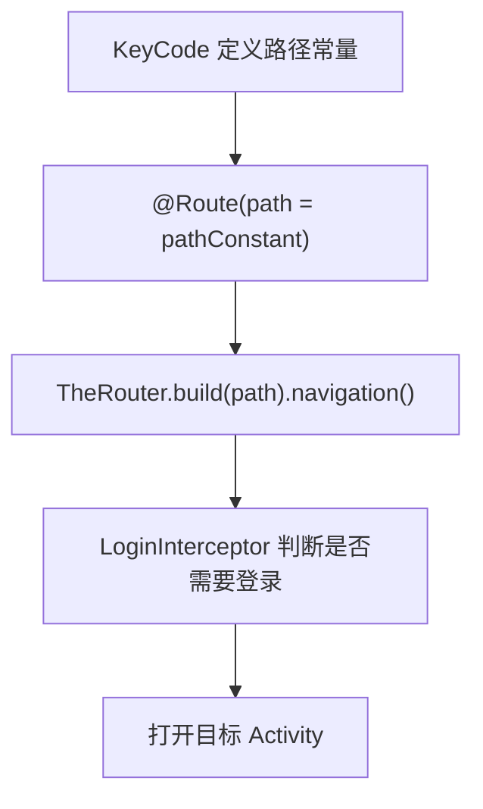

**图表来源**
- [KeyCode.kt:1-111](file://lib_book_common/src/main/java/com/ebook/common/event/KeyCode.kt#L1-L111)
- [LoginInterceptor.kt:1-42](file://lib_book_common/src/main/java/com/ebook/common/interceptor/LoginInterceptor.kt#L1-L42)

**章节来源**
- [KeyCode.kt:1-111](file://lib_book_common/src/main/java/com/ebook/common/event/KeyCode.kt#L1-L111)
- [LoginInterceptor.kt:1-42](file://lib_book_common/src/main/java/com/ebook/common/interceptor/LoginInterceptor.kt#L1-L42)

### 事件发布与订阅
事件总线的使用流程：
1. 网络层检测到会话失效时调用 `SessionEventBus.emit(SessionExpired)`。
2. `MainActivity` 在生命周期内收集事件流。
3. 收到事件后执行清理会话、提示用户、跳转登录。

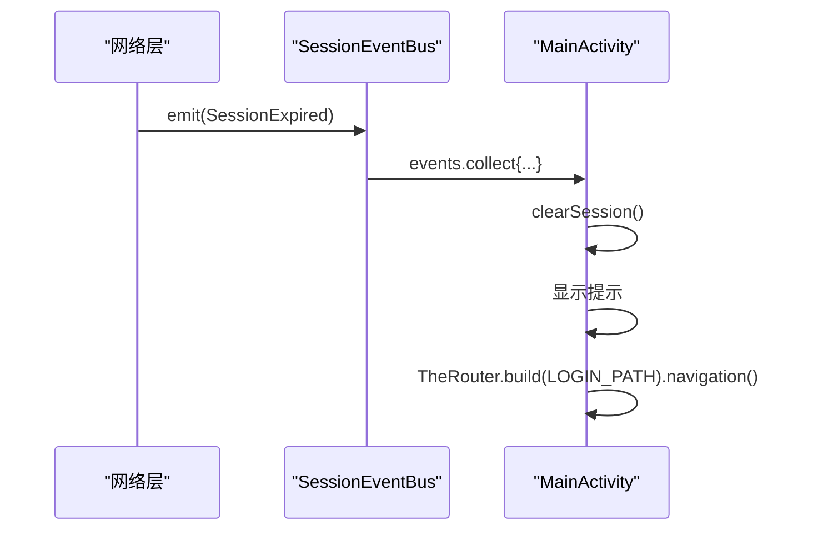

**图表来源**
- [SessionEventBus.kt:1-44](file://lib_ebook_api/src/main/java/com/ebook/api/auth/SessionEventBus.kt#L1-L44)
- [MainActivity.kt:60-90](file://module_main/src/main/java/com/ebook/main/MainActivity.kt#L60-L90)

**章节来源**
- [SessionEventBus.kt:1-44](file://lib_ebook_api/src/main/java/com/ebook/api/auth/SessionEventBus.kt#L1-L44)
- [MainActivity.kt:60-90](file://module_main/src/main/java/com/ebook/main/MainActivity.kt#L60-L90)

### 进程间通信机制
JavaScript 沙箱运行在隔离进程中，主进程与执行器之间的通信流程如下：

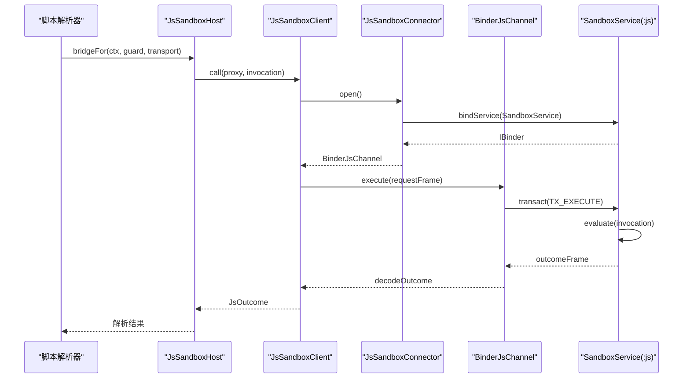

**图表来源**
- [JsSandboxHost.kt:1-60](file://lib_book_source/src/main/java/com/ebook/source/sandbox/JsSandboxHost.kt#L1-L60)
- [JsSandboxClient.kt:1-185](file://lib_book_source/src/main/java/com/ebook/source/sandbox/JsSandboxClient.kt#L1-L185)
- [JsSandboxConnector.kt:1-142](file://lib_book_source/src/main/java/com/ebook/source/sandbox/JsSandboxConnector.kt#L1-L142)
- [BinderJsChannel.kt:1-132](file://lib_book_source/src/main/java/com/ebook/source/sandbox/BinderJsChannel.kt#L1-L132)
- [SandboxService.kt:1-200](file://lib_book_source/src/main/java/com/ebook/source/sandbox/SandboxService.kt#L1-L200)

**章节来源**
- [JsSandboxHost.kt:1-60](file://lib_book_source/src/main/java/com/ebook/source/sandbox/JsSandboxHost.kt#L1-L60)
- [JsSandboxClient.kt:1-185](file://lib_book_source/src/main/java/com/ebook/source/sandbox/JsSandboxClient.kt#L1-L185)
- [JsSandboxConnector.kt:1-142](file://lib_book_source/src/main/java/com/ebook/source/sandbox/JsSandboxConnector.kt#L1-L142)
- [BinderJsChannel.kt:1-132](file://lib_book_source/src/main/java/com/ebook/source/sandbox/BinderJsChannel.kt#L1-L132)
- [SandboxService.kt:1-200](file://lib_book_source/src/main/java/com/ebook/source/sandbox/SandboxService.kt#L1-L200)

### 安全边界与进程隔离
沙箱进程的安全性由多个层次保障：
- 进程隔离：通过 `android:isolatedProcess="true"` 声明，运行时通过 `Process.isIsolated()` 检测。
- 协议校验：每次 Binder 事务都校验接口标识和协议版本。
- 数据限制：请求帧和回复帧都有字节上限，防止大对象注入。
- 主线程保护：禁止在主线程执行脚本，避免 ANR。
- 回调重入保护：防止 host 回调中再次发起沙箱调用导致死锁。

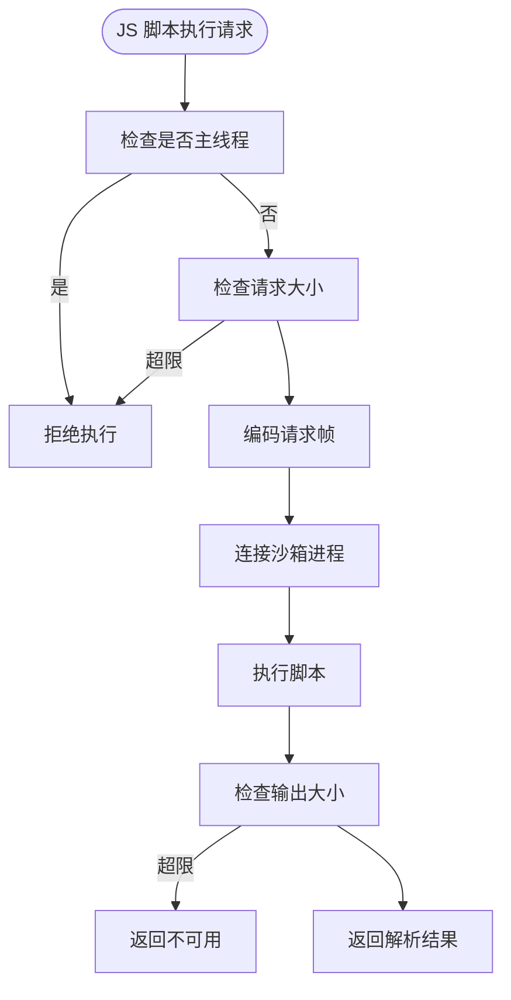

**图表来源**
- [SandboxProcess.kt:1-28](file://lib_book_source/src/main/java/com/ebook/source/sandbox/SandboxProcess.kt#L1-L28)
- [JsSandboxClient.kt:1-185](file://lib_book_source/src/main/java/com/ebook/source/sandbox/JsSandboxClient.kt#L1-L185)
- [SandboxContract.kt:1-47](file://lib_book_source/src/main/java/com/ebook/source/sandbox/SandboxContract.kt#L1-L47)

**章节来源**
- [SandboxProcess.kt:1-28](file://lib_book_source/src/main/java/com/ebook/source/sandbox/SandboxProcess.kt#L1-L28)
- [JsSandboxClient.kt:1-185](file://lib_book_source/src/main/java/com/ebook/source/sandbox/JsSandboxClient.kt#L1-L185)
- [SandboxContract.kt:1-47](file://lib_book_source/src/main/java/com/ebook/source/sandbox/SandboxContract.kt#L1-L47)

## 依赖关系分析
跨模块通信的依赖方向清晰：
- 宿主模块 `module_main` 只依赖公共接口，不直接依赖功能模块。
- 功能模块通过 `@ServiceProvider` 暴露能力，被宿主发现。
- 路由常量集中在 `lib_book_common`，所有模块引用同一份常量。
- 事件总线位于 `lib_ebook_api`，上层模块订阅，网络层发射。
- 沙箱能力通过 Hilt 装配，调用方使用可空注入，测试环境可绕过。

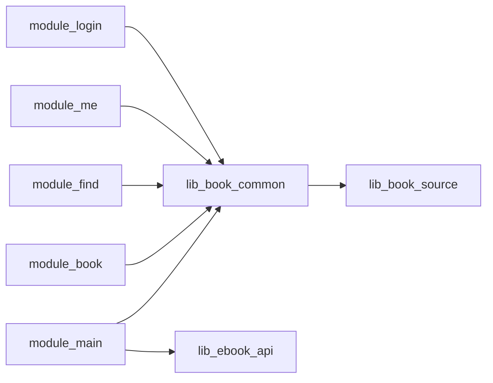

**图表来源**
- [MainActivity.kt:201-240](file://module_main/src/main/java/com/ebook/main/MainActivity.kt#L201-L240)
- [SandboxModule.kt:1-56](file://lib_book_common/src/main/java/com/ebook/common/di/SandboxModule.kt#L1-L56)

**章节来源**
- [MainActivity.kt:201-240](file://module_main/src/main/java/com/ebook/main/MainActivity.kt#L201-L240)
- [SandboxModule.kt:1-56](file://lib_book_common/src/main/java/com/ebook/common/di/SandboxModule.kt#L1-L56)

## 性能与安全性考虑
- Provider 获取采用懒加载：宿主只在组合页面时调用 `TheRouter.get`，避免启动期开销。
- 事件总线使用 `tryEmit` 丢弃重复事件，避免并发风暴阻塞。
- 沙箱执行串行化：单把锁保证一次只有一个执行任务，避免资源竞争。
- 超时控制：沙箱执行、服务绑定、网络请求都有明确超时，避免无限等待。
- 内存限制：请求帧和回复帧都有字节上限，防止大对象注入。
- 进程隔离：脚本在独立进程中执行，即使崩溃也不会影响主进程。

## 故障排查指南
常见问题及定位方法：
- Provider 为空：检查实现类是否标注 `@ServiceProvider`，宿主是否正确初始化 TheRouter。
- 路由跳转失败：确认 `KeyCode` 中的路径常量与实际 `@Route` 注解一致，检查拦截器配置。
- 会话事件未触发：检查网络层是否正确调用 `emit`，UI 层是否在生命周期内订阅。
- 沙箱进程无法连接：检查 manifest 中是否声明 `android:isolatedProcess="true"`，查看 `SandboxProcess.isInIsolatedProcess` 返回值。
- 协议版本不合：确认两侧构建产物版本一致，检查 `SandboxContract.PROTOCOL_VERSION`。

**章节来源**
- [MyApplication.kt:25-40](file://module_app/src/main/java/com/ebook/MyApplication.kt#L25-L40)
- [SandboxProcess.kt:1-28](file://lib_book_source/src/main/java/com/ebook/source/sandbox/SandboxProcess.kt#L1-L28)
- [SandboxContract.kt:1-47](file://lib_book_source/src/main/java/com/ebook/source/sandbox/SandboxContract.kt#L1-L47)

## 结论
本项目通过 Provider SPI、TheRouter 路由系统、SharedFlow 事件总线和隔离沙箱进程，实现了清晰的模块解耦通信机制。开发者应遵循以下最佳实践：
- 在公共库中定义 Provider 接口，在具体模块中实现并注册。
- 使用 `KeyCode` 中的路径常量进行路由跳转，避免硬编码字符串。
- 通过拦截器统一处理横切关注点，如登录验证。
- 使用事件总线发布全局状态变化，避免点对点通知。
- 谨慎使用沙箱进程，确保协议版本一致和数据大小限制。

这种设计使得新功能模块可以独立开发、独立测试，并通过标准接口与宿主和其他模块集成，有效降低了耦合度，提高了系统的可维护性和可扩展性。