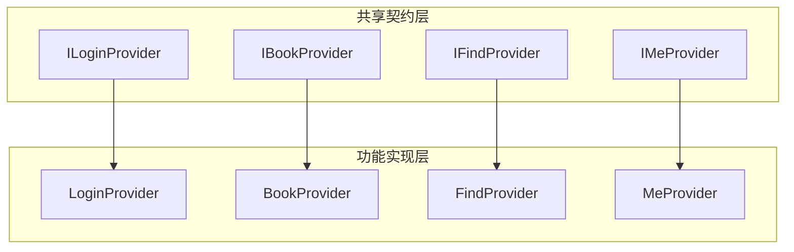
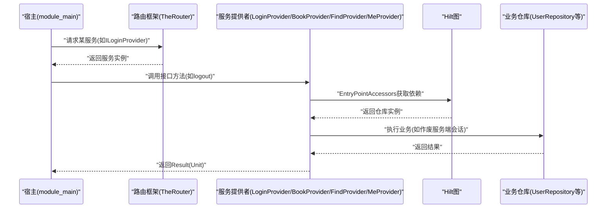
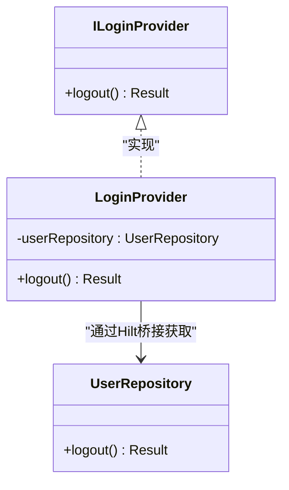
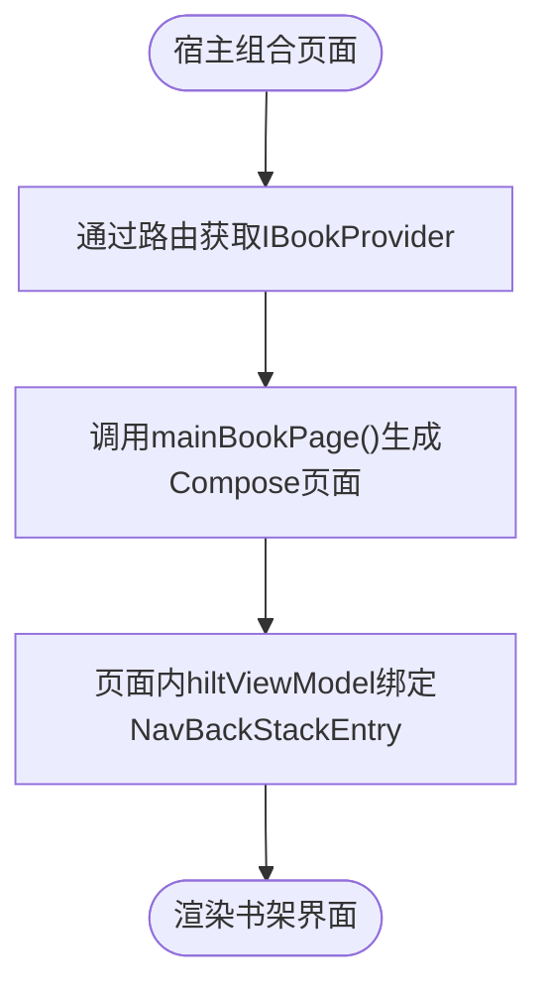
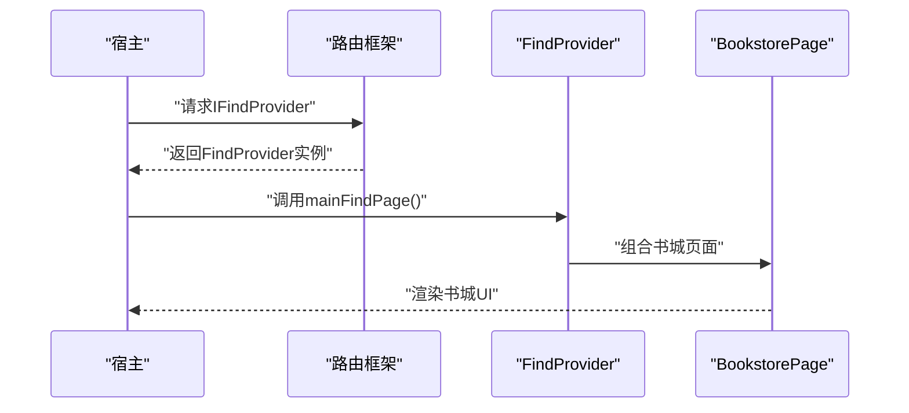
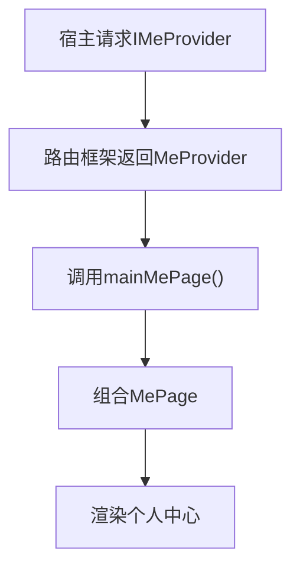
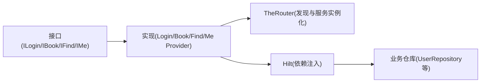

# Provider 接口模式

<cite>
**本文引用的文件**
- [ILoginProvider.kt](file://lib_book_common/src/main/java/com/ebook/common/provider/ILoginProvider.kt)
- [IBookProvider.kt](file://lib_book_common/src/main/java/com/ebook/common/provider/IBookProvider.kt)
- [IFindProvider.kt](file://lib_book_common/src/main/java/com/ebook/common/provider/IFindProvider.kt)
- [IMeProvider.kt](file://lib_book_common/src/main/java/com/ebook/common/provider/IMeProvider.kt)
- [LoginProvider.kt](file://module_login/src/main/java/com/ebook/login/provider/LoginProvider.kt)
- [BookProvider.kt](file://module_book/src/main/java/com/ebook/book/provider/BookProvider.kt)
- [FindProvider.kt](file://module_find/src/main/java/com/ebook/find/provider/FindProvider.kt)
- [MeProvider.kt](file://module_me/src/main/java/com/ebook/me/provider/MeProvider.kt)
</cite>

## 目录
1. [引言](#引言)
2. [项目结构](#项目结构)
3. [核心组件](#核心组件)
4. [架构总览](#架构总览)
5. [详细组件分析](#详细组件分析)
6. [依赖关系分析](#依赖关系分析)
7. [性能与可维护性](#性能与可维护性)
8. [故障排查指南](#故障排查指南)
9. [结论](#结论)
10. [附录：扩展新 Provider 的完整指南](#附录扩展新-provider的完整指南)

## 引言
本文件系统性阐述项目中“Provider 接口模式”的设计与实践，聚焦跨模块服务暴露机制。通过“接口在共享库中定义、实现位于功能模块、由路由框架动态加载”的方式，达成以下目标：
- 能力边界清晰：仅暴露服务端能力或页面级组合函数，不泄露内部实现细节
- 单点负责：本地会话清理集中在用户会话管理器，避免多处重复逻辑
- 低耦合：调用方只依赖接口，不感知具体模块存在；独立运行下允许空实现，避免强依赖崩溃
- 可插拔：新增 Provider 只需按约定实现并注册，宿主无需改动

## 项目结构
本项目采用多模块架构，Provider 相关代码遵循统一组织方式：
- 接口定义集中于共享库 lib_book_common 的 provider 包，作为跨模块契约
- 各业务模块在各自 provider 包下提供实现，并通过注解标记为可被路由发现的服务提供者
- 宿主（module_main）通过统一入口获取这些 Provider，组合其 Compose 页面或调用其服务端能力

图表来源
- [ILoginProvider.kt:1-19](file://lib_book_common/src/main/java/com/ebook/common/provider/ILoginProvider.kt#L1-L19)
- [IBookProvider.kt:1-13](file://lib_book_common/src/main/java/com/ebook/common/provider/IBookProvider.kt#L1-L13)
- [IFindProvider.kt:1-13](file://lib_book_common/src/main/java/com/ebook/common/provider/IFindProvider.kt#L1-L13)
- [IMeProvider.kt:1-13](file://lib_book_common/src/main/java/com/ebook/common/provider/IMeProvider.kt#L1-L13)
- [LoginProvider.kt:1-35](file://module_login/src/main/java/com/ebook/login/provider/LoginProvider.kt#L1-L35)
- [BookProvider.kt:1-15](file://module_book/src/main/java/com/ebook/book/provider/BookProvider.kt#L1-L15)
- [FindProvider.kt:1-19](file://module_find/src/main/java/com/ebook/find/provider/FindProvider.kt#L1-L19)
- [MeProvider.kt:1-20](file://module_me/src/main/java/com/ebook/me/provider/MeProvider.kt#L1-L20)

章节来源
- [ILoginProvider.kt:1-19](file://lib_book_common/src/main/java/com/ebook/common/provider/ILoginProvider.kt#L1-L19)
- [IBookProvider.kt:1-13](file://lib_book_common/src/main/java/com/ebook/common/provider/IBookProvider.kt#L1-L13)
- [IFindProvider.kt:1-13](file://lib_book_common/src/main/java/com/ebook/common/provider/IFindProvider.kt#L1-L13)
- [IMeProvider.kt:1-13](file://lib_book_common/src/main/java/com/ebook/common/provider/IMeProvider.kt#L1-L13)
- [LoginProvider.kt:1-35](file://module_login/src/main/java/com/ebook/login/provider/LoginProvider.kt#L1-L35)
- [BookProvider.kt:1-15](file://module_book/src/main/java/com/ebook/book/provider/BookProvider.kt#L1-L15)
- [FindProvider.kt:1-19](file://module_find/src/main/java/com/ebook/find/provider/FindProvider.kt#L1-L19)
- [MeProvider.kt:1-20](file://module_me/src/main/java/com/ebook/me/provider/MeProvider.kt#L1-L20)

## 核心组件
- ILoginProvider：登录域对外暴露的服务端能力（如登出），强调本地会话清理由用户会话管理器单点负责
- IBookProvider：书架模块页面级服务，返回 Compose 页面供宿主直接组合
- IFindProvider：书城模块页面级服务，返回 Compose 页面供宿主直接组合
- IMeProvider：个人中心模块页面级服务，返回 Compose 页面供宿主直接组合

这些接口职责单一、面向调用方稳定，屏蔽了具体模块与实现细节，使宿主与业务模块之间解耦。

章节来源
- [ILoginProvider.kt:1-19](file://lib_book_common/src/main/java/com/ebook/common/provider/ILoginProvider.kt#L1-L19)
- [IBookProvider.kt:1-13](file://lib_book_common/src/main/java/com/ebook/common/provider/IBookProvider.kt#L1-L13)
- [IFindProvider.kt:1-13](file://lib_book_common/src/main/java/com/ebook/common/provider/IFindProvider.kt#L1-L13)
- [IMeProvider.kt:1-13](file://lib_book_common/src/main/java/com/ebook/common/provider/IMeProvider.kt#L1-L13)

## 架构总览
Provider 模式在本项目中的工作流如下：
- 接口定义在共享库，作为跨模块契约
- 各功能模块实现接口，并使用注解声明为服务提供者
- 宿主通过路由框架动态发现并实例化服务提供者
- 对于需要 Hilt 管理的依赖（如仓库），Provider 通过 EntryPointAccessors 从 Hilt 图中桥接获取

图表来源
- [LoginProvider.kt:1-35](file://module_login/src/main/java/com/ebook/login/provider/LoginProvider.kt#L1-L35)
- [BookProvider.kt:1-15](file://module_book/src/main/java/com/ebook/book/provider/BookProvider.kt#L1-L15)
- [FindProvider.kt:1-19](file://module_find/src/main/java/com/ebook/find/provider/FindProvider.kt#L1-L19)
- [MeProvider.kt:1-20](file://module_me/src/main/java/com/ebook/me/provider/MeProvider.kt#L1-L20)

## 详细组件分析

### ILoginProvider 与 LoginProvider
- 职责分离：ILoginProvider 仅暴露服务端登出能力；本地会话清理由用户会话管理器负责，确保单点管理生命周期
- 独立运行策略：当功能模块未参与集成构建时，该服务可能不可用，调用方需容忍空实现或不存在的情况
- Hilt 集成：LoginProvider 通过 EntryPointAccessors 从 Hilt 图中获取 UserRepository，从而在不直接依赖模块的情况下调用后端能力

图表来源
- [ILoginProvider.kt:1-19](file://lib_book_common/src/main/java/com/ebook/common/provider/ILoginProvider.kt#L1-L19)
- [LoginProvider.kt:1-35](file://module_login/src/main/java/com/ebook/login/provider/LoginProvider.kt#L1-L35)

章节来源
- [ILoginProvider.kt:1-19](file://lib_book_common/src/main/java/com/ebook/common/provider/ILoginProvider.kt#L1-L19)
- [LoginProvider.kt:1-35](file://module_login/src/main/java/com/ebook/login/provider/LoginProvider.kt#L1-L35)

### IBookProvider 与 BookProvider
- 职责：暴露书架主页面（Compose）给宿主组合，避免宿主直接依赖具体 Activity 或 Fragment
- 作用域：每次组合创建新的页面实例，ViewModel 作用域由宿主的导航栈条目决定

图表来源
- [IBookProvider.kt:1-13](file://lib_book_common/src/main/java/com/ebook/common/provider/IBookProvider.kt#L1-L13)
- [BookProvider.kt:1-15](file://module_book/src/main/java/com/ebook/book/provider/BookProvider.kt#L1-L15)

章节来源
- [IBookProvider.kt:1-13](file://lib_book_common/src/main/java/com/ebook/common/provider/IBookProvider.kt#L1-L13)
- [BookProvider.kt:1-15](file://module_book/src/main/java/com/ebook/book/provider/BookProvider.kt#L1-L15)

### IFindProvider 与 FindProvider
- 职责：暴露书城主页面（Compose）给宿主组合
- 设计要点：页面级服务，返回 Compose 组合函数，便于宿主统一管理导航与状态

图表来源
- [IFindProvider.kt:1-13](file://lib_book_common/src/main/java/com/ebook/common/provider/IFindProvider.kt#L1-L13)
- [FindProvider.kt:1-19](file://module_find/src/main/java/com/ebook/find/provider/FindProvider.kt#L1-L19)

章节来源
- [IFindProvider.kt:1-13](file://lib_book_common/src/main/java/com/ebook/common/provider/IFindProvider.kt#L1-L13)
- [FindProvider.kt:1-19](file://module_find/src/main/java/com/ebook/find/provider/FindProvider.kt#L1-L19)

### IMeProvider 与 MeProvider
- 职责：暴露个人中心主页面（Compose）给宿主组合
- 设计要点：与书城、书架一致，统一以 Provider 形式暴露页面，保持架构一致性

图表来源
- [IMeProvider.kt:1-13](file://lib_book_common/src/main/java/com/ebook/common/provider/IMeProvider.kt#L1-L13)
- [MeProvider.kt:1-20](file://module_me/src/main/java/com/ebook/me/provider/MeProvider.kt#L1-L20)

章节来源
- [IMeProvider.kt:1-13](file://lib_book_common/src/main/java/com/ebook/common/provider/IMeProvider.kt#L1-L13)
- [MeProvider.kt:1-20](file://module_me/src/main/java/com/ebook/me/provider/MeProvider.kt#L1-L20)

## 依赖关系分析
- 接口与实现的松耦合：调用方仅依赖接口，不感知具体模块
- TheRouter 的作用：动态发现并实例化带注解的服务提供者
- Hilt 的桥接：Provider 通过 EntryPointAccessors 获取 Hilt 管理的依赖（如仓库），避免直接模块依赖

图表来源
- [ILoginProvider.kt:1-19](file://lib_book_common/src/main/java/com/ebook/common/provider/ILoginProvider.kt#L1-L19)
- [IBookProvider.kt:1-13](file://lib_book_common/src/main/java/com/ebook/common/provider/IBookProvider.kt#L1-L13)
- [IFindProvider.kt:1-13](file://lib_book_common/src/main/java/com/ebook/common/provider/IFindProvider.kt#L1-L13)
- [IMeProvider.kt:1-13](file://lib_book_common/src/main/java/com/ebook/common/provider/IMeProvider.kt#L1-L13)
- [LoginProvider.kt:1-35](file://module_login/src/main/java/com/ebook/login/provider/LoginProvider.kt#L1-L35)
- [BookProvider.kt:1-15](file://module_book/src/main/java/com/ebook/book/provider/BookProvider.kt#L1-L15)
- [FindProvider.kt:1-19](file://module_find/src/main/java/com/ebook/find/provider/FindProvider.kt#L1-L19)
- [MeProvider.kt:1-20](file://module_me/src/main/java/com/ebook/me/provider/MeProvider.kt#L1-L20)

章节来源
- [LoginProvider.kt:1-35](file://module_login/src/main/java/com/ebook/login/provider/LoginProvider.kt#L1-L35)
- [BookProvider.kt:1-15](file://module_book/src/main/java/com/ebook/book/provider/BookProvider.kt#L1-L15)
- [FindProvider.kt:1-19](file://module_find/src/main/java/com/ebook/find/provider/FindProvider.kt#L1-L19)
- [MeProvider.kt:1-20](file://module_me/src/main/java/com/ebook/me/provider/MeProvider.kt#L1-L20)

## 性能与可维护性
- 接口最小化：每个 Provider 仅暴露必要能力，降低调用方认知负担
- 延迟初始化：Composable 页面按需组合，避免启动时全量加载
- 依赖桥接：通过 EntryPointAccessors 在运行时获取 Hilt 依赖，减少编译期耦合
- 可扩展性：新增 Provider 只需实现接口并注册，不影响现有调用方

## 故障排查指南
- 独立运行模式下服务缺失：若功能模块未参与构建，对应 Provider 可能为空，调用方应做空实现处理或降级
- 路由未找到：检查服务是否已正确注解并参与路由扫描
- Hilt 注入失败：确认 EntryPointAccessors 对应的入口点是否存在，且依赖已正确装配
- 会话清理不一致：确保本地会话清理统一通过用户会话管理器执行，避免多处重复逻辑导致状态不一致

章节来源
- [ILoginProvider.kt:1-19](file://lib_book_common/src/main/java/com/ebook/common/provider/ILoginProvider.kt#L1-L19)
- [LoginProvider.kt:1-35](file://module_login/src/main/java/com/ebook/login/provider/LoginProvider.kt#L1-L35)

## 结论
Provider 接口模式在本项目中有效实现了跨模块服务暴露与解耦。通过接口契约、注解注册、路由发现与 Hilt 桥接，既保证了模块化开发的灵活性，又维持了系统的可维护性与扩展性。遵循该模式，团队可以安全地演进架构，逐步引入新功能而不破坏现有调用链。

## 附录：扩展新 Provider 的完整指南

### 步骤一：设计接口
- 在共享库 lib_book_common 的 provider 包中新增接口
- 明确职责边界：仅暴露服务端能力或页面级组合函数
- 编写 KDoc：说明用途、参数、返回值、异常行为

章节来源
- [ILoginProvider.kt:1-19](file://lib_book_common/src/main/java/com/ebook/common/provider/ILoginProvider.kt#L1-L19)
- [IBookProvider.kt:1-13](file://lib_book_common/src/main/java/com/ebook/common/provider/IBookProvider.kt#L1-L13)
- [IFindProvider.kt:1-13](file://lib_book_common/src/main/java/com/ebook/common/provider/IFindProvider.kt#L1-L13)
- [IMeProvider.kt:1-13](file://lib_book_common/src/main/java/com/ebook/common/provider/IMeProvider.kt#L1-L13)

### 步骤二：实现接口
- 在对应功能模块的 provider 包中创建实现类
- 使用注解声明为服务提供者
- 如需 Hilt 依赖，通过 EntryPointAccessors 从 Hilt 图中获取
- 实现逻辑尽量简洁，复杂逻辑下沉到仓库或服务层

章节来源
- [LoginProvider.kt:1-35](file://module_login/src/main/java/com/ebook/login/provider/LoginProvider.kt#L1-L35)
- [BookProvider.kt:1-15](file://module_book/src/main/java/com/ebook/book/provider/BookProvider.kt#L1-L15)
- [FindProvider.kt:1-19](file://module_find/src/main/java/com/ebook/find/provider/FindProvider.kt#L1-L19)
- [MeProvider.kt:1-20](file://module_me/src/main/java/com/ebook/me/provider/MeProvider.kt#L1-L20)

### 步骤三：注册与发现
- 确保注解配置正确，参与路由扫描
- 验证路由表生成无误，服务可被动态发现
- 在宿主中通过统一入口获取服务实例

### 步骤四：测试注意事项
- 单元测试：验证接口实现逻辑正确性
- 集成测试：验证路由发现与服务实例化
- 独立运行测试：验证空实现或降级路径不会导致崩溃
- Mock 数据源：为网络或外部依赖提供模拟实现，确保测试稳定性