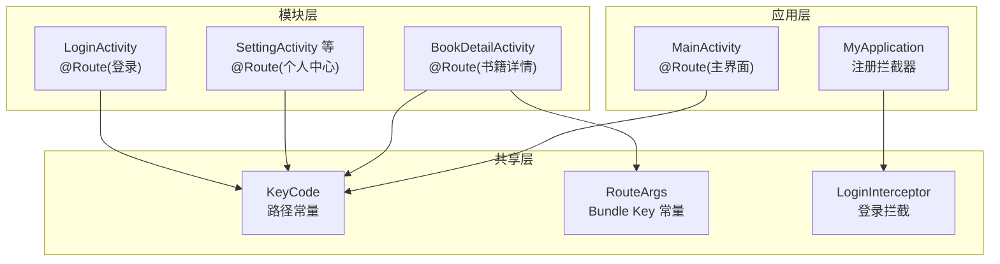
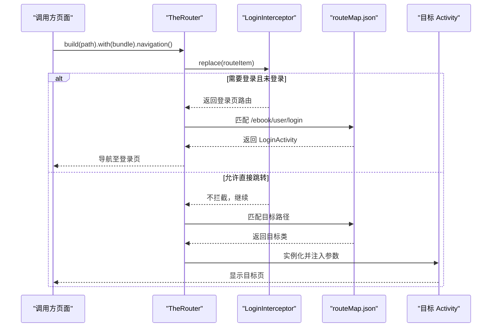
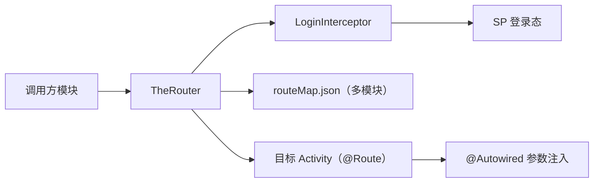

# TheRouter 路由系统

<cite>
**本文引用的文件**   
- [RouteArgs.kt](file://lib_book_common/src/main/java/com/ebook/common/event/RouteArgs.kt)
- [KeyCode.kt](file://lib_book_common/src/main/java/com/ebook/common/event/KeyCode.kt)
- [LoginInterceptor.kt](file://lib_book_common/src/main/java/com/ebook/common/interceptor/LoginInterceptor.kt)
- [MyApplication.kt](file://module_app/src/main/java/com/ebook/MyApplication.kt)
- [MainActivity.kt](file://module_main/src/main/java/com/ebook/main/MainActivity.kt)
- [BookDetailActivity.kt](file://module_book/src/main/java/com/ebook/book/BookDetailActivity.kt)
- [routeMap.json（module_me）](file://module_me/src/main/assets/therouter/routeMap.json)
- [routeMap.json（module_book）](file://module_book/src/main/assets/therouter/routeMap.json)
- [routeMap.json（module_login）](file://module_login/src/main/assets/therouter/routeMap.json)
- [routeMap.json（module_find）](file://module_find/src/main/assets/therouter/routeMap.json)
- [routeMap.json（module_main）](file://module_main/src/main/assets/therouter/routeMap.json)
</cite>

## 目录
1. [简介](#简介)
2. [项目结构](#项目结构)
3. [核心组件](#核心组件)
4. [架构总览](#架构总览)
5. [详细组件分析](#详细组件分析)
6. [依赖关系分析](#依赖关系分析)
7. [性能与构建特性](#性能与构建特性)
8. [故障排查指南](#故障排查指南)
9. [结论](#结论)

## 简介
本仓库使用 TheRouter 实现跨模块页面跳转与服务发现。通过在目标 Activity 上标注 @Route，并在应用启动时注册拦截器，实现“路径到类”的运行时解析、参数自动注入、登录态拦截以及独立模式下的占位兼容。跨模块传参统一通过 RouteArgs 常量集中管理 Bundle key，避免字符串散写导致的运行时丢参问题。

## 项目结构
TheRouter 在本仓库中的落地方式如下：
- 路由路径常量集中在 KeyCode，所有模块通过该接口引用路径，保证路径唯一且可全局检索。
- 各功能模块在自身 assets/therouter/routeMap.json 中声明路由表（由编译期处理器生成），运行时由 TheRouter 加载合并。
- 登录拦截在 Application 中注册 RouterReplaceInterceptor，统一处理未登录访问受保护页面的场景。
- 业务页面使用 TheRouter.build(path).with(bundle).navigation(context) 发起跳转；目标页通过 @Autowired(name=...) 接收参数。

图表来源
- [MyApplication.kt:20-44](file://module_app/src/main/java/com/ebook/MyApplication.kt#L20-L44)
- [MainActivity.kt:57-59](file://module_main/src/main/java/com/ebook/main/MainActivity.kt#L57-L59)
- [BookDetailActivity.kt:53-68](file://module_book/src/main/java/com/ebook/book/BookDetailActivity.kt#L53-L68)
- [LoginInterceptor.kt:14-42](file://lib_book_common/src/main/java/com/ebook/common/interceptor/LoginInterceptor.kt#L14-L42)
- [KeyCode.kt:4-104](file://lib_book_common/src/main/java/com/ebook/common/event/KeyCode.kt#L4-L104)
- [RouteArgs.kt:1-33](file://lib_book_common/src/main/java/com/ebook/common/event/RouteArgs.kt#L1-L33)

章节来源
- [MyApplication.kt:20-44](file://module_app/src/main/java/com/ebook/MyApplication.kt#L20-L44)
- [MainActivity.kt:57-59](file://module_main/src/main/java/com/ebook/main/MainActivity.kt#L57-L59)
- [BookDetailActivity.kt:53-68](file://module_book/src/main/java/com/ebook/book/BookDetailActivity.kt#L53-L68)
- [LoginInterceptor.kt:14-42](file://lib_book_common/src/main/java/com/ebook/common/interceptor/LoginInterceptor.kt#L14-L42)
- [KeyCode.kt:4-104](file://lib_book_common/src/main/java/com/ebook/common/event/KeyCode.kt#L4-L104)
- [RouteArgs.kt:1-33](file://lib_book_common/src/main/java/com/ebook/common/event/RouteArgs.kt#L1-L33)

## 核心组件
- 路径常量：KeyCode 定义全仓统一的路径常量，如 /ebook/user/login、/ebook/book/detail、/ebook/me/setting 等，避免硬编码字符串散落。
- 参数常量：RouteArgs 集中定义跨模块传递的 Bundle key，如 chapterUrl、chapterName、bookName、commentKey、primaryCommentKey、noteUrl 等，确保发送方与接收方一致。
- 路由表：每个模块在 assets/therouter/routeMap.json 声明路由条目，包含 path、className、action、description、params 等字段。
- 拦截器：LoginInterceptor 在跳转过程中根据 needLogin 标志与登录状态决定是否替换为登录页。
- 应用初始化：MyApplication 在 onCreate 中注册拦截器，使全局生效。

章节来源
- [KeyCode.kt:4-104](file://lib_book_common/src/main/java/com/ebook/common/event/KeyCode.kt#L4-L104)
- [RouteArgs.kt:1-33](file://lib_book_common/src/main/java/com/ebook/common/event/RouteArgs.kt#L1-L33)
- [LoginInterceptor.kt:14-42](file://lib_book_common/src/main/java/com/ebook/common/interceptor/LoginInterceptor.kt#L14-L42)
- [MyApplication.kt:20-44](file://module_app/src/main/java/com/ebook/MyApplication.kt#L20-L44)

## 架构总览
下图展示了从调用方发起路由跳转到目标页的参数注入与拦截流程，以及与 routeMap 的关系。

图表来源
- [MainActivity.kt:57-59](file://module_main/src/main/java/com/ebook/main/MainActivity.kt#L57-L59)
- [BookDetailActivity.kt:53-68](file://module_book/src/main/java/com/ebook/book/BookDetailActivity.kt#L53-L68)
- [LoginInterceptor.kt:14-42](file://lib_book_common/src/main/java/com/ebook/common/interceptor/LoginInterceptor.kt#L14-L42)
- [routeMap.json（module_me）:1-30](file://module_me/src/main/assets/therouter/routeMap.json#L1-L30)

## 详细组件分析

### 注解与路由配置
- @Route：标注在 Activity 上，path 来自 KeyCode 常量，例如详情页与主界面均通过 @Route 声明路径。
- @Autowired：在目标 Activity 字段上使用 name 指定键名，TheRouter 在构造或注入阶段将 Bundle 值映射到字段。
- routeMap.json：每个模块的 assets/therouter/routeMap.json 描述该模块暴露的路由项，包含 path、className、action、description、params（如 needLogin）。

示例说明（以路径与注入为例）：
- 详情页使用 @Route(path = KeyCode.Book.DETAIL_PATH)，并通过 @Autowired(name="from"/"data"/"data_key") 接收参数。
- 个人中心设置页在 module_me 的 routeMap.json 中声明 path 与 className，params 可标记 needLogin。

章节来源
- [BookDetailActivity.kt:53-68](file://module_book/src/main/java/com/ebook/book/BookDetailActivity.kt#L53-L68)
- [MainActivity.kt:57-59](file://module_main/src/main/java/com/ebook/main/MainActivity.kt#L57-L59)
- [routeMap.json（module_me）:1-30](file://module_me/src/main/assets/therouter/routeMap.json#L1-L30)

### 参数传递与 RouteArgs 设计
- RouteArgs 集中管理跨模块 Bundle key，如 chapterUrl、chapterName、bookName、commentKey、primaryCommentKey、noteUrl。
- 好处：编译期可通过引用常量检查，避免手写字符串导致的路径不一致或运行时静默丢参。
- 使用方式：发送方通过 with(Bundle{ putString(RouteArgs.XXX, value) }) 传递，接收方通过 @Autowired(name="...") 获取。

章节来源
- [RouteArgs.kt:1-33](file://lib_book_common/src/main/java/com/ebook/common/event/RouteArgs.kt#L1-L33)
- [BookDetailActivity.kt:53-68](file://module_book/src/main/java/com/ebook/book/BookDetailActivity.kt#L53-L68)

### 路由拦截与登录态控制
- 拦截器：LoginInterceptor 继承 RouterReplaceInterceptor，优先级为 6，在每次跳转前执行。
- 逻辑：读取当前是否已登录；若目标路由 extras 中包含 needLogin=true 且未登录，则替换为登录页路由；否则放行。
- 注册：MyApplication.onCreate 中 addRouterReplaceInterceptor(LoginInterceptor()) 完成全局注册。

章节来源
- [LoginInterceptor.kt:14-42](file://lib_book_common/src/main/java/com/ebook/common/interceptor/LoginInterceptor.kt#L14-L42)
- [MyApplication.kt:20-44](file://module_app/src/main/java/com/ebook/MyApplication.kt#L20-L44)

### 路由表结构与生成机制
- 位置：每个模块的 src/main/assets/therouter/routeMap.json。
- 结构：数组元素包含 path、className、action、description、params（如 needLogin）。
- 生成：编译期 TheRouter 扫描带 @Route 的类，写入对应模块的 routeMap.json；当新增/改动路由后需再次构建，APK 才会携带最新路由表。
- 合并：运行时各模块的 routeMap.json 会被 TheRouter 合并，形成全局路由表用于查找。

章节来源
- [routeMap.json（module_me）:1-30](file://module_me/src/main/assets/therouter/routeMap.json#L1-L30)
- [routeMap.json（module_book）](file://module_book/src/main/assets/therouter/routeMap.json)
- [routeMap.json（module_login）](file://module_login/src/main/assets/therouter/routeMap.json)
- [routeMap.json（module_find）](file://module_find/src/main/assets/therouter/routeMap.json)
- [routeMap.json（module_main）](file://module_main/src/main/assets/therouter/routeMap.json)

### 跨模块路由的实现原理
- 注册：模块通过 @Route 声明路径，编译期生成 routeMap.json；应用启动时 TheRouter 加载合并。
- 查找：TheRouter.build(path) 匹配 routeMap 中的 path，找到对应 className。
- 调用：实例化目标 Activity，按 @Autowired(name=...) 将 Bundle 参数注入字段。
- 拦截：在执行跳转前经过 LoginInterceptor，可能替换为目标页或登录页。

章节来源
- [MainActivity.kt:57-59](file://module_main/src/main/java/com/ebook/main/MainActivity.kt#L57-L59)
- [BookDetailActivity.kt:53-68](file://module_book/src/main/java/com/ebook/book/BookDetailActivity.kt#L53-L68)
- [LoginInterceptor.kt:14-42](file://lib_book_common/src/main/java/com/ebook/common/interceptor/LoginInterceptor.kt#L14-L42)

### 独立模式下路由丢失的处理策略与占位宿主
- 现象：当某模块以 isModule=true 独立运行时，其他模块的路由不存在，TheRouter 找不到路由只会记日志，不会崩溃。
- 策略：在独立模式的测试/调试宿主（src/main/test/debug）中提供同名路径的占位 Activity，承接这些路由，保证独立运行时的交互完整。
- 注意：新增/改动 @Route 后，需再次构建以使 routeMap 资产生效。

章节来源
- [routeMap.json（module_me）:1-30](file://module_me/src/main/assets/therouter/routeMap.json#L1-L30)

## 依赖关系分析

图表来源
- [MyApplication.kt:20-44](file://module_app/src/main/java/com/ebook/MyApplication.kt#L20-L44)
- [LoginInterceptor.kt:14-42](file://lib_book_common/src/main/java/com/ebook/common/interceptor/LoginInterceptor.kt#L14-L42)
- [routeMap.json（module_me）:1-30](file://module_me/src/main/assets/therouter/routeMap.json#L1-L30)
- [BookDetailActivity.kt:53-68](file://module_book/src/main/java/com/ebook/book/BookDetailActivity.kt#L53-L68)

章节来源
- [MyApplication.kt:20-44](file://module_app/src/main/java/com/ebook/MyApplication.kt#L20-L44)
- [LoginInterceptor.kt:14-42](file://lib_book_common/src/main/java/com/ebook/common/interceptor/LoginInterceptor.kt#L14-L42)
- [routeMap.json（module_me）:1-30](file://module_me/src/main/assets/therouter/routeMap.json#L1-L30)
- [BookDetailActivity.kt:53-68](file://module_book/src/main/java/com/ebook/book/BookDetailActivity.kt#L53-L68)

## 性能与构建特性
- 编译期生成：routeMap.json 由 TheRouter 在编译期扫描生成，减少运行时反射开销，提高路由匹配效率。
- 独立模式优化：独立运行时仅编译本模块与必要依赖，路由缺失由占位宿主承接，避免崩溃。
- 资源合并：各模块的 routeMap.json 在运行时合并，保持全局路由一致性。

[本节为通用指导，无需特定文件来源]

## 故障排查指南
- 路由冲突/路径重复
  - 症状：多个路径相同但指向不同类，或同一模块内重复 path。
  - 排查：搜索 KeyCode 中定义的常量，确认无重复；检查各模块 routeMap.json 是否存在重复 path。
  - 解决：统一路径命名规范，必要时在 KeyCode 中增加细分常量（如 /ebook/book/comment vs /ebook/book/detail）。

- 路由丢失（独立模式）
  - 症状：独立运行时点击某个入口无响应或闪退（取决于实现）。
  - 排查：确认该路径是否在目标模块的 routeMap.json 中；若独立运行，是否在 test/debug 提供占位 Activity。
  - 解决：补充占位路由或在集成模式中引入依赖模块。

- 参数类型不匹配
  - 症状：目标页拿到空值或类型转换异常。
  - 排查：核对发送方 with(Bundle) 使用的 key 是否为 RouteArgs 中的常量；目标页 @Autowired(name=...) 的 name 是否与发送方一致；类型是否匹配（如 String/Entity）。
  - 解决：统一使用 RouteArgs 常量；对复杂对象采用序列化或 ID+数据缓存（如 BitIntentDataManager）。

- 登录拦截异常
  - 症状：需要登录的页面被反复重定向到登录页，或不需要登录的页面也被拦截。
  - 排查：检查 routeMap.json 中 params.needLogin 是否正确；确认 LoginInterceptor 已注册；验证 SP 登录态键值。
  - 解决：修正 needLogin 标志；确保拦截器注册顺序与优先级合理。

- 路由表未生效
  - 症状：新增路由无效。
  - 排查：确认已重新构建；检查对应模块的 routeMap.json 是否更新。
  - 解决：重新构建一次，使 TheRouter 回写路由表。

章节来源
- [LoginInterceptor.kt:14-42](file://lib_book_common/src/main/java/com/ebook/common/interceptor/LoginInterceptor.kt#L14-L42)
- [routeMap.json（module_me）:1-30](file://module_me/src/main/assets/therouter/routeMap.json#L1-L30)
- [BookDetailActivity.kt:53-68](file://module_book/src/main/java/com/ebook/book/BookDetailActivity.kt#L53-L68)
- [MyApplication.kt:20-44](file://module_app/src/main/java/com/ebook/MyApplication.kt#L20-L44)

## 结论
本项目的 TheRouter 方案通过“常量化的路径 + 集中化的参数键 + 编译期生成的路由表 + 可插拔的拦截器”，实现了安全、可维护的跨模块路由体系。遵循 KeyCode 与 RouteArgs 的约定，结合独立模式占位宿主的策略，可在多模块、多形态（集成/独立）下稳定工作。建议在新增路由时同步更新 KeyCode、routeMap（自动生成）、RouteArgs（如需新 key）以及独立模式占位，以保证全链路一致性。