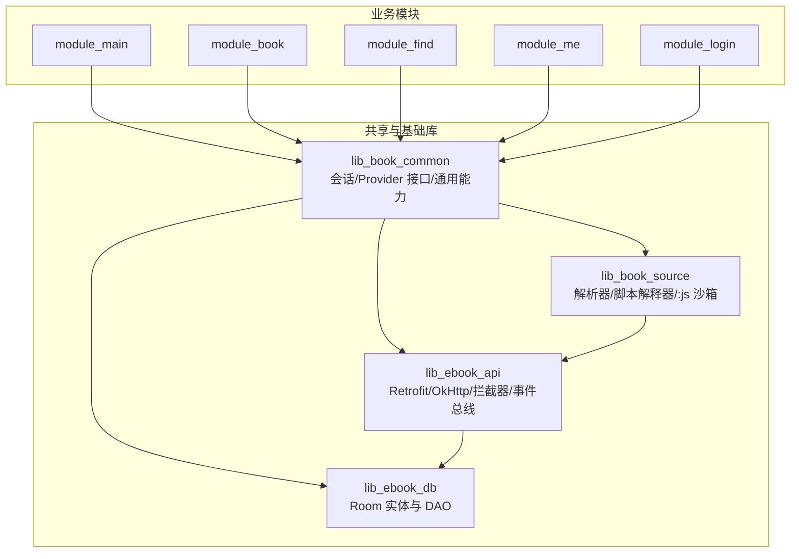
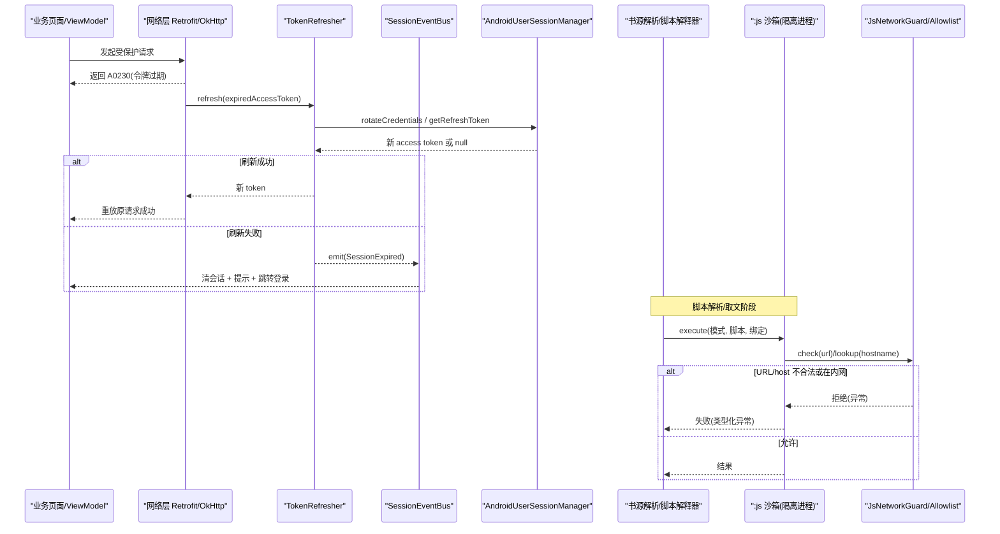
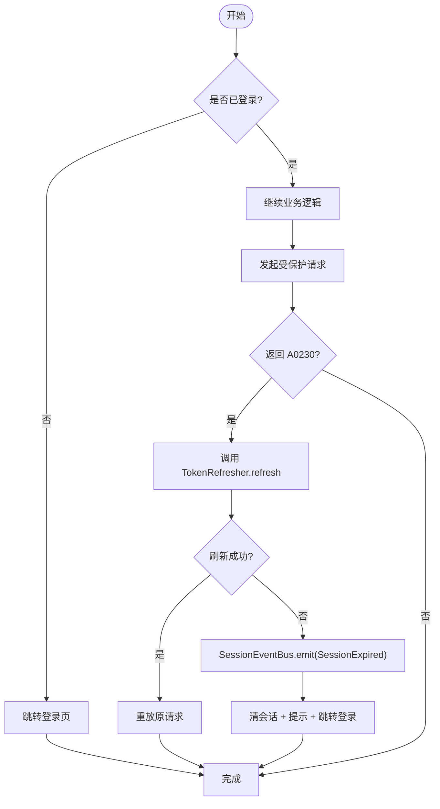
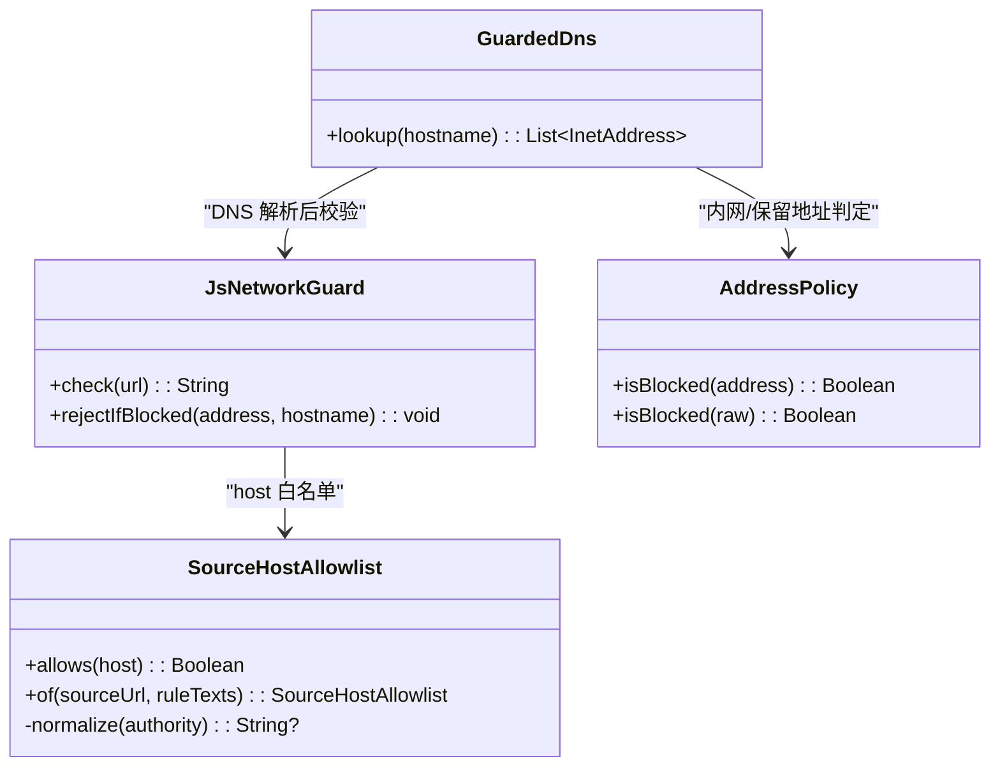

# 安全考虑

<cite>
**本文引用的文件**
- [lib_ebook_api/auth/TokenRefresher.kt](file://lib_ebook_api/src/main/java/com/ebook/api/auth/TokenRefresher.kt)
- [lib_ebook_api/auth/SessionEventBus.kt](file://lib_ebook_api/src/main/java/com/ebook/api/auth/SessionEventBus.kt)
- [lib_book_common/domain/AndroidUserSessionManager.kt](file://lib_book_common/src/main/java/com/ebook/common/domain/AndroidUserSessionManager.kt)
- [lib_book_source/sandbox/SourceHostAllowlist.kt](file://lib_book_source/src/main/java/com/ebook/source/sandbox/SourceHostAllowlist.kt)
- [lib_book_source/sandbox/JsNetworkGuard.kt](file://lib_book_source/src/main/java/com/ebook/source/sandbox/JsNetworkGuard.kt)
- [docs/adr/0028-untrusted-js-sandbox.md](file://docs/adr/0028-untrusted-js-sandbox.md)
- [lib_ebook_api/intercepter/EncodingInterceptor.kt](file://lib_ebook_api/src/main/java/com/ebook/api/intercepter/EncodingInterceptor.kt)
</cite>

## 目录
1. [引言](#引言)
2. [项目结构与安全边界总览](#项目结构与安全边界总览)
3. [核心安全组件](#核心安全组件)
4. [架构总览与关键交互时序](#架构总览与关键交互时序)
5. [详细组件分析](#详细组件分析)
6. [依赖关系与耦合分析](#依赖关系与耦合分析)
7. [性能与可用性权衡](#性能与可用性与安全权衡)
8. [故障排查指南](#故障排查指南)
9. [结论](#结论)
10. [附录：安全审计清单与最佳实践](#附录安全审计清单与最佳实践)

## 引言
本文件聚焦本项目在“路由访问控制、Provider 权限控制、数据传输与存储、会话管理、跨进程沙箱执行”等维度的安全设计与实现，结合代码与 ADR 决策，给出可操作的防护要点、流程图示与排障建议。目标是帮助开发者在不牺牲功能的前提下，守住“默认拒绝、最小权限、零信任输入、可观测失败”的安全基线。

## 项目结构与安全边界总览
本项目采用多模块架构，业务模块通过 Provider 接口进行跨模块通信，网络层由 lib_ebook_api 提供并集中处理编码、拦截与认证相关逻辑；书源解析与脚本执行集中在 lib_book_source，其中不可信 JS 在独立隔离进程中运行并通过 Binder 协议与主进程通信；公共领域能力（会话、登录态）集中在 lib_book_common。

图表来源
- [docs/adr/0028-untrusted-js-sandbox.md:1-44](file://docs/adr/0028-untrusted-js-sandbox.md#L1-L44)
- [lib_book_source/sandbox/SourceHostAllowlist.kt:1-74](file://lib_book_source/src/main/java/com/ebook/source/sandbox/SourceHostAllowlist.kt#L1-L74)
- [lib_book_source/sandbox/JsNetworkGuard.kt:1-168](file://lib_book_source/src/main/java/com/ebook/source/sandbox/JsNetworkGuard.kt#L1-L168)

章节来源
- [docs/adr/0028-untrusted-js-sandbox.md:1-44](file://docs/adr/0028-untrusted-js-sandbox.md#L1-L44)

## 核心安全组件
- 会话与会话事件总线：负责 token 刷新、会话过期事件统一分发，避免逐调用点分支处理。
- Android 用户会话管理器：维护登录态、token 驻内存策略、refresh token 持久化与三处镜像一致性清理。
- 沙箱执行器与网络守卫：对不可信脚本执行做隔离、白名单 host 校验、内网/保留地址拦截、请求/响应大小限制。
- 网络编码拦截器：保障第三方站点响应体按正确编码解码，避免乱码导致的解析错误被误判为安全问题。

章节来源
- [lib_ebook_api/auth/TokenRefresher.kt:1-27](file://lib_ebook_api/src/main/java/com/ebook/api/auth/TokenRefresher.kt#L1-L27)
- [lib_ebook_api/auth/SessionEventBus.kt:1-44](file://lib_ebook_api/src/main/java/com/ebook/api/auth/SessionEventBus.kt#L1-L44)
- [lib_book_common/domain/AndroidUserSessionManager.kt:1-162](file://lib_book_common/src/main/java/com/ebook/common/domain/AndroidUserSessionManager.kt#L1-L162)
- [lib_book_source/sandbox/SourceHostAllowlist.kt:1-74](file://lib_book_source/src/main/java/com/ebook/source/sandbox/SourceHostAllowlist.kt#L1-L74)
- [lib_book_source/sandbox/JsNetworkGuard.kt:1-168](file://lib_book_source/src/main/java/com/ebook/source/sandbox/JsNetworkGuard.kt#L1-L168)
- [lib_ebook_api/intercepter/EncodingInterceptor.kt:1-51](file://lib_ebook_api/src/main/java/com/ebook/api/intercepter/EncodingInterceptor.kt#L1-L51)

## 架构总览与关键交互时序
以下时序展示从页面发起请求到网络层鉴权、静默刷新与事件分发的关键路径，以及沙箱侧对脚本外呼的严格准入判定。

图表来源
- [lib_ebook_api/auth/TokenRefresher.kt:1-27](file://lib_ebook_api/src/main/java/com/ebook/api/auth/TokenRefresher.kt#L1-L27)
- [lib_ebook_api/auth/SessionEventBus.kt:1-44](file://lib_ebook_api/src/main/java/com/ebook/api/auth/SessionEventBus.kt#L1-L44)
- [lib_book_common/domain/AndroidUserSessionManager.kt:61-133](file://lib_book_common/src/main/java/com/ebook/common/domain/AndroidUserSessionManager.kt#L61-L133)
- [lib_book_source/sandbox/JsNetworkGuard.kt:25-99](file://lib_book_source/src/main/java/com/ebook/source/sandbox/JsNetworkGuard.kt#L25-L99)
- [docs/adr/0028-untrusted-js-sandbox.md:15-39](file://docs/adr/0028-untrusted-js-sandbox.md#L15-L39)

## 详细组件分析

### 路由安全检查与未授权访问防护
- 设计原则
  - 所有跨模块页面与服务通过 TheRouter 暴露，入口集中；敏感路由应在调用前进行登录态检查（基于 Session 状态）。
  - 登录态由 lib_book_common 的会话管理器统一管理，页面级校验优先于路由跳转，避免无效跳转。
- 推荐实现要点
  - 在进入受保护路由前，读取当前登录态（StateFlow），未登录时直接跳转登录页。
  - 对于 Provider 暴露的服务接口，在服务端入口处再次校验调用方身份，遵循“防御性编程”。
  - 对动态参数（如 id、token 片段）进行合法性校验，拒绝明显伪造或越界的值。
- 参考位置
  - 会话状态与清理：[AndroidUserSessionManager.kt](file://lib_book_common/src/main/java/com/ebook/common/domain/AndroidUserSessionManager.kt#L100-L133)
  - 会话过期事件：[SessionEventBus.kt](file://lib_ebook_api/src/main/java/com/ebook/api/auth/SessionEventBus.kt#L10-L44)

章节来源
- [lib_book_common/domain/AndroidUserSessionManager.kt:100-133](file://lib_book_common/src/main/java/com/ebook/common/domain/AndroidUserSessionManager.kt#L100-L133)
- [lib_ebook_api/auth/SessionEventBus.kt:10-44](file://lib_ebook_api/src/main/java/com/ebook/api/auth/SessionEventBus.kt#L10-L44)

### Provider 接口的权限控制
- 设计原则
  - Provider 作为跨模块服务暴露点，应具备最小权限：只暴露必要方法，入参与返回值尽量收敛到领域模型。
  - 对写操作增加调用方上下文校验（例如仅允许当前用户修改自身数据）。
- 实现建议
  - 在 Provider 实现中校验当前用户身份（来自会话管理器），拒绝非预期调用。
  - 对批量写操作增加幂等与限流保护，防止滥用。
  - 日志记录关键调用点（脱敏后），便于审计与问题定位。

章节来源
- [lib_book_common/domain/AndroidUserSessionManager.kt:61-98](file://lib_book_common/src/main/java/com/ebook/common/domain/AndroidUserSessionManager.kt#L61-L98)

### 数据传输安全性
- 传输编码与内容类型
  - 使用编码拦截器强制设置响应体 Content-Type，确保第三方站点的中文正文按正确编码解码，避免因乱码导致解析错误被误判为安全漏洞。
- 证书与主机白名单
  - 书源脚本的网络请求必须经过 JsNetworkGuard，仅允许 http(s) 且 host 在白名单内；禁止私网/保留/环回地址，防止内网探测与信息泄露。
- 敏感字段最小化
  - 请求载荷仅携带必要信息，避免将 token 附加到不受信任的第三方域；刷新接口不应经过会触发循环的适配器。

章节来源
- [lib_ebook_api/intercepter/EncodingInterceptor.kt:10-51](file://lib_ebook_api/src/main/java/com/ebook/api/intercepter/EncodingInterceptor.kt#L10-L51)
- [lib_book_source/sandbox/JsNetworkGuard.kt:25-99](file://lib_book_source/src/main/java/com/ebook/source/sandbox/JsNetworkGuard.kt#L25-L99)
- [lib_ebook_api/auth/TokenRefresher.kt:10-15](file://lib_ebook_api/src/main/java/com/ebook/api/auth/TokenRefresher.kt#L10-L15)

### 会话管理机制（token 存储、刷新、失效）
- Token 驻内存与持久化
  - access token 仅驻内存（TokenHolder），不落盘；refresh token 持久化至 SP，冷启动为空，首个请求遇 A0230 静默刷新。
- 刷新流程
  - 网络层检测 A0230 后调用 TokenRefresher.refresh，单飞互斥；成功则重放原请求，失败则发出 SessionExpired 事件。
- 失效处理
  - 会话过期事件统一由 SessionEventBus 发射，UI 层订阅后执行清会话、提示、跳转登录；清理覆盖三处镜像（SP、兼容键、ProfileRepository 内存态）。

图表来源
- [lib_ebook_api/auth/TokenRefresher.kt:16-27](file://lib_ebook_api/src/main/java/com/ebook/api/auth/TokenRefresher.kt#L16-L27)
- [lib_ebook_api/auth/SessionEventBus.kt:22-44](file://lib_ebook_api/src/main/java/com/ebook/api/auth/SessionEventBus.kt#L22-L44)
- [lib_book_common/domain/AndroidUserSessionManager.kt:61-133](file://lib_book_common/src/main/java/com/ebook/common/domain/AndroidUserSessionManager.kt#L61-L133)

章节来源
- [lib_ebook_api/auth/TokenRefresher.kt:10-27](file://lib_ebook_api/src/main/java/com/ebook/api/auth/TokenRefresher.kt#L10-L27)
- [lib_ebook_api/auth/SessionEventBus.kt:10-44](file://lib_ebook_api/src/main/java/com/ebook/api/auth/SessionEventBus.kt#L10-L44)
- [lib_book_common/domain/AndroidUserSessionManager.kt:61-133](file://lib_book_common/src/main/java/com/ebook/common/domain/AndroidUserSessionManager.kt#L61-L133)

### 跨进程通信与沙箱执行器的安全边界
- 隔离进程
  - 脚本执行器以 isolatedProcess 零权限运行，配合 exported=false 的控制面，deny-by-default，内核强制网络/文件拒绝。
- 执行协议与资源限制
  - 通过 Binder JSON 协议 execute(模式, 脚本, 绑定) → (status, result, error)，绝对超时、堆上限、JS 栈上限、请求/响应大小上限，超限销毁 runtime 并可能杀进程。
- Host 白名单与 DNS 守卫
  - 从规则文本导出 host 白名单，严格匹配，不放行子域通配；DNS 解析点在连接时再次校验，防 DNS 重绑。
- 回调通道与嵌套限制
  - 双向回调用于递归求值与受限网络代理；嵌套层关闭 JS，避免绕过帧级预算；每任务外呼次数与回调深度有限制。

图表来源
- [lib_book_source/sandbox/SourceHostAllowlist.kt:20-74](file://lib_book_source/src/main/java/com/ebook/source/sandbox/SourceHostAllowlist.kt#L20-L74)
- [lib_book_source/sandbox/JsNetworkGuard.kt:25-99](file://lib_book_source/src/main/java/com/ebook/source/sandbox/JsNetworkGuard.kt#L25-L99)
- [lib_book_source/sandbox/JsNetworkGuard.kt:115-167](file://lib_book_source/src/main/java/com/ebook/source/sandbox/JsNetworkGuard.kt#L115-L167)

章节来源
- [docs/adr/0028-untrusted-js-sandbox.md:15-39](file://docs/adr/0028-untrusted-js-sandbox.md#L15-L39)
- [lib_book_source/sandbox/SourceHostAllowlist.kt:20-74](file://lib_book_source/src/main/java/com/ebook/source/sandbox/SourceHostAllowlist.kt#L20-L74)
- [lib_book_source/sandbox/JsNetworkGuard.kt:25-99](file://lib_book_source/src/main/java/com/ebook/source/sandbox/JsNetworkGuard.kt#L25-L99)
- [lib_book_source/sandbox/JsNetworkGuard.kt:115-167](file://lib_book_source/src/main/java/com/ebook/source/sandbox/JsNetworkGuard.kt#L115-L167)

## 依赖关系与耦合分析
- 低耦合高内聚
  - 会话管理与网络事件解耦：TokenRefresher 定义接口，上层注入实现；SessionEventBus 提供全局事件通道，UI 订阅处置。
  - 沙箱与主进程通过 Binder 协议通信，限制 IPC 能力面，减少攻击面。
- 潜在风险点
  - 若 Provider 实现未校验调用方身份，可能导致越权访问。
  - 若白名单过于宽松或实现存在漏洞，脚本可能突破 host 限制。
  - 若会话清理不完整，可能出现“已登出仍被放行”的现象。

章节来源
- [lib_ebook_api/auth/TokenRefresher.kt:1-15](file://lib_ebook_api/src/main/java/com/ebook/api/auth/TokenRefresher.kt#L1-L15)
- [lib_book_source/sandbox/SourceHostAllowlist.kt:1-24](file://lib_book_source/src/main/java/com/ebook/source/sandbox/SourceHostAllowlist.kt#L1-L24)
- [lib_book_common/domain/AndroidUserSessionManager.kt:100-133](file://lib_book_common/src/main/java/com/ebook/common/domain/AndroidUserSessionManager.kt#L100-L133)

## 性能与可用性与安全权衡
- 隔离进程带来冷启动与调试成本，但换来内核级默认拒绝，安全性更强。
- 串行执行保证堆限与超时有效，但可能成为解析瓶颈；可在后续版本评估多线程运行时。
- 白名单严格防止子域通配，提升安全性但可能导致个别源解析失败，需依据拒绝日志调校。

章节来源
- [docs/adr/0028-untrusted-js-sandbox.md:45-65](file://docs/adr/0028-untrusted-js-sandbox.md#L45-L65)

## 故障排查指南
- 常见问题
  - 页面不闪退但数据永远加载不出来：可能是编码拦截器未生效或后端本地地址需要 adb reverse；也可能是白名单过严导致 host 被拒。
  - 会话过期但未跳转：检查 SessionEventBus 是否发射事件，UI 是否订阅并执行清会话+跳转。
  - 脚本解析失败：查看沙箱执行失败原因（URL 长度、协议、host 白名单、内网地址、DNS 解析）。
- 建议步骤
  - 核对白名单导出是否正确（从规则文本提取 host）。
  - 确认刷新接口未经会触发循环的适配器。
  - 验证会话清理是否覆盖三处镜像。

章节来源
- [lib_book_source/sandbox/JsNetworkGuard.kt:35-60](file://lib_book_source/src/main/java/com/ebook/source/sandbox/JsNetworkGuard.kt#L35-L60)
- [lib_ebook_api/auth/SessionEventBus.kt:22-44](file://lib_ebook_api/src/main/java/com/ebook/api/auth/SessionEventBus.kt#L22-L44)
- [lib_book_common/domain/AndroidUserSessionManager.kt:100-133](file://lib_book_common/src/main/java/com/ebook/common/domain/AndroidUserSessionManager.kt#L100-L133)

## 结论
本项目通过隔离进程、白名单 host、内网地址拦截、token 驻内存与静默刷新、会话事件总线等机制，构建了多层防御体系。建议在新增功能时遵循“默认拒绝、最小权限、可观测失败”的原则，持续完善白名单与监控日志，确保安全与可用性的平衡。

## 附录：安全审计清单与最佳实践
- 路由与 Provider
  - 每次进入受保护路由前检查登录态；Provider 写操作校验调用方身份。
  - 对动态参数进行合法性校验，拒绝越界值。
- 数据传输与存储
  - 使用编码拦截器确保正确解码；仅对受信任 host 附加 token。
  - access token 驻内存，refresh token 加密存储（如需增强可引入密钥管理）。
- 会话管理
  - 刷新失败统一发射 SessionExpired；清理覆盖三处镜像。
  - 冷启动 token 为空，首请求静默刷新。
- 沙箱执行
  - 隔离进程零权限；execute 绝对超时、堆/栈/字节上限；host 白名单严格匹配；DNS 解析时再校验。
  - 回调嵌套层关闭 JS；限制外呼次数与回调深度。
- 网络安全策略
  - 禁止私网/保留/环回地址；仅允许 http(s)。
  - 对本地调试使用 adb reverse 与回环地址，避免额外权限。
- 日志与审计
  - 统一日志输出；关键调用点记录脱敏后的调用信息与拒绝原因。
  - 定期审查白名单日志与拒绝原因，按需调校。

章节来源
- [lib_book_source/sandbox/SourceHostAllowlist.kt:20-74](file://lib_book_source/src/main/java/com/ebook/source/sandbox/SourceHostAllowlist.kt#L20-L74)
- [lib_book_source/sandbox/JsNetworkGuard.kt:25-99](file://lib_book_source/src/main/java/com/ebook/source/sandbox/JsNetworkGuard.kt#L25-L99)
- [lib_book_common/domain/AndroidUserSessionManager.kt:61-133](file://lib_book_common/src/main/java/com/ebook/common/domain/AndroidUserSessionManager.kt#L61-L133)
- [lib_ebook_api/auth/SessionEventBus.kt:10-44](file://lib_ebook_api/src/main/java/com/ebook/api/auth/SessionEventBus.kt#L10-L44)
- [docs/adr/0028-untrusted-js-sandbox.md:15-39](file://docs/adr/0028-untrusted-js-sandbox.md#L15-L39)