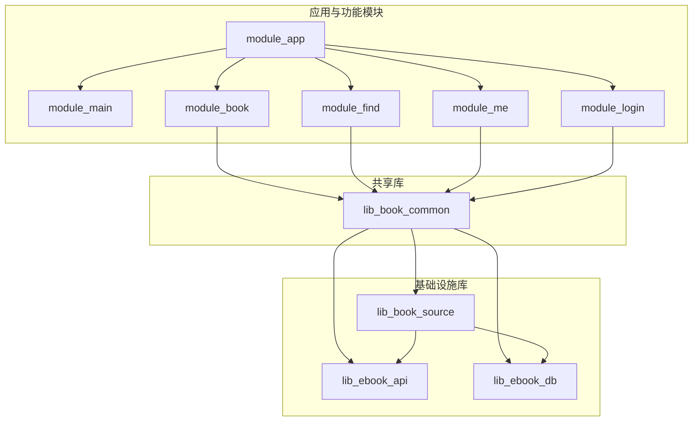
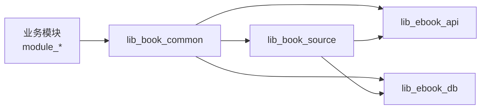
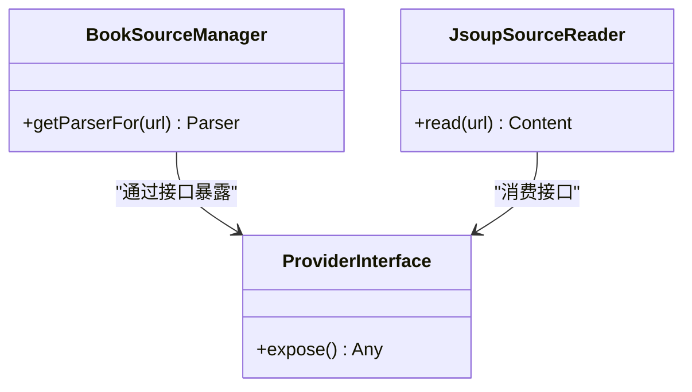
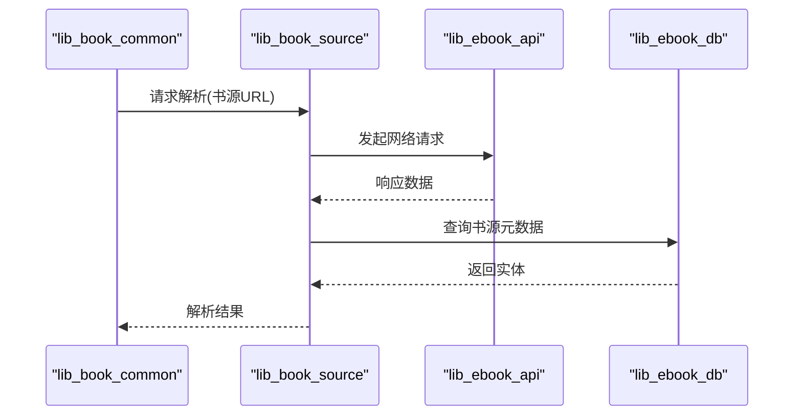
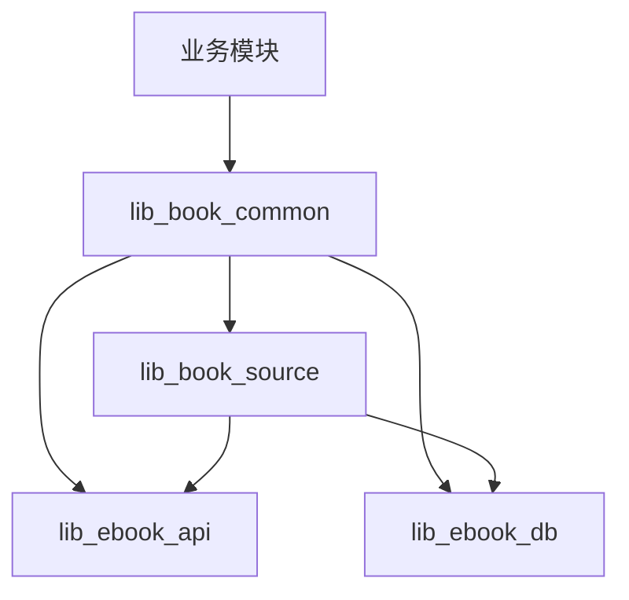
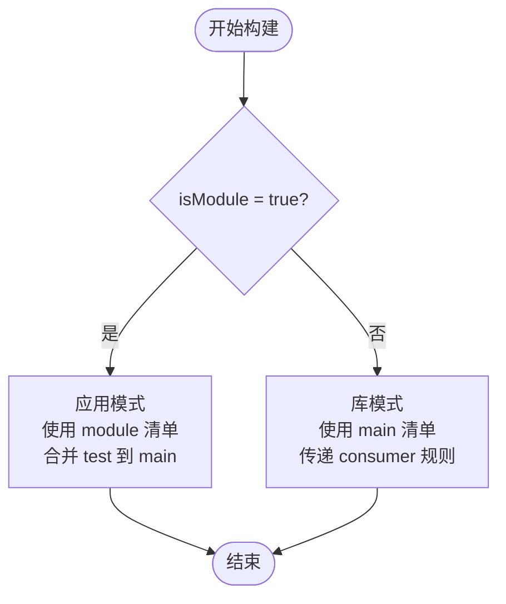
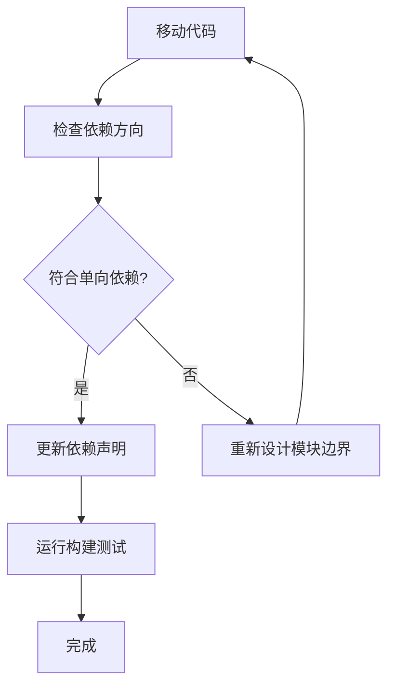

# 模块依赖管理

<cite>
**本文引用的文件**   
- [settings.gradle.kts](file://settings.gradle.kts)
- [gradle/libs.versions.toml](file://gradle/libs.versions.toml)
- [build-logic/convention/src/main/kotlin/AndroidComponentConventionPlugin.kt](file://build-logic/convention/src/main/kotlin/AndroidComponentConventionPlugin.kt)
- [lib_book_common/build.gradle.kts](file://lib_book_common/build.gradle.kts)
- [lib_book_source/build.gradle.kts](file://lib_book_source/build.gradle.kts)
- [lib_ebook_api/build.gradle.kts](file://lib_ebook_api/build.gradle.kts)
- [lib_ebook_db/build.gradle.kts](file://lib_ebook_db/build.gradle.kts)
- [module_book/build.gradle.kts](file://module_book/build.gradle.kts)
</cite>

## 目录
1. [引言](#引言)
2. [项目结构](#项目结构)
3. [核心组件](#核心组件)
4. [架构总览](#架构总览)
5. [详细组件分析](#详细组件分析)
6. [依赖关系与方向](#依赖关系与方向)
7. [Gradle 构建与 isModule 开关](#gradle-构建与-ismodule-开关)
8. [版本统一管理策略](#版本统一管理策略)
9. [重构时的依赖调整指南](#重构时的依赖调整指南)
10. [性能与编译影响](#性能与编译影响)
11. [故障排查](#故障排查)
12. [结论](#结论)

## 引言
本文件聚焦项目的模块化架构与依赖管理，解释业务模块如何以单向依赖的方式组合基础能力，并通过 Provider 接口进行跨模块解耦通信。文档同时说明 Gradle 构建脚本中 api 与 implementation 的选择原则、isModule 开关对独立开发与集成构建的影响、以及版本目录的集中管理方式。目标是让读者在不深入源码的情况下，也能理解并安全地调整模块依赖与边界。

## 项目结构
仓库采用多模块结构，包含应用入口、功能模块、共享库与基础设施库：
- 应用与功能模块：module_app、module_main、module_book、module_find、module_me、module_login
- 共享库：lib_book_common（领域共享 UI、Provider 接口、通用工具）
- 基础设施库：lib_book_source（书源解析层）、lib_ebook_api（网络与服务）、lib_ebook_db（Room 实体与 DAO）
- 构建逻辑：build-logic（约定插件统一配置）

图表来源
- [settings.gradle.kts:55-65](file://settings.gradle.kts#L55-L65)
- [lib_book_common/build.gradle.kts:37-44](file://lib_book_common/build.gradle.kts#L37-L44)
- [lib_book_source/build.gradle.kts:33-42](file://lib_book_source/build.gradle.kts#L33-L42)

章节来源
- [settings.gradle.kts:55-65](file://settings.gradle.kts#L55-L65)

## 核心组件
- lib_book_common：承载 ebook 域共享 UI、Provider 接口、通用工具与基类；作为业务模块与基础设施库之间的“薄壳”，通过 Provider 暴露能力，避免业务模块直接耦合底层实现。
- lib_book_source：书源解析专用层，包括原生解析器、脚本书源解释器与沙箱执行器；依赖网络与数据库契约但不反向依赖业务模块。
- lib_ebook_api：网络层，定义服务、实体、拦截器；不依赖业务与解析层。
- lib_ebook_db：持久化层，定义 Room 实体与 DAO；无交叉依赖。

这些组件通过明确的依赖方向形成分层，确保变更隔离与可测试性。

章节来源
- [lib_book_common/build.gradle.kts:37-44](file://lib_book_common/build.gradle.kts#L37-L44)
- [lib_book_source/build.gradle.kts:33-42](file://lib_book_source/build.gradle.kts#L33-L42)
- [lib_ebook_api/build.gradle.kts:40-58](file://lib_ebook_api/build.gradle.kts#L40-L58)
- [lib_ebook_db/build.gradle.kts:29-50](file://lib_ebook_db/build.gradle.kts#L29-L50)

## 架构总览
依赖方向遵循单向原则：业务模块 → lib_book_common → lib_book_source → lib_ebook_api / lib_ebook_db。lib_book_common 与 lib_book_source 并列依赖 lib_ebook_api 与 lib_ebook_db，而 lib_ebook_api 与 lib_ebook_db 之间不存在反向依赖。该设计保证：
- 业务模块只依赖共享接口（Provider），不感知具体实现细节
- 基础设施库保持最小依赖面，便于替换与升级
- 解析层仅消费契约，不被业务侧反向绑定

图表来源
- [lib_book_common/build.gradle.kts:37-44](file://lib_book_common/build.gradle.kts#L37-L44)
- [lib_book_source/build.gradle.kts:33-42](file://lib_book_source/build.gradle.kts#L33-L42)

章节来源
- [lib_book_common/build.gradle.kts:37-44](file://lib_book_common/build.gradle.kts#L37-L44)
- [lib_book_source/build.gradle.kts:33-42](file://lib_book_source/build.gradle.kts#L33-L42)

## 详细组件分析

### lib_book_common：共享层与 Provider 边界
- 职责：提供 ebook 域共享 UI、Provider 接口、通用工具与基类；对外暴露稳定的 API 面，对内聚合基础设施能力。
- 依赖策略：使用 api 暴露上游契约（lib_ebook_api、lib_ebook_db、lib_book_source），使业务模块无需额外声明即可编译调用；内部实现细节通过 implementation 隐藏。
- 解耦机制：业务模块通过 Provider 接口访问能力，避免直接耦合 lib_book_source 或网络/数据库实现。

图表来源
- [lib_book_common/build.gradle.kts:37-44](file://lib_book_common/build.gradle.kts#L37-L44)

章节来源
- [lib_book_common/build.gradle.kts:37-44](file://lib_book_common/build.gradle.kts#L37-L44)

### lib_book_source：解析层与沙箱
- 职责：书源解析、脚本规则求值与沙箱执行；依赖网络与数据库契约，但自身不暴露业务语义。
- 依赖策略：api 依赖 lib_ebook_api 与 lib_ebook_db 以获取契约类型；implementation 依赖 jsoup 与 JSON 序列化等实现细节，避免污染下游编译类路径。
- 沙箱特性：在独立进程内执行脚本，主线程守卫防止阻塞；未装配执行器时抛出明确异常，区分“未装配”与“执行失败”。

图表来源
- [lib_book_source/build.gradle.kts:33-50](file://lib_book_source/build.gradle.kts#L33-L50)

章节来源
- [lib_book_source/build.gradle.kts:33-50](file://lib_book_source/build.gradle.kts#L33-L50)

### lib_ebook_api：网络契约层
- 职责：Retrofit 服务、实体、OkHttp 拦截器；提供纯净客户端用于第三方站点请求，避免携带用户 token。
- 依赖策略：api 暴露 Retrofit、OkHttp、JSON 转换等契约；implementation 隐藏 JSON 序列化实现细节。
- 安全性：不同信任域使用不同客户端，确保第三方站点无法获取用户认证信息。

章节来源
- [lib_ebook_api/build.gradle.kts:40-58](file://lib_ebook_api/build.gradle.kts#L40-L58)

### lib_ebook_db：持久化契约层
- 职责：Room 实体与 DAO；提供稳定的数据模型与迁移支持。
- 依赖策略：implementation 依赖 SQLite 驱动；测试时使用 JVM 变体以在桌面环境运行真实引擎。
- 迁移保障：实体变更需配套迁移链与 schema JSON，禁止破坏性回退。

章节来源
- [lib_ebook_db/build.gradle.kts:29-50](file://lib_ebook_db/build.gradle.kts#L29-L50)

## 依赖关系与方向
依赖方向严格遵循：
- 业务模块 → lib_book_common
- lib_book_common → lib_book_source、lib_ebook_api、lib_ebook_db
- lib_book_source → lib_ebook_api、lib_ebook_db
- lib_ebook_api 与 lib_ebook_db 无相互依赖

这种单向依赖确保：
- 变更隔离：修改基础设施不影响业务模块的直接编译
- 可替换性：基础设施库可被替换而不影响上层
- 测试友好：可通过 Mock 替代基础设施实现

图表来源
- [lib_book_common/build.gradle.kts:37-44](file://lib_book_common/build.gradle.kts#L37-L44)
- [lib_book_source/build.gradle.kts:33-42](file://lib_book_source/build.gradle.kts#L33-L42)

章节来源
- [lib_book_common/build.gradle.kts:37-44](file://lib_book_common/build.gradle.kts#L37-L44)
- [lib_book_source/build.gradle.kts:33-42](file://lib_book_source/build.gradle.kts#L33-L42)

## Gradle 构建与 isModule 开关
isModule 开关控制功能模块的构建形态：
- isModule=false（默认）：模块作为 library 被 module_app 依赖，consumer-rules.pro 随 AAR 传播
- isModule=true：模块作为 application 独立运行，使用 src/main/module/AndroidManifest.xml，并将 src/main/test 并入 main source set

构建脚本中的关键行为：
- AndroidComponentConventionPlugin 根据 isModule 动态切换插件与清单
- 功能模块 build.gradle.kts 中 consumerProguardFiles 仅在 library 模式下生效
- 独立模式启用 TheRouter 插件，集成模式关闭

图表来源
- [build-logic/convention/src/main/kotlin/AndroidComponentConventionPlugin.kt:7-34](file://build-logic/convention/src/main/kotlin/AndroidComponentConventionPlugin.kt#L7-L34)
- [module_book/build.gradle.kts:14-21](file://module_book/build.gradle.kts#L14-L21)

章节来源
- [build-logic/convention/src/main/kotlin/AndroidComponentConventionPlugin.kt:7-34](file://build-logic/convention/src/main/kotlin/AndroidComponentConventionPlugin.kt#L7-L34)
- [module_book/build.gradle.kts:14-21](file://module_book/build.gradle.kts#L14-L21)

## 版本统一管理策略
所有依赖版本集中在 gradle/libs.versions.toml 中管理：
- versions 块定义版本号常量
- libraries 块定义依赖别名，引用版本号
- plugins 块定义插件 ID 与版本
- bundles 块定义依赖组

优势：
- 单一事实源，避免版本碎片化
- 批量升级容易，减少遗漏风险
- 构建脚本简洁，只引用别名

维护方式：
- 新增依赖时先在 versions 定义版本，再在 libraries 添加别名
- 升级依赖时只修改对应版本字段
- 构建脚本中统一使用 libs.xxx.yyy 引用

章节来源
- [gradle/libs.versions.toml:1-237](file://gradle/libs.versions.toml#L1-L237)

## 重构时的依赖调整指南
当移动代码或调整模块边界时，遵循以下原则：

### 移动代码前的检查
1. 确认目标位置是否违反依赖方向约束
2. 检查是否有循环依赖风险
3. 验证 Provider 接口是否已正确暴露

### 安全移动步骤
1. 在目标模块创建新的 Provider 接口
2. 将实现类移动到目标模块
3. 更新依赖声明，使用 api 或 implementation 正确表达可见性
4. 运行完整构建验证
5. 更新相关测试用例

### 循环依赖检测
- 使用 Gradle 模块图插件检测循环依赖
- 发现循环时拆分公共抽象到更底层模块
- 通过接口解耦实现细节

[此图为概念流程图，无需具体源码映射]

## 性能与编译影响
依赖声明对构建性能的影响：
- api 依赖会增加下游编译时间，因为下游需要知道完整 API 面
- implementation 依赖提供更快的增量编译，因为下游不需要重新编译
- 合理使用两者平衡编译速度与 API 稳定性

优化建议：
- 仅对外部稳定 API 使用 api
- 内部实现细节使用 implementation
- 定期清理未使用的依赖

章节来源
- [lib_book_common/build.gradle.kts:37-94](file://lib_book_common/build.gradle.kts#L37-L94)
- [lib_book_source/build.gradle.kts:33-69](file://lib_book_source/build.gradle.kts#L33-L69)

## 故障排查
常见依赖问题及解决方案：

### 循环依赖错误
症状：Gradle 构建时报循环依赖
解决：重新设计模块边界，提取公共接口到更底层模块

### 符号找不到
症状：编译时报找不到类或方法
解决：检查是否正确声明了 api 或 implementation 依赖

### 版本冲突
症状：运行时出现类版本冲突
解决：统一版本管理，避免重复声明不同版本

### isModule 相关问题
症状：独立模式与集成模式行为不一致
解决：确保两份 Manifest 同步修改，检查 source set 配置

章节来源
- [build-logic/convention/src/main/kotlin/AndroidComponentConventionPlugin.kt:7-34](file://build-logic/convention/src/main/kotlin/AndroidComponentConventionPlugin.kt#L7-L34)

## 结论
本项目通过严格的单向依赖设计和 Provider 接口解耦，实现了清晰的模块化架构。Gradle 构建脚本通过 api 和 implementation 的正确使用，平衡了编译性能与 API 稳定性。isModule 开关支持灵活的开发模式切换，版本目录统一管理确保依赖一致性。遵循本文档的指导，可以在保证系统稳定性的前提下进行模块重构和功能扩展。

[本节为总结性内容，无需具体源码映射]