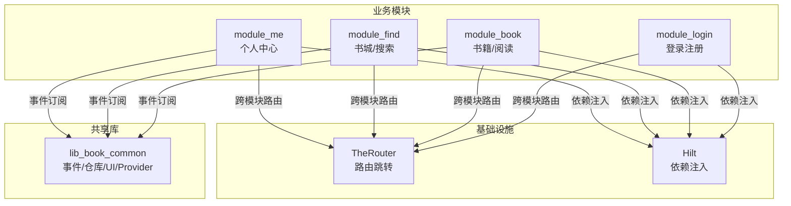
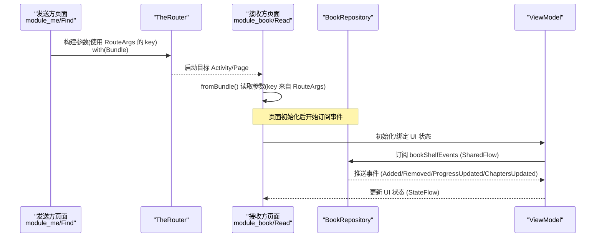
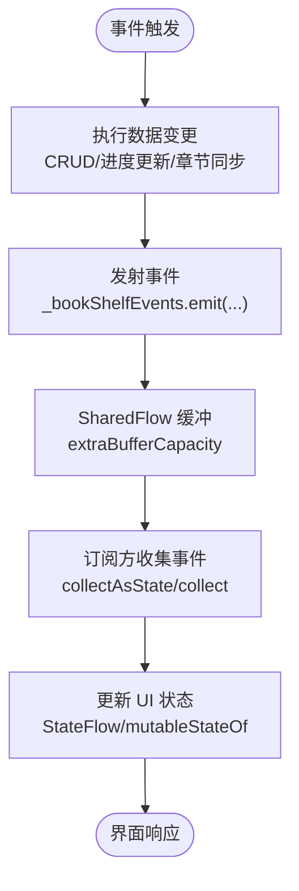
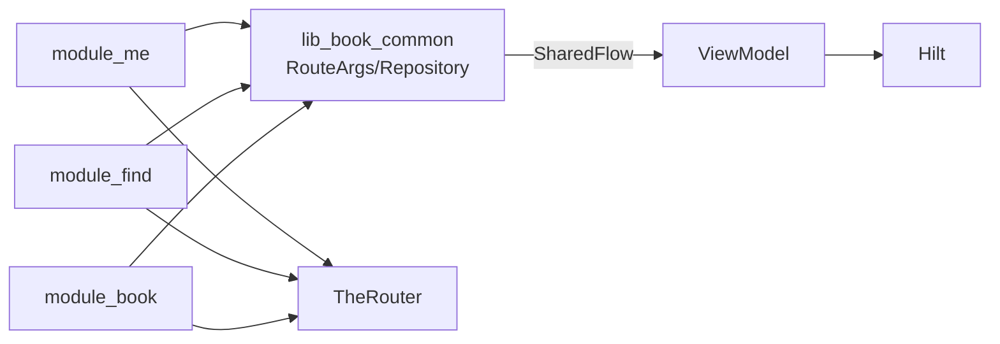

# 跨模块数据传递

<cite>
**本文引用的文件**
- [RouteArgs.kt](file://lib_book_common/src/main/java/com/ebook/common/event/RouteArgs.kt)
- [BookRepository.kt](file://lib_book_common/src/main/java/com/ebook/common/repository/BookRepository.kt)
- [MyCommentActivity.kt](file://module_me/src/main/java/com/ebook/me/view/MyCommentActivity.kt)
- [SearchActivity.kt](file://module_find/src/main/java/com/ebook/find/SearchActivity.kt)
- [BookDetailViewModel.kt](file://module_book/src/main/java/com/ebook/book/mvvm/viewmodel/BookDetailViewModel.kt)
- [SettingViewModel.kt](file://module_me/src/main/java/com/ebook/me/mvvm/viewmodel/SettingViewModel.kt)
- [HiltConventionPlugin.kt](file://build-logic/convention/build-logic/convention/src/main/kotlin/HiltConventionPlugin.kt)
- [0004-rxbus-to-sharedflow.md](file://docs/adr/0004-rxbus-to-sharedflow.md)
- [AndroidComponentConventionPlugin.kt](file://build-logic/convention/build-logic/convention/src/main/kotlin/AndroidComponentConventionPlugin.kt)
</cite>

## 目录
1. [简介](#简介)
2. [项目结构](#项目结构)
3. [核心组件](#核心组件)
4. [架构总览](#架构总览)
5. [详细组件分析](#详细组件分析)
6. [依赖关系分析](#依赖关系分析)
7. [性能考虑](#性能考虑)
8. [故障排查指南](#故障排查指南)
9. [结论](#结论)
10. [附录](#附录)

## 简介
本文件聚焦于多模块 Android 应用中的“跨模块数据传递”与“状态管理”，围绕以下主题展开：
- RouteArgs 常量类的设计理念：集中管理路由参数键，避免运行时键名不一致导致的数据丢失。
- TheRouter 的参数传递机制：通过 Bundle 序列化/反序列化进行页面间参数传递。
- 事件总线设计：使用 SharedFlow 替代 RxBus，实现异步、线程安全的事件通知。
- ViewModel 在跨模块数据共享中的作用：基于 Hilt 注入共享实例，承载业务状态与命令通道。
- 数据安全与一致性：敏感信息保护、离线缓存与一致性策略。
- 常见问题与解决方案：类型不匹配、内存泄漏、线程安全等。

## 项目结构
本项目采用模块化架构，功能模块之间通过 lib_book_common 提供的公共能力（事件、仓库、UI、Provider 接口等）解耦通信。关键路径包括：
- 路由参数键集中定义：lib_book_common/event
- 事件总线：lib_book_common/repository（SharedFlow 暴露）
- 视图层与 ViewModel：各 module_* 下的 viewmodel 与 activity/page
- Hilt 注入：build-logic 约定插件统一装配，业务模块按约定使用

图表来源
- [AndroidComponentConventionPlugin.kt:1-200](file://build-logic/convention/build-logic/convention/src/main/kotlin/AndroidComponentConventionPlugin.kt#L1-L200)
- [HiltConventionPlugin.kt:1-200](file://build-logic/convention/build-logic/convention/src/main/kotlin/HiltConventionPlugin.kt#L1-L200)

章节来源
- [AndroidComponentConventionPlugin.kt:1-200](file://build-logic/convention/build-logic/convention/src/main/kotlin/AndroidComponentConventionPlugin.kt#L1-L200)
- [HiltConventionPlugin.kt:1-200](file://build-logic/convention/build-logic/convention/src/main/kotlin/HiltConventionPlugin.kt#L1-L200)

## 核心组件
- RouteArgs：集中声明跨模块路由参数的 key，避免字符串字面量散落导致的键名不一致问题。
- BookRepository.bookShelfEvents：以 SharedFlow 暴露书架相关事件，作为跨模块/跨页面的事件总线。
- ViewModel + Hilt：业务模块通过 @HiltViewModel 获取可观察的状态流；跨模块页面通过 Provider 或路由传递必要参数。
- TheRouter：负责模块间导航，支持 inBundle 传参，目标页通过 with(Bundle) 读取。

章节来源
- [RouteArgs.kt:1-34](file://lib_book_common/src/main/java/com/ebook/common/event/RouteArgs.kt#L1-L34)
- [BookRepository.kt:70-80](file://lib_book_common/src/main/java/com/ebook/common/repository/BookRepository.kt#L70-L80)
- [BookDetailViewModel.kt:1-50](file://module_book/src/main/java/com/ebook/book/mvvm/viewmodel/BookDetailViewModel.kt#L1-L50)
- [MyCommentActivity.kt:1-50](file://module_me/src/main/java/com/ebook/me/view/MyCommentActivity.kt#L1-L50)

## 架构总览
下图展示跨模块数据传递的整体流程：发送方通过 TheRouter 携带参数跳转到目标页；目标页通过 RouteArgs 的 key 从 Bundle 中读取；同时，事件由 Repository 通过 SharedFlow 广播，订阅方（如 ViewModel）收集并更新 UI 状态。

图表来源
- [RouteArgs.kt:1-34](file://lib_book_common/src/main/java/com/ebook/common/event/RouteArgs.kt#L1-L34)
- [BookRepository.kt:70-80](file://lib_book_common/src/main/java/com/ebook/common/repository/BookRepository.kt#L70-L80)
- [MyCommentActivity.kt:1-50](file://module_me/src/main/java/com/ebook/me/view/MyCommentActivity.kt#L1-L50)
- [SearchActivity.kt:1-120](file://module_find/src/main/java/com/ebook/find/SearchActivity.kt#L1-L120)

## 详细组件分析

### RouteArgs 常量类：集中管理跨模块参数键
- 设计理念
  - 将跨模块 Bundle 的 key 集中在 RouteArgs 中声明，发送方与接收方引用同一常量，避免散落的字符串字面量导致键名不一致。
  - 当键需要重命名时，编译期即可发现所有引用点，降低运行时静默丢参的风险。
- 典型场景
  - module_me → module_book 评论页跳转：使用 RouteArgs.COMMENT_KEY、PRIMARY_COMMENT_KEY 等键传递定位信息。
  - 其他模块也遵循该约定，确保跨模块参数的一致性与可维护性。

章节来源
- [RouteArgs.kt:1-34](file://lib_book_common/src/main/java/com/ebook/common/event/RouteArgs.kt#L1-L34)

### TheRouter 参数传递：Bundle 序列化/反序列化
- 发送端
  - 通过 TheRouter 构建跳转，并在 Bundle 中使用 RouteArgs 定义的 key 写入参数。
- 接收端
  - 在目标 Activity/Page 中，通过 with(Bundle)/fromBundle() 读取参数，严格依赖 RouteArgs 的 key 取值。
- 优势
  - 统一的 key 管理减少错误率；
  - 跨模块导航不再依赖硬编码字符串，提升可读性与可测试性。

章节来源
- [MyCommentActivity.kt:1-50](file://module_me/src/main/java/com/ebook/me/view/MyCommentActivity.kt#L1-L50)
- [SearchActivity.kt:1-120](file://module_find/src/main/java/com/ebook/find/SearchActivity.kt#L1-L120)
- [RouteArgs.kt:1-34](file://lib_book_common/src/main/java/com/ebook/common/event/RouteArgs.kt#L1-L34)

### 事件总线：SharedFlow 替代 RxBus
- 设计动机
  - 统一使用协程 Flow，移除 RxJava 依赖；SharedFlow 具备背压控制与缓冲能力，适合事件分发。
- 实现要点
  - BookRepository 暴露 bookShelfEvents: SharedFlow<BookShelfEvent>，事件类型包括 Added/Removed/ProgressUpdated/ChaptersUpdated。
  - 订阅方（如 ViewModel）在合适的生命周期内收集事件，转换为 UI 状态流。
- 迁移说明
  - ADR-0004 记录了从 RxBus 到 SharedFlow 的决策与影响范围。

图表来源
- [BookRepository.kt:70-80](file://lib_book_common/src/main/java/com/ebook/common/repository/BookRepository.kt#L70-L80)
- [BookDetailViewModel.kt:1-50](file://module_book/src/main/java/com/ebook/book/mvvm/viewmodel/BookDetailViewModel.kt#L1-L50)
- [0004-rxbus-to-sharedflow.md:1-200](file://docs/adr/0004-rxbus-to-sharedflow.md#L1-L200)

章节来源
- [BookRepository.kt:70-80](file://lib_book_common/src/main/java/com/ebook/common/repository/BookRepository.kt#L70-L80)
- [BookDetailViewModel.kt:1-50](file://module_book/src/main/java/com/ebook/book/mvvm/viewmodel/BookDetailViewModel.kt#L1-L50)
- [0004-rxbus-to-sharedflow.md:1-200](file://docs/adr/0004-rxbus-to-sharedflow.md#L1-L200)

### ViewModel 在跨模块数据共享中的作用
- 角色定位
  - 作为 UI 状态的持有者与转换器，订阅 Repository 的事件流，产出 Compose 可观测的状态流。
  - 通过 Hilt 注入共享实例，保证同一作用域内的状态一致性与生命周期安全。
- 注入模式
  - 使用 @HiltViewModel 标注 ViewModel，配合 @Inject 构造器注入仓库、服务等依赖。
  - 页面通过 by viewModels() 获取 ViewModel 实例，避免重复创建。
- 示例
  - BookDetailViewModel：封装详情页 UI 状态，包含 loading、loadError、tocDiverged 等状态字段。
  - SettingViewModel：用于设置页状态管理，体现无 Model 门面时的 NoOpModel 占位用法（参考 AGENTS.md 约定）。

章节来源
- [BookDetailViewModel.kt:1-50](file://module_book/src/main/java/com/ebook/book/mvvm/viewmodel/BookDetailViewModel.kt#L1-L50)
- [SettingViewModel.kt:1-200](file://module_me/src/main/java/com/ebook/me/mvvm/viewmodel/SettingViewModel.kt#L1-L200)

### Hilt 注入与共享 ViewModel
- 构建期配置
  - build-logic 的 HiltConventionPlugin 为模块统一启用 Hilt 与 KSP，简化配置复杂度。
- 运行期行为
  - @Singleton/@HiltViewModel 等注解生效，依赖注入在合适时机完成。
  - 跨模块共享服务通过 Provider 接口暴露，避免直接耦合实现。

章节来源
- [HiltConventionPlugin.kt:1-200](file://build-logic/convention/build-logic/convention/src/main/kotlin/HiltConventionPlugin.kt#L1-L200)

## 依赖关系分析
- 模块间通信
  - 路由：TheRouter 负责页面跳转与参数传递；RouteArgs 提供集中化的键定义。
  - 事件：BookRepository 通过 SharedFlow 发布事件，ViewModel 订阅并转换状态。
  - 注入：Hilt 统一管理依赖，ViewModel 与 Service/Repository 解耦。
- 依赖方向
  - 业务模块 → lib_book_common（事件/仓库/UI）
  - 业务模块 → TheRouter（路由）
  - 业务模块 → Hilt（依赖注入）

图表来源
- [RouteArgs.kt:1-34](file://lib_book_common/src/main/java/com/ebook/common/event/RouteArgs.kt#L1-L34)
- [BookRepository.kt:70-80](file://lib_book_common/src/main/java/com/ebook/common/repository/BookRepository.kt#L70-L80)
- [HiltConventionPlugin.kt:1-200](file://build-logic/convention/build-logic/convention/src/main/kotlin/HiltConventionPlugin.kt#L1-L200)

章节来源
- [RouteArgs.kt:1-34](file://lib_book_common/src/main/java/com/ebook/common/event/RouteArgs.kt#L1-L34)
- [BookRepository.kt:70-80](file://lib_book_common/src/main/java/com/ebook/common/repository/BookRepository.kt#L70-L80)
- [HiltConventionPlugin.kt:1-200](file://build-logic/convention/build-logic/convention/src/main/kotlin/HiltConventionPlugin.kt#L1-L200)

## 性能考虑
- 事件缓冲
  - SharedFlow 使用 extraBufferCapacity 控制事件缓冲，避免背压导致的事件丢失。
- 状态更新
  - ViewModel 内部使用 StateFlow/mutableStateOf 进行细粒度重组，减少不必要的 UI 刷新。
- 路由开销
  - TheRouter 跳转轻量，但应避免频繁传递大对象；必要时使用 ID 或 Key，由接收端按需加载。

[本节为通用指导，不直接分析具体文件]

## 故障排查指南
- 现象：页面跳转后参数为空
  - 原因：发送端与接收端使用了不同的 key（未使用 RouteArgs 常量）
  - 解决：统一引用 RouteArgs 中定义的 key
- 现象：事件未触发或 UI 未更新
  - 原因：订阅生命周期不当或事件被丢弃
  - 解决：确保在合适生命周期内收集 SharedFlow；检查缓冲容量与事件发射频率
- 现象：内存泄漏
  - 原因：ViewModel 持有长生命周期引用或回调未释放
  - 解决：使用 viewModelScope 管理协程；避免在 ViewModel 中持有 Context 引用
- 现象：线程安全问题
  - 原因：跨线程修改共享状态
  - 解决：使用 StateFlow 的线程安全特性；避免在主线程外直接操作 UI

[本节为通用指导，不直接分析具体文件]

## 结论
本项目通过 RouteArgs 集中管理路由参数键、TheRouter 进行跨模块导航、SharedFlow 实现事件总线、ViewModel + Hilt 管理状态与依赖，构建了稳定、可维护的跨模块数据传递体系。该设计有效避免了运行时错误，提升了代码可读性与可测试性，并为后续扩展提供了良好基础。

[本节为总结，不直接分析具体文件]

## 附录
- 敏感信息保护
  - 敏感数据（如 token）不落盘，仅在内存中持有；网络请求通过拦截器附加认证信息。
- 离线数据与缓存一致性
  - 使用 Room 数据库持久化关键数据；结合 Repository 层进行缓存与网络数据的协调。
- 常见数据类型不匹配
  - 通过 RouteArgs 的强类型 key 与 ViewModel 的状态模型约束，减少类型转换错误。

[本节为补充说明，不直接分析具体文件]