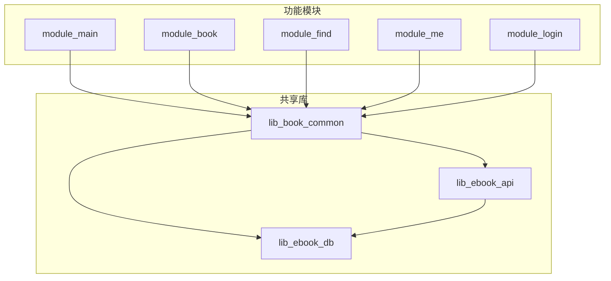
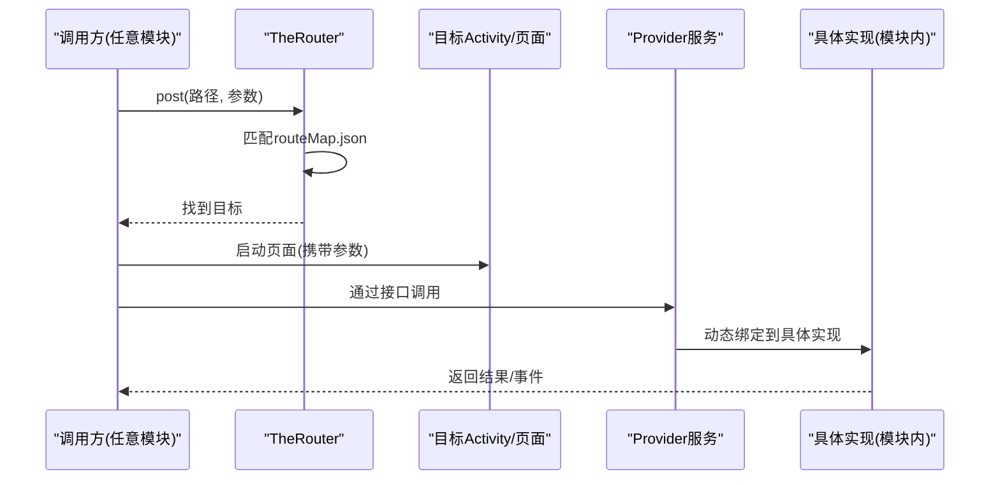
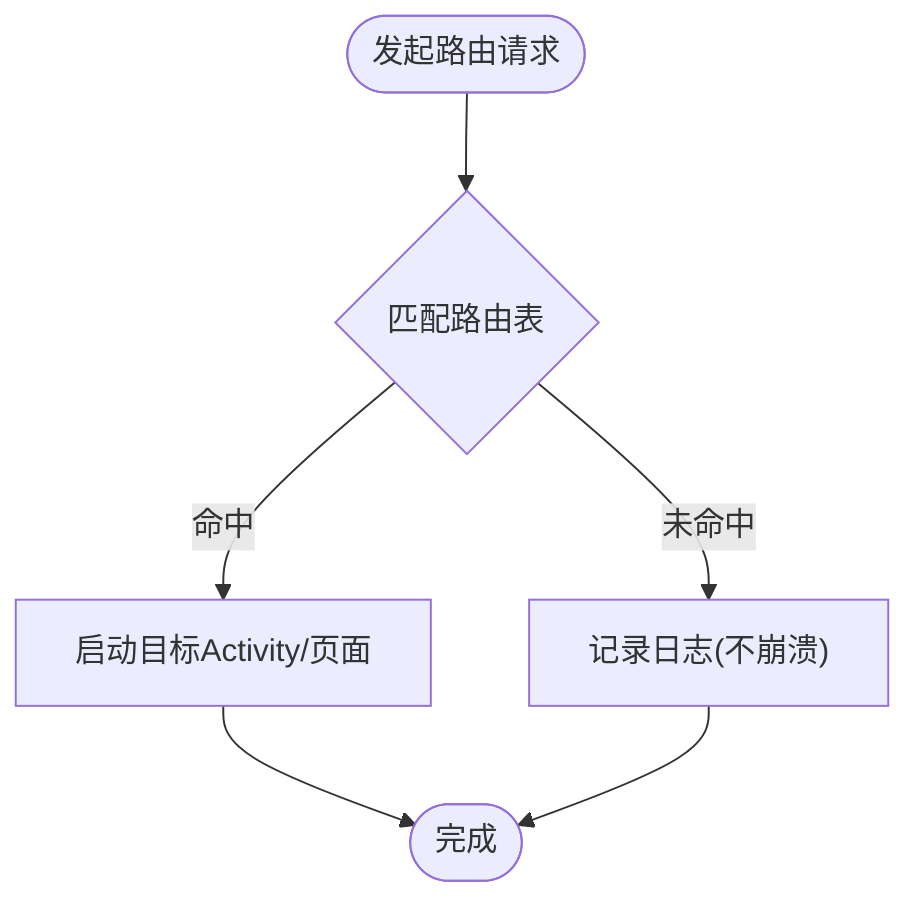
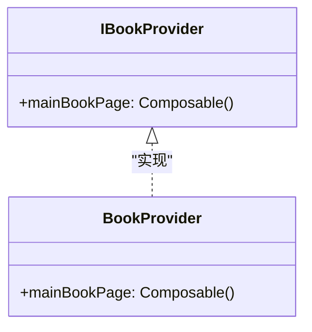
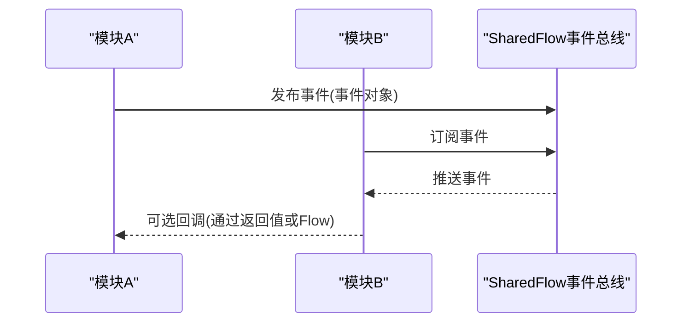
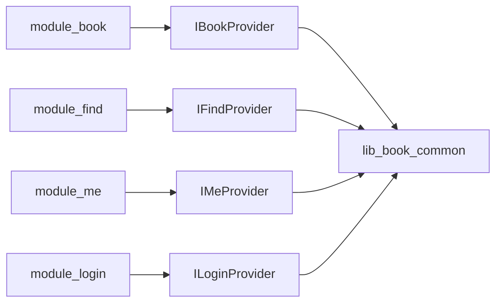

# 跨模块通信机制

<cite>
**本文引用的文件**
- [README.MD](file://README.MD)
- [module_app/src/main/assets/therouter/routeMap.json](file://module_app/src/main/assets/therouter/routeMap.json)
- [lib_book_common/src/main/java/com/ebook/common/provider/IBookProvider.kt](file://lib_book_common/src/main/java/com/ebook/common/provider/IBookProvider.kt)
- [module_book/src/main/java/com/ebook/book/provider/BookProvider.kt](file://module_book/src/main/java/com/ebook/book/provider/BookProvider.kt)
- [lib_book_common/src/main/java/com/ebook/common/provider/IFindProvider.kt](file://lib_book_common/src/main/java/com/ebook/common/provider/IFindProvider.kt)
- [lib_book_common/src/main/java/com/ebook/common/provider/IMeProvider.kt](file://lib_book_common/src/main/java/com/ebook/common/provider/IMeProvider.kt)
- [lib_book_common/src/main/java/com/ebook/common/provider/ILoginProvider.kt](file://lib_book_common/src/main/java/com/ebook/common/provider/ILoginProvider.kt)
- [module_find/src/main/java/com/ebook/find/provider/FindProvider.kt](file://module_find/src/main/java/com/ebook/find/provider/FindProvider.kt)
- [module_me/src/main/java/com/ebook/me\provider/MeProvider.kt](file://module_me/src/main/java/com/ebook/me/provider/MeProvider.kt)
- [module_login/src/main/java/com/ebook/login/provider/LoginProvider.kt](file://module_login/src/main/java/com/ebook/login/provider/LoginProvider.kt)
- [AGENTS.md](file://AGENTS.md)
</cite>

## 目录
1. [简介](#简介)
2. [项目结构](#项目结构)
3. [核心组件](#核心组件)
4. [架构总览](#架构总览)
5. [详细组件分析](#详细组件分析)
6. [依赖关系分析](#依赖关系分析)
7. [性能与可维护性](#性能与可维护性)
8. [故障排查指南](#故障排查指南)
9. [结论](#结论)

## 简介
本文件聚焦多模块架构下的跨模块通信机制，围绕 TheRouter 路由系统与 Provider 接口模式展开，说明路由注册、路径匹配与页面跳转；阐述 Provider 的接口定义、实现类与动态绑定；解释跨模块数据传递（参数、回调、事件）；给出模块间依赖管理策略以避免循环依赖与紧耦合；说明独立开发与集成的配置方式（条件编译与运行时检测）；覆盖安全考虑（权限验证与数据校验）；并提供常见问题与调试技巧。

## 项目结构
本项目采用“业务模块 → 共享库”的分层多模块结构：
- 功能模块：module_main、module_book、module_find、module_me、module_login
- 共享库：lib_book_common（提供跨模块可见的 Provider 接口与通用能力）、lib_ebook_api（网络层）、lib_ebook_db（数据库）
- 应用入口：module_app（装配各模块）

关键约定：
- 功能模块之间互不直接依赖，跨模块导航使用 TheRouter，服务通过 Provider 接口暴露
- 每个模块在 assets/therouter 下提供 routeMap.json，由 TheRouter 在构建期生成并合并
- 跨模块页面以 Composable() -> Unit 形式暴露给宿主组合

图表来源
- [README.MD:86-104](file://README.MD#L86-L104)

章节来源
- [README.MD:86-104](file://README.MD#L86-L104)

## 核心组件
- TheRouter 路由系统：通过注解与资源文件集中管理路由表，实现模块间的页面跳转与参数传递
- Provider 接口模式：在共享库中定义接口，由各功能模块实现并通过 @ServiceProvider 注册，供宿主或其他模块动态获取
- 事件总线：基于 SharedFlow 的轻量级事件分发（替代 RxBus）
- 数据模型与传输对象：在各模块间通过 DTO 或不可变数据类传递，避免直接共享内部状态

章节来源
- [README.MD:114-121](file://README.MD#L114-L121)
- [AGENTS.md:跨模块约定](file://AGENTS.md#L1-L500)

## 架构总览
TheRouter + Provider 的组合实现了“解耦的页面跳转与服务调用”：
- 路由层：声明式路径到 Activity/页面的映射，支持参数、鉴权标记等
- 服务层：以接口为中心暴露能力，实现类按模块注入，宿主按需解析与组合

图表来源
- [module_app/src/main/assets/therouter/routeMap.json:1-150](file://module_app/src/main/assets/therouter/routeMap.json#L1-L150)
- [lib_book_common/src/main/java/com/ebook/common/provider/IBookProvider.kt:1-14](file://lib_book_common/src/main/java/com/ebook/common/provider/IBookProvider.kt#L1-L14)
- [module_book/src/main/java/com/ebook/book/provider/BookProvider.kt:1-16](file://module_book/src/main/java/com/ebook/book/provider/BookProvider.kt#L1-L16)

## 详细组件分析

### TheRouter 路由系统
- 路由注册：每个模块在 assets/therouter/routeMap.json 中声明路径到类的映射；构建时由 TheRouter 工具扫描注解并回写路由表
- 路径匹配：路由请求进入后，根据路径查找目标类；若找不到则仅记录日志，不会崩溃
- 页面跳转：支持带参数的跳转，参数以键值对形式传递；可在路由表中配置如 needLogin 等元信息用于鉴权
- 独立模式兼容：独立运行模式下，缺失的路由会静默失败；建议在 src/main/test/debug 下放置占位路由以维持链路稳定

图表来源
- [module_app/src/main/assets/therouter/routeMap.json:1-150](file://module_app/src/main/assets/therouter/routeMap.json#L1-L150)
- [AGENTS.md:跨模块路由行为](file://AGENTS.md#L1-L500)

章节来源
- [module_app/src/main/assets/therouter/routeMap.json:1-150](file://module_app/src/main/assets/therouter/routeMap.json#L1-L150)
- [AGENTS.md:跨模块路由行为](file://AGENTS.md#L1-L500)

### Provider 接口模式
- 接口定义：在 lib_book_common 中定义跨模块可见的接口（如 IBookProvider、IFindProvider、IMeProvider、ILoginProvider），统一暴露页面或服务
- 实现类：各功能模块提供具体实现，并通过 @ServiceProvider 注解注册到框架
- 动态绑定：宿主或其他模块通过接口类型获取实例，无需知道具体实现类位于哪个模块
- 页面组合：对于 Compose 页面，Provider 返回 @Composable () -> Unit，由宿主的 NavHost 直接组合，ViewModel 作用域由调用处决定

图表来源
- [lib_book_common/src/main/java/com/ebook/common/provider/IBookProvider.kt:1-14](file://lib_book_common/src/main/java/com/ebook/common/provider/IBookProvider.kt#L1-L14)
- [module_book/src/main/java/com/ebook/book/provider/BookProvider.kt:1-16](file://module_book/src/main/java/com/ebook/book/provider/BookProvider.kt#L1-L16)

章节来源
- [lib_book_common/src/main/java/com/ebook/common/provider/IBookProvider.kt:1-14](file://lib_book_common/src/main/java/com/ebook/common/provider/IBookProvider.kt#L1-L14)
- [module_book/src/main/java/com/ebook/book/provider/BookProvider.kt:1-16](file://module_book/src/main/java/com/ebook/book/provider/BookProvider.kt#L1-L16)

### 跨模块数据传递
- 参数传递：通过路由参数或 Provider 方法参数传递轻量数据；复杂对象建议使用不可变数据类或 DTO
- 回调处理：优先使用协程 suspend + Flow 进行异步回调；避免在跨模块边界使用全局单例回调
- 事件广播：基于 SharedFlow 的事件总线，订阅端在合适的生命周期内收集事件，避免内存泄漏

章节来源
- [AGENTS.md:事件总线约定](file://AGENTS.md#L1-L500)

### 模块间依赖管理策略
- 依赖方向：功能模块 → lib_book_common → lib_ebook_api / lib_ebook_db；功能模块之间无直接依赖
- 避免循环依赖：通过接口抽象与 Provider 模式解耦；不要在共享库中反向依赖功能模块
- 条件编译：通过 product flavor（real/mock）与 source set 切换不同实现；isModule 开关控制模块独立运行

章节来源
- [README.MD:86-104](file://README.MD#L86-L104)
- [AGENTS.md:构建约定与Mock数据源](file://AGENTS.md#L1-L500)

### 独立开发与集成配置
- 独立模式：设置 isModule=true，功能模块可作为独立 App 运行，自带 mock 数据源
- 集成模式：默认 isModule=false，module_app 组装所有功能模块
- 清单替换：独立态与集成态使用不同的 AndroidManifest.xml，需保持 Activity 声明一致
- 路由占位：独立模式下缺失的路由需在 test/debug 下提供占位实现，避免静默失败

章节来源
- [AGENTS.md:构建约定与Mock数据源](file://AGENTS.md#L1-L500)

### 安全考虑
- 权限验证：路由表中可通过 needLogin 等标记控制访问权限；敏感操作应在服务端与客户端双重校验
- 数据校验：跨模块传递的数据必须进行类型与范围校验；避免信任外部输入
- 最小权限原则：仅申请必要的运行时权限；网络请求限制白名单 host，防止 token 泄露

章节来源
- [AGENTS.md:认证体系与安全约定](file://AGENTS.md#L1-L500)

## 依赖关系分析
功能模块通过共享库暴露的接口进行通信，形成松耦合的依赖图：

图表来源
- [lib_book_common/src/main/java/com/ebook/common/provider/IBookProvider.kt:1-14](file://lib_book_common/src/main/java/com/ebook/common/provider/IBookProvider.kt#L1-L14)
- [lib_book_common/src/main/java/com/ebook/common/provider/IFindProvider.kt:1-200](file://lib_book_common/src/main/java/com/ebook/common/provider/IFindProvider.kt#L1-L200)
- [lib_book_common/src/main/java/com/ebook/common/provider/IMeProvider.kt:1-200](file://lib_book_common/src/main/java/com/ebook/common/provider/IMeProvider.kt#L1-L200)
- [lib_book_common/src/main/java/com/ebook/common/provider/ILoginProvider.kt:1-200](file://lib_book_common/src/main/java/com/ebook/common/provider/ILoginProvider.kt#L1-L200)

章节来源
- [lib_book_common/src/main/java/com/ebook/common/provider/IBookProvider.kt:1-14](file://lib_book_common/src/main/java/com/ebook/common/provider/IBookProvider.kt#L1-L14)
- [lib_book_common/src/main/java/com/ebook/common/provider/IFindProvider.kt:1-200](file://lib_book_common/src/main/java/com/ebook/common/provider/IFindProvider.kt#L1-L200)
- [lib_book_common/src/main/java/com/ebook/common/provider/IMeProvider.kt:1-200](file://lib_book_common/src/main/java/com/ebook/common/provider/IMeProvider.kt#L1-L200)
- [lib_book_common/src/main/java/com/ebook/common/provider/ILoginProvider.kt:1-200](file://lib_book_common/src/main/java/com/ebook/common/provider/ILoginProvider.kt#L1-L200)

## 性能与可维护性
- 路由查找为 O(1) 哈希查找，性能开销极小
- Provider 动态绑定仅在首次加载时产生反射成本，后续调用为直接方法调用
- 事件总线使用 SharedFlow，背压可控，避免内存泄漏
- 通过接口抽象提高可测试性，便于单元测试与集成测试

[本节为通用指导，无需特定文件来源]

## 故障排查指南
- 路由冲突：检查 routeMap.json 中是否存在重复路径；确保路径命名规范且唯一
- 依赖缺失：确认模块已正确声明依赖；检查 provider 实现是否被 @ServiceProvider 注册
- 路由丢失：独立模式下需添加占位路由；修改 @Route 后需重新构建以更新路由表
- 事件未触发：检查 SharedFlow 订阅生命周期；确保发布者与订阅者处于正确的线程上下文
- 权限问题：检查 Manifest 中权限声明；运行时权限需在必要时申请

章节来源
- [AGENTS.md:跨模块路由行为](file://AGENTS.md#L1-L500)
- [module_app/src/main/assets/therouter/routeMap.json:1-150](file://module_app/src/main/assets/therouter/routeMap.json#L1-L150)

## 结论
本项目通过 TheRouter 与 Provider 接口模式实现了高度解耦的跨模块通信机制。路由系统提供了声明式的页面跳转能力，Provider 模式实现了服务的动态绑定与组合。结合 SharedFlow 事件总线与严格的依赖管理策略，项目在保持模块独立性的同时确保了良好的可维护性与扩展性。遵循本文档的最佳实践，团队可以更高效地开发和维护多模块 Android 应用。

[本节为总结性内容，无需特定文件来源]