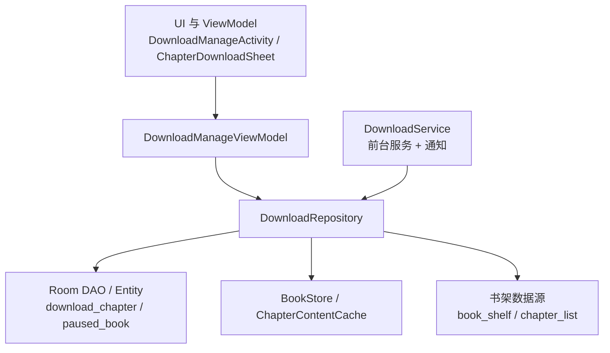
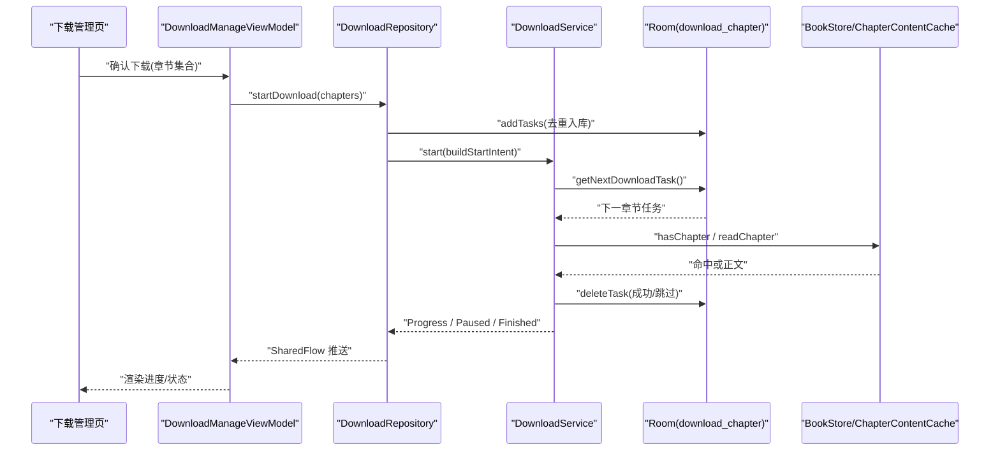
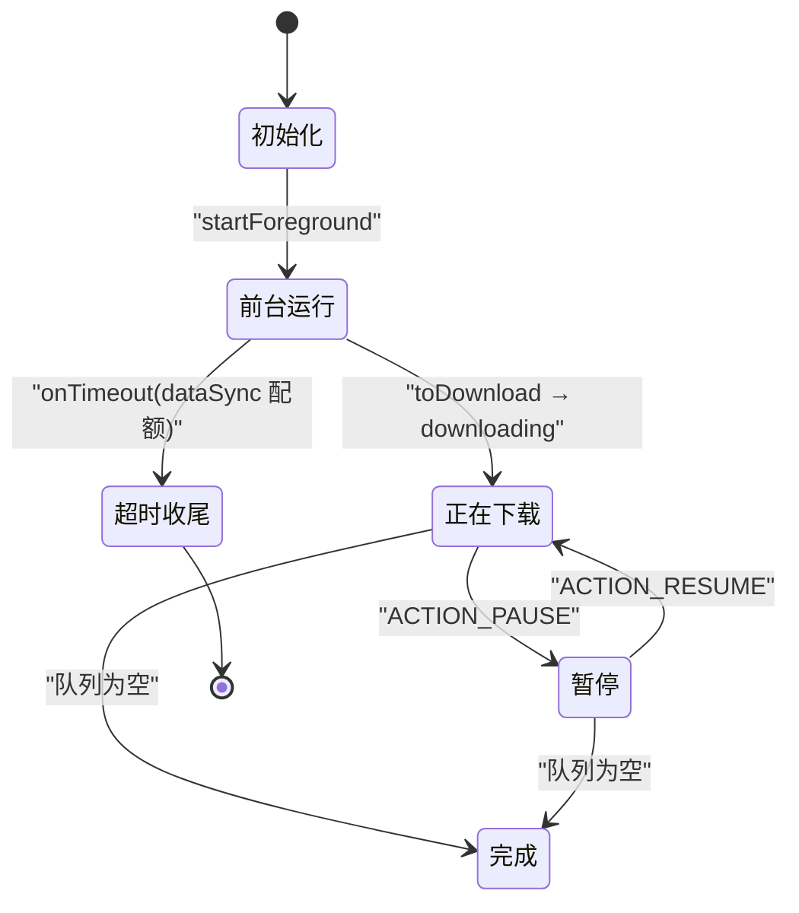
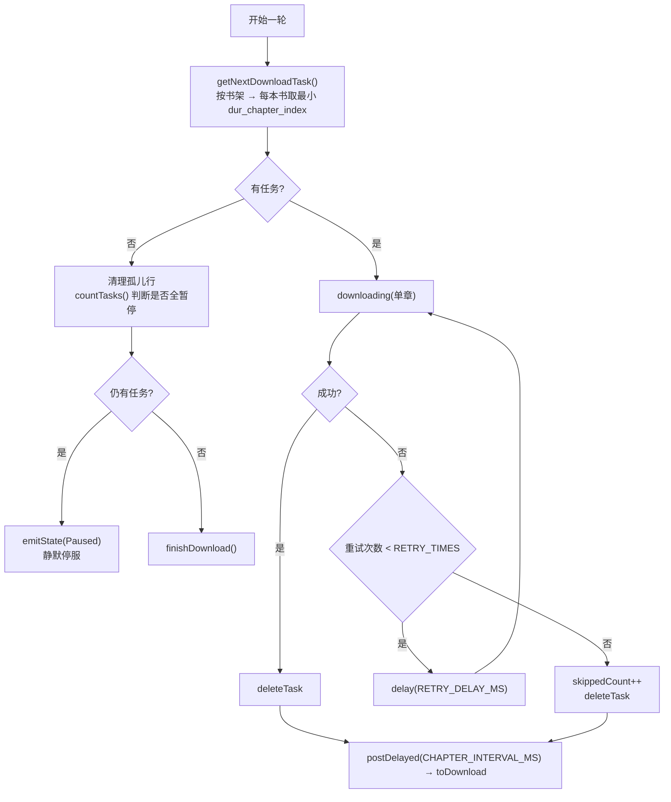
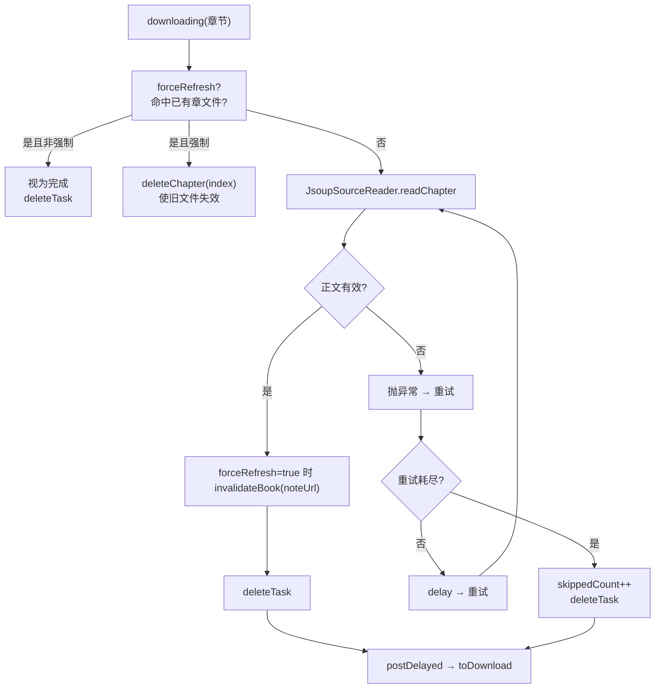
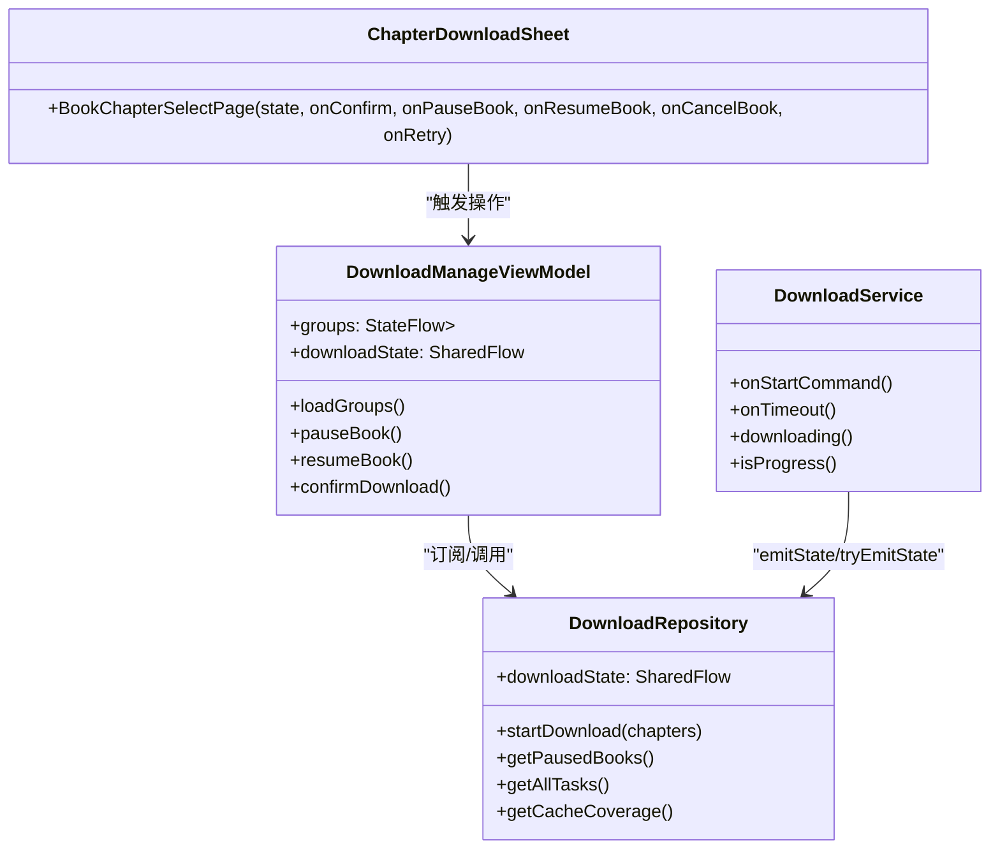
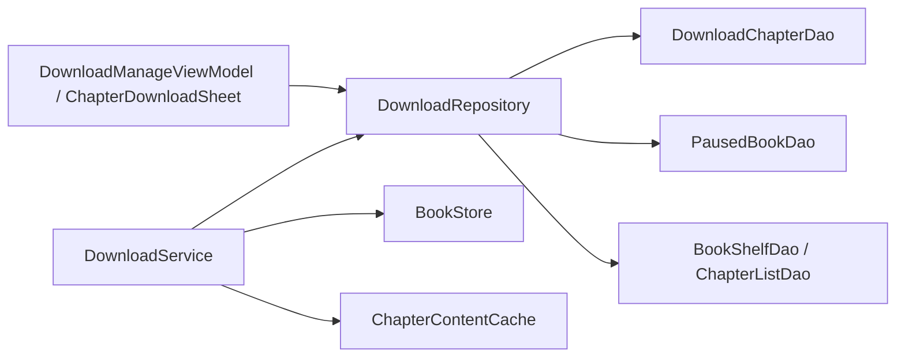

# 下载系统

<cite>
**本文引用的文件**   
- [DownloadService.kt](file://module_book/src/main/java/com/ebook/book/service/DownloadService.kt)
- [DownloadRepository.kt](file://module_book/src/main/java/com/ebook/book/repository/DownloadRepository.kt)
- [DownloadChapterEntity.kt](file://lib_ebook_db/src/main/java/com/ebook/db/entity/DownloadChapterEntity.kt)
- [DownloadChapterDao.kt](file://lib_ebook_db/src/main/java/com/ebook/db/dao/DownloadChapterDao.kt)
- [PausedBookEntity.kt](file://lib_ebook_db/src/main/java/com/ebook/db/entity/PausedBookEntity.kt)
- [PausedBookDao.kt](file://lib_ebook_db/src/main/java/com/ebook/db/dao/PausedBookDao.kt)
- [ChapterContentCache.kt](file://lib_book_common/src/main/java/com/ebook/common/store/ChapterContentCache.kt)
- [BookStore.kt](file://lib_book_common/src/main/java/com/ebook/common/store/BookStore.kt)
- [ChapterDownloadSheet.kt](file://module_book/src/main/java/com/ebook/book/reader/ChapterDownloadSheet.kt)
- [DownloadManageViewModel.kt](file://module_book/src/main/java/com/ebook/book/mvvm/viewmodel/DownloadManageViewModel.kt)
- [0018-download-foreground-service-data-sync-quota.md](file://docs/adr/0018-download-foreground-service-data-sync-quota.md)
- [0036-download-pause-per-book.md](file://docs/adr/0036-download-pause-per-book.md)
- [2026-09-12-download-center-redesign.md](file://docs/superpowers/plans/2026-09-12-download-center-redesign.md)
</cite>

## 目录
1. [引言](#引言)
2. [项目结构与边界](#项目结构与边界)
3. [核心组件](#核心组件)
4. [架构总览](#架构总览)
5. [关键机制详解](#关键机制详解)
6. [依赖关系分析](#依赖关系分析)
7. [性能与资源优化](#性能与资源优化)
8. [故障排查指南](#故障排查指南)
9. [结论](#结论)

## 引言
本文件面向 Android 小说阅读器项目的“离线下载系统”，聚焦以下目标：
- 前台服务生命周期管理与进程保活；
- 下载队列的数据结构、优先级与并发控制；
- 断点续传与异常恢复；
- 调度算法（网络状态、带宽限制、重试策略）；
- 实时进度反馈与用户界面交互；
- 连接池、请求合并、缓存等性能优化；
- 与书架系统的数据一致性。

这些内容以仓库中 `DownloadService`、`DownloadRepository`、Room 表模型以及 ADR/实施计划为依据进行归纳，避免臆造实现细节。

**章节来源**
- [0018-download-foreground-service-data-sync-quota.md:1-58](file://docs/adr/0018-download-foreground-service-data-sync-quota.md#L1-L58)
- [0036-download-pause-per-book.md:1-52](file://docs/adr/0036-download-pause-per-book.md#L1-L52)
- [2026-09-12-download-center-redesign.md:1-200](file://docs/superpowers/plans/2026-09-12-download-center-redesign.md#L1-L200)

## 项目结构与边界
下载系统横跨三个层次：
- UI 与 ViewModel：下载管理页、二级选章页、通知按钮动作入口；
- 业务仓储层：下载任务 CRUD、按书暂停、状态事件流、全书覆盖率；
- 持久化层：Room DAO/Entity（待下载任务、按书暂停标记）。

**图表来源**
- [DownloadManageViewModel.kt:1-200](file://module_book/src/main/java/com/ebook/book/mvvm/viewmodel/DownloadManageViewModel.kt#L1-L200)
- [DownloadRepository.kt:1-200](file://module_book/src/main/java/com/ebook/book/repository/DownloadRepository.kt#L1-L200)
- [DownloadService.kt:1-200](file://module_book/src/main/java/com/ebook/book/service/DownloadService.kt#L1-L200)
- [DownloadChapterEntity.kt:1-88](file://lib_ebook_db/src/main/java/com/ebook/db/entity/DownloadChapterEntity.kt#L1-L88)
- [PausedBookEntity.kt:1-30](file://lib_ebook_db/src/main/java/com/ebook/db/entity/PausedBookEntity.kt#L1-L30)

**章节来源**
- [DownloadManageViewModel.kt:1-200](file://module_book/src/main/java/com/ebook/book/mvvm/viewmodel/DownloadManageViewModel.kt#L1-L200)
- [DownloadRepository.kt:1-200](file://module_book/src/main/java/com/ebook/book/repository/DownloadRepository.kt#L1-L200)
- [DownloadService.kt:1-200](file://module_book/src/main/java/com/ebook/book/service/DownloadService.kt#L1-L200)

## 核心组件
- 前台服务 `DownloadService`：负责启动/暂停/取消、逐章抓取、重试、通知更新、配额超时处理、空载信号续跑。
- 仓储 `DownloadRepository`：封装下载任务与暂停标记的 CRUD、全局队头取篇、状态 SharedFlow、全书缓存覆盖率计算。
- 任务实体 `DownloadChapterEntity`：代表一个尚未完成的章节下载任务，携带书名、封面、归属 tag、强制刷新标志。
- 暂停标记 `PausedBookEntity`：按书暂停的事实源，主键为 note_url。
- 存储 `BookStore` 与正文缓存 `ChapterContentCache`：章节文件读写、单章删除、进程级 LRU 正文缓存。
- UI 与 ViewModel：下载中心一级列表、二级选章页、分组 FAB 面板、三态主操作、范围选择。

**章节来源**
- [DownloadService.kt:1-200](file://module_book/src/main/java/com/ebook/book/service/DownloadService.kt#L1-L200)
- [DownloadRepository.kt:1-200](file://module_book/src/main/java/com/ebook/book/repository/DownloadRepository.kt#L1-L200)
- [DownloadChapterEntity.kt:1-88](file://lib_ebook_db/src/main/java/com/ebook/db/entity/DownloadChapterEntity.kt#L1-L88)
- [PausedBookEntity.kt:1-30](file://lib_ebook_db/src/main/java/com/ebook/db/entity/PausedBookEntity.kt#L1-L30)
- [ChapterContentCache.kt:1-63](file://lib_book_common/src/main/java/com/ebook/common/store/ChapterContentCache.kt#L1-L63)
- [BookStore.kt:1-200](file://lib_book_common/src/main/java/com/ebook/common/store/BookStore.kt#L1-L200)
- [ChapterDownloadSheet.kt:1-200](file://module_book/src/main/java/com/ebook/book/reader/ChapterDownloadSheet.kt#L1-L200)
- [DownloadManageViewModel.kt:1-200](file://module_book/src/main/java/com/ebook/book/mvvm/viewmodel/DownloadManageViewModel.kt#L1-L200)

## 架构总览
下载系统采用“前台服务 + 仓库 + Room”的分层设计：
- 控制面通过 Intent 直达 DownloadService，避免命令通道 replay=0 导致的服务不存活时命令丢失；
- 队列事实唯一落在 `download_chapter` 表，不再随 Intent 传递章节列表；
- 页面侧通过 `DownloadState` SharedFlow 订阅服务状态；
- 按书暂停由 `paused_book` 表承载，取篇时在仓库层跳过；
- 全文阅读缓存由 `ChapterContentCache` 提供进程级 LRU，下载强制刷新时按书失效。

**图表来源**
- [DownloadRepository.kt:201-311](file://module_book/src/main/java/com/ebook/book/repository/DownloadRepository.kt#L201-L311)
- [DownloadService.kt:201-491](file://module_book/src/main/java/com/ebook/book/service/DownloadService.kt#L201-L491)
- [DownloadChapterDao.kt:1-131](file://lib_ebook_db/src/main/java/com/ebook/db/dao/DownloadChapterDao.kt#L1-L131)
- [ChapterContentCache.kt:1-63](file://lib_book_common/src/main/java/com/ebook/common/store/ChapterContentCache.kt#L1-L63)
- [BookStore.kt:1-200](file://lib_book_common/src/main/java/com/ebook/common/store/BookStore.kt#L1-L200)

## 关键机制详解

### 一、前台服务生命周期与进程保活
- 使用 `foregroundServiceType="dataSync"` 的前台服务，常驻通知区分“进行中/已暂停”与“完成”。
- 启动入口统一经 `DownloadService.start()`，内部捕获 dataSync 配额用尽或后台启动被拒等异常，返回失败由调用方提示。
- Android 15+ 配额回调 `onTimeout`：数秒内只做收尾（清标志位、清空 Handler 回调、同步发射 Paused、发提示通知、stopSelf），不做 IO。
- 前台初始化失败置 `fgUnavailable`：自动续跑分支直接收尾并返回 `START_NOT_STICKY`，避免反复拉起同一异常。
- 控制动作通过通知 PendingIntent 的 ACTION_PAUSE/ACTION_RESUME/ACTION_CANCEL 直达服务，幂等。

**图表来源**
- [DownloadService.kt:1-200](file://module_book/src/main/java/com/ebook/book/service/DownloadService.kt#L1-L200)
- [DownloadService.kt:201-491](file://module_book/src/main/java/com/ebook/book/service/DownloadService.kt#L201-L491)
- [0018-download-foreground-service-data-sync-quota.md:1-58](file://docs/adr/0018-download-foreground-service-data-sync-quota.md#L1-L58)

**章节来源**
- [DownloadService.kt:1-200](file://module_book/src/main/java/com/ebook/book/service/DownloadService.kt#L1-L200)
- [DownloadService.kt:201-491](file://module_book/src/main/java/com/ebook/book/service/DownloadService.kt#L201-L491)
- [0018-download-foreground-service-data-sync-quota.md:1-58](file://docs/adr/0018-download-foreground-service-data-sync-quota.md#L1-L58)

### 二、下载队列数据结构与并发控制
- 队列表 `download_chapter` 只存未完成任务，行数即剩余章数；主键自增 id，`dur_chapter_url` 唯一索引保证同章不重复排队。
- 取篇顺序：按书架遍历，每本书取 `dur_chapter_index` 最小的队头，因此本质是“目录顺序优先”的 FIFO。
- 并发模型：服务在 `downloading` 中以协程执行当前章抓取，并通过 `myHandler.postDelayed(CHAPTER_INTERVAL_MS)` 串行推进到下一章；没有多连接并发下载同一书。
- 资源分配：每章之间刻意间隔固定毫秒，降低瞬时网络压力；同时作为简单节流。
- 优先级：无显式权重；通过“书架顺序 + 每本书队头最小章号”隐式决定优先级。

**图表来源**
- [DownloadRepository.kt:1-200](file://module_book/src/main/java/com/ebook/book/repository/DownloadRepository.kt#L1-L200)
- [DownloadService.kt:201-491](file://module_book/src/main/java/com/ebook/book/service/DownloadService.kt#L201-L491)
- [DownloadChapterDao.kt:1-131](file://lib_ebook_db/src/main/java/com/ebook/db/dao/DownloadChapterDao.kt#L1-L131)

**章节来源**
- [DownloadRepository.kt:1-200](file://module_book/src/main/java/com/ebook/book/repository/DownloadRepository.kt#L1-L200)
- [DownloadService.kt:201-491](file://module_book/src/main/java/com/ebook/book/service/DownloadService.kt#L201-L491)
- [DownloadChapterDao.kt:1-131](file://lib_ebook_db/src/main/java/com/ebook/db/dao/DownloadChapterDao.kt#L1-L131)
- [DownloadChapterEntity.kt:1-88](file://lib_ebook_db/src/main/java/com/ebook/db/entity/DownloadChapterEntity.kt#L1-L88)

### 三、断点续传、分片下载与异常恢复
- 断点续传粒度：以“整章”为单位。一章下完才出队；失败最多重试固定次数，耗尽后跳过并出队，保留后续章节继续。
- 分片下载：代码中未见 HTTP Range 分片下载实现；实际是“整章正文解析 + 写入章文件”，因此“分片”应理解为“按章节切分的下载单元”，而非网络层字节分片。
- 进度记录：每章开抓前发送 Progress，通知文案显示当前书和章节名；完成/取消/暂停路径均同步发射终态。
- 异常恢复：
  - 空正文判定失败，走重试；
  - 书源缺失按普通失败处理，重试耗尽出队；
  - 取消/暂停不打断当前已发出的请求，但会中断重试循环，下次继续从头重试该章；
  - 队列取不到下一章 ≠ 完成：可能全部处于“按书暂停”，此时清理孤儿行后进入 Paused 并静默停服。

**图表来源**
- [DownloadService.kt:201-491](file://module_book/src/main/java/com/ebook/book/service/DownloadService.kt#L201-L491)
- [ChapterContentCache.kt:1-63](file://lib_book_common/src/main/java/com/ebook/common/store/ChapterContentCache.kt#L1-L63)
- [BookStore.kt:1-200](file://lib_book_common/src/main/java/com/ebook/common/store/BookStore.kt#L1-L200)

**章节来源**
- [DownloadService.kt:201-491](file://module_book/src/main/java/com/ebook/book/service/DownloadService.kt#L201-L491)
- [ChapterContentCache.kt:1-63](file://lib_book_common/src/main/java/com/ebook/common/store/ChapterContentCache.kt#L1-L63)
- [BookStore.kt:1-200](file://lib_book_common/src/main/java/com/ebook/common/store/BookStore.kt#L1-L200)

### 四、调度算法：网络状态、带宽限制与智能重试
- 网络状态监听：仓库层未发现独立网络状态监听器；调度主要依赖服务自身生命周期、dataSync 配额回调与通知控制动作。
- 带宽限制：未实现动态带宽探测；通过固定章节间隔 `CHAPTER_INTERVAL_MS` 与每章最大重试次数 `RETRY_TIMES` 控制整体节奏。
- 重试策略：指数退避未体现，实现为固定延迟 `RETRY_DELAY_MS`；重试耗尽后“跳过”而非永久失败，后续可重新发起。
- 智能性：主要体现在“按书暂停”“孤儿任务清理”“队头阻塞防护（失败必须出队）”“强制刷新使内存缓存失效”。

**章节来源**
- [DownloadService.kt:201-491](file://module_book/src/main/java/com/ebook/book/service/DownloadService.kt#L201-L491)
- [0018-download-foreground-service-data-sync-quota.md:1-58](file://docs/adr/0018-download-foreground-service-data-sync-quota.md#L1-L58)

### 五、实时进度反馈与 UI 交互
- 状态通道：`DownloadRepository.downloadState` 使用 `replay=1` 的 SharedFlow，晚开的下载管理页能立即对齐当前进度。
- UI 表现：
  - 常驻通知：LOW 重要性通道用于进行中/已暂停，DEFAULT 通道用于完成通知；
  - 下载管理页：按书分组展示剩余章数、全书缓存覆盖率、活跃章节；
  - 二级选章页：FAB 展开勾选工具面板，书头三态主操作（下载/暂停/继续）、取消本书、范围选择。
- 交互约束：
  - “下载”与“继续下载”合并为一枚三态主操作；
  - 暂停是书级事实，新加任务自然继承暂停语义；
  - 超 500 章触发二次确认软上限。

**图表来源**
- [DownloadManageViewModel.kt:1-200](file://module_book/src/main/java/com/ebook/book/mvvm/viewmodel/DownloadManageViewModel.kt#L1-L200)
- [ChapterDownloadSheet.kt:1-200](file://module_book/src/main/java/com/ebook/book/reader/ChapterDownloadSheet.kt#L1-L200)
- [DownloadRepository.kt:1-200](file://module_book/src/main/java/com/ebook/book/repository/DownloadRepository.kt#L1-L200)
- [DownloadService.kt:1-200](file://module_book/src/main/java/com/ebook/book/service/DownloadService.kt#L1-L200)

**章节来源**
- [ChapterDownloadSheet.kt:1-200](file://module_book/src/main/java/com/ebook/book/reader/ChapterDownloadSheet.kt#L1-L200)
- [DownloadManageViewModel.kt:1-200](file://module_book/src/main/java/com/ebook/book/mvvm/viewmodel/DownloadManageViewModel.kt#L1-L200)
- [DownloadRepository.kt:201-311](file://module_book/src/main/java/com/ebook/book/repository/DownloadRepository.kt#L201-L311)

### 六、与书架系统的数据一致性
- 任务入队前查重：`dur_chapter_url` 唯一索引保证同章不重复排队；重复入队走 REPLACE 覆盖旧行并保留原 force_refresh 标记。
- 取篇排除本地书与暂停书：`getNextDownloadTask` 遍历书架，跳过本地标签与 `paused_book` 中的 note_url。
- 孤儿任务清理：当取篇为空时，先清理不在书架的任务行，再按 countTasks 判断是否全暂停；取消本书或清空队列时连带删除暂停标记。
- 全书缓存覆盖率：基于 `chapter_list` 长度与 `BookStore.hasChapter` 判章文件存在，与“队列剩余”口径分离，避免误导。

**章节来源**
- [DownloadRepository.kt:1-200](file://module_book/src/main/java/com/ebook/book/repository/DownloadRepository.kt#L1-L200)
- [DownloadRepository.kt:201-311](file://module_book/src/main/java/com/ebook/book/repository/DownloadRepository.kt#L201-L311)
- [PausedBookDao.kt:1-36](file://lib_ebook_db/src/main/java/com/ebook/db/dao/PausedBookDao.kt#L1-L36)
- [DownloadChapterDao.kt:1-131](file://lib_ebook_db/src/main/java/com/ebook/db/dao/DownloadChapterDao.kt#L1-L131)
- [0036-download-pause-per-book.md:1-52](file://docs/adr/0036-download-pause-per-book.md#L1-L52)

## 依赖关系分析
- DownloadService 依赖：
  - DownloadRepository：队列读取、状态发射、清理；
  - JsoupSourceReader：网络章节抓取；
  - BookStore/ChapterContentCache：章节文件与内存缓存；
  - NotificationManager：常驻通知。
- DownloadRepository 依赖：
  - Room DAO：download_chapter、paused_book、book_shelf、chapter_list；
  - BookStore：章节存在性判断；
  - Hilt DI：@Singleton 注入。
- UI 层依赖：
  - DownloadManageViewModel：聚合队列、覆盖率、暂停态；
  - ChapterDownloadSheet：Compose UI 组合，纯逻辑下沉至 ChapterSelection（计划文档描述）。

**图表来源**
- [DownloadService.kt:1-200](file://module_book/src/main/java/com/ebook/book/service/DownloadService.kt#L1-L200)
- [DownloadRepository.kt:1-200](file://module_book/src/main/java/com/ebook/book/repository/DownloadRepository.kt#L1-L200)
- [DownloadChapterDao.kt:1-131](file://lib_ebook_db/src/main/java/com/ebook/db/dao/DownloadChapterDao.kt#L1-L131)
- [PausedBookDao.kt:1-36](file://lib_ebook_db/src/main/java/com/ebook/db/dao/PausedBookDao.kt#L1-L36)

**章节来源**
- [DownloadService.kt:1-200](file://module_book/src/main/java/com/ebook/book/service/DownloadService.kt#L1-L200)
- [DownloadRepository.kt:1-200](file://module_book/src/main/java/com/ebook/book/repository/DownloadRepository.kt#L1-L200)

## 性能与资源优化
- 连接池管理：仓库与服务中未见 OkHttp/连接池调优代码片段；若需扩展，可在网络层统一复用连接池以降低握手开销。
- 请求合并：当前按章串行抓取，不存在同章或多章并发合并；如需批量拉取元信息，可在仓储层做批查询，但正文抓取仍保持章节原子性。
- 缓存策略：
  - 章节文件：`BookStore` 按书目录 + 零填充序号命名，支持单章删除；
  - 正文内存缓存：`ChapterContentCache` 容量 3，LRU 按 content_ref 访问序淘汰，按书失效；
  - 强制刷新：重抓成功后主动 invalidateBook，避免阅读器继续读到旧正文。
- I/O 与 CPU：
  - 章节间隔固定毫秒，避免频繁轮询；
  - 通知更新与状态发射隔离，避免 UI 线程阻塞；
  - 队列计数 Flow 观察角标，无需手动刷新。

**章节来源**
- [ChapterContentCache.kt:1-63](file://lib_book_common/src/main/java/com/ebook/common/store/ChapterContentCache.kt#L1-L63)
- [BookStore.kt:1-200](file://lib_book_common/src/main/java/com/ebook/common/store/BookStore.kt#L1-L200)
- [DownloadService.kt:201-491](file://module_book/src/main/java/com/ebook/book/service/DownloadService.kt#L201-L491)

## 故障排查指南
- dataSync 配额用尽或后台启动被拒：
  - 现象：点击“下载/全部开始”闪退或无响应；
  - 排查：检查 `DownloadService.start()` 返回值与日志；Android 15+ 注意 `onTimeout` 是否及时 stopSelf；
  - 参考：[0018-download-foreground-service-data-sync-quota.md:1-58](file://docs/adr/0018-download-foreground-service-data-sync-quota.md#L1-L58)。
- 下载卡在某一章：
  - 现象：常驻通知不消失、前台服务永驻；
  - 原因：失败任务未出队导致队头阻塞；
  - 修复：确保重试耗尽后 deleteTask；检查 `downloading` 的失败分支。
- 全部暂停却报“下载完成”：
  - 原因：取篇为空但误认为队列为空；
  - 修复：先清理孤儿行，再用 countTasks 判断是否全暂停，走 Paused 并静默停服。
- 通知不可见或服务崩溃：
  - 前台初始化异常时 fgUnavailable 分支会停止自动续跑；
  - 通知权限被拒不会导致 startForeground 失败，但通知可能被系统丢弃。

**章节来源**
- [DownloadService.kt:1-200](file://module_book/src/main/java/com/ebook/book/service/DownloadService.kt#L1-L200)
- [DownloadService.kt:201-491](file://module_book/src/main/java/com/ebook/book/service/DownloadService.kt#L201-L491)
- [0018-download-foreground-service-data-sync-quota.md:1-58](file://docs/adr/0018-download-foreground-service-data-sync-quota.md#L1-L58)

## 结论
该下载系统以“前台 dataSync 服务 + 仓库 + Room”为核心，将队列事实落地数据库，通过空载 Intent 信号与 SharedFlow 状态通道解耦 UI 与控制面；以“按书暂停”“孤儿清理”“失败必出队”“强制刷新失效正文缓存”等机制保障可靠性与一致性。当前实现侧重稳定性与可维护性，在网络层连接池、动态带宽控制方面留出了扩展空间，适合后续按需增强。