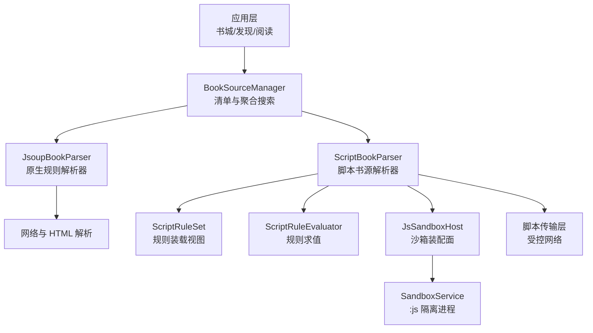
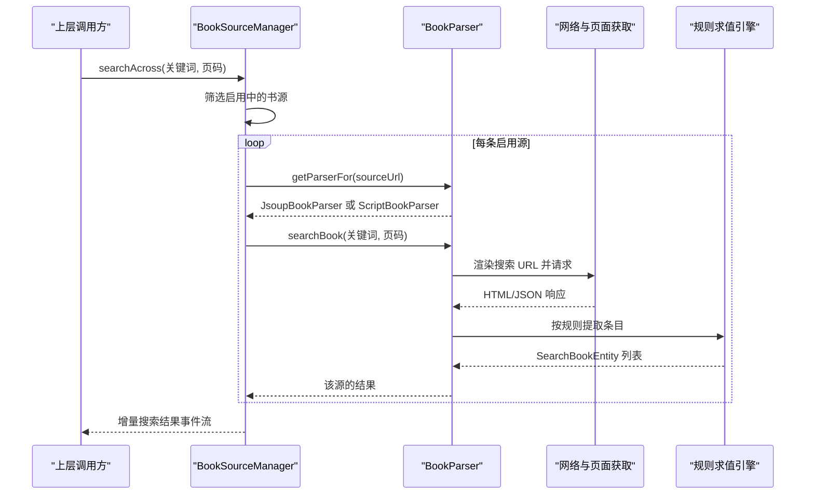
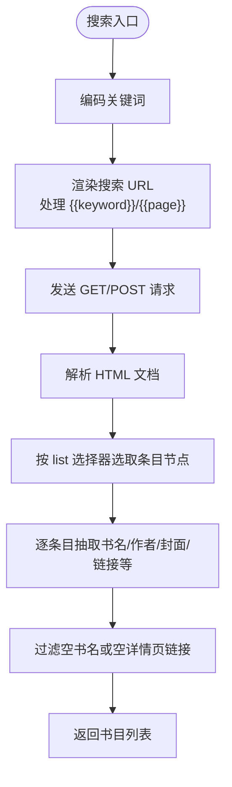
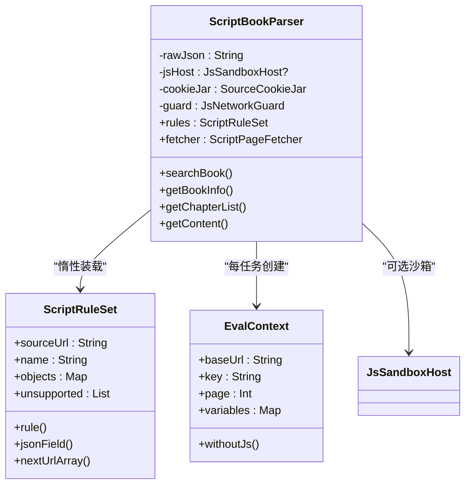
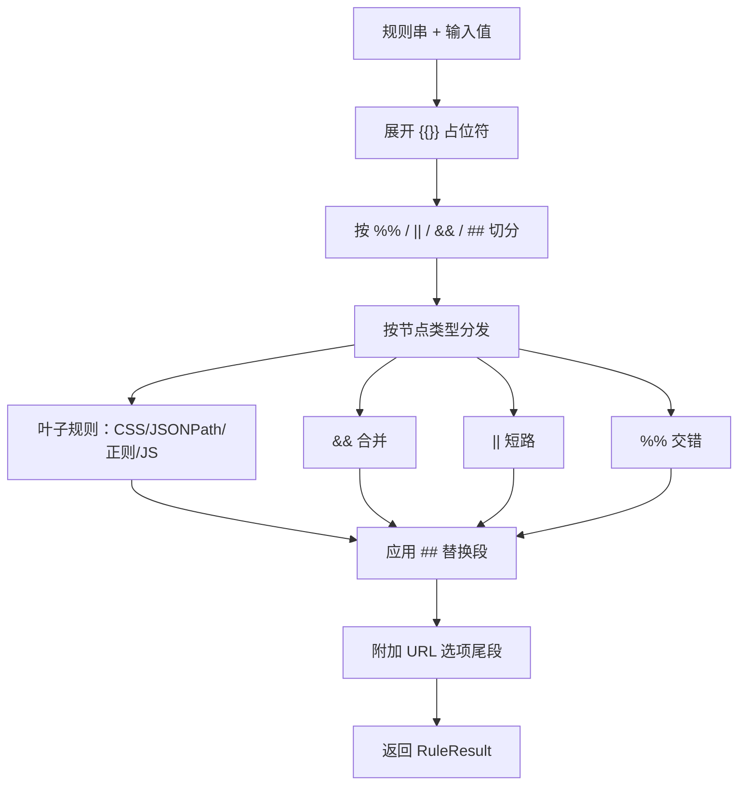
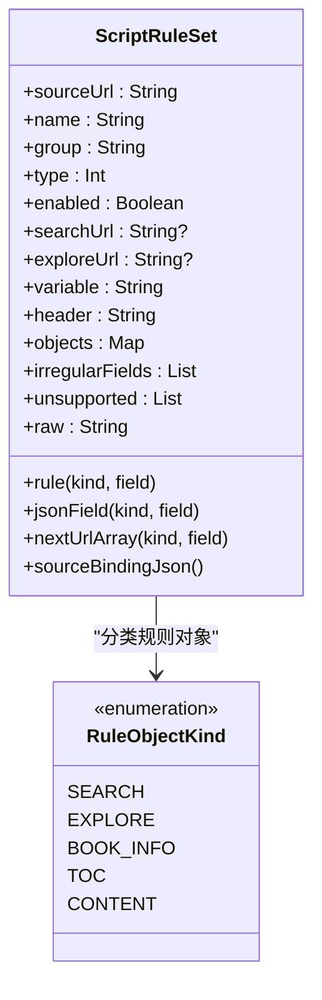
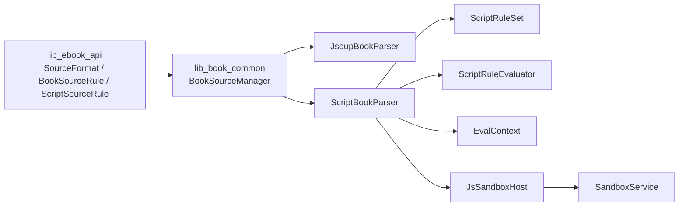
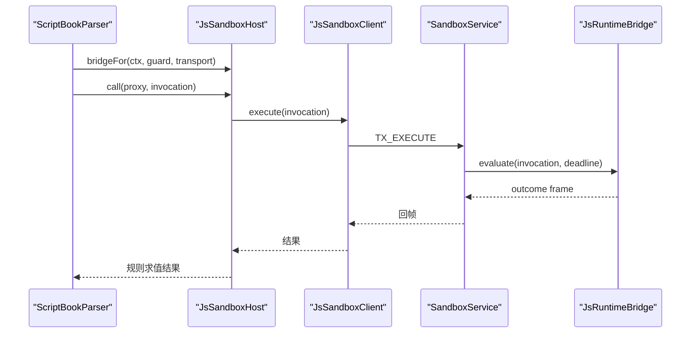
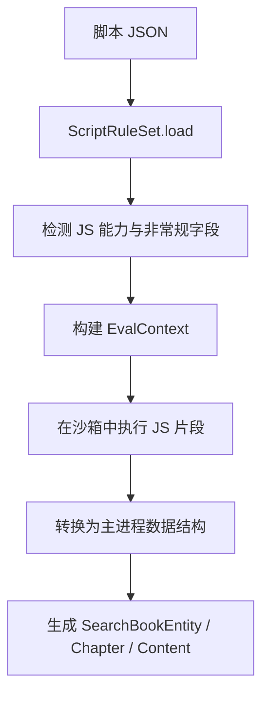

# 书源系统

<cite>
**本文引用的文件**   
- [lib_ebook_api/SourceFormat.kt](file://lib_ebook_api/src/main/java/com/ebook/api/entity/SourceFormat.kt)
- [lib_ebook_api/ScriptSourceRule.kt](file://lib_ebook_api/src/main/java/com/ebook/api/entity/ScriptSourceRule.kt)
- [lib_ebook_api/BookSourceRule.kt](file://lib_ebook_api/src/main/java/com/ebook/api/entity/BookSourceRule.kt)
- [lib_book_common/BookSourceManager.kt](file://lib_book_common/src/main/java/com/ebook/common/analyze/source/BookSourceManager.kt)
- [lib_book_source/JsoupBookParser.kt](file://lib_book_source/src/main/java/com/ebook/source/analyze/JsoupBookParser.kt)
- [lib_book_source/ScriptBookParser.kt](file://lib_book_source/src/main/java/com/ebook/source/analyze/ScriptBookParser.kt)
- [lib_book_source/ScriptRuleEvaluator.kt](file://lib_book_source/src/main/java/com/ebook/source/script/ScriptRuleEvaluator.kt)
- [lib_book_source/ScriptRuleSet.kt](file://lib_book_source/src/main/java/com/ebook/source/script/ScriptRuleSet.kt)
- [lib_book_source/RuleScanner.kt](file://lib_book_source/src/main/java/com/ebook/source/script/RuleScanner.kt)
- [lib_book_source/EvalContext.kt](file://lib_book_source/src/main/java/com/ebook/source/script/EvalContext.kt)
- [lib_book_source/SandboxService.kt](file://lib_book_source/src/main/java/com/ebook/source/sandbox/SandboxService.kt)
- [lib_book_source/JsSandboxHost.kt](file://lib_book_source/src/main/java/com/ebook/source/sandbox/JsSandboxHost.kt)
</cite>

## 目录
1. [引言](#引言)
2. [项目结构](#项目结构)
3. [核心组件](#核心组件)
4. [架构总览](#架构总览)
5. [详细组件分析](#详细组件分析)
6. [依赖关系分析](#依赖关系分析)
7. [性能与安全](#性能与安全)
8. [调试与故障排查](#调试与故障排查)
9. [书源配置编写指南](#书源配置编写指南)
10. [JavaScript 脚本开发指南](#javascript-脚本开发指南)
11. [书源管理界面使用与最佳实践](#书源管理界面使用与最佳实践)
12. [结论](#结论)

## 引言
本项目的书源系统支持两类书源：  
- **原生规则书源**：用 JSON 声明式描述搜索、详情、目录、正文和分类，由 `JsoupBookParser` 解析。  
- **脚本书源**：社区通用 JSON 格式，规则中可内嵌 JavaScript；由 `ScriptBookParser` 在 QuickJS 沙箱中求值。

两套书源共存于同一张 `book_source` 表，通过 `format` 列路由到不同解析路径。默认书源不再限定为原生规则，脚本源同样可以成为默认源。聚合搜索会并发调用所有启用中的书源（含脚本），并以事件流形式向上层返回增量结果。

## 项目结构
与书源系统直接相关的代码主要分布在三个模块：

| 模块 | 职责 | 关键路径 |
| --- | --- | --- |
| `lib_ebook_api` | 书源数据模型、格式判别、原生规则字段定义 | `entity/SourceFormat.kt`、`entity/BookSourceRule.kt`、`entity/ScriptSourceRule.kt` |
| `lib_book_common` | 书源管理器接口、默认源与清单语义、聚合搜索入口 | `analyze/source/BookSourceManager.kt` |
| `lib_book_source` | 解析器、脚本规则引擎、QuickJS 沙箱桥接 | `analyze/*`、`script/*`、`sandbox/*` |

**图表来源**
- [lib_book_common/BookSourceManager.kt](file://lib_book_common/src/main/java/com/ebook/common/analyze/source/BookSourceManager.kt)
- [lib_book_source/JsoupBookParser.kt](file://lib_book_source/src/main/java/com/ebook/source/analyze/JsoupBookParser.kt)
- [lib_book_source/ScriptBookParser.kt](file://lib_book_source/src/main/java/com/ebook/source/analyze/ScriptBookParser.kt)
- [lib_book_source/ScriptRuleSet.kt](file://lib_book_source/src/main/java/com/ebook/source/script/ScriptRuleSet.kt)
- [lib_book_source/ScriptRuleEvaluator.kt](file://lib_book_source/src/main/java/com/ebook/source/script/ScriptRuleEvaluator.kt)
- [lib_book_source/JsSandboxHost.kt](file://lib_book_source/src/main/java/com/ebook/source/sandbox/JsSandboxHost.kt)
- [lib_book_source/SandboxService.kt](file://lib_book_source/src/main/java/com/ebook/source/sandbox/SandboxService.kt)

**章节来源**
- [lib_ebook_api/SourceFormat.kt](file://lib_ebook_api/src/main/java/com/ebook/api/entity/SourceFormat.kt)
- [lib_ebook_api/BookSourceRule.kt](file://lib_ebook_api/src/main/java/com/ebook/api/entity/BookSourceRule.kt)
- [lib_book_common/BookSourceManager.kt](file://lib_book_common/src/main/java/com/ebook/common/analyze/source/BookSourceManager.kt)

## 核心组件
### 书源格式与默认载体
- `SourceFormat` 区分 `native` 与 `script`，数据库列值以小写存储，枚举提供 `raw` 属性避免大小写漂移。
- `SourceFormatDetector` 通过顶层键 `bookSourceUrl` 判别脚本格式；未知或空键集回落原生格式。
- `SourceDefinition` 是默认源载体：原生分支携带 `BookSourceRule`，脚本分支携带原始 JSON、名称与 URL。

**章节来源**
- [lib_ebook_api/SourceFormat.kt](file://lib_ebook_api/src/main/java/com/ebook/api/entity/SourceFormat.kt)

### 原生规则模型
`BookSourceRule` 是原生书源的完整 JSON 映射，包含：
- 基本信息：名称、URL、启用态、分组、权重、字符集、请求头、请求方法与体。
- 搜索规则：搜索 URL、分页、搜索结果选择器。
- 书籍详情规则：书名、作者、封面、简介、分类、最新章节、目录页地址、反转选项。
- 目录规则：章节列表选择器、章节名/链接选择器、下一页选择器、索引页 URL 模板、反转。
- 正文规则：内容容器、下一页、替换规则、图片正文。
- 发现/分类规则：分类 URL 模板、分类项、复用搜索规则。

**章节来源**
- [lib_ebook_api/BookSourceRule.kt](file://lib_ebook_api/src/main/java/com/ebook/api/entity/BookSourceRule.kt)

### 书源管理器
`BookSourceManager` 是书源清单的唯一入口，负责：
- 读取全部或启用中的原生规则。
- 按 URL 取解析器并带 LRU 缓存。
- 聚合搜索：对启用中的两种格式并发调用，限制并发上限为 5。
- 新增、删除、启用/禁用、设置默认源。
- 订阅清单与默认源。
- 导入/导出原生规则。

关键点：
- 原生规则类型化读面只返回 `BookSourceRule`，脚本行被跳过。
- 默认源观察返回 `SourceDefinition?`，无可用源时返回 null。
- 聚合搜索失败不中断整条流，单源异常收敛为失败事件。

**章节来源**
- [lib_book_common/BookSourceManager.kt](file://lib_book_common/src/main/java/com/ebook/common/analyze/source/BookSourceManager.kt)

## 架构总览
书源解析的总流程分为两条主线：

**图表来源**
- [lib_book_common/BookSourceManager.kt](file://lib_book_common/src/main/java/com/ebook/common/analyze/source/BookSourceManager.kt)
- [lib_book_source/JsoupBookParser.kt](file://lib_book_source/src/main/java/com/ebook/source/analyze/JsoupBookParser.kt)
- [lib_book_source/ScriptBookParser.kt](file://lib_book_source/src/main/java/com/ebook/source/analyze/ScriptBookParser.kt)
- [lib_book_source/ScriptRuleEvaluator.kt](file://lib_book_source/src/main/java/com/ebook/source/script/ScriptRuleEvaluator.kt)

## 详细组件分析

### 原生规则解析器：JsoupBookParser
`JsoupBookParser` 根据 `BookSourceRule` 动态解析 HTML，承担以下能力：

| 能力 | 输入 | 输出 | 关键行为 |
| --- | --- | --- | --- |
| 搜索 | 关键词、页码 | 书目列表 | 编码关键词、渲染搜索 URL、解析搜索结果 |
| 详情 | 书架实体 | 填充详情的书架实体 | 解析书名、作者、封面、简介、目录页地址 |
| 目录 | 书架实体 | 章节列表 | 分页取目录、可选反转、计算序号 |
| 分类 | 分类 URL、页码 | 书目列表 | 渲染分类 URL、复用搜索规则 |
| 正文 | 章节引用 | 正文文本 | 由阅读侧按规则继续拼装 |

搜索 URL 渲染对首页特殊处理：当 `searchUrl` 以 `/{{page}}` 结尾时，首页去掉该段，避免某些站点首页裸路径与分页 URL 不一致的问题。

**图表来源**
- [lib_book_source/JsoupBookParser.kt](file://lib_book_source/src/main/java/com/ebook/source/analyze/JsoupBookParser.kt)
- [lib_ebook_api/BookSourceRule.kt](file://lib_ebook_api/src/main/java/com/ebook/api/entity/BookSourceRule.kt)

**章节来源**
- [lib_book_source/JsoupBookParser.kt](file://lib_book_source/src/main/java/com/ebook/source/analyze/JsoupBookParser.kt)

### 脚本书源解析器：ScriptBookParser
`ScriptBookParser` 把社区 JSON 转换成可执行解析任务，其关键设计包括：

- **惰性装载**：构造只保存原始 JSON，`ScriptRuleSet.load` 在首次求值时才执行。因此 `getParserFor` 对脚本行永不返回 null，也不在取解析器时抛错。
- **上下文构建**：每次解析任务创建 `EvalContext`，注入基础 URL、关键词、页码、变量表和 JS 桥。
- **白名单与守卫**：从规则导出可解析 host 白名单，并通过 `JsNetworkGuard` 限制脚本外呼。
- **会话 Cookie**：每源一份 `SourceCookieJar`，不落盘，随解析器生命周期存活。
- **沙箱桥接**：若设备未装配沙箱，脚本段会报“待执行”类型化异常，而不是静默失败。

**图表来源**
- [lib_book_source/ScriptBookParser.kt](file://lib_book_source/src/main/java/com/ebook/source/analyze/ScriptBookParser.kt)
- [lib_book_source/ScriptRuleSet.kt](file://lib_book_source/src/main/java/com/ebook/source/script/ScriptRuleSet.kt)
- [lib_book_source/EvalContext.kt](file://lib_book_source/src/main/java/com/ebook/source/script/EvalContext.kt)
- [lib_book_source/JsSandboxHost.kt](file://lib_book_source/src/main/java/com/ebook/source/sandbox/JsSandboxHost.kt)

**章节来源**
- [lib_book_source/ScriptBookParser.kt](file://lib_book_source/src/main/java/com/ebook/source/analyze/ScriptBookParser.kt)

### 规则扫描与求值：RuleScanner 与 ScriptRuleEvaluator
规则语法不是简单字符串切分，而是考虑嵌套结构的扫描树：

- `RuleScanner` 计算每个下标处的括号深度，仅在深度 0 处匹配分隔符。
- `ScriptRuleEvaluator` 负责展开占位符、切分规则、合并多支结果、应用替换段、附加 URL 选项尾段。

支持的组合操作：
- `||`：第一个有值的分支短路。
- `&&`：合并多个分支，文本扁平化，节点或 JSON 节点保持结构。
- `%%`：多路交错取值。
- `@@<规则>`：递归子规则求值。
- `##`：替换段，配合正则进行清理。

**图表来源**
- [lib_book_source/RuleScanner.kt](file://lib_book_source/src/main/java/com/ebook/source/script/RuleScanner.kt)
- [lib_book_source/ScriptRuleEvaluator.kt](file://lib_book_source/src/main/java/com/ebook/source/script/ScriptRuleEvaluator.kt)

**章节来源**
- [lib_book_source/RuleScanner.kt](file://lib_book_source/src/main/java/com/ebook/source/script/RuleScanner.kt)
- [lib_book_source/ScriptRuleEvaluator.kt](file://lib_book_source/src/main/java/com/ebook/source/script/ScriptRuleEvaluator.kt)

### 脚本规则装载：ScriptRuleSet
`ScriptRuleSet` 是脚本 JSON 的求值视图，它：

- 保留顶层 URL 字段 `searchUrl`、`exploreUrl`。
- 维护六类规则对象：搜索、发现、详情、目录、正文等。
- 记录非常规字段和非字符串字段，供后续 URL 数组展开。
- 检测不支持的能力，如登录、网页脚本、封面解码、评论、XPath 等。
- 为沙箱提供 `source` 对象的静态数据快照。

**图表来源**
- [lib_book_source/ScriptRuleSet.kt](file://lib_book_source/src/main/java/com/ebook/source/script/ScriptRuleSet.kt)

**章节来源**
- [lib_book_source/ScriptRuleSet.kt](file://lib_book_source/src/main/java/com/ebook/source/script/ScriptRuleSet.kt)

### 执行上下文：EvalContext
`EvalContext` 是一次解析任务的局部状态，包括：

- 基础 URL、关键词、页码。
- 源级自定义变量整串和按键变量表。
- JS 桥指针。
- 关闭 JS 的嵌套上下文视图。

变量作用域被刻意限制为单次解析任务，以避免跨请求持久化的歧义。

**章节来源**
- [lib_book_source/EvalContext.kt](file://lib_book_source/src/main/java/com/ebook/source/script/EvalContext.kt)

## 依赖关系分析
书源系统的依赖关系可以按“数据模型 → 管理器 → 解析器 → 规则引擎 → 沙箱”分层理解：

**图表来源**
- [lib_ebook_api/SourceFormat.kt](file://lib_ebook_api/src/main/java/com/ebook/api/entity/SourceFormat.kt)
- [lib_ebook_api/BookSourceRule.kt](file://lib_ebook_api/src/main/java/com/ebook/api/entity/BookSourceRule.kt)
- [lib_book_common/BookSourceManager.kt](file://lib_book_common/src/main/java/com/ebook/common/analyze/source/BookSourceManager.kt)
- [lib_book_source/JsoupBookParser.kt](file://lib_book_source/src/main/java/com/ebook/source/analyze/JsoupBookParser.kt)
- [lib_book_source/ScriptBookParser.kt](file://lib_book_source/src/main/java/com/ebook/source/analyze/ScriptBookParser.kt)
- [lib_book_source/ScriptRuleSet.kt](file://lib_book_source/src/main/java/com/ebook/source/script/ScriptRuleSet.kt)
- [lib_book_source/ScriptRuleEvaluator.kt](file://lib_book_source/src/main/java/com/ebook/source/script/ScriptRuleEvaluator.kt)
- [lib_book_source/JsSandboxHost.kt](file://lib_book_source/src/main/java/com/ebook/source/sandbox/JsSandboxHost.kt)
- [lib_book_source/SandboxService.kt](file://lib_book_source/src/main/java/com/ebook/source/sandbox/SandboxService.kt)

**章节来源**
- [lib_ebook_api/SourceFormat.kt](file://lib_ebook_api/src/main/java/com/ebook/api/entity/SourceFormat.kt)
- [lib_book_common/BookSourceManager.kt](file://lib_book_common/src/main/java/com/ebook/common/analyze/source/BookSourceManager.kt)

## 性能与安全

### 性能特性
- **解析器缓存**：`getParserFor` 使用 LRU 缓存，减少重复构造开销。
- **惰性装载**：脚本规则在首次求值才加载，避免冷启动成本。
- **并发控制**：聚合搜索并发上限为 5，兼顾全站搜索体验与第三方站点风控。
- **纯解析分类**：分类胶囊数据源走纯解析路径，不触发网络请求。
- **规则扫描线性复杂度**：`RuleScanner.depths` 一次遍历生成深度数组，避免重复扫描。

### 安全隔离原理
QuickJS 沙箱通过以下方式隔离不可信脚本：

1. **独立进程**：`SandboxService` 运行在 `:js` 隔离进程中，非隔离进程无法绑定。
2. **协议校验**：事务帧携带接口标识和协议版本，不一致直接拒绝。
3. **限流与限额**：`JsLimits` 限制请求字节数、主机回复字节数等。
4. **回调通道限制**：主进程回调通过 Binder 往返，帧长度和协议均受校验。
5. **网络守卫**：脚本外呼经过白名单和 DNS 重绑保护，不能随意访问任意域名。
6. **会话隔离**：脚本 Cookie 与宿主 Cookie 解耦，且会话罐不落盘。

**图表来源**
- [lib_book_source/ScriptBookParser.kt](file://lib_book_source/src/main/java/com/ebook/source/analyze/ScriptBookParser.kt)
- [lib_book_source/JsSandboxHost.kt](file://lib_book_source/src/main/java/com/ebook/source/sandbox/JsSandboxHost.kt)
- [lib_book_source/SandboxService.kt](file://lib_book_source/src/main/java/com/ebook/source/sandbox/SandboxService.kt)

**章节来源**
- [lib_book_source/SandboxService.kt](file://lib_book_source/src/main/java/com/ebook/source/sandbox/SandboxService.kt)
- [lib_book_source/JsSandboxHost.kt](file://lib_book_source/src/main/java/com/ebook/source/sandbox/JsSandboxHost.kt)

## 调试与故障排查

### 常见问题与定位方式

| 现象 | 可能原因 | 排查建议 |
| --- | --- | --- |
| 书源导入后默认源为空 | 所有书源被禁用，或没有启用行 | 检查 `observeDefaultSource()` 是否返回 null |
| 搜索返回空列表 | 规则选择器未命中、HTML 结构变化、关键字编码异常 | 先验证 `list` 选择器是否能选中条目节点 |
| 脚本书源报 JSON 无法解析 | 原始 JSON 语法错误或顶层不是对象 | 查看 `ScriptRuleParseException` 消息 |
| 脚本段报“待执行” | 设备未装配沙箱或未连接 `:js` 进程 | 检查 `.so` 是否存在、沙箱服务是否就绪 |
| 聚合搜索部分源失败但不中断 | 单源异常被收敛为失败事件 | 查看对应源的 `SourceFailed` 事件 |
| 下一页总是重复首页 | 分页 URL 未正确渲染或缺少 `{{page}}` | 检查搜索 URL 或分类 URL 的分页逻辑 |
| 详情页目录顺序颠倒 | 目录反转标志未开启 | 检查 `reverseToc` 或 `reverse` |
| 脚本外呼被拦截 | URL 不在白名单或 DNS 重绑保护生效 | 检查规则中的 URL 和白名单导出逻辑 |

### 调试技巧
- 优先确认书源格式：通过 `getFormatByUrl` 判断是原生还是脚本。
- 原生规则：先用最小 HTML 验证 CSS 选择器，再扩展至完整页面。
- 脚本规则：先确认 `ScriptRuleSet.unsupported` 是否包含当前源需要的能力。
- 沙箱问题：区分“沙箱不可用”和“脚本执行失败”，前者是环境缺失，后者是规则或网络问题。
- 聚合搜索：使用较小关键词和较少书源复现，避免并发过高导致第三方站点风控。

**章节来源**
- [lib_book_common/BookSourceManager.kt](file://lib_book_common/src/main/java/com/ebook/common/analyze/source/BookSourceManager.kt)
- [lib_book_source/ScriptBookParser.kt](file://lib_book_source/src/main/java/com/ebook/source/analyze/ScriptBookParser.kt)
- [lib_book_source/ScriptRuleSet.kt](file://lib_book_source/src/main/java/com/ebook/source/script/ScriptRuleSet.kt)

## 书源配置编写指南

### 原生规则 JSON 编写要点
- **搜索规则**：填写 `searchUrl`、`ruleSearch.list`、`ruleSearch.name`、`ruleSearch.bookUrl`；必要时补充 `searchMethod`、`searchBody`、`searchPage`。
- **详情规则**：填写 `ruleBookInfo.name`、`ruleBookInfo.author`、`ruleBookInfo.coverUrl`、`ruleBookInfo.intro`；若目录页与详情页不同，填写 `ruleBookInfo.tocUrl`。
- **目录规则**：填写 `ruleToc.list`、`ruleToc.name`、`ruleToc.url`；若分页则填 `ruleToc.nextPage` 或 `ruleToc.pageUrl`。
- **正文规则**：填写 `ruleContent.content`；若正文分页则填 `ruleContent.nextPage`；若有广告或噪声文本，填写 `replaceRules`。
- **分类规则**：填写 `ruleFind.url`，并在 `kinds` 中列出分类标题和标识；分类结果通常复用搜索规则。

注意：
- URL 相对路径会相对于源根或当前页基准拼接。
- 正文替换规则使用正则，应谨慎避免误删有效内容。
- 分类 URL 模板必须包含 `{{page}}`，否则加载更多会重复请求同一地址。

**章节来源**
- [lib_ebook_api/BookSourceRule.kt](file://lib_ebook_api/src/main/java/com/ebook/api/entity/BookSourceRule.kt)
- [lib_book_source/JsoupBookParser.kt](file://lib_book_source/src/main/java/com/ebook/source/analyze/JsoupBookParser.kt)

### 脚本书源 JSON 编写要点
- 顶层键包含 `bookSourceName`、`bookSourceUrl`、`bookSourceGroup`、`bookSourceType`、`enabled`、`loginUrl` 等。
- 规则对象使用 `ruleSearch`、`ruleBookInfo`、`ruleToc`、`ruleContent`、`ruleExplore`。
- 规则值支持 CSS 链式选择、JSONPath、正则、JavaScript 片段及组合操作符。
- 若需要复杂数据处理，可在规则中使用 `<js>` 片段，但需注意沙箱能力边界。
- 若站点需要登录，需评估 `loginUrl` 带来的兼容性风险，因为本项目不实现登录流程。

**章节来源**
- [lib_ebook_api/ScriptSourceRule.kt](file://lib_ebook_api/src/main/java/com/ebook/api/entity/ScriptSourceRule.kt)
- [lib_book_source/ScriptRuleSet.kt](file://lib_book_source/src/main/java/com/ebook/source/script/ScriptRuleSet.kt)

## JavaScript 脚本开发指南

### 脚本结构
脚本书源的核心结构是社区 JSON，其中规则字段可包含 JavaScript 片段。典型流程如下：

1. 装载 JSON 并生成 `ScriptRuleSet`。
2. 解析各规则对象，识别是否包含 JS 能力。
3. 构建 `EvalContext`，注入基础变量和源级信息。
4. 在沙箱中执行 JS 片段，将结果回传给规则求值层。
5. 将结构化数据转换为内部实体。

**图表来源**
- [lib_book_source/ScriptRuleSet.kt](file://lib_book_source/src/main/java/com/ebook/source/script/ScriptRuleSet.kt)
- [lib_book_source/ScriptBookParser.kt](file://lib_book_source/src/main/java/com/ebook/source/analyze/ScriptBookParser.kt)
- [lib_book_source/EvalContext.kt](file://lib_book_source/src/main/java/com/ebook/source/script/EvalContext.kt)

### 内置 API 与上下文
脚本执行时可使用的上下文包括：

| 类别 | 说明 |
| --- | --- |
| 基础变量 | `key`、`page`、`baseUrl` |
| 源级信息 | 通过 `sourceJson` 传入的名称、URL、分组、注释、变量、头部等 |
| 网络访问 | 通过受控传输层发起请求，受白名单和限额保护 |
| 规则求值 | 通过 `ScriptRuleEvaluator` 对 HTML/JSON 执行选择器和替换 |
| 沙箱桥 | 通过 `JsSandboxHost` 与主进程交互，执行受限操作 |

注意：
- `book`、`chapter`、`result` 等高级绑定在规则层不直接出现，因为规则层禁止直接访问持久层。
- 变量作用域是单次解析任务，不要假设跨请求持久。
- 若沙箱不可用，任何 JS 段都会抛出类型化异常，而不是静默忽略。

**章节来源**
- [lib_book_source/EvalContext.kt](file://lib_book_source/src/main/java/com/ebook/source/script/EvalContext.kt)
- [lib_book_source/ScriptBookParser.kt](file://lib_book_source/src/main/java/com/ebook/source/analyze/ScriptBookParser.kt)
- [lib_book_source/ScriptRuleEvaluator.kt](file://lib_book_source/src/main/java/com/ebook/source/script/ScriptRuleEvaluator.kt)

### 错误处理机制
脚本相关错误主要分为三类：

| 类型 | 含义 | 处理方式 |
| --- | --- | --- |
| JSON 解析失败 | 脚本 JSON 本身非法 | 抛出 `ScriptRuleParseException` |
| 规则语法错误 | 规则切分或求值失败 | 在 `firstOf` 中收集最后一条语法错误并抛出 |
| 沙箱不可用 | 缺少 `.so` 或未连接 `:js` | 抛出“待执行”异常，不伪装成功 |

**章节来源**
- [lib_book_source/ScriptRuleSet.kt](file://lib_book_source/src/main/java/com/ebook/source/script/ScriptRuleSet.kt)
- [lib_book_source/ScriptRuleEvaluator.kt](file://lib_book_source/src/main/java/com/ebook/source/script/ScriptRuleEvaluator.kt)
- [lib_book_source/ScriptBookParser.kt](file://lib_book_source/src/main/java/com/ebook/source/analyze/ScriptBookParser.kt)

## 书源管理界面使用与最佳实践

### 使用方式
- 导入原生规则：通过 `importFromJson` 预览并校验，再通过 `addSource` 落库。
- 导入脚本规则：通过 `addScriptSource` 原样存储原始 JSON，名称与 URL 从 JSON 顶层读取。
- 查看清单：通过 `observeSources` 获取带格式的条目，用于区分原生与脚本。
- 设置默认源：通过 `setDefaultSource` 指定默认书源；若目标源禁用，会自动启用。
- 聚合搜索：通过 `searchAcross` 一次性搜索所有启用中的书源。

### 最佳实践
- 优先验证规则选择器是否稳定，避免依赖易变 DOM 结构。
- 对脚本书源，先检查 `ScriptRuleSet.unsupported`，确认是否需要登录、网页脚本或其他未实现能力。
- 不要把脚本 JSON 强转成原生规则模型，二者键名和语义不同。
- 默认源为空时，UI 应展示引导提示，而不是空白书架。
- 更新脚本书源时，建议整包重新导入，因为覆盖语义基于 URL。
- 禁用书源不会影响已归属该书的书，仅影响聚合搜索和书城候选。

**章节来源**
- [lib_book_common/BookSourceManager.kt](file://lib_book_common/src/main/java/com/ebook/common/analyze/source/BookSourceManager.kt)
- [lib_book_source/ScriptRuleSet.kt](file://lib_book_source/src/main/java/com/ebook/source/script/ScriptRuleSet.kt)

## 结论
书源系统通过双轨解析引擎统一承载声明式原生规则与可扩展脚本规则。原生规则适合大多数结构稳定的网站，脚本规则适合需要灵活处理 JSON、HTML 或复杂业务逻辑的场景。系统在设计上强调：

- 明确的数据模型与格式判别。
- 惰性与安全的脚本执行。
- 可观测的解析流程和类型化异常。
- 可控的并发和网络访问。
- 清晰的管理员接口与默认源语义。

对于开发者而言，编写书源时应优先验证选择器与分页逻辑，谨慎使用脚本能力，并关注沙箱限制；对于使用者而言，导入脚本书源前应了解其潜在能力缺口和安全边界。