# 核心功能系统

<cite>
**本文引用的文件**   
- [README.MD](file://README.MD)
- [BookParser.kt](file://lib_book_source/src/main/java/com/ebook/source/analyze/BookParser.kt)
- [ScriptBookParser.kt](file://lib_book_source/src/main/java/com/ebook/source/analyze/ScriptBookParser.kt)
- [JsoupBookParser.kt](file://lib_book_source/src/main/java/com/ebook/source/analyze/JsoupBookParser.kt)
- [RuleNode.kt](file://lib_book_source/src/main/java/com/ebook/source/script/RuleNode.kt)
- [RuleScanner.kt](file://lib_book_source/src/main/java/com/ebook/source/script/RuleScanner.kt)
- [RuleSplitter.kt](file://lib_book_source/src/main/java/com/ebook/source/script/RuleSplitter.kt)
- [ScriptRuleEvaluator.kt](file://lib_book_source/src/main/java/com/ebook/source/script/ScriptRuleEvaluator.kt)
- [ScriptRuleSet.kt](file://lib_book_source/src/main/java/com/ebook/source/script/ScriptRuleSet.kt)
- [SandboxService.kt](file://lib_book_source/src/main/java/com/ebook/source/sandbox/SandboxService.kt)
- [ReaderPageStore.kt](file://module_book/src/main/java/com/ebook/book/reader/ReaderPageStore.kt)
- [ReaderPager.kt](file://module_book/src/main/java/com/ebook/book/reader/ReaderPager.kt)
- [DownloadService.kt](file://module_book/src/main/java/com/ebook/book/service/DownloadService.kt)
- [DownloadRepository.kt](file://module_book/src/main/java/com/ebook/book/repository/DownloadRepository.kt)
- [ChapterContentCache.kt](file://lib_book_common/src/main/java/com/ebook/common/store/ChapterContentCache.kt)
- [BookStore.kt](file://lib_book_common/src/main/java/com/ebook/common/store/BookStore.kt)
- [ReaderResumeStore.kt](file://lib_book_common/src/main/java/com/ebook/common/store/ReaderResumeStore.kt)
- [UserSessionManager.kt](file://lib_book_common/src/main/java/com/ebook/common/domain/UserSessionManager.kt)
- [AndroidUserSessionManager.kt](file://lib_book_common/src/main/java/com/ebook/common/domain/AndroidUserSessionManager.kt)
- [TokenRefresher.kt](file://lib_ebook_api/src/main/java/com/ebook/api/auth/TokenRefresher.kt)
- [SessionEventBus.kt](file://lib_ebook_api/src/main/java/com/ebook/api/auth/SessionEventBus.kt)
</cite>

## 目录
1. [引言](#引言)
2. [项目结构](#项目结构)
3. [核心组件总览](#核心组件总览)
4. [书源系统与脚本执行架构](#书源系统与脚本执行架构)
5. [阅读系统与翻页状态机](#阅读系统与翻页状态机)
6. [下载系统与断点续传](#下载系统与断点续传)
7. [用户认证与双令牌机制](#用户认证与双令牌机制)
8. [依赖关系分析](#依赖关系分析)
9. [性能与扩展建议](#性能与扩展建议)
10. [故障排查指南](#故障排查指南)
11. [结论](#结论)

## 引言
该项目是一个基于 Kotlin、MVVM 与 Jetpack Compose 的 Android 小说阅读器。其核心能力围绕四个子系统展开：  
- **书源系统**：通过 JSON 规则与 JavaScript 沙箱解析网络站点，提供搜索、书籍详情、章节目录、正文内容与书城发现。  
- **阅读系统**：管理翻页状态机、章节缓存、阅读进度恢复与页面加载去重。  
- **下载系统**：以前台服务实现逐章抓取、队列管理与按书暂停/继续，并配合内容仓库进行断点续传。  
- **认证系统**：采用邮箱主标识、双 token 会话与静默刷新，密码不落盘，会话过期统一收口。

文档重点解释每个子系统的职责边界、核心数据结构、关键流程、异常处理策略以及可扩展点。

**章节来源**  
- [README.MD:1-212](file://README.MD#L1-L212)

## 项目结构
从依赖方向看，业务模块（`module_app`、`module_main`、`module_book`、`module_find`、`module_login`、`module_me`）依赖共享库；共享库之间又分层依赖 `lib_ebook_api` 与 `lib_ebook_db`。

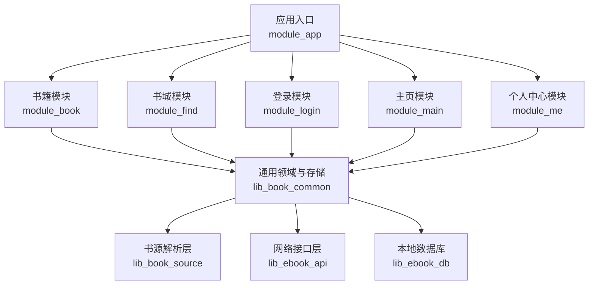

**图表来源**  
- [README.MD:120-180](file://README.MD#L120-L180)

**章节来源**  
- [README.MD:120-180](file://README.MD#L120-L180)

## 核心组件总览
| 子系统 | 主要职责 | 关键类或文件 | 重要特性 |
|---|---|---|---|
| 书源系统 | 解析 JSON 规则与 JS 脚本，获取搜索结果、书籍信息、章节目录、正文和书城数据 | `BookParser`、`JsoupBookParser`、`ScriptBookParser`、`ScriptRuleEvaluator`、`RuleSplitter`、`RuleScanner`、`RuleNode`、`SandboxService` | 原生规则与脚本双模式；JS 在隔离进程执行；规则切分与求值严格分层 |
| 阅读系统 | 翻页窗口、页面加载去重、章节内存缓存、阅读会话恢复 | `ReaderPagerController`、`ReaderPageStore`、`ChapterContentCache`、`BookStore`、`ReaderResumeStore` | 三页窗口模型；跨翻页与滚屏共用加载仓库；按章失效缓存 |
| 下载系统 | 前台服务、任务队列、按书暂停、通知与进度事件、章节写入 | `DownloadService`、`DownloadRepository`、`BookStore`、`ChapterContentCache` | Intent 控制而非易丢命令流；dataSync 配额超时保护；强制刷新单章 |
| 认证系统 | 双 token 会话、静默刷新、会话事件、密码不落盘 | `UserSessionManager`、`AndroidUserSessionManager`、`TokenRefresher`、`SessionEventBus` | access token 驻内存；refresh token 落盘；A0230 触发单飞刷新 |

**章节来源**  
- [BookParser.kt:1-30](file://lib_book_source/src/main/java/com/ebook/source/analyze/BookParser.kt#L1-L30)
- [ScriptBookParser.kt:1-468](file://lib_book_source/src/main/java/com/ebook/source/analyze/ScriptBookParser.kt#L1-L468)
- [JsoupBookParser.kt:1-513](file://lib_book_source/src/main/java/com/ebook/source/analyze/JsoupBookParser.kt#L1-L513)
- [RuleNode.kt:1-32](file://lib_book_source/src/main/java/com/ebook/source/script/RuleNode.kt#L1-L32)
- [RuleScanner.kt:1-78](file://lib_book_source/src/main/java/com/ebook/source/script/RuleScanner.kt#L1-L78)
- [RuleSplitter.kt:1-117](file://lib_book_source/src/main/java/com/ebook/source/script/RuleSplitter.kt#L1-L117)
- [ScriptRuleEvaluator.kt:1-367](file://lib_book_source/src/main/java/com/ebook/source/script/ScriptRuleEvaluator.kt#L1-L367)
- [SandboxService.kt:1-210](file://lib_book_source/src/main/java/com/ebook/source/sandbox/SandboxService.kt#L1-L210)
- [ReaderPageStore.kt:1-98](file://module_book/src/main/java/com/ebook/book/reader/ReaderPageStore.kt#L1-L98)
- [ReaderPager.kt:1-584](file://module_book/src/main/java/com/ebook/book/reader/ReaderPager.kt#L1-L584)
- [ChapterContentCache.kt:1-63](file://lib_book_common/src/main/java/com/ebook/common/store/ChapterContentCache.kt#L1-L63)
- [BookStore.kt:1-216](file://lib_book_common/src/main/java/com/ebook/common/store/BookStore.kt#L1-L216)
- [ReaderResumeStore.kt:1-68](file://lib_book_common/src/main/java/com/ebook/common/store/ReaderResumeStore.kt#L1-L68)
- [DownloadService.kt:1-750](file://module_book/src/main/java/com/ebook/book/service/DownloadService.kt#L1-L750)
- [DownloadRepository.kt:1-311](file://module_book/src/main/java/com/ebook/book/repository/DownloadRepository.kt#L1-L311)
- [UserSessionManager.kt:1-62](file://lib_book_common/src/main/java/com/ebook/common/domain/UserSessionManager.kt#L1-L62)
- [AndroidUserSessionManager.kt:1-162](file://lib_book_common/src/main/java/com/ebook/common/domain/AndroidUserSessionManager.kt#L1-L162)
- [TokenRefresher.kt:1-27](file://lib_ebook_api/src/main/java/com/ebook/api/auth/TokenRefresher.kt#L1-L27)
- [SessionEventBus.kt:1-44](file://lib_ebook_api/src/main/java/com/ebook/api/auth/SessionEventBus.kt#L1-L44)

## 书源系统与脚本执行架构
书源系统承担“把外部网站内容变成应用内部书籍实体”的职责。它有两个并行路径：  
- **原生规则路径**：由 `JsoupBookParser` 使用 `BookSourceRule` 与 Jsoup 选择器解析 HTML。  
- **脚本规则路径**：由 `ScriptBookParser` 将原始 JSON 装载为 `ScriptRuleSet`，再经词法、求值与取文层驱动 JS 沙箱执行。

### 书源解析接口与实现
`BookParser` 是统一抽象，定义搜索、书籍详情、章节目录、分类书籍与书城发现五个能力。原生实现与脚本实现都实现该接口，上层无需关心具体来源。

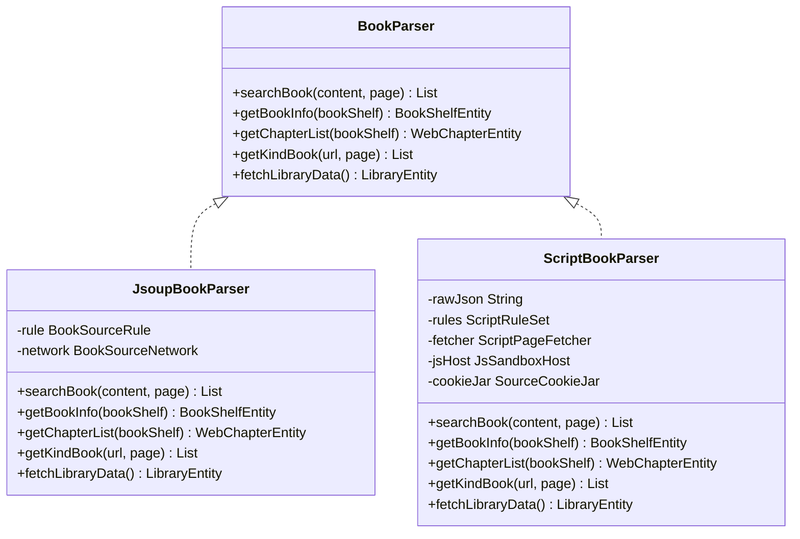

**图表来源**  
- [BookParser.kt:1-30](file://lib_book_source/src/main/java/com/ebook/source/analyze/BookParser.kt#L1-L30)
- [JsoupBookParser.kt:1-513](file://lib_book_source/src/main/java/com/ebook/source/analyze/JsoupBookParser.kt#L1-L513)
- [ScriptBookParser.kt:1-468](file://lib_book_source/src/main/java/com/ebook/source/analyze/ScriptBookParser.kt#L1-L468)

### JSON 规则语法与脚本规范
脚本规则的核心在于三层分工：  
1. **词法与切分**：`RuleScanner` 计算花括号、方括号、双花括号的嵌套深度；`RuleSplitter` 按优先级切出 `%%`、`||`、`&&`，并剥离替换段与 URL 选项尾段。  
2. **求值树**：`RuleNode` 表达空节点、叶子模式、全部合并、首支短路、多路交错五种语义。  
3. **求值分发**：`ScriptRuleEvaluator` 负责展开插值、组合分支、字段取值、正则组引用、JSONPath 与链式后端调用。

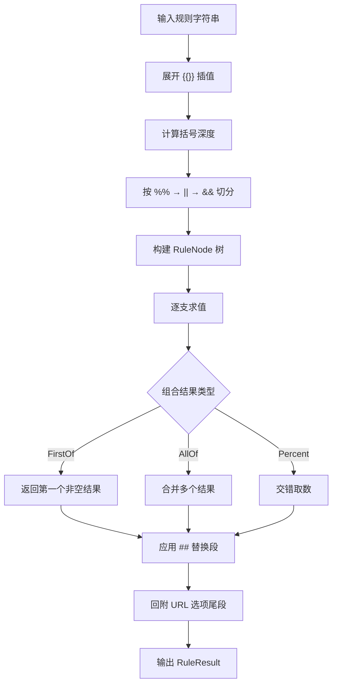

**图表来源**  
- [RuleScanner.kt:1-78](file://lib_book_source/src/main/java/com/ebook/source/script/RuleScanner.kt#L1-L78)
- [RuleSplitter.kt:1-117](file://lib_book_source/src/main/java/com/ebook/source/script/RuleSplitter.kt#L1-L117)
- [RuleNode.kt:1-32](file://lib_book_source/src/main/java/com/ebook/source/script/RuleNode.kt#L1-L32)
- [ScriptRuleEvaluator.kt:1-367](file://lib_book_source/src/main/java/com/ebook/source/script/ScriptRuleEvaluator.kt#L1-L367)

### 脚本沙箱与主机通信
脚本执行不在主进程直接运行，而是通过 `:js` 隔离进程。`SandboxService` 作为子进程唯一 Binder 端点，负责协议校验、帧限幅、回调中继与 QuickJS 桥接。主进程通过 `JsSandboxHost` 发起执行请求，脚本中的 host 调用再反向回到主进程。

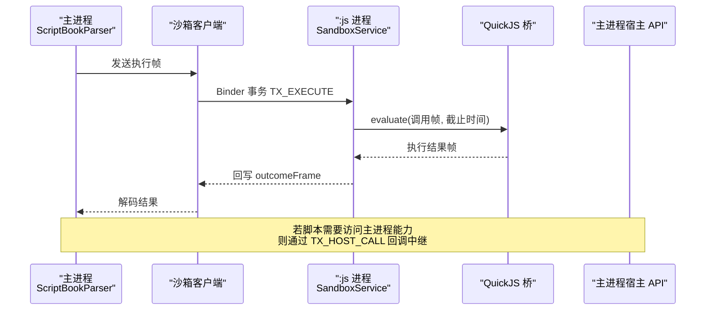

**图表来源**  
- [SandboxService.kt:1-210](file://lib_book_source/src/main/java/com/ebook/source/sandbox/SandboxService.kt#L1-L210)
- [ScriptBookParser.kt:1-468](file://lib_book_source/src/main/java/com/ebook/source/analyze/ScriptBookParser.kt#L1-L468)

### 书源解析关键流程
以搜索为例，脚本路径的典型顺序是：渲染搜索 URL → 取文 → 列表字段求值 → 条目字段提取；原生路径则是用 `ListPageUrl` 渲染分页、用 Jsoup 选择器提取列表项。两者最终都产出 `SearchBookEntity`。

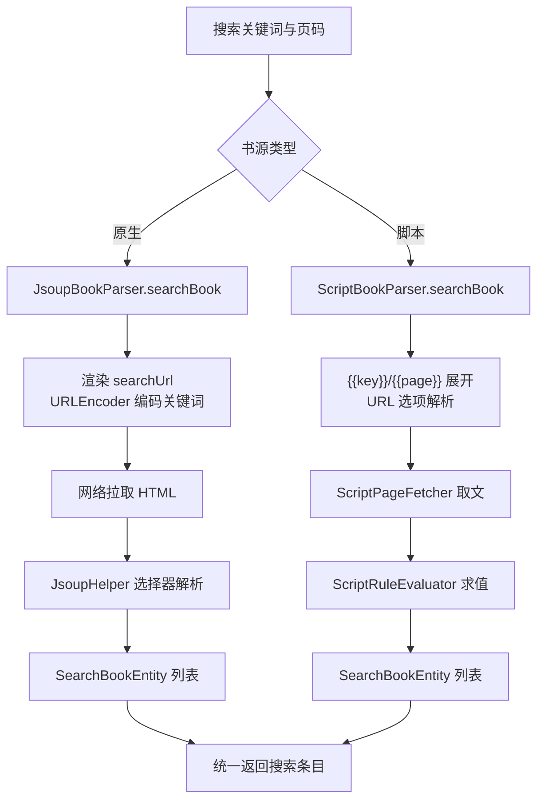

**图表来源**  
- [JsoupBookParser.kt:1-513](file://lib_book_source/src/main/java/com/ebook/source/analyze/JsoupBookParser.kt#L1-L513)
- [ScriptBookParser.kt:1-468](file://lib_book_source/src/main/java/com/ebook/source/analyze/ScriptBookParser.kt#L1-L468)

**章节来源**  
- [BookParser.kt:1-30](file://lib_book_source/src/main/java/com/ebook/source/analyze/BookParser.kt#L1-L30)
- [RuleNode.kt:1-32](file://lib_book_source/src/main/java/com/ebook/source/script/RuleNode.kt#L1-L32)
- [RuleScanner.kt:1-78](file://lib_book_source/src/main/java/com/ebook/source/script/RuleScanner.kt#L1-L78)
- [RuleSplitter.kt:1-117](file://lib_book_source/src/main/java/com/ebook/source/script/RuleSplitter.kt#L1-L117)
- [ScriptRuleEvaluator.kt:1-367](file://lib_book_source/src/main/java/com/ebook/source/script/ScriptRuleEvaluator.kt#L1-L367)
- [ScriptRuleSet.kt:1-286](file://lib_book_source/src/main/java/com/ebook/source/script/ScriptRuleSet.kt#L1-L286)
- [SandboxService.kt:1-210](file://lib_book_source/src/main/java/com/ebook/source/sandbox/SandboxService.kt#L1-L210)

## 阅读系统与翻页状态机
阅读系统负责把章节正文切成页面，并在翻页或滚动模式下稳定展示。它的关键问题有三个：  
- 如何避免频繁翻页时重复读取磁盘或网络；  
- 如何在异常退出后恢复阅读界面；  
- 如何在翻页窗口中正确处理跨章边界。

### 页面加载仓库
`ReaderPageStore` 是翻页与滚屏两种模式共用的加载仓库。它以 `ReaderPageKey` 为键去重，维护已加载 UI 状态与在途协程。成功加载后回调前端重算几何，失败态支持重试。

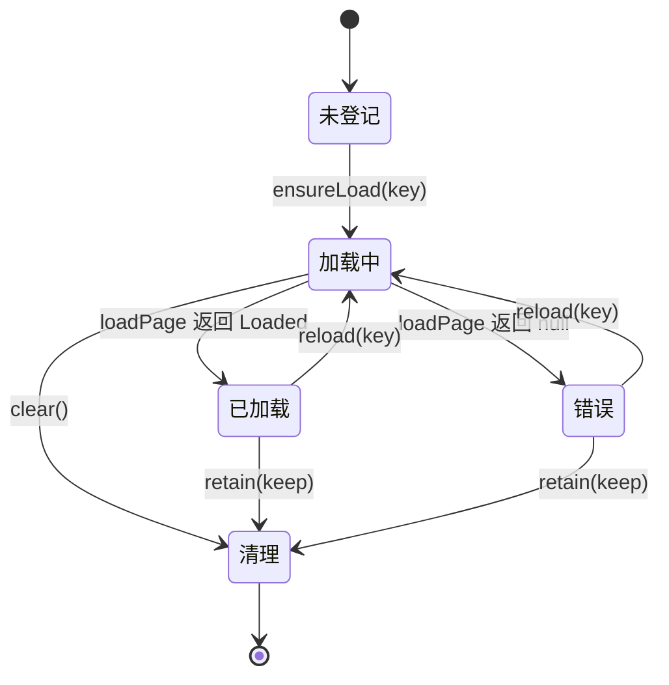

**图表来源**  
- [ReaderPageStore.kt:1-98](file://module_book/src/main/java/com/ebook/book/reader/ReaderPageStore.kt#L1-L98)

### 翻页控制器与三页窗口
`ReaderPagerController` 维持当前页、上一页、下一页三个键，并以横向拖拽位移驱动翻页动画。窗口收敛规则保证相邻页不指向当前页，且不会出现两个方向同时为空导致的死页。

```mermaid
flowchart TD
    Init["设置初始章节与页码"] --> LoadDur["加载当前页"]
    LoadDur --> RefreshWindow["根据 loaded.chapterIndex 与 pageIndex 计算 prevKey / nextKey"]
    RefreshWindow --> EnsurePrev["ensureLoad(prevKey)"]
    RefreshWindow --> EnsureNext["ensureLoad(nextKey)"]
    EnsurePrev --> Drag["手势拖拽"]
    EnsureNext --> Drag
    Drag --> Threshold{"拖动超过阈值？"}
    Threshold -->|是| Commit["提交翻页并更新 durKey"]
    Threshold -->|否| Keep["保持当前窗口"]
    Commit --> RefreshWindow
    Keep --> [*]
```

**图表来源**  
- [ReaderPager.kt:1-584](file://module_book/src/main/java/com/ebook/book/reader/ReaderPager.kt#L1-L584)
- [ReaderPageStore.kt:1-98](file://module_book/src/main/java/com/ebook/book/reader/ReaderPageStore.kt#L1-L98)

### 章节缓存与内容仓库
`ChapterContentCache` 是进程内章节正文缓存，默认容量为 3，覆盖当前章及前后预读章。键使用 `content_ref`，可按书级标记批量失效。底层内容由 `BookStore` 管理，章节以 UTF-8 段落文本写入 `filesDir/books/<书目录名>/cNNNNN.txt`。

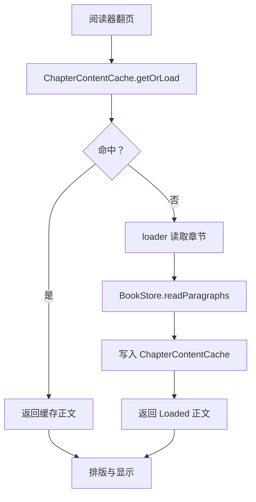

**图表来源**  
- [ChapterContentCache.kt:1-63](file://lib_book_common/src/main/java/com/ebook/common/store/ChapterContentCache.kt#L1-L63)
- [BookStore.kt:1-216](file://lib_book_common/src/main/java/com/ebook/common/store/BookStore.kt#L1-L216)

### 阅读进度恢复
`ReaderResumeStore` 记录“上次是否正在阅读某本书”，用于启动页决定是否恢复阅读界面。它与真正的阅读进度不同：进度保存在书架实体的章节索引中，而该对象只负责“是否需要恢复”这一开关。

**章节来源**  
- [ReaderPageStore.kt:1-98](file://module_book/src/main/java/com/ebook/book/reader/ReaderPageStore.kt#L1-L98)
- [ReaderPager.kt:1-584](file://module_book/src/main/java/com/ebook/book/reader/ReaderPager.kt#L1-L584)
- [ChapterContentCache.kt:1-63](file://lib_book_common/src/main/java/com/ebook/common/store/ChapterContentCache.kt#L1-L63)
- [BookStore.kt:1-216](file://lib_book_common/src/main/java/com/ebook/common/store/BookStore.kt#L1-L216)
- [ReaderResumeStore.kt:1-68](file://lib_book_common/src/main/java/com/ebook/common/store/ReaderResumeStore.kt#L1-L68)

## 下载系统与断点续传
下载系统以前台服务形式运行，职责包括：接收控制动作、查询待下载章节、抓取正文、写入章节文件、更新通知与进度事件。

### 前台服务与控制通道
`DownloadService` 不再依赖容易丢失的命令总线，而是使用 Intent 接收暂停、继续、取消动作；启动时从 `download_chapter` 表取篇。服务还处理 Android 15+ 前台服务 dataSync 时长配额超时，及时停止并保留任务。

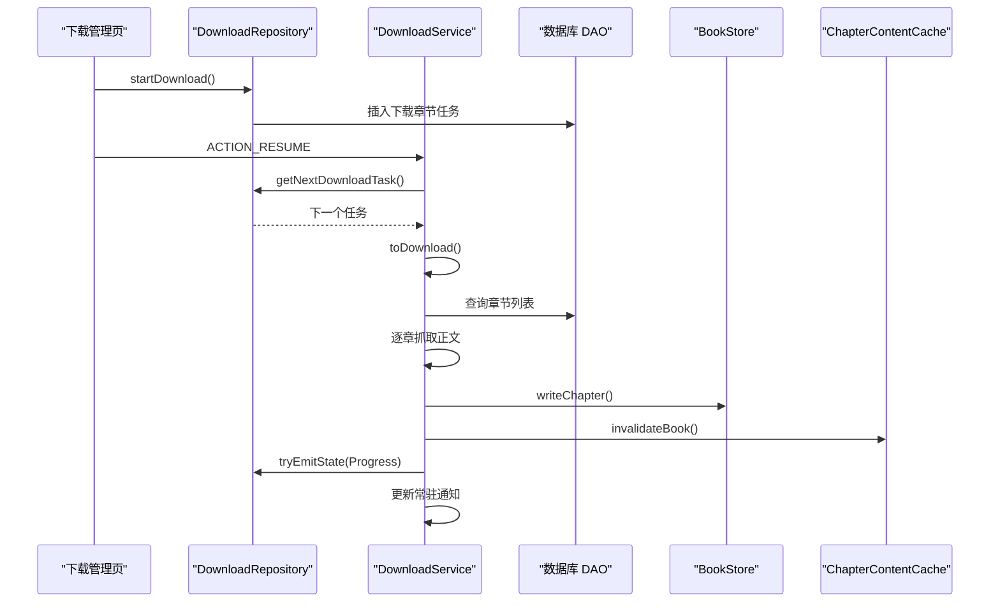

**图表来源**  
- [DownloadService.kt:1-750](file://module_book/src/main/java/com/ebook/book/service/DownloadService.kt#L1-L750)
- [DownloadRepository.kt:1-311](file://module_book/src/main/java/com/ebook/book/repository/DownloadRepository.kt#L1-L311)
- [BookStore.kt:1-216](file://lib_book_common/src/main/java/com/ebook/common/store/BookStore.kt#L1-L216)
- [ChapterContentCache.kt:1-63](file://lib_book_common/src/main/java/com/ebook/common/store/ChapterContentCache.kt#L1-L63)

### 队列管理与按书暂停
`DownloadRepository` 维护下载任务与暂停标记。暂停不是删除任务，而是在取篇时跳过该书；继续时移除暂停标记，由调用方决定是否拉起服务。任务总数、剩余数量、按书分组与孤儿任务清理都由该仓库统一处理。

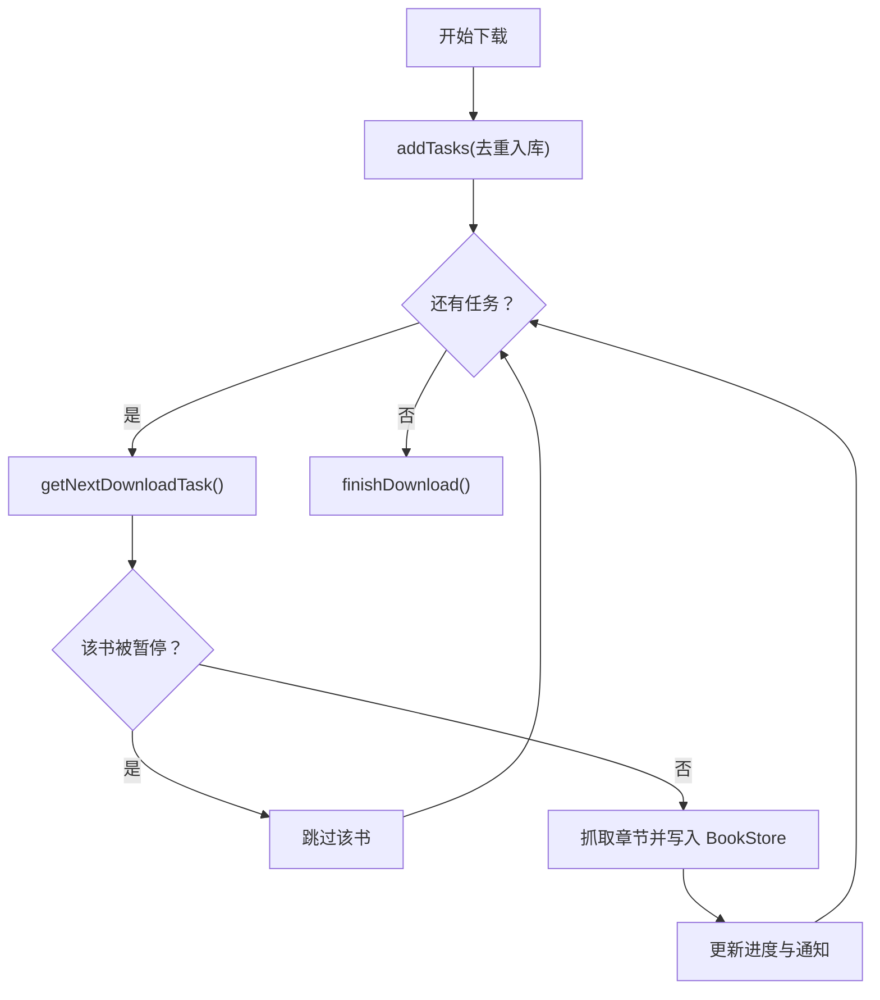

**图表来源**  
- [DownloadRepository.kt:1-311](file://module_book/src/main/java/com/ebook/book/repository/DownloadRepository.kt#L1-L311)
- [DownloadService.kt:1-750](file://module_book/src/main/java/com/ebook/book/service/DownloadService.kt#L1-L750)

**章节来源**  
- [DownloadService.kt:1-750](file://module_book/src/main/java/com/ebook/book/service/DownloadService.kt#L1-L750)
- [DownloadRepository.kt:1-311](file://module_book/src/main/java/com/ebook/book/repository/DownloadRepository.kt#L1-L311)
- [BookStore.kt:1-216](file://lib_book_common/src/main/java/com/ebook/common/store/BookStore.kt#L1-L216)
- [ChapterContentCache.kt:1-63](file://lib_book_common/src/main/java/com/ebook/common/store/ChapterContentCache.kt#L1-L63)

## 用户认证与双令牌机制
认证系统以邮箱为主标识，采用三步注册、双 token 会话、密码不落盘、A0230 静默刷新与会话过期统一收口的策略。

### 会话接口与 Android 实现
`UserSessionManager` 是纯 Kotlin 接口，暴露登录状态、当前用户、保存会话、轮换凭证、清除会话等能力。`AndroidUserSessionManager` 负责 SharedPreferences 持久化、`TokenHolder` 同步、旧版兼容键清理与 Profile 状态镜像清理。

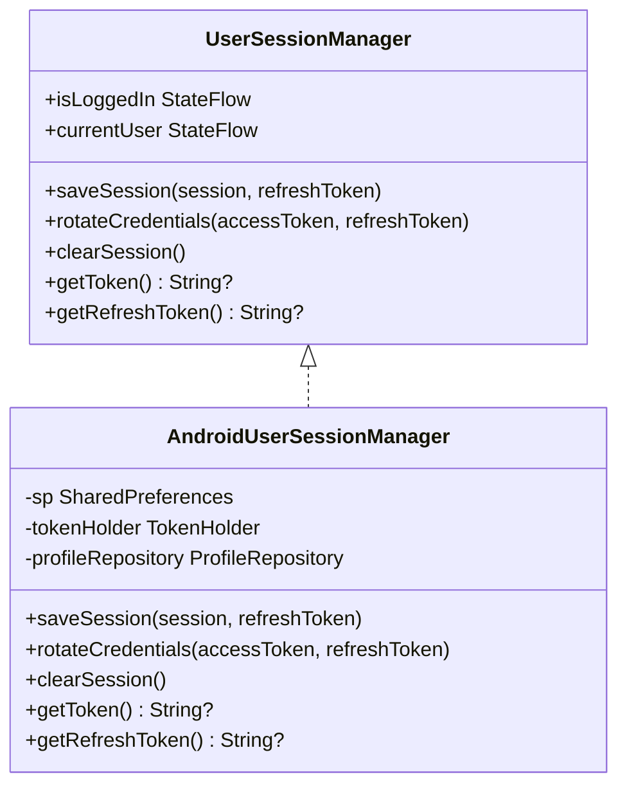

**图表来源**  
- [UserSessionManager.kt:1-62](file://lib_book_common/src/main/java/com/ebook/common/domain/UserSessionManager.kt#L1-L62)
- [AndroidUserSessionManager.kt:1-162](file://lib_book_common/src/main/java/com/ebook/common/domain/AndroidUserSessionManager.kt#L1-L162)

### 静默刷新与会话事件
`TokenRefresher` 定义 access token 静默刷新接口，由上层注入实现。当业务响应码 A0230 出现时，刷新器负责并发互斥与幂等刷新。刷新失败或 refresh token 不可用时，`SessionEventBus` 发射 `SessionExpired`，UI 层统一清会话并跳转登录页。

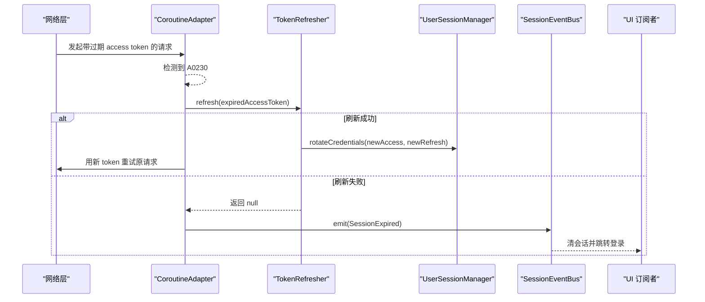

**图表来源**  
- [TokenRefresher.kt:1-27](file://lib_ebook_api/src/main/java/com/ebook/api/auth/TokenRefresher.kt#L1-L27)
- [SessionEventBus.kt:1-44](file://lib_ebook_api/src/main/java/com/ebook/api/auth/SessionEventBus.kt#L1-L44)
- [AndroidUserSessionManager.kt:1-162](file://lib_book_common/src/main/java/com/ebook/common/domain/AndroidUserSessionManager.kt#L1-L162)

**章节来源**  
- [UserSessionManager.kt:1-62](file://lib_book_common/src/main/java/com/ebook/common/domain/UserSessionManager.kt#L1-L62)
- [AndroidUserSessionManager.kt:1-162](file://lib_book_common/src/main/java/com/ebook/common/domain/AndroidUserSessionManager.kt#L1-L162)
- [TokenRefresher.kt:1-27](file://lib_ebook_api/src/main/java/com/ebook/api/auth/TokenRefresher.kt#L1-L27)
- [SessionEventBus.kt:1-44](file://lib_ebook_api/src/main/java/com/ebook/api/auth/SessionEventBus.kt#L1-L44)

## 依赖关系分析
四个核心子系统之间存在清晰的分层与协作关系：

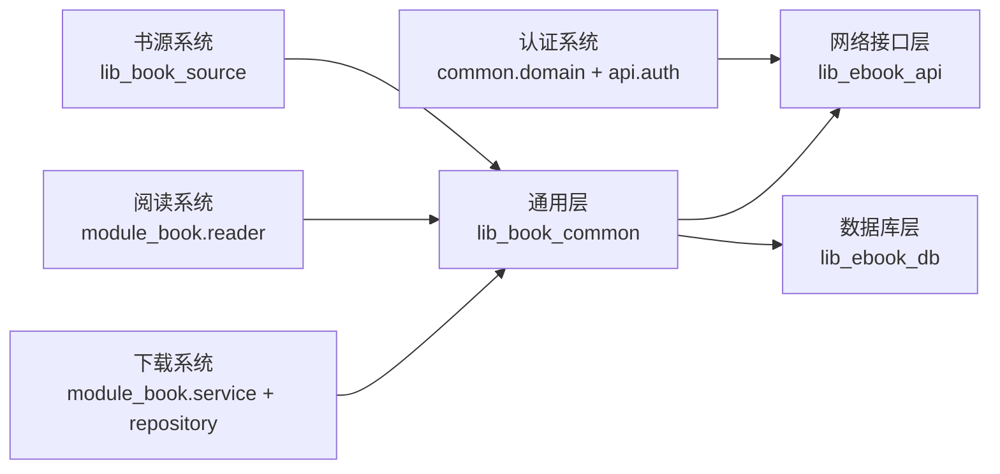

- 书源系统通过 `BookParser` 向上层暴露统一数据能力，但自身不感知缓存与 UI。  
- 阅读系统依赖 `BookStore` 与 `ChapterContentCache`，并通过 `ReaderPageStore` 解耦翻页与滚屏逻辑。  
- 下载系统通过 `DownloadRepository` 与 `BookStore` 协作，把网络内容持久化为章节文件。  
- 认证系统在 `lib_book_common` 定义领域接口，在 `lib_ebook_api` 定义刷新与事件接缝，由上层装配实现。

**图表来源**  
- [BookParser.kt:1-30](file://lib_book_source/src/main/java/com/ebook/source/analyze/BookParser.kt#L1-L30)
- [ReaderPageStore.kt:1-98](file://module_book/src/main/java/com/ebook/book/reader/ReaderPageStore.kt#L1-L98)
- [DownloadService.kt:1-750](file://module_book/src/main/java/com/ebook/book/service/DownloadService.kt#L1-L750)
- [DownloadRepository.kt:1-311](file://module_book/src/main/java/com/ebook/book/repository/DownloadRepository.kt#L1-L311)
- [UserSessionManager.kt:1-62](file://lib_book_common/src/main/java/com/ebook/common/domain/UserSessionManager.kt#L1-L62)
- [TokenRefresher.kt:1-27](file://lib_ebook_api/src/main/java/com/ebook/api/auth/TokenRefresher.kt#L1-L27)

## 性能与扩展建议
### 书源系统
- **规则复杂度控制**：`%%`、`||`、`&&` 组合会产生多路求值，复杂规则应优先用更精确的选择器或正则，减少无意义分支。  
- **JS 沙箱开销**：每次 host 调用都要跨进程通信，应避免在循环中频繁调用主进程能力，可一次聚合数据后再回传。  
- **扩展点**：新增规则模式时，应在 `RuleNode`、`RuleMode`、`ScriptRuleEvaluator` 中分别增加叶子形态与求值分支，并保持“语法错误不等于未配置”的语义。

### 阅读系统
- **缓存容量调整**：`ChapterContentCache` 默认容量为 3，适合翻页场景；滚屏模式下更依赖前端几何裁剪，不应盲目增大容量。  
- **页面去重**：`ReaderPageStore` 已经通过 key 与 in-flight job 去重，扩展新翻页方式时应复用该仓库，而不是自建缓存。  
- **扩展点**：新增页面加载策略（例如虚拟章节预览）可在 `loadPage` 回调中实现，而不改动窗口收敛逻辑。

### 下载系统
- **前台配额保护**：dataSync 超时后应立即收尾并保留任务，避免反复重启导致闪退。  
- **队列一致性**：暂停标记与任务表必须一致，清理任务时应同步清理对应书的暂停标记。  
- **扩展点**：新增下载中断原因或限速策略时，应在 `DownloadRepository` 的状态事件与 `DownloadService` 的取篇循环处共同扩展。

### 认证系统
- **令牌安全**：access token 仅驻内存，refresh token 落盘；扩展现有登录路径时不得重新引入明文密码落盘。  
- **刷新风暴防护**：刷新接口本身不能走可能再次触发刷新的拦截链路，应直接调用刷新端点。  
- **扩展点**：新增会话失效原因时，应通过 `SessionEventBus` 扩展事件，而不是在各调用点分散处理。

[本节为通用优化建议，不直接分析特定代码片段，因此不附加“章节来源”]

## 故障排查指南
| 现象 | 可能原因 | 排查位置 | 处理建议 |
|---|---|---|---|
| 书源规则匹配出空结果 | 规则切分误伤 `{{}}`、`[]`、`{}` 内的分隔符 | `RuleScanner`、`RuleSplitter` | 检查规则是否包含嵌套结构，确认分隔符只在深度 0 处生效 |
| 脚本书源报“待执行” | 沙箱进程不可用或 JS 执行器未就绪 | `ScriptBookParser`、`SandboxService` | 检查 `:js` 进程是否可用；不含 JS 的规则仍可工作 |
| 翻页时同一章反复读取 | 缓存未命中或正文 loader 返回 null | `ChapterContentCache`、`BookStore` | 确认章节文件存在；正文 reader 是否补齐 |
| 异常退出后无法恢复阅读 | 未写入或未清除 `ReaderResumeStore` | `ReaderResumeStore` | 确认阅读器打开书时写入、正常退出时清除 |
| 下载通知无变化或服务自动退出 | dataSync 配额用尽或前台初始化失败 | `DownloadService.onTimeout`、前台初始化 | 查看通知提示；回到前台后重试；检查通知权限 |
| 登录状态闪烁或头像不一致 | 会话清理不完整 | `AndroidUserSessionManager.clearSession` | 确保同时清理 SP、`TokenHolder` 与 Profile 状态 |
| 登录后立即被踢出 | refresh token 过期或刷新失败 | `TokenRefresher`、`SessionEventBus` | 检查 A0230 刷新链路；必要时引导重新登录 |

**章节来源**  
- [RuleScanner.kt:1-78](file://lib_book_source/src/main/java/com/ebook/source/script/RuleScanner.kt#L1-L78)
- [RuleSplitter.kt:1-117](file://lib_book_source/src/main/java/com/ebook/source/script/RuleSplitter.kt#L1-L117)
- [SandboxService.kt:1-210](file://lib_book_source/src/main/java/com/ebook/source/sandbox/SandboxService.kt#L1-L210)
- [ChapterContentCache.kt:1-63](file://lib_book_common/src/main/java/com/ebook/common/store/ChapterContentCache.kt#L1-L63)
- [ReaderResumeStore.kt:1-68](file://lib_book_common/src/main/java/com/ebook/common/store/ReaderResumeStore.kt#L1-L68)
- [DownloadService.kt:1-750](file://module_book/src/main/java/com/ebook/book/service/DownloadService.kt#L1-L750)
- [AndroidUserSessionManager.kt:1-162](file://lib_book_common/src/main/java/com/ebook/common/domain/AndroidUserSessionManager.kt#L1-L162)
- [TokenRefresher.kt:1-27](file://lib_ebook_api/src/main/java/com/ebook/api/auth/TokenRefresher.kt#L1-L27)
- [SessionEventBus.kt:1-44](file://lib_ebook_api/src/main/java/com/ebook/api/auth/SessionEventBus.kt#L1-L44)

## 结论
该项目的核心功能系统围绕“可插拔书源、稳定阅读体验、可靠后台下载、安全认证会话”四个目标设计。  
- 书源系统通过 JSON 规则与 JS 沙箱分离解析逻辑与执行环境，使第三方规则可开发、可隔离、可诊断。  
- 阅读系统以 `ReaderPageStore` 为中心解决页面加载竞态，以 `ChapterContentCache` 和 `BookStore` 保障离线阅读性能。  
- 下载系统以 Intent 控制与数据库任务表为核心，避免命令丢失，并通过前台服务与配额保护提升稳定性。  
- 认证系统通过双 token、内存驻留与事件总线，把会话生命周期与 UI 行为解耦。

对于扩展开发者而言，最重要的原则是：**不要混淆“未配置”和“不支持”**，不要在热路径上做阻塞 IO，不要把临时 UI 状态当成事实源，也不要让一个子系统的异常掩盖另一个子系统的问题。

[本节为总结性内容，不直接分析特定代码片段，因此不附加“章节来源”]