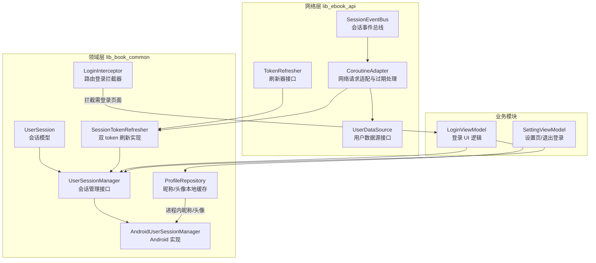
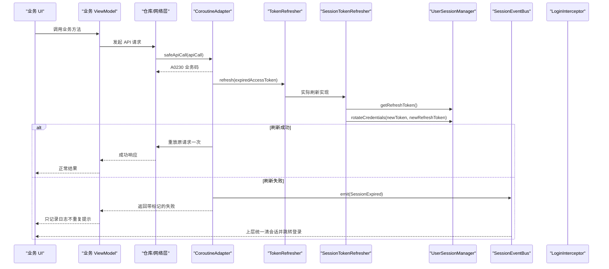
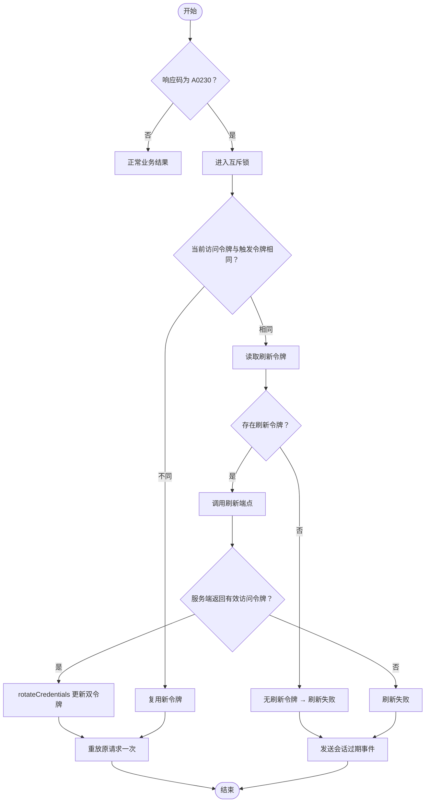
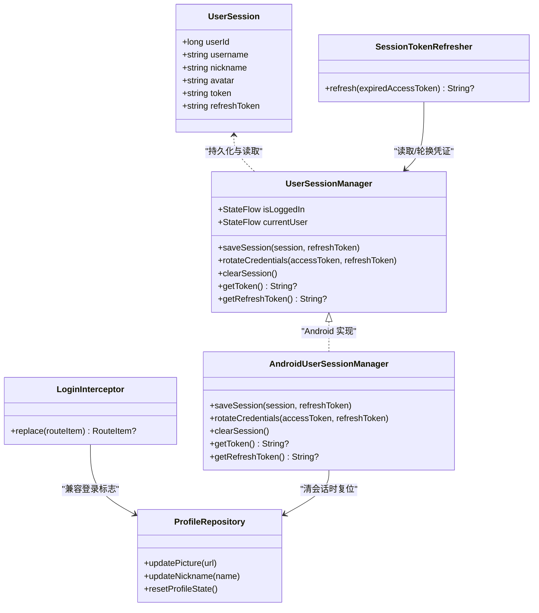
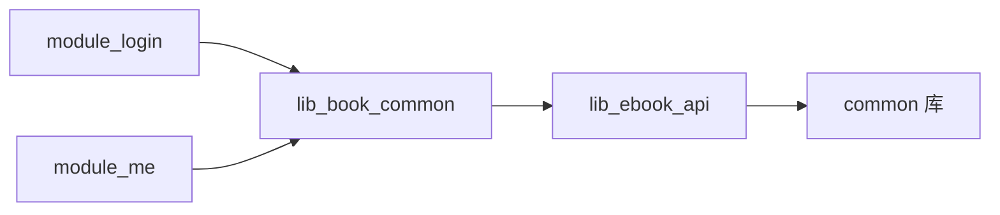

# 用户认证系统

<cite>
**本文引用的文件**   
- [lib_book_common/src/main/java/com/ebook/common/domain/UserSession.kt](file://lib_book_common/src/main/java/com/ebook/common/domain/UserSession.kt)
- [lib_book_common/src/main/java/com/ebook/common/domain/UserSessionManager.kt](file://lib_book_common/src/main/java/com/ebook/common/domain/UserSessionManager.kt)
- [lib_book_common/src/main/java/com/ebook/common/domain/AndroidUserSessionManager.kt](file://lib_book_common/src/main/java/com/ebook/common/domain/AndroidUserSessionManager.kt)
- [lib_book_common/src/main/java/com/ebook/common/domain/SessionTokenRefresher.kt](file://lib_book_common/src/main/java/com/ebook/common/domain/SessionTokenRefresher.kt)
- [lib_book_common/src/main/java/com/ebook/common/interceptor/LoginInterceptor.kt](file://lib_book_common/src/main/java/com/ebook/common/interceptor/LoginInterceptor.kt)
- [lib_book_common/src/main/java/com/ebook/common/repository/ProfileRepository.kt](file://lib_book_common/src/main/java/com/ebook/common/repository/ProfileRepository.kt)
- [lib_ebook_api/src/main/java/com/ebook/api/auth/TokenRefresher.kt](file://lib_ebook_api/src/main/java/com/ebook/api/auth/TokenRefresher.kt)
- [lib_ebook_api/src/main/java/com/ebook/api/auth/SessionEventBus.kt](file://lib_ebook_api/src/main/java/com/ebook/api/auth/SessionEventBus.kt)
- [lib_ebook_api/src/main/java/com/ebook/api/utils/CoroutineAdapter.kt](file://lib_ebook_api/src/main/java/com/ebook/api/utils/CoroutineAdapter.kt)
- [lib_ebook_api/src/main/java/com/ebook/api/service/user/UserDataSource.kt](file://lib_ebook_api/src/main/java/com/ebook/api/service/user/UserDataSource.kt)
- [module_login/src/main/java/com/ebook/login/mvvm/viewmodel/LoginViewModel.kt](file://module_login/src/main/java/com/ebook/login/mvvm/viewmodel/LoginViewModel.kt)
- [module_me/src/main/java/com/ebook/me/mvvm/viewmodel/SettingViewModel.kt](file://module_me/src/main/java/com/ebook/me/mvvm/viewmodel/SettingViewModel.kt)
- [docs/adr/0011-token-identity-decoupling-token-only-refresh.md](file://docs/adr/0011-token-identity-decoupling-token-only-refresh.md)
- [docs/login-modernization-spec.md](file://docs/login-modernization-spec.md)
</cite>

## 目录
1. [引言](#引言)
2. [项目结构](#项目结构)
3. [核心组件](#核心组件)
4. [架构总览](#架构总览)
5. [详细组件分析](#详细组件分析)
6. [依赖关系分析](#依赖关系分析)
7. [性能与并发特性](#性能与并发特性)
8. [故障排查指南](#故障排查指南)
9. [安全最佳实践](#安全最佳实践)
10. [结论](#结论)

## 引言
本文件系统性地梳理 Android 小说阅读器中的用户认证体系。它以“双 token”为核心：访问令牌用于业务请求鉴权，刷新令牌用于静默续期；会话身份与凭证解耦，访问令牌仅驻内存，刷新令牌持久化。登录流程负责建立身份与会话，网络层在检测到访问令牌过期时自动尝试刷新，刷新失败则通过全局事件统一清理会话并跳转登录页。密码处理采用“密码不落盘、服务端校验”的契约，结合路由拦截器实现按页面权限控制。本文覆盖双 token 机制、会话生命周期、密码方案、认证拦截器、用户信息存储与同步、以及与业务模块的集成方式。

## 项目结构
认证相关代码主要分布在三个层次：
- 领域层（lib_book_common）：会话模型、会话管理器、刷新实现、路由级登录拦截器、个人资料仓库。
- 网络层（lib_ebook_api）：刷新接口契约、会话事件总线、通用网络适配器、用户数据源。
- 业务模块（module_login、module_me）：登录 UI 与设置页退出登录入口，调用领域层与会话管理。

图表来源
- [lib_book_common/src/main/java/com/ebook/common/domain/UserSession.kt:1-17](file://lib_book_common/src/main/java/com/ebook/common/domain/UserSession.kt#L1-L17)
- [lib_book_common/src/main/java/com/ebook/common/domain/UserSessionManager.kt:1-62](file://lib_book_common/src/main/java/com/ebook/common/domain/UserSessionManager.kt#L1-L62)
- [lib_book_common/src/main/java/com/ebook/common/domain/AndroidUserSessionManager.kt:1-162](file://lib_book_common/src/main/java/com/ebook/common/domain/AndroidUserSessionManager.kt#L1-L162)
- [lib_book_common/src/main/java/com/ebook/common/domain/SessionTokenRefresher.kt:1-96](file://lib_book_common/src/main/java/com/ebook/common/domain/SessionTokenRefresher.kt#L1-L96)
- [lib_book_common/src/main/java/com/ebook/common/interceptor/LoginInterceptor.kt:1-42](file://lib_book_common/src/main/java/com/ebook/common/interceptor/LoginInterceptor.kt#L1-L42)
- [lib_book_common/src/main/java/com/ebook/common/repository/ProfileRepository.kt:1-54](file://lib_book_common/src/main/java/com/ebook/common/repository/ProfileRepository.kt#L1-L54)
- [lib_ebook_api/src/main/java/com/ebook/api/auth/TokenRefresher.kt:1-27](file://lib_ebook_api/src/main/java/com/ebook/api/auth/TokenRefresher.kt#L1-L27)
- [lib_ebook_api/src/main/java/com/ebook/api/auth/SessionEventBus.kt:1-44](file://lib_ebook_api/src/main/java/com/ebook/api/auth/SessionEventBus.kt#L1-L44)
- [lib_ebook_api/src/main/java/com/ebook/api/utils/CoroutineAdapter.kt:1-150](file://lib_ebook_api/src/main/java/com/ebook/api/utils/CoroutineAdapter.kt#L1-L150)
- [lib_ebook_api/src/main/java/com/ebook/api/service/user/UserDataSource.kt:1-47](file://lib_ebook_api/src/main/java/com/ebook/api/service/user/UserDataSource.kt#L1-L47)
- [module_login/src/main/java/com/ebook/login/mvvm/viewmodel/LoginViewModel.kt:1-107](file://module_login/src/main/java/com/ebook/login/mvvm/viewmodel/LoginViewModel.kt#L1-L107)
- [module_me/src/main/java/com/ebook/me/mvvm/viewmodel/SettingViewModel.kt:1-200](file://module_me/src/main/java/com/ebook/me/mvvm/viewmodel/SettingViewModel.kt#L1-L200)

章节来源
- [docs/login-modernization-spec.md:1-76](file://docs/login-modernization-spec.md#L1-L76)

## 核心组件
- UserSession：跨模块的会话 seam 类型，包含用户标识、用户名、昵称、头像、访问令牌和刷新令牌。刷新成功后不再维护刷新令牌字段，统一通过会话管理器读取。
- UserSessionManager：纯 Kotlin 接口，定义是否已登录、当前会话、保存会话、轮换凭证、清除会话、获取运行态访问令牌和刷新令牌。
- AndroidUserSessionManager：Android 实现，负责 StateFlow 状态、SharedPreferences 持久化、TokenHolder 同步、兼容旧 LoginInterceptor 键、清会话时一次性失效三处镜像。
- SessionTokenRefresher：基于 Mutex 的并发保护刷新器，负责用刷新令牌静默换取新访问令牌，并通过 rotateCredentials 更新凭证而不改动用户身份。
- TokenRefresher：网络层定义的刷新器接缝，供 CoroutineAdapter 调用，避免直接耦合上层实现。
- SessionEventBus：全局会话事件流，统一发射“会话过期”，由上层订阅后执行“清会话 + 提示 + 跳转登录”。
- CoroutineAdapter：所有仓库 API 调用的统一入口，检测 A0230 业务码后触发单飞刷新，成功重放一次请求，失败发会话过期事件。
- LoginInterceptor：路由级登录拦截器，根据目标页面标记决定是否跳转到登录页。
- ProfileRepository：进程内的昵称与头像缓存，配合会话管理器在清会话时复位。
- LoginViewModel：登录 UI 逻辑，调用 UserRepository 登录，成功后保存会话、回跳原目标页、更新本地资料缓存。
- SettingViewModel：设置页 ViewModel，暴露登录态、发起退出登录。

章节来源
- [lib_book_common/src/main/java/com/ebook/common/domain/UserSession.kt:1-17](file://lib_book_common/src/main/java/com/ebook/common/domain/UserSession.kt#L1-L17)
- [lib_book_common/src/main/java/com/ebook/common/domain/UserSessionManager.kt:1-62](file://lib_book_common/src/main/java/com/ebook/common/domain/UserSessionManager.kt#L1-L62)
- [lib_book_common/src/main/java/com/ebook/common/domain/AndroidUserSessionManager.kt:1-162](file://lib_book_common/src/main/java/com/ebook/common/domain/AndroidUserSessionManager.kt#L1-L162)
- [lib_book_common/src/main/java/com/ebook/common/domain/SessionTokenRefresher.kt:1-96](file://lib_book_common/src/main/java/com/ebook/common/domain/SessionTokenRefresher.kt#L1-L96)
- [lib_ebook_api/src/main/java/com/ebook/api/auth/TokenRefresher.kt:1-27](file://lib_ebook_api/src/main/java/com/ebook/api/auth/TokenRefresher.kt#L1-L27)
- [lib_ebook_api/src/main/java/com/ebook/api/auth/SessionEventBus.kt:1-44](file://lib_ebook_api/src/main/java/com/ebook/api/auth/SessionEventBus.kt#L1-L44)
- [lib_ebook_api/src/main/java/com/ebook/api/utils/CoroutineAdapter.kt:1-150](file://lib_ebook_api/src/main/java/com/ebook/api/utils/CoroutineAdapter.kt#L1-L150)
- [lib_book_common/src/main/java/com/ebook/common/interceptor/LoginInterceptor.kt:1-42](file://lib_book_common/src/main/java/com/ebook/common/interceptor/LoginInterceptor.kt#L1-L42)
- [lib_book_common/src/main/java/com/ebook/common/repository/ProfileRepository.kt:1-54](file://lib_book_common/src/main/java/com/ebook/common/repository/ProfileRepository.kt#L1-L54)
- [module_login/src/main/java/com/ebook/login/mvvm/viewmodel/LoginViewModel.kt:1-107](file://module_login/src/main/java/com/ebook/login/mvvm/viewmodel/LoginViewModel.kt#L1-L107)
- [module_me/src/main/java/com/ebook/me/mvvm/viewmodel/SettingViewModel.kt:1-200](file://module_me/src/main/java/com/ebook/me/mvvm/viewmodel/SettingViewModel.kt#L1-L200)

## 架构总览
认证系统的整体交互如下：
- 登录成功后，UI 调用会话管理器保存会话，同时把访问令牌写入 TokenHolder。
- 业务请求经 CoroutineAdapter 统一封装；若返回 A0230，则调用 TokenRefresher 进行静默刷新。
- SessionTokenRefresher 使用互斥锁串行化刷新，避免并发风暴；成功后通过 rotateCredentials 更新访问令牌与刷新令牌。
- 刷新失败时，CoroutineAdapter 发送 SessionExpired 事件；上层统一清理会话并跳转登录页。
- 路由跳转由 LoginInterceptor 检查是否需要登录，未登录且需要登录的目标页会被重定向到登录页。

图表来源
- [lib_ebook_api/src/main/java/com/ebook/api/utils/CoroutineAdapter.kt:1-150](file://lib_ebook_api/src/main/java/com/ebook/api/utils/CoroutineAdapter.kt#L1-L150)
- [lib_ebook_api/src/main/java/com/ebook/api/auth/TokenRefresher.kt:1-27](file://lib_ebook_api/src/main/java/com/ebook/api/auth/TokenRefresher.kt#L1-L27)
- [lib_book_common/src/main/java/com/ebook/common/domain/SessionTokenRefresher.kt:1-96](file://lib_book_common/src/main/java/com/ebook/common/domain/SessionTokenRefresher.kt#L1-L96)
- [lib_book_common/src/main/java/com/ebook/common/domain/UserSessionManager.kt:1-62](file://lib_book_common/src/main/java/com/ebook/common/domain/UserSessionManager.kt#L1-L62)
- [lib_ebook_api/src/main/java/com/ebook/api/auth/SessionEventBus.kt:1-44](file://lib_ebook_api/src/main/java/com/ebook/api/auth/SessionEventBus.kt#L1-L44)

## 详细组件分析

### 双 token 机制：生成、存储与自动续期
- 生成
  - 登录端点返回包含访问令牌与刷新令牌的载荷，UI 侧通过 LoginViewModel 调用会话管理器保存。
  - 注册端点不返回 token，激活后再通过登录或后续流程建立会话。
- 存储
  - 访问令牌：仅驻内存，通过 TokenHolder 提供运行时令牌；不写入 SharedPreferences，冷启动后为空，首个请求触发静默刷新。
  - 刷新令牌：持久化到 SharedPreferences，作为恢复会话的关键凭据。
  - 身份信息：userId、username、nickname、avatar 持久化，并在 ProfileRepository 中提供进程内缓存。
- 自动续期
  - 业务请求返回 A0230 时，CoroutineAdapter 触发单飞刷新。
  - SessionTokenRefresher 使用 Mutex 保证刷新串行化，避免并发刷新的竞态与服务端旧刷新令牌被硬删除导致的失败。
  - 刷新成功后调用 rotateCredentials：仅更新访问令牌与刷新令牌，不改动用户身份字段。
  - 若刷新失败，发送 SessionExpired 事件，由上层统一处理。

图表来源
- [lib_ebook_api/src/main/java/com/ebook/api/utils/CoroutineAdapter.kt:1-150](file://lib_ebook_api/src/main/java/com/ebook/api/utils/CoroutineAdapter.kt#L1-L150)
- [lib_book_common/src/main/java/com/ebook/common/domain/SessionTokenRefresher.kt:1-96](file://lib_book_common/src/main/java/com/ebook/common/domain/SessionTokenRefresher.kt#L1-L96)
- [lib_book_common/src/main/java/com/ebook/common/domain/UserSessionManager.kt:1-62](file://lib_book_common/src/main/java/com/ebook/common/domain/UserSessionManager.kt#L1-L62)

章节来源
- [lib_book_common/src/main/java/com/ebook/common/domain/UserSession.kt:1-17](file://lib_book_common/src/main/java/com/ebook/common/domain/UserSession.kt#L1-L17)
- [lib_book_common/src/main/java/com/ebook/common/domain/AndroidUserSessionManager.kt:1-162](file://lib_book_common/src/main/java/com/ebook/common/domain/AndroidUserSessionManager.kt#L1-L162)
- [lib_book_common/src/main/java/com/ebook/common/domain/SessionTokenRefresher.kt:1-96](file://lib_book_common/src/main/java/com/ebook/common/domain/SessionTokenRefresher.kt#L1-L96)
- [lib_ebook_api/src/main/java/com/ebook/api/utils/CoroutineAdapter.kt:1-150](file://lib_ebook_api/src/main/java/com/ebook/api/utils/CoroutineAdapter.kt#L1-L150)
- [docs/adr/0011-token-identity-decoupling-token-only-refresh.md:1-39](file://docs/adr/0011-token-identity-decoupling-token-only-refresh.md#L1-L39)

### 会话生命周期管理：登录检测、超时处理与安全退出
- 登录检测
  - 路由层：LoginInterceptor 读取登录标志位，对标记需要登录但当前未登录的跳转进行拦截，重定向到登录页。
  - 应用层：SplashActivity 等入口可依据会话是否存在进行快速恢复（以会话恢复为主，而非密码重放）。
- 超时处理
  - 访问令牌过期由 A0230 表示；CoroutineAdapter 触发静默刷新。
  - 刷新失败时，SessionEventBus 发出 SessionExpired；上层统一清理会话、提示用户并跳转登录页。
  - 取消异常（CancellationException）不会被视为刷新失败，避免误踢用户。
- 安全退出
  - SettingViewModel 提供退出登录入口，调用 UserSessionManager.clearSession。
  - clearSession 会一次性清理三处镜像：内存态、SharedPreferences user_session 及 spUtils 兼容键、ProfileRepository 的进程内昵称/头像流。
  - 登出成功后应结合服务端登出接口作废服务器端刷新令牌（通过 UserDataSource.logout），再清理本地。

图表来源
- [lib_book_common/src/main/java/com/ebook/common/domain/UserSession.kt:1-17](file://lib_book_common/src/main/java/com/ebook/common/domain/UserSession.kt#L1-L17)
- [lib_book_common/src/main/java/com/ebook/common/domain/UserSessionManager.kt:1-62](file://lib_book_common/src/main/java/com/ebook/common/domain/UserSessionManager.kt#L1-L62)
- [lib_book_common/src/main/java/com/ebook/common/domain/AndroidUserSessionManager.kt:1-162](file://lib_book_common/src/main/java/com/ebook/common/domain/AndroidUserSessionManager.kt#L1-L162)
- [lib_book_common/src/main/java/com/ebook/common/domain/SessionTokenRefresher.kt:1-96](file://lib_book_common/src/main/java/com/ebook/common/domain/SessionTokenRefresher.kt#L1-L96)
- [lib_book_common/src/main/java/com/ebook/common/interceptor/LoginInterceptor.kt:1-42](file://lib_book_common/src/main/java/com/ebook/common/interceptor/LoginInterceptor.kt#L1-L42)
- [lib_book_common/src/main/java/com/ebook/common/repository/ProfileRepository.kt:1-54](file://lib_book_common/src/main/java/com/ebook/common/repository/ProfileRepository.kt#L1-L54)

章节来源
- [lib_book_common/src/main/java/com/ebook/common/interceptor/LoginInterceptor.kt:1-42](file://lib_book_common/src/main/java/com/ebook/common/interceptor/LoginInterceptor.kt#L1-L42)
- [lib_book_common/src/main/java/com/ebook/common/domain/AndroidUserSessionManager.kt:1-162](file://lib_book_common/src/main/java/com/ebook/common/domain/AndroidUserSessionManager.kt#L1-L162)
- [lib_ebook_api/src/main/java/com/ebook/api/auth/SessionEventBus.kt:1-44](file://lib_ebook_api/src/main/java/com/ebook/api/auth/SessionEventBus.kt#L1-L44)
- [module_login/src/main/java/com/ebook/login/mvvm/viewmodel/LoginViewModel.kt:1-107](file://module_login/src/main/java/com/ebook/login/mvvm/viewmodel/LoginViewModel.kt#L1-L107)
- [module_me/src/main/java/com/ebook/me/mvvm/viewmodel/SettingViewModel.kt:1-200](file://module_me/src/main/java/com/ebook/me/mvvm/viewmodel/SettingViewModel.kt#L1-L200)

### 密码处理的加密方案与验证机制
- 客户端策略
  - 密码彻底不落盘；启动恢复走 token，不再依赖密码重放自动登录。
  - 登录、注册、改密、找回密码等均由服务端校验，客户端仅做非空等基础校验。
- 服务端契约
  - 登录返回双 token 与用户信息；注册不返回 token；刷新返回双 token；已登录改密需旧密码校验；忘记密码走邮箱验证码重置。
- 历史安全债清理
  - AndroidUserSessionManager 初始化时会移除旧版明文密码键，确保升级设备上不再残留敏感信息。

章节来源
- [docs/login-modernization-spec.md:1-76](file://docs/login-modernization-spec.md#L1-L76)
- [lib_book_common/src/main/java/com/ebook/common/domain/AndroidUserSessionManager.kt:1-162](file://lib_book_common/src/main/java/com/ebook/common/domain/AndroidUserSessionManager.kt#L1-L162)
- [lib_ebook_api/src/main/java/com/ebook/api/service/user/UserDataSource.kt:1-47](file://lib_ebook_api/src/main/java/com/ebook/api/service/user/UserDataSource.kt#L1-L47)

### 认证拦截器的工作流程：请求头注入、权限校验与错误响应
- 路由级拦截
  - LoginInterceptor 在 TheRouter 跳转过程中执行，检查目标页面是否需要登录。
  - 未登录且需要登录时，重定向到登录页；已登录或直接允许跳转。
- 请求头注入
  - 访问令牌从 TokenHolder 注入到业务请求头；TokenHolder 由 AndroidUserSessionManager 在登录成功后同步。
- 错误响应处理
  - 业务响应码 A0230 由 CoroutineAdapter 统一处理，触发静默刷新。
  - 刷新失败时，通过 SessionEventBus 发送会话过期事件；调用方收到带标记的失败，只记日志不重复弹 Toast。

章节来源
- [lib_book_common/src/main/java/com/ebook/common/interceptor/LoginInterceptor.kt:1-42](file://lib_book_common/src/main/java/com/ebook/common/interceptor/LoginInterceptor.kt#L1-L42)
- [lib_book_common/src/main/java/com/ebook/common/domain/AndroidUserSessionManager.kt:1-162](file://lib_book_common/src/main/java/com/ebook/common/domain/AndroidUserSessionManager.kt#L1-L162)
- [lib_ebook_api/src/main/java/com/ebook/api/utils/CoroutineAdapter.kt:1-150](file://lib_ebook_api/src/main/java/com/ebook/api/utils/CoroutineAdapter.kt#L1-L150)
- [lib_ebook_api/src/main/java/com/ebook/api/auth/SessionEventBus.kt:1-44](file://lib_ebook_api/src/main/java/com/ebook/api/auth/SessionEventBus.kt#L1-L44)

### 用户信息管理：本地存储与云端同步
- 本地存储
  - 用户基本信息（userId、username、nickname、avatar）持久化到 SharedPreferences。
  - 昵称与头像还通过 ProfileRepository 提供进程内 StateFlow 缓存，便于 UI 即时刷新。
- 云端同步
  - 通过 UserDataSource.updateMe 更新昵称/头像/邮箱等，返回最新用户信息。
  - 登录后将最新昵称/头像写入 ProfileRepository；必要时在设置或个人中心页面主动拉取并同步。
- 清会话一致性
  - clearSession 同时清理 user_session SP、spUtils 兼容键、ProfileRepository 的内存态，避免“已登出但仍显示上一个身份”的问题。

章节来源
- [lib_book_common/src/main/java/com/ebook/common/repository/ProfileRepository.kt:1-54](file://lib_book_common/src/main/java/com/ebook/common/repository/ProfileRepository.kt#L1-L54)
- [lib_book_common/src/main/java/com/ebook/common/domain/AndroidUserSessionManager.kt:1-162](file://lib_book_common/src/main/java/com/ebook/common/domain/AndroidUserSessionManager.kt#L1-L162)
- [lib_ebook_api/src/main/java/com/ebook/api/service/user/UserDataSource.kt:1-47](file://lib_ebook_api/src/main/java/com/ebook/api/service/user/UserDataSource.kt#L1-L47)
- [module_login/src/main/java/com/ebook/login/mvvm/viewmodel/LoginViewModel.kt:1-107](file://module_login/src/main/java/com/ebook/login/mvvm/viewmodel/LoginViewModel.kt#L1-L107)

### 认证系统与业务模块集成与权限控制
- 登录流程
  - LoginViewModel 调用 UserRepository 完成登录，成功后调用 UserSessionManager.saveSession，并把昵称/头像写入 ProfileRepository。
  - 登录成功后根据路由参数回跳原始目标页或主界面。
- 权限控制
  - 需要登录的业务页面通过 TheRouter 标记 needLogin；LoginInterceptor 在未登录时拦截并跳转登录页。
  - 业务 ViewModel 不应在各处手写 A0230 分支，而是依赖 CoroutineAdapter 的全局事件机制。
- 设置页退出
  - SettingViewModel 暴露 isLoggedIn 状态，并提供退出登录操作；退出时应先调用服务端 logout，再调用 UserSessionManager.clearSession。

章节来源
- [module_login/src/main/java/com/ebook/login/mvvm/viewmodel/LoginViewModel.kt:1-107](file://module_login/src/main/java/com/ebook/login/mvvm/viewmodel/LoginViewModel.kt#L1-L107)
- [lib_book_common/src/main/java/com/ebook/common/interceptor/LoginInterceptor.kt:1-42](file://lib_book_common/src/main/java/com/ebook/common/interceptor/LoginInterceptor.kt#L1-L42)
- [lib_ebook_api/src/main/java/com/ebook/api/utils/CoroutineAdapter.kt:1-150](file://lib_ebook_api/src/main/java/com/ebook/api/utils/CoroutineAdapter.kt#L1-L150)
- [module_me/src/main/java/com/ebook/me/mvvm/viewmodel/SettingViewModel.kt:1-200](file://module_me/src/main/java/com/ebook/me/mvvm/viewmodel/SettingViewModel.kt#L1-L200)

## 依赖关系分析
认证相关的依赖方向遵循“底层定义接缝、上层提供实现”的原则：
- lib_ebook_api 定义 TokenRefresher 接口与 SessionEventBus，供上层实现与消费。
- lib_book_common 提供 SessionTokenRefresher 实现，并依赖 lib_ebook_api 的 UserDataSource。
- 业务模块 module_login、module_me 依赖 lib_book_common 的会话管理与拦截器。

图表来源
- [lib_ebook_api/src/main/java/com/ebook/api/auth/TokenRefresher.kt:1-27](file://lib_ebook_api/src/main/java/com/ebook/api/auth/TokenRefresher.kt#L1-L27)
- [lib_book_common/src/main/java/com/ebook/common/domain/SessionTokenRefresher.kt:1-96](file://lib_book_common/src/main/java/com/ebook/common/domain/SessionTokenRefresher.kt#L1-L96)
- [module_login/src/main/java/com/ebook/login/mvvm/viewmodel/LoginViewModel.kt:1-107](file://module_login/src/main/java/com/ebook/login/mvvm/viewmodel/LoginViewModel.kt#L1-L107)
- [module_me/src/main/java/com/ebook/me/mvvm/viewmodel/SettingViewModel.kt:1-200](file://module_me/src/main/java/com/ebook/me/mvvm/viewmodel/SettingViewModel.kt#L1-L200)

章节来源
- [docs/adr/0011-token-identity-decoupling-token-only-refresh.md:1-39](file://docs/adr/0011-token-identity-decoupling-token-only-refresh.md#L1-L39)

## 性能与并发特性
- 刷新串行化
  - SessionTokenRefresher 使用 Mutex.withLock 保证同一时刻只有一个刷新请求，避免并发刷新导致的服务端旧 refresh 被硬删除引发的失败。
- 冷启动首请求开销
  - 访问令牌仅驻内存，冷启动后首个请求可能触发静默刷新；这是缩小访问令牌攻击面的代价，已在 ADR 中接受。
- 事件广播效率
  - SessionEventBus 使用 MutableSharedFlow 并限制缓冲容量为 1，允许丢弃重复过期事件，不阻塞请求线程。
- 重试次数
  - 刷新成功后仅重放原请求一次，防止刷新风暴；再次 A0230 直接透传失败。

章节来源
- [lib_book_common/src/main/java/com/ebook/common/domain/SessionTokenRefresher.kt:1-96](file://lib_book_common/src/main/java/com/ebook/common/domain/SessionTokenRefresher.kt#L1-L96)
- [lib_ebook_api/src/main/java/com/ebook/api/auth/SessionEventBus.kt:1-44](file://lib_ebook_api/src/main/java/com/ebook/api/auth/SessionEventBus.kt#L1-L44)
- [lib_ebook_api/src/main/java/com/ebook/api/utils/CoroutineAdapter.kt:1-150](file://lib_ebook_api/src/main/java/com/ebook/api/utils/CoroutineAdapter.kt#L1-L150)
- [docs/adr/0011-token-identity-decoupling-token-only-refresh.md:1-39](file://docs/adr/0011-token-identity-decoupling-token-only-refresh.md#L1-L39)

## 故障排查指南
- 会话反复过期但不跳转登录
  - 检查 SessionTokenRefresher 是否正确读取刷新令牌，以及 rotateCredentials 是否成功更新 TokenHolder。
  - 确认 CoroutineAdapter 的 SessionExpired 事件是否被上层订阅并处理。
- 已登出仍显示上一个身份
  - 检查 AndroidUserSessionManager.clearSession 是否完整清理三处镜像；特别关注 ProfileRepository.resetProfileState。
- 登录成功后未回跳目标页
  - 检查 LoginViewModel.loginOnNext 的路由参数判断逻辑；确认 TheRouter 是否找到主界面或目标页。
- 刷新失败后重复提示
  - 确认业务层 onFailure 中使用 reportFailure 或 isSessionExpiredHandled 判定，避免重复弹出 Toast。

章节来源
- [lib_book_common/src/main/java/com/ebook/common/domain/SessionTokenRefresher.kt:1-96](file://lib_book_common/src/main/java/com/ebook/common/domain/SessionTokenRefresher.kt#L1-L96)
- [lib_book_common/src/main/java/com/ebook/common/domain/AndroidUserSessionManager.kt:1-162](file://lib_book_common/src/main/java/com/ebook/common/domain/AndroidUserSessionManager.kt#L1-L162)
- [module_login/src/main/java/com/ebook/login/mvvm/viewmodel/LoginViewModel.kt:1-107](file://module_login/src/main/java/com/ebook/login/mvvm/viewmodel/LoginViewModel.kt#L1-L107)
- [lib_ebook_api/src/main/java/com/ebook/api/utils/CoroutineAdapter.kt:1-150](file://lib_ebook_api/src/main/java/com/ebook/api/utils/CoroutineAdapter.kt#L1-L150)

## 安全最佳实践
- 敏感信息保护
  - 密码不落盘；启动恢复走 token；清理历史明文密码键。
  - 访问令牌仅驻内存，减少持久化泄露风险；刷新令牌是唯一落盘凭证。
- 防重放攻击与会话劫持防护
  - 刷新令牌在服务端每次刷新后被作废并颁发新值；客户端立即替换本地刷新令牌。
  - 访问令牌短命且仅内存持有，降低截获后的长期危害。
  - 会话过期统一由 SessionEventBus 处置，避免各调用点自行处理造成不一致。
- 最小暴露原则
  - 刷新端点仅返回凭证，不回填用户资料；登录才建立身份，刷新只做凭证轮换。
  - 禁止在 ViewModel 中散落 A0230 特判，集中到 CoroutineAdapter 与 SessionEventBus。

章节来源
- [docs/adr/0011-token-identity-decoupling-token-only-refresh.md:1-39](file://docs/adr/0011-token-identity-decoupling-token-only-refresh.md#L1-L39)
- [lib_book_common/src/main/java/com/ebook/common/domain/AndroidUserSessionManager.kt:1-162](file://lib_book_common/src/main/java/com/ebook/common/domain/AndroidUserSessionManager.kt#L1-L162)
- [lib_ebook_api/src/main/java/com/ebook/api/auth/SessionEventBus.kt:1-44](file://lib_ebook_api/src/main/java/com/ebook/api/auth/SessionEventBus.kt#L1-L44)

## 结论
该认证系统以“双 token + 会话事件”为核心，将访问令牌与刷新令牌的职责清晰分离，并通过 Mutex 与全局事件总线保证并发安全与用户体验的一致性。登录流程负责建立身份与会话，网络层负责静默续期与统一过期处理，路由拦截器提供页面级权限控制。密码不落盘、访问令牌仅驻内存的设计显著降低了敏感信息泄露面。未来可在 Keystore 加密刷新令牌、服务端吊销全部会话等方向继续加固，同时保持“刷新仅凭证、登录才建身份”的契约边界。