# 阅读系统

<cite>
**本文引用的文件**   
- [ReadBookActivity.kt](file://module_book/src/main/java/com/ebook/book/ReadBookActivity.kt)
- [ReaderPager.kt](file://module_book/src/main/java/com/ebook/book/reader/ReaderPager.kt)
- [ReaderScroll.kt](file://module_book/src/main/java/com/ebook/book/reader/ReaderScroll.kt)
- [ReaderScrollController.kt](file://module_book/src/main/java/com/ebook/book/reader/ReaderScrollController.kt)
- [ReaderPageStore.kt](file://module_book/src/main/java/com/ebook/book/reader/ReaderPageStore.kt)
- [ReaderTypesetter.kt](file://module_book/src/main/java/com/ebook/book/reader/ReaderTypesetter.kt)
- [ChapterLayoutCache.kt](file://module_book/src/main/java/com/ebook/book/reader/ChapterLayoutCache.kt)
- [BookReadViewModel.kt](file://module_book/src/main/java/com/ebook/book/mvvm/viewmodel/BookReadViewModel.kt)
- [ReaderResumeStore.kt](file://lib_book_common/src/main/java/com/ebook/common/store/ReaderResumeStore.kt)
- [ChapterContentCache.kt](file://lib_book_common/src/main/java/com/ebook/common/store/ChapterContentCache.kt)
- [BookRepository.kt](file://lib_book_common/src/main/java/com/ebook/common/repository/BookRepository.kt)
- [2026-09-13-reader-scroll-mode-design.md](file://docs/superpowers/specs/2026-09-13-reader-scroll-mode-design.md)
- [2026-09-13-reader-scroll-mode.md](file://docs/superpowers/plans/2026-09-13-reader-scroll-mode.md)
</cite>

## 目录
1. [引言](#引言)
2. [项目结构](#项目结构)
3. [核心组件](#核心组件)
4. [架构总览](#架构总览)
5. [详细组件分析](#详细组件分析)
6. [依赖关系分析](#依赖关系分析)
7. [性能考量](#性能考量)
8. [故障排查指南](#故障排查指南)
9. [结论](#结论)
10. [附录：阅读恢复与持久化流程](#附录阅读恢复与持久化流程)

## 引言
本文件面向 Android 小说阅读器中的“阅读系统”，围绕翻页状态机、章节缓存、阅读进度持久化、滚动与翻页两种模式的技术差异、手势与交互、界面架构、主题适配、无障碍支持、阅读体验优化，以及阅读恢复机制展开。目标是让读者既能把握高层设计，又能定位到具体实现文件进行排障或二次开发。

## 项目结构
阅读系统主要分布在 `module_book` 的 `reader` 包和 `mvvm` 包中，并与 `lib_book_common` 的数据层协作：
- 页面容器与控制器：`ReaderPager`（翻页）、`ReaderScroll` + `ReaderScrollController`（滚屏）。
- 分页与排版：`ReaderTypesetter`、`ChapterLayoutCache`。
- 加载仓库：`ReaderPageStore`。
- 视图模型：`BookReadViewModel`。
- 入口与生命周期：`ReadBookActivity`。
- 持久化与会话恢复：`BookRepository`、`ReaderResumeStore`。
- 章节正文缓存：`ChapterContentCache`。

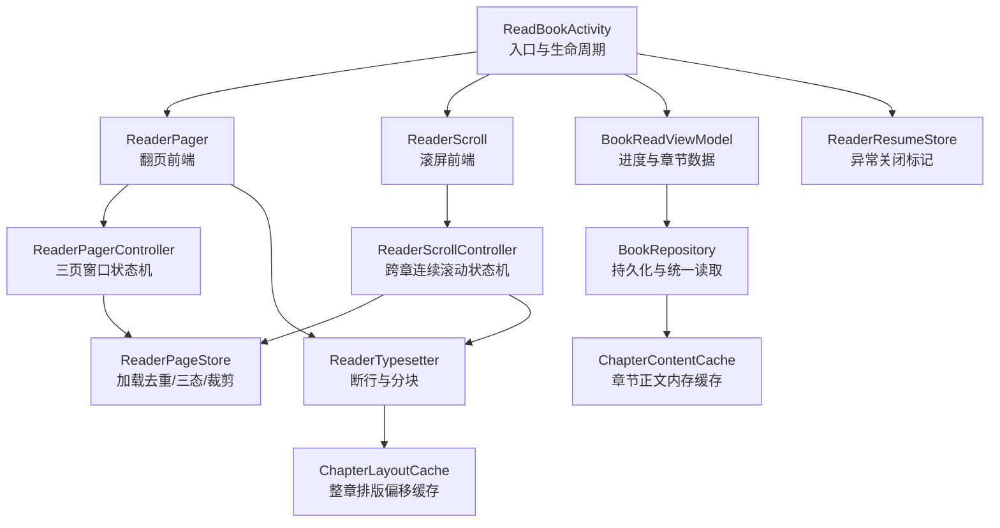

**图示来源**
- [ReadBookActivity.kt:1-200](file://module_book/src/main/java/com/ebook/book/ReadBookActivity.kt#L1-L200)
- [ReaderPager.kt:1-200](file://module_book/src/main/java/com/ebook/book/reader/ReaderPager.kt#L1-L200)
- [ReaderScroll.kt:1-200](file://module_book/src/main/java/com/ebook/book/reader/ReaderScroll.kt#L1-L200)
- [ReaderScrollController.kt:1-200](file://module_book/src/main/java/com/ebook/book/reader/ReaderScrollController.kt#L1-L200)
- [ReaderPageStore.kt:1-98](file://module_book/src/main/java/com/ebook/book/reader/ReaderPageStore.kt#L1-L98)
- [ReaderTypesetter.kt:1-175](file://module_book/src/main/java/com/ebook/book/reader/ReaderTypesetter.kt#L1-L175)
- [ChapterLayoutCache.kt:1-61](file://module_book/src/main/java/com/ebook/book/reader/ChapterLayoutCache.kt#L1-L61)
- [BookReadViewModel.kt:1-151](file://module_book/src/main/java/com/ebook/book/mvvm/viewmodel/BookReadViewModel.kt#L1-L151)
- [BookRepository.kt:1-200](file://lib_book_common/src/main/java/com/ebook/common/repository/BookRepository.kt#L1-L200)
- [ReaderResumeStore.kt:1-68](file://lib_book_common/src/main/java/com/ebook/common/store/ReaderResumeStore.kt#L1-L68)
- [ChapterContentCache.kt:1-63](file://lib_book_common/src/main/java/com/ebook/common/store/ChapterContentCache.kt#L1-L63)

**章节来源**
- [ReadBookActivity.kt:1-200](file://module_book/src/main/java/com/ebook/book/ReadBookActivity.kt#L1-L200)
- [2026-09-13-reader-scroll-mode-design.md:1-200](file://docs/superpowers/specs/2026-09-13-reader-scroll-mode-design.md#L1-L200)
- [2026-09-13-reader-scroll-mode.md:1-200](file://docs/superpowers/plans/2026-09-13-reader-scroll-mode.md#L1-L200)

## 核心组件
- **ReaderPager / ReaderPagerController**：横向翻页的前端与状态机，维护当前页、上一页、下一页键，处理拖拽、动画、边界判断与窗口收敛规则。
- **ReaderScroll / ReaderScrollController**：竖向滚屏的前端与状态机，管理跨章连续的 item 列表、锚点章与块、懒物化相邻章、滚动落点与进度上报。
- **ReaderPageStore**：共享的页面加载仓库，负责 key → 渲染状态的映射、在途任务去重、失败重试、跳转清理和按几何半径裁剪。
- **ReaderTypesetter**：排版事实源，提供断行偏移、一屏行数测算、测量块高，确保分页与渲染同源。
- **ChapterLayoutCache**：整章排版偏移的进程内缓存，避免同章多页重复断行计算。
- **BookReadViewModel**：封装书架实体、章节标题、进度更新与保存、章节加载、追更逻辑等。
- **ReadBookActivity**：阅读器入口，组合 UI 控制器、排版上下文、亮度与主题、手势按键转发、模式切换与恢复。
- **ReaderResumeStore**：异常关闭后是否恢复阅读的 SP 标记。
- **ChapterContentCache**：章节正文的内存缓存，减少磁盘 IO。
- **BookRepository**：统一章节读取、进度持久化、换源与目录同步等仓储能力。

**章节来源**
- [ReaderPager.kt:1-200](file://module_book/src/main/java/com/ebook/book/reader/ReaderPager.kt#L1-L200)
- [ReaderScroll.kt:1-200](file://module_book/src/main/java/com/ebook/book/reader/ReaderScroll.kt#L1-L200)
- [ReaderScrollController.kt:1-200](file://module_book/src/main/java/com/ebook/book/reader/ReaderScrollController.kt#L1-L200)
- [ReaderPageStore.kt:1-98](file://module_book/src/main/java/com/ebook/book/reader/ReaderPageStore.kt#L1-L98)
- [ReaderTypesetter.kt:1-175](file://module_book/src/main/java/com/ebook/book/reader/ReaderTypesetter.kt#L1-L175)
- [ChapterLayoutCache.kt:1-61](file://module_book/src/main/java/com/ebook/book/reader/ChapterLayoutCache.kt#L1-L61)
- [BookReadViewModel.kt:1-151](file://module_book/src/main/java/com/ebook/book/mvvm/viewmodel/BookReadViewModel.kt#L1-L151)
- [ReadBookActivity.kt:1-200](file://module_book/src/main/java/com/ebook/book/ReadBookActivity.kt#L1-L200)
- [ReaderResumeStore.kt:1-68](file://lib_book_common/src/main/java/com/ebook/common/store/ReaderResumeStore.kt#L1-L68)
- [ChapterContentCache.kt:1-63](file://lib_book_common/src/main/java/com/ebook/common/store/ChapterContentCache.kt#L1-L63)
- [BookRepository.kt:1-200](file://lib_book_common/src/main/java/com/ebook/common/repository/BookRepository.kt#L1-L200)

## 架构总览
阅读系统以 Activity 为入口，组合 Compose 页面；翻页方式通过设置切换，分别由 `ReaderPagerController` 与 `ReaderScrollController` 承载；两者共用 `ReaderPageStore` 与 `loadPage` 分页链；排版由 `ReaderTypesetter` 提供，排版偏移经 `ChapterLayoutCache` 缓存；正文数据经 `BookRepository.loadChapter` 统一获取，命中 `ChapterContentCache`；阅读进度经 `BookReadViewModel.updateProgress/saveProgress` 写入 Room。

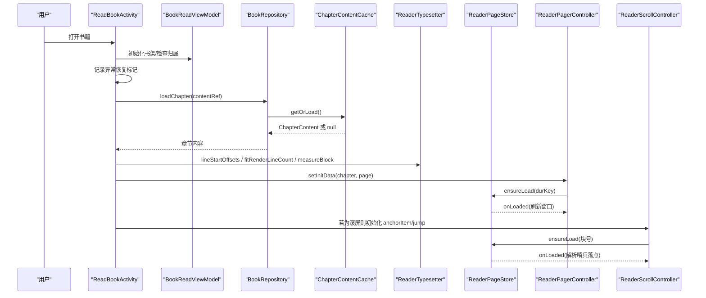

**图示来源**
- [ReadBookActivity.kt:1-200](file://module_book/src/main/java/com/ebook/book/ReadBookActivity.kt#L1-L200)
- [BookReadViewModel.kt:1-151](file://module_book/src/main/java/com/ebook/book/mvvm/viewmodel/BookReadViewModel.kt#L1-L151)
- [BookRepository.kt:1-200](file://lib_book_common/src/main/java/com/ebook/common/repository/BookRepository.kt#L1-L200)
- [ChapterContentCache.kt:1-63](file://lib_book_common/src/main/java/com/ebook/common/store/ChapterContentCache.kt#L1-L63)
- [ReaderTypesetter.kt:1-175](file://module_book/src/main/java/com/ebook/book/reader/ReaderTypesetter.kt#L1-L175)
- [ReaderPager.kt:1-200](file://module_book/src/main/java/com/ebook/book/reader/ReaderPager.kt#L1-L200)
- [ReaderScroll.kt:1-200](file://module_book/src/main/java/com/ebook/book/reader/ReaderScroll.kt#L1-L200)
- [ReaderScrollController.kt:1-200](file://module_book/src/main/java/com/ebook/book/reader/ReaderScrollController.kt#L1-L200)
- [ReaderPageStore.kt:1-98](file://module_book/src/main/java/com/ebook/book/reader/ReaderPageStore.kt#L1-L98)

## 详细组件分析

### 翻页状态机与页面切换逻辑
`ReaderPagerController` 是横向翻页的状态机，维护三个关键键：当前页、上一页、下一页。它负责：
- 初始化和跳转：清空在途任务，设置当前页键，触发加载并立即回调进度。
- 窗口刷新：根据已加载结果推算前后页键，并预加载相邻页。
- 手势与动画：拖拽增量受方向可达性约束；存在动画锁防止并发翻页；有成功阈值与回弹逻辑。
- 边界处理：无上一页或下一页时对应方向为 null，并在不可翻时给出提示。
- 竞态安全：完成回调仅对仍属于当前窗口的 key 触发重算，无需时间戳过期校验。

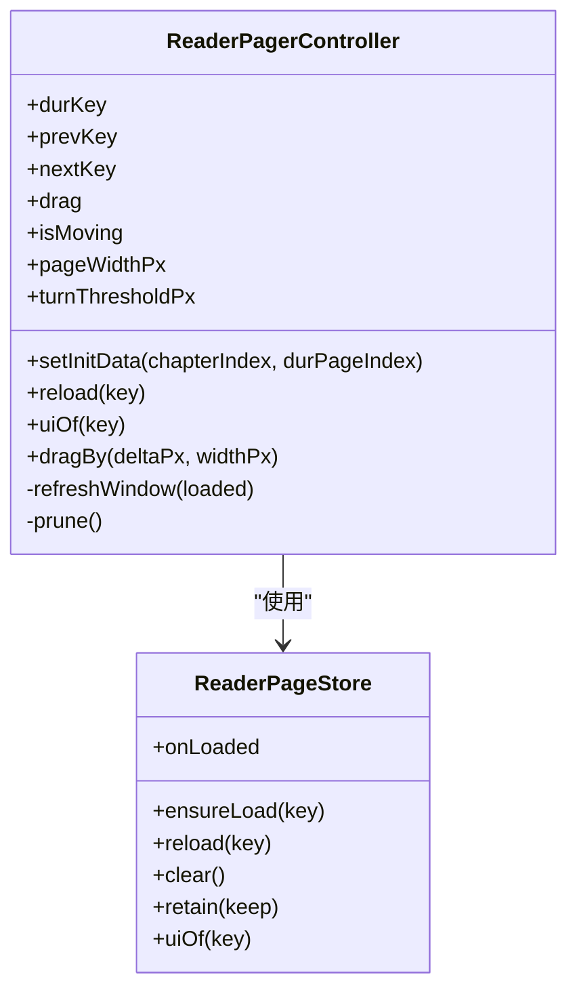

**图示来源**
- [ReaderPager.kt:1-200](file://module_book/src/main/java/com/ebook/book/reader/ReaderPager.kt#L1-L200)
- [ReaderPageStore.kt:1-98](file://module_book/src/main/java/com/ebook/book/reader/ReaderPageStore.kt#L1-L98)

**章节来源**
- [ReaderPager.kt:1-200](file://module_book/src/main/java/com/ebook/book/reader/ReaderPager.kt#L1-L200)
- [ReaderPageStore.kt:1-98](file://module_book/src/main/java/com/ebook/book/reader/ReaderPageStore.kt#L1-L98)

### 滚动模式与跨章连续列表
`ReaderScrollController` 是滚屏模式的状态机，核心概念包括：
- `ScrollItem.Title` 与 `ScrollItem.Block`：章节标题项与正文块项。
- `ChapterSection`：一章在列表中的段，含标题项与块数；块数未知时占 1 个占位块。
- 惰性物化：进入某章即物化其相邻两章，使章界无缝衔接。
- 锚点语义值：用 `(章, 块)` 而非扁平序号，避免上方插入导致的序号漂移。
- 哨兵落点解析：冷启动或跳章时的 BEGIN/END 页码需在块数落定后解析为具体块号。
- LazyColumn 稳定 key：key 全局唯一，确保锚点上方插入时视觉位置不变。

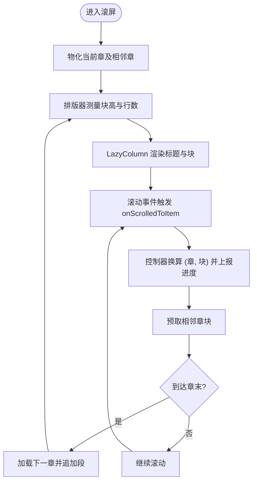

**图示来源**
- [ReaderScroll.kt:1-200](file://module_book/src/main/java/com/ebook/book/reader/ReaderScroll.kt#L1-L200)
- [ReaderScrollController.kt:1-200](file://module_book/src/main/java/com/ebook/book/reader/ReaderScrollController.kt#L1-L200)
- [ReaderTypesetter.kt:1-175](file://module_book/src/main/java/com/ebook/book/reader/ReaderTypesetter.kt#L1-L175)

**章节来源**
- [ReaderScroll.kt:1-200](file://module_book/src/main/java/com/ebook/book/reader/ReaderScroll.kt#L1-L200)
- [ReaderScrollController.kt:1-200](file://module_book/src/main/java/com/ebook/book/reader/ReaderScrollController.kt#L1-L200)
- [2026-09-13-reader-scroll-mode-design.md:1-200](file://docs/superpowers/specs/2026-09-13-reader-scroll-mode-design.md#L1-L200)
- [2026-09-13-reader-scroll-mode.md:1-200](file://docs/superpowers/plans/2026-09-13-reader-scroll-mode.md#L1-L200)

### 页面加载仓库与竞态处理
`ReaderPageStore` 是所有页面加载的共享仓库，职责包括：
- key → 渲染状态映射，未登记返回加载中兜底。
- 在途任务去重：相同 key 不重复请求。
- 已 Loaded 短路：快速回翻不闪转圈。
- 身份比对与 isActive：取消后后继任务不会被误删。
- clear：跳转或换装点清理所有在途任务与状态。
- retain：按几何半径裁剪保留集之外的键，翻页模式保留三键，滚屏模式保留锚点章 ±2 章的全部块。

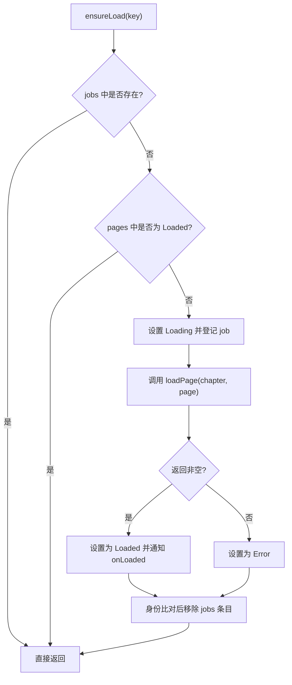

**图示来源**
- [ReaderPageStore.kt:1-98](file://module_book/src/main/java/com/ebook/book/reader/ReaderPageStore.kt#L1-L98)

**章节来源**
- [ReaderPageStore.kt:1-98](file://module_book/src/main/java/com/ebook/book/reader/ReaderPageStore.kt#L1-L98)

### 排版与分块
`ReaderTypesetter` 是排版事实源，核心方法：
- `lineStartOffsets`：基于渲染引擎断行结果返回每行起始偏移，避免拼接子串丢失段落分隔符。
- `fitRenderLineCount`：测量正文区可容纳的行数，替代估算公式。
- `measureBlock`：一次测量同时返回行数和实测高度，供滚屏模式精确块高。
- `fitLines`：纯函数，给定逐行底部位置求可放行数与总高。

排版与渲染必须同源，否则会出现少行、接不上等问题；`readerBodyTextStyle` 固定行高样式，避免主题隐式解析导致测量与渲染不一致。

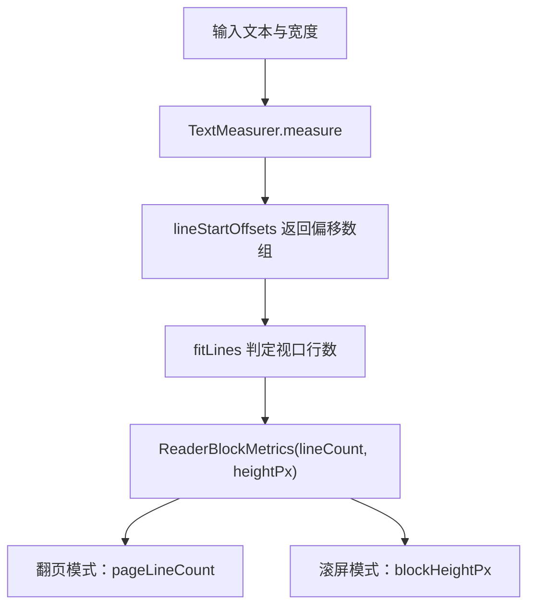

**图示来源**
- [ReaderTypesetter.kt:1-175](file://module_book/src/main/java/com/ebook/book/reader/ReaderTypesetter.kt#L1-L175)

**章节来源**
- [ReaderTypesetter.kt:1-175](file://module_book/src/main/java/com/ebook/book/reader/ReaderTypesetter.kt#L1-L175)

### 章节缓存机制
章节正文与排版偏移分别有两层缓存：
- `ChapterContentCache`：章节正文内存缓存，容量 3（当前章 + 前后各一章），按 contentRef 失效；按书 ID 片段批量失效；null 不入缓存以便后续注册补齐后自然恢复。
- `ChapterLayoutCache`：整章排版偏移缓存，容量约覆盖当前章及前后各两章；键包含 contentRef、contentLength、fontSizeSp、widthPx；并发访问经 synchronizedMap 保护。

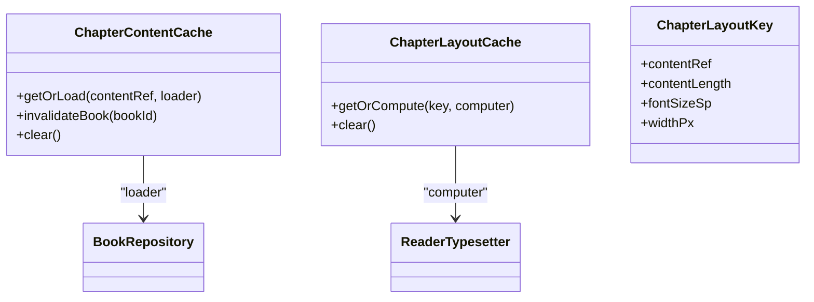

**图示来源**
- [ChapterContentCache.kt:1-63](file://lib_book_common/src/main/java/com/ebook/common/store/ChapterContentCache.kt#L1-L63)
- [ChapterLayoutCache.kt:1-61](file://module_book/src/main/java/com/ebook/book/reader/ChapterLayoutCache.kt#L1-L61)
- [ReaderTypesetter.kt:1-175](file://module_book/src/main/java/com/ebook/book/reader/ReaderTypesetter.kt#L1-L175)

**章节来源**
- [ChapterContentCache.kt:1-63](file://lib_book_common/src/main/java/com/ebook/common/store/ChapterContentCache.kt#L1-L63)
- [ChapterLayoutCache.kt:1-61](file://module_book/src/main/java/com/ebook/book/reader/ChapterLayoutCache.kt#L1-L61)

### 阅读进度管理与持久化
阅读进度以 `(chapterIndex, pageIndex)` 表示，持久化字段为 `dur_chapter` 与 `dur_chapter_page`。`BookReadViewModel.updateProgress` 更新内存实体，`saveProgress` 异步调用 `BookRepository.saveProgress` 写库。`BookRepository.saveProgress` 会钳制越界索引并广播 `ProgressUpdated` 事件。

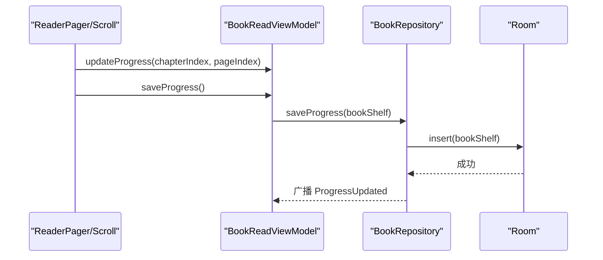

**图示来源**
- [BookReadViewModel.kt:1-151](file://module_book/src/main/java/com/ebook/book/mvvm/viewmodel/BookReadViewModel.kt#L1-L151)
- [BookRepository.kt:1-200](file://lib_book_common/src/main/java/com/ebook/common/repository/BookRepository.kt#L1-L200)

**章节来源**
- [BookReadViewModel.kt:1-151](file://module_book/src/main/java/com/ebook/book/mvvm/viewmodel/BookReadViewModel.kt#L1-L151)
- [BookRepository.kt:1-200](file://lib_book_common/src/main/java/com/ebook/common/repository/BookRepository.kt#L1-L200)

### 手势识别与交互处理
- 翻页模式：`ReaderPager` 监听横向拖拽、左右三分区点击翻页；存在动画锁 `isMoving` 与成功阈值。
- 滚屏模式：`ReaderScroll` 区分点击与拖动，仅响应点击；左右三分之一区域滚一屏，中间唤出菜单；纵向滚动交给 `LazyColumn`。
- 音量键与按键：Activity 持有控制器引用并转发按键事件给当前模式的控制器。

**章节来源**
- [ReaderPager.kt:1-200](file://module_book/src/main/java/com/ebook/book/reader/ReaderPager.kt#L1-L200)
- [ReaderScroll.kt:1-200](file://module_book/src/main/java/com/ebook/book/reader/ReaderScroll.kt#L1-L200)
- [ReadBookActivity.kt:1-200](file://module_book/src/main/java/com/ebook/book/ReadBookActivity.kt#L1-L200)

### 阅读器界面组件与主题适配
- 页面卡片：翻页模式使用 `ReaderPageCard`，显示章节标题、正文与常驻页码行。
- 滚屏布局：外层 Column 与 `ReaderPageCard` 同一 insets 与边距口径；位置指示行位于滚动区之外，避免遮挡最后一行。
- 主题适配：正文背景色走“阅读背景主题”（纸张色），菜单与面板继承全局主题；亮度与外观模式分别处理。
- 字体与行高：通过 `rememberReaderTypesetter` 注入样式，保证测量与渲染一致。

**章节来源**
- [ReaderPager.kt:1-200](file://module_book/src/main/java/com/ebook/book/reader/ReaderPager.kt#L1-L200)
- [ReaderScroll.kt:1-200](file://module_book/src/main/java/com/ebook/book/reader/ReaderScroll.kt#L1-L200)
- [ReadBookActivity.kt:1-200](file://module_book/src/main/java/com/ebook/book/ReadBookActivity.kt#L1-L200)
- [ReaderTypesetter.kt:1-175](file://module_book/src/main/java/com/ebook/book/reader/ReaderTypesetter.kt#L1-L175)

### 无障碍支持
当前源码中未发现专门的可访问性配置（如内容描述、焦点策略、TalkBack 适配）。建议：
- 为页码行、按钮与菜单项添加内容描述。
- 为滚动区域提供适当的可聚焦性与操作反馈。
- 对主题与对比度做无障碍测试。

[本节为通用建议，不直接分析具体文件]

### 阅读恢复功能与异常恢复策略
`ReaderResumeStore` 使用独立 SP 文件记录“上次未收尾的阅读会话”。当应用被强杀或崩溃时，该标记仍存在；启动页据此决定是否直接恢复阅读界面。正常退出时清除标记。注意它与“阅读进度”不同：前者是开关，后者是持久化的章节与页码。

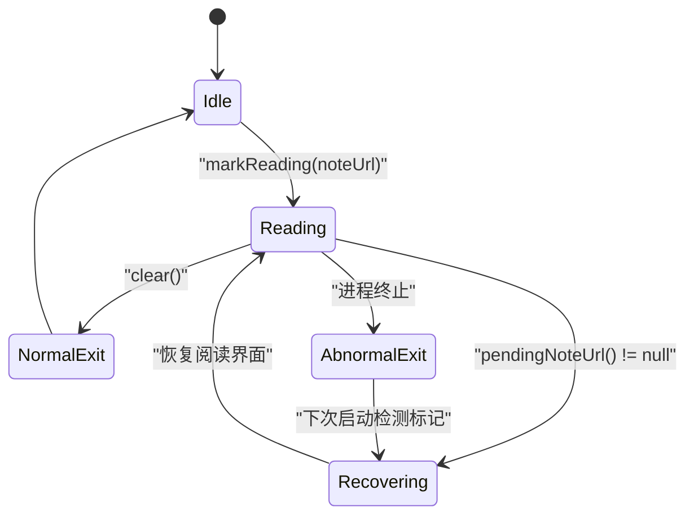

**图示来源**
- [ReaderResumeStore.kt:1-68](file://lib_book_common/src/main/java/com/ebook/common/store/ReaderResumeStore.kt#L1-L68)
- [ReadBookActivity.kt:1-200](file://module_book/src/main/java/com/ebook/book/ReadBookActivity.kt#L1-L200)

**章节来源**
- [ReaderResumeStore.kt:1-68](file://lib_book_common/src/main/java/com/ebook/common/store/ReaderResumeStore.kt#L1-L68)
- [ReadBookActivity.kt:1-200](file://module_book/src/main/java/com/ebook/book/ReadBookActivity.kt#L1-L200)

## 依赖关系分析
- `ReaderPagerController` 与 `ReaderScrollController` 都依赖 `ReaderPageStore`，解耦了加载与几何。
- `ReaderTypesetter` 被两个前端复用，确保分页与渲染同源。
- `BookReadViewModel` 依赖 `BookRepository` 提供章节数据与进度持久化。
- `BookRepository` 依赖 `ChapterContentCache` 加速章节正文读取。
- `ReadBookActivity` 协调控制器、排版上下文、主题与恢复标记。

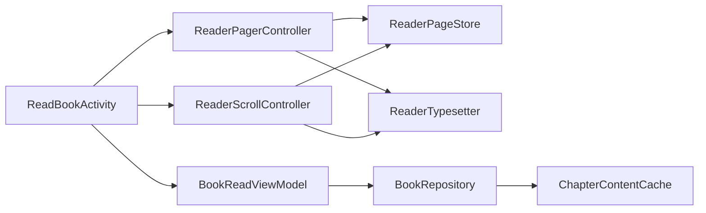

**图示来源**
- [ReaderPager.kt:1-200](file://module_book/src/main/java/com/ebook/book/reader/ReaderPager.kt#L1-L200)
- [ReaderScroll.kt:1-200](file://module_book/src/main/java/com/ebook/book/reader/ReaderScroll.kt#L1-L200)
- [ReaderScrollController.kt:1-200](file://module_book/src/main/java/com/ebook/book/reader/ReaderScrollController.kt#L1-L200)
- [ReaderPageStore.kt:1-98](file://module_book/src/main/java/com/ebook/book/reader/ReaderPageStore.kt#L1-L98)
- [ReaderTypesetter.kt:1-175](file://module_book/src/main/java/com/ebook/book/reader/ReaderTypesetter.kt#L1-L175)
- [BookReadViewModel.kt:1-151](file://module_book/src/main/java/com/ebook/book/mvvm/viewmodel/BookReadViewModel.kt#L1-L151)
- [BookRepository.kt:1-200](file://lib_book_common/src/main/java/com/ebook/common/repository/BookRepository.kt#L1-L200)
- [ChapterContentCache.kt:1-63](file://lib_book_common/src/main/java/com/ebook/common/store/ChapterContentCache.kt#L1-L63)

**章节来源**
- [ReaderPager.kt:1-200](file://module_book/src/main/java/com/ebook/book/reader/ReaderPager.kt#L1-L200)
- [ReaderScroll.kt:1-200](file://module_book/src/main/java/com/ebook/book/reader/ReaderScroll.kt#L1-L200)
- [ReaderScrollController.kt:1-200](file://module_book/src/main/java/com/ebook/book/reader/ReaderScrollController.kt#L1-L200)
- [ReaderPageStore.kt:1-98](file://module_book/src/main/java/com/ebook/book/reader/ReaderPageStore.kt#L1-L98)
- [ReaderTypesetter.kt:1-175](file://module_book/src/main/java/com/ebook/book/reader/ReaderTypesetter.kt#L1-L175)
- [BookReadViewModel.kt:1-151](file://module_book/src/main/java/com/ebook/book/mvvm/viewmodel/BookReadViewModel.kt#L1-L151)
- [BookRepository.kt:1-200](file://lib_book_common/src/main/java/com/ebook/common/repository/BookRepository.kt#L1-L200)
- [ChapterContentCache.kt:1-63](file://lib_book_common/src/main/java/com/ebook/common/store/ChapterContentCache.kt#L1-L63)

## 性能考量
- 排版开销：`lineStartOffsets` 是 O(章长)，同章多页会重复调用；`ChapterLayoutCache` 将整章偏移缓存，避免重复断行。
- 正文读取：`ChapterContentCache` 缓存章节正文，避免频繁 IO；容量为 3，适合预加载相邻章。
- 列表锚点：滚屏模式要求 item key 全局唯一且单次上方插入不超过一定数量，避免 LazyColumn 锚定失败。
- 内存裁剪：`ReaderPageStore.retain` 按几何半径裁剪，翻页模式保留三键，滚屏模式保留锚点章 ±2 章。
- 线程与并发：排版测量在无缓存 TextMeasurer 上运行，避免跨线程状态问题；`ChapterLayoutCache` 使用同步 map 保护并发写。

[本节为一般性指导，不直接分析具体文件]

## 故障排查指南
- 翻页接不上：检查 `ReaderTypesetter.readerBodyTextStyle` 是否与渲染端一致；确认 `fitRenderLineCount` 与 `measureBlock` 使用同一份探针。
- 滚屏出现空白或错位：确认 `blockHeightPx` 来自 `measureBlock`，不要使用 `lineCount × lineHeight` 心算；检查 LazyColumn 的 key 是否全局唯一。
- 加载闪烁或重复请求：检查 `ReaderPageStore.ensureLoad` 的 Loaded 短路逻辑；确认跳转时调用了 `clear()`。
- 进度错乱：确认 `updateProgress` 与 `saveProgress` 被正确调用；检查 `BookRepository.saveProgress` 的越界钳制日志。
- 异常恢复无效：检查 `ReaderResumeStore.markReading/clear` 是否在正确时机调用；确认 SP 文件名与键未被批量清理误伤。
- 章节正文旧内容：确认 `ChapterContentCache.invalidateBook` 在重抓或换源时调用；检查 contentRef 是否变化。

**章节来源**
- [ReaderTypesetter.kt:1-175](file://module_book/src/main/java/com/ebook/book/reader/ReaderTypesetter.kt#L1-L175)
- [ReaderPageStore.kt:1-98](file://module_book/src/main/java/com/ebook/book/reader/ReaderPageStore.kt#L1-L98)
- [BookRepository.kt:1-200](file://lib_book_common/src/main/java/com/ebook/common/repository/BookRepository.kt#L1-L200)
- [ReaderResumeStore.kt:1-68](file://lib_book_common/src/main/java/com/ebook/common/store/ReaderResumeStore.kt#L1-L68)
- [ChapterContentCache.kt:1-63](file://lib_book_common/src/main/java/com/ebook/common/store/ChapterContentCache.kt#L1-L63)

## 结论
阅读系统通过“翻页/滚屏双前端 + 共享加载仓库 + 排版事实源 + 双层缓存 + 稳健持久化”的设计，实现了流畅的阅读体验与健壮的异常恢复。翻页状态机保持原有行为不变，滚屏模式通过跨章连续列表与精确块高测量提升连续性；进度与恢复机制互相补充，既保证可读性也兼顾容错。未来可在无障碍与更多性能优化方面继续完善。

## 附录：阅读恢复与持久化流程
- 打开书籍时写入 `ReaderResumeStore` 标记。
- 正常退出时清除标记。
- 启动页检测到残留标记时恢复阅读界面。
- 每次翻页或滚动回调 `updateProgress`，定时或退出时 `saveProgress` 写库。
- `BookRepository.saveProgress` 钳制越界并广播事件。

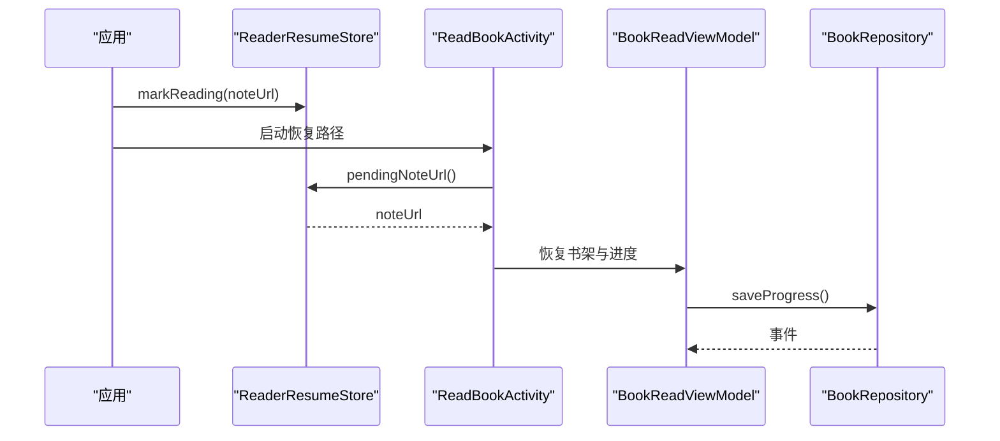

**图示来源**
- [ReaderResumeStore.kt:1-68](file://lib_book_common/src/main/java/com/ebook/common/store/ReaderResumeStore.kt#L1-L68)
- [ReadBookActivity.kt:1-200](file://module_book/src/main/java/com/ebook/book/ReadBookActivity.kt#L1-L200)
- [BookReadViewModel.kt:1-151](file://module_book/src/main/java/com/ebook/book/mvvm/viewmodel/BookReadViewModel.kt#L1-L151)
- [BookRepository.kt:1-200](file://lib_book_common/src/main/java/com/ebook/common/repository/BookRepository.kt#L1-L200)