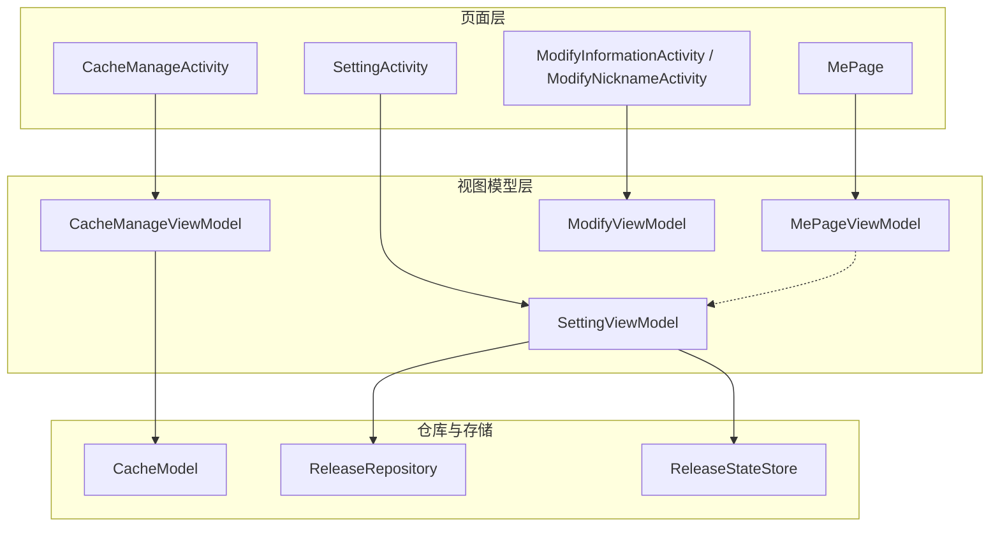
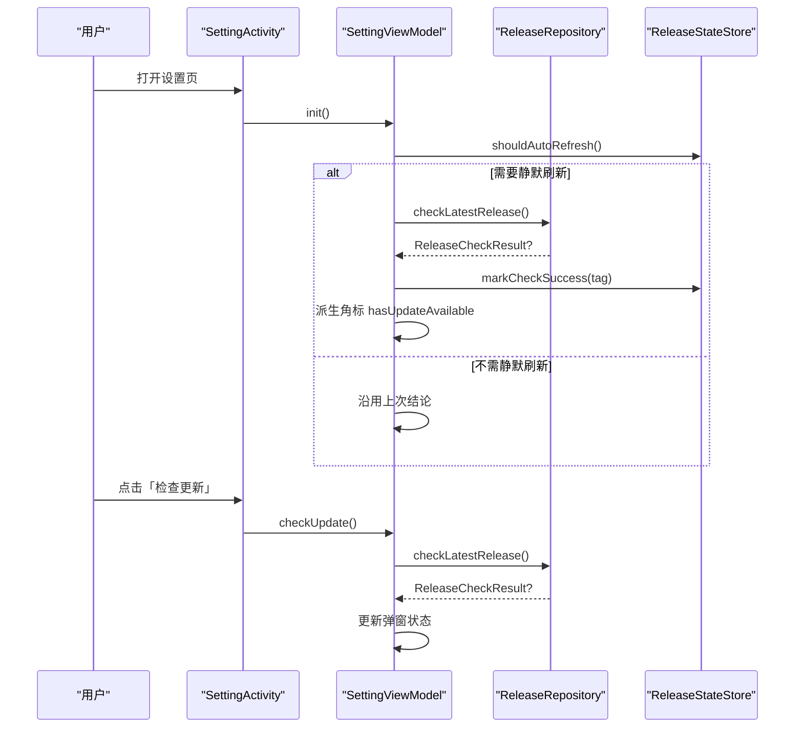
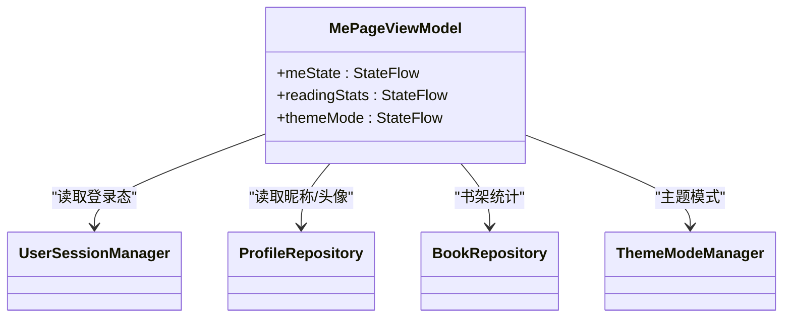
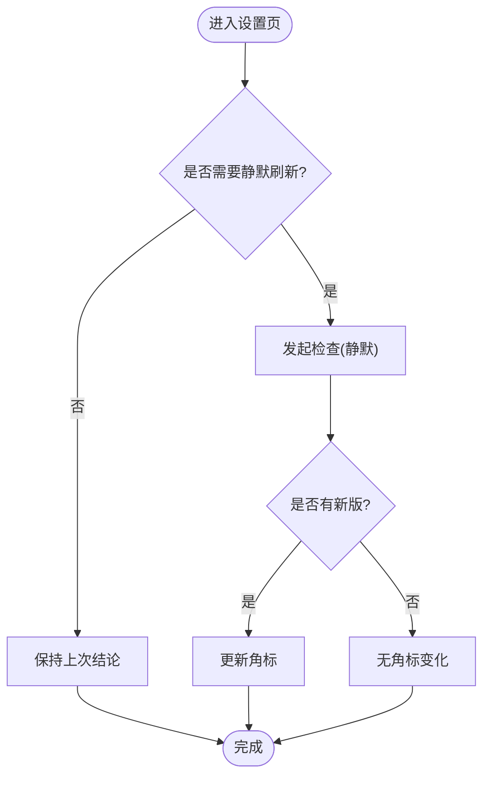
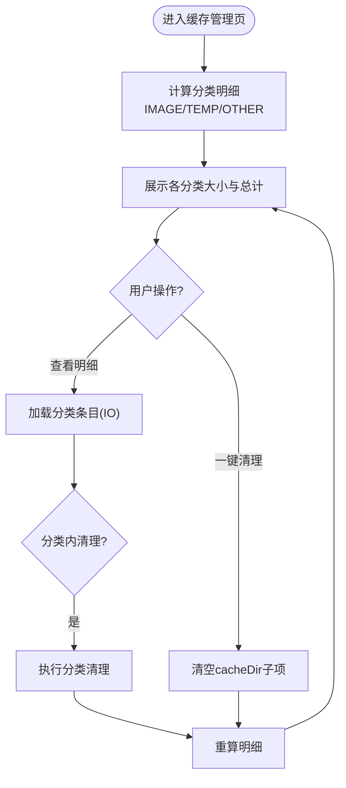
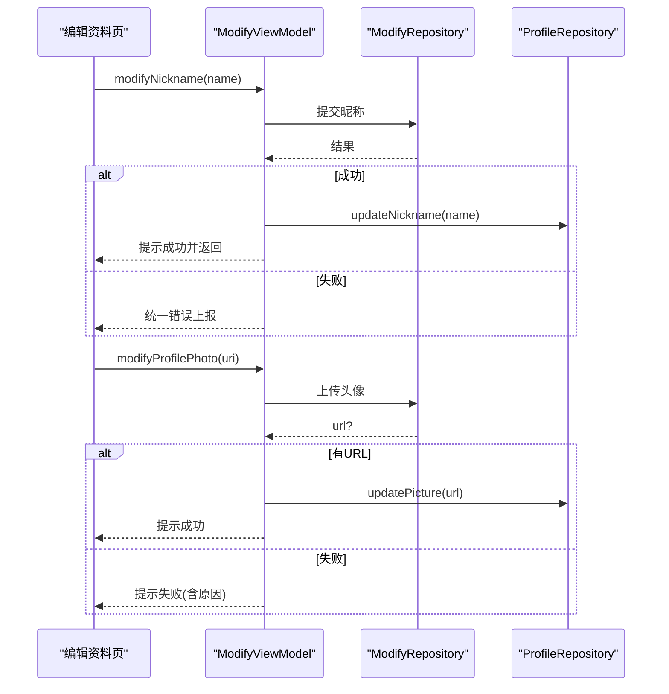
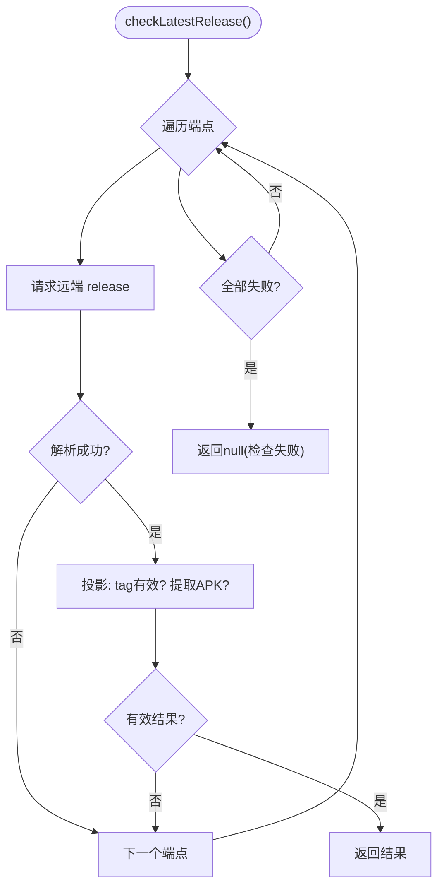
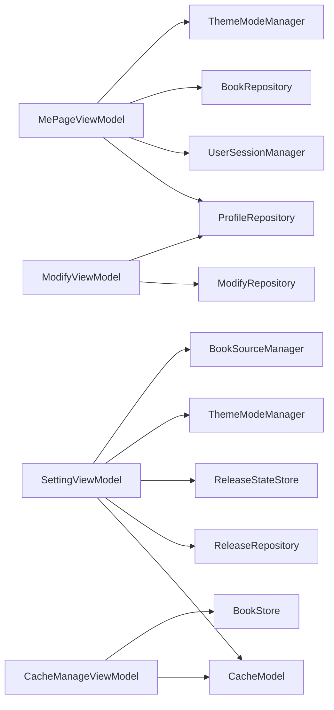

# 个人中心模块 (module_me)

<cite>
**本文引用的文件列表**
- [MePageViewModel.kt](file://module_me/src/main/java/com/ebook/me/mvvm/viewmodel/MePageViewModel.kt)
- [SettingViewModel.kt](file://module_me/src/main/java/com/ebook/me/mvvm/viewmodel/SettingViewModel.kt)
- [CacheManageViewModel.kt](file://module_me/src/main/java/com/ebook/me/mvvm/viewmodel/CacheManageViewModel.kt)
- [ModifyViewModel.kt](file://module_me/src/main/java/com/ebook/me/mvvm/viewmodel/ModifyViewModel.kt)
- [CacheModel.kt](file://module_me/src/main/java/com/ebook/me/repository/CacheModel.kt)
- [ReleaseRepository.kt](file://module_me/src/main/java/com/ebook/me/repository/ReleaseRepository.kt)
- [ReleaseStateStore.kt](file://module_me/src/main/java/com/ebook/me/repository/ReleaseStateStore.kt)
- [MePage.kt](file://module_me/src/main/java/com/ebook/me/page/MePage.kt)
- [SettingActivity.kt](file://module_me/src/main/java/com/ebook/me/view/SettingActivity.kt)
- [CacheManageActivity.kt](file://module_me/src/main/java/com/ebook/me/view/CacheManageActivity.kt)
- [ModifyInformationActivity.kt](file://module_me/src/main/java/com/ebook/me/view/ModifyInformationActivity.kt)
- [ModifyNicknameActivity.kt](file://module_me/src/main/java/com/ebook/me/view/ModifyNicknameActivity.kt)
- [AboutActivity.kt](file://module_me/src/main/java/com/ebook/me/view/AboutActivity.kt)
- [LicensesActivity.kt](file://module_me/src/main/java/com/ebook/me/view/LicensesActivity.kt)
- [DocActivity.kt](file://module_me/src/main/java/com/ebook/me/view/DocActivity.kt)
- [BookSourceManageActivity.kt](file://module_me/src/main/java/com/ebook/me/view/BookSourceManageActivity.kt)
- [MyCommentActivity.kt](file://module_me/src/main/java/com/ebook/me/view/MyCommentActivity.kt)
- [AppVersion.kt](file://module_me/src/main/java/com/ebook/me/util/AppVersion.kt)
- [CacheModule.kt](file://module_me/src/main/java/com/ebook/me/di/CacheModule.kt)
</cite>

## 目录
1. [简介](#简介)
2. [项目结构](#项目结构)
3. [核心组件](#核心组件)
4. [架构总览](#架构总览)
5. [详细组件分析](#详细组件分析)
6. [依赖关系分析](#依赖关系分析)
7. [性能考虑](#性能考虑)
8. [故障排查指南](#故障排查指南)
9. [结论](#结论)
10. [附录：扩展与自定义示例](#附录：扩展与自定义示例)

## 简介
本模块为应用的“个人中心”功能域，覆盖用户信息展示与编辑、缓存管理与清理、设置配置（主题模式、版本更新检查等）、以及版本更新检查的 failover 策略。模块采用 MVVM 架构，UI 使用 Compose，状态管理基于 Flow；通过 Hilt 注入仓库与服务，保证可测试性与职责清晰。

## 项目结构
module_me 按典型业务模块组织：
- mvvm/viewmodel：页面级状态编排（MePageViewModel、SettingViewModel、CacheManageViewModel、ModifyViewModel 等）
- repository：领域数据与本地持久化（缓存统计与清理、版本更新检查策略与落盘）
- view：页面入口（Activity）与路由注册
- page：Compose 页面组合入口（如 MePage）
- util：工具类（版本解析等）
- di：Hilt 绑定（如 CacheModule 提供 CacheModel 实例）

图表来源
- [MePage.kt](file://module_me/src/main/java/com/ebook/me/page/MePage.kt)
- [MePageViewModel.kt:1-120](file://module_me/src/main/java/com/ebook/me/mvvm/viewmodel/MePageViewModel.kt#L1-L120)
- [SettingActivity.kt](file://module_me/src/main/java/com/ebook/me/view/SettingActivity.kt)
- [SettingViewModel.kt:1-360](file://module_me/src/main/java/com/ebook/me/mvvm/viewmodel/SettingViewModel.kt#L1-L360)
- [CacheManageActivity.kt](file://module_me/src/main/java/com/ebook/me/view/CacheManageActivity.kt)
- [CacheManageViewModel.kt:1-197](file://module_me/src/main/java/com/ebook/me/mvvm/viewmodel/CacheManageViewModel.kt#L1-L197)
- [CacheModel.kt:1-145](file://module_me/src/main/java/com/ebook/me/repository/CacheModel.kt#L1-L145)
- [ReleaseRepository.kt:1-127](file://module_me/src/main/java/com/ebook/me/repository/ReleaseRepository.kt#L1-L127)
- [ReleaseStateStore.kt:1-129](file://module_me/src/main/java/com/ebook/me/repository/ReleaseStateStore.kt#L1-L129)

章节来源
- [MePageViewModel.kt:1-120](file://module_me/src/main/java/com/ebook/me/mvvm/viewmodel/MePageViewModel.kt#L1-L120)
- [SettingViewModel.kt:1-360](file://module_me/src/main/java/com/ebook/me/mvvm/viewmodel/SettingViewModel.kt#L1-L360)
- [CacheManageViewModel.kt:1-197](file://module_me/src/main/java/com/ebook/me/mvvm/viewmodel/CacheManageViewModel.kt#L1-L197)
- [CacheModel.kt:1-145](file://module_me/src/main/java/com/ebook/me/repository/CacheModel.kt#L1-L145)
- [ReleaseRepository.kt:1-127](file://module_me/src/main/java/com/ebook/me/repository/ReleaseRepository.kt#L1-L127)
- [ReleaseStateStore.kt:1-129](file://module_me/src/main/java/com/ebook/me/repository/ReleaseStateStore.kt#L1-L129)

## 核心组件
- MePageViewModel：聚合登录态、个人资料、书架阅读概览与主题模式，向 UI 暴露单一数据源。
- SettingViewModel：负责缓存大小展示、版本更新检查（主动与静默）、外观主题切换、退出登录编排、书源数量展示。
- CacheManageViewModel：缓存分类统计、明细展开、分类清理与全量清理、书籍内容占用展示。
- ModifyViewModel：昵称与头像修改流程，统一回退到 ProfileRepository 刷新显示。
- CacheModel：cacheDir 分类统计（图片/临时/其他）、清理规则、明细列举。
- ReleaseRepository：发布源 failover、APK 附件过滤、结果投影。
- ReleaseStateStore：上次检查 tag 与时间戳落盘、是否已有新版本派生、限频控制。

章节来源
- [MePageViewModel.kt:1-120](file://module_me/src/main/java/com/ebook/me/mvvm/viewmodel/MePageViewModel.kt#L1-L120)
- [SettingViewModel.kt:1-360](file://module_me/src/main/java/com/ebook/me/mvvm/viewmodel/SettingViewModel.kt#L1-L360)
- [CacheManageViewModel.kt:1-197](file://module_me/src/main/java/com/ebook/me/mvvm/viewmodel/CacheManageViewModel.kt#L1-L197)
- [ModifyViewModel.kt:1-127](file://module_me/src/main/java/com/ebook/me/mvvm/viewmodel/ModifyViewModel.kt#L1-L127)
- [CacheModel.kt:1-145](file://module_me/src/main/java/com/ebook/me/repository/CacheModel.kt#L1-L145)
- [ReleaseRepository.kt:1-127](file://module_me/src/main/java/com/ebook/me/repository/ReleaseRepository.kt#L1-L127)
- [ReleaseStateStore.kt:1-129](file://module_me/src/main/java/com/ebook/me/repository/ReleaseStateStore.kt#L1-L129)

## 架构总览
个人中心以 ViewModel 为中心，通过仓库与存储抽象实现跨模块能力复用（如 ProfileRepository、UserSessionManager）。版本更新检查链路将网络策略（ReleaseRepository）、本地状态（ReleaseStateStore）与 UI 状态（SettingViewModel）解耦。缓存管理将文件 IO 下沉至 Model 层，VM 仅编排状态与交互。

图表来源
- [SettingViewModel.kt:174-290](file://module_me/src/main/java/com/ebook/me/mvvm/viewmodel/SettingViewModel.kt#L174-L290)
- [ReleaseRepository.kt:46-70](file://module_me/src/main/java/com/ebook/me/repository/ReleaseRepository.kt#L46-L70)
- [ReleaseStateStore.kt:82-101](file://module_me/src/main/java/com/ebook/me/repository/ReleaseStateStore.kt#L82-L101)

## 详细组件分析

### MePageViewModel：用户信息与阅读概览
- 状态流 meState：合并登录态、用户名、昵称与头像 URL，未登录或空值时 UI 回退默认文案/头像。
- 阅读统计 readingStats：来自书架观察流，计算藏书数与最近在读书名。
- 主题模式 themeMode：转发 ThemeModeManager 的当前模式，供头部渐变适配。

图表来源
- [MePageViewModel.kt:19-119](file://module_me/src/main/java/com/ebook/me/mvvm/viewmodel/MePageViewModel.kt#L19-L119)

章节来源
- [MePageViewModel.kt:19-119](file://module_me/src/main/java/com/ebook/me/mvvm/viewmodel/MePageViewModel.kt#L19-L119)

### SettingViewModel：设置数据流与版本更新检查
- 缓存大小：通过 CacheModel.cacheSizeBytes() 格式化展示。
- 版本更新检查：
  - 主动检查：立即请求并弹窗反馈。
  - 静默检查：进入设置页且距上次成功检查≥7天则发起，不弹窗只更新角标。
  - 在途任务单飞：避免并发重复请求，支持“在途升级为用户可见”。
  - 失败不覆盖：无法判定（tag 解析失败/本地版本读不到）不写盘，保留上次结论与限频时间。
- 主题模式：直接转发 ThemeModeManager.themeMode 并写入。
- 退出登录：先尝试服务端作废（失败不阻塞），再清本地会话（三处镜像），提示并关闭页面。

图表来源
- [SettingViewModel.kt:174-290](file://module_me/src/main/java/com/ebook/me/mvvm/viewmodel/SettingViewModel.kt#L174-L290)
- [ReleaseStateStore.kt:82-101](file://module_me/src/main/java/com/ebook/me/repository/ReleaseStateStore.kt#L82-L101)

章节来源
- [SettingViewModel.kt:1-360](file://module_me/src/main/java/com/ebook/me/mvvm/viewmodel/SettingViewModel.kt#L1-L360)

### CacheManageViewModel 与 CacheModel：缓存分档统计与一键清理
- 分档统计：一次遍历 cacheDir，按目录名归类为 IMAGE（Coil/Glide 遗留）、TEMP（根目录松散文件）、OTHER（其余子目录），总量恒等于三者之和。
- 明细展开：按类型列出条目（目录/文件），按大小降序展示。
- 分类清理：调用对应清除方法后重算明细并提示。
- 一键清理：删除 cacheDir 下全部子项后重算明细。
- 书籍内容占用：单独一行展示 filesDir/books 占用与册数，不参与清理。

图表来源
- [CacheManageViewModel.kt:85-186](file://module_me/src/main/java/com/ebook/me/mvvm/viewmodel/CacheManageViewModel.kt#L85-L186)
- [CacheModel.kt:61-145](file://module_me/src/main/java/com/ebook/me/repository/CacheModel.kt#L61-L145)

章节来源
- [CacheManageViewModel.kt:1-197](file://module_me/src/main/java/com/ebook/me/mvvm/viewmodel/CacheManageViewModel.kt#L1-L197)
- [CacheModel.kt:1-145](file://module_me/src/main/java/com/ebook/me/repository/CacheModel.kt#L1-L145)

### ModifyViewModel：头像上传与昵称修改
- 资料展示：合并 ProfileRepository 的昵称与头像 URL，为空时 UI 回退默认。
- 修改昵称：提交后成功则更新 ProfileRepository 并返回上一页。
- 修改头像：上传成功后若返回新 URL 则更新 ProfileRepository，失败携带错误消息上报。
- 防重复提交：提交闸门防止并发 PUT。

图表来源
- [ModifyViewModel.kt:50-126](file://module_me/src/main/java/com/ebook/me/mvvm/viewmodel/ModifyViewModel.kt#L50-L126)

章节来源
- [ModifyViewModel.kt:1-127](file://module_me/src/main/java/com/ebook/me/mvvm/viewmodel/ModifyViewModel.kt#L1-L127)

### 版本更新检查与 ReleaseRepository 的 failover
- 源顺序：优先 GitHub latest，失败或无效时切换到 Gitcode latest。
- 有效性判断：空白 tag 视为该源无效；只认 .apk 附件（无 APK 仍返回结果，UI 降级隐藏下载按钮）。
- 取消语义：CancellationException 原样抛出，避免备用源被误触发。
- 本地状态：ReleaseStateStore 记录上次成功检查 tag 与时间，现场派生“是否有新版本”，具备 7 天限频。

图表来源
- [ReleaseRepository.kt:46-70](file://module_me/src/main/java/com/ebook/me/repository/ReleaseRepository.kt#L46-L70)
- [ReleaseRepository.kt:77-88](file://module_me/src/main/java/com/ebook/me/repository/ReleaseRepository.kt#L77-L88)
- [ReleaseStateStore.kt:66-77](file://module_me/src/main/java/com/ebook/me/repository/ReleaseStateStore.kt#L66-L77)

章节来源
- [ReleaseRepository.kt:1-127](file://module_me/src/main/java/com/ebook/me/repository/ReleaseRepository.kt#L1-L127)
- [ReleaseStateStore.kt:1-129](file://module_me/src/main/java/com/ebook/me/repository/ReleaseStateStore.kt#L1-L129)

### 通知系统集成
- 本模块未直接实现系统通知逻辑；版本更新检查与下载入口由 UI 根据 ReleaseCheckResult.apkDownloadUrl 决定是否引导跳转浏览器或下载器。
- 如需集成前台服务下载与通知，应遵循 ADR-0018 的前台服务约定（dataSync 配额、启动限制、通知行为），在本模块中通过调用通用下载服务进行对接。

章节来源
- [SettingViewModel.kt:214-290](file://module_me/src/main/java/com/ebook/me/mvvm/viewmodel/SettingViewModel.kt#L214-L290)
- [ReleaseRepository.kt:113-127](file://module_me/src/main/java/com/ebook/me/repository/ReleaseRepository.kt#L113-L127)

## 依赖关系分析
- MePageViewModel 依赖 UserSessionManager、ProfileRepository、BookRepository、ThemeModeManager，呈现“我的”页的核心数据。
- SettingViewModel 依赖 CacheModel、ReleaseRepository、ReleaseStateStore、ThemeModeManager、BookSourceManager，串联设置相关能力。
- CacheManageViewModel 依赖 CacheModel、BookStore，专注缓存与书籍内容占用展示。
- ModifyViewModel 依赖 ModifyRepository、ProfileRepository，处理资料变更。
- DI 通过 CacheModule 将 CacheModel 绑定到 application cacheDir。

图表来源
- [MePageViewModel.kt:70-119](file://module_me/src/main/java/com/ebook/me/mvvm/viewmodel/MePageViewModel.kt#L70-L119)
- [SettingViewModel.kt:63-71](file://module_me/src/main/java/com/ebook/me/mvvm/viewmodel/SettingViewModel.kt#L63-L71)
- [CacheManageViewModel.kt:36-40](file://module_me/src/main/java/com/ebook/me/mvvm/viewmodel/CacheManageViewModel.kt#L36-L40)
- [ModifyViewModel.kt:44-48](file://module_me/src/main/java/com/ebook/me/mvvm/viewmodel/ModifyViewModel.kt#L44-L48)
- [CacheModule.kt](file://module_me/src/main/java/com/ebook/me/di/CacheModule.kt)

章节来源
- [CacheModule.kt](file://module_me/src/main/java/com/ebook/me/di/CacheModule.kt)

## 性能考虑
- 状态流 WhileSubscribed：MePageViewModel 与 SettingViewModel 对冷流使用 WhileSubscribed(5s)，减少后台订阅带来的资源消耗。
- 缓存统计一次遍历：CacheModel.cacheBreakdown 单次遍历完成分档累加，避免差值法导致的重复 IO 与负数钳位问题。
- 单飞检查任务：SettingViewModel 在同一时刻最多一个版本检查任务，避免重复网络请求与状态覆盖。
- 文件 IO 切 IO 线程：CacheModel 所有文件操作在 Dispatchers.IO 执行，避免阻塞主线程。

章节来源
- [MePageViewModel.kt:77-119](file://module_me/src/main/java/com/ebook/me/mvvm/viewmodel/MePageViewModel.kt#L77-L119)
- [SettingViewModel.kt:96-105](file://module_me/src/main/java/com/ebook/me/mvvm/viewmodel/SettingViewModel.kt#L96-L105)
- [CacheModel.kt:61-92](file://module_me/src/main/java/com/ebook/me/repository/CacheModel.kt#L61-L92)

## 故障排查指南
- 版本检查失败：
  - 检查 ReleaseRepository 日志输出（源失败/解析失败），确认远端响应形态是否符合预期。
  - 检查 ReleaseStateStore 的 lastCheckedTag 与 lastSuccessCheckTime 是否正确落盘。
  - 注意“无法判定”路径不会写盘，避免假结论占满限频窗口。
- 缓存清理无效：
  - 确认 cacheDir 路径是否正确（由 CacheModule 注入）。
  - 检查分类识别逻辑（image_cache/image_manager_disk_cache 等目录是否存在）。
  - 确认清理后调用了 refreshInternal 重算明细。
- 头像/昵称修改异常：
  - 检查 ModifyRepository 返回结果，失败会通过 reportFailure 上报。
  - 确保成功后调用 ProfileRepository.updateNickname/updatePicture，否则 UI 不刷新。
- 退出登录后仍显示旧身份：
  - 确认调用 userSessionManager.clearSession()，它同时清理三处会话镜像。
  - 不要自行成对清理 ProfileRepository，以免掩盖真正的内存镜像问题。

章节来源
- [ReleaseRepository.kt:46-70](file://module_me/src/main/java/com/ebook/me/repository/ReleaseRepository.kt#L46-L70)
- [ReleaseStateStore.kt:82-101](file://module_me/src/main/java/com/ebook/me/repository/ReleaseStateStore.kt#L82-L101)
- [CacheModel.kt:61-145](file://module_me/src/main/java/com/ebook/me/repository/CacheModel.kt#L61-L145)
- [ModifyViewModel.kt:77-126](file://module_me/src/main/java/com/ebook/me/mvvm/viewmodel/ModifyViewModel.kt#L77-L126)
- [SettingViewModel.kt:301-343](file://module_me/src/main/java/com/ebook/me/mvvm/viewmodel/SettingViewModel.kt#L301-L343)

## 结论
个人中心模块以清晰的 MVVM 分层与职责边界，实现了用户信息管理、缓存管理与设置配置的核心能力。版本更新检查通过 ReleaseRepository 的策略层与 ReleaseStateStore 的状态落盘解耦了网络与 UI，保证了鲁棒性与可维护性。缓存管理以一次遍历分档统计与分类清理，兼顾性能与用户体验。后续扩展可在现有接口上无缝添加新字段与新设置项。

## 附录：扩展与自定义示例

- 扩展用户信息字段（例如新增“个人签名”）：
  - 在 ProfileRepository 增加 nickname/signature 的 StateFlow 与更新方法（参考 ModifyViewModel 中对 profileRepository.nickname/pictureUrl 的使用方式）。
  - 在 MePageViewModel 的 meState 合并签名流，并在 UI 展示。
  - 在 ModifyViewModel 中增加签名编辑提交与成功后的更新调用。

  参考路径
  - [ModifyViewModel.kt:50-60](file://module_me/src/main/java/com/ebook/me/mvvm/viewmodel/ModifyViewModel.kt#L50-L60)
  - [MePageViewModel.kt:77-93](file://module_me/src/main/java/com/ebook/me/mvvm/viewmodel/MePageViewModel.kt#L77-L93)

- 自定义缓存清理规则（例如新增“日志缓存”目录）：
  - 在 CacheModel 的分类逻辑中添加新的目录匹配分支（参考 imageCacheDirs 的实现方式）。
  - 在 clearOtherCache/clearImageCache/clearTempFiles 中相应调整删除范围。
  - 在 CacheManageViewModel 的 categoryTitleRes 中为新类型映射文案资源。

  参考路径
  - [CacheModel.kt:135-145](file://module_me/src/main/java/com/ebook/me/repository/CacheModel.kt#L135-L145)
  - [CacheManageViewModel.kt:188-197](file://module_me/src/main/java/com/ebook/me/mvvm/viewmodel/CacheManageViewModel.kt#L188-L197)

- 实现新的设置项（例如“夜间模式自动切换时段”）：
  - 在 SettingViewModel 增加对应的 StateFlow 与 setXxx 方法，读写由 ThemeModeManager 或专用管理器持久化。
  - 在 SettingActivity 的 UI 中暴露设置入口，收集用户输入并调用 VM 写入。
  - 如与主题相关，确保与 ThemeModeManager 的单源一致，避免多份状态导致不一致。

  参考路径
  - [SettingViewModel.kt:164-172](file://module_me/src/main/java/com/ebook/me/mvvm/viewmodel/SettingViewModel.kt#L164-L172)
  - [SettingActivity.kt](file://module_me/src/main/java/com/ebook/me/view/SettingActivity.kt)