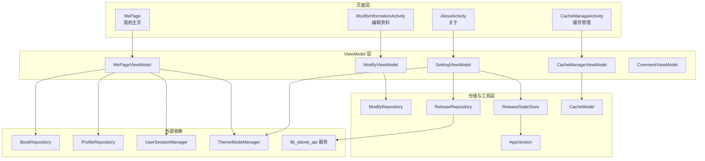
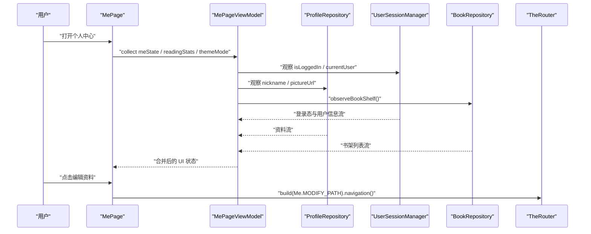
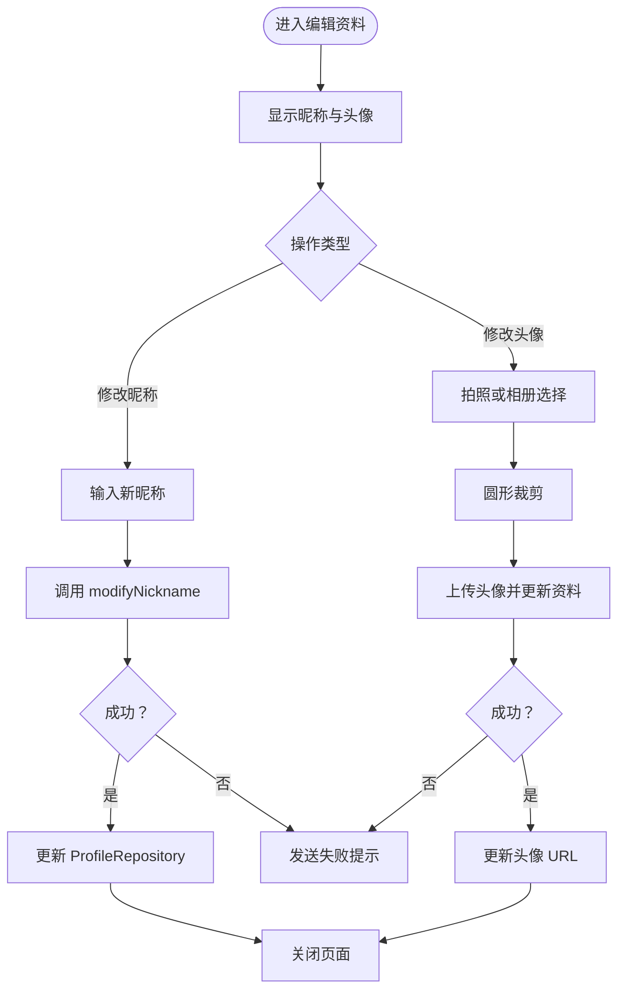
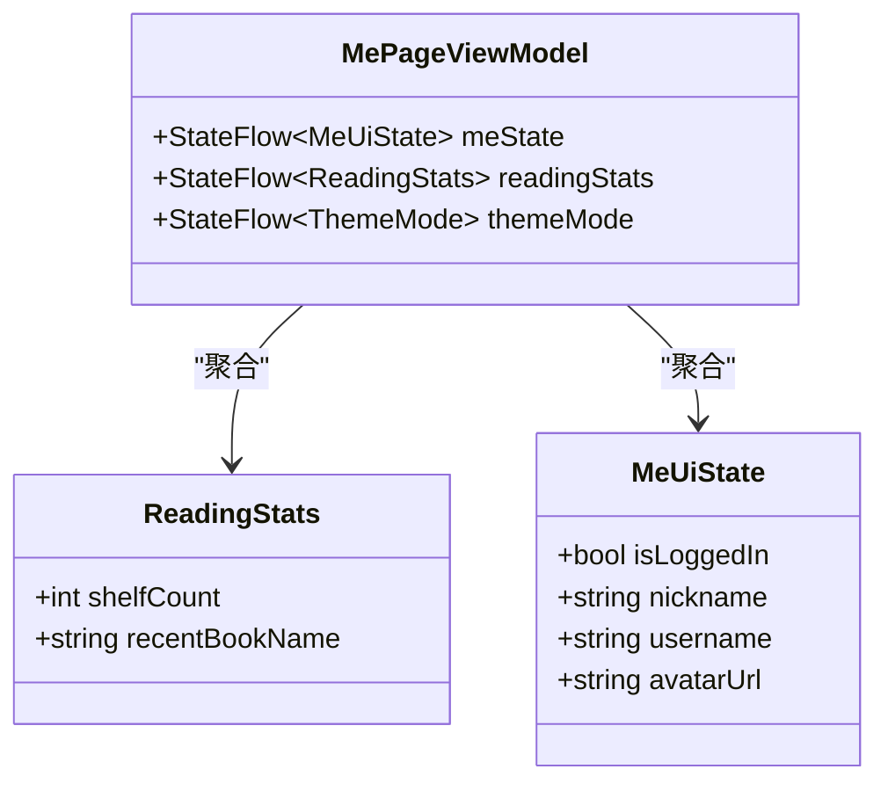
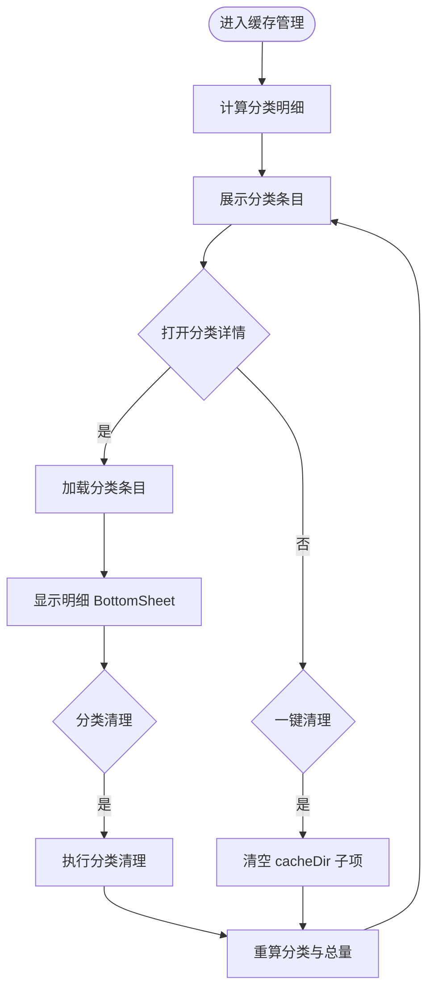
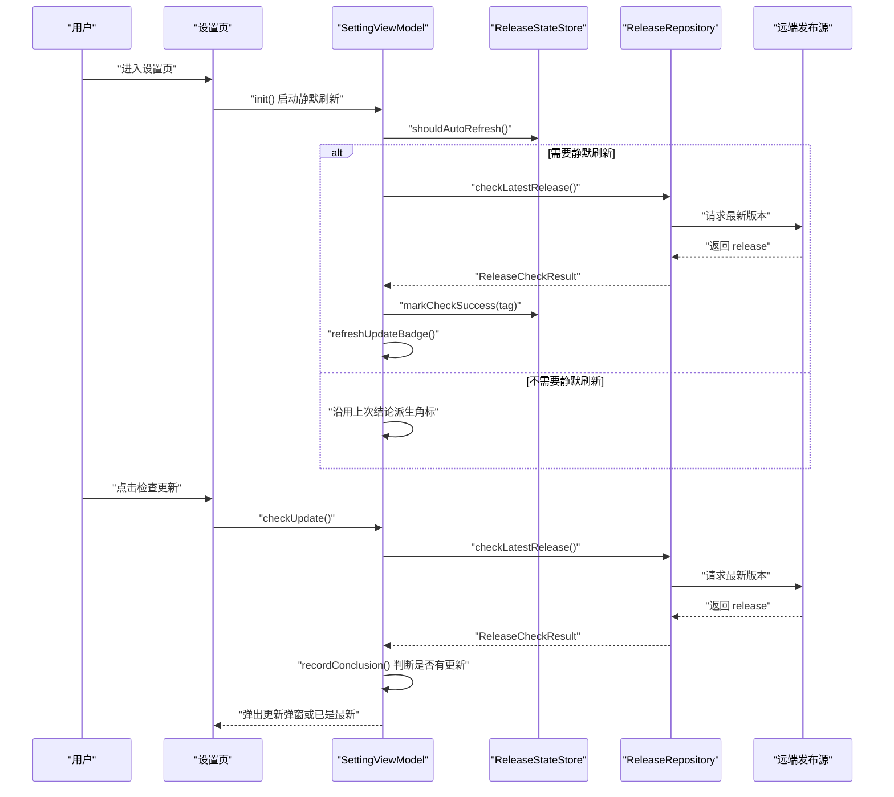
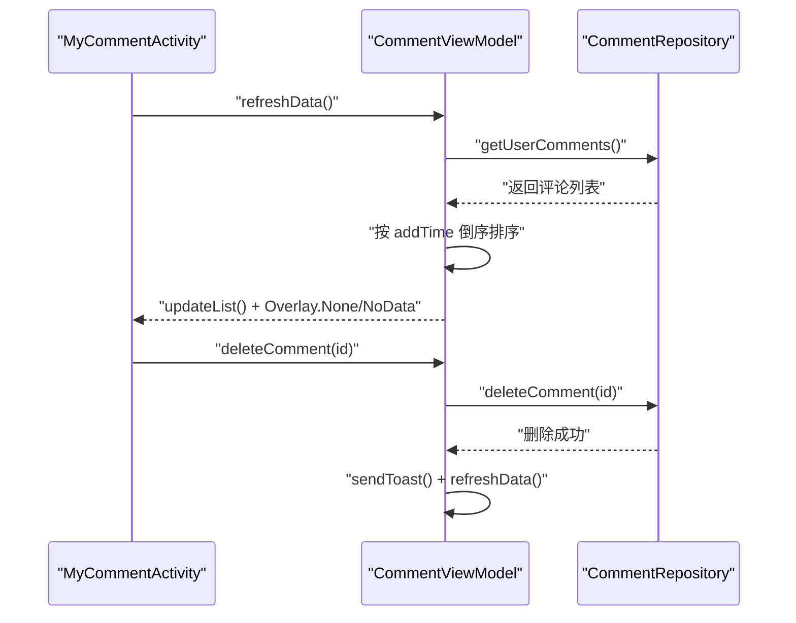
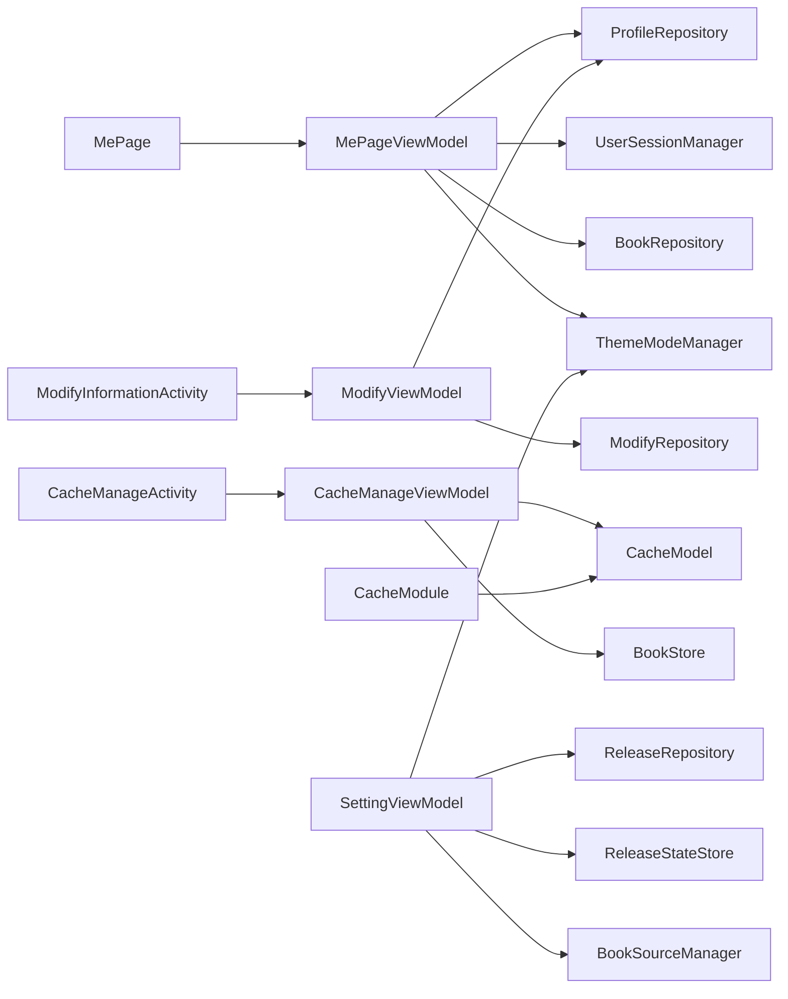

# 个人中心模块 (module_me)

<cite>
**本文引用的文件**   
- [MePage.kt](file://module_me/src/main/java/com/ebook/me/page/MePage.kt)
- [MeProvider.kt](file://module_me/src/main/java/com/ebook/me/provider/MeProvider.kt)
- [MePageViewModel.kt](file://module_me/src/main/java/com/ebook/me/mvvm/viewmodel/MePageViewModel.kt)
- [ModifyInformationActivity.kt](file://module_me/src/main/java/com/ebook/me/view/ModifyInformationActivity.kt)
- [ModifyViewModel.kt](file://module_me/src/main/java/com/ebook/me/mvvm/viewmodel/ModifyViewModel.kt)
- [ModifyRepository.kt](file://module_me/src/main/java/com/ebook/me/repository/ModifyRepository.kt)
- [CacheManageActivity.kt](file://module_me/src/main/java/com/ebook/me/view/CacheManageActivity.kt)
- [CacheManageViewModel.kt](file://module_me/src/main/java/com/ebook/me/mvvm/viewmodel/CacheManageViewModel.kt)
- [CacheModel.kt](file://module_me/src/main/java/com/ebook/me/repository/CacheModel.kt)
- [CacheModule.kt](file://module_me/src/main/java/com/ebook/me/di/CacheModule.kt)
- [SettingViewModel.kt](file://module_me/src/main/java/com/ebook/me/mvvm/viewmodel/SettingViewModel.kt)
- [ReleaseRepository.kt](file://module_me/src/main/java/com/ebook/me/repository/ReleaseRepository.kt)
- [ReleaseStateStore.kt](file://module_me/src/main/java/com/ebook/me/repository/ReleaseStateStore.kt)
- [AppVersion.kt](file://module_me/src/main/java/com/ebook/me/util/AppVersion.kt)
- [AboutActivity.kt](file://module_me/src/main/java/com/ebook/me/view/AboutActivity.kt)
- [CommentViewModel.kt](file://module_me/src/main/java/com/ebook/me/mvvm/viewmodel/CommentViewModel.kt)
</cite>

## 目录
1. [简介](#简介)
2. [项目结构](#项目结构)
3. [核心组件](#核心组件)
4. [架构总览](#架构总览)
5. [详细组件分析](#详细组件分析)
6. [依赖关系分析](#依赖关系分析)
7. [性能与复杂度](#性能与复杂度)
8. [故障排查指南](#故障排查指南)
9. [结论](#结论)
10. [附录：扩展方式与自定义配置](#附录扩展方式与自定义配置)

## 简介
module_me 是阅读类 App 的“个人中心”模块，提供用户信息管理、阅读概览、缓存管理、关于页、版本更新检查、主题设置、评论查看等能力。页面以 Compose 为主，状态由 Hilt 注入的 ViewModel 统一管理；跨模块导航通过 TheRouter，业务数据则委托给 lib_ebook_api 提供的网络接口以及 lib_book_common/lib_ebook_db 提供的本地仓库。

本模块的关键设计点包括：
- 将个人资料展示、头像上传、昵称修改等逻辑从页面收敛到 ModifyViewModel 与 ModifyRepository。
- 把书架藏书数、最近在读等阅读统计放在 MePageViewModel，直接读取 BookRepository，无需登录也能展示。
- 用 CacheModel + CacheManageViewModel 实现缓存大小计算、分类明细与清理，并把书籍内容占用作为只读指标展示。
- 将更新检查拆分为 ReleaseRepository（远端策略）、ReleaseStateStore（本地限频与结论持久化）和 SettingViewModel（UI 编排）。
- 使用 ThemeModeManager 统一外观主题模式，让我的页头部渐变与设置页选择保持单一事实源。

## 项目结构
module_me 按功能域分层组织：
- page：Compose 页面入口，如 MePage。
- view：传统 Activity + Compose Screen，如编辑资料、缓存管理、关于、文档等。
- mvvm/viewmodel：页面级 ViewModel，负责 UI 状态与异步流程编排。
- repository：模块内仓储与领域模型，如缓存计算、更新检查、资料修改。
- di：Hilt 模块，负责注入 CacheModel 等对象。
- provider：TheRouter SPI，暴露 IMeProvider。
- util：版本号解析、归一化等工具。

```mermaid
graph TB
    subgraph "页面层"
        MP["MePage<br/>我的主页"]
        MI["ModifyInformationActivity<br/>编辑资料"]
        CM["CacheManageActivity<br/>缓存管理"]
        AB["AboutActivity<br/>关于"]
    end

    subgraph "ViewModel 层"
        MPVM["MePageViewModel"]
        MVVM["ModifyViewModel"]
        CVM["CacheManageViewModel"]
        SVM["SettingViewModel"]
        CVMV["CommentViewModel"]
    end

    subgraph "仓储与工具层"
        MR["ModifyRepository"]
        RM["ReleaseRepository"]
        RS["ReleaseStateStore"]
        CA["CacheModel"]
        AV["AppVersion"]
    end

    subgraph "外部依赖"
        BR["BookRepository"]
        PR["ProfileRepository"]
        USM["UserSessionManager"]
        TMM["ThemeModeManager"]
        API["lib_ebook_api 服务"]
    end

    MP --> MPVM
    MI --> MVVM
    CM --> CVM
    AB --> SVM
    MPVM --> BR
    MPVM --> PR
    MPVM --> USM
    MPVM --> TMM
    MVVM --> MR
    CVM --> CA
    SVM --> RM
    SVM --> RS
    SVM --> TMM
    RM --> API
    RS --> AV
```

**图表来源**
- [MePage.kt:1-200](file://module_me/src/main/java/com/ebook/me/page/MePage.kt#L1-L200)
- [MePageViewModel.kt:1-119](file://module_me/src/main/java/com/ebook/me/mvvm/viewmodel/MePageViewModel.kt#L1-L119)
- [ModifyInformationActivity.kt:1-200](file://module_me/src/main/java/com/ebook/me/view/ModifyInformationActivity.kt#L1-L200)
- [ModifyViewModel.kt:1-126](file://module_me/src/main/java/com/ebook/me/mvvm/viewmodel/ModifyViewModel.kt#L1-L126)
- [CacheManageActivity.kt:1-200](file://module_me/src/main/java/com/ebook/me/view/CacheManageActivity.kt#L1-L200)
- [CacheManageViewModel.kt:1-196](file://module_me/src/main/java/com/ebook/me/mvvm/viewmodel/CacheManageViewModel.kt#L1-L196)
- [ReleaseRepository.kt:1-126](file://module_me/src/main/java/com/ebook/me/repository/ReleaseRepository.kt#L1-L126)
- [ReleaseStateStore.kt:1-129](file://module_me/src/main/java/com/ebook/me/repository/ReleaseStateStore.kt#L1-L129)
- [AppVersion.kt:1-87](file://module_me/src/main/java/com/ebook/me/util/AppVersion.kt#L1-L87)

**章节来源**
- [MePage.kt:1-200](file://module_me/src/main/java/com/ebook/me/page/MePage.kt#L1-L200)
- [MeProvider.kt:1-20](file://module_me/src/main/java/com/ebook/me/provider/MeProvider.kt#L1-L20)

## 核心组件
- MePage 与 MePageViewModel：我的主页展示头像、昵称、账号名、阅读概览与功能菜单，并处理登录跳转、评论、资料、设置等导航。
- ModifyInformationActivity 与 ModifyViewModel：编辑资料、头像裁剪与上传、昵称修改。
- CacheManageActivity 与 CacheManageViewModel：缓存分类统计、明细 BottomSheet、分类清理与全量清理。
- SettingViewModel：主题设置、书源数量展示、退出登录、版本更新检查与角标派生。
- CommentViewModel：当前用户章节评论拉取、排序与删除。
- AboutActivity：应用信息卡、协议与许可入口、动态版本展示。

**章节来源**
- [MePageViewModel.kt:1-119](file://module_me/src/main/java/com/ebook/me/mvvm/viewmodel/MePageViewModel.kt#L1-L119)
- [ModifyViewModel.kt:1-126](file://module_me/src/main/java/com/ebook/me/mvvm/viewmodel/ModifyViewModel.kt#L1-L126)
- [CacheManageViewModel.kt:1-196](file://module_me/src/main/java/com/ebook/me/mvvm/viewmodel/CacheManageViewModel.kt#L1-L196)
- [SettingViewModel.kt:1-360](file://module_me/src/main/java/com/ebook/me/mvvm/viewmodel/SettingViewModel.kt#L1-L360)
- [CommentViewModel.kt:1-71](file://module_me/src/main/java/com/ebook/me/mvvm/viewmodel/CommentViewModel.kt#L1-L71)
- [AboutActivity.kt:1-200](file://module_me/src/main/java/com/ebook/me/view/AboutActivity.kt#L1-L200)

## 架构总览
个人中心采用 MVVM + Compose 架构：
- 页面仅订阅 StateFlow 与发起动作。
- ViewModel 组合仓库、管理器与外部单例，产出 UI 状态。
- Repository 封装网络、文件系统或 SharedPreferences。
- Hilt 注入依赖；TheRouter 负责跨模块路由。

```mermaid
sequenceDiagram
    participant User as "用户"
    participant Page as "MePage"
    participant VM as "MePageViewModel"
    participant PR as "ProfileRepository"
    participant USM as "UserSessionManager"
    participant BR as "BookRepository"
    participant Router as "TheRouter"

    User->>Page: "打开个人中心"
    Page->>VM: "collect meState / readingStats / themeMode"
    VM->>USM: "观察 isLoggedIn / currentUser"
    VM->>PR: "观察 nickname / pictureUrl"
    VM->>BR: "observeBookShelf()"
    USM-->>VM: "登录态与用户信息流"
    PR-->>VM: "资料流"
    BR-->>VM: "书架列表流"
    VM-->>Page: "合并后的 UI 状态"
    User->>Page: "点击编辑资料"
    Page->>Router: "build(Me.MODIFY_PATH).navigation()"
```

**图表来源**
- [MePage.kt:1-200](file://module_me/src/main/java/com/ebook/me/page/MePage.kt#L1-L200)
- [MePageViewModel.kt:1-119](file://module_me/src/main/java/com/ebook/me/mvvm/viewmodel/MePageViewModel.kt#L1-L119)

## 详细组件分析

### 用户信息管理界面
#### 功能范围
- 个人资料展示：昵称、头像 URL、账号名。
- 头像上传：拍照或相册选择 → 圆形裁剪 → 上传头像 → 更新资料。
- 昵称修改：提交新昵称，成功后刷新 ProfileRepository 并返回上一页。
- 账户设置入口：在设置页中进行主题、书源、缓存、版本更新、退出登录等操作。

#### 关键流程

```mermaid
flowchart TD
    Start(["进入编辑资料"]) --> ShowProfile["显示昵称与头像"]
    ShowProfile --> ChooseAction{"操作类型"}
    ChooseAction -->|修改昵称| InputNickname["输入新昵称"]
    InputNickname --> SubmitNick["调用 modifyNickname"]
    SubmitNick --> NickResult{"成功？"}
    NickResult -->|是| RefreshProfile["更新 ProfileRepository"]
    RefreshProfile --> Finish["关闭页面"]
    NickResult -->|否| ToastFail["发送失败提示"]
    ChooseAction -->|修改头像| PickImage["拍照或相册选择"]
    PickImage --> CropImage["圆形裁剪"]
    CropImage --> UploadAvatar["上传头像并更新资料"]
    UploadAvatar --> AvatarResult{"成功？"}
    AvatarResult -->|是| UpdatePicture["更新头像 URL"]
    UpdatePicture --> Finish
    AvatarResult -->|否| ToastFail
```

**图表来源**
- [ModifyInformationActivity.kt:1-200](file://module_me/src/main/java/com/ebook/me/view/ModifyInformationActivity.kt#L1-L200)
- [ModifyViewModel.kt:1-126](file://module_me/src/main/java/com/ebook/me/mvvm/viewmodel/ModifyViewModel.kt#L1-L126)
- [ModifyRepository.kt:1-82](file://module_me/src/main/java/com/ebook/me/repository/ModifyRepository.kt#L1-L82)

#### 实现要点
- 头像选择使用 Android 13+ 的 `PickVisualMedia`，避免权限问题；拍照输出到私有临时文件，避免重复生成。
- 裁剪结果 Uri 通过 `ActivityResultContracts.StartActivityForResult` 回传至 ViewModel。
- 昵称与头像修改共用提交闸门，防止重复 PUT 与重复提示。
- 失败统一走 `reportFailure`，会话过期时不重复提示，由全局逻辑接管。

**章节来源**
- [ModifyInformationActivity.kt:1-200](file://module_me/src/main/java/com/ebook/me/view/ModifyInformationActivity.kt#L1-L200)
- [ModifyViewModel.kt:1-126](file://module_me/src/main/java/com/ebook/me/mvvm/viewmodel/ModifyViewModel.kt#L1-L126)
- [ModifyRepository.kt:1-82](file://module_me/src/main/java/com/ebook/me/repository/ModifyRepository.kt#L1-L82)

### 阅读统计功能
#### 数据来源
- 我的书架藏书数与最近在读来自 `BookRepository.observeBookShelf()`，按 `finalDate` 倒序，第一个即为最近在读。
- 这些是本地 Room 数据，与登录态无关，未登录用户也可看到阅读概览。

#### 状态模型
- `ReadingStats`：包含书架藏书数和最近在读书名。
- `MeUiState`：包含是否登录、昵称、用户名、头像 URL。

#### 展示逻辑
- MePage 收集 `readingStats` 并渲染阅读概览卡片。
- 若书架为空，最近在读为 null，UI 可降级为无最近在读提示。

```mermaid
classDiagram
    class ReadingStats {
        +int shelfCount
        +string recentBookName
    }
    class MeUiState {
        +bool isLoggedIn
        +string nickname
        +string username
        +string avatarUrl
    }
    class MePageViewModel {
        +StateFlow~MeUiState~ meState
        +StateFlow~ReadingStats~ readingStats
        +StateFlow~ThemeMode~ themeMode
    }
    MePageViewModel --> ReadingStats : "聚合"
    MePageViewModel --> MeUiState : "聚合"
```

**图表来源**
- [MePageViewModel.kt:1-119](file://module_me/src/main/java/com/ebook/me/mvvm/viewmodel/MePageViewModel.kt#L1-L119)

**章节来源**
- [MePage.kt:1-200](file://module_me/src/main/java/com/ebook/me/page/MePage.kt#L1-L200)
- [MePageViewModel.kt:1-119](file://module_me/src/main/java/com/ebook/me/mvvm/viewmodel/MePageViewModel.kt#L1-L119)

### 缓存管理功能
#### 分类定义
- IMAGE：Coil 图片缓存目录及老版本 Glide 残留目录。
- TEMP：cacheDir 根目录下的松散文件，例如头像裁剪产物。
- OTHER：除图片缓存外的其余子目录。

#### 核心能力
- 计算缓存总量与分类明细。
- 分类明细 BottomSheet：按大小降序展示目录或文件。
- 分类清理与一键清理：带加载遮罩与防连点闸门。
- 书籍内容占用与册数：只读展示，不参与清理。

```mermaid
flowchart TD
    Enter(["进入缓存管理"]) --> LoadBreakdown["计算分类明细"]
    LoadBreakdown --> ShowList["展示分类条目"]
    ShowList --> OpenDetail{"打开分类详情"}
    OpenDetail -->|是| LoadEntries["加载分类条目"]
    LoadEntries --> DetailSheet["显示明细 BottomSheet"]
    DetailSheet --> ClearCategory{"分类清理"}
    ClearCategory -->|是| ClearImpl["执行分类清理"]
    ClearImpl --> Refresh["重算分类与总量"]
    Refresh --> ShowList
    OpenDetail -->|否| ClearAll{"一键清理"}
    ClearAll -->|是| ClearAllImpl["清空 cacheDir 子项"]
    ClearAllImpl --> Refresh
```

**图表来源**
- [CacheManageViewModel.kt:1-196](file://module_me/src/main/java/com/ebook/me/mvvm/viewmodel/CacheManageViewModel.kt#L1-L196)
- [CacheModel.kt:1-144](file://module_me/src/main/java/com/ebook/me/repository/CacheModel.kt#L1-L144)

**章节来源**
- [CacheManageActivity.kt:1-200](file://module_me/src/main/java/com/ebook/me/view/CacheManageActivity.kt#L1-L200)
- [CacheManageViewModel.kt:1-196](file://module_me/src/main/java/com/ebook/me/mvvm/viewmodel/CacheManageViewModel.kt#L1-L196)
- [CacheModel.kt:1-144](file://module_me/src/main/java/com/ebook/me/repository/CacheModel.kt#L1-L144)
- [CacheModule.kt:1-27](file://module_me/src/main/java/com/ebook/me/di/CacheModule.kt#L1-L27)

### 关于页面与版本信息
#### 关于页
- 展示应用图标、名称、版本号与标语。
- 跳转到文档页与开源许可页。
- 动态读取 PackageManager 中的版本信息。

#### 版本更新检查
- 主动检查：用户点击检查更新后立即请求远端最新版本。
- 静默检查：进入设置页且距上次成功检查 ≥7 天，则静默刷新角标。
- 结果弹窗：发现新版本时弹出更新说明与下载入口。
- 角标派生：根据上次检查到的 tag 与本地 versionName 现场比较。

```mermaid
sequenceDiagram
    participant User as "用户"
    participant Settings as "设置页"
    participant VM as "SettingViewModel"
    participant Store as "ReleaseStateStore"
    participant Repo as "ReleaseRepository"
    participant API as "远端发布源"

    User->>Settings: "进入设置页"
    Settings->>VM: "init() 启动静默刷新"
    VM->>Store: "shouldAutoRefresh()"
    alt 需要静默刷新
        VM->>Repo: "checkLatestRelease()"
        Repo->>API: "请求最新版本"
        API-->>Repo: "返回 release"
        Repo-->>VM: "ReleaseCheckResult"
        VM->>Store: "markCheckSuccess(tag)"
        VM->>VM: "refreshUpdateBadge()"
    else 不需要静默刷新
        VM->>VM: "沿用上次结论派生角标"
    end
    User->>Settings: "点击检查更新"
    Settings->>VM: "checkUpdate()"
    VM->>Repo: "checkLatestRelease()"
    Repo->>API: "请求最新版本"
    API-->>Repo: "返回 release"
    Repo-->>VM: "ReleaseCheckResult"
    VM->>VM: "recordConclusion() 判断是否有更新"
    VM-->>Settings: "弹出更新弹窗或已是最新"
```

**图表来源**
- [SettingViewModel.kt:1-360](file://module_me/src/main/java/com/ebook/me/mvvm/viewmodel/SettingViewModel.kt#L1-L360)
- [ReleaseRepository.kt:1-126](file://module_me/src/main/java/com/ebook/me/repository/ReleaseRepository.kt#L1-L126)
- [ReleaseStateStore.kt:1-129](file://module_me/src/main/java/com/ebook/me/repository/ReleaseStateStore.kt#L1-L129)
- [AppVersion.kt:1-87](file://module_me/src/main/java/com/ebook/me/util/AppVersion.kt#L1-L87)
- [AboutActivity.kt:1-200](file://module_me/src/main/java/com/ebook/me/view/AboutActivity.kt#L1-L200)

**章节来源**
- [AboutActivity.kt:1-200](file://module_me/src/main/java/com/ebook/me/view/AboutActivity.kt#L1-L200)
- [SettingViewModel.kt:1-360](file://module_me/src/main/java/com/ebook/me/mvvm/viewmodel/SettingViewModel.kt#L1-L360)
- [ReleaseRepository.kt:1-126](file://module_me/src/main/java/com/ebook/me/repository/ReleaseRepository.kt#L1-L126)
- [ReleaseStateStore.kt:1-129](file://module_me/src/main/java/com/ebook/me/repository/ReleaseStateStore.kt#L1-L129)
- [AppVersion.kt:1-87](file://module_me/src/main/java/com/ebook/me/util/AppVersion.kt#L1-L87)

### 评论查看功能
- 当前用户全部章节评论一次性拉取，按添加时间倒序展示。
- 删除评论后重新拉取全量，服务端为唯一数据源。
- 首屏失败时根据是否已存在数据决定空态与提示。

```mermaid
sequenceDiagram
    participant Page as "MyCommentActivity"
    participant VM as "CommentViewModel"
    participant Repo as "CommentRepository"

    Page->>VM: "refreshData()"
    VM->>Repo: "getUserComments()"
    Repo-->>VM: "返回评论列表"
    VM->>VM: "按 addTime 倒序排序"
    VM-->>Page: "updateList() + Overlay.None/NoData"
    Page->>VM: "deleteComment(id)"
    VM->>Repo: "deleteComment(id)"
    Repo-->>VM: "删除成功"
    VM->>VM: "sendToast() + refreshData()"
```

**图表来源**
- [CommentViewModel.kt:1-71](file://module_me/src/main/java/com/ebook/me/mvvm/viewmodel/CommentViewModel.kt#L1-L71)

**章节来源**
- [CommentViewModel.kt:1-71](file://module_me/src/main/java/com/ebook/me/mvvm/viewmodel/CommentViewModel.kt#L1-L71)

## 依赖关系分析
- MePage 通过 TheRouter 的 ServiceProvider 暴露给宿主，页面本身不持有路由上下文。
- MePageViewModel 直接注入 ProfileRepository、UserSessionManager、BookRepository、ThemeModeManager，避免页面散落多处状态访问。
- ModifyViewModel 依赖 ModifyRepository 与 ProfileRepository；ModifyRepository 封装头像上传与资料更新的网络契约。
- CacheManageViewModel 依赖 CacheModel 与 BookStore；CacheModel 只接 File 参数，便于纯 JVM 测试。
- SettingViewModel 依赖 ReleaseRepository、ReleaseStateStore、ThemeModeManager 与 BookSourceManager；版本比较逻辑集中在 AppVersion。
- CacheModule 是唯一向 Hilt 注入 CacheModel 的地方，确保分类规则在生产环境只以设备 cacheDir 为准。

```mermaid
graph LR
    MePage --> MePageViewModel
    MePageViewModel --> ProfileRepository
    MePageViewModel --> UserSessionManager
    MePageViewModel --> BookRepository
    MePageViewModel --> ThemeModeManager

    ModifyInformationActivity --> ModifyViewModel
    ModifyViewModel --> ModifyRepository
    ModifyViewModel --> ProfileRepository

    CacheManageActivity --> CacheManageViewModel
    CacheManageViewModel --> CacheModel
    CacheManageViewModel --> BookStore

    SettingViewModel --> ReleaseRepository
    SettingViewModel --> ReleaseStateStore
    SettingViewModel --> ThemeModeManager
    SettingViewModel --> BookSourceManager

    CacheModule --> CacheModel
```

**图表来源**
- [MeProvider.kt:1-20](file://module_me/src/main/java/com/ebook/me/provider/MeProvider.kt#L1-L20)
- [MePageViewModel.kt:1-119](file://module_me/src/main/java/com/ebook/me/mvvm/viewmodel/MePageViewModel.kt#L1-L119)
- [ModifyViewModel.kt:1-126](file://module_me/src/main/java/com/ebook/me/mvvm/viewmodel/ModifyViewModel.kt#L1-L126)
- [CacheManageViewModel.kt:1-196](file://module_me/src/main/java/com/ebook/me/mvvm/viewmodel/CacheManageViewModel.kt#L1-L196)
- [SettingViewModel.kt:1-360](file://module_me/src/main/java/com/ebook/me/mvvm/viewmodel/SettingViewModel.kt#L1-L360)
- [CacheModule.kt:1-27](file://module_me/src/main/java/com/ebook/me/di/CacheModule.kt#L1-L27)

**章节来源**
- [MeProvider.kt:1-20](file://module_me/src/main/java/com/ebook/me/provider/MeProvider.kt#L1-L20)
- [CacheModule.kt:1-27](file://module_me/src/main/java/com/ebook/me/di/CacheModule.kt#L1-L27)

## 性能与复杂度
- 阅读统计：`observeBookShelf()` 基于 Room 失效追踪，首次映射为 `ReadingStats`，后续自动推送变更；使用 `WhileSubscribed(5s)` 减少后台订阅开销。
- 缓存计算：`cacheBreakdown()` 一次遍历分类累加，避免差值法导致的负数与多趟扫描；所有 IO 操作切至 `Dispatchers.IO`。
- 版本检查：两发布源顺序 failover，取消异常原样抛出，避免备用源白打；角标每次现场派生，安装新版本后自动纠正。
- 头像上传：读取整个图片字节在 IO 线程执行，避免阻塞主线程；两步上传后更新资料，错误路径走资源文案提示。

[本节为通用性能讨论，不直接分析具体代码行]

## 故障排查指南
- 编辑资料无响应：检查 ModifyViewModel 的提交闸门与 Overlay.Loading 是否被正确复位；确认头像 URI 是否能被 `contentResolver` 读取。
- 头像上传失败：查看 ModifyRepository 的两步流程，确认 multipart 字段名与后端契约一致；检查返回 URL 是否为空。
- 缓存清理无效果：确认 CacheModel 的分类目录识别是否正确，特别是 image_cache 与 image_manager_disk_cache；检查 clearInProgress 闸门是否被其他清理任务占用。
- 版本检查无反馈：检查 SettingViewModel 的 checkJob 是否在弹窗关闭后被取消；确认 ReleaseRepository 的发布端点是否可达；查看 ReleaseStateStore 的 7 天限频是否阻止了静默刷新。
- 评论列表空态：区分会话过期与真正空数据，会话过期由 `reportFailure` 处理，不应重复提示；删除后应重新拉取全量。

**章节来源**
- [ModifyViewModel.kt:1-126](file://module_me/src/main/java/com/ebook/me/mvvm/viewmodel/ModifyViewModel.kt#L1-L126)
- [ModifyRepository.kt:1-82](file://module_me/src/main/java/com/ebook/me/repository/ModifyRepository.kt#L1-L82)
- [CacheManageViewModel.kt:1-196](file://module_me/src/main/java/com/ebook/me/mvvm/viewmodel/CacheManageViewModel.kt#L1-L196)
- [SettingViewModel.kt:1-360](file://module_me/src/main/java/com/ebook/me/mvvm/viewmodel/SettingViewModel.kt#L1-L360)
- [CommentViewModel.kt:1-71](file://module_me/src/main/java/com/ebook/me/mvvm/viewmodel/CommentViewModel.kt#L1-L71)

## 结论
module_me 以 MVVM + Compose 为核心，将个人中心的功能按页面职责清晰拆分：
- 用户信息管理由 ModifyViewModel 与 ModifyRepository 统一处理头像与昵称更新。
- 阅读统计直接消费本地书架数据，无需登录即可展示。
- 缓存管理通过 CacheModel 提供纯文件操作，ViewModel 专注状态与交互编排。
- 版本更新检查通过 ReleaseRepository、ReleaseStateStore 与 AppVersion 形成完整链路，支持静默刷新、角标派生与弹窗反馈。
- 主题模式由 ThemeModeManager 统一提供，保证我的页与设置页的一致性。

该模块具备良好的可测试性与可扩展性，适合继续增加新的个人相关功能。

[本节为总结性内容，不直接分析具体代码行]

## 附录：扩展方式与自定义配置
- 新增个人中心功能：
  - 在 page 或 view 下新增 Compose 页面或 Activity。
  - 新增对应 ViewModel，使用 Hilt 注入所需仓库与管理器。
  - 如需本地文件或缓存，参考 CacheModel 的 File 注入方式，并通过 DI Module 提供。
- 扩展版本检查：
  - 可在 ReleaseRepository 中增加新的发布端点，但需遵循“先 GitHub 后 Gitcode”的顺序语义。
  - 版本号规约由 AppVersion 解析，新增 tag 形态需兼容正则约束。
- 扩展缓存分类：
  - 在 CacheType 中添加新枚举，并在 CacheModel 的分类与清理逻辑中补齐对应行为。
  - 同步更新 CacheManageViewModel 的分类标题与 UI 展示。
- 扩展主题设置：
  - 通过 ThemeModeManager 的 setThemeMode 写入主题模式，页面通过 StateFlow 观察。
- 扩展用户资料字段：
  - 在 ModifyRepository 中新增资料更新接口，并在 ModifyViewModel 中组合 ProfileRepository 的流。

[本节为概念性扩展指导，不直接分析具体代码行]