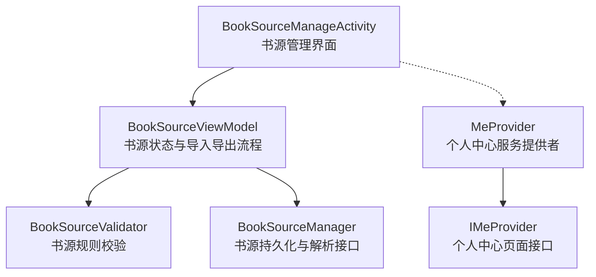
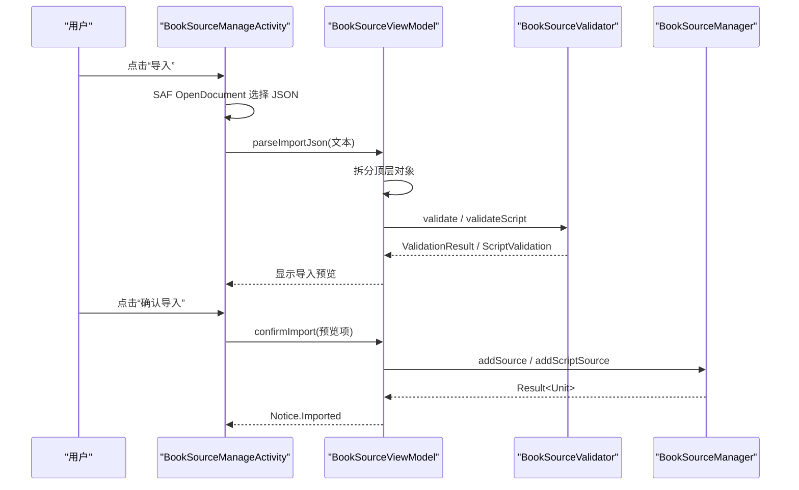
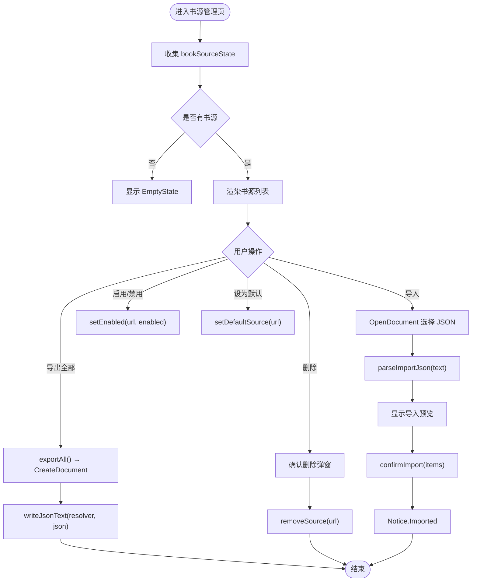
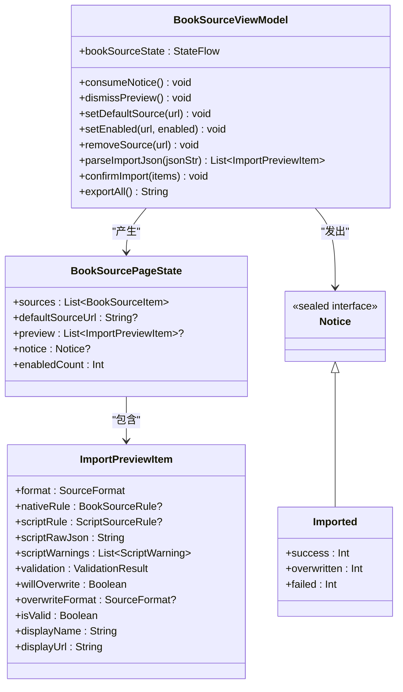
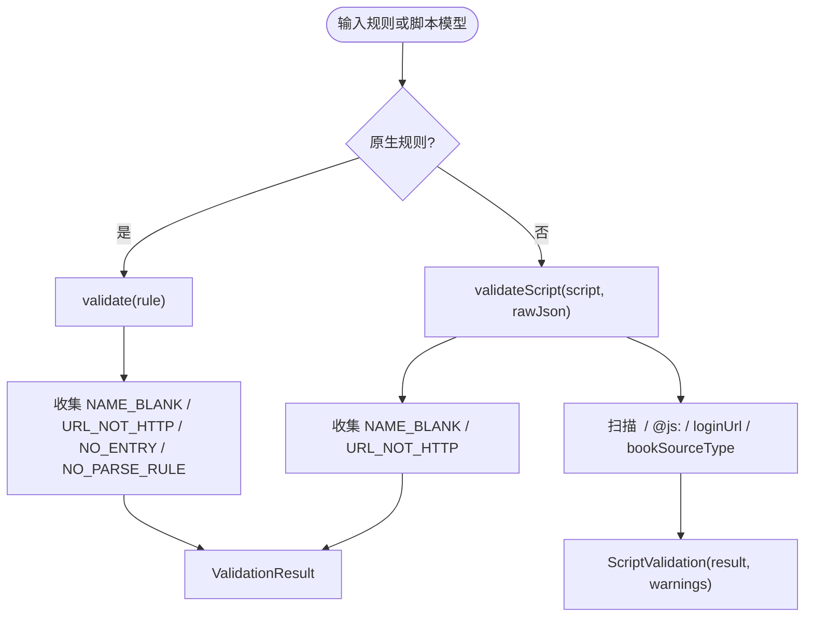
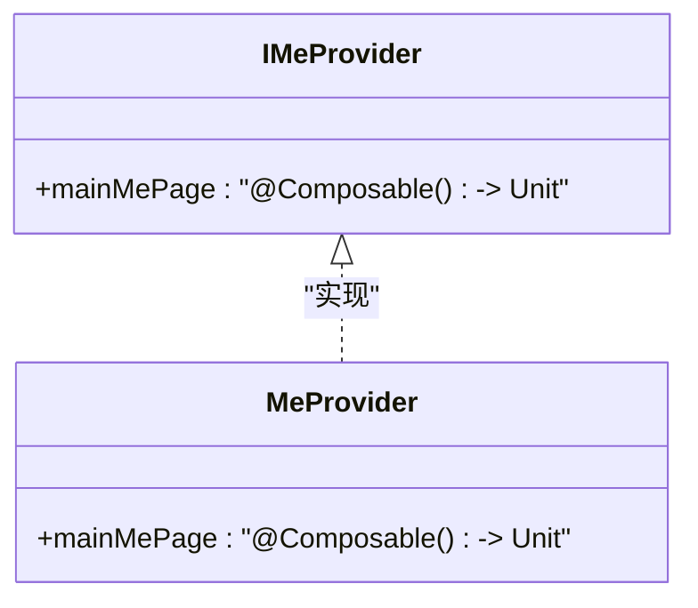
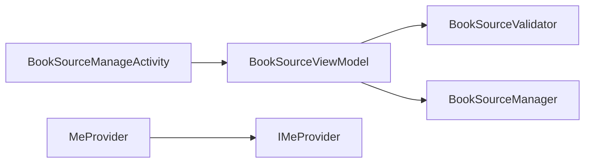
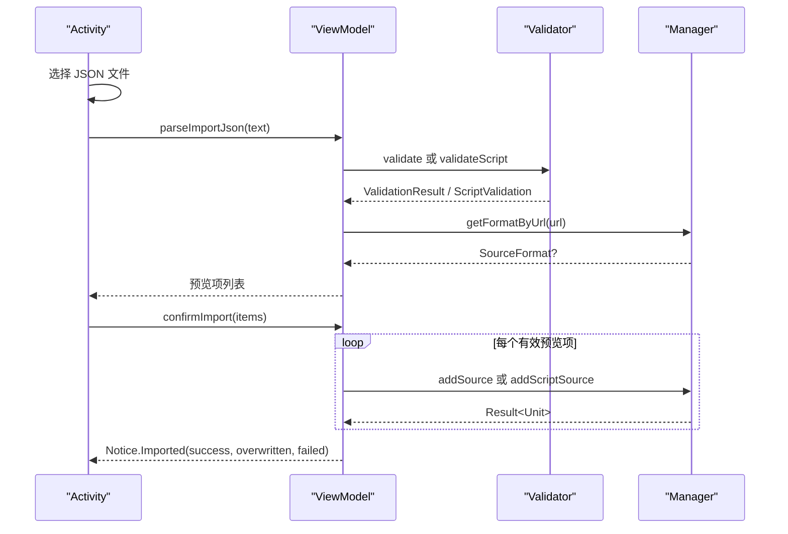

# 书源管理功能

<cite>
**本文引用的文件**   
- [BookSourceManageActivity.kt](file://module_me/src/main/java/com/ebook/me/view/BookSourceManageActivity.kt)
- [BookSourceViewModel.kt](file://module_me/src/main/java/com/ebook/me/mvvm/viewmodel/BookSourceViewModel.kt)
- [BookSourceValidator.kt](file://module_me/src/main/java/com/ebook/me/domain/BookSourceValidator.kt)
- [MeProvider.kt](file://module_me/src/main/java/com/ebook/me/provider/MeProvider.kt)
- [IMeProvider.kt](file://lib_book_common/src/main/java/com/ebook/common/provider/IMeProvider.kt)
- [BookSourceManager.kt](file://lib_book_common/src/main/java/com/ebook/common/analyze/source/BookSourceManager.kt)
- [BookSourceValidatorTest.kt](file://module_me/src/test/java/com/ebook/me/domain/BookSourceValidatorTest.kt)
- [strings.xml](file://module_me/src/main/res/values/strings.xml)
</cite>

## 目录
1. [简介](#简介)
2. [项目结构中的定位](#项目结构中的定位)
3. [核心组件](#核心组件)
4. [架构总览](#架构总览)
5. [详细组件分析](#详细组件分析)
6. [依赖关系分析](#依赖关系分析)
7. [性能与并发特性](#性能与并发特性)
8. [完整操作流程示例](#完整操作流程示例)
9. [错误处理策略](#错误处理策略)
10. [故障排查指南](#故障排查指南)
11. [结论](#结论)

## 简介
本文件围绕“书源管理”这一用户能力，系统梳理界面层、业务状态层、校验层和跨模块服务层。重点覆盖：
- 书源列表的展示、启用/禁用、设为默认、删除；
- JSON 导入、预览、确认落库与导出；
- 原生规则书源与脚本书源的差异化处理；
- 书源规则的结构校验与安全警示；
- 个人中心模块对外暴露的页面级服务接口。

## 项目结构中的定位
书源管理功能横跨两个模块：
- `module_me`：负责“我的”页入口、书源管理界面、视图模型、领域校验逻辑与服务提供者实现。
- `lib_book_common`：提供书源持久化与管理器抽象，是其他模块访问书源数据与解析能力的唯一入口。

**图表来源**
- [BookSourceManageActivity.kt:1-200](file://module_me/src/main/java/com/ebook/me/view/BookSourceManageActivity.kt#L1-L200)
- [BookSourceViewModel.kt:1-200](file://module_me/src/main/java/com/ebook/me/mvvm/viewmodel/BookSourceViewModel.kt#L1-L200)
- [BookSourceValidator.kt:1-198](file://module_me/src/main/java/com/ebook/me/domain/BookSourceValidator.kt#L1-L198)
- [BookSourceManager.kt:1-200](file://lib_book_common/src/main/java/com/ebook/common/analyze/source/BookSourceManager.kt#L1-L200)
- [MeProvider.kt:1-20](file://module_me/src/main/java/com/ebook/me/provider/MeProvider.kt#L1-L20)
- [IMeProvider.kt:1-13](file://lib_book_common/src/main/java/com/ebook/common/provider/IMeProvider.kt#L1-L13)

**章节来源**
- [BookSourceManageActivity.kt:1-200](file://module_me/src/main/java/com/ebook/me/view/BookSourceManageActivity.kt#L1-L200)
- [BookSourceViewModel.kt:1-200](file://module_me/src/main/java/com/ebook/me/mvvm/viewmodel/BookSourceViewModel.kt#L1-L200)
- [BookSourceManager.kt:1-200](file://lib_book_common/src/main/java/com/ebook/common/analyze/source/BookSourceManager.kt#L1-L200)
- [MeProvider.kt:1-20](file://module_me/src/main/java/com/ebook/me/provider/MeProvider.kt#L1-L20)
- [IMeProvider.kt:1-13](file://lib_book_common/src/main/java/com/ebook/common/provider/IMeProvider.kt#L1-L13)

## 核心组件
| 组件 | 职责 | 关键输入/输出 | 重要约束 |
|---|---|---|---|
| BookSourceManageActivity | 书源列表 UI、导入/导出 SAF 交互、操作弹层、一次性提示消费 | 列表项、URL、启用状态、预览项 | 所有 SAF 读写在 IO 线程；Toast 由组合后一次性消费 |
| BookSourceViewModel | 书源清单状态流、导入解析、预览、确认落库、默认源与开关、删除 | 原始 JSON、URL、预览项列表 | 不直连 DAO，统一走 BookSourceManager；失败通过 reportFailure 或 Notice |
| BookSourceValidator | 原生四规则校验、脚本两条有效性 + 三项安全警示 | BookSourceRule / ScriptSourceRule + 原文 | 纯函数、无 Android 依赖；只判结构，不做连通性测试 |
| MeProvider | 把个人中心主页面作为 Composable 暴露给宿主 | 空参数 → Composable 页面 | 每次组合创建新实例，ViewModel 作用域由宿主 NavHost 决定 |
| IMeProvider | 个人中心模块对外 SPI 接口 | mainMePage | 宿主 module_main 通过 TheRouter SPI 获取 |
| BookSourceManager | 书源表唯一读写面、观察清单与默认源、按 URL 查格式、聚合搜索 | Flow<Result>、List、Parser | 应用不随包携带书源；默认源与清单真值只在 Room |

**章节来源**
- [BookSourceManageActivity.kt:1-200](file://module_me/src/main/java/com/ebook/me/view/BookSourceManageActivity.kt#L1-L200)
- [BookSourceViewModel.kt:1-200](file://module_me/src/main/java/com/ebook/me/mvvm/viewmodel/BookSourceViewModel.kt#L1-L200)
- [BookSourceValidator.kt:1-198](file://module_me/src/main/java/com/ebook/me/domain/BookSourceValidator.kt#L1-L198)
- [MeProvider.kt:1-20](file://module_me/src/main/java/com/ebook/me/provider/MeProvider.kt#L1-L20)
- [IMeProvider.kt:1-13](file://lib_book_common/src/main/java/com/ebook/common/provider/IMeProvider.kt#L1-L13)
- [BookSourceManager.kt:1-200](file://lib_book_common/src/main/java/com/ebook/common/analyze/source/BookSourceManager.kt#L1-L200)

## 架构总览
书源管理采用 MVVM 分层：UI 层只持有状态和回调；业务状态集中在 ViewModel；领域校验放在纯 Kotlin domain 层；数据与解析能力封装在 BookSourceManager。

**图表来源**
- [BookSourceManageActivity.kt:1-200](file://module_me/src/main/java/com/ebook/me/view/BookSourceManageActivity.kt#L1-L200)
- [BookSourceViewModel.kt:201-477](file://module_me/src/main/java/com/ebook/me/mvvm/viewmodel/BookSourceViewModel.kt#L201-L477)
- [BookSourceValidator.kt:1-198](file://module_me/src/main/java/com/ebook/me/domain/BookSourceValidator.kt#L1-L198)
- [BookSourceManager.kt:1-200](file://lib_book_common/src/main/java/com/ebook/common/analyze/source/BookSourceManager.kt#L1-L200)

## 详细组件分析

### BookSourceManageActivity：书源列表与操作界面
该 Activity 是书源管理的用户入口，承担以下职责：
- 使用 StateFlow 订阅 BookSourceViewModel 的状态，渲染汇总行、列表、空态。
- 顶部导入/导出按钮不在 Toolbar，而是自绘一行以兼容基类布局限制。
- 通过 ActivityResultContracts 调用 SAF 打开/创建文档，完成 JSON 导入与导出。
- 对每条书源提供长按/点击打开操作菜单：设为默认、导出该书源、删除。
- 将一次性 Toast 文案从状态中取出后立即消费，避免重组重复弹出。

界面行为要点：
- 列表 key 使用 URL，因为它是主键且唯一。
- 脚本书源行不显示“导出该书源”，因为当前脚本行的规则是展示用空壳，无法导出有效规则文件。
- 设为默认时不先检查是否已启用，因为底层默认源设置会顺带启用目标源。
- 删除确认弹层在操作菜单关闭后才出现，避免误删。

**图表来源**
- [BookSourceManageActivity.kt:1-200](file://module_me/src/main/java/com/ebook/me/view/BookSourceManageActivity.kt#L1-L200)
- [BookSourceManageActivity.kt:201-539](file://module_me/src/main/java/com/ebook/me/view/BookSourceManageActivity.kt#L201-L539)
- [BookSourceViewModel.kt:201-477](file://module_me/src/main/java/com/ebook/me/mvvm/viewmodel/BookSourceViewModel.kt#L201-L477)

**章节来源**
- [BookSourceManageActivity.kt:1-200](file://module_me/src/main/java/com/ebook/me/view/BookSourceManageActivity.kt#L1-L200)
- [BookSourceManageActivity.kt:201-539](file://module_me/src/main/java/com/ebook/me/view/BookSourceManageActivity.kt#L201-L539)
- [strings.xml:83-137](file://module_me/src/main/res/values/strings.xml#L83-L137)

### BookSourceViewModel：书源状态管理与业务逻辑
BookSourceViewModel 是书源管理页的唯一可写入口，集中处理：
- 合并 BookSourceManager 的书源清单、默认源、本地预览与一次性提示，形成 BookSourcePageState。
- 处理导入解析：区分数组与单条对象，逐条判定原生规则或脚本规则，并查询是否覆盖已有 URL。
- 处理确认导入：仅写入校验通过的条目，统计成功、覆盖、失败数量。
- 处理启用/禁用、设为默认、删除。
- 处理导出：全部书源导出为 JSON 数组文本。

状态模型要点：
- BookSourcePageState.sources 包含禁用项，enabledCount 用于汇总文案。
- preview 是临时导入预览，dismissPreview 或由 confirmImport 收尾时清空。
- notice 是一次性语义通知，UI 消费后调用 consumeNotice 清零。

导入预览项 ImportPreviewItem 的关键不变式：
- format 决定 nativeRule 或 scriptRule 哪一侧有效。
- displayName/displayUrl 按 format 分支读取，避免构造点写错时借用另一侧字段。
- willOverwrite 与 overwriteFormat 在解析时计算，反映“是否覆盖以及被覆盖的出身”。

**图表来源**
- [BookSourceViewModel.kt:1-200](file://module_me/src/main/java/com/ebook/me/mvvm/viewmodel/BookSourceViewModel.kt#L1-L200)
- [BookSourceViewModel.kt:201-477](file://module_me/src/main/java/com/ebook/me/mvvm/viewmodel/BookSourceViewModel.kt#L201-L477)

**章节来源**
- [BookSourceViewModel.kt:1-200](file://module_me/src/main/java/com/ebook/me/mvvm/viewmodel/BookSourceViewModel.kt#L1-L200)
- [BookSourceViewModel.kt:201-477](file://module_me/src/main/java/com/ebook/me/mvvm/viewmodel/BookSourceViewModel.kt#L201-L477)

### BookSourceValidator：书源规则验证与安全警示
BookSourceValidator 是纯领域校验工具，不负责网络连通性，也不持有 Android 依赖。

原生规则四条校验：
1. 名称不能为空。
2. 地址必须以 http:// 或 https:// 开头（大小写不敏感）。
3. 搜索地址与发现页地址至少有一个非空白。
4. 搜索结果列表选择器与正文容器选择器都不能为空。

脚本书源两条有效性校验：
1. 名称不能为空。
2. 地址必须以 http:// 或 https:// 开头。

脚本书源三项安全警示（不阻止导入）：
- 含可执行代码：原文中出现 `<js>` 或 `@js:`。
- 需要登录：loginUrl 非空。
- 非文本源：bookSourceType 不为 0，即漫画或音频类。

结果类型设计：
- ValidationResult.Valid / Invalid(reasons)。
- ScriptValidation(result, warnings)，其中 isValid 派生自 result。
- ValidationReason 枚举不含文案，文案集中在 strings.xml。

**图表来源**
- [BookSourceValidator.kt:1-198](file://module_me/src/main/java/com/ebook/me/domain/BookSourceValidator.kt#L1-L198)

**章节来源**
- [BookSourceValidator.kt:1-198](file://module_me/src/main/java/com/ebook/me/domain/BookSourceValidator.kt#L1-L198)
- [BookSourceValidatorTest.kt:1-200](file://module_me/src/test/java/com/ebook/me/domain/BookSourceValidatorTest.kt#L1-L200)

### MeProvider 与 IMeProvider：跨模块书源服务接口
MeProvider 是个人中心模块的服务提供者实现，通过 TheRouter 的 ServiceProvider 注解注册。它不直接暴露书源管理能力，而是向外暴露一个 Composable 页面，供宿主模块组合到导航栈中。

IMeProvider 定义的是“个人中心页面级服务”边界：
- 返回 mainMePage 这个 Composable 工厂。
- 宿主通过该接口拿到个人中心页面，而不直接依赖 module_me 内部页面类。

因此，“跨模块书源服务接口”更准确的理解是：**个人中心模块通过 IMeProvider 暴露其页面入口，而书源管理页面位于该个人中心模块内**。真正的书源数据与解析能力仍由 lib_book_common 的 BookSourceManager 提供。

**图表来源**
- [IMeProvider.kt:1-13](file://lib_book_common/src/main/java/com/ebook/common/provider/IMeProvider.kt#L1-L13)
- [MeProvider.kt:1-20](file://module_me/src/main/java/com/ebook/me/provider/MeProvider.kt#L1-L20)

**章节来源**
- [MeProvider.kt:1-20](file://module_me/src/main/java/com/ebook/me/provider/MeProvider.kt#L1-L20)
- [IMeProvider.kt:1-13](file://lib_book_common/src/main/java/com/ebook/common/provider/IMeProvider.kt#L1-L13)

## 依赖关系分析
- Activity 依赖 ViewModel 的状态与命令，不直接依赖 DAO。
- ViewModel 依赖 BookSourceManager 作为唯一书源数据面，并依赖 BookSourceValidator 做结构校验。
- BookSourceValidator 依赖 lib_ebook_api 的规则数据类，但不依赖 Android。
- MeProvider 依赖 IMeProvider 接口，并由宿主通过路由 SPI 注入。

**图表来源**
- [BookSourceManageActivity.kt:1-200](file://module_me/src/main/java/com/ebook/me/view/BookSourceManageActivity.kt#L1-L200)
- [BookSourceViewModel.kt:1-200](file://module_me/src/main/java/com/ebook/me/mvvm/viewmodel/BookSourceViewModel.kt#L1-L200)
- [BookSourceValidator.kt:1-198](file://module_me/src/main/java/com/ebook/me/domain/BookSourceValidator.kt#L1-L198)
- [BookSourceManager.kt:1-200](file://lib_book_common/src/main/java/com/ebook/common/analyze/source/BookSourceManager.kt#L1-L200)
- [MeProvider.kt:1-20](file://module_me/src/main/java/com/ebook/me/provider/MeProvider.kt#L1-L20)
- [IMeProvider.kt:1-13](file://lib_book_common/src/main/java/com/ebook/common/provider/IMeProvider.kt#L1-L13)

**章节来源**
- [BookSourceManageActivity.kt:1-200](file://module_me/src/main/java/com/ebook/me/view/BookSourceManageActivity.kt#L1-L200)
- [BookSourceViewModel.kt:1-200](file://module_me/src/main/java/com/ebook/me/mvvm/viewmodel/BookSourceViewModel.kt#L1-L200)
- [BookSourceValidator.kt:1-198](file://module_me/src/main/java/com/ebook/me/domain/BookSourceValidator.kt#L1-L198)
- [BookSourceManager.kt:1-200](file://lib_book_common/src/main/java/com/ebook/common/analyze/source/BookSourceManager.kt#L1-L200)
- [MeProvider.kt:1-20](file://module_me/src/main/java/com/ebook/me/provider/MeProvider.kt#L1-L20)
- [IMeProvider.kt:1-13](file://lib_book_common/src/main/java/com/ebook/common/provider/IMeProvider.kt#L1-L13)

## 性能与并发特性
- 导入/导出文件读写在 Dispatchers.IO 中进行，避免 SAF 跨进程 ContentProvider 在主线程读整包 JSON 导致掉帧或 ANR。
- bookSourceState 使用 combine 合并多个流，并以 SharingStarted.Eagerly 启动，使冷流在 ViewModel 构造时就开始查询，首帧即可看到合并后的清单。
- 导入解析按首字符分派数组或单对象，避免异常回退导致的二次解析歧义。
- 默认源观察与清单观察分别来自 BookSourceManager，UI 只订阅一份合并后的状态流，减少分散 collect 带来的状态不一致风险。
- 聚合搜索等扩展能力在 BookSourceManager 中控制并发上限，但书源管理页本身不涉及高频网络请求。

**章节来源**
- [BookSourceManageActivity.kt:1-200](file://module_me/src/main/java/com/ebook/me/view/BookSourceManageActivity.kt#L1-L200)
- [BookSourceViewModel.kt:1-200](file://module_me/src/main/java/com/ebook/me/mvvm/viewmodel/BookSourceViewModel.kt#L1-L200)
- [BookSourceManager.kt:1-200](file://lib_book_common/src/main/java/com/ebook/common/analyze/source/BookSourceManager.kt#L1-L200)

## 完整操作流程示例

### 导入书源 JSON
1. 用户在 BookSourceManageActivity 点击“导入”。
2. Activity 通过 OpenDocument 拉起系统文件选择器，支持 application/json 与 text/plain。
3. 成功选择后，在 IO 协程中读取 UTF-8 文本；读取失败提示“无法读取所选文件”。
4. 调用 ViewModel.parseImportJson。
5. ViewModel 拆分顶层 JSON 对象，逐个识别原生规则或脚本规则。
6. 原生规则调用既有导入解码路径，并通过 BookSourceValidator.validate 做四条结构校验。
7. 脚本规则使用 SourceStorageJson 解码，并通过 BookSourceValidator.validateScript 做两条有效性校验与三项安全警示。
8. 每个预览项同时判断是否覆盖已有 URL，并记录被覆盖的出身。
9. 若无任何可读对象，提示“未能从该文件读出书源”。
10. 若有可读对象，显示导入预览弹层，允许用户查看通过/失败数量与覆盖标记。
11. 用户确认后，ViewModel.confirmImport 仅写入校验通过的条目。
12. 最终弹出导入结果统计：成功条数、覆盖条数、失败条数。

**图表来源**
- [BookSourceManageActivity.kt:1-200](file://module_me/src/main/java/com/ebook/me/view/BookSourceManageActivity.kt#L1-L200)
- [BookSourceViewModel.kt:201-477](file://module_me/src/main/java/com/ebook/me/mvvm/viewmodel/BookSourceViewModel.kt#L201-L477)
- [BookSourceValidator.kt:1-198](file://module_me/src/main/java/com/ebook/me/domain/BookSourceValidator.kt#L1-L198)
- [BookSourceManager.kt:1-200](file://lib_book_common/src/main/java/com/ebook/common/analyze/source/BookSourceManager.kt#L1-L200)

### 启用/禁用书源
- 用户在列表中拨动 Switch，Activity 调用 setEnabled。
- ViewModel 在协程中调用 BookSourceManager.setEnabled。
- 若底层写库异常，Manager 自身吞异常并记日志；由于清单来自 observeSources，未真正写入时开关会保持原状，比错误提示更贴近事实。

### 设为默认书源
- 用户通过操作菜单选择“设为默认”。
- ViewModel 调用 BookSourceManager.setDefaultSource。
- 该方法会对禁用源顺带启用，因此不需要先拨开关再设默认。
- 对库里不存在的 URL，Manager 静默忽略，ViewModel 不额外提示。

### 删除书源
- 用户打开操作菜单并选择删除，再次确认。
- ViewModel 调用 BookSourceManager.removeSource。
- 如果删除失败且清单里仍有该行，视为写库异常，走共享失败上报。
- 如果删除失败但清单里已经没有该行，则提示“该书源已不在清单中”。

### 导出书源
- 导出全部：ViewModel.exportAll 逐条调用 Manager.exportToJson，拼接成 JSON 数组文本；若无书源则返回空串，UI 提示“没有可导出的书源”。
- 导出单条：仅原生规则书源可用；脚本书源当前不提供单条导出，因为脚本行的规则是展示用空壳。
- 文件名清洗：去除非法字符、限制长度，追加日期后缀，避免 SAF 拒绝命名。

**章节来源**
- [BookSourceManageActivity.kt:1-200](file://module_me/src/main/java/com/ebook/me/view/BookSourceManageActivity.kt#L1-L200)
- [BookSourceManageActivity.kt:201-539](file://module_me/src/main/java/com/ebook/me/view/BookSourceManageActivity.kt#L201-L539)
- [BookSourceViewModel.kt:201-477](file://module_me/src/main/java/com/ebook/me/mvvm/viewmodel/BookSourceViewModel.kt#L201-L477)
- [strings.xml:83-137](file://module_me/src/main/res/values/strings.xml#L83-L137)

## 错误处理策略
| 场景 | 处理方式 | 用户可见表现 |
|---|---|---|
| SAF 读取失败 | 返回 null，Activity 捕获 | “无法读取所选文件” |
| JSON 不是对象或数组 | splitJsonObjects 返回空表 | “未能从该文件读出书源” |
| 原生规则解码失败 | 用 name/url 退化规则继续校验 | 报出名称为空、地址不合法、缺入口、缺解析规则 |
| 脚本规则解码失败 | 加 SCRIPT_UNPARSABLE，且不生成无依据的警示 | “脚本书源 JSON 无法解析” |
| 导入确认写库失败 | reportFailure 上报具体失败原因 | 共享失败机制，失败计入 failed 数量 |
| 删除失败但清单已不存在 | Notice.DeleteMissing | “该书源已不在清单中” |
| 设为默认 URL 不存在 | Manager 静默忽略 | 无额外提示 |
| 导出全部无内容 | 返回空串 | “没有可导出的书源” |
| 导出文件写入失败 | 返回 false | “导出失败，请重试” |

**章节来源**
- [BookSourceManageActivity.kt:1-200](file://module_me/src/main/java/com/ebook/me/view/BookSourceManageActivity.kt#L1-L200)
- [BookSourceViewModel.kt:201-477](file://module_me/src/main/java/com/ebook/me/mvvm/viewmodel/BookSourceViewModel.kt#L201-L477)
- [strings.xml:83-137](file://module_me/src/main/res/values/strings.xml#L83-L137)

## 故障排查指南
- 导入后看不到某条源：检查是否因校验失败被过滤；预览层会明确标出“校验不通过”。
- 导入后提示“将覆盖”：说明同 URL 已有源；注意 overwriteFormat 可能表示不同出身被替换。
- 脚本书源不可导出单条：当前脚本行规则是展示用空壳，单条导出尚未落地；可关注后续计划。
- 设为默认无效：确认 URL 确实存在于清单；Manager 对不存在 URL 不会报错。
- 删除后仍提示删除失败：若清单中还有该行，属于写库异常；若清单中没有该行，则是正常“已不在清单中”。
- 脚本书源有警示但仍可导入：警示不等于失败；可执行代码、登录依赖、非文本源只是能力提醒。
- 中心页面不显示：确认 MeProvider 是否正确注册，宿主是否能通过 IMeProvider 获取 mainMePage。

**章节来源**
- [BookSourceManageActivity.kt:1-200](file://module_me/src/main/java/com/ebook/me/view/BookSourceManageActivity.kt#L1-L200)
- [BookSourceViewModel.kt:201-477](file://module_me/src/main/java/com/ebook/me/mvvm/viewmodel/BookSourceViewModel.kt#L201-L477)
- [BookSourceValidator.kt:1-198](file://module_me/src/main/java/com/ebook/me/domain/BookSourceValidator.kt#L1-L198)
- [MeProvider.kt:1-20](file://module_me/src/main/java/com/ebook/me/provider/MeProvider.kt#L1-L20)
- [IMeProvider.kt:1-13](file://lib_book_common/src/main/java/com/ebook/common/provider/IMeProvider.kt#L1-L13)

## 结论
书源管理功能以 BookSourceManageActivity 为界面入口，以 BookSourceViewModel 为状态与流程中枢，以 BookSourceValidator 为纯领域校验边界，以 BookSourceManager 为书源数据与解析的唯一入口，并以 IMeProvider/MeProvider 作为个人中心模块对外暴露页面的服务契约。整体设计强调：
- 界面层只持有状态与交互，不执行业务细节；
- 导入解析复用现有解码路径，避免两套规则解析行为；
- 原生规则与脚本书源共用一套预览样式与错误词汇，降低维护成本；
- 校验只做最小结构判断，安全警示不阻塞导入；
- 所有外部 I/O 与数据库访问均下沉到 ViewModel 与 Manager，保证 UI 响应稳定。