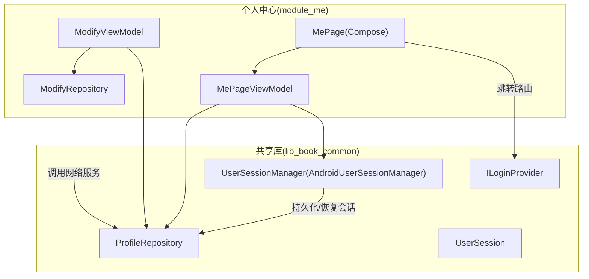
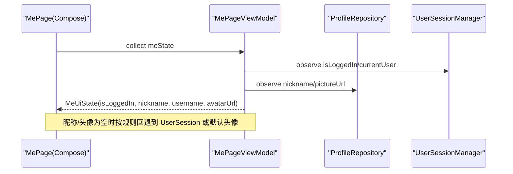
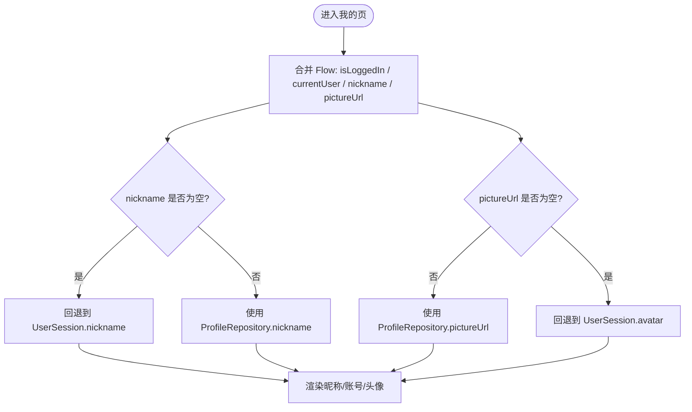
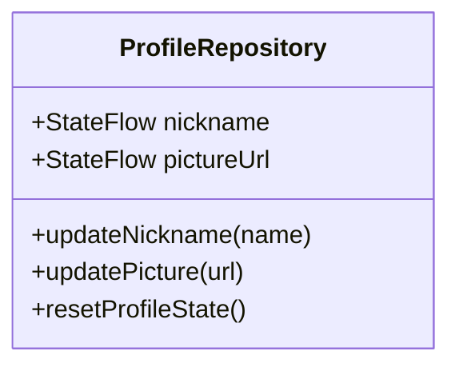
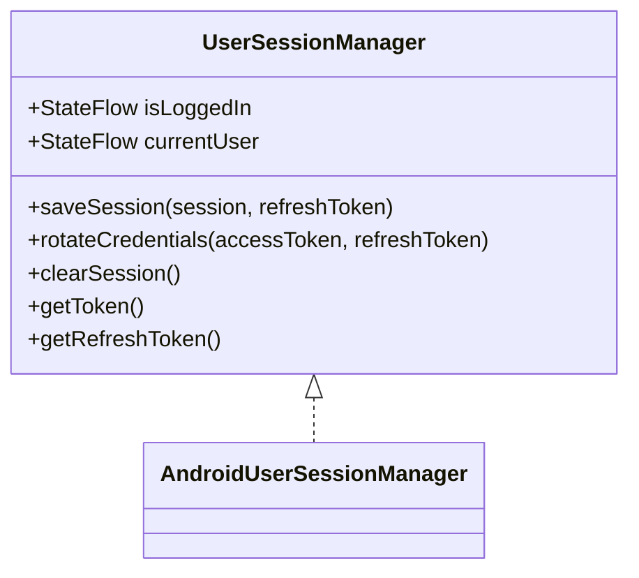
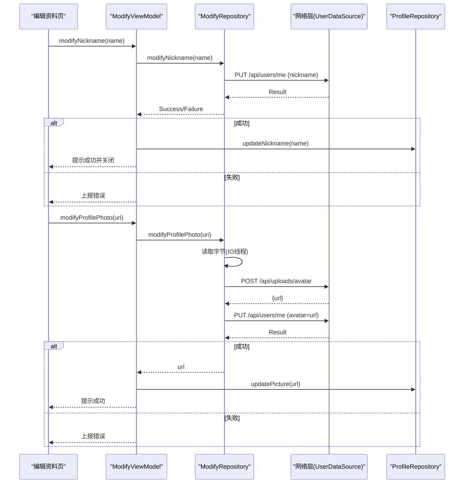
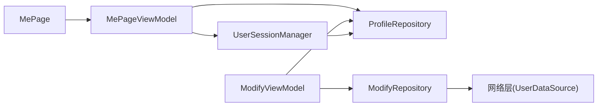

# 用户信息管理

<cite>
**本文引用的文件**   
- [MePageViewModel.kt](file://module_me/src/main/java/com/ebook/me/mvvm/viewmodel/MePageViewModel.kt)
- [MePage.kt](file://module_me/src/main/java/com/ebook/me/page/MePage.kt)
- [ProfileRepository.kt](file://lib_book_common/src/main/java/com/ebook/common/repository/ProfileRepository.kt)
- [UserSessionManager.kt](file://lib_book_common/src/main/java/com/ebook/common/domain/UserSessionManager.kt)
- [AndroidUserSessionManager.kt](file://lib_book_common/src/main/java/com/ebook/common/domain/AndroidUserSessionManager.kt)
- [UserSession.kt](file://lib_book_common/src/main/java/com/ebook/common/domain/UserSession.kt)
- [ModifyViewModel.kt](file://module_me/src/main/java/com/ebook/me/mvvm/viewmodel/ModifyViewModel.kt)
- [ModifyRepository.kt](file://module_me/src/main/java/com/ebook/me/repository/ModifyRepository.kt)
- [ILoginProvider.kt](file://lib_book_common/src/main/java/com/ebook/common/provider/ILoginProvider.kt)
</cite>

## 目录
1. [简介](#简介)
2. [项目结构](#项目结构)
3. [核心组件](#核心组件)
4. [架构总览](#架构总览)
5. [详细组件分析](#详细组件分析)
6. [依赖关系分析](#依赖关系分析)
7. [性能与可靠性](#性能与可靠性)
8. [故障排查指南](#故障排查指南)
9. [结论](#结论)
10. [附录：扩展与实现要点](#附录：扩展与实现要点)

## 简介
本章节面向“用户信息管理”能力，围绕 MePageViewModel 的登录态管理、昵称/头像回退策略、ProfileRepository 与 UserSessionManager 的协作机制进行系统化说明。同时覆盖头像上传流程、昵称修改功能、个人资料编辑界面实现、未登录占位处理，以及跨模块 Provider 接口在认证中的作用和独立运行模式下的降级策略。

## 项目结构
与用户信息管理直接相关的代码分布在以下模块：
- module_me：个人中心页面、资料编辑页及对应 ViewModel、Repository
- lib_book_common：用户会话管理（UserSessionManager）、用户资料仓库（ProfileRepository）、会话数据模型（UserSession）
- lib_ebook_api：网络层实体与服务（通过 ModifyRepository 调用）

图示来源
- [MePageViewModel.kt:70-119](file://module_me/src/main/java/com/ebook/me/mvvm/viewmodel/MePageViewModel.kt#L70-L119)
- [MePage.kt:77-94](file://module_me/src/main/java/com/ebook/me/page/MePage.kt#L77-L94)
- [ProfileRepository.kt:20-54](file://lib_book_common/src/main/java/com/ebook/common/repository/ProfileRepository.kt#L20-L54)
- [UserSessionManager.kt:13-62](file://lib_book_common/src/main/java/com/ebook/common/domain/UserSessionManager.kt#L13-L62)
- [AndroidUserSessionManager.kt:28-162](file://lib_book_common/src/main/java/com/ebook/common/domain/AndroidUserSessionManager.kt#L28-L162)
- [ModifyViewModel.kt:43-126](file://module_me/src/main/java/com/ebook/me/mvvm/viewmodel/ModifyViewModel.kt#L43-L126)
- [ModifyRepository.kt:19-82](file://module_me/src/main/java/com/ebook/me/repository/ModifyRepository.kt#L19-L82)
- [ILoginProvider.kt:1-19](file://lib_book_common/src/main/java/com/ebook/common/provider/ILoginProvider.kt#L1-L19)

小节来源
- [MePageViewModel.kt:70-119](file://module_me/src/main/java/com/ebook/me/mvvm/viewmodel/MePageViewModel.kt#L70-L119)
- [MePage.kt:77-94](file://module_me/src/main/java/com/ebook/me/page/MePage.kt#L77-L94)

## 核心组件
- MePageViewModel：聚合登录态与用户资料流，输出单一 UI 状态；合并昵称、头像、账号名等字段并定义回退策略。
- ProfileRepository：维护昵称与头像的内存 StateFlow，并提供更新与重置方法，作为“我的”页展示主源。
- UserSessionManager（AndroidUserSessionManager）：会话生命周期管理、双 token 轮换、三处镜像同步与清理。
- ModifyViewModel / ModifyRepository：昵称修改与头像上传（两步：上传拿 URL → 更新资料），并通过 ProfileRepository 刷新本地展示。
- ILoginProvider：跨模块暴露服务端登出能力，独立运行可空，避免崩溃。

小节来源
- [MePageViewModel.kt:19-68](file://module_me/src/main/java/com/ebook/me/mvvm/viewmodel/MePageViewModel.kt#L19-L68)
- [ProfileRepository.kt:12-54](file://lib_book_common/src/main/java/com/ebook/common/repository/ProfileRepository.kt#L12-L54)
- [UserSessionManager.kt:13-62](file://lib_book_common/src/main/java/com/ebook/common/domain/UserSessionManager.kt#L13-L62)
- [AndroidUserSessionManager.kt:28-162](file://lib_book_common/src/main/java/com/ebook/common/domain/AndroidUserSessionManager.kt#L28-L162)
- [ModifyViewModel.kt:22-126](file://module_me/src/main/java/com/ebook/me/mvvm/viewmodel/ModifyViewModel.kt#L22-L126)
- [ModifyRepository.kt:19-82](file://module_me/src/main/java/com/ebook/me/repository/ModifyRepository.kt#L19-L82)
- [ILoginProvider.kt:1-19](file://lib_book_common/src/main/java/com/ebook/common/provider/ILoginProvider.kt#L1-L19)

## 架构总览
用户信息以“登录态 + 资料快照”为核心，遵循“单源可信 + 回退兜底”的设计：
- 昵称优先级：ProfileRepository.nickname（登录后由服务端写回） > UserSession.nickname（冷启动/迁移兼容）
- 头像优先级：ProfileRepository.pictureUrl（上传成功后写入） > UserSession.avatar（会话中的头像） > 默认头像
- 账号名：直接使用 UserSession.username（用于副标题）
- 未登录：nickname 为空时显示“未登录”，avatarUrl 为空则渲染默认头像

图示来源
- [MePageViewModel.kt:77-93](file://module_me/src/main/java/com/ebook/me/mvvm/viewmodel/MePageViewModel.kt#L77-L93)
- [MePage.kt:77-94](file://module_me/src/main/java/com/ebook/me/page/MePage.kt#L77-L94)

## 详细组件分析

### MePageViewModel：登录态管理与状态合并
- 将登录态（isLoggedIn、currentUser）与资料（nickname、pictureUrl）合并为 MeUiState。
- 昵称回退：当 ProfileRepository.nickname 为空时，使用 UserSession.nickname；否则以 ProfileRepository 为准。
- 头像回退：当 ProfileRepository.pictureUrl 为空时，使用 UserSession.avatar；仍为空则由 UI 渲染默认头像。
- 账号名：取自 UserSession.username，未登录为空。
- 主题模式转发：统一从 ThemeModeManager 获取，避免多源不一致。

图示来源
- [MePageViewModel.kt:77-93](file://module_me/src/main/java/com/ebook/me/mvvm/viewmodel/MePageViewModel.kt#L77-L93)

小节来源
- [MePageViewModel.kt:19-119](file://module_me/src/main/java/com/ebook/me/mvvm/viewmodel/MePageViewModel.kt#L19-L119)

### ProfileRepository：昵称与头像的内存镜像
- 以 StateFlow 暴露 nickname、pictureUrl，初始值来自 SP，保证新订阅者立即拿到当前值。
- updateNickname/updatePicture 会同步更新内存与 SP，供其他模块读取。
- resetProfileState 仅复位内存流，SP 侧由会话管理器统一清理，避免职责混淆。

图示来源
- [ProfileRepository.kt:20-54](file://lib_book_common/src/main/java/com/ebook/common/repository/ProfileRepository.kt#L20-L54)

小节来源
- [ProfileRepository.kt:20-54](file://lib_book_common/src/main/java/com/ebook/common/repository/ProfileRepository.kt#L20-L54)

### UserSessionManager：会话生命周期与三处镜像
- 保存会话：写入 user_session SP、TokenHolder 与 spUtils 兼容键，并设置内存态。
- 静默刷新：rotateCredentials 只更新 token 与 refresh token，不改动身份字段。
- 清除会话：一次性清空三处镜像（user_session、spUtils、ProfileRepository 内存流），确保“我的”页不再显示上一个身份。

图示来源
- [UserSessionManager.kt:13-62](file://lib_book_common/src/main/java/com/ebook/common/domain/UserSessionManager.kt#L13-L62)
- [AndroidUserSessionManager.kt:28-162](file://lib_book_common/src/main/java/com/ebook/common/domain/AndroidUserSessionManager.kt#L28-L162)

小节来源
- [AndroidUserSessionManager.kt:61-133](file://lib_book_common/src/main/java/com/ebook/common/domain/AndroidUserSessionManager.kt#L61-L133)

### 头像上传与昵称修改：ModifyViewModel + ModifyRepository
- 昵称修改：提交 PUT /api/users/me（仅 nickname），成功则提示并更新 ProfileRepository.nickname，关闭页面。
- 头像上传：两步流程
  1) POST /api/uploads/avatar 上传 multipart 图片，返回 URL
  2) PUT /api/users/me 提交 avatar=url 更新资料
  成功后更新 ProfileRepository.pictureUrl，失败走统一错误上报。
- 提交闸门：防止重复点击导致的重复请求与重复提示。

图示来源
- [ModifyViewModel.kt:77-126](file://module_me/src/main/java/com/ebook/me/mvvm/viewmodel/ModifyViewModel.kt#L77-L126)
- [ModifyRepository.kt:35-82](file://module_me/src/main/java/com/ebook/me/repository/ModifyRepository.kt#L35-L82)

小节来源
- [ModifyViewModel.kt:22-126](file://module_me/src/main/java/com/ebook/me/mvvm/viewmodel/ModifyViewModel.kt#L22-L126)
- [ModifyRepository.kt:19-82](file://module_me/src/main/java/com/ebook/me/repository/ModifyRepository.kt#L19-L82)

### 个人资料编辑界面：MePage 与回退策略
- 未登录：nickname 为空显示“未登录”，头像传空串落到默认头像。
- 已登录：昵称优先用 ProfileRepository.nickname，头像优先用 pictureUrl，再回退到 UserSession.avatar。
- 右侧按钮：已登录显示“编辑资料”，未登录显示“立即登录”。

小节来源
- [MePage.kt:160-329](file://module_me/src/main/java/com/ebook/me/page/MePage.kt#L160-L329)

### 跨模块 Provider 接口与独立运行降级
- ILoginProvider 暴露服务端登出能力；独立运行时（isModule=true）该服务不可用，调用方需允许空实现，避免崩溃。
- 本地会话清理统一由 UserSessionManager.clearSession 负责，不在 Provider 中重复。

小节来源
- [ILoginProvider.kt:1-19](file://lib_book_common/src/main/java/com/ebook/common/provider/ILoginProvider.kt#L1-L19)

## 依赖关系分析
- MePageViewModel 依赖 ProfileRepository（资料主源）与 UserSessionManager（登录态与会话数据）。
- ModifyViewModel 依赖 ModifyRepository（网络封装）与 ProfileRepository（更新后刷新本地展示）。
- ModifyRepository 依赖网络层（UserDataSource）与 IO 工具（读取图片字节）。
- AndroidUserSessionManager 与 ProfileRepository 形成“会话清理”时的双向协作：清会话时重置 ProfileRepository 内存流，避免“我的”页残留旧身份。

图示来源
- [MePageViewModel.kt:70-119](file://module_me/src/main/java/com/ebook/me/mvvm/viewmodel/MePageViewModel.kt#L70-L119)
- [ModifyViewModel.kt:43-126](file://module_me/src/main/java/com/ebook/me/mvvm/viewmodel/ModifyViewModel.kt#L43-L126)
- [ModifyRepository.kt:19-82](file://module_me/src/main/java/com/ebook/me/repository/ModifyRepository.kt#L19-L82)
- [AndroidUserSessionManager.kt:111-133](file://lib_book_common/src/main/java/com/ebook/common/domain/AndroidUserSessionManager.kt#L111-L133)

小节来源
- [MePageViewModel.kt:70-119](file://module_me/src/main/java/com/ebook/me/mvvm/viewmodel/MePageViewModel.kt#L70-L119)
- [ModifyViewModel.kt:43-126](file://module_me/src/main/java/com/ebook/me/mvvm/viewmodel/ModifyViewModel.kt#L43-L126)
- [ModifyRepository.kt:19-82](file://module_me/src/main/java/com/ebook/me/repository/ModifyRepository.kt#L19-L82)
- [AndroidUserSessionManager.kt:111-133](file://lib_book_common/src/main/java/com/ebook/common/domain/AndroidUserSessionManager.kt#L111-L133)

## 性能与可靠性
- 状态流合并：meState 使用 combine + stateIn，切走 Tab 停止合并，减少不必要计算；首次加载有初始值，避免空白闪烁。
- 头像读取：读取图片字节在 IO 线程执行，避免阻塞主线程；上传失败有明确错误上报路径。
- 会话清理：一次调用清理三处镜像，避免残留旧身份导致 UI 异常。
- 提交闸门：昵称/头像修改共用闸门，防止重复提交与重复提示。

[本节为通用指导，无需特定文件引用]

## 故障排查指南
- “我的”页仍显示上一个身份：检查是否调用了 UserSessionManager.clearSession；确认 ProfileRepository.resetProfileState 已被触发（在 clearSession 内部完成）。
- 昵称修改无响应：确认 ModifyViewModel.modifyNickname 未被重复触发（submitInProgress 闸门）；查看网络层返回与 reportFailure 日志。
- 头像上传失败：检查 ModifyRepository 的两步流程（上传 URL 与更新资料）是否都成功；确认网络客户端权限与后端契约一致。
- 未登录占位异常：确认 MePageViewModel 的 meState 合并逻辑是否正确回退到 UserSession；检查 ProfileRepository 初始值是否从 SP 正确加载。

小节来源
- [AndroidUserSessionManager.kt:111-133](file://lib_book_common/src/main/java/com/ebook/common/domain/AndroidUserSessionManager.kt#L111-L133)
- [ModifyViewModel.kt:77-126](file://module_me/src/main/java/com/ebook/me/mvvm/viewmodel/ModifyViewModel.kt#L77-L126)
- [ModifyRepository.kt:53-82](file://module_me/src/main/java/com/ebook/me/repository/ModifyRepository.kt#L53-L82)
- [MePageViewModel.kt:77-93](file://module_me/src/main/java/com/ebook/me/mvvm/viewmodel/MePageViewModel.kt#L77-L93)

## 结论
用户信息管理以 MePageViewModel 为中心，将登录态与资料流合并为单一 UI 状态，遵循“ProfileRepository 为主、UserSession 为辅、默认头像兜底”的回退策略。头像上传与昵称修改通过 ModifyViewModel 与 ModifyRepository 协同完成，并在成功后刷新 ProfileRepository。会话清理由 UserSessionManager 统一负责，确保三处镜像一致性。跨模块 Provider 提供服务端登出能力，独立模式下允许空实现以保证稳定性。

[本节为总结性内容，无需特定文件引用]

## 附录：扩展与实现要点
- 扩展用户信息字段：
  - 在 UserSession 中添加新字段（如 extraInfo），并在 AndroidUserSessionManager.saveSession/rotateCredentials/loadSessionFromSp 中同步读写。
  - 如需在“我的”页展示，可在 MePageViewModel 的 combine 中加入该字段，并在 MeUiState 中增加对应属性。
- 异步数据流合并：
  - 使用 combine 将多个 StateFlow 合并为单一 StateFlow，配合 stateIn 控制生命周期与缓存。
- 头像裁剪与上传：
  - 在 ModifyRepository 中读取 Uri 对应的字节（IO 线程），构造 multipart 请求上传；成功后获取 URL 并提交更新。
  - 若需裁剪，可在调用 Repository 前对图片进行处理（例如使用系统裁剪或自定义裁剪库），再传入 URI。
- 跨模块 Provider 作用：
  - ILoginProvider.logout 用于作废服务端会话；调用顺序建议“尽力作废服务端 → 无条件清本地会话”。
- 独立运行降级：
  - 独立模式（isModule=true）下，ILoginProvider 可能不可用，调用方需允许空实现，避免崩溃。

小节来源
- [UserSession.kt:1-17](file://lib_book_common/src/main/java/com/ebook/common/domain/UserSession.kt#L1-L17)
- [AndroidUserSessionManager.kt:61-146](file://lib_book_common/src/main/java/com/ebook/common/domain/AndroidUserSessionManager.kt#L61-L146)
- [MePageViewModel.kt:77-93](file://module_me/src/main/java/com/ebook/me/mvvm/viewmodel/MePageViewModel.kt#L77-L93)
- [ModifyRepository.kt:53-82](file://module_me/src/main/java/com/ebook/me/repository/ModifyRepository.kt#L53-L82)
- [ILoginProvider.kt:1-19](file://lib_book_common/src/main/java/com/ebook/common/provider/ILoginProvider.kt#L1-L19)