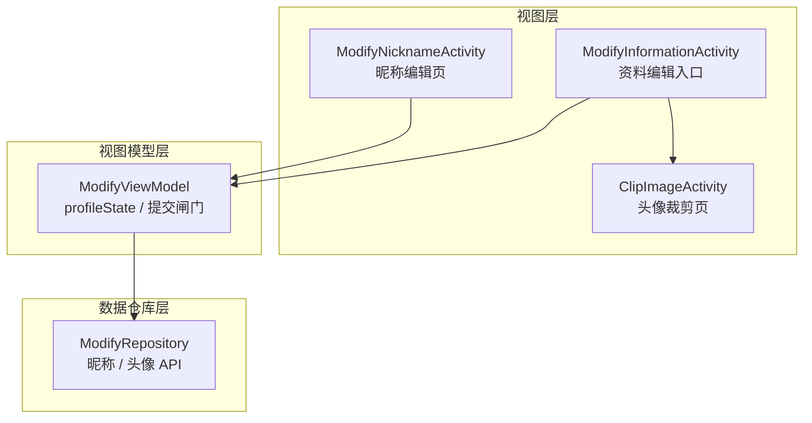
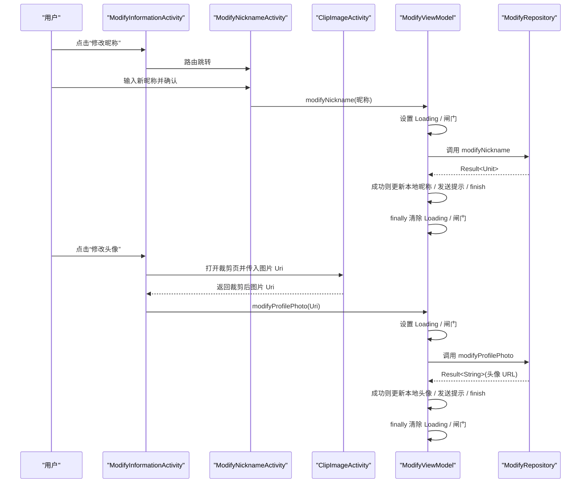
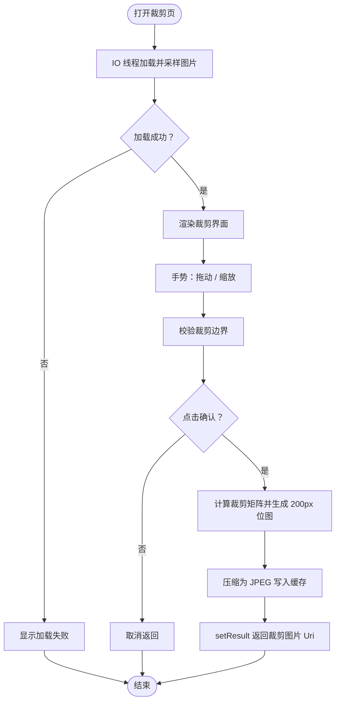
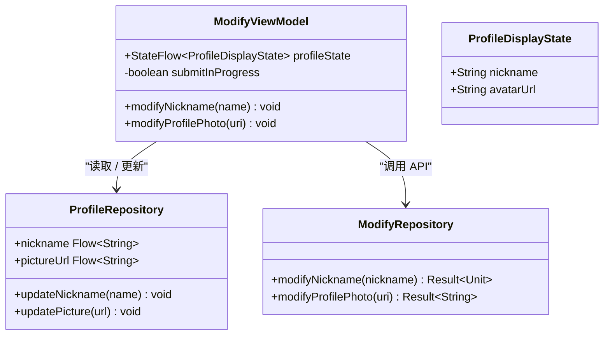
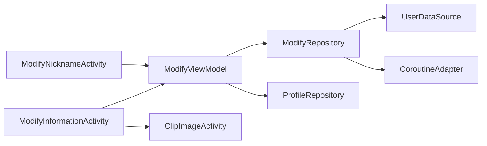

# 用户信息管理

<cite>
**本文引用的文件 **
- [ModifyInformationActivity.kt](file://module_me/src/main/java/com/ebook/me/view/ModifyInformationActivity.kt)
- [ModifyNicknameActivity.kt](file://module_me/src/main/java/com/ebook/me/view/ModifyNicknameActivity.kt)
- [ClipImageActivity.kt](file://module_me/src/main/java/com/ebook/me/view/profilePhoto/ClipImageActivity.kt)
- [ModifyViewModel.kt](file://module_me/src/main/java/com/ebook/me/mvvm/viewmodel/ModifyViewModel.kt)
- [ModifyRepository.kt](file://module_me/src/main/java/com/ebook/me/repository/ModifyRepository.kt)
</cite>

## 目录
1. [简介](#简介)
2. [项目结构](#项目结构)
3. [核心组件](#核心组件)
4. [架构总览](#架构总览)
5. [详细组件分析](#详细组件分析)
6. [依赖关系分析](#依赖关系分析)
7. [性能与资源管理](#性能与资源管理)
8. [故障排查指南](#故障排查指南)
9. [结论](#结论)

## 简介
本文件围绕“用户信息管理”功能展开，重点说明个人资料编辑界面的实现与数据流。内容涵盖：
- 修改头像、昵称的界面入口与交互流程；
- ModifyInformationActivity 的页面架构与状态驱动方式；
- ModifyNicknameActivity 的输入校验与提交逻辑；
- 头像裁剪功能的完整链路（图片选择、圆形裁剪区、结果返回）；
- ModifyViewModel 的状态管理与异步更新；
- ModifyRepository 与后端 API 的交互；
- 完整的用户信息更新数据流与错误处理机制。

该功能采用 MVVM + Compose 架构，通过单一 ViewModel 暴露 profileState，让多个页面共享并刷新当前昵称和头像。网络请求由 Repository 层封装，失败统一上报，避免在 Activity 中散落业务细节。

## 项目结构
用户信息管理相关代码集中在 module_me 模块中，按职责分为视图层、视图模型层和数据仓库层：
- 视图层：负责 UI 展示和用户交互；
- 视图模型层：聚合 ProfileRepository 的数据流，处理本地状态与提交闸门；
- 仓库层：封装后端接口调用、图片字节读取与上传。

```mermaid
graph TB
    subgraph "视图层"
        A["ModifyInformationActivity<br/>资料编辑入口"]
        B["ModifyNicknameActivity<br/>昵称编辑页"]
        C["ClipImageActivity<br/>头像裁剪页"]
    end

    subgraph "视图模型层"
        D["ModifyViewModel<br/>profileState / 提交闸门"]
    end

    subgraph "数据仓库层"
        E["ModifyRepository<br/>昵称 / 头像 API"]
    end

    A --> D
    B --> D
    A --> C
    D --> E
```

**图表来源**
- [ModifyInformationActivity.kt:1-200](file://module_me/src/main/java/com/ebook/me/view/ModifyInformationActivity.kt#L1-L200)
- [ModifyNicknameActivity.kt:1-170](file://module_me/src/main/java/com/ebook/me/view/ModifyNicknameActivity.kt#L1-L170)
- [ClipImageActivity.kt:1-200](file://module_me/src/main/java/com/ebook/me/view/profilePhoto/ClipImageActivity.kt#L1-L200)
- [ModifyViewModel.kt:1-126](file://module_me/src/main/java/com/ebook/me/mvvm/viewmodel/ModifyViewModel.kt#L1-L126)
- [ModifyRepository.kt:1-82](file://module_me/src/main/java/com/ebook/me/repository/ModifyRepository.kt#L1-L82)

**章节来源**
- [ModifyInformationActivity.kt:1-200](file://module_me/src/main/java/com/ebook/me/view/ModifyInformationActivity.kt#L1-L200)
- [ModifyNicknameActivity.kt:1-170](file://module_me/src/main/java/com/ebook/me/view/ModifyNicknameActivity.kt#L1-L170)
- [ClipImageActivity.kt:1-200](file://module_me/src/main/java/com/ebook/me/view/profilePhoto/ClipImageActivity.kt#L1-L200)
- [ModifyViewModel.kt:1-126](file://module_me/src/main/java/com/ebook/me/mvvm/viewmodel/ModifyViewModel.kt#L1-L126)
- [ModifyRepository.kt:1-82](file://module_me/src/main/java/com/ebook/me/repository/ModifyRepository.kt#L1-L82)

## 核心组件
- ModifyInformationActivity：资料编辑主界面，提供头像、昵称、密码三个条目；头像通过底部弹窗选择拍照或相册，随后进入裁剪页。
- ModifyNicknameActivity：昵称编辑页，包含当前昵称参照、新昵称输入框、长度计数与确认按钮。
- ClipImageActivity：头像裁剪页，支持单指拖动、双指缩放，固定圆形裁剪区域，确认后返回裁剪后的图片 Uri。
- ModifyViewModel：集中管理 profileState，提供 modifyNickname 与 modifyProfilePhoto 两个可观察的更新入口，并通过 submitInProgress 防止重复提交。
- ModifyRepository：封装昵称更新与头像上传两步流程，统一使用 safeApiCall 与 mapCatching 处理成功/失败分支。

**章节来源**
- [ModifyInformationActivity.kt:1-200](file://module_me/src/main/java/com/ebook/me/view/ModifyInformationActivity.kt#L1-L200)
- [ModifyNicknameActivity.kt:1-170](file://module_me/src/main/java/com/ebook/me/view/ModifyNicknameActivity.kt#L1-L170)
- [ClipImageActivity.kt:1-200](file://module_me/src/main/java/com/ebook/me/view/profilePhoto/ClipImageActivity.kt#L1-L200)
- [ModifyViewModel.kt:1-126](file://module_me/src/main/java/com/ebook/me/mvvm/viewmodel/ModifyViewModel.kt#L1-L126)
- [ModifyRepository.kt:1-82](file://module_me/src/main/java/com/ebook/me/repository/ModifyRepository.kt#L1-L82)

## 架构总览
用户信息更新的整体流程遵循“视图触发 → ViewModel 闸门控制 → Repository 网络调用 → 本地状态更新 → UI 刷新”。

```mermaid
sequenceDiagram
    participant User as "用户"
    participant InfoAct as "ModifyInformationActivity"
    participant NickAct as "ModifyNicknameActivity"
    participant CropAct as "ClipImageActivity"
    participant VM as "ModifyViewModel"
    participant Repo as "ModifyRepository"

    User->>InfoAct: 点击“修改昵称”
    InfoAct->>NickAct: 路由跳转

    User->>NickAct: 输入新昵称并确认
    NickAct->>VM: modifyNickname(昵称)
    VM->>VM: 设置 Loading / 闸门
    VM->>Repo: 调用 modifyNickname
    Repo-->>VM: Result<Unit>
    VM->>VM: 成功则更新本地昵称 / 发送提示 / finish
    VM->>VM: finally 清除 Loading / 闸门

    User->>InfoAct: 点击“修改头像”
    InfoAct->>CropAct: 打开裁剪页并传入图片 Uri
    CropAct-->>InfoAct: 返回裁剪后图片 Uri
    InfoAct->>VM: modifyProfilePhoto(Uri)
    VM->>VM: 设置 Loading / 闸门
    VM->>Repo: 调用 modifyProfilePhoto
    Repo-->>VM: Result<String>(头像 URL)
    VM->>VM: 成功则更新本地头像 / 发送提示 / finish
    VM->>VM: finally 清除 Loading / 闸门
```

**图表来源**
- [ModifyInformationActivity.kt:1-200](file://module_me/src/main/java/com/ebook/me/view/ModifyInformationActivity.kt#L1-L200)
- [ModifyNicknameActivity.kt:1-170](file://module_me/src/main/java/com/ebook/me/view/ModifyNicknameActivity.kt#L1-L170)
- [ClipImageActivity.kt:1-200](file://module_me/src/main/java/com/ebook/me/view/profilePhoto/ClipImageActivity.kt#L1-L200)
- [ModifyViewModel.kt:1-126](file://module_me/src/main/java/com/ebook/me/mvvm/viewmodel/ModifyViewModel.kt#L1-L126)
- [ModifyRepository.kt:1-82](file://module_me/src/main/java/com/ebook/me/repository/ModifyRepository.kt#L1-L82)

## 详细组件分析

### 个人资料编辑界面：ModifyInformationActivity
- 页面以 Compose 列表形式展示当前昵称与头像缩略图，点击行进入对应编辑。
- 头像更换流程：
  - 点击“修改头像”弹出 ModalBottomSheet，提供“拍照”“从相册选择”两个选项；
  - 拍照生成临时文件并构造 ContentUri，相册选择直接返回 Uri；
  - 将 Uri 传递给 ClipImageActivity 进行圆形裁剪；
  - 裁剪成功后回调到 Activity，再调用 ViewModel.modifyProfilePhoto(uri) 完成上传。
- 密码修改入口根据是否集成登录模块动态显示，避免独立运行时误跳模拟登录页。

关键要点：
- 页面不直接访问 ProfileRepository，而是消费 ViewModel.profileState；
- 多次拍照复用同一临时文件，避免缓存堆积；
- 选图使用 PickVisualMedia，Android 13+ 免权限；
- 裁剪结果通过 ActivityResultContracts.StartActivityForResult 返回。

**章节来源**
- [ModifyInformationActivity.kt:1-200](file://module_me/src/main/java/com/ebook/me/view/ModifyInformationActivity.kt#L1-L200)

### 昵称编辑界面：ModifyNicknameActivity
- 页面包含“当前昵称”参考文本、新昵称输入框、输入计数与确认按钮。
- 输入校验规则：
  - 非纯空白；
  - 最大长度为 12；
  - 输入为空时显示错误提示，输入计数实时反馈；
  - ImeAction.Done 与按钮点击均会触发提交。
- 提交逻辑：
  - 调用 ViewModel.modifyNickname(trimmed)；
  - ViewModel 内部进行 Loading 与提交闸门控制；
  - 成功后刷新本地昵称并关闭页面。

注意：
- nickname 使用 rememberSaveable 保留旋转或重建时的输入；
- 当前昵称为空时显示“未设置”，用于首启或仅邮箱注册的用户。

**章节来源**
- [ModifyNicknameActivity.kt:1-170](file://module_me/src/main/java/com/ebook/me/view/ModifyNicknameActivity.kt#L1-L170)
- [ModifyViewModel.kt:1-126](file://module_me/src/main/java/com/ebook/me/mvvm/viewmodel/ModifyViewModel.kt#L1-L126)

### 头像裁剪功能：ClipImageActivity
- 加载图片：
  - 从 Intent.data 获取 Uri；
  - 在 IO 线程采样解码（720×1280），并进行 EXIF 旋转纠正；
  - 加载失败显示错误文案，加载中显示进度指示。
- 手势交互：
  - 单指拖动平移图片；
  - 双指缩放，缩放范围限制为 minScale 到 4*minScale；
  - 圆形裁剪区固定在容器中央，约束偏移确保圆内不露白。
- 结果返回：
  - 确认按钮启用条件为 cropState 已就绪；
  - 裁剪产物为 200px 正方形位图，压缩为 JPEG 写入缓存目录；
  - 通过 setResult 返回 ContentUri，上层可继续上传。

关键点：
- 使用 CompositingStrategy.Offscreen + BlendMode.Clear 实现遮罩挖孔；
- 裁剪输出大小与预览采样一致，避免上传后出现锯齿差异；
- 连点确认有闸门保护，避免重复写盘与重复返回结果。

```mermaid
flowchart TD
    Start(["打开裁剪页"]) --> Load["IO 线程加载并采样图片"]
    Load --> Loaded{"加载成功？"}
    Loaded -->|否| ShowError["显示加载失败"]
    Loaded -->|是| Render["渲染裁剪界面"]
    Render --> Gesture["手势：拖动 / 缩放"]
    Gesture --> Validate["校验裁剪边界"]
    Validate --> Confirm{"点击确认？"}
    Confirm -->|否| Cancel["取消返回"]
    Confirm -->|是| Crop["计算裁剪矩阵并生成 200px 位图"]
    Crop --> Save["压缩为 JPEG 写入缓存"]
    Save --> Return["setResult 返回裁剪图片 Uri"]
    Return --> End(["结束"])
    ShowError --> End
    Cancel --> End
```

**图表来源**
- [ClipImageActivity.kt:1-200](file://module_me/src/main/java/com/ebook/me/view/profilePhoto/ClipImageActivity.kt#L1-L200)
- [ClipImageActivity.kt:201-435](file://module_me/src/main/java/com/ebook/me/view/profilePhoto/ClipImageActivity.kt#L201-L435)

**章节来源**
- [ClipImageActivity.kt:1-200](file://module_me/src/main/java/com/ebook/me/view/profilePhoto/ClipImageActivity.kt#L1-L200)
- [ClipImageActivity.kt:201-435](file://module_me/src/main/java/com/ebook/me/view/profilePhoto/ClipImageActivity.kt#L201-L435)

### 视图模型：ModifyViewModel
- 状态管理：
  - profileState 通过 combine(ProfileRepository.nickname, ProfileRepository.pictureUrl) 生成；
  - 使用 stateIn 将组合流转为 StateFlow，订阅期间维护值，无订阅时延迟启动。
- 提交闸门：
  - submitInProgress 防止昵称与头像同时提交；
  - 每次提交前设置为 true，finally 中复位。
- 修改昵称：
  - 设置 Overlay.Loading；
  - 调用 Repository.modifyNickname；
  - 成功：Toast 提示、更新本地昵称、finish；
  - 失败：reportFailure 上报异常。
- 修改头像：
  - 设置 Overlay.Loading；
  - 调用 Repository.modifyProfilePhoto；
  - 成功：Toast 提示，若 URL 非空则更新本地头像；
  - 失败：以“上传头像失败：{userMessage}”格式提示。

```mermaid
classDiagram
    class ModifyViewModel {
        +StateFlow~ProfileDisplayState~ profileState
        -boolean submitInProgress
        +modifyNickname(name) void
        +modifyProfilePhoto(uri) void
    }

    class ProfileDisplayState {
        +String nickname
        +String avatarUrl
    }

    class ModifyRepository {
        +modifyNickname(nickname) Result~Unit~
        +modifyProfilePhoto(uri) Result~String~
    }

    class ProfileRepository {
        +nickname Flow~String~
        +pictureUrl Flow~String~
        +updateNickname(name) void
        +updatePicture(url) void
    }

    ModifyViewModel --> ProfileRepository : "读取 / 更新"
    ModifyViewModel --> ModifyRepository : "调用 API"
```

**图表来源**
- [ModifyViewModel.kt:1-126](file://module_me/src/main/java/com/ebook/me/mvvm/viewmodel/ModifyViewModel.kt#L1-L126)
- [ModifyRepository.kt:1-82](file://module_me/src/main/java/com/ebook/me/repository/ModifyRepository.kt#L1-L82)

**章节来源**
- [ModifyViewModel.kt:1-126](file://module_me/src/main/java/com/ebook/me/mvvm/viewmodel/ModifyViewModel.kt#L1-L126)

### 数据仓库：ModifyRepository
- 修改昵称：
  - 使用 UpdateUserRequest(nickname = name) 调用部分更新接口；
  - 服务端废弃旧端点，统一走本端点；
  - 成功返回 Unit，失败抛出异常并携带资源文案。
- 修改头像（两步流程）：
  - 第一步：IO 线程读取 Uri 对应文件的字节，构建 MultipartBody.Part 上传到 /api/uploads/avatar；
  - 第二步：将返回的 avatar URL 再次调用 updateMe(UpdateUserRequest(avatar = url)) 更新资料；
  - 任一步失败都会抛出异常，并由上层 reportFailure 处理。

注意：
- 图片读取与上传必须切 IO 线程，避免阻塞主线程；
- 文件名通过 FileUtil.generateFileName("jpg") 生成，保证唯一性；
- 响应体 data 为空时抛出异常，避免空指针导致 UI 状态不一致。

**章节来源**
- [ModifyRepository.kt:1-82](file://module_me/src/main/java/com/ebook/me/repository/ModifyRepository.kt#L1-L82)

## 依赖关系分析
- ModifyInformationActivity 依赖：
  - ModifyViewModel：消费 profileState，触发昵称与头像修改；
  - ClipImageActivity：接收图片 Uri，返回裁剪结果；
  - Router：跳转到昵称修改与密码修改页面。
- ModifyNicknameActivity 依赖：
  - ModifyViewModel：提交昵称修改；
  - Router：自身作为路由目标。
- ClipImageActivity 依赖：
  - BitmapUtil：采样解码与旋转纠正；
  - FileUtil：生成临时文件与 ContentUri。
- ModifyViewModel 依赖：
  - ProfileRepository：读取昵称与头像 URL，并在成功后更新；
  - ModifyRepository：执行昵称与头像的网络更新；
  - BaseViewModel：提供 sendToast、sendFinish、updateOverlay 等通用能力。
- ModifyRepository 依赖：
  - UserDataSource：封装后端 API；
  - CoroutineAdapter：统一协程适配与安全调用；
  - Application：提供 contentResolver 与字符串资源。

```mermaid
graph LR
    Info["ModifyInformationActivity"] --> VM["ModifyViewModel"]
    Nick["ModifyNicknameActivity"] --> VM
    Info --> Crop["ClipImageActivity"]
    VM --> Repo["ModifyRepository"]
    VM --> PR["ProfileRepository"]
    Repo --> DS["UserDataSource"]
    Repo --> CA["CoroutineAdapter"]
```

**图表来源**
- [ModifyInformationActivity.kt:1-200](file://module_me/src/main/java/com/ebook/me/view/ModifyInformationActivity.kt#L1-L200)
- [ModifyNicknameActivity.kt:1-170](file://module_me/src/main/java/com/ebook/me/view/ModifyNicknameActivity.kt#L1-L170)
- [ClipImageActivity.kt:1-200](file://module_me/src/main/java/com/ebook/me/view/profilePhoto/ClipImageActivity.kt#L1-L200)
- [ModifyViewModel.kt:1-126](file://module_me/src/main/java/com/ebook/me/mvvm/viewmodel/ModifyViewModel.kt#L1-L126)
- [ModifyRepository.kt:1-82](file://module_me/src/main/java/com/ebook/me/repository/ModifyRepository.kt#L1-L82)

**章节来源**
- [ModifyInformationActivity.kt:1-200](file://module_me/src/main/java/com/ebook/me/view/ModifyInformationActivity.kt#L1-L200)
- [ModifyNicknameActivity.kt:1-170](file://module_me/src/main/java/com/ebook/me/view/ModifyNicknameActivity.kt#L1-L170)
- [ClipImageActivity.kt:1-200](file://module_me/src/main/java/com/ebook/me/view/profilePhoto/ClipImageActivity.kt#L1-L200)
- [ModifyViewModel.kt:1-126](file://module_me/src/main/java/com/ebook/me/mvvm/viewmodel/ModifyViewModel.kt#L1-L126)
- [ModifyRepository.kt:1-82](file://module_me/src/main/java/com/ebook/me/repository/ModifyRepository.kt#L1-L82)

## 性能与资源管理
- 图片采样解码：ClipImageActivity 使用 720×1280 采样解码，避免大图的 OOM；
- IO 线程隔离：头像字节读取、JPEG 压缩与文件写入均在 Dispatchers.IO 执行；
- 内存回收：裁剪完成后对 Bitmap 调用 recycle，避免泄漏；
- 临时文件：拍照与裁剪结果使用缓存目录中的临时文件，减少磁盘占用；
- 状态订阅优化：profileState 使用 WhileSubscribed(5_000)，在无订阅时停止合并流，降低后台开销；
- 防重复提交：submitInProgress 闸门避免慢网下重复 PUT 与重复提示。

[本节为通用性能建议，不直接分析具体代码片段]

## 故障排查指南
- 昵称修改失败：
  - 检查输入是否为纯空白或超过 12 字；
  - 查看 ViewModel 中 reportFailure 上报的异常信息；
  - 确认 Repository.modifyNickname 返回的 data 是否为空。
- 头像上传失败：
  - 检查 Uri 是否能成功读取字节；
  - 查看 uploadAvatar 与 updateMe 的返回码与响应体；
  - 注意“上传头像失败：{userMessage}”的提示，结合 userMessage 定位问题。
- 裁剪页面无法操作：
  - 确认 cropState 是否已就绪（需等待 onSizeChanged）；
  - 检查手势是否被遮挡或容器尺寸异常；
  - 确认图片加载是否成功，失败时显示错误文案。
- 会话过期与全局错误：
  - 会话过期已在网络层全局处置，ViewModel 不再重复提示；
  - 其他异常通过 reportFailure 统一上报，便于日志追踪。

**章节来源**
- [ModifyViewModel.kt:1-126](file://module_me/src/main/java/com/ebook/me/mvvm/viewmodel/ModifyViewModel.kt#L1-L126)
- [ModifyRepository.kt:1-82](file://module_me/src/main/java/com/ebook/me/repository/ModifyRepository.kt#L1-L82)

## 结论
用户信息管理功能通过清晰的 MVVM 分层与 Compose 化界面，实现了昵称修改、头像上传与裁剪的完整闭环。ModifyInformationActivity 负责入口与交互编排，ModifyNicknameActivity 负责表单校验，ClipImageActivity 负责图片裁剪，ModifyViewModel 统一状态与提交流程，ModifyRepository 统一网络调用。整体设计强调：
- 单一数据源（profileState）驱动 UI；
- 提交闸门避免重复请求；
- IO 与主线程分离，保障流畅体验；
- 错误统一上报与提示，提升可观测性与用户体验。

[本节为总结性内容，不直接分析具体代码片段]