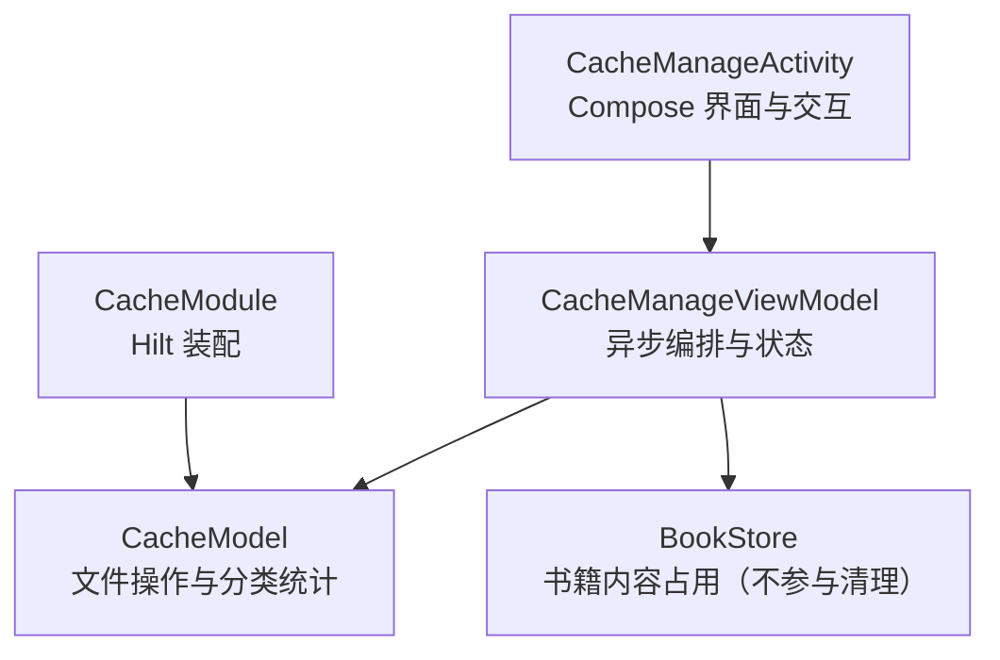
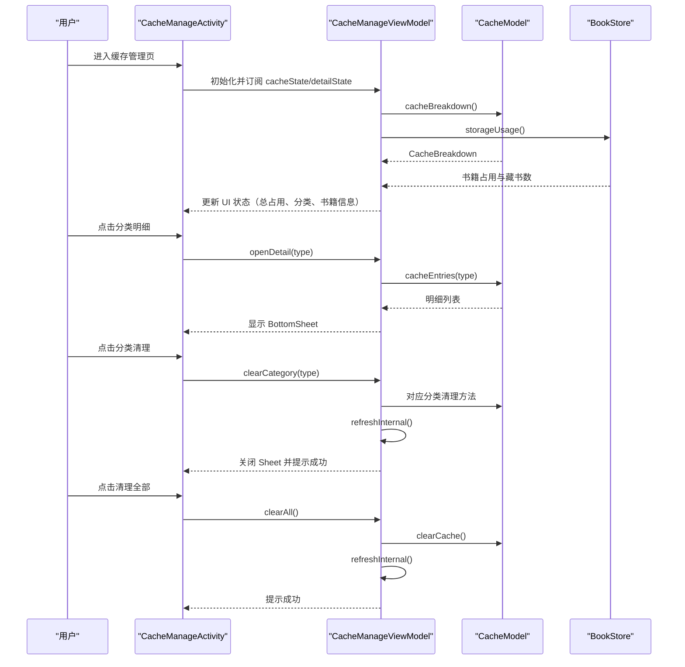
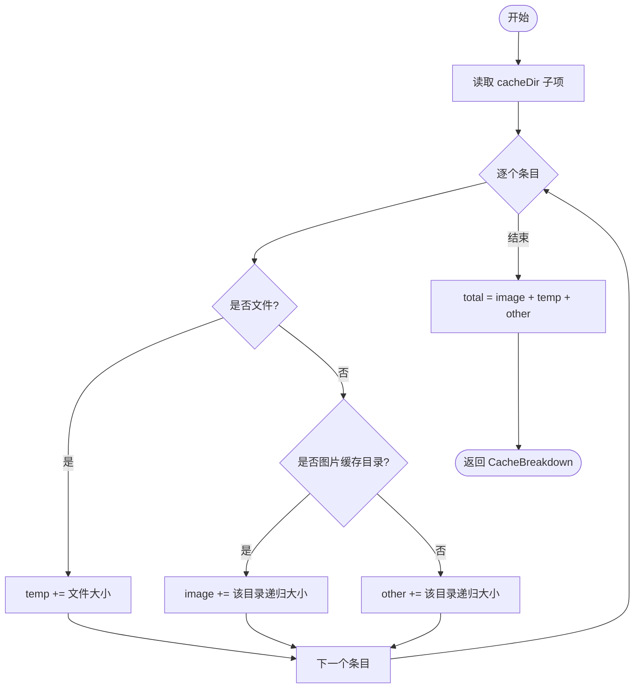
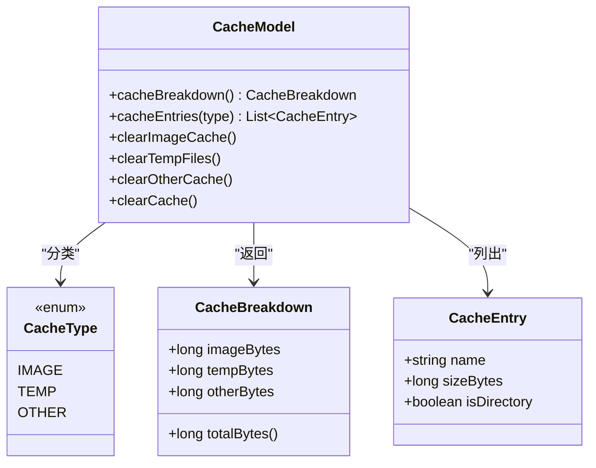
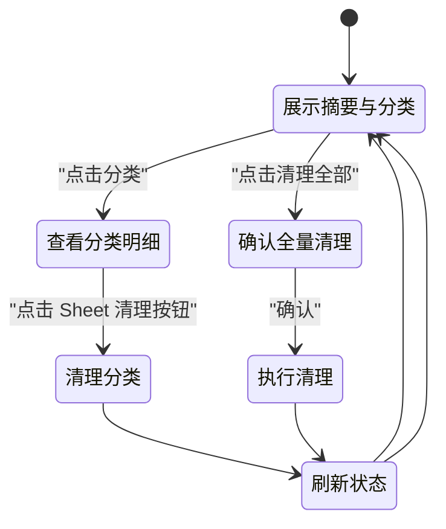
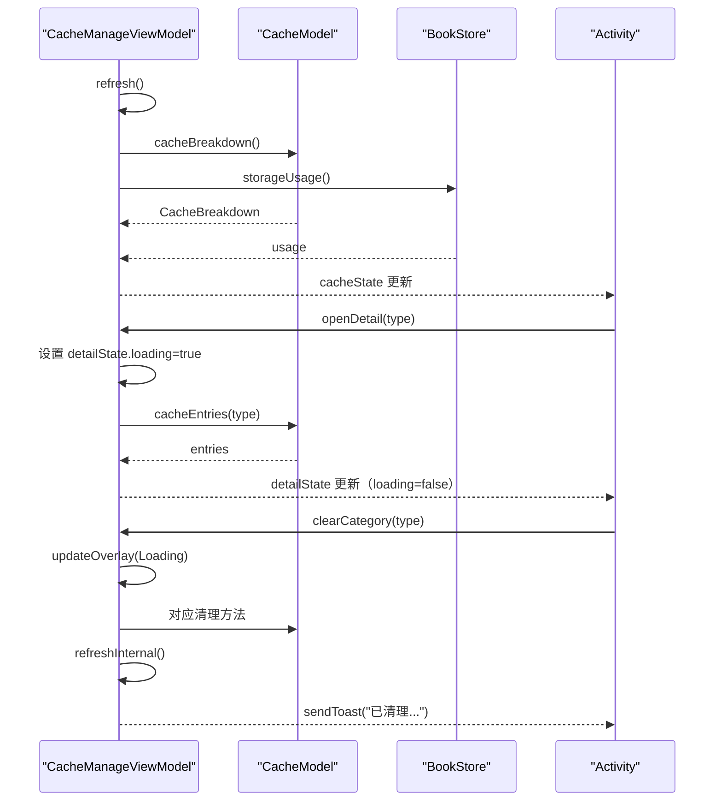
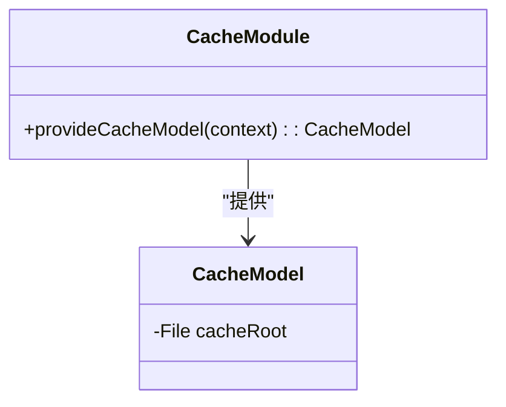
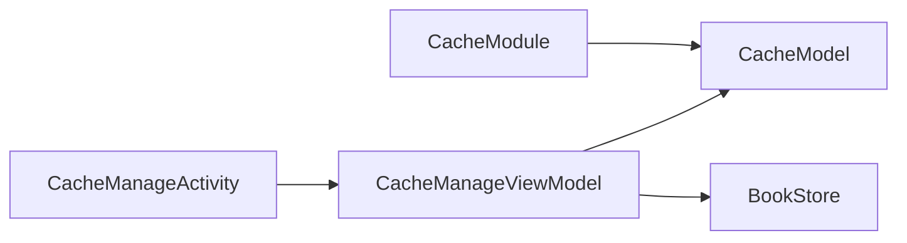

# 缓存管理功能

<cite>
**本文引用的文件**   
- [CacheManageActivity.kt](file://module_me/src/main/java/com/ebook/me/view/CacheManageActivity.kt)
- [CacheManageViewModel.kt](file://module_me/src/main/java/com/ebook/me/mvvm/viewmodel/CacheManageViewModel.kt)
- [CacheModel.kt](file://module_me/src/main/java/com/ebook/me/repository/CacheModel.kt)
- [CacheModule.kt](file://module_me/src/main/java/com/ebook/me/di/CacheModule.kt)
- [CacheModelTest.kt](file://module_me/src/test/java/com/ebook/me/repository/CacheModelTest.kt)
- [CacheManageViewModelTest.kt](file://module_me/src/test/java/com/ebook/me/mvvm/viewmodel/CacheManageViewModelTest.kt)
- [strings.xml](file://module_me/src/main/res/values/strings.xml)
</cite>

## 目录
1. [引言](#引言)
2. [项目结构](#项目结构)
3. [核心组件](#核心组件)
4. [架构总览](#架构总览)
5. [详细组件分析](#详细组件分析)
6. [依赖关系分析](#依赖关系分析)
7. [性能与复杂度](#性能与复杂度)
8. [故障排查指南](#故障排查指南)
9. [结论](#结论)

## 引言
本文件面向“缓存管理”相关功能的开发者与维护者，围绕以下目标展开：
- 解释缓存大小计算算法，包括章节内容、图片缓存与其他临时文件的分类统计口径。
- 说明 CacheManageActivity 的界面布局、分类展示与清理确认交互。
- 深入分析 CacheManageViewModel 的异步任务编排、进度反馈与状态更新机制。
- 描述 CacheModel 的数据结构与缓存状态管理。
- 说明 Hilt 模块 CacheModule 的配置方式、依赖注入及生命周期。
- 给出缓存清理的完整流程示例，并强调数据一致性保证。

需要特别说明的是：当前仓库中“缓存管理页”的口径是应用 `cacheDir`；“书籍内容”占用由 BookStore 单独统计并在页面单列呈现，但不参与可清理总量。

**节来源**
- [CacheManageActivity.kt:1-80](file://module_me/src/main/java/com/ebook/me/view/CacheManageActivity.kt#L1-L80)
- [CacheManageViewModel.kt:1-60](file://module_me/src/main/java/com/ebook/me/mvvm/viewmodel/CacheManageViewModel.kt#L1-L60)
- [CacheModel.kt:1-40](file://module_me/src/main/java/com/ebook/me/repository/CacheModel.kt#L1-L40)

## 项目结构
缓存管理功能主要位于个人中心模块（module_me）内，采用 MVVM 分层 + Hilt 依赖注入：
- 视图层：CacheManageActivity 负责 Compose 界面与用户交互。
- 视图模型层：CacheManageViewModel 负责异步任务、状态流转与 UI 状态输出。
- 领域/数据层：CacheModel 封装本地文件操作、缓存分类统计与清理逻辑。
- 装配层：CacheModule 通过 Hilt 提供 CacheModel 实例。
- 资源层：strings.xml 提供文案与分类说明。
- 测试层：CacheModelTest 与 CacheManageViewModelTest 锁定关键行为。

**图表来源**
- [CacheManageActivity.kt:1-80](file://module_me/src/main/java/com/ebook/me/view/CacheManageActivity.kt#L1-L80)
- [CacheManageViewModel.kt:1-60](file://module_me/src/main/java/com/ebook/me/mvvm/viewmodel/CacheManageViewModel.kt#L1-L60)
- [CacheModel.kt:1-40](file://module_me/src/main/java/com/ebook/me/repository/CacheModel.kt#L1-L40)
- [CacheModule.kt:1-27](file://module_me/src/main/java/com/ebook/me/di/CacheModule.kt#L1-L27)

**节来源**
- [CacheManageActivity.kt:1-80](file://module_me/src/main/java/com/ebook/me/view/CacheManageActivity.kt#L1-L80)
- [CacheModule.kt:1-27](file://module_me/src/main/java/com/ebook/me/di/CacheModule.kt#L1-L27)

## 核心组件
- CacheModel：定义缓存分类枚举、统计数据结构，以及缓存大小计算、明细列举和清理方法。
- CacheManageViewModel：维护页面级 UI 状态与 BottomSheet 明细状态，驱动刷新、打开明细、分类清理与全部清理。
- CacheManageActivity：展示总占用摘要、分类明细列表、“书籍内容”说明行、全量清理按钮，以及分类明细弹窗与清理确认对话框。
- CacheModule：将 Application 的 cacheDir 转换为 File，供 CacheModel 使用。
- strings.xml：提供缓存分类名称、说明、清理结果提示等文案。

**节来源**
- [CacheModel.kt:1-144](file://module_me/src/main/java/com/ebook/me/repository/CacheModel.kt#L1-L144)
- [CacheManageViewModel.kt:1-196](file://module_me/src/main/java/com/ebook/me/mvvm/viewmodel/CacheManageViewModel.kt#L1-L196)
- [CacheManageActivity.kt:1-495](file://module_me/src/main/java/com/ebook/me/view/CacheManageActivity.kt#L1-L495)
- [CacheModule.kt:1-27](file://module_me/src/main/java/com/ebook/me/di/CacheModule.kt#L1-L27)
- [strings.xml:63-76](file://module_me/src/main/res/values/strings.xml#L63-L76)

## 架构总览
缓存管理采用“视图 → 视图模型 → Model”单向数据流：
- Activity 收集 ViewModel 的状态流，渲染 Compose 界面。
- ViewModel 调用 CacheModel 执行 IO 密集型任务，并将结果包装为 StateFlow 暴露给 UI。
- CacheModel 对 cacheDir 进行递归遍历、分类累加与删除，不持有 Context。
- Hilt 在 Singleton 作用域提供 CacheModel，生命周期与应用一致。

**图表来源**
- [CacheManageActivity.kt:1-200](file://module_me/src/main/java/com/ebook/me/view/CacheManageActivity.kt#L1-L200)
- [CacheManageViewModel.kt:60-196](file://module_me/src/main/java/com/ebook/me/mvvm/viewmodel/CacheManageViewModel.kt#L60-L196)
- [CacheModel.kt:40-144](file://module_me/src/main/java/com/ebook/me/repository/CacheModel.kt#L40-L144)

**节来源**
- [CacheManageViewModel.kt:60-196](file://module_me/src/main/java/com/ebook/me/mvvm/viewmodel/CacheManageViewModel.kt#L60-L196)
- [CacheModel.kt:40-144](file://module_me/src/main/java/com/ebook/me/repository/CacheModel.kt#L40-L144)

## 详细组件分析

### 缓存大小计算算法（CacheModel）
CacheModel 以 cacheDir 作为根目录，按三类统计：
- IMAGE：图片缓存目录，包含 Coil 默认位置与旧版本 Glide 残留目录。
- TEMP：cacheDir 根目录下的松散文件。
- OTHER：除图片缓存外的其余子目录。

统计采用一次遍历分档累加，避免差值法带来的重复遍历与并发负值问题：
- 遍历 cacheDir 下每个 entry：
  - 若为文件，计入 TEMP。
  - 若属于图片缓存目录集合，整棵子树计入 IMAGE。
  - 否则整棵子树计入 OTHER。
- totalBytes 恒等于 imageBytes + tempBytes + otherBytes。

**图表来源**
- [CacheModel.kt:60-100](file://module_me/src/main/java/com/ebook/me/repository/CacheModel.kt#L60-L100)

**节来源**
- [CacheModel.kt:40-120](file://module_me/src/main/java/com/ebook/me/repository/CacheModel.kt#L40-L120)
- [CacheModelTest.kt:25-70](file://module_me/src/test/java/com/ebook/me/repository/CacheModelTest.kt#L25-L70)

### 缓存明细与分类展示（CacheModel + CacheManageActivity）
- 明细粒度：
  - IMAGE：以目录为粒度，因为内部文件名无业务意义。
  - TEMP：以文件为粒度，因为文件名有业务含义（如头像裁剪产物）。
  - OTHER：以目录为粒度。
- 明细排序：按 sizeBytes 降序，优先展示占用较大的项目。
- 分类标题与说明：由 ViewModel 与 Activity 共享的分类资源函数解析。

**图表来源**
- [CacheModel.kt:1-144](file://module_me/src/main/java/com/ebook/me/repository/CacheModel.kt#L1-L144)

**节来源**
- [CacheModel.kt:80-144](file://module_me/src/main/java/com/ebook/me/repository/CacheModel.kt#L80-L144)
- [CacheManageActivity.kt:200-495](file://module_me/src/main/java/com/ebook/me/view/CacheManageActivity.kt#L200-L495)

### 界面设计与用户交互（CacheManageActivity）
界面分为四个层次：
1. 总占用摘要卡片：展示缓存总占用，空串表示计算中。
2. 分类明细卡片：列出图片缓存、临时文件、其他缓存，每项带图标、标题与大小文本。
3. 书籍内容说明卡片：展示书籍内容占用与藏书数量，不参与清理；路由可达时可跳转书架。
4. 底部“清理全部缓存”按钮：仅当总占用大于零时可用，点击后弹出二次确认对话框。

分类明细交互：
- 点击某分类行，打开 BottomSheet。
- Sheet 先加载明细，展示名称与大小；为空则显示空态提示。
- 用户在看清内容后点击 Sheet 底部的“清理”按钮，触发分类清理。
- 分类清理不需要二次确认，因为用户已经明确要清理的内容。

全量清理交互：
- 点击“清理全部缓存”，弹出 AlertDialog。
- 确认后执行清理，成功后 Toast 提示。

**图表来源**
- [CacheManageActivity.kt:1-200](file://module_me/src/main/java/com/ebook/me/view/CacheManageActivity.kt#L1-L200)
- [CacheManageActivity.kt:200-495](file://module_me/src/main/java/com/ebook/me/view/CacheManageActivity.kt#L200-L495)

**节来源**
- [CacheManageActivity.kt:1-200](file://module_me/src/main/java/com/ebook/me/view/CacheManageActivity.kt#L1-L200)
- [CacheManageActivity.kt:200-495](file://module_me/src/main/java/com/ebook/me/view/CacheManageActivity.kt#L200-L495)

### 异步任务管理与进度反馈（CacheManageViewModel）
- 状态流：
  - cacheState：分类条目、总占用、书籍占用与藏书数。
  - detailState：BottomSheet 的分类明细、加载状态与合计大小。
- 异步任务：
  - refreshInternal：调用 CacheModel.cacheBreakdown 与 BookStore.storageUsage，合并为 UI 状态。
  - openDetail：先设置 loading，再异步加载明细，仅在 Sheet 仍打开且类型未变时更新。
  - clearCategory/clearAll：共用 in-progress 闸门，防止连点导致重复编排与重复提示。
- 进度反馈：
  - 使用 Overlay.Loading 包裹耗时清理操作。
  - 清理成功后通过 BaseViewModel.sendToast 提示，文案来自资源。

**图表来源**
- [CacheManageViewModel.kt:60-196](file://module_me/src/main/java/com/ebook/me/mvvm/viewmodel/CacheManageViewModel.kt#L60-L196)

**节来源**
- [CacheManageViewModel.kt:60-196](file://module_me/src/main/java/com/ebook/me/mvvm/viewmodel/CacheManageViewModel.kt#L60-L196)

### 数据模型与缓存状态（CacheModel）
- CacheType：枚举，定义 IMAGE、TEMP、OTHER 三类缓存。
- CacheBreakdown：记录三档字节数与 totalBytes。
- CacheEntry：记录单个文件或目录的名称、大小、是否目录。
- CacheModel：
  - cacheSizeBytes：递归计算 cacheDir 总大小。
  - clearCache：删除 cacheDir 下所有子项，保留根目录。
  - cacheBreakdown：一次遍历分档统计。
  - cacheEntries：按分类列出明细并降序排列。
  - clearImageCache/clearTempFiles/clearOtherCache：按分类清理。

**节来源**
- [CacheModel.kt:1-144](file://module_me/src/main/java/com/ebook/me/repository/CacheModel.kt#L1-L144)

### Hilt 模块 CacheModule 配置与生命周期
- 作用域：@InstallIn(SingletonComponent::class)，@Singleton。
- 提供方法：provideCacheModel，从 @ApplicationContext 获取 context.cacheDir，构造 CacheModel。
- 设计动机：把 Context 到 File 的转换放在唯一装配点，使分类与清理规则可在纯 JVM 环境验证。

**图表来源**
- [CacheModule.kt:1-27](file://module_me/src/main/java/com/ebook/me/di/CacheModule.kt#L1-L27)
- [CacheModel.kt:40-60](file://module_me/src/main/java/com/ebook/me/repository/CacheModel.kt#L40-L60)

**节来源**
- [CacheModule.kt:1-27](file://module_me/src/main/java/com/ebook/me/di/CacheModule.kt#L1-L27)
- [CacheModel.kt:40-60](file://module_me/src/main/java/com/ebook/me/repository/CacheModel.kt#L40-L60)

## 依赖关系分析
- Activity 依赖 ViewModel，通过 viewModels() 注入。
- ViewModel 依赖 CacheModel 与 BookStore，分别负责缓存与书籍内容。
- CacheModel 只依赖文件系统工具，不依赖 Context。
- CacheModule 通过 Hilt 提供 CacheModel，确保应用级单例。

**图表来源**
- [CacheManageActivity.kt:1-80](file://module_me/src/main/java/com/ebook/me/view/CacheManageActivity.kt#L1-L80)
- [CacheManageViewModel.kt:1-60](file://module_me/src/main/java/com/ebook/me/mvvm/viewmodel/CacheManageViewModel.kt#L1-L60)
- [CacheModel.kt:40-60](file://module_me/src/main/java/com/ebook/me/repository/CacheModel.kt#L40-L60)
- [CacheModule.kt:1-27](file://module_me/src/main/java/com/ebook/me/di/CacheModule.kt#L1-L27)

**节来源**
- [CacheManageViewModel.kt:1-60](file://module_me/src/main/java/com/ebook/me/mvvm/viewmodel/CacheManageViewModel.kt#L1-L60)
- [CacheModule.kt:1-27](file://module_me/src/main/java/com/ebook/me/di/CacheModule.kt#L1-L27)

## 性能与复杂度
- 时间复杂度：
  - cacheBreakdown：O(N + K)，N 为 cacheDir 下直接子项数量，K 为各子树节点总数（递归遍历）。
  - cacheEntries：O(M log M)，M 为分类下条目数量，排序带来对数因子。
  - clear*：与待删目录/文件数量线性相关。
- 空间复杂度：
  - 主要为目录与文件列表暂存，随文件系统规模增长。
- 并发与一致性：
  - ViewModel 使用 in-progress 闸门，避免重复清理编排。
  - 分类统计使用一次遍历分档累加，避免差值法导致的并发负值。
  - 删除操作幂等：目录不存在时 deleteRecursively 无副作用。
- 用户体验：
  - 大目录扫描使用 IO 调度器，主线程不被阻塞。
  - 清理过程使用 Loading 覆盖层，避免“按了没反应”。

**节来源**
- [CacheModel.kt:60-144](file://module_me/src/main/java/com/ebook/me/repository/CacheModel.kt#L60-L144)
- [CacheManageViewModel.kt:120-196](file://module_me/src/main/java/com/ebook/me/mvvm/viewmodel/CacheManageViewModel.kt#L120-L196)

## 故障排查指南
常见问题与处理建议：
- 页面显示“计算中”但长时间不结束：
  - 检查 cacheDir 是否过大或存在异常大目录。
  - 观察 VM 是否在 refreshInternal 中卡住，确认 IO 线程是否正常执行。
- 分类统计与实际不符：
  - 确认图片缓存目录名是否符合预期（Coil 与 Glide 遗留目录）。
  - 检查是否有非标准目录被误归入 OTHER。
- 清理后仍有占用：
  - 确认清理的是哪个分类；OTHER 不会删除图片缓存目录。
  - 确认“书籍内容”不在本次清理范围内，它由 BookStore 单独统计。
- 独立运行模式无法跳转书架：
  - Activity 会探测书架路由是否存在；不可点时该行只显示说明，不出现假箭头。
- 重复点击清理造成多次提示：
  - ViewModel 已内置 in-progress 闸门，若仍出现，请检查是否绕过 ViewModel 直接调用 Model。

**节来源**
- [CacheManageActivity.kt:1-200](file://module_me/src/main/java/com/ebook/me/view/CacheManageActivity.kt#L1-L200)
- [CacheManageViewModel.kt:120-196](file://module_me/src/main/java/com/ebook/me/mvvm/viewmodel/CacheManageViewModel.kt#L120-L196)
- [CacheModelTest.kt:70-171](file://module_me/src/test/java/com/ebook/me/repository/CacheModelTest.kt#L70-L171)

## 结论
缓存管理功能通过清晰的 MVVM 分层与 Hilt 装配，将“统计—展示—清理”职责解耦：
- CacheModel 专注文件 I/O 与分类统计，便于单元测试与规则锁定。
- CacheManageViewModel 负责状态编排、异步任务与用户反馈，避免 UI 直接与文件系统耦合。
- CacheManageActivity 提供直观的界面与安全的清理确认流程，区分“可清理缓存”与“书籍内容占用”两个口径。
- CacheModule 将 Context 与 File 的转换收敛在装配点，提升可测试性与可维护性。

推荐实践：
- 新增缓存类型时，优先扩展 CacheType 与分类统计逻辑，并通过测试锁定行为。
- 任何涉及磁盘删除的操作都应幂等，并提供 Loading 与成功提示。
- 始终区分“cacheDir 缓存”与“书籍内容占用”，避免误导用户以为二者同属一个清理范围。