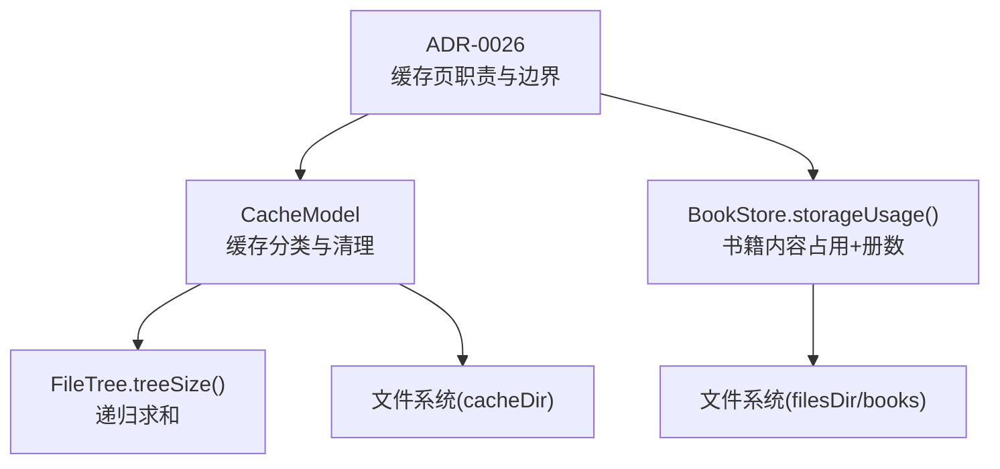
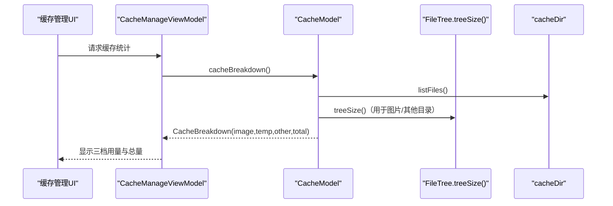
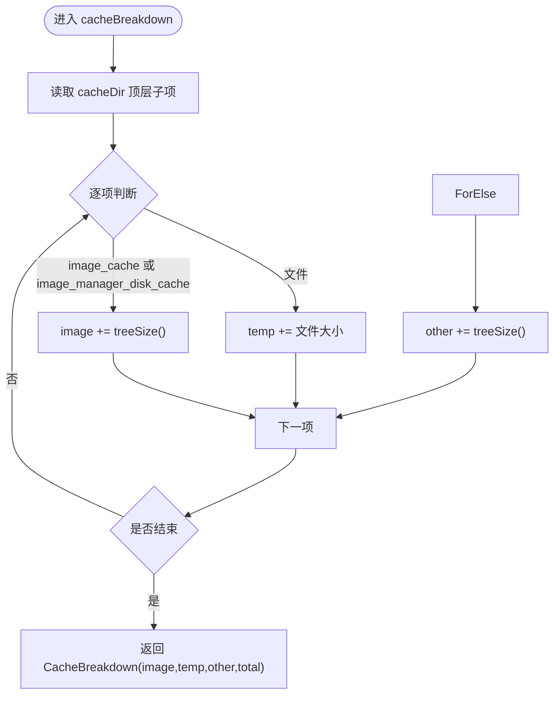
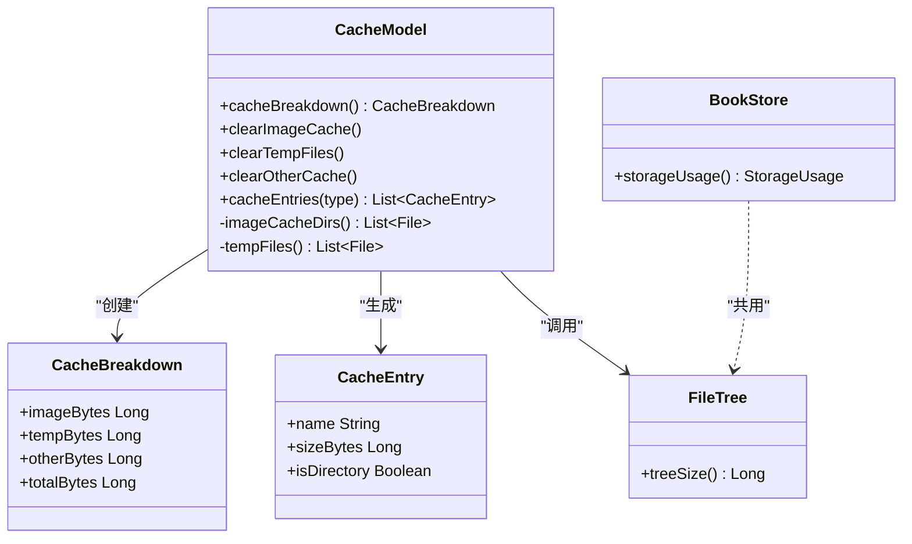

# 缓存分类算法

<cite>
**本文引用的文件**
- [CacheModel.kt](file://module_me/src/main/java/com/ebook/me/repository/CacheModel.kt)
- [CacheModelTest.kt](file://module_me/src/test/java/com/ebook/me/repository/CacheModelTest.kt)
- [BookStore.kt](file://lib_book_common/src/main/java/com/ebook/common/store/BookStore.kt)
- [FileTree.kt](file://lib_book_common/src/main/java/com/ebook/common/util/FileTree.kt)
- [0026-cache-page-usage-scope.md](file://docs/adr/0026-cache-page-usage-scope.md)
</cite>

## 目录
1. [简介](#简介)
2. [项目结构](#项目结构)
3. [核心组件](#核心组件)
4. [架构总览](#架构总览)
5. [详细组件分析](#详细组件分析)
6. [依赖关系分析](#依赖关系分析)
7. [性能考量](#性能考量)
8. [故障排查指南](#故障排查指南)
9. [结论](#结论)
10. [附录](#附录)

## 简介
本文件聚焦「缓存分类算法」，解释 CacheType 枚举的三种分类（IMAGE、TEMP、OTHER）的设计动机与识别规则，说明 cacheBreakdown() 的一次遍历分档累加优化点，并给出如何新增第四种分类、自定义目录识别规则、处理嵌套子目录大小计算的实践方法。同时明确该算法与 BookStore.storageUsage() 的边界划分：书籍内容（filesDir/books）不参与此分类体系，仅由 BookStore 独立统计与呈现。

## 项目结构
缓存分类逻辑集中在 module_me 的 CacheModel；工具树遍历在 lib_book_common 的 FileTree；与书籍内容的边界由 BookStore 定义；相关行为约束记录在 ADR 文档中。

图表来源
- [CacheModel.kt:10-144](file://module_me/src/main/java/com/ebook/me/repository/CacheModel.kt#L10-L144)
- [FileTree.kt:5-16](file://lib_book_common/src/main/java/com/ebook/common/util/FileTree.kt#L5-L16)
- [BookStore.kt:116-139](file://lib_book_common/src/main/java/com/ebook/common/store/BookStore.kt#L116-L139)
- [0026-cache-page-usage-scope.md:1-21](file://docs/adr/0026-cache-page-usage-scope.md#L1-L21)

章节来源
- [CacheModel.kt:10-144](file://module_me/src/main/java/com/ebook/me/repository/CacheModel.kt#L10-L144)
- [FileTree.kt:5-16](file://lib_book_common/src/main/java/com/ebook/common/util/FileTree.kt#L5-L16)
- [BookStore.kt:116-139](file://lib_book_common/src/main/java/com/ebook/common/store/BookStore.kt#L116-L139)
- [0026-cache-page-usage-scope.md:1-21](file://docs/adr/0026-cache-page-usage-scope.md#L1-L21)

## 核心组件
- CacheType 枚举：定义三类缓存 IMAGE、TEMP、OTHER，对应图片缓存、临时文件、其他子目录。
- CacheBreakdown：三档占用字节及总量（总量恒等于三者之和）。
- CacheEntry：明细条目，IMAGE/OTHER 以目录为粒度，TEMP 以文件为粒度。
- CacheModel：实现分类计算、清理与明细列举；封装 IO 于协程 IO 线程。
- FileTree.treeSize()：统一的目录树大小计算。
- BookStore.storageUsage()：书籍内容占用与册数，一次遍历得出，不与缓存分类混用。

章节来源
- [CacheModel.kt:10-43](file://module_me/src/main/java/com/ebook/me/repository/CacheModel.kt#L10-L43)
- [FileTree.kt:5-16](file://lib_book_common/src/main/java/com/ebook/common/util/FileTree.kt#L5-L16)
- [BookStore.kt:116-139](file://lib_book_common/src/main/java/com/ebook/common/store/BookStore.kt#L116-L139)

## 架构总览
缓存管理页将「缓存（cacheDir）」与「书籍内容（filesDir/books）」视为两个独立租户：
- 缓存分类算法只作用于 cacheDir，按 IMAGE/TEMP/OTHER 三档分类展示与清理。
- 书籍内容通过 BookStore.storageUsage() 单独呈现，不计入可清理总量，也不提供删除入口。

图表来源
- [CacheModel.kt:71-92](file://module_me/src/main/java/com/ebook/me/repository/CacheModel.kt#L71-L92)
- [FileTree.kt:15-16](file://lib_book_common/src/main/java/com/ebook/common/util/FileTree.kt#L15-L16)

章节来源
- [CacheModel.kt:71-92](file://module_me/src/main/java/com/ebook/me/repository/CacheModel.kt#L71-L92)
- [FileTree.kt:15-16](file://lib_book_common/src/main/java/com/ebook/common/util/FileTree.kt#L15-L16)

## 详细组件分析

### CacheType 与识别规则
- IMAGE：识别 Coil 的 image_cache 目录与遗留 Glide 目录 image_manager_disk_cache。两者都作为“可安全重下载的图片缓存”。
- TEMP：识别 cacheDir 根目录下的松散文件（如头像裁剪产物 cropped_*.jpg），以文件粒度展示与清理。
- OTHER：除图片缓存外的其余子目录，以目录粒度展示与清理；清理 OTHER 时排除图片目录，避免误删。

设计动机：
- 图片缓存通常由加载库维护，可安全重建；临时文件多为中间产物，无业务意义；其他子目录可能包含数据库、索引等需要谨慎对待的数据。
- 明细粒度区分：图片内部文件名是 hash，对用户无意义，故按目录粒度；临时文件文件名有业务含义，按文件粒度便于用户理解。

章节来源
- [CacheModel.kt:10-18](file://module_me/src/main/java/com/ebook/me/repository/CacheModel.kt#L10-L18)
- [CacheModel.kt:135-143](file://module_me/src/main/java/com/ebook/me/repository/CacheModel.kt#L135-L143)

### cacheBreakdown() 的一次遍历分档累加
旧方案：总量减去图片与临时，存在两次遍历图片目录、并发写入导致负差值需钳位等问题。
新方案：对 cacheDir 顶层子项做一次遍历，分别累加到 image/temp/other 三档，totalBytes = image + temp + other，保证恒等且无负数问题。

图表来源
- [CacheModel.kt:71-92](file://module_me/src/main/java/com/ebook/me/repository/CacheModel.kt#L71-L92)

章节来源
- [CacheModel.kt:71-92](file://module_me/src/main/java/com/ebook/me/repository/CacheModel.kt#L71-L92)

### 私有方法实现细节
- imageCacheDirs()：返回 image_cache 与 image_manager_disk_cache 两个目录列表，用于分类识别与清理。
- tempFiles()：返回 cacheDir 根目录下的所有文件（不含子目录），用于 TEMP 分类的明细与清理。

为何 OTHER 清理要排除图片目录：
- 清理 OTHER 的语义是“清理非图片的其他缓存”，若未排除图片目录，会误删用户可安全重建的图片缓存，违背预期。

章节来源
- [CacheModel.kt:135-143](file://module_me/src/main/java/com/ebook/me/repository/CacheModel.kt#L135-L143)
- [CacheModel.kt:104-110](file://module_me/src/main/java/com/ebook/me/repository/CacheModel.kt#L104-L110)

### 与 BookStore.storageUsage() 的边界
- 缓存分类算法只处理 cacheDir，不包含书籍内容。
- 书籍内容位于 filesDir/books，由 BookStore.storageUsage() 一次遍历给出 bytes 与 bookCount，并在缓存管理页单列呈现，不可清理。
- 这样划分的原因：书籍内容涉及更复杂的生命周期（导入、删除、对账），其统计口径与可清理性均不同于缓存；合并会导致“多入口删书”与“口径不一致”的问题。

章节来源
- [BookStore.kt:116-139](file://lib_book_common/src/main/java/com/ebook/common/store/BookStore.kt#L116-L139)
- [0026-cache-page-usage-scope.md:1-21](file://docs/adr/0026-cache-page-usage-scope.md#L1-L21)

### 新增第四种缓存分类的实践
步骤建议：
1. 扩展 CacheType：新增一个枚举值（例如 PROXY），用于表示新的缓存类别。
2. 修改 cacheBreakdown()：在遍历中加入对新类别的判断分支，将其大小累加到对应字段，并在返回体中增加相应字段以保持总量恒等。
3. 更新明细展示 cacheEntries(type)：为新类型提供明细获取逻辑（可按目录或文件粒度，视业务含义而定）。
4. 新增清理方法：如 clearProxyCache()，根据新类别的规则执行删除。
5. 补充测试：覆盖新类型的识别、统计、清理与边界场景（空目录、并发写入、嵌套子目录等）。

注意：
- 保持 totalBytes = 各分类之和不变。
- 新增目录识别规则应集中在单一位置（类似 imageCacheDirs()），便于维护。
- 对于嵌套子目录的大小计算，统一使用 treeSize()，避免重复实现。

[本节为扩展指导，不直接分析具体代码片段]

### 自定义目录识别规则
- 将识别规则集中到专用方法（如 imageCacheDirs()），返回候选目录集合。
- 在分类与清理逻辑中复用该集合，确保识别与删除口径一致。
- 若某目录既是图片缓存又是其他用途，需在规则层明确优先级与归属。

章节来源
- [CacheModel.kt:135-143](file://module_me/src/main/java/com/ebook/me/repository/CacheModel.kt#L135-L143)

### 嵌套子目录的大小计算
- 统一通过 FileTree.treeSize() 递归计算目录树大小，避免多处实现造成口径差异。
- 在 cacheBreakdown() 中，对图片与其他目录调用 treeSize()，对临时文件直接使用 length()。

章节来源
- [FileTree.kt:5-16](file://lib_book_common/src/main/java/com/ebook/common/util/FileTree.kt#L5-L16)
- [CacheModel.kt:71-92](file://module_me/src/main/java/com/ebook/me/repository/CacheModel.kt#L71-L92)

## 依赖关系分析
- CacheModel 依赖 FileTree.treeSize() 进行递归大小计算。
- CacheModel 依赖文件系统操作（listFiles、length、deleteRecursively），并通过协程 IO 线程执行。
- BookStore 独立负责书籍内容的统计与清理，与缓存分类解耦。

图表来源
- [CacheModel.kt:20-43](file://module_me/src/main/java/com/ebook/me/repository/CacheModel.kt#L20-L43)
- [FileTree.kt:15-16](file://lib_book_common/src/main/java/com/ebook/common/util/FileTree.kt#L15-L16)
- [BookStore.kt:116-139](file://lib_book_common/src/main/java/com/ebook/common/store/BookStore.kt#L116-L139)

章节来源
- [CacheModel.kt:20-43](file://module_me/src/main/java/com/ebook/me/repository/CacheModel.kt#L20-L43)
- [FileTree.kt:15-16](file://lib_book_common/src/main/java/com/ebook/common/util/FileTree.kt#L15-L16)
- [BookStore.kt:116-139](file://lib_book_common/src/main/java/com/ebook/common/store/BookStore.kt#L116-L139)

## 性能考量
- 一次遍历分档累加：相比之前的「总量减图片与临时」差值法，减少了对图片目录的重复遍历，避免了负数钳位与并发写入带来的不一致。
- 统一树遍历：通过 FileTree.treeSize() 统一递归大小计算，避免重复实现与口径分歧。
- 书籍内容与缓存分离：BookStore.storageUsage() 一次遍历给出 bytes 与 bookCount，避免多次扫描同一目录树造成的 IO 开销。

[本节提供通用性能讨论，不直接分析具体代码片段]

## 故障排查指南
常见问题与定位建议：
- 图片缓存未计入：检查 imageCacheDirs() 是否正确返回目标目录，确认目录名匹配（image_cache、image_manager_disk_cache）。
- 临时文件未统计：确认 tempFiles() 仅列出根目录文件，子目录不会被误判为临时文件。
- OTHER 清理误删图片：确保清理 OTHER 时排除图片目录集合。
- 空目录或不存在目录：treeSize() 与 listFiles() 已做空处理，不会抛异常，但需验证返回值为零。
- 并发写入导致数据不一致：采用一次遍历分档累加，降低竞态影响；必要时在 UI 层做刷新重试。

章节来源
- [CacheModelTest.kt:48-61](file://module_me/src/test/java/com/ebook/me/repository/CacheModelTest.kt#L48-L61)
- [CacheModelTest.kt:105-133](file://module_me/src/test/java/com/ebook/me/repository/CacheModelTest.kt#L105-L133)
- [CacheModelTest.kt:148-170](file://module_me/src/test/java/com/ebook/me/repository/CacheModelTest.kt#L148-L170)

## 结论
缓存分类算法通过明确的三类划分（IMAGE、TEMP、OTHER）与一次遍历分档累加，实现了高效、稳定、可维护的缓存统计与清理。与书籍内容的边界清晰，避免职责混淆与潜在风险。新增分类与自定义规则应遵循集中识别、统一计算、充分测试的原则，确保与现有体系兼容。

[本节总结，不直接分析具体代码片段]

## 附录
- 参考 ADR-0026：缓存管理页的职责与边界，强调缓存与书籍内容分离、单次遍历优化。
- 参考 FileTree：统一的目录树大小计算，确保口径一致。
- 参考 BookStore：书籍内容占用与册数的一次遍历统计。

章节来源
- [0026-cache-page-usage-scope.md:1-21](file://docs/adr/0026-cache-page-usage-scope.md#L1-L21)
- [FileTree.kt:5-16](file://lib_book_common/src/main/java/com/ebook/common/util/FileTree.kt#L5-L16)
- [BookStore.kt:116-139](file://lib_book_common/src/main/java/com/ebook/common/store/BookStore.kt#L116-L139)