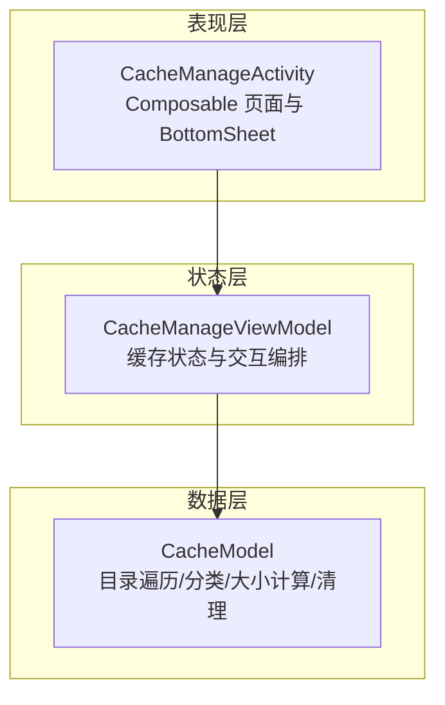
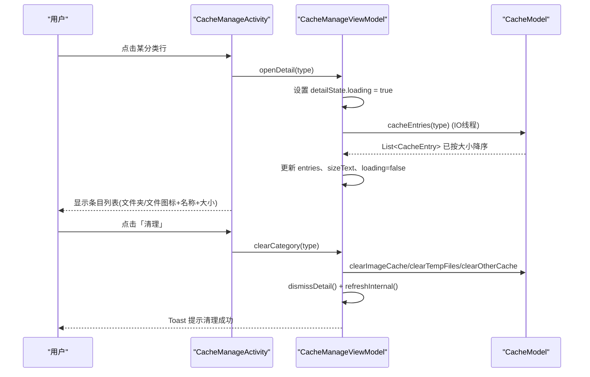
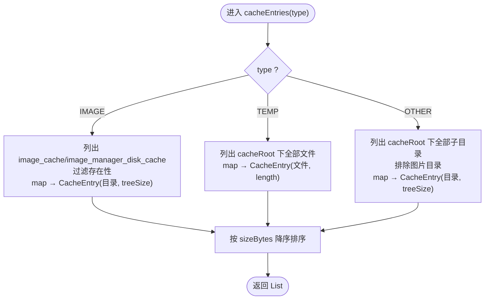
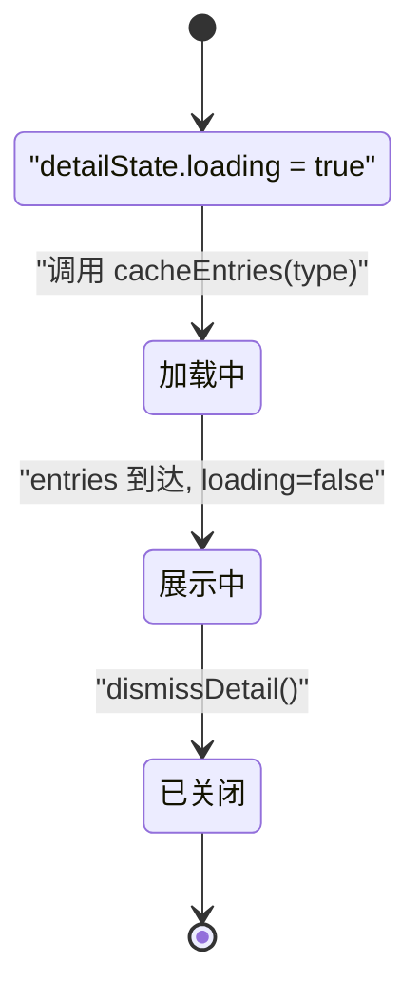
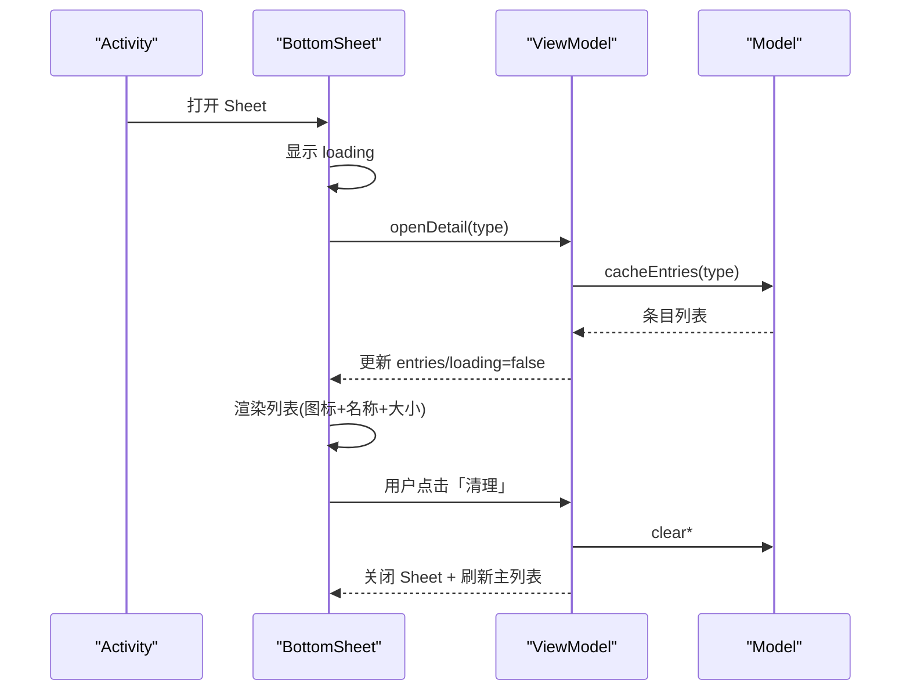
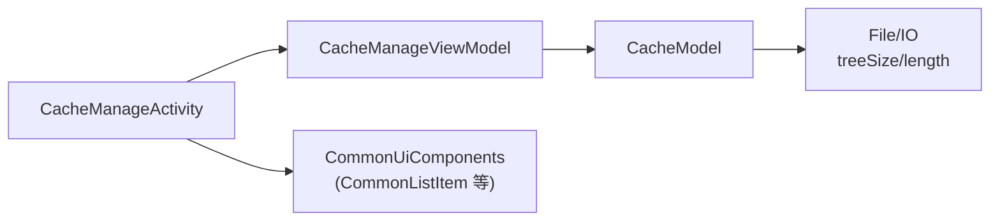

# 缓存明细展示

<cite>
**本文引用的文件**
- [CacheModel.kt](file://module_me/src/main/java/com/ebook/me/repository/CacheModel.kt)
- [CacheManageViewModel.kt](file://module_me/src/main/java/com/ebook/me/mvvm/viewmodel/CacheManageViewModel.kt)
- [CacheManageActivity.kt](file://module_me/src/main/java/com/ebook/me/view/CacheManageActivity.kt)
- [CommonUiComponents.kt](file://lib_book_common/src/main/java/com/ebook/common/ui/CommonUiComponents.kt)
- [CacheModelTest.kt](file://module_me/src/test/java/com/ebook/me/repository/CacheModelTest.kt)
</cite>

## 目录
1. [简介](#简介)
2. [项目结构](#项目结构)
3. [核心组件](#核心组件)
4. [架构总览](#架构总览)
5. [详细组件分析](#详细组件分析)
6. [依赖关系分析](#依赖关系分析)
7. [性能考量](#性能考量)
8. [故障排查指南](#故障排查指南)
9. [结论](#结论)
10. [附录：扩展与示例](#附录：扩展与示例)

## 简介
本文件围绕“缓存明细展示”功能，系统性说明数据模型、状态管理、交互流程与 UI 实现。重点解释 CacheEntry 的字段如何适配不同缓存粒度（IMAGE/OTHER 以目录为粒度；TEMP 以文件为粒度），cacheEntries(type) 的分类与排序逻辑，CacheDetailState 的 loading → 内容切换，以及 BottomSheet 从打开到清理的完整流程。同时给出新增缓存类型、自定义排序、批量选择清理的扩展思路。

## 项目结构
缓存明细功能涉及三层：
- 数据层（Repository）：负责读取本地 cacheDir，按分类统计大小并产出条目列表。
- 状态层（ViewModel）：维护页面与明细弹窗的状态，编排 IO 加载与清理流程。
- 表现层（Activity + Compose）：渲染列表、底部明细弹窗、图标与大小格式化展示。

图表来源
- [CacheManageActivity.kt:119-271](file://module_me/src/main/java/com/ebook/me/view/CacheManageActivity.kt#L119-L271)
- [CacheManageViewModel.kt:42-185](file://module_me/src/main/java/com/ebook/me/mvvm/viewmodel/CacheManageViewModel.kt#L42-L185)
- [CacheModel.kt:57-143](file://module_me/src/main/java/com/ebook/me/repository/CacheModel.kt#L57-L143)

章节来源
- [CacheManageActivity.kt:119-271](file://module_me/src/main/java/com/ebook/me/view/CacheManageActivity.kt#L119-L271)
- [CacheManageViewModel.kt:42-185](file://module_me/src/main/java/com/ebook/me/mvvm/viewmodel/CacheManageViewModel.kt#L42-L185)
- [CacheModel.kt:57-143](file://module_me/src/main/java/com/ebook/me/repository/CacheModel.kt#L57-L143)

## 核心组件
- CacheType：缓存分类枚举（IMAGE、TEMP、OTHER），决定明细粒度与清理范围。
- CacheBreakdown：一次遍历得到的三档占用统计，totalBytes 恒等于三者之和。
- CacheEntry：明细条目，包含 name、sizeBytes、isDirectory。
- CacheModel：提供 cacheSizeBytes、cacheBreakdown、cacheEntries、各类 clear* 方法。
- CacheManageViewModel：维护 CacheUiState 与 CacheDetailState，处理打开明细、加载条目、清理等。
- CacheManageActivity：Compose 页面与 ModalBottomSheet 渲染，使用 CommonListItem、图标与大小格式化。

章节来源
- [CacheModel.kt:10-43](file://module_me/src/main/java/com/ebook/me/repository/CacheModel.kt#L10-L43)
- [CacheManageViewModel.kt:23-79](file://module_me/src/main/java/com/ebook/me/mvvm/viewmodel/CacheManageViewModel.kt#L23-L79)
- [CacheManageActivity.kt:119-398](file://module_me/src/main/java/com/ebook/me/view/CacheManageActivity.kt#L119-L398)

## 架构总览
下图展示从用户点击分类到明细加载完成再到清理执行的端到端调用链。

图表来源
- [CacheManageActivity.kt:119-271](file://module_me/src/main/java/com/ebook/me/view/CacheManageActivity.kt#L119-L271)
- [CacheManageViewModel.kt:90-167](file://module_me/src/main/java/com/ebook/me/mvvm/viewmodel/CacheManageViewModel.kt#L90-L167)
- [CacheModel.kt:118-143](file://module_me/src/main/java/com/ebook/me/repository/CacheModel.kt#L118-L143)

## 详细组件分析

### 数据模型与粒度策略：CacheEntry 与 CacheType
- CacheType.IMAGE / OTHER：以目录为粒度。因为图片缓存内部文件名是 hash，对用户无意义；OTHER 也按子目录展示，便于用户理解占用主体。
- CacheType.TEMP：以文件为粒度。根目录松散文件如 cropped_xxx.jpg 有业务含义，直接展示文件更直观。
- CacheEntry 字段：
  - name：目录名或文件名。
  - sizeBytes：目录递归大小或文件大小。
  - isDirectory：区分图标与交互语义（文件夹 vs 文件）。

章节来源
- [CacheModel.kt:10-43](file://module_me/src/main/java/com/ebook/me/repository/CacheModel.kt#L10-L43)
- [CacheModelTest.kt:63-87](file://module_me/src/test/java/com/ebook/me/repository/CacheModelTest.kt#L63-L87)

### 分类与排序：cacheEntries(type)
- IMAGE：扫描 image_cache 与 image_manager_disk_cache 两个目录，过滤不存在后映射为目录级条目。
- TEMP：扫描 cacheRoot 下所有文件，映射为文件级条目。
- OTHER：排除图片目录后的其余子目录，映射为目录级条目。
- 排序：统一按 sizeBytes 降序，优先展示占用大的项，帮助用户快速定位。

图表来源
- [CacheModel.kt:118-133](file://module_me/src/main/java/com/ebook/me/repository/CacheModel.kt#L118-L133)

章节来源
- [CacheModel.kt:118-133](file://module_me/src/main/java/com/ebook/me/repository/CacheModel.kt#L118-L133)
- [CacheModelTest.kt:89-103](file://module_me/src/test/java/com/ebook/me/repository/CacheModelTest.kt#L89-L103)

### 状态管理：CacheDetailState 与 Loading 态
- 打开明细时先置 loading=true，并在 IO 线程执行 cacheEntries(type)。
- 加载完成后覆盖 entries、sizeText（精确合计）、loading=false。
- 若用户关闭了 Sheet 又打开新分类，仅当当前 state.type 匹配时才更新，避免竞态覆盖。

图表来源
- [CacheManageViewModel.kt:90-105](file://module_me/src/main/java/com/ebook/me/mvvm/viewmodel/CacheManageViewModel.kt#L90-L105)

章节来源
- [CacheManageViewModel.kt:90-105](file://module_me/src/main/java/com/ebook/me/mvvm/viewmodel/CacheManageViewModel.kt#L90-L105)

### BottomSheet 交互流程
- 打开：显示分类标题与描述，顶部进度指示器（CircularProgressIndicator）。
- IO 加载：在后台线程读取目录/文件，完成后切换为具体条目列表。
- 列表：按大小降序，文件夹用 Folder 图标，文件用 Description 图标，右侧显示格式化大小。
- 清理：用户确认后触发对应 clear* 方法，关闭 Sheet 并刷新主列表。

图表来源
- [CacheManageActivity.kt:278-398](file://module_me/src/main/java/com/ebook/me/view/CacheManageActivity.kt#L278-L398)
- [CacheManageViewModel.kt:90-167](file://module_me/src/main/java/com/ebook/me/mvvm/viewmodel/CacheManageViewModel.kt#L90-L167)

章节来源
- [CacheManageActivity.kt:278-398](file://module_me/src/main/java/com/ebook/me/view/CacheManageActivity.kt#L278-L398)
- [CacheManageViewModel.kt:90-167](file://module_me/src/main/java/com/ebook/me/mvvm/viewmodel/CacheManageViewModel.kt#L90-L167)

### UI 层实现要点
- 列表项：使用 CommonListItem 呈现分类入口，含彩色图标容器、标题、尾部大小文本与箭头。
- 图标选择：
  - 分类入口：根据 CacheType 映射不同图标（Image/Description/FolderOpen）。
  - 明细条目：isDirectory 为 true 使用 Folder，否则 Description。
- 大小格式化：通过 formatSize 将字节数转换为可读字符串。
- 空态与占位：totalText 为空串表示计算中；detailState.sizeText 为空串同理；empty 列表显示友好文案。

章节来源
- [CacheManageActivity.kt:119-271](file://module_me/src/main/java/com/ebook/me/view/CacheManageActivity.kt#L119-L271)
- [CacheManageActivity.kt:278-398](file://module_me/src/main/java/com/ebook/me/view/CacheManageActivity.kt#L278-L398)
- [CommonUiComponents.kt:164-228](file://lib_book_common/src/main/java/com/ebook/common/ui/CommonUiComponents.kt#L164-L228)

## 依赖关系分析
- ViewModel 依赖 Model 提供数据与清理能力；Activity 仅负责组合 UI 与事件派发。
- 共享 UI 组件集中在 lib_book_common，确保全仓视觉一致与可复用。
- 测试用例以纯 JVM 临时目录验证分类口径、粒度与排序，保证规则稳定。

图表来源
- [CacheManageActivity.kt:119-271](file://module_me/src/main/java/com/ebook/me/view/CacheManageActivity.kt#L119-L271)
- [CacheManageViewModel.kt:36-79](file://module_me/src/main/java/com/ebook/me/mvvm/viewmodel/CacheManageViewModel.kt#L36-L79)
- [CacheModel.kt:57-143](file://module_me/src/main/java/com/ebook/me/repository/CacheModel.kt#L57-L143)
- [CommonUiComponents.kt:164-228](file://lib_book_common/src/main/java/com/ebook/common/ui/CommonUiComponents.kt#L164-L228)

章节来源
- [CacheManageActivity.kt:119-271](file://module_me/src/main/java/com/ebook/me/view/CacheManageActivity.kt#L119-L271)
- [CacheManageViewModel.kt:36-79](file://module_me/src/main/java/com/ebook/me/mvvm/viewmodel/CacheManageViewModel.kt#L36-L79)
- [CacheModel.kt:57-143](file://module_me/src/main/java/com/ebook/me/repository/CacheModel.kt#L57-L143)
- [CommonUiComponents.kt:164-228](file://lib_book_common/src/main/java/com/ebook/common/ui/CommonUiComponents.kt#L164-L228)

## 性能考量
- 一次遍历分档累加：cacheBreakdown 对 root 的子项只走一遍，分别计入 image/temp/other，避免重复遍历与负差值钳位问题。
- 明细加载在 IO 线程执行，避免阻塞 UI。
- 列表按大小降序，帮助快速定位大对象，提升清理效率。
- 清理操作幂等：目录不存在或删除后再次删除无副作用，但 VM 通过闸门防止重复编排与重复提示。

章节来源
- [CacheModel.kt:71-92](file://module_me/src/main/java/com/ebook/me/repository/CacheModel.kt#L71-L92)
- [CacheManageViewModel.kt:117-167](file://module_me/src/main/java/com/ebook/me/mvvm/viewmodel/CacheManageViewModel.kt#L117-L167)

## 故障排查指南
- 明细不显示：检查 detailState.loading 是否仍为 true；确认 cacheEntries(type) 是否返回空列表。
- 大小异常：核对 cacheBreakdown 与 entries.sumOf 是否一致；确认 image_dirs 识别正确。
- 清理无效：确认调用了正确的 clear* 方法；注意 clearOtherCache 不会删除图片目录。
- 空目录或不存在：CacheModel 对缺失目录按零处理，不抛异常；确认根目录仍存在。

章节来源
- [CacheModel.kt:61-69](file://module_me/src/main/java/com/ebook/me/repository/CacheModel.kt#L61-L69)
- [CacheModel.kt:104-110](file://module_me/src/main/java/com/ebook/me/repository/CacheModel.kt#L104-L110)
- [CacheModelTest.kt:148-170](file://module_me/src/test/java/com/ebook/me/repository/CacheModelTest.kt#L148-L170)

## 结论
缓存明细展示通过清晰的分类、合理的粒度与直观的 UI，让用户能快速理解并清理占用空间。数据层一次遍历分档、状态层严谨的 loading 流转、UI 层的统一组件与格式化，共同保证了体验与性能的平衡。扩展新的缓存类型或调整排序规则时，应遵循现有模式，保持分类口径与 UI 语义一致。

## 附录：扩展与示例

### 新增一种缓存类型的展示
步骤建议：
- 在 CacheType 中新增枚举值（例如 NEW_TYPE）。
- 在 CacheModel.cacheEntries(type) 的 when 分支中增加 NEW_TYPE 的采集逻辑（决定目录/文件粒度与大小计算方式）。
- 在 CacheManageViewModel.refreshInternal 的 items 构造中加入 NEW_TYPE 的分类统计。
- 在 Activity 的 categoryIcon/categoryColors/categoryTitleRes 等处补充 NEW_TYPE 的 UI 映射。
- 在测试中补充分类与排序断言。

参考路径
- [CacheModel.kt:11-18](file://module_me/src/main/java/com/ebook/me/repository/CacheModel.kt#L11-L18)
- [CacheModel.kt:118-133](file://module_me/src/main/java/com/ebook/me/repository/CacheModel.kt#L118-L133)
- [CacheManageViewModel.kt:170-185](file://module_me/src/main/java/com/ebook/me/mvvm/viewmodel/CacheManageViewModel.kt#L170-L185)
- [CacheManageActivity.kt:392-416](file://module_me/src/main/java/com/ebook/me/view/CacheManageActivity.kt#L392-L416)
- [CacheModelTest.kt:48-61](file://module_me/src/test/java/com/ebook/me/repository/CacheModelTest.kt#L48-L61)

### 自定义条目排序规则
- 当前默认按 sizeBytes 降序，便于快速定位大项。
- 如需按名称或其他字段排序，可在 CacheModel.cacheEntries 返回前对 entries 进行二次排序（例如 sortedByDescending { it.name }）。
- 建议在测试中覆盖新排序逻辑，确保边界情况（空列表、同名不同大小）符合预期。

参考路径
- [CacheModel.kt:118-133](file://module_me/src/main/java/com/ebook/me/repository/CacheModel.kt#L118-L133)
- [CacheModelTest.kt:89-103](file://module_me/src/test/java/com/ebook/me/repository/CacheModelTest.kt#L89-L103)

### 实现批量选择清理功能
思路建议：
- 在 DetailState 中增加 entries 的选择集合（例如 Set<String> 或 Map<String, Boolean>）。
- UI 层为每个条目添加勾选控件，支持全选/反选。
- 清理按钮改为“清理选中”，根据选中集合调用对应的删除接口（文件直接删除；目录递归删除）。
- 清理完成后刷新 entries 与 total 大小。
- 注意并发与幂等：删除失败需提示并保留未删除项；重复点击由闸门保护。

参考路径
- [CacheManageViewModel.kt:61-79](file://module_me/src/main/java/com/ebook/me/mvvm/viewmodel/CacheManageViewModel.kt#L61-L79)
- [CacheManageViewModel.kt:117-167](file://module_me/src/main/java/com/ebook/me/mvvm/viewmodel/CacheManageViewModel.kt#L117-L167)
- [CacheManageActivity.kt:278-398](file://module_me/src/main/java/com/ebook/me/view/CacheManageActivity.kt#L278-L398)
- [CacheModel.kt:94-110](file://module_me/src/main/java/com/ebook/me/repository/CacheModel.kt#L94-L110)