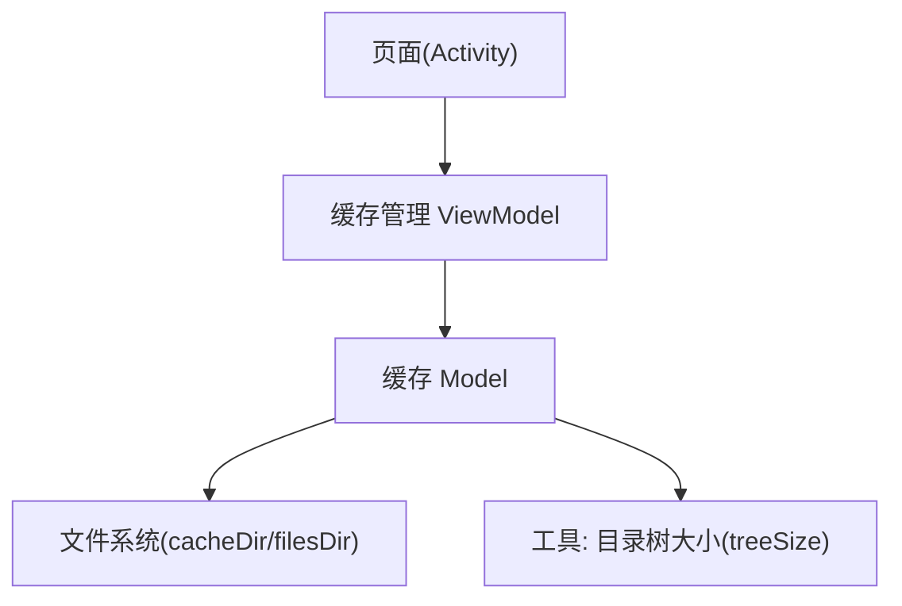
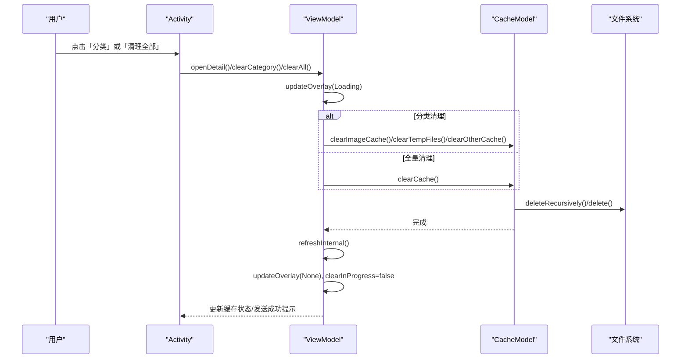
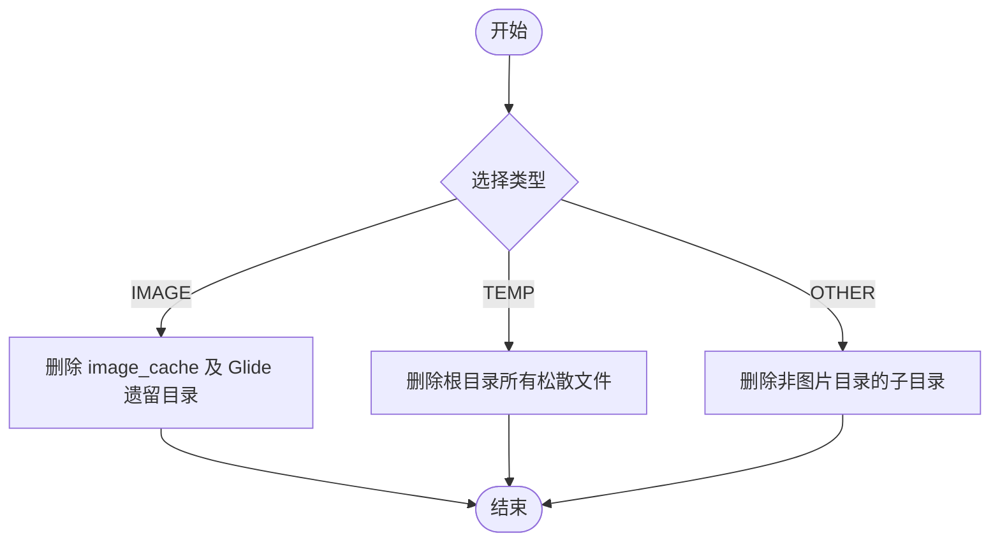
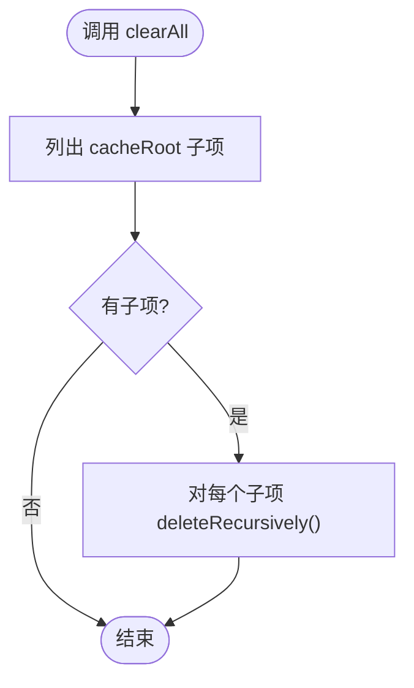
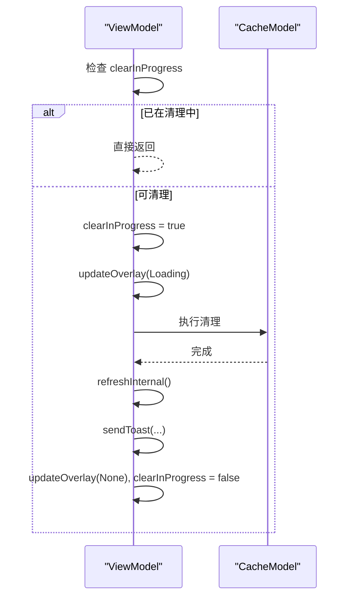
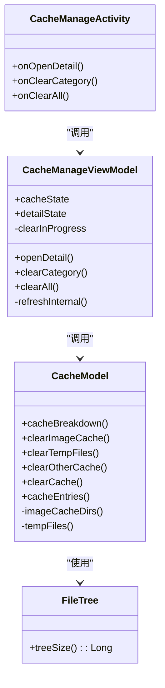

# 缓存清理操作

<cite>
**本文引用的文件**
- [CacheModel.kt](file://module_me/src/main/java/com/ebook/me/repository/CacheModel.kt)
- [CacheManageViewModel.kt](file://module_me/src/main/java/com/ebook/me/mvvm/viewmodel/CacheManageViewModel.kt)
- [CacheManageActivity.kt](file://module_me/src/main/java/com/ebook/me/view/CacheManageActivity.kt)
- [FileTree.kt](file://lib_book_common/src/main/java/com/ebook/common/util/FileTree.kt)
- [CacheManageViewModelTest.kt](file://module_me/src/test/java/com/ebook/me/mvvm/viewmodel/CacheManageViewModelTest.kt)
</cite>

## 目录
1. [简介](#简介)
2. [项目结构](#项目结构)
3. [核心组件](#核心组件)
4. [架构总览](#架构总览)
5. [详细组件分析](#详细组件分析)
6. [依赖关系分析](#依赖关系分析)
7. [性能考量](#性能考量)
8. [故障排查指南](#故障排查指南)
9. [结论](#结论)
10. [附录：扩展实践](#附录：扩展实践)

## 简介
本文件围绕“缓存清理”这一功能，系统化说明三类分类清理（图片缓存、临时文件、其他缓存）与全量清理的实现方式、状态编排、并发安全与幂等性保证，并给出扩展新清理策略、二次确认与选择性清理的落地示例。该能力位于“我的”模块中，由 ViewModel 负责编排 UI 状态与提示，Model 层专注文件系统 IO，Activity 负责用户交互与页面呈现。

## 项目结构
缓存清理相关代码主要分布在以下位置：
- Model 层：缓存统计与清理逻辑（纯文件 IO，IO 线程切换）
- ViewModel 层：分类展示、详情 BottomSheet、清理闸门、成功提示与重新统计
- Activity 层：页面展示、二次确认弹窗、BottomSheet 交互
- 工具层：递归目录大小计算

图表来源
- [CacheManageActivity.kt:86-113](file://module_me/src/main/java/com/ebook/me/view/CacheManageActivity.kt#L86-L113)
- [CacheManageViewModel.kt:36-40](file://module_me/src/main/java/com/ebook/me/mvvm/viewmodel/CacheManageViewModel.kt#L36-L40)
- [CacheModel.kt:57-69](file://module_me/src/main/java/com/ebook/me/repository/CacheModel.kt#L57-L69)
- [FileTree.kt:15-16](file://lib_book_common/src/main/java/com/ebook/common/util/FileTree.kt#L15-L16)

章节来源
- [CacheManageActivity.kt:65-113](file://module_me/src/main/java/com/ebook/me/view/CacheManageActivity.kt#L65-L113)
- [CacheManageViewModel.kt:23-40](file://module_me/src/main/java/com/ebook/me/mvvm/viewmodel/CacheManageViewModel.kt#L23-L40)
- [CacheModel.kt:10-69](file://module_me/src/main/java/com/ebook/me/repository/CacheModel.kt#L10-L69)
- [FileTree.kt:5-16](file://lib_book_common/src/main/java/com/ebook/common/util/FileTree.kt#L5-L16)

## 核心组件
- CacheModel：封装缓存根目录 cacheRoot 的所有统计与清理方法；按三类进行分档统计与删除；所有 IO 通过协程切换到 IO 线程执行。
- CacheManageViewModel：对外暴露分类统计、明细打开/关闭、分类清理与全量清理；维护 clearInProgress 闸门防止重复编排；使用 updateOverlay(Loading) 显示等待态，成功后调用 refreshInternal() 重算并 sendToast() 下发提示。
- CacheManageActivity：页面展示总占用、分类项、书籍内容行（不参与清理），底部提供“清理全部”按钮并带二次确认弹窗；分类明细以 BottomSheet 展示，内部提供“清理”按钮。
- FileTree.treeSize：统一的目录树大小计算入口，空目录或不存在时返回 0，避免 UI 特判。

章节来源
- [CacheModel.kt:10-144](file://module_me/src/main/java/com/ebook/me/repository/CacheModel.kt#L10-L144)
- [CacheManageViewModel.kt:41-186](file://module_me/src/main/java/com/ebook/me/mvvm/viewmodel/CacheManageViewModel.kt#L41-L186)
- [CacheManageActivity.kt:65-113](file://module_me/src/main/java/com/ebook/me/view/CacheManageActivity.kt#L65-L113)
- [FileTree.kt:5-16](file://lib_book_common/src/main/java/com/ebook/common/util/FileTree.kt#L5-L16)

## 架构总览
下图展示了从页面到模型再到文件系统的完整调用链，以及清理后的状态刷新流程。

图表来源
- [CacheManageActivity.kt:86-113](file://module_me/src/main/java/com/ebook/me/view/CacheManageActivity.kt#L86-L113)
- [CacheManageViewModel.kt:131-167](file://module_me/src/main/java/com/ebook/me/mvvm/viewmodel/CacheManageViewModel.kt#L131-L167)
- [CacheModel.kt:66-110](file://module_me/src/main/java/com/ebook/me/repository/CacheModel.kt#L66-L110)

## 详细组件分析

### 分类清理策略
- 图片缓存（IMAGE）
  - 目标：删除 Coil 磁盘缓存目录（image_cache）以及老版本遗留的 Glide 缓存目录（image_manager_disk_cache）。
  - 实现：遍历 imageCacheDirs() 列出的目录并逐一删除。
  - 依据：图片缓存目录集合定义于 imageCacheDirs()。
- 临时文件（TEMP）
  - 目标：删除 cacheDir 根目录下的所有松散文件（如头像裁剪产物）。
  - 实现：收集根目录下所有普通文件并逐一删除。
- 其他缓存（OTHER）
  - 目标：删除除图片缓存目录以外的所有子目录（根目录松散文件归 TEMP 不在此处处理）。
  - 实现：先识别图片缓存目录集合，再遍历子目录，排除图片目录后删除。

图表来源
- [CacheModel.kt:94-110](file://module_me/src/main/java/com/ebook/me/repository/CacheModel.kt#L94-L110)
- [CacheModel.kt:135-143](file://module_me/src/main/java/com/ebook/me/repository/CacheModel.kt#L135-L143)

章节来源
- [CacheModel.kt:94-110](file://module_me/src/main/java/com/ebook/me/repository/CacheModel.kt#L94-L110)
- [CacheModel.kt:135-143](file://module_me/src/main/java/com/ebook/me/repository/CacheModel.kt#L135-L143)

### 全量清理 clearAll()
- 行为：删除 cacheRoot 下全部子项，但保留根目录本身（即不会删除 cacheDir 自身）。
- 实现：获取 root 子项列表并逐个调用 deleteRecursively()。
- 结果：UI 侧在完成后会重新统计，确保总数与分类归零。

图表来源
- [CacheModel.kt:66-69](file://module_me/src/main/java/com/ebook/me/repository/CacheModel.kt#L66-L69)

章节来源
- [CacheModel.kt:66-69](file://module_me/src/main/java/com/ebook/me/repository/CacheModel.kt#L66-L69)

### 清理操作的幂等性
- 为什么无副作用：当目录已不存在时，deleteRecursively() 直接返回且不会产生异常或副作用；因此重复触发清理是安全的。
- 影响：VM 层的闸门主要防止的是重复编排与重复提示，而非重复删除带来的数据损坏。

章节来源
- [CacheManageViewModel.kt:116-122](file://module_me/src/main/java/com/ebook/me/mvvm/viewmodel/CacheManageViewModel.kt#L116-L122)
- [CacheModel.kt:66-69](file://module_me/src/main/java/com/ebook/me/repository/CacheModel.kt#L66-L69)

### ViewModel 层的清理闸门机制
- 标志位：clearInProgress 用于防止重复点击导致的重复清理编排与重复成功提示。
- 流程：
  - 进入清理前检查标志位，若已在进行中则直接返回。
  - 设置标志位为 true，挂起加载覆盖层 updateOverlay(Loading)。
  - 执行对应清理方法（分类或全量）。
  - 调用 refreshInternal() 重新统计，sendToast() 下发成功提示。
  - finally 块内重置覆盖层与标志位，确保异常路径也能恢复。

图表来源
- [CacheManageViewModel.kt:116-167](file://module_me/src/main/java/com/ebook/me/mvvm/viewmodel/CacheManageViewModel.kt#L116-L167)

章节来源
- [CacheManageViewModel.kt:116-167](file://module_me/src/main/java/com/ebook/me/mvvm/viewmodel/CacheManageViewModel.kt#L116-L167)

### 清理流程的状态管理
- 等待态：updateOverlay(Overlay.Loading) 在清理期间显示等待界面，避免用户误以为无响应。
- 重新统计：refreshInternal() 同时计算三类缓存总量与书籍内容占用（后者不参与清理），并填充 UI 状态。
- 成功提示：sendToast() 下发文案资源，告知用户清理结果（分类清理与全量清理各有不同文案）。

章节来源
- [CacheManageViewModel.kt:131-167](file://module_me/src/main/java/com/ebook/me/mvvm/viewmodel/CacheManageViewModel.kt#L131-L167)
- [CacheManageViewModel.kt:169-185](file://module_me/src/main/java/com/ebook/me/mvvm/viewmodel/CacheManageViewModel.kt#L169-L185)

### 并发安全考虑
- 协程作用域隔离：清理逻辑均在 viewModelScope.launch 中执行，避免与页面生命周期耦合问题。
- IO 线程：Model 层统一使用 withContext(Dispatchers.IO) 执行文件操作，防止阻塞主线程。
- 文件系统原子性：单个文件的 delete() 与目录的 deleteRecursively() 在单点上是原子的；整体清理过程通过顺序遍历保证一致性。
- 异常处理：清理流程使用 try/finally 包裹，确保无论成功或失败都能关闭覆盖层并释放闸门标志。

章节来源
- [CacheModel.kt:61-110](file://module_me/src/main/java/com/ebook/me/repository/CacheModel.kt#L61-L110)
- [CacheManageViewModel.kt:131-167](file://module_me/src/main/java/com/ebook/me/mvvm/viewmodel/CacheManageViewModel.kt#L131-L167)

## 依赖关系分析
- Activity 依赖 ViewModel 暴露的接口（openDetail/clearCategory/clearAll），并通过 Compose 收集状态。
- ViewModel 依赖 CacheModel 提供的统计与清理方法，以及 BookStore 读取书籍内容占用。
- Model 依赖 FileTree 的工具函数 treeSize() 计算目录树大小。
- 测试验证了书籍内容不参与可清理总量，以及清理全部不影响书籍文件。

图表来源
- [CacheManageActivity.kt:86-113](file://module_me/src/main/java/com/ebook/me/view/CacheManageActivity.kt#L86-L113)
- [CacheManageViewModel.kt:36-40](file://module_me/src/main/java/com/ebook/me/mvvm/viewmodel/CacheManageViewModel.kt#L36-L40)
- [CacheModel.kt:57-69](file://module_me/src/main/java/com/ebook/me/repository/CacheModel.kt#L57-L69)
- [FileTree.kt:15-16](file://lib_book_common/src/main/java/com/ebook/common/util/FileTree.kt#L15-L16)

章节来源
- [CacheManageViewModelTest.kt:92-130](file://module_me/src/test/java/com/ebook/me/mvvm/viewmodel/CacheManageViewModelTest.kt#L92-L130)

## 性能考量
- 一次遍历分档：cacheBreakdown() 在一次遍历中将条目归类到 IMAGE/TEMP/OTHER，避免多次扫描与负差值钳位，减少 I/O 次数。
- 目录树大小计算：treeSize() 递归累加普通文件大小，忽略目录 inode 大小，符合用户对“占用空间”的直觉。
- 大目录清理：清理过程可能耗时较长，需配合 Loading 覆盖层提升用户体验。

章节来源
- [CacheModel.kt:71-92](file://module_me/src/main/java/com/ebook/me/repository/CacheModel.kt#L71-L92)
- [FileTree.kt:5-16](file://lib_book_common/src/main/java/com/ebook/common/util/FileTree.kt#L5-L16)

## 故障排查指南
- 现象：点击清理无反应
  - 可能原因：清理仍在进行中（clearInProgress=true），或 IO 线程尚未完成
  - 处理：等待 Loading 覆盖层消失；查看日志确认是否抛出异常
- 现象：清理后状态未刷新
  - 可能原因：refreshInternal() 未被调用或处于异步未完成状态
  - 处理：检查 ViewModel 的清理流程是否完整执行到 refreshInternal()
- 现象：书籍文件被误删
  - 可能原因：错误地使用了全量清理作用于 books 目录
  - 处理：确认 clearAll() 仅针对 cacheRoot；测试用例已断言书籍不受影响

章节来源
- [CacheManageViewModel.kt:131-167](file://module_me/src/main/java/com/ebook/me/mvvm/viewmodel/CacheManageViewModel.kt#L131-L167)
- [CacheManageViewModelTest.kt:108-121](file://module_me/src/test/java/com/ebook/me/mvvm/viewmodel/CacheManageViewModelTest.kt#L108-L121)

## 结论
缓存清理功能通过清晰的职责划分与稳健的状态编排实现了安全可靠的清理体验。Model 层专注 IO，ViewModel 层负责编排与提示，Activity 层提供友好的交互。幂等性与闸门机制确保了重复点击的安全性与一致性。未来可按需扩展新的清理策略，并保持与现有架构一致。

## 附录：扩展实践

### 新增一种清理策略
- 步骤
  - 在 CacheType 枚举中添加新类型（例如 CACHE_THIRD）
  - 在 CacheModel 中新增对应的清理方法（例如 clearThirdCache()），明确目标目录或文件集合
  - 在 ViewModel 的分类清理分支中接入新方法
  - 在 Activity 中为新增类型提供 UI 入口与说明
- 参考路径
  - [CacheModel.kt:94-110](file://module_me/src/main/java/com/ebook/me/repository/CacheModel.kt#L94-L110)
  - [CacheManageViewModel.kt:131-141](file://module_me/src/main/java/com/ebook/me/mvvm/viewmodel/CacheManageViewModel.kt#L131-L141)
  - [CacheManageActivity.kt:168-184](file://module_me/src/main/java/com/ebook/me/view/CacheManageActivity.kt#L168-L184)

### 添加清理前的二次确认
- 全量清理已有二次确认弹窗（AlertDialog），分类清理默认无二次确认（因用户在 BottomSheet 已看清内容）
- 如需对某分类也增加二次确认，可在 Activity 中为该分类打开确认后回调 ViewModel 的 clearCategory()
- 参考路径
  - [CacheManageActivity.kt:250-270](file://module_me/src/main/java/com/ebook/me/view/CacheManageActivity.kt#L250-L270)

### 实现选择性清理特定目录或文件
- 方案一：在 CacheModel.cacheEntries(type) 基础上，让用户勾选具体条目后批量删除
- 方案二：新增参数传入目标集合，在清理方法中仅删除指定条目
- 注意：保持幂等性，确保删除目标不存在时无副作用
- 参考路径
  - [CacheModel.kt:118-133](file://module_me/src/main/java/com/ebook/me/repository/CacheModel.kt#L118-L133)