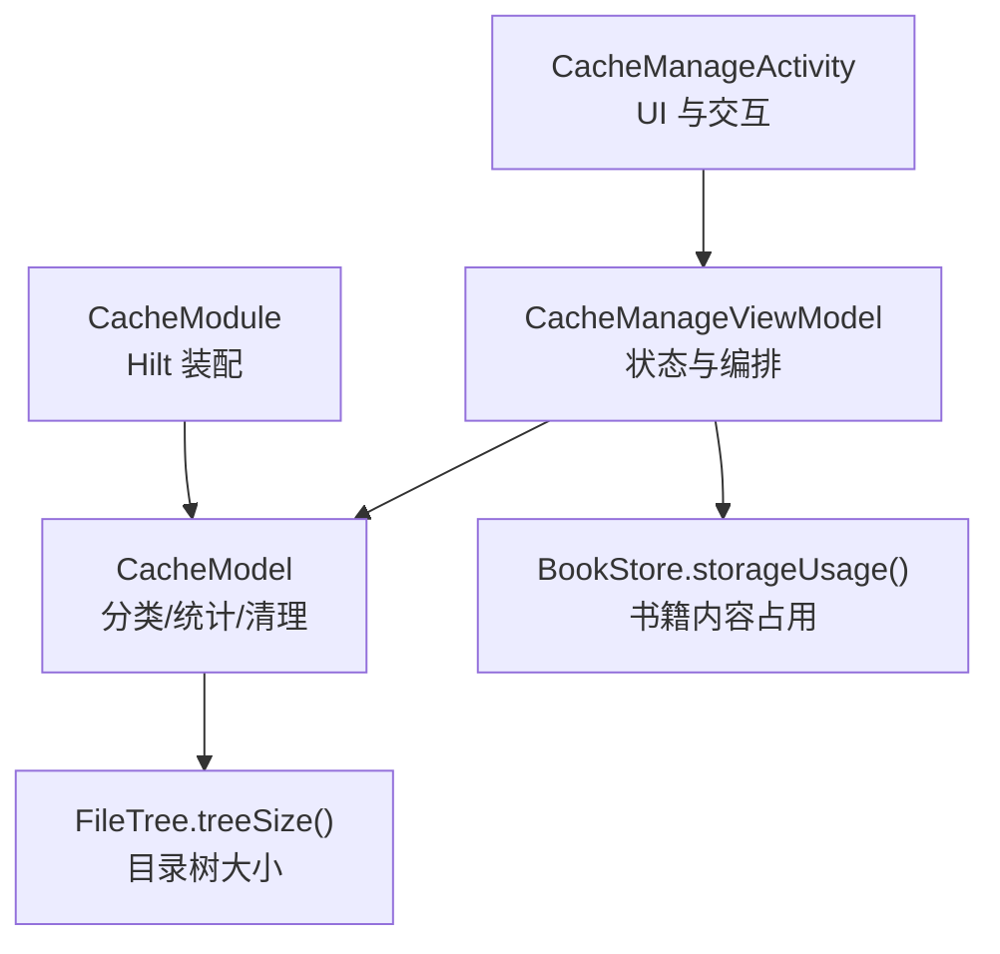
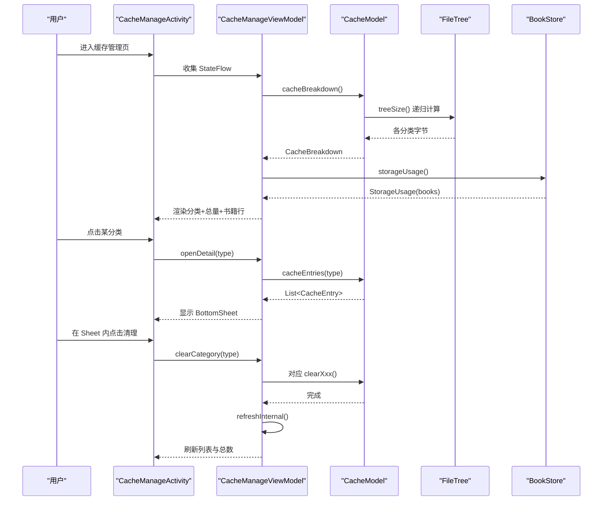
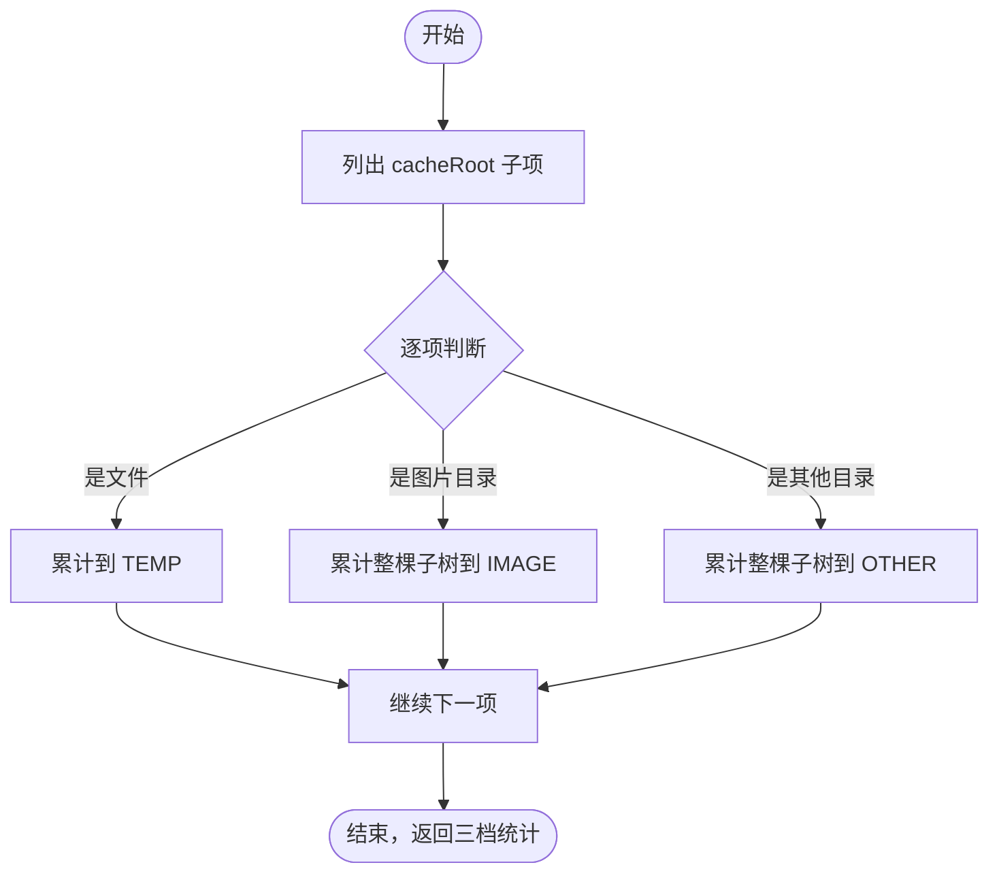
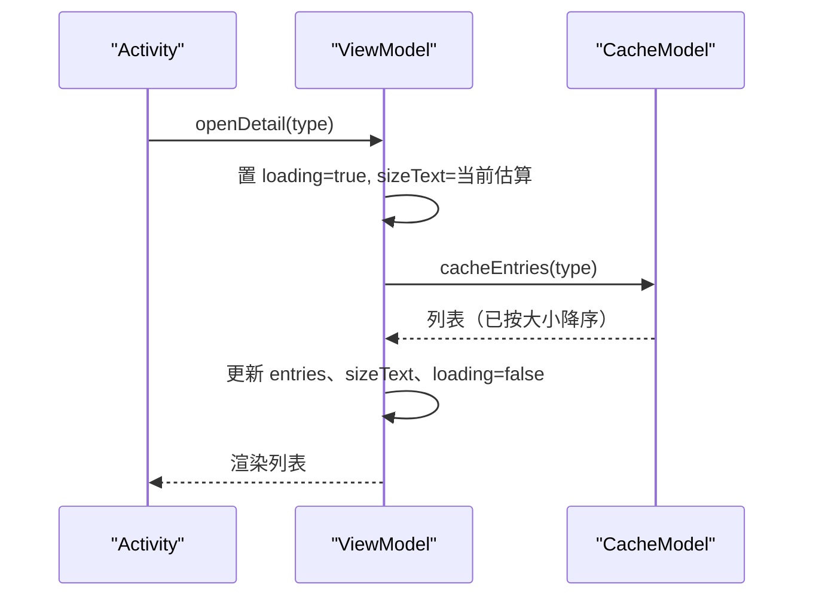
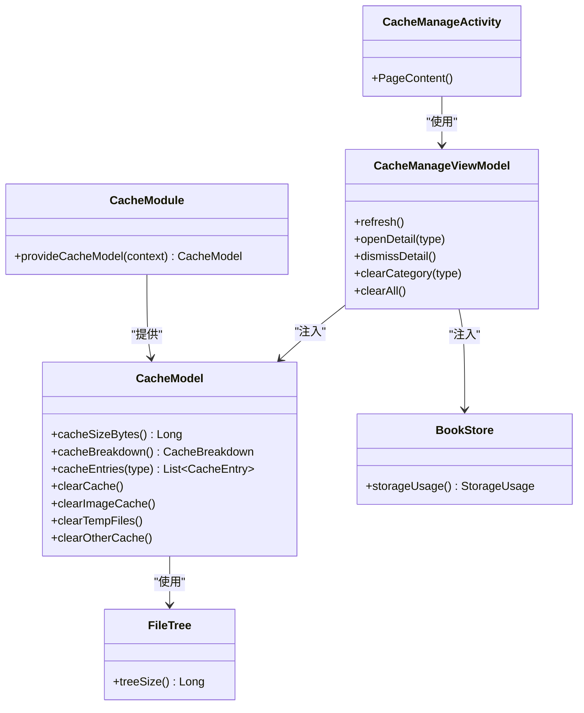

# 缓存管理系统

<cite>
**本文引用的文件**   
- [CacheModel.kt](file://module_me/src/main/java/com/ebook/me/repository/CacheModel.kt)
- [CacheManageViewModel.kt](file://module_me/src/main/java/com/ebook/me/mvvm/viewmodel/CacheManageViewModel.kt)
- [CacheManageActivity.kt](file://module_me/src/main/java/com/ebook/me/view/CacheManageActivity.kt)
- [FileTree.kt](file://lib_book_common/src/main/java/com/ebook/common/util/FileTree.kt)
- [BookStore.kt](file://lib_book_common/src/main/java/com/ebook/common/store/BookStore.kt)
- [CacheModule.kt](file://module_me/src/main/java/com/ebook/me/di/CacheModule.kt)
- [CacheModelTest.kt](file://module_me/src/test/java/com/ebook/me/repository/CacheModelTest.kt)
</cite>

## 目录
1. [简介](#简介)
2. [项目结构](#项目结构)
3. [核心组件](#核心组件)
4. [架构总览](#架构总览)
5. [详细组件分析](#详细组件分析)
6. [依赖关系分析](#依赖关系分析)
7. [性能与并发考量](#性能与并发考量)
8. [故障排查指南](#故障排查指南)
9. [结论](#结论)
10. [附录：扩展指南](#附录扩展指南)

## 简介
本页面聚焦“缓存管理”能力：对应用 cacheDir 进行分类识别（图片、临时、其他）、一次遍历统计占用、展示明细并支持按类清理与全量清理。同时明确与“书籍内容存储”的边界：书籍正文位于 filesDir/books，仅展示其占用与册数，不在本页删除。

## 项目结构
缓存管理涉及 UI、状态编排与领域模型三层：
- 视图层：CacheManageActivity 提供 Compose 界面、BottomSheet 明细与二次确认弹窗
- 状态层：CacheManageViewModel 负责刷新、打开/关闭明细、清理闸门与提示
- 领域层：CacheModel 封装 cacheDir 的分类、统计与清理；工具 BookStore 提供书籍内容占用统计；FileTree 提供目录树大小计算

图表来源
- [CacheManageActivity.kt:76-114](file://module_me/src/main/java/com/ebook/me/view/CacheManageActivity.kt#L76-L114)
- [CacheManageViewModel.kt:35-186](file://module_me/src/main/java/com/ebook/me/mvvm/viewmodel/CacheManageViewModel.kt#L35-L186)
- [CacheModel.kt:57-144](file://module_me/src/main/java/com/ebook/me/repository/CacheModel.kt#L57-L144)
- [FileTree.kt:15-16](file://lib_book_common/src/main/java/com/ebook/common/util/FileTree.kt#L15-L16)
- [BookStore.kt:127-139](file://lib_book_common/src/main/java/com/ebook/common/store/BookStore.kt#L127-L139)
- [CacheModule.kt:19-27](file://module_me/src/main/java/com/ebook/me/di/CacheModule.kt#L19-L27)

章节来源
- [CacheManageActivity.kt:76-114](file://module_me/src/main/java/com/ebook/me/view/CacheManageActivity.kt#L76-L114)
- [CacheManageViewModel.kt:35-186](file://module_me/src/main/java/com/ebook/me/mvvm/viewmodel/CacheManageViewModel.kt#L35-L186)
- [CacheModel.kt:57-144](file://module_me/src/main/java/com/ebook/me/repository/CacheModel.kt#L57-L144)
- [FileTree.kt:15-16](file://lib_book_common/src/main/java/com/ebook/common/util/FileTree.kt#L15-L16)
- [BookStore.kt:127-139](file://lib_book_common/src/main/java/com/ebook/common/store/BookStore.kt#L127-L139)
- [CacheModule.kt:19-27](file://module_me/src/main/java/com/ebook/me/di/CacheModule.kt#L19-L27)

## 核心组件
- CacheType：枚举 IMAGE、TEMP、OTHER，用于分类
- CacheBreakdown：三档字节统计及总量
- CacheEntry：明细条目（名称、大小、是否目录）
- CacheModel：核心领域逻辑，实现分类、统计、清理、明细列举
- CacheManageViewModel：页面状态、BottomSheet 详情、清理闸门与提示
- CacheManageActivity：Compose 页面、BottomSheet、二次确认
- FileTree.treeSize：目录树大小计算
- BookStore.storageUsage：书籍内容占用与册数统计

章节来源
- [CacheModel.kt:10-43](file://module_me/src/main/java/com/ebook/me/repository/CacheModel.kt#L10-L43)
- [CacheModel.kt:57-144](file://module_me/src/main/java/com/ebook/me/repository/CacheModel.kt#L57-L144)
- [CacheManageViewModel.kt:42-79](file://module_me/src/main/java/com/ebook/me/mvvm/viewmodel/CacheManageViewModel.kt#L42-L79)
- [CacheManageViewModel.kt:116-186](file://module_me/src/main/java/com/ebook/me/mvvm/viewmodel/CacheManageViewModel.kt#L116-L186)
- [CacheManageActivity.kt:116-416](file://module_me/src/main/java/com/ebook/me/view/CacheManageActivity.kt#L116-L416)
- [FileTree.kt:5-16](file://lib_book_common/src/main/java/com/ebook/common/util/FileTree.kt#L5-L16)
- [BookStore.kt:8-16](file://lib_book_common/src/main/java/com/ebook/common/store/BookStore.kt#L8-L16)
- [BookStore.kt:116-139](file://lib_book_common/src/main/java/com/ebook/common/store/BookStore.kt#L116-L139)

## 架构总览

图表来源
- [CacheManageActivity.kt:86-114](file://module_me/src/main/java/com/ebook/me/view/CacheManageActivity.kt#L86-L114)
- [CacheManageViewModel.kt:85-186](file://module_me/src/main/java/com/ebook/me/mvvm/viewmodel/CacheManageViewModel.kt#L85-L186)
- [CacheModel.kt:71-133](file://module_me/src/main/java/com/ebook/me/repository/CacheModel.kt#L71-L133)
- [FileTree.kt:15-16](file://lib_book_common/src/main/java/com/ebook/common/util/FileTree.kt#L15-L16)
- [BookStore.kt:127-139](file://lib_book_common/src/main/java/com/ebook/common/store/BookStore.kt#L127-L139)

## 详细组件分析

### 分类算法与识别规则
- 图片缓存（IMAGE）：识别 image_cache 与 image_manager_disk_cache 两个目录，二者及其子树整体计入图片；历史 Glide 残留目录也一并回收
- 临时文件（TEMP）：cacheDir 根目录下的所有普通文件（不含子目录），如裁剪产物 cropped_*.jpg
- 其他缓存（OTHER）：除图片目录外的其余子目录；根目录松散文件归 TEMP

该规则通过一次遍历 cacheRoot 的子项分档累加，避免旧版“总量减差值”导致重复遍历和负数钳位问题。

章节来源
- [CacheModel.kt:10-18](file://module_me/src/main/java/com/ebook/me/repository/CacheModel.kt#L10-L18)
- [CacheModel.kt:71-92](file://module_me/src/main/java/com/ebook/me/repository/CacheModel.kt#L71-L92)
- [CacheModel.kt:135-143](file://module_me/src/main/java/com/ebook/me/repository/CacheModel.kt#L135-L143)
- [CacheModelTest.kt:40-61](file://module_me/src/test/java/com/ebook/me/repository/CacheModelTest.kt#L40-L61)

#### 分类流程（流程图）

图表来源
- [CacheModel.kt:79-92](file://module_me/src/main/java/com/ebook/me/repository/CacheModel.kt#L79-L92)

### 大小计算逻辑
- 单次遍历：先构建图片目录集合，再遍历 cacheRoot 子项，文件走 length()，目录走 treeSize()
- treeSize：递归求所有普通文件的长度之和，忽略目录自身 inode
- 书籍内容占用：BookStore.storageUsage 一次遍历 booksRoot，汇总 bytes 并计数 bookCount（排除 .tmp 半成品）

章节来源
- [CacheModel.kt:79-92](file://module_me/src/main/java/com/ebook/me/repository/CacheModel.kt#L79-L92)
- [FileTree.kt:5-16](file://lib_book_common/src/main/java/com/ebook/common/util/FileTree.kt#L5-L16)
- [BookStore.kt:116-139](file://lib_book_common/src/main/java/com/ebook/common/store/BookStore.kt#L116-L139)

### 清理策略
- 清理全部：删除 cacheRoot 下所有子项（保留目录本身）
- 清理图片：删除 image_cache 与 image_manager_disk_cache 目录
- 清理临时：删除 cacheRoot 下所有普通文件
- 清理其他：删除非图片目录的所有子目录（不删根目录松散文件）

章节来源
- [CacheModel.kt:66-110](file://module_me/src/main/java/com/ebook/me/repository/CacheModel.kt#L66-L110)
- [CacheModelTest.kt:105-146](file://module_me/src/test/java/com/ebook/me/repository/CacheModelTest.kt#L105-L146)

### 缓存明细展示与分类详情 BottomSheet
- 明细粒度：IMAGE/OTHER 以目录为粒度；TEMP 以文件为粒度
- 排序：按 sizeBytes 降序，优先展示占用大的内容
- BottomSheet：打开时置 loading，IO 加载完成后填充 entries 与 sizeText；底部按钮显式触发清理，避免误触

章节来源
- [CacheModel.kt:112-133](file://module_me/src/main/java/com/ebook/me/repository/CacheModel.kt#L112-L133)
- [CacheManageViewModel.kt:61-115](file://module_me/src/main/java/com/ebook/me/mvvm/viewmodel/CacheManageViewModel.kt#L61-L115)
- [CacheManageActivity.kt:273-390](file://module_me/src/main/java/com/ebook/me/view/CacheManageActivity.kt#L273-L390)

#### BottomSheet 打开与数据加载时序

图表来源
- [CacheManageViewModel.kt:90-105](file://module_me/src/main/java/com/ebook/me/mvvm/viewmodel/CacheManageViewModel.kt#L90-L105)
- [CacheModel.kt:118-133](file://module_me/src/main/java/com/ebook/me/repository/CacheModel.kt#L118-L133)

### 批量清理功能
- 分类清理：由 BottomSheet 内按钮触发，调用对应 clearXxx()，成功后关闭 Sheet 并重算
- 全部清理：带二次确认对话框，确认后调用 clearCache()，重算后 Toast 提示
- 防抖：clearInProgress 闸门保证同一时刻只有一笔清理执行，避免重复提示与重复编排

章节来源
- [CacheManageViewModel.kt:116-167](file://module_me/src/main/java/com/ebook/me/mvvm/viewmodel/CacheManageViewModel.kt#L116-L167)
- [CacheManageActivity.kt:228-270](file://module_me/src/main/java/com/ebook/me/view/CacheManageActivity.kt#L228-L270)

### 图片缓存目录识别与遗留兼容
- 当前图片缓存目录：image_cache（Coil）
- 遗留目录兼容：image_manager_disk_cache（老版本 Glide 缓存），清理时一并回收

章节来源
- [CacheModel.kt:135-139](file://module_me/src/main/java/com/ebook/me/repository/CacheModel.kt#L135-L139)
- [CacheModelTest.kt:40-46](file://module_me/src/test/java/com/ebook/me/repository/CacheModelTest.kt#L40-L46)

### 临时文件与其他缓存识别
- 临时文件：cacheRoot 下所有普通文件
- 其他缓存：除图片目录外的子目录；根目录松散文件归 TEMP 不受 OTHER 清理影响

章节来源
- [CacheModel.kt:141-143](file://module_me/src/main/java/com/ebook/me/repository/CacheModel.kt#L141-L143)
- [CacheModel.kt:104-110](file://module_me/src/main/java/com/ebook/me/repository/CacheModel.kt#L104-L110)

### 缓存统计的一次遍历优化
- 旧方案：总量 = 图片 + 临时 + 其他（差值法），需要多次遍历与钳位
- 新方案：一次遍历分档累加，totalBytes 恒等于三者之和，无负数与多趟 IO

章节来源
- [CacheModel.kt:71-92](file://module_me/src/main/java/com/ebook/me/repository/CacheModel.kt#L71-L92)

### 并发安全考虑
- 文件删除幂等：目录不存在时 deleteRecursively 无副作用
- 操作线程：所有 IO 切换至 Dispatchers.IO，避免阻塞主线程
- 清理闸门：clearInProgress 防止并发触发重复编排

章节来源
- [CacheModel.kt:62-110](file://module_me/src/main/java/com/ebook/me/repository/CacheModel.kt#L62-L110)
- [CacheManageViewModel.kt:116-167](file://module_me/src/main/java/com/ebook/me/mvvm/viewmodel/CacheManageViewModel.kt#L116-L167)

### 文件大小计算的性能优化
- treeSize：递归 sumOf，遇到目录则继续递归，否则取 length()；目录本身不计
- storageUsage：一次遍历 booksRoot，同时累加 bytes 与 bookCount，避免两次 IO

章节来源
- [FileTree.kt:5-16](file://lib_book_common/src/main/java/com/ebook/common/util/FileTree.kt#L5-L16)
- [BookStore.kt:116-139](file://lib_book_common/src/main/java/com/ebook/common/store/BookStore.kt#L116-L139)

## 依赖关系分析

图表来源
- [CacheModel.kt:57-144](file://module_me/src/main/java/com/ebook/me/repository/CacheModel.kt#L57-L144)
- [CacheManageViewModel.kt:35-186](file://module_me/src/main/java/com/ebook/me/mvvm/viewmodel/CacheManageViewModel.kt#L35-L186)
- [CacheManageActivity.kt:76-114](file://module_me/src/main/java/com/ebook/me/view/CacheManageActivity.kt#L76-L114)
- [FileTree.kt:15-16](file://lib_book_common/src/main/java/com/ebook/common/util/FileTree.kt#L15-L16)
- [BookStore.kt:127-139](file://lib_book_common/src/main/java/com/ebook/common/store/BookStore.kt#L127-L139)
- [CacheModule.kt:19-27](file://module_me/src/main/java/com/ebook/me/di/CacheModule.kt#L19-L27)

章节来源
- [CacheModel.kt:57-144](file://module_me/src/main/java/com/ebook/me/repository/CacheModel.kt#L57-L144)
- [CacheManageViewModel.kt:35-186](file://module_me/src/main/java/com/ebook/me/mvvm/viewmodel/CacheManageViewModel.kt#L35-L186)
- [CacheManageActivity.kt:76-114](file://module_me/src/main/java/com/ebook/me/view/CacheManageActivity.kt#L76-L114)
- [CacheModule.kt:19-27](file://module_me/src/main/java/com/ebook/me/di/CacheModule.kt#L19-L27)

## 性能与并发考量
- 统计性能：cacheBreakdown 一次遍历分档累加，避免重复 IO；storageUsage 一次遍历同时计算 bytes 与 bookCount
- 删除性能：deleteRecursively 仅在必要时执行，且操作在 IO 线程
- 并发控制：clearInProgress 闸门确保同一时间仅一笔清理执行；IO 统一切 Dispatchers.IO
- 大目录友好：BottomSheet 列表限制高度并内部滚动，避免长列表卡顿

章节来源
- [CacheModel.kt:71-110](file://module_me/src/main/java/com/ebook/me/repository/CacheModel.kt#L71-L110)
- [BookStore.kt:127-139](file://lib_book_common/src/main/java/com/ebook/common/store/BookStore.kt#L127-L139)
- [CacheManageViewModel.kt:116-167](file://module_me/src/main/java/com/ebook/me/mvvm/viewmodel/CacheManageViewModel.kt#L116-L167)
- [CacheManageActivity.kt:273-390](file://module_me/src/main/java/com/ebook/me/view/CacheManageActivity.kt#L273-L390)

## 故障排查指南
- 空目录或目录不存在：treeSize 与 storageUsage 均按 0 处理，不会抛异常；测试覆盖空目录场景
- 清理无效：检查是否为幂等调用（目录已不存在属正常）；确认未被闸门拦截（clearInProgress）
- 明细为空：可能分类下确实无内容；BottomSheet 会显示“暂无缓存内容”
- 书籍行不可点：独立运行时书架路由不可达，自动降级为不可点

章节来源
- [CacheModelTest.kt:148-170](file://module_me/src/test/java/com/ebook/me/repository/CacheModelTest.kt#L148-L170)
- [CacheManageActivity.kt:91-111](file://module_me/src/main/java/com/ebook/me/view/CacheManageActivity.kt#L91-L111)
- [CacheManageActivity.kt:325-331](file://module_me/src/main/java/com/ebook/me/view/CacheManageActivity.kt#L325-L331)

## 结论
缓存管理系统通过清晰的分类规则、一次遍历统计、安全的清理策略与友好的 UI 交互，实现对 cacheDir 的可控维护；同时严格区分与书籍内容的边界，避免误删用户数据。代码采用纯函数式目录参数化设计，便于在 JVM 环境下单测验证，并通过 Hilt 装配完成生产集成。

## 附录：扩展指南

### 如何新增缓存分类
- 在 CacheType 中新增枚举项（如 CUSTOM）
- 在 cacheBreakdown 中增加对应分档累加逻辑，并确保 totalBytes 仍等于三者之和
- 在 cacheEntries 中为该类型定义明细粒度与排序
- 在 ViewModel 的 items 构造中加入新分类的展示
- 在 Activity 的图标/颜色/描述资源中补齐 UI 元素
- 补充单元测试，覆盖新增分类的统计、明细与清理行为

章节来源
- [CacheModel.kt:10-18](file://module_me/src/main/java/com/ebook/me/repository/CacheModel.kt#L10-L18)
- [CacheModel.kt:71-133](file://module_me/src/main/java/com/ebook/me/repository/CacheModel.kt#L71-L133)
- [CacheManageViewModel.kt:170-186](file://module_me/src/main/java/com/ebook/me/mvvm/viewmodel/CacheManageViewModel.kt#L170-L186)
- [CacheManageActivity.kt:400-416](file://module_me/src/main/java/com/ebook/me/view/CacheManageActivity.kt#L400-L416)
- [CacheModelTest.kt:40-117](file://module_me/src/test/java/com/ebook/me/repository/CacheModelTest.kt#L40-L117)

### 如何自定义清理规则
- 在 CacheModel 中新增 clearXxx 方法，明确作用范围（例如只清理特定前缀目录）
- 在 ViewModel 的 clearCategory 分支中接入新规则
- 在 Activity 中为新分类提供 UI 入口与说明文案
- 编写用例验证清理前后状态一致性与边界情况

章节来源
- [CacheModel.kt:94-110](file://module_me/src/main/java/com/ebook/me/repository/CacheModel.kt#L94-L110)
- [CacheManageViewModel.kt:131-150](file://module_me/src/main/java/com/ebook/me/mvvm/viewmodel/CacheManageViewModel.kt#L131-L150)
- [CacheManageActivity.kt:273-390](file://module_me/src/main/java/com/ebook/me/view/CacheManageActivity.kt#L273-L390)

### 如何实现缓存监控功能
- 基于 CacheModel.cacheBreakdown 周期性拉取三档占用
- 基于 BookStore.storageUsage 获取书籍内容占用与册数
- 将结果上报到监控平台或本地日志，用于容量告警与趋势分析
- 注意在后台或低优先级任务中执行，避免阻塞 UI

章节来源
- [CacheModel.kt:71-92](file://module_me/src/main/java/com/ebook/me/repository/CacheModel.kt#L71-L92)
- [BookStore.kt:127-139](file://lib_book_common/src/main/java/com/ebook/common/store/BookStore.kt#L127-L139)

### 为什么不在本页直接删除书籍内容
- 书籍内容位于 filesDir/books，属于“内容存储”，不属于“缓存”
- 删除书籍的唯一入口是书架长按；本页仅展示其占用与册数，并在可达时跳转到书架
- 合并或删除会引入第二处删书入口与口径不一致风险，违反边界约定

章节来源
- [CacheManageViewModel.kt:23-34](file://module_me/src/main/java/com/ebook/me/mvvm/viewmodel/CacheManageViewModel.kt#L23-L34)
- [CacheManageActivity.kt:188-224](file://module_me/src/main/java/com/ebook/me/view/CacheManageActivity.kt#L188-L224)
- [BookStore.kt:116-139](file://lib_book_common/src/main/java/com/ebook/common/store/BookStore.kt#L116-L139)