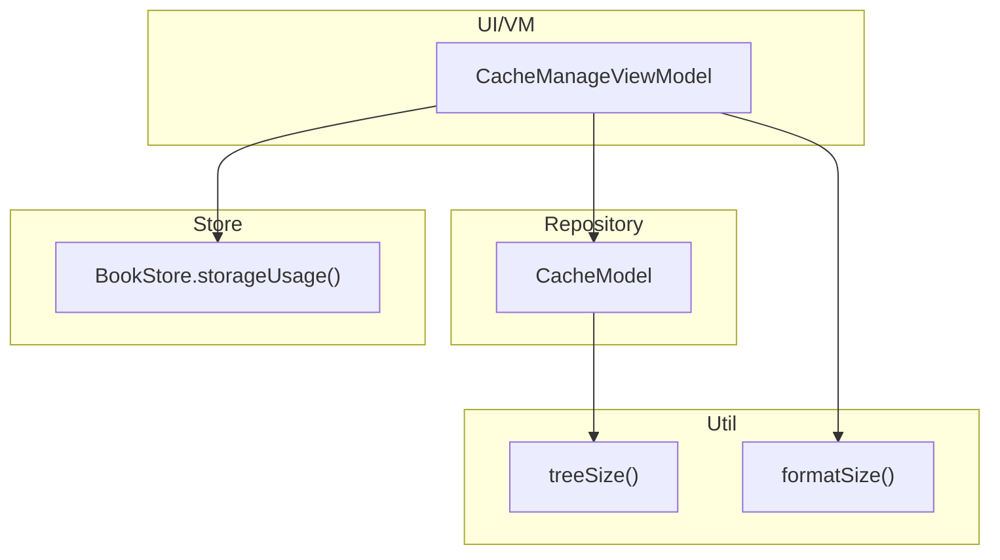
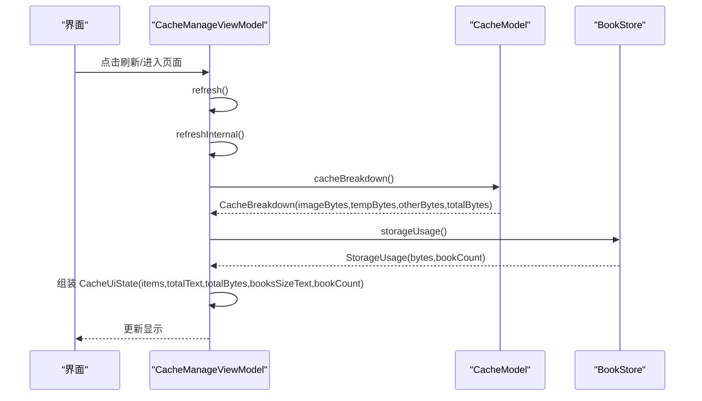
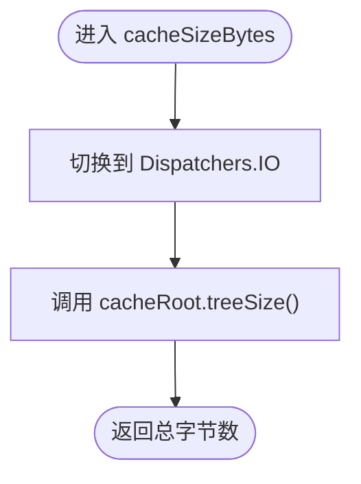
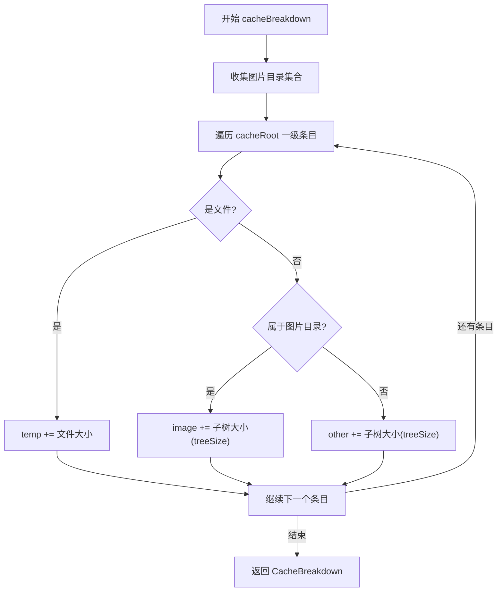
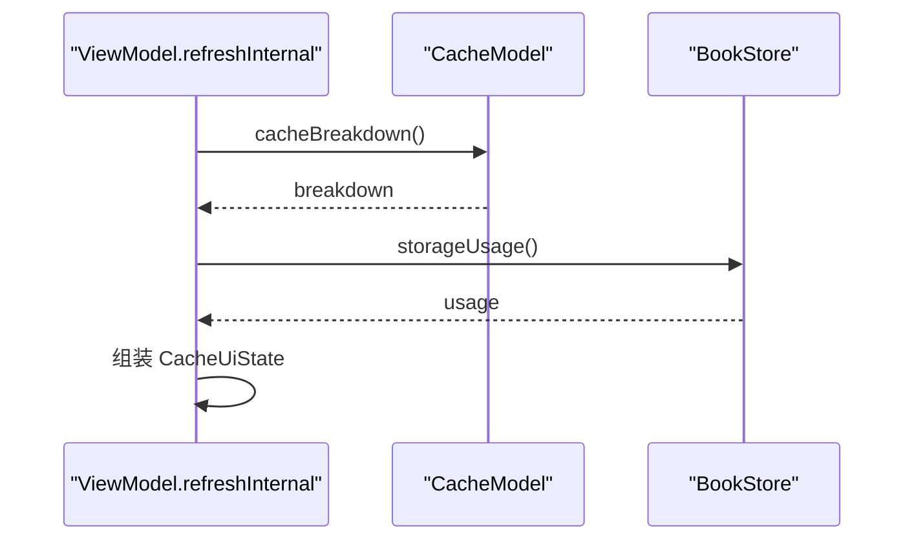
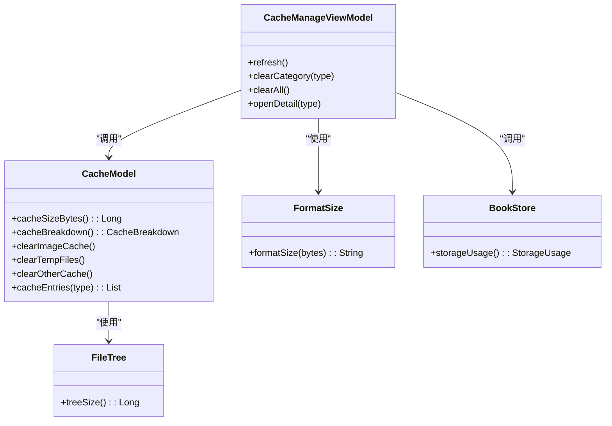

# 缓存统计计算

<cite>
**本文引用的文件**
- [CacheModel.kt](file://module_me/src/main/java/com/ebook/me/repository/CacheModel.kt)
- [CacheManageViewModel.kt](file://module_me/src/main/java/com/ebook/me/mvvm/viewmodel/CacheManageViewModel.kt)
- [FileTree.kt](file://lib_book_common/src/main/java/com/ebook/common/util/FileTree.kt)
- [FormatSize.kt](file://lib_book_common/src/main/java/com/ebook/common/util/FormatSize.kt)
- [BookStore.kt](file://lib_book_common/src/main/java/com/ebook/common/store/BookStore.kt)
- [CacheModelTest.kt](file://module_me/src/test/java/com/ebook/me/repository/CacheModelTest.kt)
</cite>

## 目录
1. [简介](#简介)
2. [项目结构](#项目结构)
3. [核心组件](#核心组件)
4. [架构总览](#架构总览)
5. [详细组件分析](#详细组件分析)
6. [依赖关系分析](#依赖关系分析)
7. [性能考量](#性能考量)
8. [故障排查指南](#故障排查指南)
9. [结论](#结论)
10. [附录](#附录)

## 简介
本文件聚焦“缓存统计计算”的实现与原理，围绕 CacheBreakdown 数据模型、cacheSizeBytes()、cacheBreakdown()、CacheUiState 字段职责、refreshInternal() 的协调逻辑，以及并发安全与大目录遍历的性能优化进行系统阐述。同时给出扩展统计维度、新增缓存类型、增量更新的实践建议。

## 项目结构
- Model 层（repository）：负责缓存根目录的递归遍历、分类统计与清理，所有 IO 在协程中切换至 IO 线程执行。
- ViewModel 层（mvvm/viewmodel）：编排 UI 状态，统一触发刷新、清理及明细展示；书籍内容占用由 BookStore 提供，单独呈现不参与清理。
- 工具层（util）：提供目录树大小计算 treeSize() 与字节格式化 formatSize()。
- 领域存储（store）：BookStore 提供书籍内容仓库的一次性占用统计 storageUsage()。

图示来源
- [CacheManageViewModel.kt:1-186](file://module_me/src/main/java/com/ebook/me/mvvm/viewmodel/CacheManageViewModel.kt#L1-L186)
- [CacheModel.kt:1-144](file://module_me/src/main/java/com/ebook/me/repository/CacheModel.kt#L1-L144)
- [FileTree.kt:1-17](file://lib_book_common/src/main/java/com/ebook/common/util/FileTree.kt#L1-L17)
- [FormatSize.kt:1-21](file://lib_book_common/src/main/java/com/ebook/common/util/FormatSize.kt#L1-L21)
- [BookStore.kt:127-139](file://lib_book_common/src/main/java/com/ebook/common/store/BookStore.kt#L127-L139)

章节来源
- [CacheModel.kt:1-144](file://module_me/src/main/java/com/ebook/me/repository/CacheModel.kt#L1-L144)
- [CacheManageViewModel.kt:1-186](file://module_me/src/main/java/com/ebook/me/mvvm/viewmodel/CacheManageViewModel.kt#L1-L186)
- [FileTree.kt:1-17](file://lib_book_common/src/main/java/com/ebook/common/util/FileTree.kt#L1-L17)
- [FormatSize.kt:1-21](file://lib_book_common/src/main/java/com/ebook/common/util/FormatSize.kt#L1-L21)
- [BookStore.kt:127-139](file://lib_book_common/src/main/java/com/ebook/common/store/BookStore.kt#L127-L139)

## 核心组件
- CacheBreakdown：描述三类缓存占用 imageBytes、tempBytes、otherBytes，并派生 totalBytes = imageBytes + tempBytes + otherBytes。
- CacheModel：封装 cacheDir 的统计与清理能力，包含 cacheSizeBytes()、cacheBreakdown()、clearImageCache()、clearTempFiles()、clearOtherCache()、cacheEntries()。
- CacheManageViewModel：维护 CacheUiState（items、totalText、totalBytes、booksSizeText、bookCount），驱动 refresh()、openDetail()、clearCategory()、clearAll() 等交互。
- FileTree.treeSize()：递归计算目录树普通文件字节总和。
- FormatSize.formatSize()：将字节数格式化为人类可读字符串。
- BookStore.storageUsage()：一次遍历 booksRoot，返回 StorageUsage(bytes, bookCount)。

章节来源
- [CacheModel.kt:10-144](file://module_me/src/main/java/com/ebook/me/repository/CacheModel.kt#L10-L144)
- [CacheManageViewModel.kt:23-186](file://module_me/src/main/java/com/ebook/me/mvvm/viewmodel/CacheManageViewModel.kt#L23-L186)
- [FileTree.kt:5-17](file://lib_book_common/src/main/java/com/ebook/common/util/FileTree.kt#L5-L17)
- [FormatSize.kt:5-21](file://lib_book_common/src/main/java/com/ebook/common/util/FormatSize.kt#L5-L21)
- [BookStore.kt:8-16](file://lib_book_common/src/main/java/com/ebook/common/store/BookStore.kt#L8-L16)
- [BookStore.kt:116-139](file://lib_book_common/src/main/java/com/ebook/common/store/BookStore.kt#L116-L139)

## 架构总览
缓存管理页的数据流如下：
- 页面进入或用户刷新时，ViewModel 调用 refresh() → 内部 suspend 函数 refreshInternal()。
- refreshInternal() 并行/顺序执行两类统计：
  - 缓存统计：调用 CacheModel.cacheBreakdown() 得到三档占用与总量。
  - 书籍内容统计：调用 BookStore.storageUsage() 获取 booksSizeText 与 bookCount。
- 将结果组合为 CacheUiState 并下发给 UI。

图示来源
- [CacheManageViewModel.kt:81-185](file://module_me/src/main/java/com/ebook/me/mvvm/viewmodel/CacheManageViewModel.kt#L81-L185)
- [CacheModel.kt:71-92](file://module_me/src/main/java/com/ebook/me/repository/CacheModel.kt#L71-L92)
- [BookStore.kt:116-139](file://lib_book_common/src/main/java/com/ebook/common/store/BookStore.kt#L116-L139)

## 详细组件分析

### CacheBreakdown 数据模型设计
- 字段：imageBytes（图片缓存）、tempBytes（临时文件）、otherBytes（其他子目录）。
- totalBytes 恒等于三者之和：通过一次遍历分档累加，避免旧实现用“总量减去图片与临时”带来的负值钳位与差值误差问题。
- 优势：
  - 一致性：总量与分项严格相等，消除差值计算的数值边界问题。
  - 可解释性：任何一档变动都直接反映到总量，便于定位与审计。
  - 健壮性：对并发写入导致的“负差值”不再需要特殊处理。

章节来源
- [CacheModel.kt:20-31](file://module_me/src/main/java/com/ebook/me/repository/CacheModel.kt#L20-L31)
- [CacheModel.kt:71-92](file://module_me/src/main/java/com/ebook/me/repository/CacheModel.kt#L71-L92)

### cacheSizeBytes()：递归计算总大小
- 作用：计算 cacheRoot 下所有普通文件的字节和。
- 实现：委托给 FileTree.treeSize()，并在 IO 线程执行，避免阻塞主线程。
- 复杂度：O(N)，N 为目录树中节点数；空间复杂度受递归深度影响，最大为目录树深度。

图示来源
- [CacheModel.kt:61-64](file://module_me/src/main/java/com/ebook/me/repository/CacheModel.kt#L61-L64)
- [FileTree.kt:5-17](file://lib_book_common/src/main/java/com/ebook/common/util/FileTree.kt#L5-L17)

章节来源
- [CacheModel.kt:61-64](file://module_me/src/main/java/com/ebook/me/repository/CacheModel.kt#L61-L64)
- [FileTree.kt:5-17](file://lib_book_common/src/main/java/com/ebook/common/util/FileTree.kt#L5-L17)

### cacheBreakdown()：一次遍历完成三类累加
- 流程：
  - 识别图片缓存目录集合（Coil 当前缓存位 + 老版本 Glide 残留）。
  - 遍历 cacheRoot 的一级条目：
    - 文件：计入 tempBytes。
    - 目录属于图片缓存：整棵子树计入 imageBytes。
    - 其余目录：整棵子树计入 otherBytes。
  - 返回 CacheBreakdown。
- 优点：
  - 仅一次一级目录遍历，配合 treeSize() 完成三类累加，避免“总量减分项”的二次遍历与负值问题。
  - 明细粒度符合用户认知：IMAGE/OTHER 以目录为单位，TEMP 以文件为单位。

图示来源
- [CacheModel.kt:71-92](file://module_me/src/main/java/com/ebook/me/repository/CacheModel.kt#L71-L92)
- [FileTree.kt:5-17](file://lib_book_common/src/main/java/com/ebook/common/util/FileTree.kt#L5-L17)

章节来源
- [CacheModel.kt:71-92](file://module_me/src/main/java/com/ebook/me/repository/CacheModel.kt#L71-L92)
- [FileTree.kt:5-17](file://lib_book_common/src/main/java/com/ebook/common/util/FileTree.kt#L5-L17)

### CacheUiState 字段职责分工
- items：各分类的展示项（类型 + 可读大小文案），来自 cacheBreakdown 的分项。
- totalText：缓存总量的人类可读文本，来自 breakdown.totalBytes 的格式化。
- totalBytes：缓存总量的原始字节数，用于按钮可用态等逻辑。
- booksSizeText：书籍内容占用文本，来自 BookStore.storageUsage().bytes 的格式化。
- bookCount：藏书册数，来自 BookStore.storageUsage().bookCount。
- 为什么 booksSizeText 与 bookCount 来自 BookStore：
  - 书籍内容位于 filesDir/books，不属于可清理的 cacheDir 范畴。
  - 统计口径不同：缓存按 cacheDir 分类统计；书籍内容按 booksRoot 一次遍历统计，二者分离避免误删与口径混淆。

章节来源
- [CacheManageViewModel.kt:42-59](file://module_me/src/main/java/com/ebook/me/mvvm/viewmodel/CacheManageViewModel.kt#L42-L59)
- [CacheManageViewModel.kt:170-185](file://module_me/src/main/java/com/ebook/me/mvvm/viewmodel/CacheManageViewModel.kt#L170-L185)
- [BookStore.kt:8-16](file://lib_book_common/src/main/java/com/ebook/common/store/BookStore.kt#L8-L16)
- [BookStore.kt:116-139](file://lib_book_common/src/main/java/com/ebook/common/store/BookStore.kt#L116-L139)

### refreshInternal()：协调缓存统计与书籍内容统计
- 职责：在同一刷新周期内依次/并发获取缓存分类统计与书籍内容统计，合并为 CacheUiState。
- 关键点：
  - 先获取 cacheBreakdown，再获取 storageUsage，保证 UI 同时看到“可清理的缓存”与“不可清理的书籍内容”。
  - 两者必须分开计算：缓存与书籍内容路径不同、统计口径不同、清理策略不同；合并会引入误删风险与口径不一致。
  - 使用 Dispatchers.IO 执行 storageUsage，确保 IO 不阻塞主线程。

图示来源
- [CacheManageViewModel.kt:170-185](file://module_me/src/main/java/com/ebook/me/mvvm/viewmodel/CacheManageViewModel.kt#L170-L185)
- [CacheModel.kt:71-92](file://module_me/src/main/java/com/ebook/me/repository/CacheModel.kt#L71-L92)
- [BookStore.kt:116-139](file://lib_book_common/src/main/java/com/ebook/common/store/BookStore.kt#L116-L139)

章节来源
- [CacheManageViewModel.kt:170-185](file://module_me/src/main/java/com/ebook/me/mvvm/viewmodel/CacheManageViewModel.kt#L170-L185)

## 依赖关系分析
- CacheModel 依赖 FileTree.treeSize() 完成递归大小计算，依赖 formatSize() 进行展示。
- CacheManageViewModel 依赖 CacheModel 与 BookStore，并通过 formatSize() 生成可读文本。
- BookStore 独立于缓存模块，提供书籍内容的统计能力。

图示来源
- [CacheModel.kt:57-144](file://module_me/src/main/java/com/ebook/me/repository/CacheModel.kt#L57-L144)
- [CacheManageViewModel.kt:35-186](file://module_me/src/main/java/com/ebook/me/mvvm/viewmodel/CacheManageViewModel.kt#L35-L186)
- [FileTree.kt:5-17](file://lib_book_common/src/main/java/com/ebook/common/util/FileTree.kt#L5-L17)
- [FormatSize.kt:5-21](file://lib_book_common/src/main/java/com/ebook/common/util/FormatSize.kt#L5-L21)
- [BookStore.kt:116-139](file://lib_book_common/src/main/java/com/ebook/common/store/BookStore.kt#L116-L139)

章节来源
- [CacheModel.kt:57-144](file://module_me/src/main/java/com/ebook/me/repository/CacheModel.kt#L57-L144)
- [CacheManageViewModel.kt:35-186](file://module_me/src/main/java/com/ebook/me/mvvm/viewmodel/CacheManageViewModel.kt#L35-L186)
- [FileTree.kt:5-17](file://lib_book_common/src/main/java/com/ebook/common/util/FileTree.kt#L5-L17)
- [FormatSize.kt:5-21](file://lib_book_common/src/main/java/com/ebook/common/util/FormatSize.kt#L5-L21)
- [BookStore.kt:116-139](file://lib_book_common/src/main/java/com/ebook/common/store/BookStore.kt#L116-L139)

## 性能考量
- 时间复杂度：
  - treeSize()：O(N)，N 为目录树节点数；每次调用都会完整遍历子树。
  - cacheBreakdown()：一次一级目录遍历，配合 treeSize() 完成三类累加，避免“总量减分项”的重复遍历。
- 并发安全：
  - 所有 IO 操作均通过 withContext(Dispatchers.IO) 切到 IO 线程，避免阻塞主线程。
  - 文件系统存在并发写入的可能（如图片下载、裁剪），但采用“分档累加”的设计消除了旧实现的“负差值钳位”问题，提升了健壮性。
- 内存占用控制：
  - treeSize() 递归深度取决于目录树深度；大目录场景下注意栈深与 GC 压力。
  - 若需进一步优化，可在 treeSize() 中改用显式栈迭代以避免递归深度限制。
- 展示与排序：
  - cacheEntries() 按 sizeBytes 降序排列，提升用户关注点命中率。
  - formatSize() 固定 Locale.US，确保跨环境一致的数字格式。

章节来源
- [CacheModel.kt:61-133](file://module_me/src/main/java/com/ebook/me/repository/CacheModel.kt#L61-L133)
- [FileTree.kt:5-17](file://lib_book_common/src/main/java/com/ebook/common/util/FileTree.kt#L5-L17)
- [FormatSize.kt:5-21](file://lib_book_common/src/main/java/com/ebook/common/util/FormatSize.kt#L5-L21)

## 故障排查指南
- 空目录或不存在目录：
  - cacheSizeBytes() 与 cacheBreakdown() 在无文件或目录不存在时返回 0，不会抛异常。
- 清理行为验证：
  - clearOtherCache() 不应删除图片缓存目录；clearImageCache() 应删除 Coil 与遗留 Glide 目录；clearCache() 仅清理子项，保留根目录。
- 明细粒度：
  - TEMP 明细以文件为单位；IMAGE/OTHER 明细以目录为单位；列表按大小降序。
- 单元测试覆盖：
  - 分类统计、明细粒度、排序、清理行为、空目录与缺失目录处理均有测试用例。

章节来源
- [CacheModelTest.kt:48-170](file://module_me/src/test/java/com/ebook/me/repository/CacheModelTest.kt#L48-L170)
- [CacheModel.kt:94-144](file://module_me/src/main/java/com/ebook/me/repository/CacheModel.kt#L94-L144)

## 结论
- CacheBreakdown 通过“一次遍历分档累加”实现了总量与分项的一致性，消除了旧实现差值计算的缺陷。
- cacheSizeBytes() 与 cacheBreakdown() 分别承担总量与分类统计职责，均通过 IO 线程执行，确保 UI 流畅。
- CacheUiState 清晰区分了“可清理的缓存”与“不可清理的书籍内容”，避免误删与口径混淆。
- refreshInternal() 将两类统计协调在一个刷新周期内，保证 UI 同时看到最新数据。
- 性能上，treeSize() 的 O(N) 复杂度与一次性遍历设计满足大目录场景；必要时可替换为迭代方式以降低递归深度风险。

## 附录

### 扩展统计维度示例
- 新增一类缓存（例如 LOG）：
  - 在 CacheType 枚举中添加 LOG。
  - 在 cacheBreakdown() 中增加对该类目录或文件的识别与累加逻辑。
  - 在 cacheEntries() 中补充该类的明细采集与排序。
  - 在 ViewModel 的 items 构造中为新类型添加展示项。

章节来源
- [CacheModel.kt:10-18](file://module_me/src/main/java/com/ebook/me/repository/CacheModel.kt#L10-L18)
- [CacheModel.kt:71-133](file://module_me/src/main/java/com/ebook/me/repository/CacheModel.kt#L71-L133)
- [CacheManageViewModel.kt:170-185](file://module_me/src/main/java/com/ebook/me/mvvm/viewmodel/CacheManageViewModel.kt#L170-L185)

### 新增缓存类型统计的实施要点
- 明确归类规则：按目录名或文件后缀判定归属。
- 保持一次遍历原则：在 cacheBreakdown() 中统一累加，避免二次扫描。
- 保证明细粒度一致：目录型按目录粒度，文件型按文件粒度。
- 清理逻辑对应：为新增类型提供独立的清理方法或在现有清理中追加分支。

章节来源
- [CacheModel.kt:71-133](file://module_me/src/main/java/com/ebook/me/repository/CacheModel.kt#L71-L133)

### 增量更新机制建议
- 基于事件通知：
  - 监听目录变更（如通过文件观察者），当某分类目录发生变化时仅刷新该分类与总量。
- 基于版本号/时间戳：
  - 为每个分类维护最近修改时间或版本号，仅在变化时重新计算该分类。
- 合并策略：
  - 增量结果与全局总量合并时，仍遵循 CacheBreakdown 的总量等于分项之和的约束。

章节来源
- [CacheModel.kt:71-92](file://module_me/src/main/java/com/ebook/me/repository/CacheModel.kt#L71-L92)
- [CacheManageViewModel.kt:170-185](file://module_me/src/main/java/com/ebook/me/mvvm/viewmodel/CacheManageViewModel.kt#L170-L185)