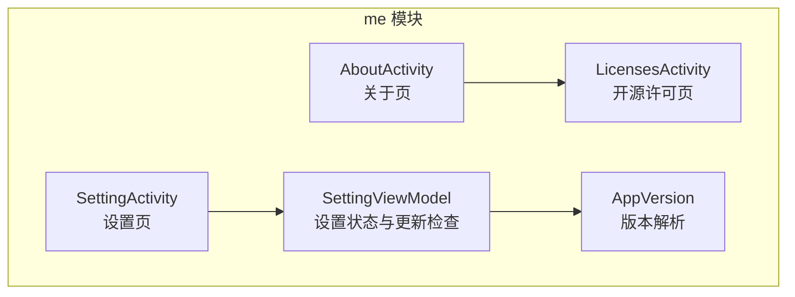
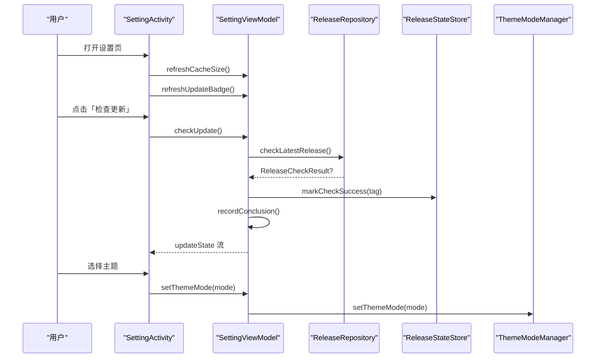
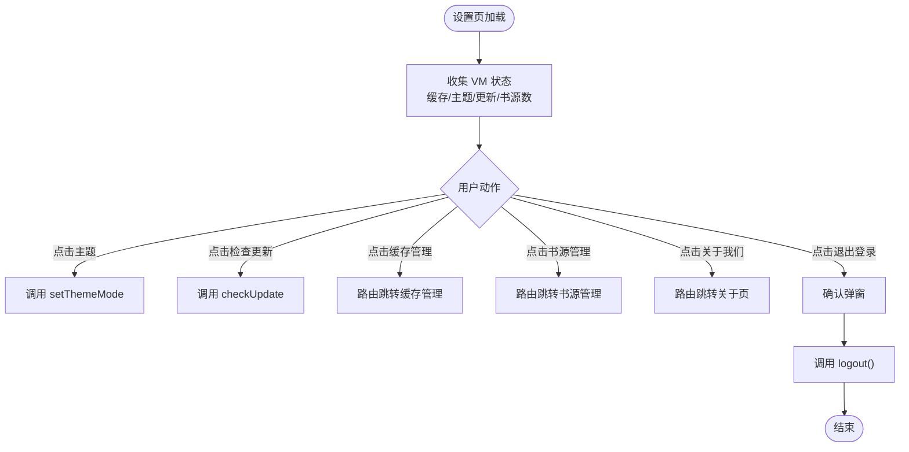
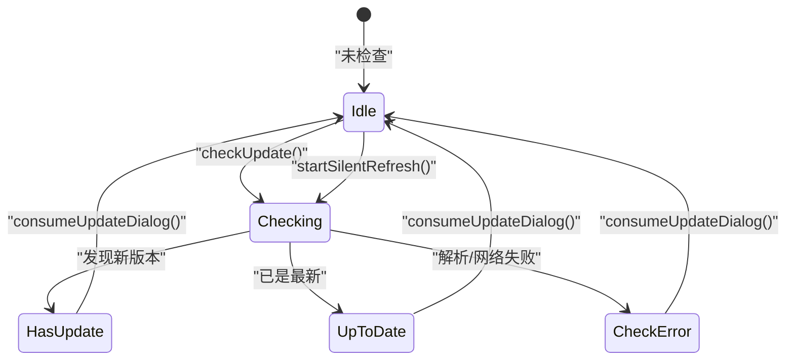
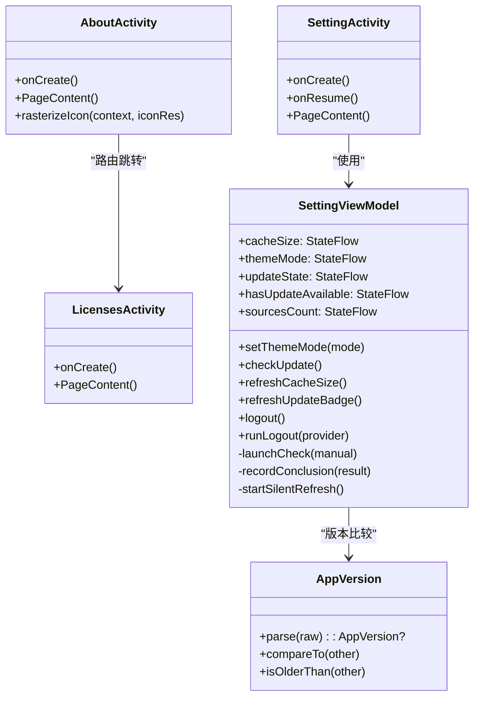

# 设置与关于页面

<cite>
**本文引用的文件**   
- [SettingActivity.kt](file://module_me/src/main/java/com/ebook/me/view/SettingActivity.kt)
- [AboutActivity.kt](file://module_me/src/main/java/com/ebook/me/view/AboutActivity.kt)
- [LicensesActivity.kt](file://module_me/src/main/java/com/ebook/me/view/LicensesActivity.kt)
- [SettingViewModel.kt](file://module_me/src/main/java/com/ebook/me/mvvm/viewmodel/SettingViewModel.kt)
- [AppVersion.kt](file://module_me/src/main/java/com/ebook/me/util/AppVersion.kt)
</cite>

## 目录
1. [引言](#引言)
2. [项目结构定位](#项目结构定位)
3. [核心组件总览](#核心组件总览)
4. [架构概览](#架构概览)
5. [详细组件分析](#详细组件分析)
6. [依赖关系分析](#依赖关系分析)
7. [性能与状态设计要点](#性能与状态设计要点)
8. [扩展指南：新增设置项最佳实践](#扩展指南新增设置项最佳实践)
9. [故障排查](#故障排查)
10. [结论](#结论)

## 引言
本文围绕“设置与关于”相关页面展开，重点覆盖以下能力：
- SettingActivity 的设置项配置与交互：主题切换、缓存管理、书源管理入口、版本更新检查、退出登录等。
- AboutActivity 的版本信息展示与文档跳转。
- LicensesActivity 的开源许可证静态列表展示。
- SettingViewModel 的设置项状态管理、更新检查流程、持久化协作与退出登录编排。
- AppVersion 工具类的版本解析与比较逻辑。
- 如何按现有模式扩展新的设置项。

## 项目结构定位
这些功能集中在 `module_me` 模块中：
- UI 层：`view` 包下的 Activity 与 Composable Screen。
- 状态层：`mvvm.viewmodel.SettingViewModel`。
- 工具类：`util.AppVersion`。
- 路由注册：通过 `@Route` 注解与 TheRouter 进行页面跳转。

**图表来源**
- [SettingActivity.kt:1-120](file://module_me/src/main/java/com/ebook/me/view/SettingActivity.kt#L1-L120)
- [AboutActivity.kt:1-120](file://module_me/src/main/java/com/ebook/me/view/AboutActivity.kt#L1-L120)
- [LicensesActivity.kt:1-60](file://module_me/src/main/java/com/ebook/me/view/LicensesActivity.kt#L1-L60)
- [SettingViewModel.kt:1-120](file://module_me/src/main/java/com/ebook/me/mvvm/viewmodel/SettingViewModel.kt#L1-L120)
- [AppVersion.kt:1-87](file://module_me/src/main/java/com/ebook/me/util/AppVersion.kt#L1-L87)

**章节来源**
- [SettingActivity.kt:1-120](file://module_me/src/main/java/com/ebook/me/view/SettingActivity.kt#L1-L120)
- [AboutActivity.kt:1-120](file://module_me/src/main/java/com/ebook/me/view/AboutActivity.kt#L1-L120)
- [LicensesActivity.kt:1-60](file://module_me/src/main/java/com/ebook/me/view/LicensesActivity.kt#L1-L60)
- [SettingViewModel.kt:1-120](file://module_me/src/main/java/com/ebook/me/mvvm/viewmodel/SettingViewModel.kt#L1-L120)
- [AppVersion.kt:1-87](file://module_me/src/main/java/com/ebook/me/util/AppVersion.kt#L1-L87)

## 核心组件总览
- SettingActivity：负责设置页 UI 渲染、用户交互与路由跳转；不直接执行清理或修改书源清单，仅转发操作到 ViewModel 与二级页面。
- AboutActivity：读取应用图标、名称、版本号并展示；提供用户协议、隐私政策与开源许可入口。
- LicensesActivity：以静态列表展示主要第三方库及其许可证，保持与依赖清单同步。
- SettingViewModel：集中管理缓存大小、主题模式、更新检查状态、角标状态、书源数量与登录态；协调 ReleaseRepository、ReleaseStateStore、ThemeModeManager 等。
- AppVersion：解析与比较 App 版本号，支持带前缀 V/v 的多段数字与尾缀。

**章节来源**
- [SettingActivity.kt:1-200](file://module_me/src/main/java/com/ebook/me/view/SettingActivity.kt#L1-L200)
- [AboutActivity.kt:1-120](file://module_me/src/main/java/com/ebook/me/view/AboutActivity.kt#L1-L120)
- [LicensesActivity.kt:1-120](file://module_me/src/main/java/com/ebook/me/view/LicensesActivity.kt#L1-L120)
- [SettingViewModel.kt:1-120](file://module_me/src/main/java/com/ebook/me/mvvm/viewmodel/SettingViewModel.kt#L1-L120)
- [AppVersion.kt:1-87](file://module_me/src/main/java/com/ebook/me/util/AppVersion.kt#L1-L87)

## 架构概览
设置与关于页面的职责边界清晰：UI 层只负责呈现与事件转发，业务逻辑集中在 ViewModel；网络与存储由仓库与状态仓承担，版本号解析由工具类处理。

**图表来源**
- [SettingActivity.kt:60-120](file://module_me/src/main/java/com/ebook/me/view/SettingActivity.kt#L60-L120)
- [SettingViewModel.kt:120-240](file://module_me/src/main/java/com/ebook/me/mvvm/viewmodel/SettingViewModel.kt#L120-L240)

**章节来源**
- [SettingActivity.kt:60-200](file://module_me/src/main/java/com/ebook/me/view/SettingActivity.kt#L60-L200)
- [SettingViewModel.kt:120-240](file://module_me/src/main/java/com/ebook/me/mvvm/viewmodel/SettingViewModel.kt#L120-L240)

## 详细组件分析

### SettingActivity：设置页 UI 与行为
- 主题设置：通过 Switch 控制“跟随系统”，关闭后展开日间/夜间子菜单；选中项带勾选标记。
- 缓存管理：显示缓存大小（空串表示计算中），点击跳转到缓存管理页。
- 书源管理：显示当前书源总数作为副标题，点击进入书源管理页。
- 版本更新：点击触发即时检查，弹窗展示 Checking/UpToDate/HasUpdate/CheckError。
- 关于我们：跳转到 AboutActivity。
- 退出登录：弹出确认对话框，确认后调用 ViewModel 执行登出流程。

关键实现要点：
- 在 onResume 刷新缓存大小和更新角标，避免 VM 存活期间角标陈旧。
- 所有跳转通过 TheRouter 路由，如 CACHE_PATH、BOOK_SOURCE_PATH、ABOUT_PATH。
- 主题切换回调委托给 SettingViewModel.setThemeMode。

**图表来源**
- [SettingActivity.kt:60-200](file://module_me/src/main/java/com/ebook/me/view/SettingActivity.kt#L60-L200)
- [SettingViewModel.kt:200-360](file://module_me/src/main/java/com/ebook/me/mvvm/viewmodel/SettingViewModel.kt#L200-L360)

**章节来源**
- [SettingActivity.kt:1-200](file://module_me/src/main/java/com/ebook/me/view/SettingActivity.kt#L1-L200)

### AboutActivity：版本信息与文档入口
- 动态读取应用名称、图标与 versionName，使用 PackageManager。
- 将 AdaptiveIconDrawable 栅格化为 ImageBitmap 以适配 Compose 展示。
- 提供用户协议、隐私政策与开源许可入口，均通过 TheRouter 跳转。

注意：
- 本页面只负责展示与应用信息读取，不涉及更新检查逻辑。
- 图标读取失败时安全降级为不渲染。

**章节来源**
- [AboutActivity.kt:1-120](file://module_me/src/main/java/com/ebook/me/view/AboutActivity.kt#L1-L120)

### LicensesActivity：开源许可证展示
- 以静态列表展示主要第三方库名与许可证。
- 条目与 gradle/libs.versions.toml 的主要依赖保持同步。
- 列表使用 CommonCard + SectionLabel 布局，行内分隔线避免首行出现多余分割线。

扩展建议：
- 新增重要依赖时，需同步更新 LICENSES 列表，保持法律合规性。

**章节来源**
- [LicensesActivity.kt:1-179](file://module_me/src/main/java/com/ebook/me/view/LicensesActivity.kt#L1-L179)

### SettingViewModel：设置项状态管理与更新检查
职责分解：
- 缓存大小：异步计算并暴露 StateFlow<String>。
- 主题模式：暴露 ThemeMode 状态流，写入通过 ThemeModeManager 持久化。
- 更新检查：主动与静默两种触发方式，单飞任务防并发，结果分弹窗与角标两条消费路径。
- 角标状态：基于上次检查 tag 与当前装机版本现场派生。
- 书源数量：冷观察 BookSourceManager.observeSources，统计总数。
- 登录态：控制退出登录区块显隐。
- 退出登录：服务端作废（可选）→ 清本地会话 → Toast → 关页，全部在 viewModelScope 完成。

更新检查流程关键点：
- startSilentRefresh：7 天限频窗口控制静默刷新。
- launchCheck：单飞任务，manual=true 时弹窗，manual=false 时静默；在途被手动点击会升级为可见。
- recordConclusion：解析远端 tag 与本地版本，落盘成功时间戳并重算角标；无法判定返回 null，不走成功时间戳。
- consumeUpdateDialog：关闭弹窗时取消在途任务并复位 resultToDialog。

**图表来源**
- [SettingViewModel.kt:120-240](file://module_me/src/main/java/com/ebook/me/mvvm/viewmodel/SettingViewModel.kt#L120-L240)
- [SettingViewModel.kt:240-360](file://module_me/src/main/java/com/ebook/me/mvvm/viewmodel/SettingViewModel.kt#L240-L360)

**章节来源**
- [SettingViewModel.kt:1-360](file://module_me/src/main/java/com/ebook/me/mvvm/viewmodel/SettingViewModel.kt#L1-L360)

### AppVersion：版本解析与比较
- 支持格式：`V1.2.0`、`V1.2.3abcd`、`1.2beta` 等，允许任意长度数字段，最后一段可带字母数字尾缀。
- 比较策略：逐段数值优先，段不足补 0；尾缀字典序比较。
- normalizeVersionTag：去掉 V/v 前缀，用于展示层统一。
- isOlderThan：判断是否落后于其他版本。

复杂度：
- parse：O(n)，n 为分段数。
- compareTo：O(k)，k 为两段最大段数。

**章节来源**
- [AppVersion.kt:1-87](file://module_me/src/main/java/com/ebook/me/util/AppVersion.kt#L1-L87)

## 依赖关系分析

**图表来源**
- [SettingActivity.kt:1-200](file://module_me/src/main/java/com/ebook/me/view/SettingActivity.kt#L1-L200)
- [AboutActivity.kt:1-120](file://module_me/src/main/java/com/ebook/me/view/AboutActivity.kt#L1-L120)
- [LicensesActivity.kt:1-179](file://module_me/src/main/java/com/ebook/me/view/LicensesActivity.kt#L1-L179)
- [SettingViewModel.kt:1-360](file://module_me/src/main/java/com/ebook/me/mvvm/viewmodel/SettingViewModel.kt#L1-L360)
- [AppVersion.kt:1-87](file://module_me/src/main/java/com/ebook/me/util/AppVersion.kt#L1-L87)

**章节来源**
- [SettingActivity.kt:1-200](file://module_me/src/main/java/com/ebook/me/view/SettingActivity.kt#L1-L200)
- [AboutActivity.kt:1-120](file://module_me/src/main/java/com/ebook/me/view/AboutActivity.kt#L1-L120)
- [LicensesActivity.kt:1-179](file://module_me/src/main/java/com/ebook/me/view/LicensesActivity.kt#L1-L179)
- [SettingViewModel.kt:1-360](file://module_me/src/main/java/com/ebook/me/mvvm/viewmodel/SettingViewModel.kt#L1-L360)
- [AppVersion.kt:1-87](file://module_me/src/main/java/com/ebook/me/util/AppVersion.kt#L1-L87)

## 性能与状态设计要点
- 角标派生而非结论缓存：每次从上次检查 tag 与当前装机版本现场计算，避免安装新版本后角标不更新。
- 单飞更新检查：同一时刻最多一个请求，防止连点与静默刷新并发。
- 冷流书源计数：observeSources 是冷流，配合 WhileSubscribed(5s) 避免无订阅者时持续监听 Room。
- 异步与协程：缓存大小、更新检查均在 viewModelScope 中执行，避免 Activity 重建导致收尾丢失。
- 主题切换幂等：ThemeModeManager 持久化并通知上层装配，UI 通过 StateFlow 响应重组。

[本节为通用性能与设计讨论，不直接分析具体代码行]

## 扩展指南：新增设置项最佳实践
目标：在不破坏现有职责边界的前提下，增加一个新的设置项（例如“字体大小”“阅读背景”等）。

推荐步骤：
1. 定义设置键与默认值
   - 若涉及持久化，建议在对应 Store/Preferences 中新增键与默认值；若无持久化需求，仅在 UI 与 ViewModel 间传递即可。
   - 对于影响全局的主题或外观项，应通过 ThemeModeManager 或专门的管理器统一处理。

2. 在 SettingViewModel 中添加状态流
   - 新增 StateFlow<T> 暴露新设置项的状态。
   - 如果涉及远程或 IO，放在 viewModelScope 中异步计算。

3. 在 SettingActivity 中新增设置项 UI
   - 在 SettingScreen 中添加对应的 CommonListItem 或开关控件。
   - 将用户交互回调委托给 SettingViewModel 的 setter 方法。

4. 处理生命周期与刷新
   - 若设置项依赖外部数据变化（如缓存大小、书源数），在 onResume 或其他合适时机调用 VM 刷新方法。
   - 确保 VM 的初始值与占位文案分离，UI 层负责显示“计算中”。

5. 测试与预览
   - 为新的设置项添加 Composable Preview。
   - 若涉及复杂状态转换（如更新检查），编写单元测试验证状态机。

注意事项：
- 不要重复事实源：书源数量只在 SettingViewModel 计算，不在 Activity 中维护副本。
- 文案与资源分离：VM 不持有用户可见文本，字符串由 UI 层经 stringResource 解析。
- 路由与跳转：二级页面一律通过 TheRouter 路由，避免硬编码路径。
- 错误处理：网络失败或解析失败应明确区分“检查失败”与“已是最新”，避免误判。

[本节为概念性指导，不直接分析具体代码行]

## 故障排查
常见问题与建议：
- 更新检查弹窗异常重现：
  - 检查 resultToDialog 是否在关闭弹窗时被复位。
  - 确认 launchCheck 在静默刷新期间不会并发第二个请求。
- 角标不更新：
  - 确认 onResume 调用了 refreshUpdateBadge。
  - 检查 install 新版本后 currentVersionName 是否变化。
- 主题切换无效：
  - 确认 setThemeMode 已调用 ThemeModeManager。
  - 检查 UI 是否根据 themeMode 正确渲染。
- 退出登录后仍登录：
  - 检查 runLogout 是否执行 clearSession。
  - 确认 sendToast 与 sendFinish 顺序正确。
- 开源许可证遗漏：
  - 同步更新 LicensesActivity 中的 LICENSES 列表。

**章节来源**
- [SettingViewModel.kt:200-360](file://module_me/src/main/java/com/ebook/me/mvvm/viewmodel/SettingViewModel.kt#L200-L360)
- [LicensesActivity.kt:60-179](file://module_me/src/main/java/com/ebook/me/view/LicensesActivity.kt#L60-L179)

## 结论
设置与关于页面采用清晰的 MVVM 分层：Activity 负责 UI 与路由，ViewModel 集中处理状态与业务流程，工具类负责版本解析。该设计保证了：
- 更新检查的可控性与幂等性。
- 主题与设置的跨屏一致性与持久化。
- 关于与许可信息的稳定展示。
- 可扩展性强，便于新增设置项并保持单一事实源。

[本节为总结性内容，不直接分析具体代码行]