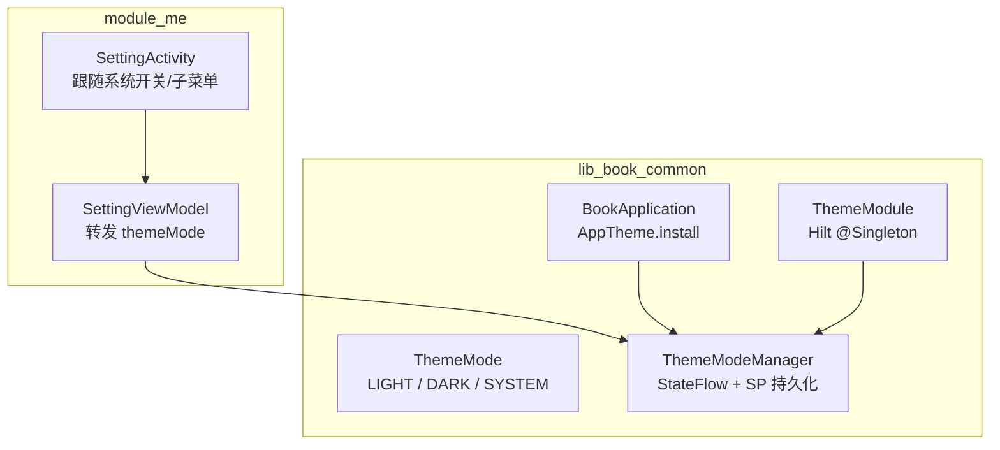
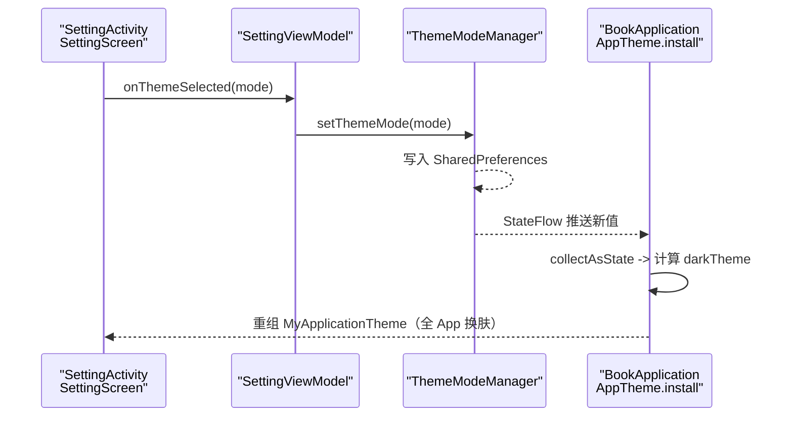
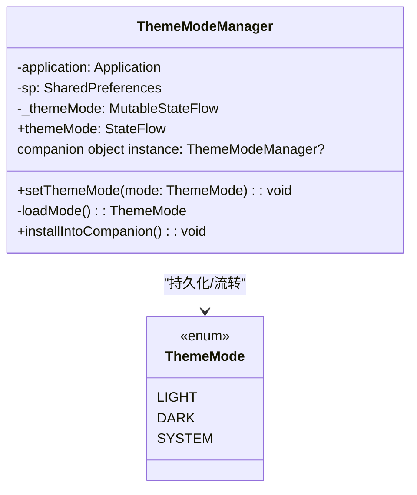
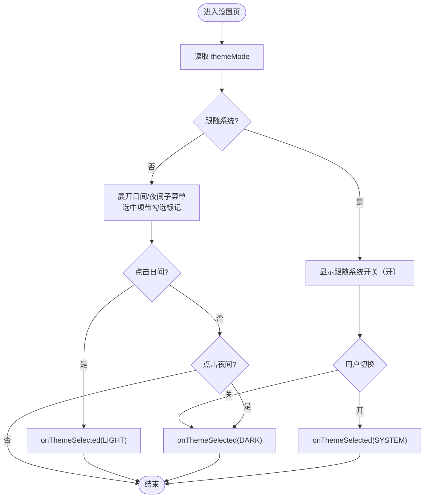
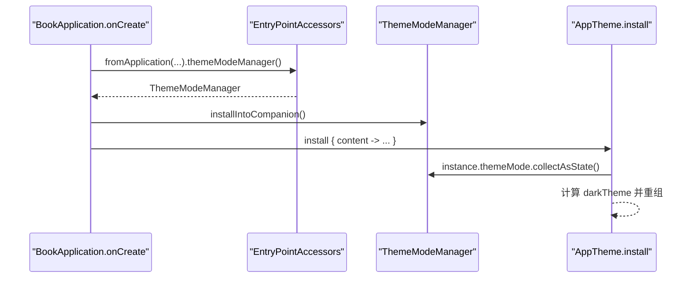
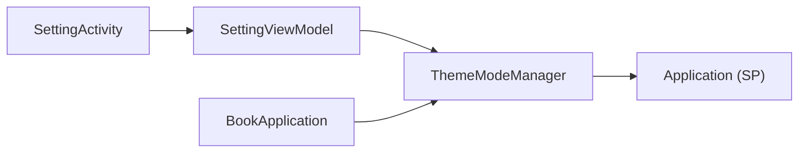

# 主题模式管理

<cite>
**本文引用的文件**
- [ThemeModeManager.kt](file://lib_book_common/src/main/java/com/ebook/common/domain/ThemeModeManager.kt)
- [SettingViewModel.kt](file://module_me/src/main/java/com/ebook/me/mvvm/viewmodel/SettingViewModel.kt)
- [SettingActivity.kt](file://module_me/src/main/java/com/ebook/me/view/SettingActivity.kt)
- [BookApplication.kt](file://lib_book_common/src/main/java/com/ebook/common/BookApplication.kt)
- [ThemeModule.kt](file://lib_book_common/src/main/java/com/ebook/common/di/ThemeModule.kt)
- [0031-theme-mode-three-state-companion-singleton.md](file://docs/adr/0031-theme-mode-three-state-companion-singleton.md)
- [SettingViewModelTest.kt](file://module_me/src/test/java/com/ebook/me/mvvm/viewmodel/SettingViewModelTest.kt)
</cite>

## 目录
1. [简介](#简介)
2. [项目结构（与主题相关）](#项目结构与主题相关)
3. [核心组件](#核心组件)
4. [架构总览](#架构总览)
5. [详细组件分析](#详细组件分析)
6. [依赖关系分析](#依赖关系分析)
7. [性能考量](#性能考量)
8. [故障排查指南](#故障排查指南)
9. [结论](#结论)
10. [附录：Compose 中收集 themeMode 的示例路径](#附录compose-中收集-thememode-的示例路径)

## 简介
本文件围绕“外观主题模式”的管理机制，系统阐述以下要点：
- SettingViewModel 如何暴露 themeMode 状态流。
- ThemeModeManager 的职责、持久化策略与 StateFlow 暴露方式。
- ThemeMode 枚举 LIGHT/DARK/SYSTEM 的三种切换逻辑及跟随系统的行为。
- 设置页交互：关闭“跟随系统”时自动展开日间/夜间子菜单并带勾选标记。
- setThemeMode() 如何将选择写入 SharedPreferences 并推进 themeMode 流，从而触发全局重组。
- BookApplication 中的主题装配 lambda 如何通过读取 ThemeModeManager.instance 来驱动 App 级换肤。
- 主题模式与阅读背景主题的分离设计：设置页不处理阅读背景主题，避免重复状态源。

## 项目结构（与主题相关）
主题模式涉及三层：
- 领域层（lib_book_common）：定义 ThemeMode 枚举与 ThemeModeManager，负责持久化与状态流。
- 业务模块（module_me）：设置页通过 SettingViewModel 转发 themeMode 并提供 setThemeMode 入口；UI 实现跟随系统开关与子菜单展开。
- 应用启动（lib_book_common）：BookApplication 在 onCreate 中注册主题装配点，读取 ThemeModeManager.instance 决定 darkTheme，使全 App 换肤。

图表来源
- [ThemeModeManager.kt:10-92](file://lib_book_common/src/main/java/com/ebook/common/domain/ThemeModeManager.kt#L10-L92)
- [BookApplication.kt:17-49](file://lib_book_common/src/main/java/com/ebook/common/BookApplication.kt#L17-L49)
- [ThemeModule.kt:17-26](file://lib_book_common/src/main/java/com/ebook/common/di/ThemeModule.kt#L17-L26)
- [SettingViewModel.kt:62-172](file://module_me/src/main/java/com/ebook/me/mvvm/viewmodel/SettingViewModel.kt#L62-L172)
- [SettingActivity.kt:98-142](file://module_me/src/main/java/com/ebook/me/view/SettingActivity.kt#L98-L142)

章节来源
- [ThemeModeManager.kt:10-92](file://lib_book_common/src/main/java/com/ebook/common/domain/ThemeModeManager.kt#L10-L92)
- [SettingViewModel.kt:62-172](file://module_me/src/main/java/com/ebook/me/mvvm/viewmodel/SettingViewModel.kt#L62-L172)
- [SettingActivity.kt:98-142](file://module_me/src/main/java/com/ebook/me/view/SettingActivity.kt#L98-L142)
- [BookApplication.kt:17-49](file://lib_book_common/src/main/java/com/ebook/common/BookApplication.kt#L17-L49)
- [ThemeModule.kt:17-26](file://lib_book_common/src/main/java/com/ebook/common/di/ThemeModule.kt#L17-L26)

## 核心组件
- ThemeMode 枚举：LIGHT（强制浅色）、DARK（强制深色）、SYSTEM（跟随系统，默认）。
- ThemeModeManager：
  - 以 SharedPreferences 单键存储 mode。
  - 对外暴露 StateFlow<ThemeMode>。
  - setThemeMode(mode) 同时落盘并推进流。
  - installIntoCompanion() 将实例挂到伴生对象 instance，供 Hilt 图外的主题装配 lambda 读取。
- SettingViewModel：
  - 注入 ThemeModeManager，直接转发 themeMode 为 StateFlow。
  - setThemeMode(mode) 委托给 ThemeModeManager。
- SettingActivity（SettingScreen）：
  - 收集 themeMode 作为当前值。
  - “跟随系统”为 Switch；关闭后展开日间/夜间子菜单，选中项显示勾选图标。
  - onThemeSelected 调用 VM 的 setThemeMode。
- BookApplication：
  - 在 AppTheme.install 内读取 ThemeModeManager.instance.themeMode 的 collectAsState，映射出 darkTheme 传给 MyApplicationTheme。
  - 使用 EntryPointAccessors 从 Hilt 取出 ThemeModeManager 并 installIntoCompanion。

章节来源
- [ThemeModeManager.kt:10-92](file://lib_book_common/src/main/java/com/ebook/common/domain/ThemeModeManager.kt#L10-L92)
- [SettingViewModel.kt:133-172](file://module_me/src/main/java/com/ebook/me/mvvm/viewmodel/SettingViewModel.kt#L133-L172)
- [SettingActivity.kt:165-250](file://module_me/src/main/java/com/ebook/me/view/SettingActivity.kt#L165-L250)
- [BookApplication.kt:29-49](file://lib_book_common/src/main/java/com/ebook/common/BookApplication.kt#L29-L49)

## 架构总览
主题模式的完整链路如下：
- 用户在设置页点击“跟随系统”或子菜单选项。
- SettingActivity 回调 SettingViewModel.onThemeSelected。
- SettingViewModel.setThemeMode 调用 ThemeModeManager.setThemeMode。
- ThemeModeManager 写入 SharedPreferences 并推进 StateFlow。
- BookApplication 的主题装配 lambda 订阅该 StateFlow，收到新值后计算 darkTheme 并重组 MyApplicationTheme。
- 全 App 立即换肤。

图表来源
- [SettingActivity.kt:165-250](file://module_me/src/main/java/com/ebook/me/view/SettingActivity.kt#L165-L250)
- [SettingViewModel.kt:163-172](file://module_me/src/main/java/com/ebook/me/mvvm/viewmodel/SettingViewModel.kt#L163-L172)
- [ThemeModeManager.kt:54-63](file://lib_book_common/src/main/java/com/ebook/common/domain/ThemeModeManager.kt#L54-L63)
- [BookApplication.kt:29-42](file://lib_book_common/src/main/java/com/ebook/common/BookApplication.kt#L29-L42)

章节来源
- [SettingActivity.kt:165-250](file://module_me/src/main/java/com/ebook/me/view/SettingActivity.kt#L165-L250)
- [SettingViewModel.kt:163-172](file://module_me/src/main/java/com/ebook/me/mvvm/viewmodel/SettingViewModel.kt#L163-L172)
- [ThemeModeManager.kt:54-63](file://lib_book_common/src/main/java/com/ebook/common/domain/ThemeModeManager.kt#L54-L63)
- [BookApplication.kt:29-42](file://lib_book_common/src/main/java/com/ebook/common/BookApplication.kt#L29-L42)

## 详细组件分析

### ThemeMode 枚举与三态语义
- LIGHT：强制浅色，darkTheme=false。
- DARK：强制深色，darkTheme=true。
- SYSTEM：跟随系统，darkTheme=isSystemInDarkTheme()。
- 默认值：首次加载无记录时回退到 SYSTEM，保证首帧渲染稳定。

章节来源
- [ThemeModeManager.kt:17-26](file://lib_book_common/src/main/java/com/ebook/common/domain/ThemeModeManager.kt#L17-L26)
- [ThemeModeManager.kt:65-69](file://lib_book_common/src/main/java/com/ebook/common/domain/ThemeModeManager.kt#L65-L69)
- [BookApplication.kt:32-40](file://lib_book_common/src/main/java/com/ebook/common/BookApplication.kt#L32-L40)

### ThemeModeManager：持久化与状态流
- 持久化载体：SharedPreferences（theme_mode 文件，单键 mode），写入为枚举名。
- 状态流：MutableStateFlow 包装，外部只读 StateFlow。
- 写入流程：setThemeMode(mode) 先写 SP，再赋值 _themeMode.value，确保后续 collectAsState 能观察到变化。
- 伴生实例：installIntoCompanion() 将实例挂到 companion object instance，供 BookApplication 的 AppTheme.install lambda 读取（lambda 不在 Hilt 作用域内）。
- 容错：loadMode() 使用 runCatching 解析枚举名，非法值一律回退 SYSTEM。

图表来源
- [ThemeModeManager.kt:44-92](file://lib_book_common/src/main/java/com/ebook/common/domain/ThemeModeManager.kt#L44-L92)

章节来源
- [ThemeModeManager.kt:44-92](file://lib_book_common/src/main/java/com/ebook/common/domain/ThemeModeManager.kt#L44-L92)

### SettingViewModel：状态流暴露与写入入口
- 注入 ThemeModeManager，直接转发其 themeMode 为公开 StateFlow。
- setThemeMode(mode) 仅做一层薄封装，调用 ThemeModeManager.setThemeMode。
- 页面通过 collectAsState 观察 themeMode，用于显示当前值与选择弹窗预选态。

章节来源
- [SettingViewModel.kt:62-71](file://module_me/src/main/java/com/ebook/me/mvvm/viewmodel/SettingViewModel.kt#L62-L71)
- [SettingViewModel.kt:133-172](file://module_me/src/main/java/com/ebook/me/mvvm/viewmodel/SettingViewModel.kt#L133-L172)

### SettingActivity（SettingScreen）：跟随系统与子菜单交互
- 收集 viewModel.themeMode 得到当前 ThemeMode。
- 跟随系统开关：
  - 当 isFollowingSystem = true 时，Switch 开启；点击整行或 Switch 切换到 ThemeMode.DARK。
  - 当 isFollowingSystem = false 时，下方展开日间/夜间两个条目，选中项带 Check 图标。
- 点击子菜单条目调用 onThemeSelected(ThemeMode.LIGHT|DARK)。
- 注释明确说明：阅读背景主题在阅读器内设置，此页不做重复入口，避免重复状态源。

图表来源
- [SettingActivity.kt:165-250](file://module_me/src/main/java/com/ebook/me/view/SettingActivity.kt#L165-L250)

章节来源
- [SettingActivity.kt:165-250](file://module_me/src/main/java/com/ebook/me/view/SettingActivity.kt#L165-L250)

### BookApplication：主题装配与全局重组
- 在 AppTheme.install 中：
  - 读取 ThemeModeManager.instance（Hilt 注入完成后才可用）。
  - 通过 collectAsState 订阅 themeMode，根据 LIGHT/DARK/SYSTEM 映射出 darkTheme。
  - 将 darkTheme 传入 MyApplicationTheme，触发 Compose 重组，全 App 换肤。
- 使用 EntryPointAccessors 从 Hilt 取出 ThemeModeManager，并调用 installIntoCompanion。

图表来源
- [BookApplication.kt:29-49](file://lib_book_common/src/main/java/com/ebook/common/BookApplication.kt#L29-L49)
- [ThemeModeManager.kt:72-92](file://lib_book_common/src/main/java/com/ebook/common/domain/ThemeModeManager.kt#L72-L92)

章节来源
- [BookApplication.kt:29-49](file://lib_book_common/src/main/java/com/ebook/common/BookApplication.kt#L29-L49)

### 与 Hilt 的集成
- ThemeModule 提供 ThemeModeManager 为 @Singleton，保证进程内唯一。
- BookApplication 通过 EntryPointAccessors 获取同一实例，并安装到伴生对象。
- 设置页通过 @HiltViewModel 注入 ThemeModeManager。

章节来源
- [ThemeModule.kt:17-26](file://lib_book_common/src/main/java/com/ebook/common/di/ThemeModule.kt#L17-L26)
- [BookApplication.kt:43-49](file://lib_book_common/src/main/java/com/ebook/common/BookApplication.kt#L43-L49)
- [SettingViewModel.kt:62-71](file://module_me/src/main/java/com/ebook/me/mvvm/viewmodel/SettingViewModel.kt#L62-L71)

## 依赖关系分析
- SettingActivity 依赖 SettingViewModel 暴露的 themeMode 与 setThemeMode。
- SettingViewModel 依赖 ThemeModeManager（由 Hilt 注入）。
- ThemeModeManager 依赖 Application（用于 SharedPreferences）。
- BookApplication 通过 Hilt EntryPoint 获取 ThemeModeManager，并在 AppTheme.install 中读取其 StateFlow。

图表来源
- [SettingActivity.kt:98-142](file://module_me/src/main/java/com/ebook/me/view/SettingActivity.kt#L98-L142)
- [SettingViewModel.kt:62-71](file://module_me/src/main/java/com/ebook/me/mvvm/viewmodel/SettingViewModel.kt#L62-L71)
- [ThemeModeManager.kt:44-52](file://lib_book_common/src/main/java/com/ebook/common/domain/ThemeModeManager.kt#L44-L52)
- [BookApplication.kt:43-49](file://lib_book_common/src/main/java/com/ebook/common/BookApplication.kt#L43-L49)

章节来源
- [SettingActivity.kt:98-142](file://module_me/src/main/java/com/ebook/me/view/SettingActivity.kt#L98-L142)
- [SettingViewModel.kt:62-71](file://module_me/src/main/java/com/ebook/me/mvvm/viewmodel/SettingViewModel.kt#L62-L71)
- [ThemeModeManager.kt:44-52](file://lib_book_common/src/main/java/com/ebook/common/domain/ThemeModeManager.kt#L44-L52)
- [BookApplication.kt:43-49](file://lib_book_common/src/main/java/com/ebook/common/BookApplication.kt#L43-L49)

## 性能考量
- StateFlow 是热流，collectAsState 仅在组合处订阅，避免额外开销。
- 主题切换为内存 StateFlow 更新，随后触发 Compose 重组；由于只改变主题色，重组范围可控。
- 持久化采用 SharedPreferences，单键读写开销极低。
- 默认值回退到 SYSTEM，避免首次加载时的异步空窗期造成闪烁。

## 故障排查指南
- 主题未生效：
  - 检查 BookApplication 是否成功调用 installIntoCompanion，以及 ThemeModeManager.instance 是否非空。
  - 确认 AppTheme.install 内的 collectAsState 被调用，且 darkTheme 映射正确。
- 切换无效或异常：
  - 检查 SharedPreferences 中是否存在非法 mode 值（例如旧版本重命名导致无法解析），此时应回退到 SYSTEM。
- 设置页交互异常：
  - 验证跟随系统开关与子菜单分支逻辑是否正确（isFollowingSystem 判断）。
  - 确认选中项勾选图标只在对应 ThemeMode 下显示。

章节来源
- [ThemeModeManager.kt:65-69](file://lib_book_common/src/main/java/com/ebook/common/domain/ThemeModeManager.kt#L65-L69)
- [SettingActivity.kt:165-250](file://module_me/src/main/java/com/ebook/me/view/SettingActivity.kt#L165-L250)
- [BookApplication.kt:29-42](file://lib_book_common/src/main/java/com/ebook/common/BookApplication.kt#L29-L42)

## 结论
本方案通过 ThemeModeManager 将用户选择持久化并以 StateFlow 暴露，SettingViewModel 转发该流并提供写入入口，设置页实现“跟随系统开关+子菜单”的直观交互；BookApplication 在主题装配点订阅该流并计算 darkTheme，使全 App 即时换肤。该设计保持单一事实源、职责清晰、扩展性好，并与阅读背景主题解耦，避免重复状态源。

## 附录：Compose 中收集 themeMode 的示例路径
- 在 SettingActivity 的 PageContent 中收集 viewModel.themeMode 并传递给 SettingScreen。
- 在 SettingScreen 中根据 themeMode 判断跟随系统与子菜单展开，并展示选中项勾选标记。

章节来源
- [SettingActivity.kt:98-142](file://module_me/src/main/java/com/ebook/me/view/SettingActivity.kt#L98-L142)
- [SettingActivity.kt:165-250](file://module_me/src/main/java/com/ebook/me/view/SettingActivity.kt#L165-L250)