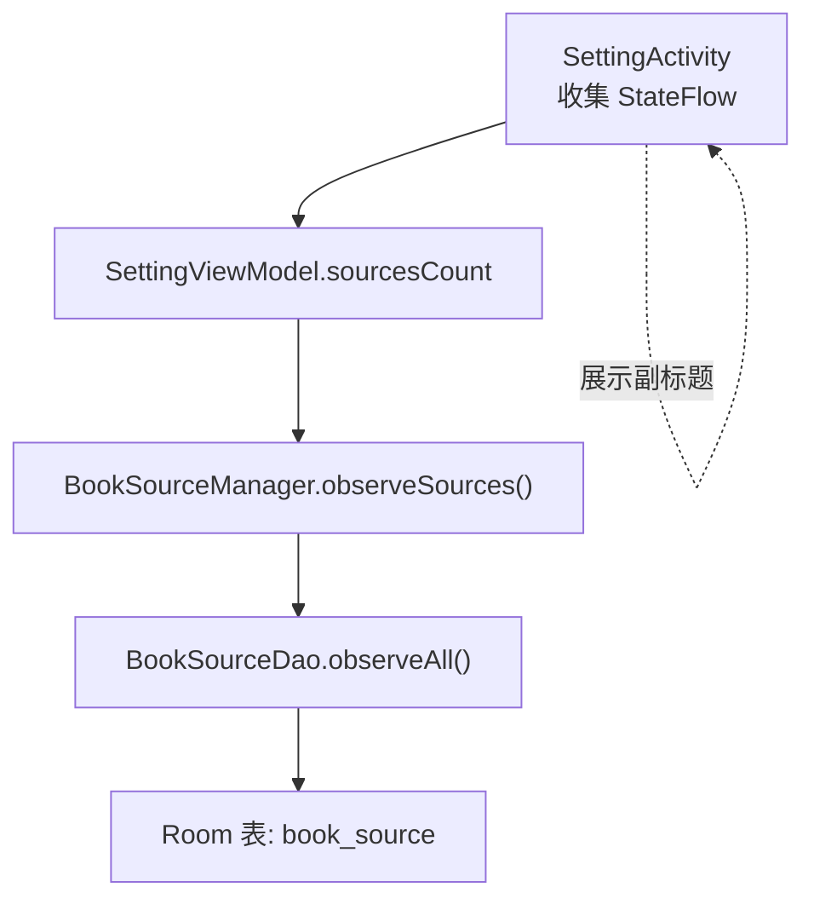
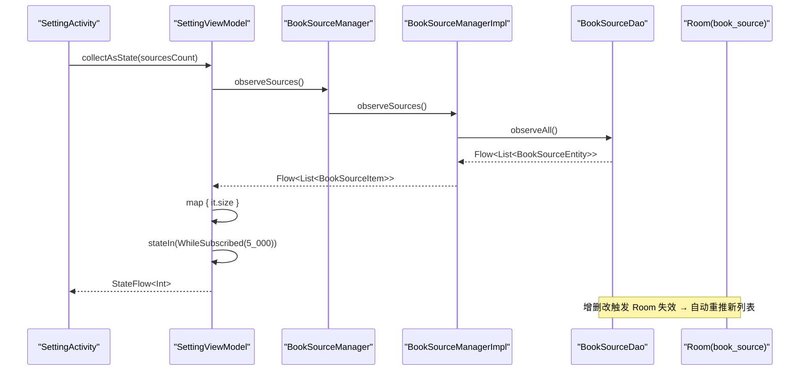
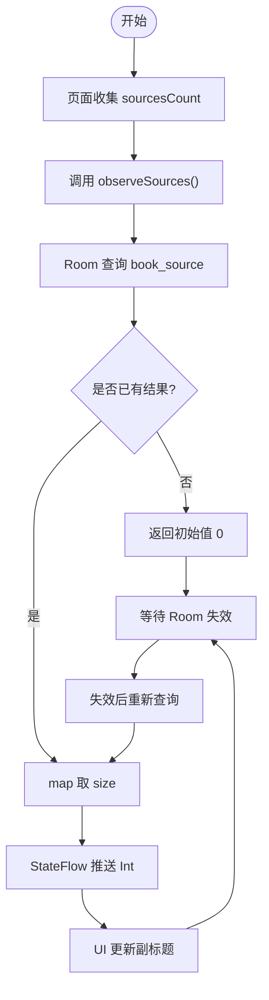

# 书源计数显示

<cite>
**本文引用的文件**
- [SettingViewModel.kt](file://module_me/src/main/java/com/ebook/me/mvvm/viewmodel/SettingViewModel.kt)
- [BookSourceManager.kt](file://lib_book_common/src/main/java/com/ebook/common/analyze/source/BookSourceManager.kt)
- [BookSourceManagerImpl.kt](file://lib_book_common/src/main/java/com/ebook/common/analyze/source/BookSourceManagerImpl.kt)
- [BookSourceDao.kt](file://lib_ebook_db/src/main/java/com/ebook/db/dao/BookSourceDao.kt)
- [BookSourceItem.kt](file://lib_book_common/src/main/java/com/ebook/common/analyze/source/BookSourceItem.kt)
- [SettingActivity.kt](file://module_me/src/main/java/com/ebook/me/view/SettingActivity.kt)
- [SettingViewModelTest.kt](file://module_me/src/test/java/com/ebook/me/mvvm/viewmodel/SettingViewModelTest.kt)
</cite>

## 目录
1. [简介](#简介)
2. [项目结构](#项目结构)
3. [核心组件](#核心组件)
4. [架构总览](#架构总览)
5. [详细组件分析](#详细组件分析)
6. [依赖关系分析](#依赖关系分析)
7. [性能考量](#性能考量)
8. [故障排查指南](#故障排查指南)
9. [结论](#结论)
10. [附录](#附录)

## 简介
本文聚焦“设置页书源入口计数”功能的实现与原理：通过 SettingViewModel 暴露 sourcesCount，基于 BookSourceManager.observeSources() 的冷流获取书源清单，map 取数量，并用 stateIn + WhileSubscribed(5_000) 控制订阅生命周期。重点说明计数口径为“当前书源总数（含禁用）”，以及 Room 失效追踪如何保证数据自动刷新；同时解释 WhySubscribed 的性能收益，并提供扩展统计维度、自定义计数规则与大批量查询优化的实践建议。

## 项目结构
该功能横跨 UI 层（SettingActivity）、状态层（SettingViewModel）、领域服务（BookSourceManager/Impl）与数据访问层（Room DAO）。整体流向如下：

图表来源
- [SettingActivity.kt:105-109](file://module_me/src/main/java/com/ebook/me/view/SettingActivity.kt#L105-L109)
- [SettingViewModel.kt:155-161](file://module_me/src/main/java/com/ebook/me/mvvm/viewmodel/SettingViewModel.kt#L155-L161)
- [BookSourceManager.kt:242-255](file://lib_book_common/src/main/java/com/ebook/common/analyze/source/BookSourceManager.kt#L242-L255)
- [BookSourceManagerImpl.kt:834-836](file://lib_book_common/src/main/java/com/ebook/common/analyze/source/BookSourceManagerImpl.kt#L834-L836)
- [BookSourceDao.kt:27-36](file://lib_ebook_db/src/main/java/com/ebook/db/dao/BookSourceDao.kt#L27-L36)

章节来源
- [SettingActivity.kt:105-109](file://module_me/src/main/java/com/ebook/me/view/SettingActivity.kt#L105-L109)
- [SettingViewModel.kt:155-161](file://module_me/src/main/java/com/ebook/me/mvvm/viewmodel/SettingViewModel.kt#L155-L161)
- [BookSourceManager.kt:242-255](file://lib_book_common/src/main/java/com/ebook/common/analyze/source/BookSourceManager.kt#L242-L255)
- [BookSourceManagerImpl.kt:834-836](file://lib_book_common/src/main/java/com/ebook/common/analyze/source/BookSourceManagerImpl.kt#L834-L836)
- [BookSourceDao.kt:27-36](file://lib_ebook_db/src/main/java/com/ebook/db/dao/BookSourceDao.kt#L27-L36)

## 核心组件
- SettingViewModel.sourcesCount：负责对外暴露“当前书源总数”的 StateFlow<Int>，以 map 将清单条数映射为 Int，并通过 stateIn 启动共享热流，使用 WhileSubscribed(5_000) 在无订阅者时停止监听。
- BookSourceManager.observeSources()：返回 Flow<List<BookSourceItem>>，读 Room 并包含被禁用的源，供管理页渲染与计数使用。
- BookSourceDao.observeAll()：Room 提供的 Flow 查询，具备失效追踪能力，增删改后自动重推新列表。
- BookSourceItem：承载条目级元数据（格式出身等），但本计数只关心条数，不消费其规则内容。

章节来源
- [SettingViewModel.kt:141-161](file://module_me/src/main/java/com/ebook/me/mvvm/viewmodel/SettingViewModel.kt#L141-L161)
- [BookSourceManager.kt:242-255](file://lib_book_common/src/main/java/com/ebook/common/analyze/source/BookSourceManager.kt#L242-L255)
- [BookSourceManagerImpl.kt:834-836](file://lib_book_common/src/main/java/com/ebook/common/analyze/source/BookSourceManagerImpl.kt#L834-L836)
- [BookSourceDao.kt:27-36](file://lib_ebook_db/src/main/java/com/ebook/db/dao/BookSourceDao.kt#L27-L36)
- [BookSourceItem.kt:6-49](file://lib_book_common/src/main/java/com/ebook/common/analyze/source/BookSourceItem.kt#L6-L49)

## 架构总览
下图展示从 UI 到数据库的完整调用链，以及 Room 失效驱动的自动刷新机制。

图表来源
- [SettingActivity.kt:105-109](file://module_me/src/main/java/com/ebook/me/view/SettingActivity.kt#L105-L109)
- [SettingViewModel.kt:155-161](file://module_me/src/main/java/com/ebook/me/mvvm/viewmodel/SettingViewModel.kt#L155-L161)
- [BookSourceManager.kt:242-255](file://lib_book_common/src/main/java/com/ebook/common/analyze/source/BookSourceManager.kt#L242-L255)
- [BookSourceManagerImpl.kt:834-836](file://lib_book_common/src/main/java/com/ebook/common/analyze/source/BookSourceManagerImpl.kt#L834-L836)
- [BookSourceDao.kt:27-36](file://lib_ebook_db/src/main/java/com/ebook/db/dao/BookSourceDao.kt#L27-L36)

## 详细组件分析

### SettingViewModel.sourcesCount 的状态流
- 数据来源：bookSourceManager.observeSources() 返回冷流，收集时才查库。
- 变换：map { it.size } 仅提取清单长度作为计数。
- 共享策略：stateIn(viewModelScope, SharingStarted.WhileSubscribed(5_000), initialValue = 0)。无订阅者时停止监听，避免后台挂 Room 失效订阅；首次值为 0 表示占位，真值到达后自动刷新。
- 用途：SettingActivity 中通过 collectAsState 读取并展示在“书源管理”行的副标题。

章节来源
- [SettingViewModel.kt:141-161](file://module_me/src/main/java/com/ebook/me/mvvm/viewmodel/SettingViewModel.kt#L141-L161)
- [SettingActivity.kt:105-109](file://module_me/src/main/java/com/ebook/me/view/SettingActivity.kt#L105-L109)

### 计数口径：显示“全部源数（含禁用）”
- 行为：sourcesCount 对 observeSources() 返回的 List 求 size，包含 enabled=false 的行。
- 设计理由：入口行回答的是“你手上有几个源”，禁用项仍在清单里可在管理页打开，不应只显示启用源数。
- 验证：单元测试断言含禁用项的清单长度即为最终数字。

章节来源
- [SettingViewModel.kt:141-161](file://module_me/src/main/java/com/ebook/me/mvvm/viewmodel/SettingViewModel.kt#L141-L161)
- [SettingViewModelTest.kt:414-432](file://module_me/src/test/java/com/ebook/me/mvvm/viewmodel/SettingViewModelTest.kt#L414-L432)

### observeSources() 的 Room 失效追踪
- 实现：observeSources() 直接委托 dao.observeAll()，后者是 Room 的 Flow 查询，具备失效追踪能力。
- 效果：首帧初值 0 仅为占位，当 Room 收到增删改事件后，Flow 会重新发出新列表，VM 自动 map 出新数量，无需 onResume 重算。
- 线程：flowOn(Dispatchers.IO) 确保查询在 IO 调度器执行。

章节来源
- [BookSourceManagerImpl.kt:834-836](file://lib_book_common/src/main/java/com/ebook/common/analyze/source/BookSourceManagerImpl.kt#L834-L836)
- [BookSourceDao.kt:27-36](file://lib_ebook_db/src/main/java/com/ebook/db/dao/BookSourceDao.kt#L27-L36)

### WhileSubscribed(5_000) 的性能优化
- 动机：设置页可能被长期压在返回栈里，若一直持有订阅，Room 失效监听也会持续存在；设置 5s 无订阅则取消，减少不必要的监听开销。
- 语义：initialValue = 0 保证 UI 有初始态；一旦页面 collectAsState，立即建立热流并开始监听。

章节来源
- [SettingViewModel.kt:155-161](file://module_me/src/main/java/com/ebook/me/mvvm/viewmodel/SettingViewModel.kt#L155-L161)

### 数据模型与边界
- BookSourceItem：用于管理页的条目面，携带 format 元数据；但本计数只关心条数，不消费 rule 字段。
- 接口契约：observeSources() 明确为冷流，返回全量清单（含禁用），与管理页需求一致。

章节来源
- [BookSourceItem.kt:6-49](file://lib_book_common/src/main/java/com/ebook/common/analyze/source/BookSourceItem.kt#L6-L49)
- [BookSourceManager.kt:242-255](file://lib_book_common/src/main/java/com/ebook/common/analyze/source/BookSourceManager.kt#L242-L255)

### 流程图：计数计算与刷新

图表来源
- [SettingViewModel.kt:155-161](file://module_me/src/main/java/com/ebook/me/mvvm/viewmodel/SettingViewModel.kt#L155-L161)
- [BookSourceManagerImpl.kt:834-836](file://lib_book_common/src/main/java/com/ebook/common/analyze/source/BookSourceManagerImpl.kt#L834-L836)
- [BookSourceDao.kt:27-36](file://lib_ebook_db/src/main/java/com/ebook/db/dao/BookSourceDao.kt#L27-L36)

## 依赖关系分析
- SettingActivity 依赖 SettingViewModel 暴露的 StateFlow 进行展示。
- SettingViewModel 依赖 BookSourceManager 抽象，实际由 BookSourceManagerImpl 提供。
- BookSourceManagerImpl 依赖 BookSourceDao 进行 Room 查询。
- BookSourceDao 定义 observeAll() 等 Flow 查询，Room 负责失效传播。

图表来源
- [SettingActivity.kt:105-109](file://module_me/src/main/java/com/ebook/me/view/SettingActivity.kt#L105-L109)
- [SettingViewModel.kt:155-161](file://module_me/src/main/java/com/ebook/me/mvvm/viewmodel/SettingViewModel.kt#L155-L161)
- [BookSourceManagerImpl.kt:834-836](file://lib_book_common/src/main/java/com/ebook/common/analyze/source/BookSourceManagerImpl.kt#L834-L836)
- [BookSourceDao.kt:27-36](file://lib_ebook_db/src/main/java/com/ebook/db/dao/BookSourceDao.kt#L27-L36)

章节来源
- [SettingActivity.kt:105-109](file://module_me/src/main/java/com/ebook/me/view/SettingActivity.kt#L105-L109)
- [SettingViewModel.kt:155-161](file://module_me/src/main/java/com/ebook/me/mvvm/viewmodel/SettingViewModel.kt#L155-L161)
- [BookSourceManagerImpl.kt:834-836](file://lib_book_common/src/main/java/com/ebook/common/analyze/source/BookSourceManagerImpl.kt#L834-L836)
- [BookSourceDao.kt:27-36](file://lib_ebook_db/src/main/java/com/ebook/db/dao/BookSourceDao.kt#L27-L36)

## 性能考量
- 冷流与共享：observeSources() 为冷流，仅在收集时查库；stateIn 配合 WhileSubscribed(5_000) 在无订阅者时释放监听，避免后台常驻查询。
- 首帧占位：initialValue = 0 保证 UI 稳定，真值到达后自动刷新，避免闪烁或空状态误判。
- Room 失效：DAO 的 Flow 查询自带失效追踪，任何增删改都会触发重新查询，无需手动刷新。
- 批量查询优化建议：
  - 若未来需要更多统计维度（如按分组统计、脚本源占比），建议在 BookSourceManagerImpl 内聚合一次后分发多个视图所需的数据，避免多次遍历。
  - 对大量书源的场景，可在 DAO 层增加聚合查询（如 COUNT、GROUP BY）以减少内存映射与重复遍历。
  - 将 map 操作尽量靠近数据源，减少中间对象创建。

[本节为通用性能讨论，不直接分析具体文件]

## 故障排查指南
- 现象：设置页“书源管理”行始终显示 0。
  - 可能原因：页面未 collect sourcesCount；或 Room 尚未返回真值（首帧占位为 0 正常）。
  - 处理：确认 Activity 中 collectAsState 已绑定；等待 Room 失效推送。
- 现象：用户导入/删除/禁用源后，数字未更新。
  - 检查 BookSourceDao.observeAll() 是否正确被 observeSources() 委托；确认写操作（插入/删除/启用切换）是否生效。
  - Room 应自动重推；若仍不更新，检查是否存在其他拦截或覆盖逻辑。
- 现象：后台长时间运行导致资源占用偏高。
  - 确认 WhileSubscribed(5_000) 配置正确；检查是否有异常保持订阅存活。

章节来源
- [SettingViewModel.kt:155-161](file://module_me/src/main/java/com/ebook/me/mvvm/viewmodel/SettingViewModel.kt#L155-L161)
- [BookSourceManagerImpl.kt:834-836](file://lib_book_common/src/main/java/com/ebook/common/analyze/source/BookSourceManagerImpl.kt#L834-L836)
- [BookSourceDao.kt:27-36](file://lib_ebook_db/src/main/java/com/ebook/db/dao/BookSourceDao.kt#L27-L36)

## 结论
sourcesCount 的实现遵循“单一事实源 + 冷流 + 共享热流 + 失效驱动”的模式：通过 BookSourceManager.observeSources() 读取 Room 全量清单（含禁用），map 出数量并以 WhileSubscribed 控制生命周期；Room 失效追踪保证数据自动刷新，无需额外生命周期回调。该设计简洁、可维护且性能友好，适合扩展更多统计维度与定制计数规则。

[本节总结性内容，不直接分析具体文件]

## 附录

### 扩展书源统计维度的方法
- 在 SettingViewModel 新增多个 StateFlow，分别基于 observeSources() 做不同 map/过滤（例如：脚本源数量、启用源数量、按分组计数）。
- 为避免多次遍历，可在 BookSourceManagerImpl 内构建一次聚合数据，再分发给各视图。

章节来源
- [BookSourceManager.kt:242-255](file://lib_book_common/src/main/java/com/ebook/common/analyze/source/BookSourceManager.kt#L242-L255)
- [BookSourceManagerImpl.kt:834-836](file://lib_book_common/src/main/java/com/ebook/common/analyze/source/BookSourceManagerImpl.kt#L834-L836)

### 自定义书源计数规则
- 若需改变计数口径（如仅启用源、或排除特定分组），可在 SettingViewModel 中对 observeSources() 的结果先 filter 再 size。
- 注意保持口径与业务语义一致，并在测试中覆盖边界情况。

章节来源
- [SettingViewModel.kt:155-161](file://module_me/src/main/java/com/ebook/me/mvvm/viewmodel/SettingViewModel.kt#L155-L161)

### 优化大量书源的查询性能
- 在 DAO 层引入聚合查询（COUNT/GROUP BY）减少数据搬运。
- 在 Manager 层合并多视图所需聚合结果，避免重复遍历。
- 谨慎使用 Flow 的转换链，尽量靠近数据源完成过滤与映射。

[本节为通用优化建议，不直接分析具体文件]