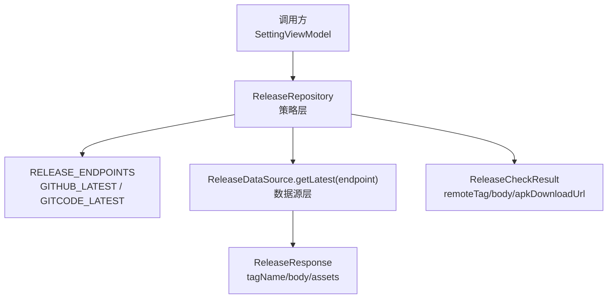
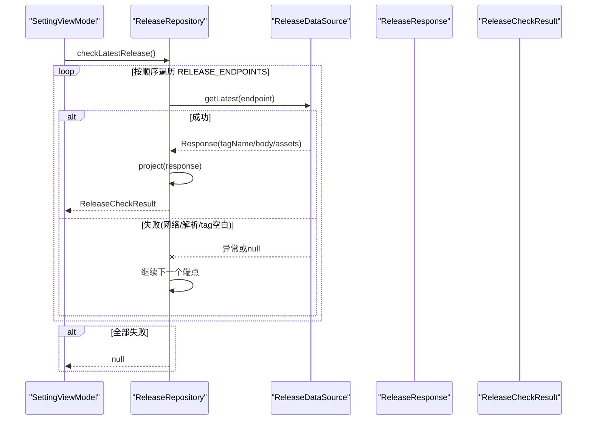
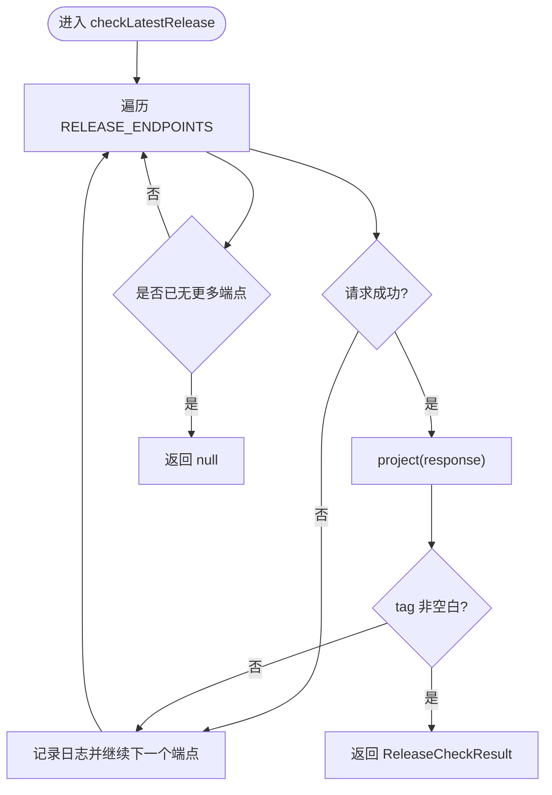
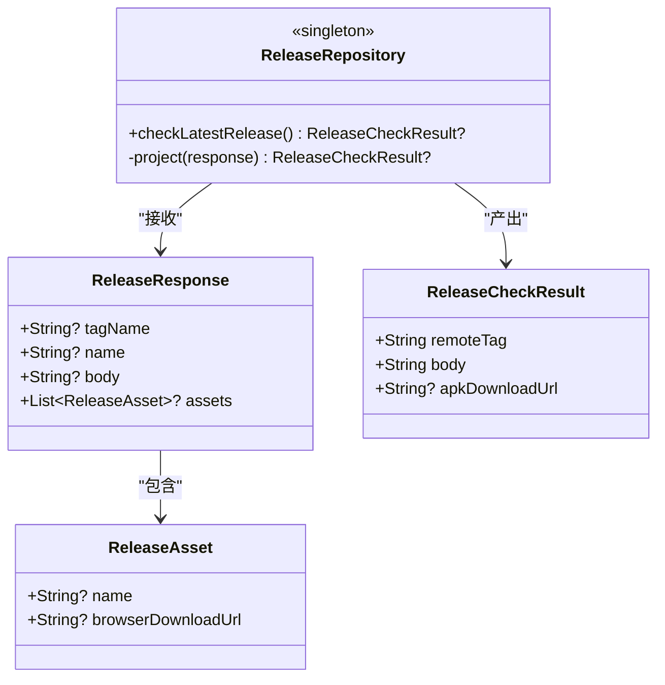
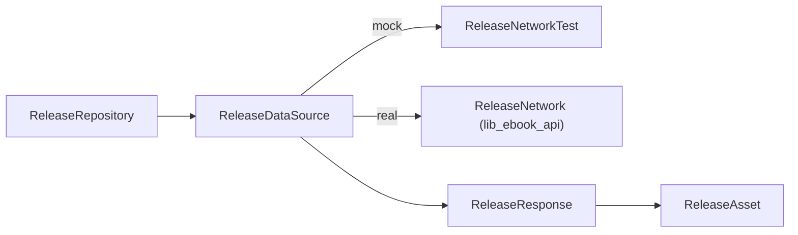

# 发布源策略

<cite>
**本文引用的文件**
- [ReleaseRepository.kt](file://module_me/src/main/java/com/ebook/me/repository/ReleaseRepository.kt)
- [ReleaseRepositoryTest.kt](file://module_me/src/test/java/com/ebook/me/repository/ReleaseRepositoryTest.kt)
- [ReleaseDataSource.kt](file://lib_ebook_api/src/main/java/com/ebook/api/service/release/ReleaseDataSource.kt)
- [ReleaseNetworkTest.kt](file://lib_ebook_api/src/main/java/com/ebook/api/service/release/ReleaseNetworkTest.kt)
- [ReleaseResponse.kt](file://lib_ebook_api/src/main/java/com/ebook/api/entity/ReleaseResponse.kt)
- [ReleaseStateStore.kt](file://module_me/src/main/java/com/ebook/me/repository/ReleaseStateStore.kt)
- [0021-release-update-check-ownership.md](file://docs/adr/0021-release-update-check-ownership.md)
</cite>

## 目录
1. [简介](#简介)
2. [项目结构](#项目结构)
3. [核心组件](#核心组件)
4. [架构总览](#架构总览)
5. [详细组件分析](#详细组件分析)
6. [依赖关系分析](#依赖关系分析)
7. [性能考量](#性能考量)
8. [故障排查指南](#故障排查指南)
9. [结论](#结论)
10. [附录：扩展与定制示例](#附录：扩展与定制示例)

## 简介
本文件聚焦“版本更新检查”的策略层设计，围绕 ReleaseRepository 的职责边界、发布源清单与优先级、failover 机制、APK 过滤规则以及结果投影进行系统化说明。同时给出异常处理策略、关键流程时序图与可操作的扩展指南（如何新增发布源、修改 APK 过滤规则、适配特殊发布格式）。

## 项目结构
与发布检查相关的代码分布在两个层次：
- 策略层（module_me）：ReleaseRepository 负责“打哪个源、失败怎么回退、什么算有效结果、结果如何投影”。
- 数据源层（lib_ebook_api）：ReleaseDataSource 接口及实现（真实网络或 mock），只负责“按端点拉取 latest Release 的 JSON 并解码为 ReleaseResponse”。

图示来源
- [ReleaseRepository.kt:36-110](file://module_me/src/main/java/com/ebook/me/repository/ReleaseRepository.kt#L36-L110)
- [ReleaseDataSource.kt:12-20](file://lib_ebook_api/src/main/java/com/ebook/api/service/release/ReleaseDataSource.kt#L12-L20)
- [ReleaseResponse.kt:24-45](file://lib_ebook_api/src/main/java/com/ebook/api/entity/ReleaseResponse.kt#L24-L45)

章节来源
- [ReleaseRepository.kt:13-34](file://module_me/src/main/java/com/ebook/me/repository/ReleaseRepository.kt#L13-L34)
- [0021-release-update-check-ownership.md:11-20](file://docs/adr/0021-release-update-check-ownership.md#L11-L20)

## 核心组件
- ReleaseRepository：策略层，维护发布源清单、failover 逻辑、APK 过滤、结果投影。
- ReleaseDataSource：数据源抽象，按端点获取 latest Release 的 JSON 并解码为 ReleaseResponse。
- ReleaseResponse/ReleaseAsset：两平台同构的数据模型，字段均可为空。
- ReleaseCheckResult：策略层对外暴露的结果，包含远端 tag、发布说明与可选的 APK 下载入口。
- ReleaseStateStore：本地持久化上次检查到的 tag 与时间，用于角标与限频判断（不在本文件展开细节）。

章节来源
- [ReleaseRepository.kt:36-126](file://module_me/src/main/java/com/ebook/me/repository/ReleaseRepository.kt#L36-L126)
- [ReleaseDataSource.kt:12-20](file://lib_ebook_api/src/main/java/com/ebook/api/service/release/ReleaseDataSource.kt#L12-L20)
- [ReleaseResponse.kt:24-45](file://lib_ebook_api/src/main/java/com/ebook/api/entity/ReleaseResponse.kt#L24-L45)
- [ReleaseStateStore.kt:12-31](file://module_me/src/main/java/com/ebook/me/repository/ReleaseStateStore.kt#L12-L31)

## 架构总览
ReleaseRepository 作为策略层，将“源选择与降级”“响应解析有效性判定”“安装包附件筛选”“结果投影”集中管理；HTTP 细节交由 ReleaseDataSource 抽象，真实网络实现位于 lib_ebook_api，mock 实现 ReleaseNetworkTest 用于离线测试与独立模块运行。

图示来源
- [ReleaseRepository.kt:46-70](file://module_me/src/main/java/com/ebook/me/repository/ReleaseRepository.kt#L46-L70)
- [ReleaseDataSource.kt:12-20](file://lib_ebook_api/src/main/java/com/ebook/api/service/release/ReleaseDataSource.kt#L12-L20)
- [ReleaseResponse.kt:24-45](file://lib_ebook_api/src/main/java/com/ebook/api/entity/ReleaseResponse.kt#L24-L45)

## 详细组件分析

### ReleaseRepository：策略层职责
- 发布源清单与优先级：RELEASE_ENDPOINTS 顺序即优先级，GITHUB_LATEST 在前为主源，GITCODE_LATEST 作为国内兜底。
- checkLatestRelease() 遍历逻辑：按顺序请求各端点，返回第一个成功源的结果；全部失败返回 null。
- project() 投影逻辑：验证 tag 有效性（空白视为无效）、筛选 .apk 附件（忽略 zip/tar.gz 等源码归档）、构建 ReleaseCheckResult。
- 异常处理策略：SerializationException 表示响应形态不对，继续备用源；CancellationException 原样抛出避免误判为源失败。

图示来源
- [ReleaseRepository.kt:46-70](file://module_me/src/main/java/com/ebook/me/repository/ReleaseRepository.kt#L46-L70)
- [ReleaseRepository.kt:77-88](file://module_me/src/main/java/com/ebook/me/repository/ReleaseRepository.kt#L77-L88)

章节来源
- [ReleaseRepository.kt:40-110](file://module_me/src/main/java/com/ebook/me/repository/ReleaseRepository.kt#L40-L110)

### 发布源清单与优先级
- GITHUB_LATEST：主源，优先尝试。
- GITCODE_LATEST：国内兜底，当主源失败时自动切换。
- 清单以完整端点形式保存，便于直接传入 ReleaseService 的动态 @Url。

章节来源
- [ReleaseRepository.kt:90-110](file://module_me/src/main/java/com/ebook/me/repository/ReleaseRepository.kt#L90-L110)

### failover 机制
- 遍历顺序即优先级：先 GitHub，再 Gitcode。
- 任一环节失败（网络异常、JSON 解析异常、tag 空白）即继续下一个端点。
- 全部失败则返回 null，调用方据此显示“检查失败”。

章节来源
- [ReleaseRepository.kt:46-70](file://module_me/src/main/java/com/ebook/me/repository/ReleaseRepository.kt#L46-L70)
- [ReleaseRepositoryTest.kt:65-121](file://module_me/src/test/java/com/ebook/me/repository/ReleaseRepositoryTest.kt#L65-L121)

### APK 过滤与结果投影
- 仅识别 .apk 附件，忽略 zip/tar.gz 等源码归档。
- tag 空白视为该源无效，继续备用源。
- 若无 APK 附件，仍返回结果，apkDownloadUrl 为 null，由 UI 决定降级展示。

图示来源
- [ReleaseResponse.kt:24-45](file://lib_ebook_api/src/main/java/com/ebook/api/entity/ReleaseResponse.kt#L24-L45)
- [ReleaseRepository.kt:77-126](file://module_me/src/main/java/com/ebook/me/repository/ReleaseRepository.kt#L77-L126)

章节来源
- [ReleaseRepository.kt:72-88](file://module_me/src/main/java/com/ebook/me/repository/ReleaseRepository.kt#L72-L88)
- [ReleaseResponse.kt:24-45](file://lib_ebook_api/src/main/java/com/ebook/api/entity/ReleaseResponse.kt#L24-L45)

### 异常处理策略
- SerializationException：响应形态不符合预期，记日志并切换到备用源。
- CancellationException：协程取消，必须原样抛出，避免被误判为“某个源失败”而继续请求备用源。
- 其他 Exception：网络或系统异常，记日志并切换到备用源。

章节来源
- [ReleaseRepository.kt:46-70](file://module_me/src/main/java/com/ebook/me/repository/ReleaseRepository.kt#L46-L70)
- [ReleaseRepositoryTest.kt:173-183](file://module_me/src/test/java/com/ebook/me/repository/ReleaseRepositoryTest.kt#L173-L183)

### 与 ReleaseStateStore 的协作
- ReleaseRepository 专注“远端有什么”，ReleaseStateStore 专注“上次检查到什么”，二者共同构成更新检查域的两半。
- 成功检查后，由上层 ViewModel 决定是否落盘（仅当可解析版本且比较得出明确结论时才写入）。

章节来源
- [ReleaseRepository.kt:13-21](file://module_me/src/main/java/com/ebook/me/repository/ReleaseRepository.kt#L13-L21)
- [ReleaseStateStore.kt:12-31](file://module_me/src/main/java/com/ebook/me/repository/ReleaseStateStore.kt#L12-L31)

## 依赖关系分析
- ReleaseRepository 依赖 ReleaseDataSource 抽象，解耦具体网络实现。
- ReleaseDataSource 的实现包括真实网络与 mock（ReleaseNetworkTest），后者固定返回资产，便于离线测试。
- 实体 ReleaseResponse/ReleaseAsset 由 lib_ebook_api 提供，两端共享同一数据结构。

图示来源
- [ReleaseDataSource.kt:12-20](file://lib_ebook_api/src/main/java/com/ebook/api/service/release/ReleaseDataSource.kt#L12-L20)
- [ReleaseNetworkTest.kt:32-49](file://lib_ebook_api/src/main/java/com/ebook/api/service/release/ReleaseNetworkTest.kt#L32-L49)
- [ReleaseResponse.kt:24-45](file://lib_ebook_api/src/main/java/com/ebook/api/entity/ReleaseResponse.kt#L24-L45)

章节来源
- [ReleaseNetworkTest.kt:14-31](file://lib_ebook_api/src/main/java/com/ebook/api/service/release/ReleaseNetworkTest.kt#L14-L31)
- [ReleaseRepository.kt:36-40](file://module_me/src/main/java/com/ebook/me/repository/ReleaseRepository.kt#L36-L40)

## 性能考量
- 源顺序即优先级：主源成功立即返回，减少不必要请求。
- 只在失败时触发备用源，避免重复往返。
- APK 过滤基于扩展名匹配，计算开销低。
- 协程取消原样抛出，避免在页面销毁后继续发起多余请求。

[本节为通用指导，不直接分析具体文件]

## 故障排查指南
- 全部源失败：检查网络连通性、服务端可用性、JSON 契约是否变更（导致 SerializationException）。
- 始终返回无 APK：确认发布页附件命名是否为 .apk；如为源码归档，需调整过滤规则或增加新规则。
- 协程取消被吞：若出现“页面销毁后仍请求备用源”，检查是否捕获并错误地吞掉了 CancellationException。
- 缓存与角标异常：确认 ReleaseStateStore 是否正确落盘与限频（仅在成功检查时写入）。

章节来源
- [ReleaseRepositoryTest.kt:114-183](file://module_me/src/test/java/com/ebook/me/repository/ReleaseRepositoryTest.kt#L114-L183)
- [ReleaseStateStore.kt:66-128](file://module_me/src/main/java/com/ebook/me/repository/ReleaseStateStore.kt#L66-L128)

## 结论
ReleaseRepository 通过清晰的策略层设计，将发布源清单、优先级、failover、APK 过滤与结果投影集中管理，既保证高可用（双源兜底），又保持对业务调用的简洁与稳定。结合 ReleaseStateStore 的本地状态与限频策略，整体形成稳健的版本更新检查方案。

[本节为总结，不直接分析具体文件]

## 附录：扩展与定制示例

### 如何添加新的发布源
- 步骤：
  - 在 RELEASE_ENDPOINTS 中追加新的端点常量，并确保其位置符合优先级需求（越靠前优先级越高）。
  - 确保该端点的 JSON 结构与 ReleaseResponse 一致（tagName/body/assets）。
  - 在单元测试中覆盖“主源失败→新源成功”的 failover 路径。
- 参考位置：
  - 端点常量与清单定义
  - 遍历与 failover 逻辑
  - 单测用例中的断言顺序

章节来源
- [ReleaseRepository.kt:90-110](file://module_me/src/main/java/com/ebook/me/repository/ReleaseRepository.kt#L90-L110)
- [ReleaseRepositoryTest.kt:76-100](file://module_me/src/test/java/com/ebook/me/repository/ReleaseRepositoryTest.kt#L76-L100)

### 如何修改 APK 过滤规则
- 当前规则：仅识别 .apk 扩展名，忽略 zip/tar.gz 等源码归档。
- 如需支持其他安装格式（例如 .aab/.xapk），可在 project() 中扩展附件筛选条件，或在常量中定义后缀集合。
- 注意：若无安装包附件，仍应返回结果（apkDownloadUrl 为 null），由 UI 降级处理。

章节来源
- [ReleaseRepository.kt:77-88](file://module_me/src/main/java/com/ebook/me/repository/ReleaseRepository.kt#L77-L88)
- [ReleaseRepositoryTest.kt:123-171](file://module_me/src/test/java/com/ebook/me/repository/ReleaseRepositoryTest.kt#L123-L171)

### 如何处理特殊的发布格式
- 若平台返回的 tagName 不是标准版本号（如含前缀/后缀），需在 project() 中进行归一化处理后再比较。
- 若附件命名不规范（大小写混写/自定义后缀），应在筛选逻辑中兼容（当前已对 .apk 大小写不敏感）。
- 若响应结构变化（字段缺失/类型变化），应同步更新 DTO 与异常分支，确保 SerializationException 能正确触发备用源。

章节来源
- [ReleaseRepository.kt:77-88](file://module_me/src/main/java/com/ebook/me/repository/ReleaseRepository.kt#L77-L88)
- [ReleaseResponse.kt:24-45](file://lib_ebook_api/src/main/java/com/ebook/api/entity/ReleaseResponse.kt#L24-L45)
- [ReleaseRepositoryTest.kt:141-171](file://module_me/src/test/java/com/ebook/me/repository/ReleaseRepositoryTest.kt#L141-L171)