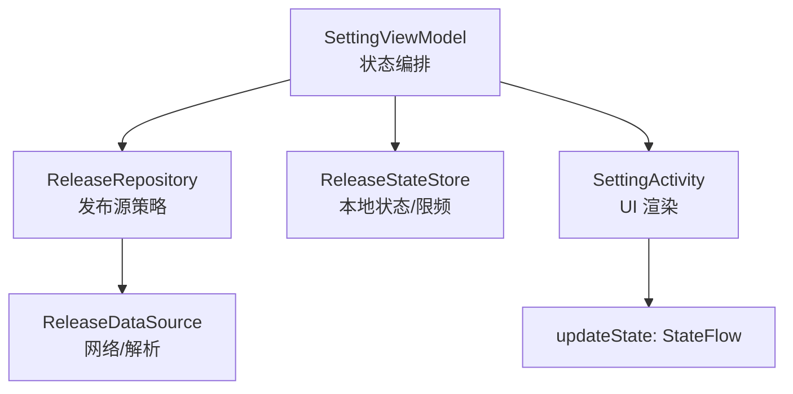
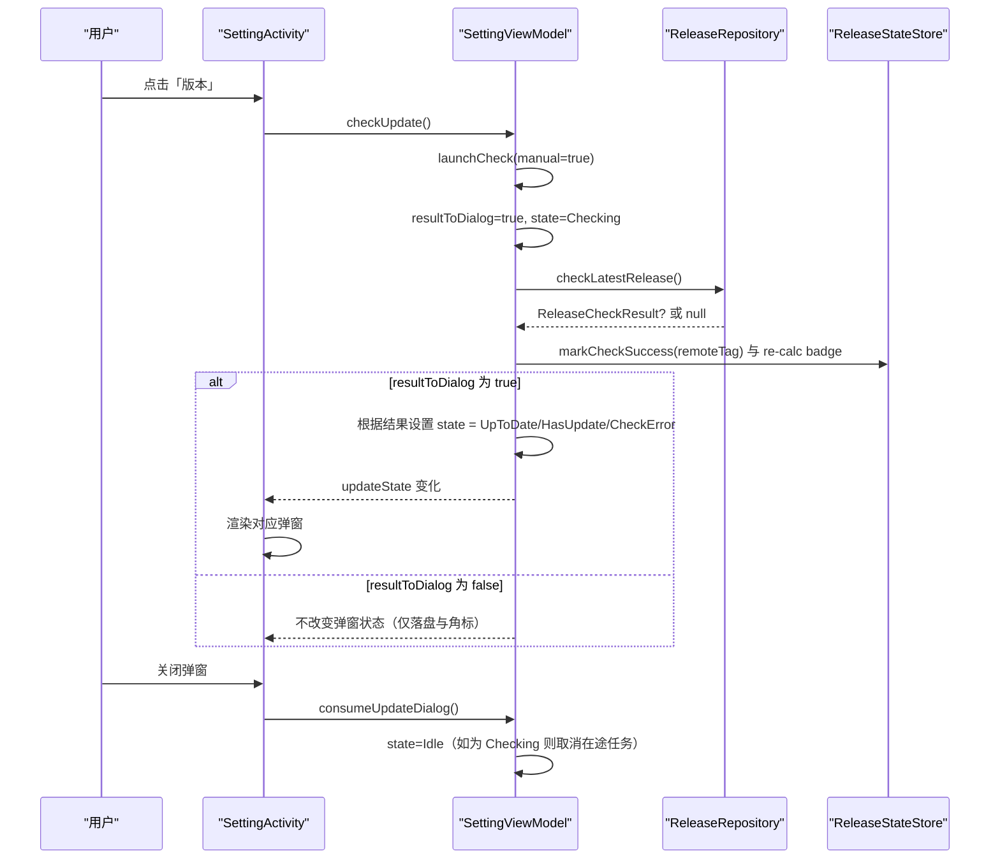
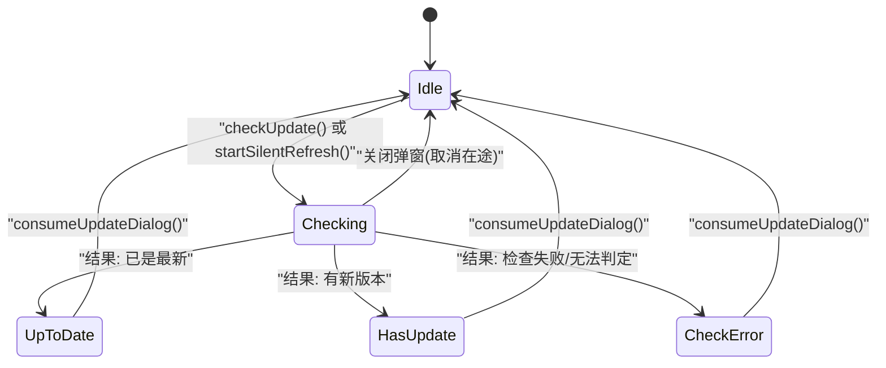
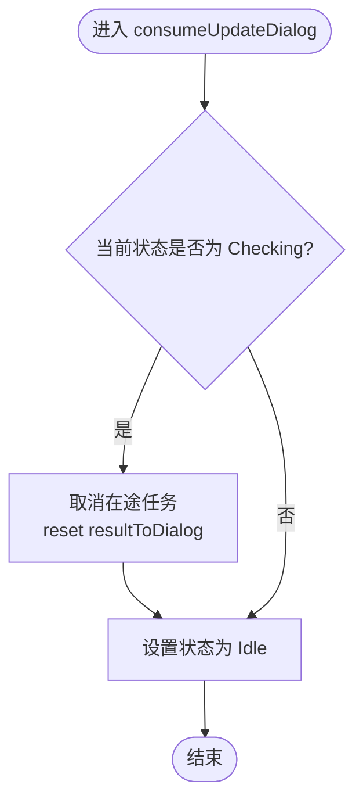
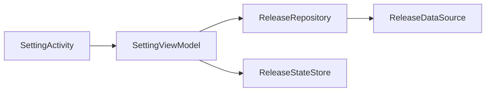

# 更新状态机

<cite>
**本文引用的文件**   
- [SettingViewModel.kt](file://module_me/src/main/java/com/ebook/me/mvvm/viewmodel/SettingViewModel.kt)
- [SettingActivity.kt](file://module_me/src/main/java/com/ebook/me/view/SettingActivity.kt)
- [ReleaseRepository.kt](file://module_me/src/main/java/com/ebook/me/repository/ReleaseRepository.kt)
- [ReleaseStateStore.kt](file://module_me/src/main/java/com/ebook/me/repository/ReleaseStateStore.kt)
- [SettingViewModelTest.kt](file://module_me/src/test/java/com/ebook/me/mvvm/viewmodel/SettingViewModelTest.kt)
</cite>

## 目录
1. [简介](#简介)
2. [项目结构](#项目结构)
3. [核心组件](#核心组件)
4. [架构总览](#架构总览)
5. [详细组件分析](#详细组件分析)
6. [依赖关系分析](#依赖关系分析)
7. [性能与并发特性](#性能与并发特性)
8. [故障排查指南](#故障排查指南)
9. [结论](#结论)

## 简介
本文档聚焦“版本更新检查”的状态机设计：以 UpdateState 密封接口为中心，描述 Idle、Checking、UpToDate、HasUpdate、CheckError 五种状态的语义与转换流程；解释 resultToDialog 标志位对主动检查与静默刷新的分流作用；说明在途检查被用户关闭弹窗时的取消逻辑；并给出 UI 层根据状态渲染不同界面的方式。所有细节均基于当前代码实现进行归纳。

## 项目结构
与更新检查相关的核心文件集中在 module_me：
- SettingViewModel：编排检查生命周期、维护 updateState 流与 resultToDialog 标志位
- SettingActivity：收集 updateState 并渲染对应弹窗
- ReleaseRepository：发布源策略（failover、APK 过滤、结果投影）
- ReleaseStateStore：持久化上次检查 tag 与成功时间，派生角标与限频判断

图表来源
- [SettingViewModel.kt:90-115](file://module_me/src/main/java/com/ebook/me/mvvm/viewmodel/SettingViewModel.kt#L90-L115)
- [SettingViewModel.kt:236-257](file://module_me/src/main/java/com/ebook/me/mvvm/viewmodel/SettingViewModel.kt#L236-L257)
- [ReleaseRepository.kt:46-70](file://module_me/src/main/java/com/ebook/me/repository/ReleaseRepository.kt#L46-L70)
- [ReleaseStateStore.kt:12-31](file://module_me/src/main/java/com/ebook/me/repository/ReleaseStateStore.kt#L12-L31)
- [SettingActivity.kt:98-142](file://module_me/src/main/java/com/ebook/me/view/SettingActivity.kt#L98-L142)

章节来源
- [SettingViewModel.kt:90-115](file://module_me/src/main/java/com/ebook/me/mvvm/viewmodel/SettingViewModel.kt#L90-L115)
- [SettingActivity.kt:98-142](file://module_me/src/main/java/com/ebook/me/view/SettingActivity.kt#L98-L142)

## 核心组件
- UpdateState 密封接口：定义五种状态语义，不含任何用户可见文案，纯 UI 分支依据
  - Idle：未检查或弹窗已关闭
  - Checking：正在检查，显示加载指示器
  - UpToDate：已是最新版本
  - HasUpdate(result)：发现新版本，携带远端信息供弹窗展示与下载
  - CheckError：检查失败（网络/解析）
- SettingViewModel：负责发起检查、单飞任务、resultToDialog 分流、弹窗消费与状态复位
- SettingActivity：收集 updateState，按状态渲染不同对话框
- ReleaseRepository：多源 failover、APK 附件过滤、结果投影为 ReleaseCheckResult
- ReleaseStateStore：记录 lastCheckedTag 与 lastSuccessCheckTime，派生 hasUpdateAvailable 与 shouldAutoRefresh

章节来源
- [SettingViewModel.kt:346-360](file://module_me/src/main/java/com/ebook/me/mvvm/viewmodel/SettingViewModel.kt#L346-L360)
- [SettingViewModel.kt:90-115](file://module_me/src/main/java/com/ebook/me/mvvm/viewmodel/SettingViewModel.kt#L90-L115)
- [ReleaseRepository.kt:13-34](file://module_me/src/main/java/com/ebook/me/repository/ReleaseRepository.kt#L13-L34)
- [ReleaseStateStore.kt:12-31](file://module_me/src/main/java/com/ebook/me/repository/ReleaseStateStore.kt#L12-L31)

## 架构总览
更新检查的调用链与数据流如下：
- 用户点击「版本」行 → SettingActivity 回调 viewModel.checkUpdate()
- SettingViewModel.launchCheck(manual=true) 设置 resultToDialog=true，进入 Checking，发起 releaseRepository.checkLatestRelease()
- ReleaseRepository 按顺序请求多个发布源，返回第一个有效结果或 null
- SettingViewModel 比较远端 tag 与本地版本，落盘成功 tag 与时间戳，重算角标
- 若 resultToDialog=true，则根据结果推进 updateState 到 UpToDate/HasUpdate/CheckError
- UI 根据 updateState 渲染对应弹窗；用户关闭弹窗时调用 consumeUpdateDialog()，回到 Idle

图表来源
- [SettingActivity.kt:116-121](file://module_me/src/main/java/com/ebook/me/view/SettingActivity.kt#L116-L121)
- [SettingViewModel.kt:214-257](file://module_me/src/main/java/com/ebook/me/mvvm/viewmodel/SettingViewModel.kt#L214-L257)
- [ReleaseRepository.kt:46-70](file://module_me/src/main/java/com/ebook/me/repository/ReleaseRepository.kt#L46-L70)
- [ReleaseStateStore.kt:89-101](file://module_me/src/main/java/com/ebook/me/repository/ReleaseStateStore.kt#L89-L101)

## 详细组件分析

### 状态机定义与转换
- 初始状态：Idle（未检查/弹窗已关闭）
- 进入 Checking：
  - 主动检查：checkUpdate() → launchCheck(manual=true) → resultToDialog=true → state=Checking
  - 静默刷新：startSilentRefresh() → launchCheck(manual=false) → 仅在无在途且应刷新时进入 Checking（不弹窗）
- 从 Checking 分支：
  - 成功且最新 → UpToDate
  - 成功且有新版 → HasUpdate(result)
  - 全部失败或无法判定 → CheckError
- 回到 Idle：consumeUpdateDialog() 在 Checking 时取消在途任务并复位为 Idle；在其他状态直接复位为 Idle

图表来源
- [SettingViewModel.kt:214-257](file://module_me/src/main/java/com/ebook/me/mvvm/viewmodel/SettingViewModel.kt#L214-L257)
- [SettingViewModel.kt:283-290](file://module_me/src/main/java/com/ebook/me/mvvm/viewmodel/SettingViewModel.kt#L283-L290)

章节来源
- [SettingViewModel.kt:90-115](file://module_me/src/main/java/com/ebook/me/mvvm/viewmodel/SettingViewModel.kt#L90-L115)
- [SettingViewModel.kt:214-257](file://module_me/src/main/java/com/ebook/me/mvvm/viewmodel/SettingViewModel.kt#L214-L257)
- [SettingViewModel.kt:283-290](file://module_me/src/main/java/com/ebook/me/mvvm/viewmodel/SettingViewModel.kt#L283-L290)

### resultToDialog 标志位的作用
- 区分主动检查与静默刷新的结果处理方式：
  - manual=true（主动检查）：结果进入弹窗
  - manual=false（静默刷新）：只落盘 tag 与限频时间戳，不弹窗
- 静默在途期间用户点击版本行：将 resultToDialog 升级为 true，使在途请求的结果改道进弹窗，避免“点击无反馈”
- 取消在途检查时重置 resultToDialog，防止跨任务残留导致未来静默检查意外弹窗

章节来源
- [SettingViewModel.kt:107-114](file://module_me/src/main/java/com/ebook/me/mvvm/viewmodel/SettingViewModel.kt#L107-L114)
- [SettingViewModel.kt:236-247](file://module_me/src/main/java/com/ebook/me/mvvm/viewmodel/SettingViewModel.kt#L236-L247)
- [SettingViewModel.kt:283-288](file://module_me/src/main/java/com/ebook/me/mvvm/viewmodel/SettingViewModel.kt#L283-L288)

### 检查取消的处理逻辑
- 当处于 Checking 状态且用户关闭弹窗时：
  - 取消在途协程任务（checkJob?.cancel()），真正中断备用源请求
  - 复位 resultToDialog，避免未来静默检查误弹窗
  - 将状态置回 Idle，等待下次检查

图表来源
- [SettingViewModel.kt:283-290](file://module_me/src/main/java/com/ebook/me/mvvm/viewmodel/SettingViewModel.kt#L283-L290)

章节来源
- [SettingViewModel.kt:283-290](file://module_me/src/main/java/com/ebook/me/mvvm/viewmodel/SettingViewModel.kt#L283-L290)

### UI 层状态渲染
- 通过 collectAsState 观察 updateState，按状态渲染不同对话框：
  - Idle：不展示弹窗
  - Checking：显示进度条与“检查中”文案
  - UpToDate：提示已是最新版本
  - HasUpdate：展示远端版本、发布说明、可选下载按钮
  - CheckError：提示检查失败
- 版本号旁根据 hasUpdateAvailable 派生显示“新版”角标

章节来源
- [SettingActivity.kt:102-105](file://module_me/src/main/java/com/ebook/me/view/SettingActivity.kt#L102-L105)
- [SettingActivity.kt:340-435](file://module_me/src/main/java/com/ebook/me/view/SettingActivity.kt#L340-L435)
- [SettingActivity.kt:278-306](file://module_me/src/main/java/com/ebook/me/view/SettingActivity.kt#L278-L306)

### 检查失败与“判不出结论就不算检查成功”
- 远端 tag 解析失败或本地版本读不到时，recordConclusion 返回 null，标记为检查失败且不写成功时间戳
- 这样避免用假结论占满 7 天限频窗口，也避免角标停在错误值上

章节来源
- [SettingViewModel.kt:259-271](file://module_me/src/main/java/com/ebook/me/mvvm/viewmodel/SettingViewModel.kt#L259-L271)
- [ReleaseStateStore.kt:12-31](file://module_me/src/main/java/com/ebook/me/repository/ReleaseStateStore.kt#L12-L31)

## 依赖关系分析
- SettingViewModel 依赖：
  - ReleaseRepository：获取最新版本信息
  - ReleaseStateStore：读写检查历史与限频时间
  - ThemeModeManager、UserSessionManager、BookSourceManager：其他设置页职责
- ReleaseRepository 依赖：
  - ReleaseDataSource：抽象网络/解析实现，真实与 mock 分离
- SettingActivity 依赖：
  - SettingViewModel：提供 updateState 与其他 UI 状态
  - TheRouter：页面跳转

图表来源
- [SettingActivity.kt:116-121](file://module_me/src/main/java/com/ebook/me/view/SettingActivity.kt#L116-L121)
- [SettingViewModel.kt:63-71](file://module_me/src/main/java/com/ebook/me/mvvm/viewmodel/SettingViewModel.kt#L63-L71)
- [ReleaseRepository.kt:36-38](file://module_me/src/main/java/com/ebook/me/repository/ReleaseRepository.kt#L36-L38)

章节来源
- [SettingViewModel.kt:63-71](file://module_me/src/main/java/com/ebook/me/mvvm/viewmodel/SettingViewModel.kt#L63-L71)
- [ReleaseRepository.kt:36-38](file://module_me/src/main/java/com/ebook/me/repository/ReleaseRepository.kt#L36-L38)

## 性能与并发特性
- 单飞任务：同一时刻最多一个在途检查，连点版本行不会并发第二个请求
- 取消即中断：关闭弹窗会取消在途任务，避免请求返回后重新推送弹窗
- 限频策略：静默刷新受 7 天窗口限制，减少频繁网络请求
- 派生态角标：hasUpdateAvailable 由 lastCheckedTag 与当前版本现场比较，升级安装后自动纠正

章节来源
- [SettingViewModel.kt:96-105](file://module_me/src/main/java/com/ebook/me/mvvm/viewmodel/SettingViewModel.kt#L96-L105)
- [ReleaseStateStore.kt:19-28](file://module_me/src/main/java/com/ebook/me/repository/ReleaseStateStore.kt#L19-L28)
- [ReleaseStateStore.kt:66-77](file://module_me/src/main/java/com/ebook/me/repository/ReleaseStateStore.kt#L66-L77)

## 故障排查指南
- 现象：点击版本行无反馈
  - 可能原因：静默检查在途，但旧实现未升级为可见检查；修复后在途检查会被升级为用户可见
  - 验证：查看 updateState 是否进入 Checking，并在请求完成后进入 HasUpdate
- 现象：弹窗反复出现
  - 可能原因：未在 Checking 状态取消在途任务；确保 consumeUpdateDialog() 能正确取消任务并复位状态
- 现象：角标一直显示“新版”
  - 可能原因：未重算角标；确保 onResume 时调用 refreshUpdateBadge()
- 现象：检查失败但未写限频时间戳
  - 预期行为：失败不覆盖旧结论，保持上次检查时间与 tag，以便后续重试

章节来源
- [SettingViewModelTest.kt:200-229](file://module_me/src/test/java/com/ebook/me/mvvm/viewmodel/SettingViewModelTest.kt#L200-L229)
- [SettingActivity.kt:89-96](file://module_me/src/main/java/com/ebook/me/view/SettingActivity.kt#L89-L96)
- [SettingViewModel.kt:259-271](file://module_me/src/main/java/com/ebook/me/mvvm/viewmodel/SettingViewModel.kt#L259-L271)

## 结论
本状态机以 UpdateState 为核心，结合 SettingViewModel 的任务编排、ReleaseRepository 的策略层与 ReleaseStateStore 的本地状态管理，实现了健壮、可观测、可取消的版本更新检查流程。resultToDialog 标志位确保了主动检查与静默刷生的结果分流，且在途检查的用户交互得到正确处理。UI 层通过 StateFlow 响应状态变化，呈现清晰的加载、成功、失败与可下载提示，提升了用户体验与可维护性。