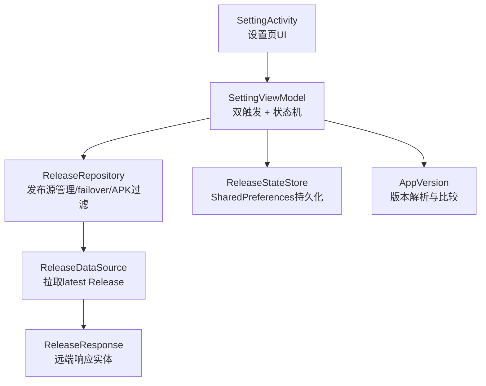
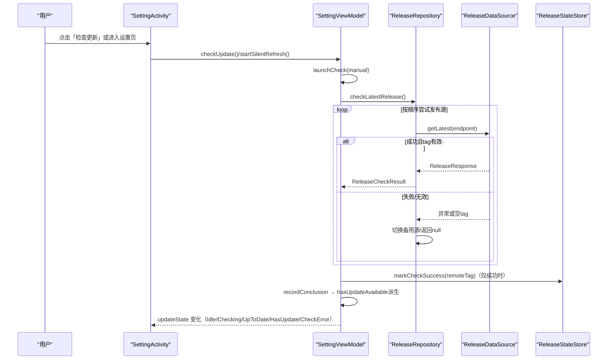
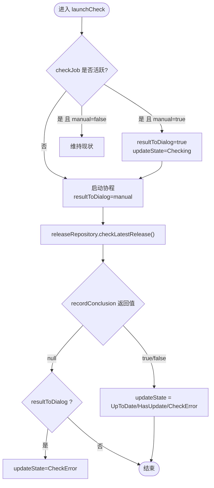
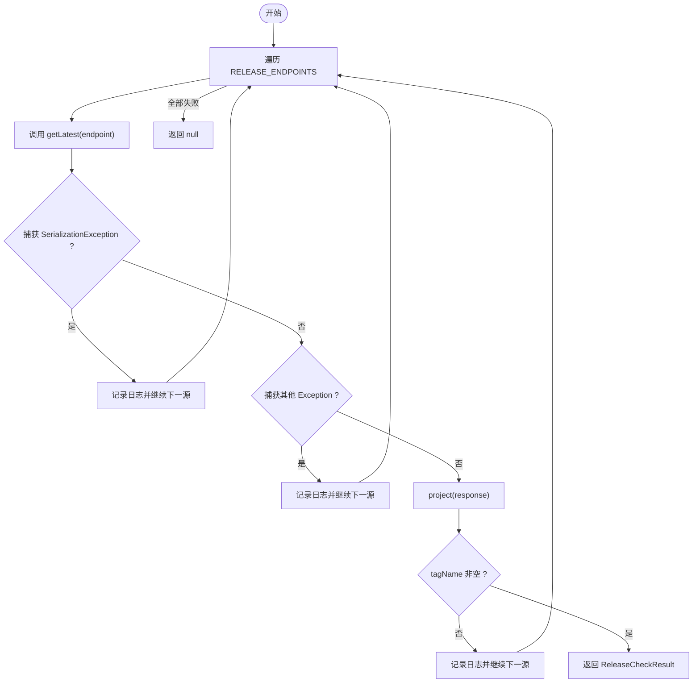
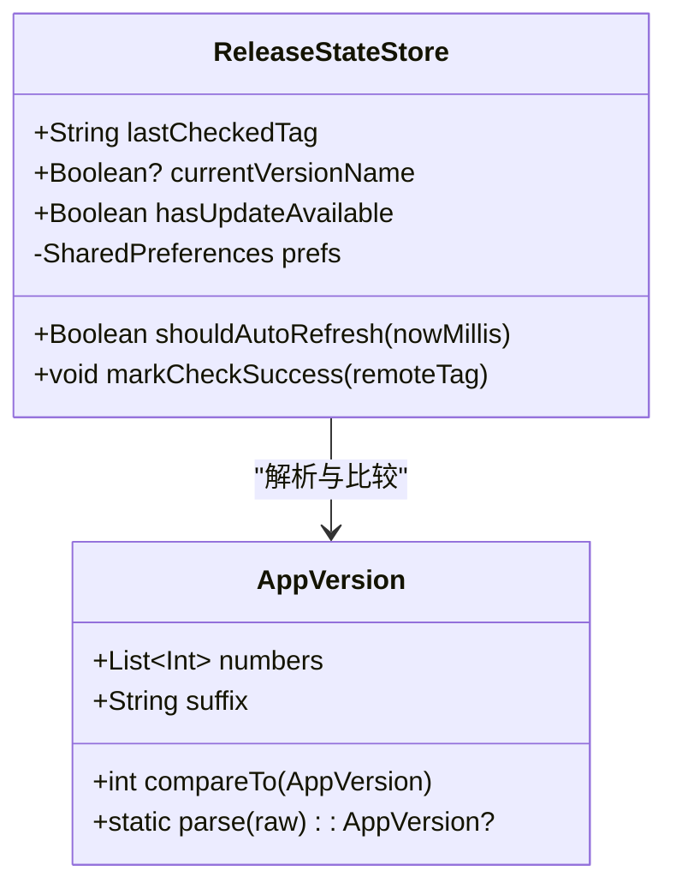
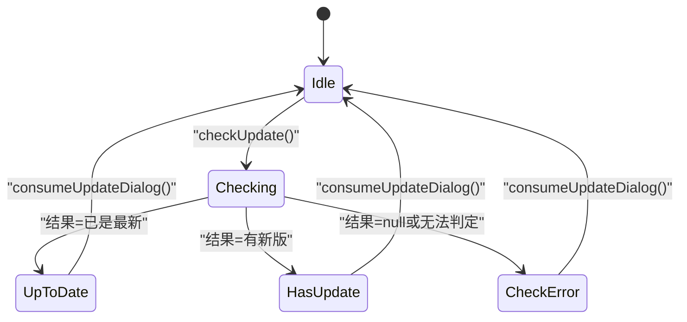
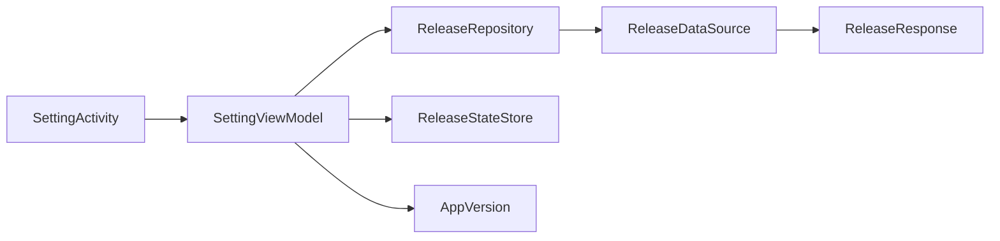

# 版本更新检查

<cite>
**本文引用的文件**
- [SettingViewModel.kt](file://module_me/src/main/java/com/ebook/me/mvvm/viewmodel/SettingViewModel.kt)
- [ReleaseRepository.kt](file://module_me/src/main/java/com/ebook/me/repository/ReleaseRepository.kt)
- [ReleaseStateStore.kt](file://module_me/src/main/java/com/ebook/me/repository/ReleaseStateStore.kt)
- [AppVersion.kt](file://module_me/src/main/java/com/ebook/me/util/AppVersion.kt)
- [ReleaseResponse.kt](file://lib_ebook_api/src/main/java/com/ebook/api/entity/ReleaseResponse.kt)
- [ReleaseDataSource.kt](file://lib_ebook_api/src/main/java/com/ebook/api/service/release/ReleaseDataSource.kt)
- [SettingActivity.kt](file://module_me/src/main/java/com/ebook/me/view/SettingActivity.kt)
- [ReleaseRepositoryTest.kt](file://module_me/src/test/java/com/ebook/me/repository/ReleaseRepositoryTest.kt)
</cite>

## 目录
1. [简介](#简介)
2. [项目结构](#项目结构)
3. [核心组件](#核心组件)
4. [架构总览](#架构总览)
5. [详细组件分析](#详细组件分析)
6. [依赖关系分析](#依赖关系分析)
7. [性能与可靠性](#性能与可靠性)
8. [故障排查指南](#故障排查指南)
9. [结论](#结论)
10. [附录：扩展指引](#附录：扩展指引)

## 简介
本章节聚焦“设置配置系统中的版本更新检查”功能，围绕 SettingViewModel 的双触发机制、UpdateState 状态机、ReleaseRepository 的发布源管理与容错策略、ReleaseStateStore 的版本信息持久化与限频控制，以及 checkUpdate() 与 launchCheck() 的单飞机制进行系统化说明。目标是在不侵入实现细节的前提下，帮助读者快速理解并安全扩展该功能。

## 项目结构
版本更新检查横跨以下模块与职责：
- module_me：业务策略与 UI（SettingViewModel、ReleaseRepository、ReleaseStateStore、SettingActivity）
- lib_ebook_api：网络数据源接口与实体（ReleaseDataSource、ReleaseResponse）
- 工具层：版本号解析与比较（AppVersion）

图表来源
- [SettingActivity.kt:79-142](file://module_me/src/main/java/com/ebook/me/view/SettingActivity.kt#L79-L142)
- [SettingViewModel.kt:63-115](file://module_me/src/main/java/com/ebook/me/mvvm/viewmodel/SettingViewModel.kt#L63-L115)
- [ReleaseRepository.kt:36-110](file://module_me/src/main/java/com/ebook/me/repository/ReleaseRepository.kt#L36-L110)
- [ReleaseDataSource.kt:1-20](file://lib_ebook_api/src/main/java/com/ebook/api/service/release/ReleaseDataSource.kt#L1-L20)
- [ReleaseResponse.kt:24-45](file://lib_ebook_api/src/main/java/com/ebook/api/entity/ReleaseResponse.kt#L24-L45)
- [ReleaseStateStore.kt:32-129](file://module_me/src/main/java/com/ebook/me/repository/ReleaseStateStore.kt#L32-L129)
- [AppVersion.kt:22-87](file://module_me/src/main/java/com/ebook/me/util/AppVersion.kt#L22-L87)

章节来源
- [SettingActivity.kt:79-142](file://module_me/src/main/java/com/ebook/me/view/SettingActivity.kt#L79-L142)
- [SettingViewModel.kt:63-115](file://module_me/src/main/java/com/ebook/me/mvvm/viewmodel/SettingViewModel.kt#L63-L115)
- [ReleaseRepository.kt:36-110](file://module_me/src/main/java/com/ebook/me/repository/ReleaseRepository.kt#L36-L110)
- [ReleaseDataSource.kt:1-20](file://lib_ebook_api/src/main/java/com/ebook/api/service/release/ReleaseDataSource.kt#L1-L20)
- [ReleaseResponse.kt:24-45](file://lib_ebook_api/src/main/java/com/ebook/api/entity/ReleaseResponse.kt#L24-L45)
- [ReleaseStateStore.kt:32-129](file://module_me/src/main/java/com/ebook/me/repository/ReleaseStateStore.kt#L32-L129)
- [AppVersion.kt:22-87](file://module_me/src/main/java/com/ebook/me/util/AppVersion.kt#L22-L87)

## 核心组件
- SettingViewModel：负责双触发（主动检查/静默刷新）、单飞任务控制、弹窗状态推进、角标派生。
- ReleaseRepository：发布源顺序、failover、APK附件过滤、异常分类处理（序列化异常 vs 其他异常）。
- ReleaseStateStore：本地持久化（上次tag、成功检查时间戳）、7天限频、hasUpdateAvailable现场派生。
- AppVersion：版本号解析与逐段比较、归一化展示前缀。
- ReleaseDataSource/ReleaseResponse：网络数据源抽象与统一响应实体。
- SettingActivity：UI绑定、弹窗渲染、回调派发。

章节来源
- [SettingViewModel.kt:63-115](file://module_me/src/main/java/com/ebook/me/mvvm/viewmodel/SettingViewModel.kt#L63-L115)
- [ReleaseRepository.kt:13-34](file://module_me/src/main/java/com/ebook/me/repository/ReleaseRepository.kt#L13-L34)
- [ReleaseStateStore.kt:12-31](file://module_me/src/main/java/com/ebook/me/repository/ReleaseStateStore.kt#L12-L31)
- [AppVersion.kt:3-21](file://module_me/src/main/java/com/ebook/me/util/AppVersion.kt#L3-L21)
- [ReleaseDataSource.kt:5-19](file://lib_ebook_api/src/main/java/com/ebook/api/service/release/ReleaseDataSource.kt#L5-L19)
- [ReleaseResponse.kt:6-23](file://lib_ebook_api/src/main/java/com/ebook/api/entity/ReleaseResponse.kt#L6-L23)

## 架构总览
版本更新检查采用分层设计：
- UI层（SettingActivity）仅负责展示与交互回调。
- ViewModel（SettingViewModel）编排触发时机、任务生命周期、状态推进与角标派生。
- Repository（ReleaseRepository）专注发布源策略（GitHub→Gitcode failover）、结果投影（tag有效性、APK过滤）。
- Store（ReleaseStateStore）负责本地事实落盘与限频窗口计算。
- 数据层（ReleaseDataSource/ReleaseResponse）提供网络契约与实体。

图表来源
- [SettingActivity.kt:116-121](file://module_me/src/main/java/com/ebook/me/view/SettingActivity.kt#L116-L121)
- [SettingViewModel.kt:214-257](file://module_me/src/main/java/com/ebook/me/mvvm/viewmodel/SettingViewModel.kt#L214-L257)
- [ReleaseRepository.kt:46-70](file://module_me/src/main/java/com/ebook/me/repository/ReleaseRepository.kt#L46-L70)
- [ReleaseDataSource.kt:12-19](file://lib_ebook_api/src/main/java/com/ebook/api/service/release/ReleaseDataSource.kt#L12-L19)
- [ReleaseStateStore.kt:96-101](file://module_me/src/main/java/com/ebook/me/repository/ReleaseStateStore.kt#L96-L101)

## 详细组件分析

### SettingViewModel：双触发机制与单飞控制
- 双触发
  - 主动检查：用户点击「检查更新」→ checkUpdate() → launchCheck(manual=true)，请求完成后根据结果推进弹窗状态。
  - 静默刷新：进入设置页时 startSilentRefresh()，若距上次成功检查≥7天则发起一次不弹窗的检查，仅更新角标；失败无声忽略。
- 在途任务与升级
  - checkJob 保证同一时刻只有一个检查任务在执行。
  - 若静默在途期间用户点击了版本行，launchCheck(manual=true) 不会并发新请求，而是将当前在途检查升级为可见（置 Checking，并把最终结论推入弹窗），提升反馈体验。
- 关闭弹窗即取消
  - consumeUpdateDialog() 会取消在途任务，避免请求回来再次弹出打扰用户；同时复位 resultToDialog 标志，防止未来误弹窗。
- 角标派生
  - hasUpdateAvailable 由 ReleaseStateStore.hasUpdateAvailable 现场派生（上次tag vs 当前装机版本），不存结论布尔量，升级安装后自动纠正。

图表来源
- [SettingViewModel.kt:236-257](file://module_me/src/main/java/com/ebook/me/mvvm/viewmodel/SettingViewModel.kt#L236-L257)
- [SettingViewModel.kt:265-271](file://module_me/src/main/java/com/ebook/me/mvvm/viewmodel/SettingViewModel.kt#L265-L271)
- [SettingViewModel.kt:283-290](file://module_me/src/main/java/com/ebook/me/mvvm/viewmodel/SettingViewModel.kt#L283-L290)

章节来源
- [SettingViewModel.kt:89-123](file://module_me/src/main/java/com/ebook/me/mvvm/viewmodel/SettingViewModel.kt#L89-L123)
- [SettingViewModel.kt:214-257](file://module_me/src/main/java/com/ebook/me/mvvm/viewmodel/SettingViewModel.kt#L214-L257)
- [SettingViewModel.kt:259-290](file://module_me/src/main/java/com/ebook/me/mvvm/viewmodel/SettingViewModel.kt#L259-L290)

### ReleaseRepository：发布源管理与容错
- 发布源顺序与 failover
  - RELEASE_ENDPOINTS 固定为 GitHub latest → Gitcode latest，按顺序尝试，第一个成功即返回。
  - 全部失败返回 null，调用方据此弹「检查失败」。
- APK 附件过滤
  - 仅选择以 .apk 结尾的附件作为下载入口；无 APK 不算源失败，仍返回结果（apkDownloadUrl=null）。
- 异常分类
  - SerializationException：视为响应形态不对，改用备用源。
  - 其他 Exception：视为网络/IO错误，改用备用源。
  - CancellationException：原样抛出，不视为源失败，避免页面销毁后继续打备用源。
- 响应投影
  - 空白 tag 视为该源无效，继续下一个源。

图表来源
- [ReleaseRepository.kt:46-70](file://module_me/src/main/java/com/ebook/me/repository/ReleaseRepository.kt#L46-L70)
- [ReleaseRepository.kt:77-88](file://module_me/src/main/java/com/ebook/me/repository/ReleaseRepository.kt#L77-L88)

章节来源
- [ReleaseRepository.kt:13-34](file://module_me/src/main/java/com/ebook/me/repository/ReleaseRepository.kt#L13-L34)
- [ReleaseRepository.kt:46-110](file://module_me/src/main/java/com/ebook/me/repository/ReleaseRepository.kt#L46-L110)

### ReleaseStateStore：版本信息持久化与限频
- 存储字段
  - lastCheckedTag：上次成功检查到的远端 tag。
  - lastSuccessCheckTime：上次成功检查的时间戳。
- 限频策略
  - shouldAutoRefresh(nowMillis)：基于 AUTO_REFRESH_INTERVAL_MILLIS（7天）判断是否允许静默刷新。
  - isRefreshDue(lastSuccessMillis, nowMillis)：纯函数，便于测试边界条件。
- hasUpdateAvailable 派生逻辑
  - 使用 AppVersion.parse(lastCheckedTag) 与 currentVersion 进行比较；任一缺失均视为无更新。
- 写入时机
  - 仅在成功且可判定版本时调用 markCheckSuccess(remoteTag)；失败路径不调用，保持上次结论与限频时间。

图表来源
- [ReleaseStateStore.kt:32-129](file://module_me/src/main/java/com/ebook/me/repository/ReleaseStateStore.kt#L32-L129)
- [AppVersion.kt:22-87](file://module_me/src/main/java/com/ebook/me/util/AppVersion.kt#L22-L87)

章节来源
- [ReleaseStateStore.kt:12-31](file://module_me/src/main/java/com/ebook/me/repository/ReleaseStateStore.kt#L12-L31)
- [ReleaseStateStore.kt:66-101](file://module_me/src/main/java/com/ebook/me/repository/ReleaseStateStore.kt#L66-L101)

### UpdateState 状态机
五种状态及转换逻辑：
- Idle：未检查/弹窗已关闭。
- Checking：正在检查中（主动检查立即显示，或在途被升级为可见）。
- UpToDate：已是最新版本。
- HasUpdate：发现新版本（携带 ReleaseCheckResult）。
- CheckError：检查失败（网络/解析/无法判定）。

关键约束：
- 判不出结论（远端 tag 不可解析或本地版本读不到）一律按 CheckError 处置且不写成功时间戳，避免假结论占满限频窗口。
- 角标 always 由 ReleaseStateStore.hasUpdateAvailable 现场派生，不受弹窗状态影响。

图表来源
- [SettingViewModel.kt:349-360](file://module_me/src/main/java/com/ebook/me/mvvm/viewmodel/SettingViewModel.kt#L349-L360)
- [SettingViewModel.kt:249-255](file://module_me/src/main/java/com/ebook/me/mvvm/viewmodel/SettingViewModel.kt#L249-L255)
- [SettingViewModel.kt:283-290](file://module_me/src/main/java/com/ebook/me/mvvm/viewmodel/SettingViewModel.kt#L283-L290)

章节来源
- [SettingViewModel.kt:349-360](file://module_me/src/main/java/com/ebook/me/mvvm/viewmodel/SettingViewModel.kt#L349-L360)

### SettingActivity：UI 绑定与弹窗渲染
- 在 onResume 中刷新缓存大小与角标，确保长期驻留页面的状态同步。
- 根据 updateState 分支渲染不同弹窗：检查中、已是最新、有新版本（含下载按钮与提示）、检查失败。
- 版本号显示通过 SettingViewModel.appVersionName 转发，保证比较基准一致。

章节来源
- [SettingActivity.kt:89-96](file://module_me/src/main/java/com/ebook/me/view/SettingActivity.kt#L89-L96)
- [SettingActivity.kt:340-435](file://module_me/src/main/java/com/ebook/me/view/SettingActivity.kt#L340-L435)

## 依赖关系分析
- SettingViewModel 依赖 ReleaseRepository（发布源策略）、ReleaseStateStore（持久化与限频）、AppVersion（版本比较）。
- ReleaseRepository 依赖 ReleaseDataSource（网络抽象）与 ReleaseResponse（实体）。
- ReleaseStateStore 依赖 SharedPreferences（Android 存储）与 AppVersion（解析比较）。
- SettingActivity 仅依赖 SettingViewModel 暴露的状态流与回调。

图表来源
- [SettingActivity.kt:79-142](file://module_me/src/main/java/com/ebook/me/view/SettingActivity.kt#L79-L142)
- [SettingViewModel.kt:63-115](file://module_me/src/main/java/com/ebook/me/mvvm/viewmodel/SettingViewModel.kt#L63-L115)
- [ReleaseRepository.kt:36-110](file://module_me/src/main/java/com/ebook/me/repository/ReleaseRepository.kt#L36-L110)
- [ReleaseStateStore.kt:32-129](file://module_me/src/main/java/com/ebook/me/repository/ReleaseStateStore.kt#L32-L129)
- [ReleaseDataSource.kt:1-20](file://lib_ebook_api/src/main/java/com/ebook/api/service/release/ReleaseDataSource.kt#L1-L20)
- [ReleaseResponse.kt:24-45](file://lib_ebook_api/src/main/java/com/ebook/api/entity/ReleaseResponse.kt#L24-L45)
- [AppVersion.kt:22-87](file://module_me/src/main/java/com/ebook/me/util/AppVersion.kt#L22-L87)

章节来源
- [ReleaseRepositoryTest.kt:15-24](file://module_me/src/test/java/com/ebook/me/repository/ReleaseRepositoryTest.kt#L15-L24)

## 性能与可靠性
- 单飞机制：checkJob 保证同一时刻最多一个检查任务，避免重复网络请求与结论覆盖。
- 静默刷新限频：7天内不重复发请求，降低网络与后端压力。
- Failover：GitHub→Gitcode 自动降级，提高可用性。
- 取消传播：CancellationException 原样抛出，避免页面销毁后继续请求备用源。
- 角标派生：每次从本地 tag 与当前版本现场比较，升级安装后自动纠正，无需额外清理。

[本节为通用指导，无需代码引用]

## 故障排查指南
- 检查失败（CheckError）
  - 可能原因：远端 tag 为空、JSON 解析失败、网络异常、本地版本读取失败。
  - 定位要点：查看 ReleaseRepository 日志（序列化异常 vs 其他异常）、确认 ReleaseStateStore 是否记录了成功时间戳（失败不应写入）。
- 角标不消失
  - 确认 SettingActivity.onResume 中是否调用了 refreshUpdateBadge()。
  - 确认 ReleaseStateStore.hasUpdateAvailable 的输入（lastCheckedTag/currentVersion）是否正确。
- 频繁弹窗或无反馈
  - 检查是否在静默在途时被重复点击导致并发；应通过 checkJob 单飞保护。
  - 确认 consumeUpdateDialog() 是否正确取消在途任务并复位 resultToDialog。

章节来源
- [ReleaseRepository.kt:46-70](file://module_me/src/main/java/com/ebook/me/repository/ReleaseRepository.kt#L46-L70)
- [SettingActivity.kt:89-96](file://module_me/src/main/java/com/ebook/me/view/SettingActivity.kt#L89-L96)
- [SettingViewModel.kt:283-290](file://module_me/src/main/java/com/ebook/me/mvvm/viewmodel/SettingViewModel.kt#L283-L290)

## 结论
版本更新检查通过清晰的职责划分与严格的不变量（判不出结论不算成功、角标现场派生）实现了高可用与低干扰的用户体验。SettingViewModel 的双触发与单飞保障用户体验一致性，ReleaseRepository 的 failover 与 APK 过滤增强鲁棒性，ReleaseStateStore 的限频与持久化平衡了资源消耗与时效性。整体架构易于扩展与维护。

[本节为总结，无需代码引用]

## 附录：扩展指引
- 添加新的发布源
  - 在 ReleaseRepository 的 RELEASE_ENDPOINTS 列表末尾追加新端点，遵循“优先级即顺序”的约定。
  - 如需新增常量（如 NEW_LATEST），请放在 internal companion 对象内，便于测试断言顺序。
  - 参考：[ReleaseRepository.kt:96-110](file://module_me/src/main/java/com/ebook/me/repository/ReleaseRepository.kt#L96-L110)

- 自定义版本比较规则
  - 修改 AppVersion.parse 与 compareTo，注意保持“数值优先逐段比较”的核心契约。
  - 如需支持预发布语义，需在发布流程中约定 tag 模板，并在比较层显式处理。
  - 参考：[AppVersion.kt:3-21](file://module_me/src/main/java/com/ebook/me/util/AppVersion.kt#L3-L21)、[AppVersion.kt:22-87](file://module_me/src/main/java/com/ebook/me/util/AppVersion.kt#L22-L87)

- 扩展检查失败的重试策略
  - 可在 ReleaseRepository.checkLatestRelease 中添加重试逻辑（例如指数退避），但需保留 CancellationException 原样抛出的语义。
  - 注意区分序列化异常与其他异常，以便更精准地定位问题。
  - 参考：[ReleaseRepository.kt:46-70](file://module_me/src/main/java/com/ebook/me/repository/ReleaseRepository.kt#L46-L70)

- 调整静默刷新频率
  - 修改 ReleaseStateStore.AUTO_REFRESH_INTERVAL_MILLIS 或重写 shouldAutoRefresh 的阈值逻辑。
  - 注意通过 isRefreshDue 纯函数进行单元测试覆盖边界情况。
  - 参考：[ReleaseStateStore.kt:110-128](file://module_me/src/main/java/com/ebook/me/repository/ReleaseStateStore.kt#L110-L128)

- 验证行为
  - 使用 ReleaseRepositoryTest 中的用例模式，构造 Stub/ThrowingStub 验证 failover、APK 过滤、取消传播等行为。
  - 参考：[ReleaseRepositoryTest.kt:65-184](file://module_me/src/test/java/com/ebook/me/repository/ReleaseRepositoryTest.kt#L65-L184)

[本节为扩展建议，引用对应实现位置]