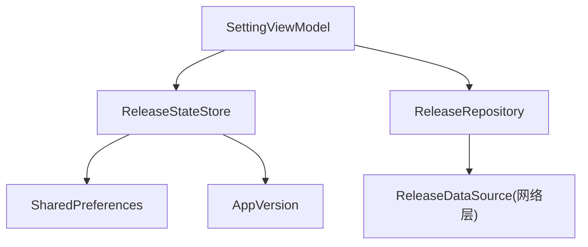
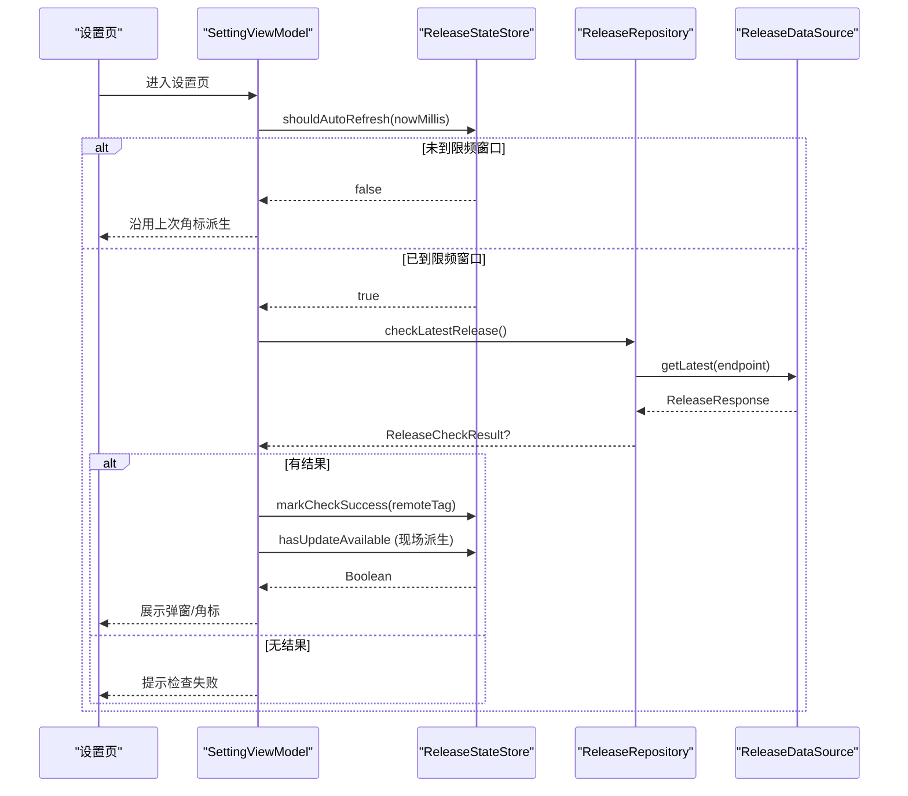
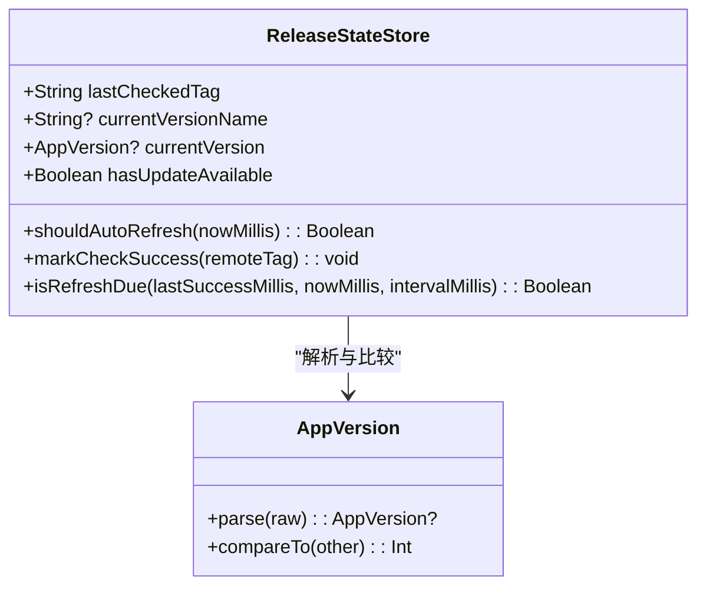
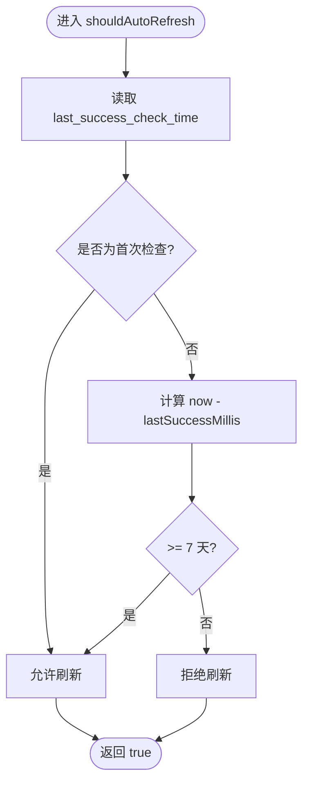
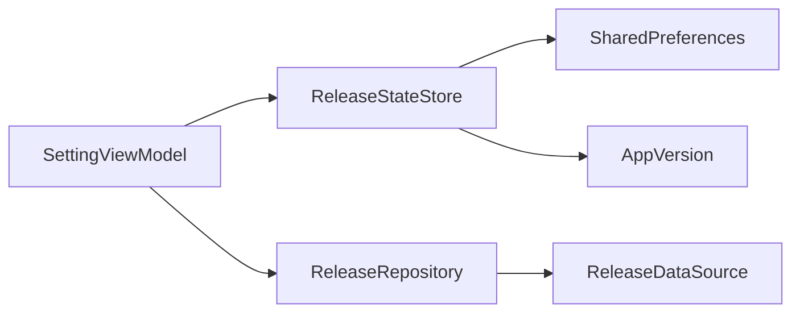

# 版本状态持久化

<cite>
**本文引用的文件**
- [ReleaseStateStore.kt](file://module_me/src/main/java/com/ebook/me/repository/ReleaseStateStore.kt)
- [ReleaseStateStoreTest.kt](file://module_me/src/test/java/com/ebook/me/repository/ReleaseStateStoreTest.kt)
- [SettingViewModel.kt](file://module_me/src/main/java/com/ebook/me/mvvm/viewmodel/SettingViewModel.kt)
- [ReleaseRepository.kt](file://module_me/src/main/java/com/ebook/me/repository/ReleaseRepository.kt)
- [AppVersion.kt](file://module_me/src/main/java/com/ebook/me/util/AppVersion.kt)
- [AppVersionTest.kt](file://module_me/src/test/java/com/ebook/me/util/AppVersionTest.kt)
</cite>

## 目录
1. [简介](#简介)
2. [项目结构](#项目结构)
3. [核心组件](#核心组件)
4. [架构总览](#架构总览)
5. [详细组件分析](#详细组件分析)
6. [依赖关系分析](#依赖关系分析)
7. [性能考量](#性能考量)
8. [故障排查指南](#故障排查指南)
9. [结论](#结论)
10. [附录：扩展与定制示例](#附录：扩展与定制示例)

## 简介
本文聚焦「版本状态持久化」，围绕 ReleaseStateStore 的本地持久化槽设计进行深度说明。它使用 SharedPreferences 存储「上次检查到的远端 tag 与成功检查时间」，并在设置页进入时基于 7 天限频策略决定是否发起静默刷新；同时通过派生字段 hasUpdateAvailable 实时判断「是否有新版本」。本文将解释关键属性、限频机制、写入时机、派生逻辑，并给出可扩展的实践指引（如何修改限频间隔、添加新的持久化字段、定制版本比较规则）。

## 项目结构
与版本更新检查相关的代码集中在 module_me 模块内：
- ReleaseStateStore：本地持久化与限频判断（SharedPreferences）
- SettingViewModel：编排主动/静默检查、弹窗状态与角标派生
- ReleaseRepository：发布源选择、failover 与结果投影
- AppVersion：版本号解析与比较工具

图表来源
- [SettingViewModel.kt:63-271](file://module_me/src/main/java/com/ebook/me/mvvm/viewmodel/SettingViewModel.kt#L63-L271)
- [ReleaseStateStore.kt:32-128](file://module_me/src/main/java/com/ebook/me/repository/ReleaseStateStore.kt#L32-L128)
- [ReleaseRepository.kt:35-127](file://module_me/src/main/java/com/ebook/me/repository/ReleaseRepository.kt#L35-L127)
- [AppVersion.kt:22-87](file://module_me/src/main/java/com/ebook/me/util/AppVersion.kt#L22-L87)

章节来源
- [ReleaseStateStore.kt:32-128](file://module_me/src/main/java/com/ebook/me/repository/ReleaseStateStore.kt#L32-L128)
- [SettingViewModel.kt:63-271](file://module_me/src/main/java/com/ebook/me/mvvm/viewmodel/SettingViewModel.kt#L63-L271)
- [ReleaseRepository.kt:35-127](file://module_me/src/main/java/com/ebook/me/repository/ReleaseRepository.kt#L35-L127)
- [AppVersion.kt:22-87](file://module_me/src/main/java/com/ebook/me/util/AppVersion.kt#L22-L87)

## 核心组件
- ReleaseStateStore：本地持久化槽，负责读写 lastCheckedTag、currentVersionName/currentVersion、hasUpdateAvailable，以及 shouldAutoRefresh/isRefreshDue 限频判定。
- SettingViewModel：组合 Store 与 Repository，编排检查流程、弹窗与角标刷新。
- ReleaseRepository：负责从多个发布源获取最新 release 信息，并进行结果投影。
- AppVersion：将远端 tag 或本地 versionName 解析为可比较的版本对象，并提供 isOlderThan 等比较方法。

章节来源
- [ReleaseStateStore.kt:12-128](file://module_me/src/main/java/com/ebook/me/repository/ReleaseStateStore.kt#L12-L128)
- [SettingViewModel.kt:34-271](file://module_me/src/main/java/com/ebook/me/mvvm/viewmodel/SettingViewModel.kt#L34-L271)
- [ReleaseRepository.kt:13-127](file://module_me/src/main/java/com/ebook/me/repository/ReleaseRepository.kt#L13-L127)
- [AppVersion.kt:22-87](file://module_me/src/main/java/com/ebook/me/util/AppVersion.kt#L22-L87)

## 架构总览
版本检查的整体流程如下：
- 用户进入设置页 → ViewModel 调用 ReleaseStateStore.shouldAutoRefresh() 判断是否满足 7 天限频窗口
- 若满足 → 调用 ReleaseRepository.checkLatestRelease() 拉取远端最新 release
- 若返回有效结果 → ViewModel 调用 ReleaseStateStore.markCheckSuccess(remoteTag) 落盘
- 每次读取 hasUpdateAvailable 都现场派生（比较 lastCheckedTag 与 currentVersion），不缓存结论布尔值

图表来源
- [SettingViewModel.kt:174-271](file://module_me/src/main/java/com/ebook/me/mvvm/viewmodel/SettingViewModel.kt#L174-L271)
- [ReleaseStateStore.kt:82-101](file://module_me/src/main/java/com/ebook/me/repository/ReleaseStateStore.kt#L82-L101)
- [ReleaseRepository.kt:46-88](file://module_me/src/main/java/com/ebook/me/repository/ReleaseRepository.kt#L46-L88)

## 详细组件分析

### ReleaseStateStore：本地持久化槽
- 存储键
  - last_checked_tag：上次成功检查到的远端 tag（如 "V1.3.0"），从未成功检查则为空串
  - last_success_check_time：上次成功检查的时间戳（毫秒）
- 关键属性
  - lastCheckedTag：从 SharedPreferences 读取上次成功检查的远端 tag
  - currentVersionName：从 PackageManager 读取当前应用版本名（不可用则返回 null）
  - currentVersion：对 currentVersionName 解析后的 AppVersion（不可解析则返回 null）
  - hasUpdateAvailable：派生字段，比较 lastCheckedTag 与 currentVersion，任一缺失均按「无更新」处理
- 关键方法
  - shouldAutoRefresh(nowMillis)：基于 last_success_check_time 与 AUTO_REFRESH_INTERVAL_MILLIS 判断是否应静默刷新
  - markCheckSuccess(remoteTag)：仅在检查成功且 tag 可解析时写入 last_checked_tag 与 last_success_check_time
  - isRefreshDue(lastSuccessMillis, nowMillis, intervalMillis)：纯函数，便于单元测试锁边界

图表来源
- [ReleaseStateStore.kt:32-128](file://module_me/src/main/java/com/ebook/me/repository/ReleaseStateStore.kt#L32-L128)
- [AppVersion.kt:22-87](file://module_me/src/main/java/com/ebook/me/util/AppVersion.kt#L22-L87)

章节来源
- [ReleaseStateStore.kt:32-128](file://module_me/src/main/java/com/ebook/me/repository/ReleaseStateStore.kt#L32-L128)

#### 7 天限频机制（shouldAutoRefresh / isRefreshDue）
- 语义约定
  - lastSuccessMillis == 0L 表示从未成功检查过，一律放行首次静默刷新
  - 不足 7 天（AUTO_REFRESH_INTERVAL_MILLIS）则不发起静默刷新
  - 时钟回拨不会导致无限放行（now < lastSuccessMillis 按不到点处理）
- 实现要点
  - shouldAutoRefresh 封装了读取 SP 中的 lastSuccessCheckTime 并委托给 isRefreshDue
  - isRefreshDue 是纯函数，便于在 JVM 单测中锁定边界条件（差一小时也不放行）

图表来源
- [ReleaseStateStore.kt:82-128](file://module_me/src/main/java/com/ebook/me/repository/ReleaseStateStore.kt#L82-L128)

章节来源
- [ReleaseStateStore.kt:82-128](file://module_me/src/main/java/com/ebook/me/repository/ReleaseStateStore.kt#L82-L128)
- [ReleaseStateStoreTest.kt:17-78](file://module_me/src/test/java/com/ebook/me/repository/ReleaseStateStoreTest.kt#L17-L78)

#### 写入时机（markCheckSuccess）
- 仅在检查成功且 tag 可解析时调用，用于写入 last_checked_tag 与 last_success_check_time
- 失败路径不调用，保留上次结论与上次检查时间，避免失败覆盖限频窗口
- 调用方（SettingViewModel.recordConclusion）会先解析 remoteTag 与 currentVersion，任一不可解析则视为「无法判定」，不写盘

章节来源
- [ReleaseStateStore.kt:89-101](file://module_me/src/main/java/com/ebook/me/repository/ReleaseStateStore.kt#L89-L101)
- [SettingViewModel.kt:259-271](file://module_me/src/main/java/com/ebook/me/mvvm/viewmodel/SettingViewModel.kt#L259-L271)

#### 派生逻辑（hasUpdateAvailable）
- 比较 lastCheckedTag 与 currentVersion，任一缺失都按「无更新」处理
- 每次读取都会现场派生，确保用户升级安装后重进页面能自动纠正角标

章节来源
- [ReleaseStateStore.kt:66-77](file://module_me/src/main/java/com/ebook/me/repository/ReleaseStateStore.kt#L66-L77)

### SettingViewModel：编排检查与角标
- 职责
  - 主动检查：用户点击「检查更新」立即请求并展示结果弹窗
  - 静默检查：进入设置页时按 7 天限频判断是否静默刷新（不弹窗，仅更新角标）
  - 角标派生：hasUpdateAvailable 来自 ReleaseStateStore 的现场派生
  - 任务管理：同一时刻最多一个检查任务；静默在途期间被手动点击会升级为可见
- 关键流程
  - startSilentRefresh()：调用 shouldAutoRefresh() 判断是否发起静默刷新
  - launchCheck(manual)：发起检查或在途升级；完成后记录结论并刷新角标
  - recordConclusion(result)：解析远端 tag 与本地版本，成功后调用 markCheckSuccess，再派生角标

章节来源
- [SettingViewModel.kt:174-271](file://module_me/src/main/java/com/ebook/me/mvvm/viewmodel/SettingViewModel.kt#L174-L271)

### ReleaseRepository：发布源策略
- 职责
  - 按顺序尝试多个发布源（GitHub 优先，Gitcode 兜底）
  - 过滤非 APK 附件，只接受 .apk
  - 将平台响应投影为 ReleaseCheckResult（remoteTag、body、apkDownloadUrl）
- 行为
  - 任一源成功即返回结果；全部失败返回 null（调用方弹「检查失败」）
  - CancellationException 原样抛出，避免页面销毁后继续备用源请求

章节来源
- [ReleaseRepository.kt:35-127](file://module_me/src/main/java/com/ebook/me/repository/ReleaseRepository.kt#L35-L127)

### AppVersion：版本解析与比较
- 解析规则
  - 支持 V/v 前缀可选、任意数量数字段、最后一段允许尾缀（字母数字）
  - 非可信输入（如 "1.x"、"abc"）判为解析失败（返回 null）
- 比较规则
  - 逐段数值比较，缺失段按 0 补齐
  - 尾缀仅在数字段全等时比较（字典序）
  - isOlderThan：严格落后才为真（相等不算落后）

章节来源
- [AppVersion.kt:22-87](file://module_me/src/main/java/com/ebook/me/util/AppVersion.kt#L22-L87)
- [AppVersionTest.kt:20-100](file://module_me/src/test/java/com/ebook/me/util/AppVersionTest.kt#L20-L100)

## 依赖关系分析
- SettingViewModel 依赖 ReleaseStateStore 与 ReleaseRepository
- ReleaseStateStore 依赖 SharedPreferences 与 AppVersion
- ReleaseRepository 依赖 ReleaseDataSource（网络层）
- 所有版本比较统一通过 AppVersion 完成，保证一致性与可测试性

图表来源
- [SettingViewModel.kt:63-271](file://module_me/src/main/java/com/ebook/me/mvvm/viewmodel/SettingViewModel.kt#L63-L271)
- [ReleaseStateStore.kt:32-128](file://module_me/src/main/java/com/ebook/me/repository/ReleaseStateStore.kt#L32-L128)
- [ReleaseRepository.kt:35-127](file://module_me/src/main/java/com/ebook/me/repository/ReleaseRepository.kt#L35-L127)

章节来源
- [SettingViewModel.kt:63-271](file://module_me/src/main/java/com/ebook/me/mvvm/viewmodel/SettingViewModel.kt#L63-L271)
- [ReleaseStateStore.kt:32-128](file://module_me/src/main/java/com/ebook/me/repository/ReleaseStateStore.kt#L32-L128)
- [ReleaseRepository.kt:35-127](file://module_me/src/main/java/com/ebook/me/repository/ReleaseRepository.kt#L35-L127)

## 性能考量
- 限频策略降低网络频率：7 天窗口避免频繁请求，提升用户体验与服务器负载可控
- 派生字段减少冗余状态：hasUpdateAvailable 每次都现场比较，避免结论过期导致的错误角标
- 纯函数隔离 IO：isRefreshDue 不依赖 Context，可在 JVM 单测中快速验证边界条件

[本节提供一般性指导，无需特定文件引用]

## 故障排查指南
- 现象：角标一直显示「有新版本」
  - 可能原因：lastCheckedTag 存在且高于 currentVersion；确认是否已安装新版本
  - 排查步骤：查看 ReleaseStateStore.lastCheckedTag 与 currentVersionName/currentVersion 的值；确认 hasUpdateAvailable 派生是否正确
- 现象：进入设置页未触发静默刷新
  - 可能原因：距上次成功检查不足 7 天
  - 排查步骤：检查 last_success_check_time 与当前时间差；验证 isRefreshDue 边界条件
- 现象：检查失败但角标仍显示旧结论
  - 可能原因：markCheckSuccess 未被调用（解析失败或网络异常）
  - 排查步骤：确认 SettingViewModel.recordConclusion 的解析分支；确保失败路径不写盘

章节来源
- [ReleaseStateStore.kt:66-101](file://module_me/src/main/java/com/ebook/me/repository/ReleaseStateStore.kt#L66-L101)
- [SettingViewModel.kt:259-271](file://module_me/src/main/java/com/ebook/me/mvvm/viewmodel/SettingViewModel.kt#L259-L271)

## 结论
ReleaseStateStore 作为本地持久化槽，通过存储「上次成功检查的远端 tag 与时间戳」实现了稳健的版本状态管理。其 7 天限频机制与派生字段 hasUpdateAvailable 共同确保了低开销、高可靠性的更新检查体验。配合 SettingViewModel 与 ReleaseRepository，形成了清晰的分层与职责划分。未来可通过扩展限频间隔、新增持久化字段与定制版本比较规则来适配更多场景。

[本节总结整体设计，无需特定文件引用]

## 附录：扩展与定制示例

### 扩展限频间隔
- 目标：将静默刷新窗口从 7 天改为 14 天
- 建议做法：调整 ReleaseStateStore.AUTO_REFRESH_INTERVAL_MILLIS 常量，并确保 isRefreshDue 的默认参数保持一致
- 影响范围：shouldAutoRefresh、相关单测与业务逻辑（SettingViewModel.startSilentRefresh）

章节来源
- [ReleaseStateStore.kt:110-128](file://module_me/src/main/java/com/ebook/me/repository/ReleaseStateStore.kt#L110-L128)
- [ReleaseStateStoreTest.kt:33-65](file://module_me/src/test/java/com/ebook/me/repository/ReleaseStateStoreTest.kt#L33-L65)

### 添加新的持久化字段
- 目标：例如新增 lastCheckedPlatform（记录最近一次成功的发布源）
- 建议做法：
  - 在 ReleaseStateStore 中添加新的 SharedPreferences 键与 getter/setter
  - 在 markCheckSuccess 中同步写入新字段
  - 在 SettingViewModel 中根据新字段进行展示或逻辑分支
- 注意事项：保持失败不覆盖原则，仅在成功路径写入

章节来源
- [ReleaseStateStore.kt:89-101](file://module_me/src/main/java/com/ebook/me/repository/ReleaseStateStore.kt#L89-L101)
- [SettingViewModel.kt:259-271](file://module_me/src/main/java/com/ebook/me/mvvm/viewmodel/SettingViewModel.kt#L259-L271)

### 定制版本比较规则
- 目标：自定义版本比较策略（例如忽略尾缀、支持预发布语义）
- 建议做法：
  - 在 AppVersion 中扩展 compareTo 或新增比较方法
  - 在 SettingViewModel 中使用新的比较逻辑替换 isOlderThan
  - 补充单测覆盖新规则边界
- 注意事项：保持解析失败与比较失败的明确区分，避免误判为「已是最新版本」

章节来源
- [AppVersion.kt:22-87](file://module_me/src/main/java/com/ebook/me/util/AppVersion.kt#L22-L87)
- [AppVersionTest.kt:56-90](file://module_me/src/test/java/com/ebook/me/util/AppVersionTest.kt#L56-L90)