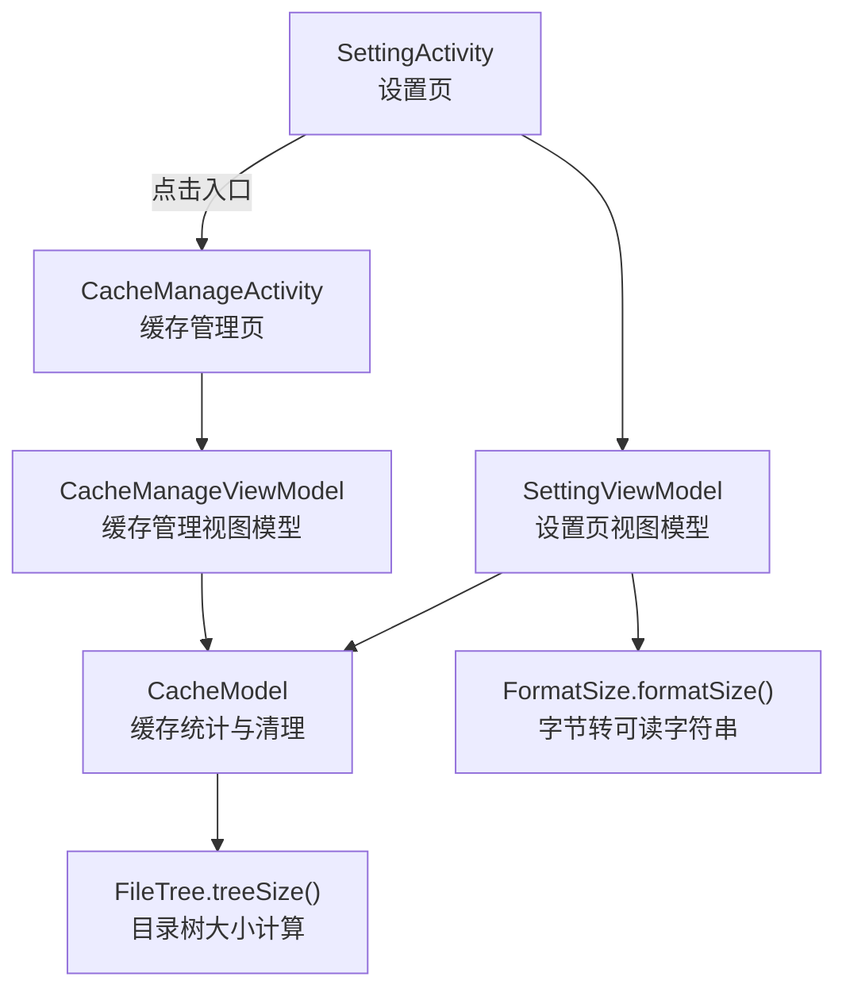
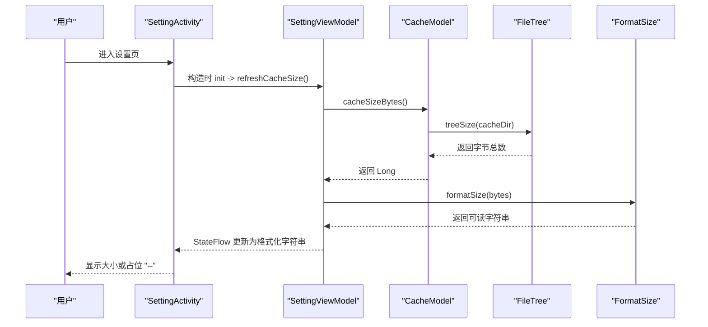
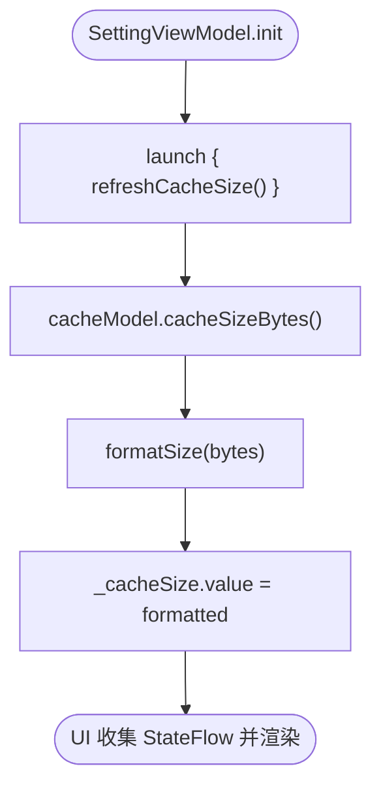
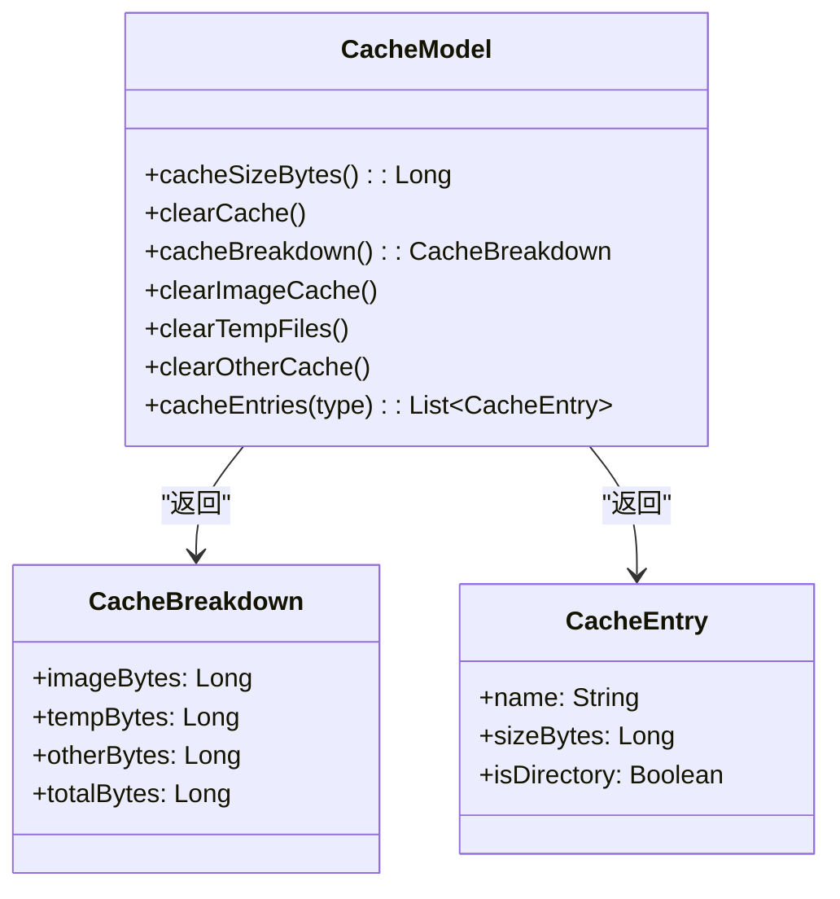
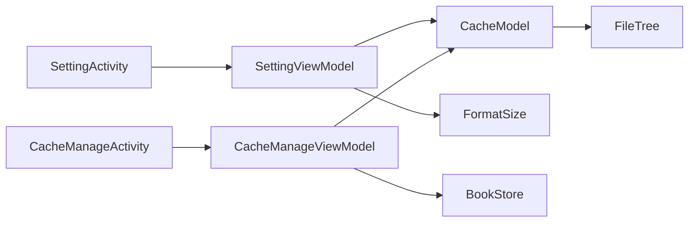

# 缓存统计

<cite>
**本文引用的文件**
- [SettingViewModel.kt](file://module_me/src/main/java/com/ebook/me/mvvm/viewmodel/SettingViewModel.kt)
- [CacheModel.kt](file://module_me/src/main/java/com/ebook/me/repository/CacheModel.kt)
- [FormatSize.kt](file://lib_book_common/src/main/java/com/ebook/common/util/FormatSize.kt)
- [FileTree.kt](file://lib_book_common/src/main/java/com/ebook/common/util/FileTree.kt)
- [SettingActivity.kt](file://module_me/src/main/java/com/ebook/me/view/SettingActivity.kt)
- [CacheManageActivity.kt](file://module_me/src/main/java/com/ebook/me/view/CacheManageActivity.kt)
- [CacheManageViewModel.kt](file://module_me/src/main/java/com/ebook/me/mvvm/viewmodel/CacheManageViewModel.kt)
</cite>

## 目录
1. [简介](#简介)
2. [项目结构](#项目结构)
3. [核心组件](#核心组件)
4. [架构总览](#架构总览)
5. [详细组件分析](#详细组件分析)
6. [依赖关系分析](#依赖关系分析)
7. [性能考虑](#性能考虑)
8. [故障排查指南](#故障排查指南)
9. [结论](#结论)
10. [附录：扩展与优化示例](#附录扩展与优化示例)

## 简介
本章节围绕“缓存统计”功能，说明设置页如何只读展示缓存占用、如何通过 ViewModel 管理状态流、由 Model 计算实际大小、以及 UI 层如何处理占位文案。重点包括：
- SettingViewModel 中 cacheSize 的状态流转：空串表示计算中，计算完成后通过 formatSize() 格式化显示。
- refreshCacheSize() 在 Activity.onResume 调用，用于同步从缓存管理页返回后的清理结果。
- CacheModel 的职责：提供 cacheSizeBytes() 计算 cacheDir 总占用，并提供分类统计与清理能力。
- 解耦设计：设置页仅读取并跳转；实际清理在独立的缓存管理页面完成。
- UI 占位文案：空串时显示「--」，由字符串资源决定，VM 不持有用户可见文本。

## 项目结构
该功能横跨三个层次：
- UI 层（Activity + Compose Screen）：负责展示、占位文案处理、跳转与生命周期回调。
- 业务编排层（ViewModel）：维护状态流、调度 IO、触发刷新。
- 数据与工具层（Model + Util）：执行文件系统遍历、格式化大小、分类统计与清理。

图示来源
- [SettingActivity.kt:89-96](file://module_me/src/main/java/com/ebook/me/view/SettingActivity.kt#L89-L96)
- [SettingViewModel.kt:186-190](file://module_me/src/main/java/com/ebook/me/mvvm/viewmodel/SettingViewModel.kt#L186-L190)
- [CacheModel.kt:61-64](file://module_me/src/main/java/com/ebook/me/repository/CacheModel.kt#L61-L64)
- [FileTree.kt:15-16](file://lib_book_common/src/main/java/com/ebook/common/util/FileTree.kt#L15-L16)
- [CacheManageActivity.kt:77-113](file://module_me/src/main/java/com/ebook/me/view/CacheManageActivity.kt#L77-L113)
- [CacheManageViewModel.kt:81-88](file://module_me/src/main/java/com/ebook/me/mvvm/viewmodel/CacheManageViewModel.kt#L81-L88)

章节来源
- [SettingActivity.kt:89-96](file://module_me/src/main/java/com/ebook/me/view/SettingActivity.kt#L89-L96)
- [SettingViewModel.kt:80-87](file://module_me/src/main/java/com/ebook/me/mvvm/viewmodel/SettingViewModel.kt#L80-L87)
- [CacheModel.kt:46-64](file://module_me/src/main/java/com/ebook/me/repository/CacheModel.kt#L46-L64)
- [FormatSize.kt:5-20](file://lib_book_common/src/main/java/com/ebook/common/util/FormatSize.kt#L5-L20)
- [FileTree.kt:5-16](file://lib_book_common/src/main/java/com/ebook/common/util/FileTree.kt#L5-L16)
- [CacheManageActivity.kt:65-113](file://module_me/src/main/java/com/ebook/me/view/CacheManageActivity.kt#L65-L113)
- [CacheManageViewModel.kt:23-34](file://module_me/src/main/java/com/ebook/me/mvvm/viewmodel/CacheManageViewModel.kt#L23-L34)

## 核心组件
- SettingViewModel：维护 cacheSize 的 StateFlow，初始为空串表示“计算中”，在构造时启动一次计算；对外暴露 refreshCacheSize() 供 Activity 在 onResume 调用以刷新显示。
- CacheModel：封装对 cacheDir 的文件操作，提供 cacheSizeBytes()、cacheBreakdown()、clearCache() 等方法，所有 IO 切换到 IO 线程。
- FormatSize：将字节数格式化为人类可读的字符串（B/KB/MB/GB），使用固定 Locale 保证跨环境一致。
- FileTree：提供 treeSize() 递归计算目录树大小，忽略目录 inode，只累加普通文件大小。
- SettingActivity：在 onResume 中调用 VM 刷新，并在 Compose 中将空串转为占位文案（来自字符串资源）。
- CacheManageActivity/CacheManageViewModel：负责分类统计、明细 BottomSheet、分类清理与全量清理，并在清理后重算。

章节来源
- [SettingViewModel.kt:80-87](file://module_me/src/main/java/com/ebook/me/mvvm/viewmodel/SettingViewModel.kt#L80-L87)
- [SettingViewModel.kt:186-190](file://module_me/src/main/java/com/ebook/me/mvvm/viewmodel/SettingViewModel.kt#L186-L190)
- [CacheModel.kt:61-69](file://module_me/src/main/java/com/ebook/me/repository/CacheModel.kt#L61-L69)
- [FormatSize.kt:5-20](file://lib_book_common/src/main/java/com/ebook/common/util/FormatSize.kt#L5-L20)
- [FileTree.kt:5-16](file://lib_book_common/src/main/java/com/ebook/common/util/FileTree.kt#L5-L16)
- [SettingActivity.kt:89-96](file://module_me/src/main/java/com/ebook/me/view/SettingActivity.kt#L89-L96)
- [CacheManageViewModel.kt:116-185](file://module_me/src/main/java/com/ebook/me/mvvm/viewmodel/CacheManageViewModel.kt#L116-L185)

## 架构总览
设置页与缓存管理页职责分离：设置页仅展示总占用并跳转；缓存管理页承担分类统计与清理。ViewModel 作为编排者，保持 UI 无状态逻辑；Model 专注 IO 与领域规则；Util 提供通用工具。

图示来源
- [SettingViewModel.kt:174-190](file://module_me/src/main/java/com/ebook/me/mvvm/viewmodel/SettingViewModel.kt#L174-L190)
- [CacheModel.kt:61-64](file://module_me/src/main/java/com/ebook/me/repository/CacheModel.kt#L61-L64)
- [FileTree.kt:15-16](file://lib_book_common/src/main/java/com/ebook/common/util/FileTree.kt#L15-L16)
- [FormatSize.kt:15-20](file://lib_book_common/src/main/java/com/ebook/common/util/FormatSize.kt#L15-L20)
- [SettingActivity.kt:89-96](file://module_me/src/main/java/com/ebook/me/view/SettingActivity.kt#L89-L96)

## 详细组件分析

### SettingViewModel 中的 cacheSize 状态流
- 状态定义：_cacheSize 为 MutableStateFlow<String>，初始为空串，表示“计算中”。外部暴露的 cacheSize 为不可变 StateFlow。
- 初始化与刷新：init 中调用 refreshCacheSize()；Activity.onResume 再次调用以确保从缓存管理页返回后显示最新结果。
- 计算流程：refreshCacheSize() 在 viewModelScope 中执行，调用 cacheModel.cacheSizeBytes()，再通过 formatSize() 格式化并写入 _cacheSize。
- 占位文案：UI 层将空串映射为占位字符串资源（如 common_pending），VM 不持有任何用户可见文本。

图示来源
- [SettingViewModel.kt:174-190](file://module_me/src/main/java/com/ebook/me/mvvm/viewmodel/SettingViewModel.kt#L174-L190)
- [SettingActivity.kt:89-96](file://module_me/src/main/java/com/ebook/me/view/SettingActivity.kt#L89-L96)

章节来源
- [SettingViewModel.kt:80-87](file://module_me/src/main/java/com/ebook/me/mvvm/viewmodel/SettingViewModel.kt#L80-L87)
- [SettingViewModel.kt:174-190](file://module_me/src/main/java/com/ebook/me/mvvm/viewmodel/SettingViewModel.kt#L174-L190)
- [SettingActivity.kt:89-96](file://module_me/src/main/java/com/ebook/me/view/SettingActivity.kt#L89-L96)

### CacheModel 的职责与实现
- 主要方法：
  - cacheSizeBytes(): 返回 cacheDir 总占用（递归求和）。
  - clearCache(): 清空 cacheDir 下全部子项（保留根目录）。
  - cacheBreakdown(): 一次遍历分档，计算 IMAGE/TEMP/OTHER 三类占用。
  - 清理类方法：clearImageCache()/clearTempFiles()/clearOtherCache()。
  - 明细查询：cacheEntries(type)，返回分类下的条目列表（按大小降序）。
- 线程模型：所有 IO 操作切换至 Dispatchers.IO，避免阻塞主线程。
- 分类规则：
  - IMAGE：图片缓存目录（Coil/Glide遗留），整棵计入。
  - TEMP：cacheDir 根目录下松散文件（如裁剪产物）。
  - OTHER：除图片目录外的其余子目录。

图示来源
- [CacheModel.kt:20-43](file://module_me/src/main/java/com/ebook/me/repository/CacheModel.kt#L20-L43)
- [CacheModel.kt:57-144](file://module_me/src/main/java/com/ebook/me/repository/CacheModel.kt#L57-L144)

章节来源
- [CacheModel.kt:20-43](file://module_me/src/main/java/com/ebook/me/repository/CacheModel.kt#L20-L43)
- [CacheModel.kt:57-144](file://module_me/src/main/java/com/ebook/me/repository/CacheModel.kt#L57-L144)

### 缓存统计与清理的解耦设计
- 设置页（SettingActivity/SettingViewModel）：只读展示 cacheDir 总占用，不提供直接清理入口；点击“缓存管理”跳转到独立页面。
- 缓存管理页（CacheManageActivity/CacheManageViewModel）：负责分类展示、明细查看、分类清理与全量清理，并在每次清理后自动重算。
- 优势：避免设置页承担写操作与复杂交互；保持设置页简洁、可预测；降低误删风险（二次确认、BottomSheet 先查看详情）。

章节来源
- [SettingActivity.kt:67-77](file://module_me/src/main/java/com/ebook/me/view/SettingActivity.kt#L67-L77)
- [CacheManageActivity.kt:65-113](file://module_me/src/main/java/com/ebook/me/view/CacheManageActivity.kt#L65-L113)
- [CacheManageViewModel.kt:23-34](file://module_me/src/main/java/com/ebook/me/mvvm/viewmodel/CacheManageViewModel.kt#L23-L34)

### UI 层的占位文案处理
- 空串约定：当 cacheSize 或 totalText 为空串时，表示“计算中”，UI 层将其替换为字符串资源（如 common_pending），统一显示为「--」。
- VM 不持有任何用户可见文本：所有文案由资源解析，便于本地化与一致性。
- 实践位置：
  - 设置页：cacheSizeDisplay = cacheSize.ifEmpty { stringResource(R.string.common_pending) }
  - 缓存管理页：totalDisplay = uiState.totalText.ifEmpty { stringResource(R.string.common_pending) }

章节来源
- [SettingActivity.kt:168-169](file://module_me/src/main/java/com/ebook/me/view/SettingActivity.kt#L168-L169)
- [CacheManageActivity.kt:131-132](file://module_me/src/main/java/com/ebook/me/view/CacheManageActivity.kt#L131-L132)

## 依赖关系分析
- SettingViewModel 依赖 CacheModel 获取缓存大小，依赖 formatSize 进行格式化。
- CacheModel 依赖 FileTree.treeSize() 计算目录大小。
- 两个 Activity 分别依赖各自的 ViewModel，并通过 TheRouter 导航到缓存管理页。
- 缓存管理 ViewModel 还依赖 BookStore 获取书籍内容占用与册数（不参与清理）。

图示来源
- [SettingViewModel.kt:63-71](file://module_me/src/main/java/com/ebook/me/mvvm/viewmodel/SettingViewModel.kt#L63-L71)
- [CacheModel.kt:57-64](file://module_me/src/main/java/com/ebook/me/repository/CacheModel.kt#L57-L64)
- [FileTree.kt:15-16](file://lib_book_common/src/main/java/com/ebook/common/util/FileTree.kt#L15-L16)
- [CacheManageViewModel.kt:36-40](file://module_me/src/main/java/com/ebook/me/mvvm/viewmodel/CacheManageViewModel.kt#L36-L40)

章节来源
- [SettingViewModel.kt:63-71](file://module_me/src/main/java/com/ebook/me/mvvm/viewmodel/SettingViewModel.kt#L63-L71)
- [CacheManageViewModel.kt:36-40](file://module_me/src/main/java/com/ebook/me/mvvm/viewmodel/CacheManageViewModel.kt#L36-L40)

## 性能考虑
- 目录遍历开销：treeSize() 递归遍历所有文件，大目录可能耗时；已切换到 IO 线程，避免阻塞 UI。
- 分类统计优化：cacheBreakdown() 采用一次遍历分档累加，避免重复遍历图片目录，减少负差值钳位与额外 I/O。
- 显示优化：空串占位提升首帧体验；仅在需要时刷新（构造与 onResume）。
- 建议：
  - 对超大目录可引入分页/增量统计或缓存上次结果的时间戳策略。
  - 对频繁刷新的场景可加入防抖或合并请求。
  - 对图片缓存目录可优先扫描高占比路径。

[本节为通用指导，不直接分析具体文件]

## 故障排查指南
- 现象：设置页始终显示「--」
  - 检查是否在 Activity.onResume 中调用了 refreshCacheSize()。
  - 检查 CacheModel.cacheSizeBytes() 是否抛出异常或被取消。
  - 检查 FileTree.treeSize() 是否能正常列举目录。
- 现象：清理后大小未更新
  - 确认缓存管理页清理成功后调用了 refreshInternal()。
  - 确认设置页 onResume 重新拉取并格式化大小。
- 现象：分类统计不一致
  - 检查 cacheBreakdown() 的分类规则是否与目录结构匹配。
  - 确保一次遍历分档累加，避免差值法导致的负数问题。

章节来源
- [SettingActivity.kt:89-96](file://module_me/src/main/java/com/ebook/me/view/SettingActivity.kt#L89-L96)
- [CacheModel.kt:79-92](file://module_me/src/main/java/com/ebook/me/repository/CacheModel.kt#L79-L92)
- [CacheManageViewModel.kt:169-185](file://module_me/src/main/java/com/ebook/me/mvvm/viewmodel/CacheManageViewModel.kt#L169-L185)

## 结论
本方案通过清晰的分层与职责划分，实现了缓存统计与清理的解耦：设置页专注于只读展示与导航，缓存管理页专注于分类统计与清理操作。ViewModel 管理状态流并协调 IO，Model 专注文件系统操作，Util 提供通用工具。UI 层通过占位文案保障用户体验。整体设计易于扩展与维护，并为后续增加缓存类型统计与性能优化提供了良好基础。

[本节为总结性内容，不直接分析具体文件]

## 附录：扩展与优化示例

### 扩展缓存类型统计
- 目标：新增一类缓存（例如“日志缓存”），需在分类统计与清理中体现。
- 步骤建议：
  - 在 CacheType 枚举中添加新类型。
  - 在 CacheModel.cacheBreakdown() 中为新类型增加分支，累计其占用。
  - 在 cacheEntries(type) 中返回对应目录或文件的明细。
  - 在清理方法中增加对新类型的删除逻辑。
  - 在 UI 层（分类标题、图标、描述）补充资源与映射。
- 参考位置：
  - [CacheModel.kt:11-18](file://module_me/src/main/java/com/ebook/me/repository/CacheModel.kt#L11-L18)
  - [CacheModel.kt:79-92](file://module_me/src/main/java/com/ebook/me/repository/CacheModel.kt#L79-L92)
  - [CacheModel.kt:118-133](file://module_me/src/main/java/com/ebook/me/repository/CacheModel.kt#L118-L133)

章节来源
- [CacheModel.kt:11-18](file://module_me/src/main/java/com/ebook/me/repository/CacheModel.kt#L11-L18)
- [CacheModel.kt:79-92](file://module_me/src/main/java/com/ebook/me/repository/CacheModel.kt#L79-L92)
- [CacheModel.kt:118-133](file://module_me/src/main/java/com/ebook/me/repository/CacheModel.kt#L118-L133)

### 实现自定义缓存清理策略
- 目标：对某类缓存实施更细粒度的清理（例如按时间或大小阈值清理）。
- 步骤建议：
  - 在 CacheModel 中新增清理方法，依据策略过滤待删文件/目录。
  - 在 CacheManageViewModel 中提供对应的 UI 入口与确认流程。
  - 清理完成后调用 refreshInternal() 重算并提示用户。
- 参考位置：
  - [CacheModel.kt:94-110](file://module_me/src/main/java/com/ebook/me/repository/CacheModel.kt#L94-L110)
  - [CacheManageViewModel.kt:131-167](file://module_me/src/main/java/com/ebook/me/mvvm/viewmodel/CacheManageViewModel.kt#L131-L167)

章节来源
- [CacheModel.kt:94-110](file://module_me/src/main/java/com/ebook/me/repository/CacheModel.kt#L94-L110)
- [CacheManageViewModel.kt:131-167](file://module_me/src/main/java/com/ebook/me/mvvm/viewmodel/CacheManageViewModel.kt#L131-L167)

### 优化大目录遍历性能
- 目标：减少大目录遍历对 UI 的影响与总体耗时。
- 建议做法：
  - 使用后台协程批量遍历，结合进度反馈（当前已扫描目录/文件数）。
  - 对高频访问目录建立轻量级索引（如最近更新时间），按需刷新。
  - 对图片缓存目录优先扫描，因其通常占比最大。
  - 在 UI 层使用占位文案与懒加载，避免阻塞首帧。
- 参考位置：
  - [FileTree.kt:5-16](file://lib_book_common/src/main/java/com/ebook/common/util/FileTree.kt#L5-L16)
  - [CacheModel.kt:79-92](file://module_me/src/main/java/com/ebook/me/repository/CacheModel.kt#L79-L92)
  - [SettingActivity.kt:168-169](file://module_me/src/main/java/com/ebook/me/view/SettingActivity.kt#L168-L169)

章节来源
- [FileTree.kt:5-16](file://lib_book_common/src/main/java/com/ebook/common/util/FileTree.kt#L5-L16)
- [CacheModel.kt:79-92](file://module_me/src/main/java/com/ebook/me/repository/CacheModel.kt#L79-L92)
- [SettingActivity.kt:168-169](file://module_me/src/main/java/com/ebook/me/view/SettingActivity.kt#L168-L169)