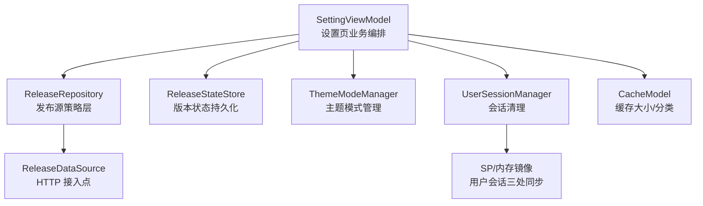
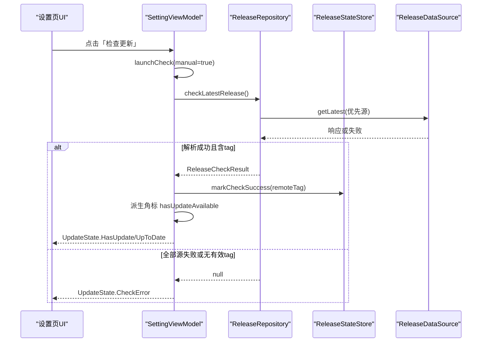
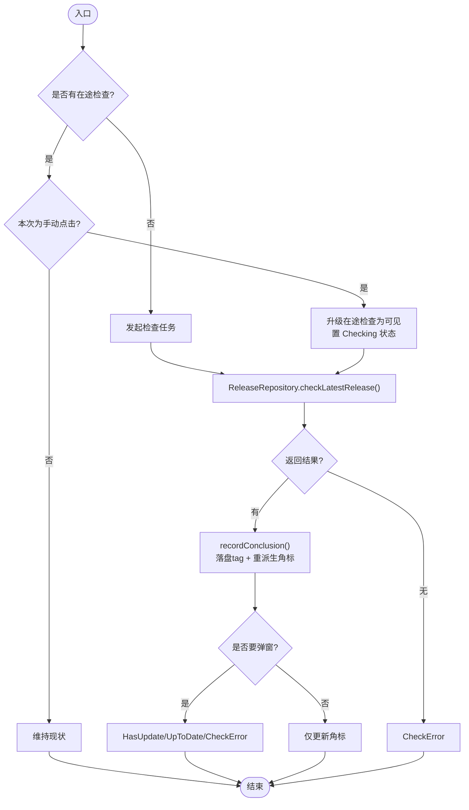
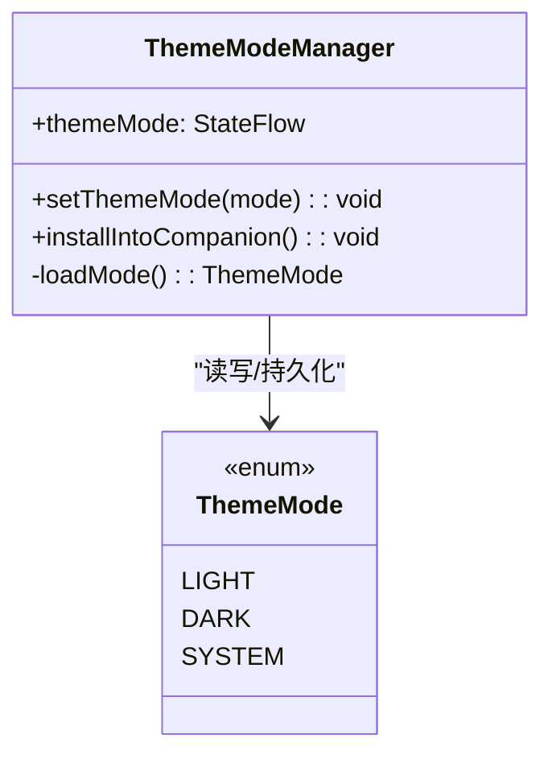
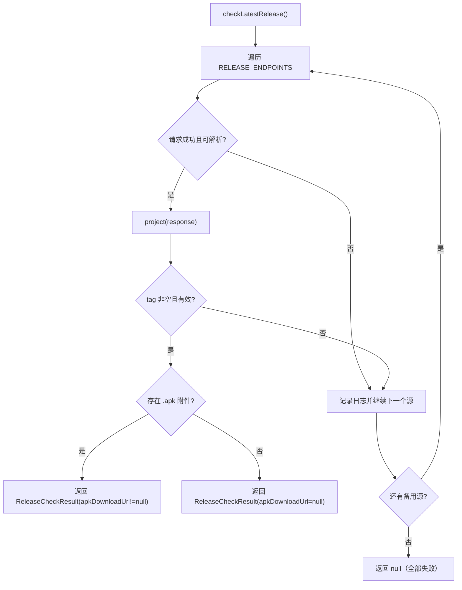
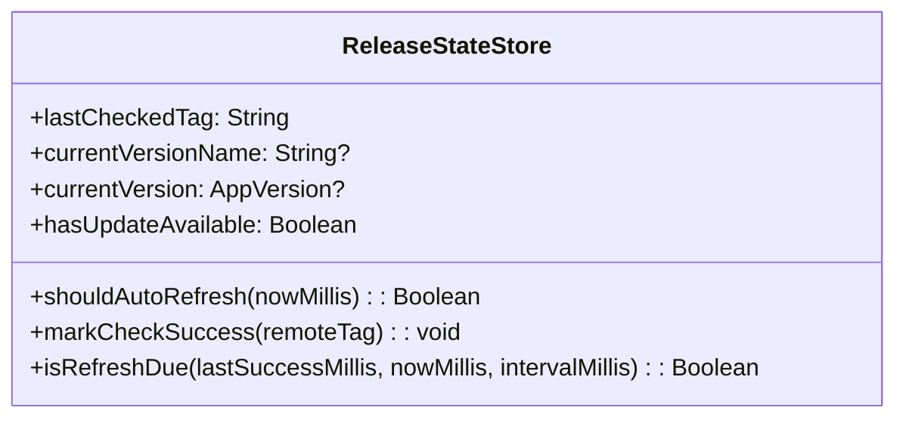
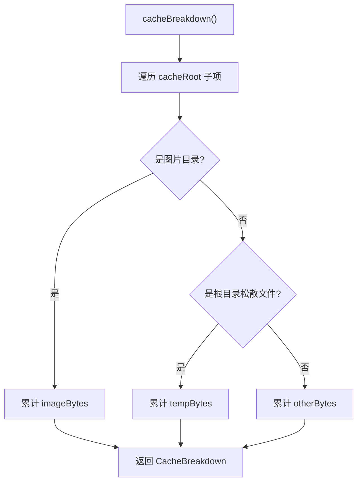
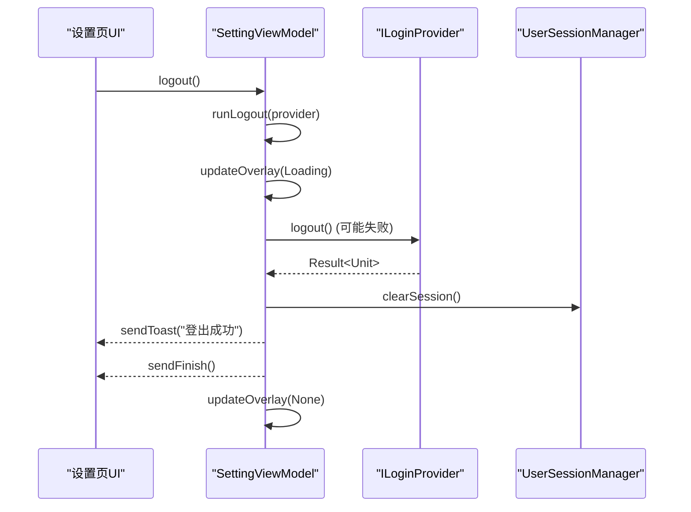
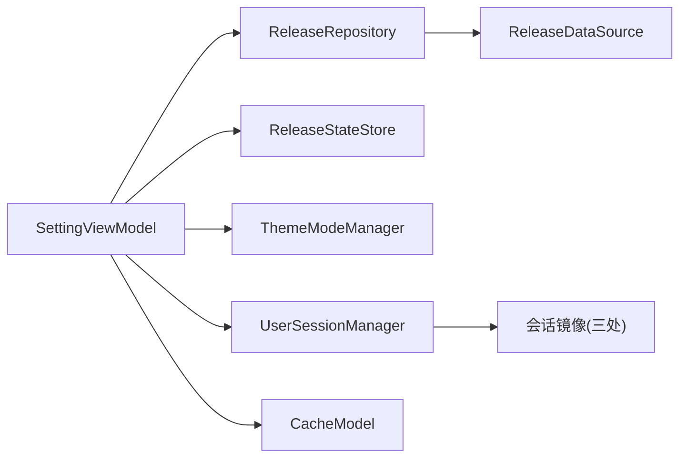

# 设置配置系统

<cite>
**本文引用的文件**
- [SettingViewModel.kt](file://module_me/src/main/java/com/ebook/me/mvvm/viewmodel/SettingViewModel.kt)
- [ThemeModeManager.kt](file://lib_book_common/src/main/java/com/ebook/common/domain/ThemeModeManager.kt)
- [ReleaseRepository.kt](file://module_me/src/main/java/com/ebook/me/repository/ReleaseRepository.kt)
- [ReleaseStateStore.kt](file://module_me/src/main/java/com/ebook/me/repository/ReleaseStateStore.kt)
- [ILoginProvider.kt](file://lib_book_common/src/main/java/com/ebook/common/provider/ILoginProvider.kt)
- [UserSessionManager.kt](file://lib_book_common/src/main/java/com/ebook/common/domain/UserSessionManager.kt)
- [CacheModel.kt](file://module_me/src/main/java/com/ebook/me/repository/CacheModel.kt)
</cite>

## 目录
1. [简介](#简介)
2. [项目结构](#项目结构)
3. [核心组件](#核心组件)
4. [架构总览](#架构总览)
5. [详细组件分析](#详细组件分析)
6. [依赖关系分析](#依赖关系分析)
7. [性能考量](#性能考量)
8. [故障排查指南](#故障排查指南)
9. [结论](#结论)
10. [附录：扩展实践](#附录：扩展实践)

## 简介
本文件聚焦“设置配置系统”，围绕 SettingViewModel 的主题模式管理、版本更新检查（主动检查与静默刷新）、缓存统计、书源计数等能力，系统性阐述其设计、数据流与交互流程；并说明 ThemeModeManager 的集成方式与主题三态切换逻辑；解释 ReleaseRepository 的双源 failover、APK 附件过滤与网络容错；说明 ReleaseStateStore 的版本信息持久化、限频控制与角标派生逻辑；最后给出退出登录的完整流程与跨模块 Provider 调用细节。

## 项目结构
设置相关能力横跨多个模块：
- module_me：设置页 ViewModel、版本检查策略层与状态存储、缓存模型
- lib_book_common：主题模式管理器、会话管理器接口、跨模块 Provider 接口
- lib_ebook_api：版本发布数据源（由仓库层调用）

图示来源
- [SettingViewModel.kt:63-71](file://module_me/src/main/java/com/ebook/me/mvvm/viewmodel/SettingViewModel.kt#L63-L71)
- [ReleaseRepository.kt:36-70](file://module_me/src/main/java/com/ebook/me/repository/ReleaseRepository.kt#L36-L70)
- [ReleaseStateStore.kt:33-101](file://module_me/src/main/java/com/ebook/me/repository/ReleaseStateStore.kt#L33-L101)
- [ThemeModeManager.kt:44-77](file://lib_book_common/src/main/java/com/ebook/common/domain/ThemeModeManager.kt#L44-L77)
- [CacheModel.kt:57-69](file://module_me/src/main/java/com/ebook/me/repository/CacheModel.kt#L57-L69)
- [UserSessionManager.kt:13-62](file://lib_book_common/src/main/java/com/ebook/common/domain/UserSessionManager.kt#L13-L62)

章节来源
- [SettingViewModel.kt:63-71](file://module_me/src/main/java/com/ebook/me/mvvm/viewmodel/SettingViewModel.kt#L63-L71)
- [ReleaseRepository.kt:13-34](file://module_me/src/main/java/com/ebook/me/repository/ReleaseRepository.kt#L13-L34)
- [ReleaseStateStore.kt:12-31](file://module_me/src/main/java/com/ebook/me/repository/ReleaseStateStore.kt#L12-L31)
- [ThemeModeManager.kt:10-43](file://lib_book_common/src/main/java/com/ebook/common/domain/ThemeModeManager.kt#L10-L43)
- [CacheModel.kt:45-69](file://module_me/src/main/java/com/ebook/me/repository/CacheModel.kt#L45-L69)
- [UserSessionManager.kt:5-17](file://lib_book_common/src/main/java/com/ebook/common/domain/UserSessionManager.kt#L5-L17)

## 核心组件
- SettingViewModel：设置页编排中心，负责主题切换、版本检查双触发、缓存统计、书源计数、退出登录流程编排
- ThemeModeManager：主题模式三态（LIGHT/DARK/SYSTEM）的持久化与状态流暴露
- ReleaseRepository：版本检查的策略层，维护发布源顺序、failover、APK 附件过滤、网络异常容错
- ReleaseStateStore：版本检查结果的本地持久化与限频窗口控制，以及角标派生
- CacheModel：缓存目录大小计算、分类明细与清理
- UserSessionManager：会话状态的唯一入口，提供 clearSession 以统一清理三处镜像
- ILoginProvider：跨模块 Provider 接口，封装服务端登出能力

章节来源
- [SettingViewModel.kt:34-61](file://module_me/src/main/java/com/ebook/me/mvvm/viewmodel/SettingViewModel.kt#L34-L61)
- [ThemeModeManager.kt:10-43](file://lib_book_common/src/main/java/com/ebook/common/domain/ThemeModeManager.kt#L10-L43)
- [ReleaseRepository.kt:13-34](file://module_me/src/main/java/com/ebook/me/repository/ReleaseRepository.kt#L13-L34)
- [ReleaseStateStore.kt:12-31](file://module_me/src/main/java/com/ebook/me/repository/ReleaseStateStore.kt#L12-L31)
- [CacheModel.kt:45-69](file://module_me/src/main/java/com/ebook/me/repository/CacheModel.kt#L45-L69)
- [UserSessionManager.kt:5-17](file://lib_book_common/src/main/java/com/ebook/common/domain/UserSessionManager.kt#L5-L17)
- [ILoginProvider.kt:3-19](file://lib_book_common/src/main/java/com/ebook/common/provider/ILoginProvider.kt#L3-L19)

## 架构总览
设置系统的职责边界清晰：VM 仅做编排与 UI 状态推进；Repository 负责远端策略与容错；Store 负责本地持久化与派生态；Domain/Provider 提供跨模块能力。

图示来源
- [SettingViewModel.kt:214-257](file://module_me/src/main/java/com/ebook/me/mvvm/viewmodel/SettingViewModel.kt#L214-L257)
- [ReleaseRepository.kt:46-70](file://module_me/src/main/java/com/ebook/me/repository/ReleaseRepository.kt#L46-L70)
- [ReleaseStateStore.kt:89-101](file://module_me/src/main/java/com/ebook/me/repository/ReleaseStateStore.kt#L89-L101)

## 详细组件分析

### SettingViewModel：设置页编排中心
- 主题模式管理：通过 ThemeModeManager 暴露 themeMode 流并提供 setThemeMode 写入入口，由应用主题装配点观察变化后重组全局配色
- 版本更新检查：
  - 主动检查：用户点击时立即发起请求，完成后根据结果展示弹窗（已有新版本/已是最新/检查失败）
  - 静默刷新：进入设置页时，若距上次成功检查≥7天则后台刷新角标（不弹窗）；在途期间用户再次点击会升级为可见检查
  - 单飞机制：同一时刻最多一个请求，避免并发；关闭弹窗可取消在途任务
  - 结果处理：判不出结论（远端 tag 不可解析或本地版本读不到）一律视为检查失败且不写成功时间戳，避免错误结论污染限频窗口与角标
- 缓存统计：读取 cacheDir 总占用并格式化显示；支持外部刷新
- 书源计数：从 BookSourceManager 观察当前书源总数（包含禁用项），作为入口行副标题
- 退出登录：跨模块获取 ILoginProvider，先尽力作废服务端会话，再无条件清理本地会话（三处镜像同步），然后提示并关闭页面

图示来源
- [SettingViewModel.kt:228-257](file://module_me/src/main/java/com/ebook/me/mvvm/viewmodel/SettingViewModel.kt#L228-L257)
- [SettingViewModel.kt:259-271](file://module_me/src/main/java/com/ebook/me/mvvm/viewmodel/SettingViewModel.kt#L259-L271)
- [ReleaseRepository.kt:46-70](file://module_me/src/main/java/com/ebook/me/repository/ReleaseRepository.kt#L46-L70)

章节来源
- [SettingViewModel.kt:63-71](file://module_me/src/main/java/com/ebook/me/mvvm/viewmodel/SettingViewModel.kt#L63-L71)
- [SettingViewModel.kt:163-172](file://module_me/src/main/java/com/ebook/me/mvvm/viewmodel/SettingViewModel.kt#L163-L172)
- [SettingViewModel.kt:180-201](file://module_me/src/main/java/com/ebook/me/mvvm/viewmodel/SettingViewModel.kt#L180-L201)
- [SettingViewModel.kt:214-257](file://module_me/src/main/java/com/ebook/me/mvvm/viewmodel/SettingViewModel.kt#L214-L257)
- [SettingViewModel.kt:259-290](file://module_me/src/main/java/com/ebook/me/mvvm/viewmodel/SettingViewModel.kt#L259-L290)
- [SettingViewModel.kt:292-343](file://module_me/src/main/java/com/ebook/me/mvvm/viewmodel/SettingViewModel.kt#L292-L343)

### ThemeModeManager：主题模式三态管理
- 三态枚举：LIGHT（强制浅色）、DARK（强制深色）、SYSTEM（跟随系统）
- 持久化：将选择写入 SharedPreferences，默认值为 SYSTEM
- 状态流：以 StateFlow 暴露当前模式，供应用主题装配点观察并触发重组
- 集成方式：Hilt 绑定到单例；在 Application 初始化后安装至 Companion，以便 Compose 主题 lambda 在无 Hilt 注入场景下读取

图示来源
- [ThemeModeManager.kt:17-26](file://lib_book_common/src/main/java/com/ebook/common/domain/ThemeModeManager.kt#L17-L26)
- [ThemeModeManager.kt:44-77](file://lib_book_common/src/main/java/com/ebook/common/domain/ThemeModeManager.kt#L44-L77)

章节来源
- [ThemeModeManager.kt:10-43](file://lib_book_common/src/main/java/com/ebook/common/domain/ThemeModeManager.kt#L10-L43)
- [ThemeModeManager.kt:54-77](file://lib_book_common/src/main/java/com/ebook/common/domain/ThemeModeManager.kt#L54-L77)

### ReleaseRepository：发布源管理与容错
- 发布源顺序：优先 GitHub，其次 Gitcode 作为国内兜底；按顺序请求第一个成功源的结果
- 空 tag 视为无效：latest 端点必须有 tag，取不到即换下一个源
- APK 附件过滤：仅接受 .apk 附件，平台自动附带的源码归档会被忽略；无 APK 不代表失败，仅表示下载入口不可用
- 网络容错：区分序列化异常与一般异常，均记录日志并尝试备用源；CancellationException 原样抛出以支持取消
- 结果投影：提取 remoteTag、body、apkDownloadUrl

图示来源
- [ReleaseRepository.kt:46-70](file://module_me/src/main/java/com/ebook/me/repository/ReleaseRepository.kt#L46-L70)
- [ReleaseRepository.kt:77-88](file://module_me/src/main/java/com/ebook/me/repository/ReleaseRepository.kt#L77-L88)
- [ReleaseRepository.kt:96-110](file://module_me/src/main/java/com/ebook/me/repository/ReleaseRepository.kt#L96-L110)

章节来源
- [ReleaseRepository.kt:13-34](file://module_me/src/main/java/com/ebook/me/repository/ReleaseRepository.kt#L13-L34)
- [ReleaseRepository.kt:46-70](file://module_me/src/main/java/com/ebook/me/repository/ReleaseRepository.kt#L46-L70)
- [ReleaseRepository.kt:72-88](file://module_me/src/main/java/com/ebook/me/repository/ReleaseRepository.kt#L72-L88)
- [ReleaseRepository.kt:90-110](file://module_me/src/main/java/com/ebook/me/repository/ReleaseRepository.kt#L90-L110)

### ReleaseStateStore：版本信息持久化与限频
- 持久化内容：上次成功检查到的远端 tag、成功检查时间戳
- 角标派生：每次现场比较 lastCheckedTag 与当前装机版本，得出 hasUpdateAvailable，避免存结论导致升级后仍显示角标的滞后问题
- 限频控制：7 天窗口判断是否允许静默刷新，减少频繁网络请求
- 失败不覆盖：仅在成功检查时写盘，失败路径保持旧结论与旧时间戳

图示来源
- [ReleaseStateStore.kt:33-101](file://module_me/src/main/java/com/ebook/me/repository/ReleaseStateStore.kt#L33-L101)
- [ReleaseStateStore.kt:110-128](file://module_me/src/main/java/com/ebook/me/repository/ReleaseStateStore.kt#L110-L128)

章节来源
- [ReleaseStateStore.kt:12-31](file://module_me/src/main/java/com/ebook/me/repository/ReleaseStateStore.kt#L12-L31)
- [ReleaseStateStore.kt:66-77](file://module_me/src/main/java/com/ebook/me/repository/ReleaseStateStore.kt#L66-L77)
- [ReleaseStateStore.kt:89-101](file://module_me/src/main/java/com/ebook/me/repository/ReleaseStateStore.kt#L89-L101)
- [ReleaseStateStore.kt:110-128](file://module_me/src/main/java/com/ebook/me/repository/ReleaseStateStore.kt#L110-L128)

### CacheModel：缓存统计与清理
- 总大小：递归计算 cacheDir 大小
- 分类明细：一次遍历分档累加 IMAGE/TEMP/OTHER，总量恒等于三者之和
- 清理能力：图片缓存、临时文件、其他缓存分别清理；支持列出各分类明细条目并按大小降序

图示来源
- [CacheModel.kt:71-92](file://module_me/src/main/java/com/ebook/me/repository/CacheModel.kt#L71-L92)

章节来源
- [CacheModel.kt:45-69](file://module_me/src/main/java/com/ebook/me/repository/CacheModel.kt#L45-L69)
- [CacheModel.kt:71-101](file://module_me/src/main/java/com/ebook/me/repository/CacheModel.kt#L71-L101)
- [CacheModel.kt:112-144](file://module_me/src/main/java/com/ebook/me/repository/CacheModel.kt#L112-L144)

### 退出登录流程：跨模块 Provider 与会话清理
- 跨模块能力：通过 TheRouter 解析 ILoginProvider，实现服务端登出（作废该用户全部 refresh token）
- 本地清理：调用 UserSessionManager.clearSession 统一清理三处镜像（user_session SP、spUtils 兼容键、ProfileRepository 内存流）
- 流程保障：在 viewModelScope 内完成，避免 Activity 重建导致清理未执行；先通知加载态、再提示成功、最后关闭页面

图示来源
- [SettingViewModel.kt:296-343](file://module_me/src/main/java/com/ebook/me/mvvm/viewmodel/SettingViewModel.kt#L296-L343)
- [ILoginProvider.kt:3-19](file://lib_book_common/src/main/java/com/ebook/common/provider/ILoginProvider.kt#L3-L19)
- [UserSessionManager.kt:44-47](file://lib_book_common/src/main/java/com/ebook/common/domain/UserSessionManager.kt#L44-L47)

章节来源
- [SettingViewModel.kt:292-343](file://module_me/src/main/java/com/ebook/me/mvvm/viewmodel/SettingViewModel.kt#L292-L343)
- [ILoginProvider.kt:3-19](file://lib_book_common/src/main/java/com/ebook/common/provider/ILoginProvider.kt#L3-L19)
- [UserSessionManager.kt:5-17](file://lib_book_common/src/main/java/com/ebook/common/domain/UserSessionManager.kt#L5-L17)

## 依赖关系分析
- SettingViewModel 依赖 ReleaseRepository、ReleaseStateStore、ThemeModeManager、UserSessionManager、CacheModel
- ReleaseRepository 依赖 ReleaseDataSource（HTTP 接入点），对外只暴露策略方法
- ReleaseStateStore 依赖 SharedPreferences 与版本工具类
- ThemeModeManager 依赖 Application 与 SharedPreferences，并通过 Companion 暴露给主题装配点
- 退出登录通过 ILoginProvider 解耦模块间耦合，UserSessionManager 统一清理会话

图示来源
- [SettingViewModel.kt:63-71](file://module_me/src/main/java/com/ebook/me/mvvm/viewmodel/SettingViewModel.kt#L63-L71)
- [ReleaseRepository.kt:36-70](file://module_me/src/main/java/com/ebook/me/repository/ReleaseRepository.kt#L36-L70)
- [ReleaseStateStore.kt:33-101](file://module_me/src/main/java/com/ebook/me/repository/ReleaseStateStore.kt#L33-L101)
- [ThemeModeManager.kt:44-77](file://lib_book_common/src/main/java/com/ebook/common/domain/ThemeModeManager.kt#L44-L77)
- [CacheModel.kt:57-69](file://module_me/src/main/java/com/ebook/me/repository/CacheModel.kt#L57-L69)
- [UserSessionManager.kt:44-47](file://lib_book_common/src/main/java/com/ebook/common/domain/UserSessionManager.kt#L44-L47)

章节来源
- [SettingViewModel.kt:63-71](file://module_me/src/main/java/com/ebook/me/mvvm/viewmodel/SettingViewModel.kt#L63-L71)
- [ReleaseRepository.kt:36-70](file://module_me/src/main/java/com/ebook/me/repository/ReleaseRepository.kt#L36-L70)
- [ReleaseStateStore.kt:33-101](file://module_me/src/main/java/com/ebook/me/repository/ReleaseStateStore.kt#L33-L101)
- [ThemeModeManager.kt:44-77](file://lib_book_common/src/main/java/com/ebook/common/domain/ThemeModeManager.kt#L44-L77)
- [CacheModel.kt:57-69](file://module_me/src/main/java/com/ebook/me/repository/CacheModel.kt#L57-L69)
- [UserSessionManager.kt:44-47](file://lib_book_common/src/main/java/com/ebook/common/domain/UserSessionManager.kt#L44-L47)

## 性能考量
- 版本检查单飞：同一时刻最多一个请求，避免重复网络开销与状态竞争
- 静默刷新限频：7 天窗口限制后台刷新频率，降低不必要网络请求
- 角标派生：基于已落盘的 tag 现场比较，避免额外查询与存储冗余
- 缓存统计：一次遍历分档累加，避免多次 IO 与负差值钳位
- 取消传播：在途检查可被取消，真正掐断后续备用源请求，避免无用网络

章节来源
- [SettingViewModel.kt:95-114](file://module_me/src/main/java/com/ebook/me/mvvm/viewmodel/SettingViewModel.kt#L95-L114)
- [ReleaseStateStore.kt:80-86](file://module_me/src/main/java/com/ebook/me/repository/ReleaseStateStore.kt#L80-L86)
- [ReleaseRepository.kt:46-70](file://module_me/src/main/java/com/ebook/me/repository/ReleaseRepository.kt#L46-L70)
- [CacheModel.kt:71-92](file://module_me/src/main/java/com/ebook/me/repository/CacheModel.kt#L71-L92)

## 故障排查指南
- 版本检查失败：
  - 检查远端 tag 是否为空或不可解析，此类情况不会写入成功时间戳，避免污染限频窗口
  - 确认两个发布源均可达，必要时查看日志中关于解析失败或请求失败的记录
- 角标不消失：
  - 确认已正确派生 hasUpdateAvailable，且安装新版本后重新进入设置页进行刷新
- 主题切换无效：
  - 检查 ThemeModeManager 是否正确写入 SharedPreferences 并推进 StateFlow
  - 确认应用主题装配点能观察到变化并重组
- 退出登录后仍显示登录态：
  - 确保 UserSessionManager.clearSession 被调用，且三处镜像均已清理
  - 检查 ILoginProvider 是否能正确解析并在独立模式下安全降级

章节来源
- [SettingViewModel.kt:259-290](file://module_me/src/main/java/com/ebook/me/mvvm/viewmodel/SettingViewModel.kt#L259-L290)
- [ReleaseRepository.kt:46-70](file://module_me/src/main/java/com/ebook/me/repository/ReleaseRepository.kt#L46-L70)
- [ThemeModeManager.kt:54-77](file://lib_book_common/src/main/java/com/ebook/common/domain/ThemeModeManager.kt#L54-L77)
- [SettingViewModel.kt:296-343](file://module_me/src/main/java/com/ebook/me/mvvm/viewmodel/SettingViewModel.kt#L296-L343)

## 结论
设置配置系统以 SettingViewModel 为核心编排者，结合 ReleaseRepository 的策略层与 ReleaseStateStore 的持久化层，实现了稳健的版本更新检查与角标管理；ThemeModeManager 提供一致的主题三态管理能力；CacheModel 提供高效的缓存统计与清理；退出登录通过 ILoginProvider 与 UserSessionManager 实现跨模块解耦与三处镜像同步。整体设计遵循单一职责、低耦合与高内聚原则，具备良好可测试性与可扩展性。

## 附录：扩展实践

### 添加新的设置项
- 在 SettingViewModel 中新增 StateFlow 字段承载新状态，并在 init 中初始化
- 若涉及网络或磁盘 IO，委托对应 Repository/Model 处理，VM 仅编排
- 在设置页 UI 中收集状态并展示

参考路径
- [SettingViewModel.kt:77-161](file://module_me/src/main/java/com/ebook/me/mvvm/viewmodel/SettingViewModel.kt#L77-L161)

### 实现自定义主题模式
- 扩展 ThemeMode 枚举增加新状态
- 在 ThemeModeManager 中处理新状态的持久化与默认回退逻辑
- 确保应用主题装配点能识别新状态并渲染

参考路径
- [ThemeModeManager.kt:17-26](file://lib_book_common/src/main/java/com/ebook/common/domain/ThemeModeManager.kt#L17-L26)
- [ThemeModeManager.kt:54-77](file://lib_book_common/src/main/java/com/ebook/common/domain/ThemeModeManager.kt#L54-L77)

### 扩展版本检查源
- 在 ReleaseRepository 的 RELEASE_ENDPOINTS 中添加新端点，保持顺序即优先级
- 确保新端点响应能被 project 方法正确解析，且符合 tag 与附件约定
- 如需不同解析规则，扩展 project 方法并补充日志

参考路径
- [ReleaseRepository.kt:96-110](file://module_me/src/main/java/com/ebook/me/repository/ReleaseRepository.kt#L96-L110)
- [ReleaseRepository.kt:72-88](file://module_me/src/main/java/com/ebook/me/repository/ReleaseRepository.kt#L72-L88)