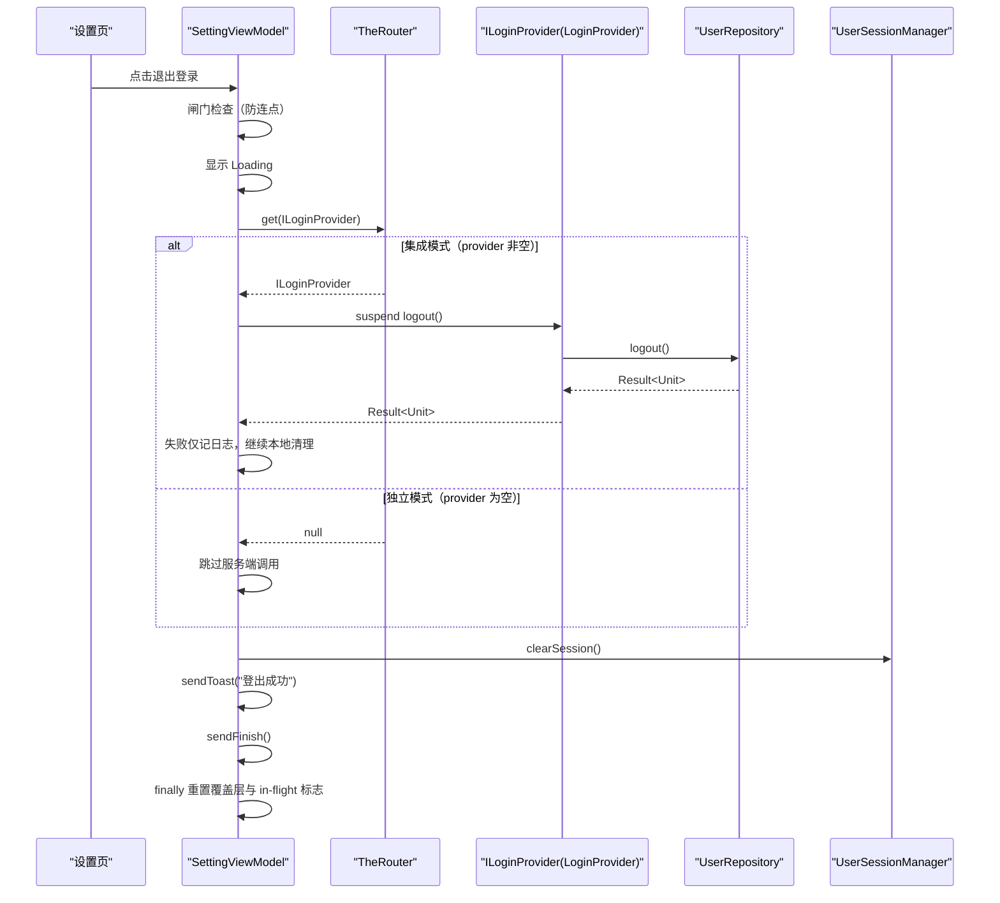
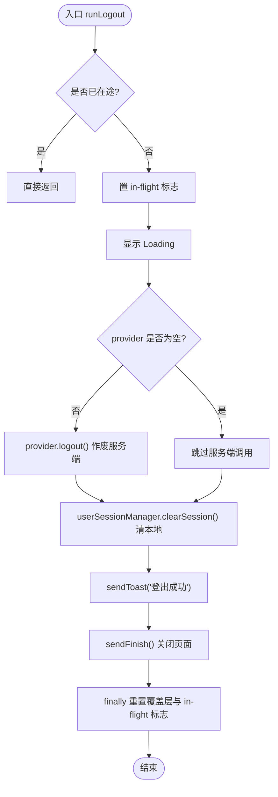
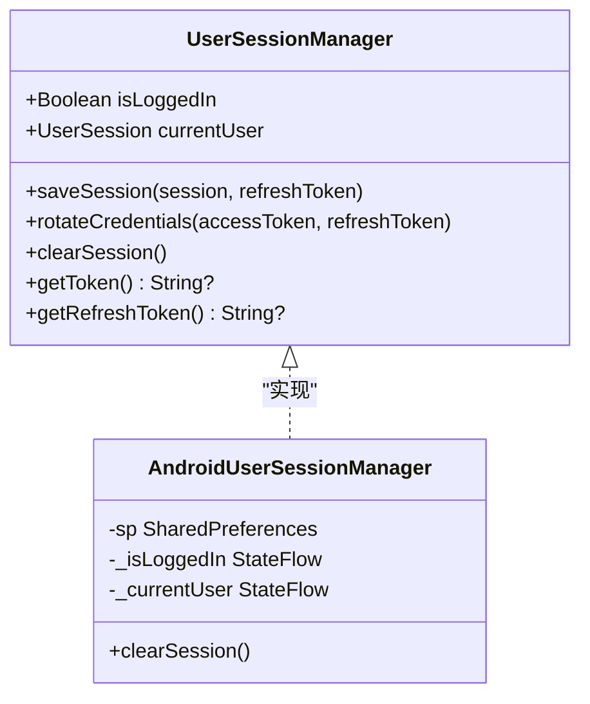
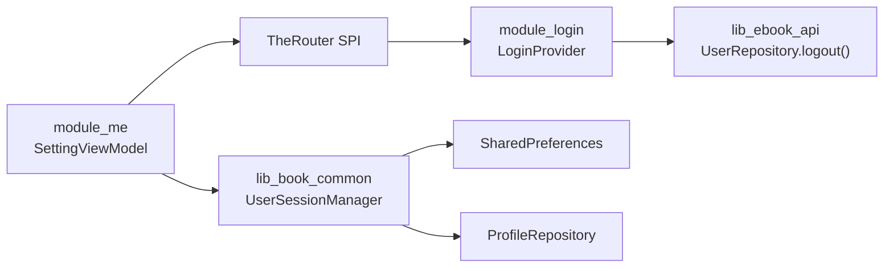

# 退出登录流程

<cite>
**本文引用的文件**
- [SettingViewModel.kt](file://module_me/src/main/java/com/ebook/me/mvvm/viewmodel/SettingViewModel.kt)
- [ILoginProvider.kt](file://lib_book_common/src/main/java/com/ebook/common/provider/ILoginProvider.kt)
- [LoginProvider.kt](file://module_login/src/main/java/com/ebook/login/provider/LoginProvider.kt)
- [UserSessionManager.kt](file://lib_book_common/src/main/java/com/ebook/common/domain/UserSessionManager.kt)
- [AndroidUserSessionManager.kt](file://lib_book_common/src/main/java/com/ebook/common/domain/AndroidUserSessionManager.kt)
- [SettingViewModelTest.kt](file://module_me/src/test/java/com/ebook/me/mvvm/viewmodel/SettingViewModelTest.kt)
- [0019-logout-capability-ownership.md](file://docs/adr/0019-logout-capability-ownership.md)
</cite>

## 目录
1. [简介](#简介)
2. [项目结构](#项目结构)
3. [核心组件](#核心组件)
4. [架构总览](#架构总览)
5. [详细组件分析](#详细组件分析)
6. [依赖关系分析](#依赖关系分析)
7. [性能与健壮性](#性能与健壮性)
8. [故障排查](#故障排查)
9. [结论](#结论)
10. [附录：测试与扩展](#附录测试与扩展)

## 简介
本文聚焦“退出登录”这一关键用户流程，系统化梳理从设置页触发到最终清会话、提示并关页的完整编排。重点说明：
- SettingViewModel.runLogout() 的闸门 → loading → 尽力作废服务端 → 无条件清本地 → 提示 + 关页 的严格顺序与容错策略。
- 跨模块 Provider 调用方式与独立运行模式下的空实现处理。
- UserSessionManager.clearSession() 的三处镜像同步点（SP、兼容键、进程内身份流）。
- 错误处理策略与服务端失败不阻塞本地清理的设计考量。
- 命令通道 sendToast() 先于 sendFinish() 的顺序保证。
- 如何测试该流程、如何扩展登出后清理逻辑、如何处理异步取消。

## 项目结构
退出登录涉及三个层次：
- 表现层入口：module_me 的 SettingViewModel 暴露 logout/runLogout，集中编排整条收尾链路。
- 跨模块能力：lib_book_common 定义 ILoginProvider 接口，module_login 提供 LoginProvider 实现，通过 TheRouter SPI 暴露。
- 会话管理：lib_book_common 的 AndroidUserSessionManager 负责本地会话的三处镜像同步清除。

```mermaid
graph TB
    A["设置页<br/>SettingViewModel"] -->|TheRouter.get(ILoginProvider)| B["登录域 Provider<br/>LoginProvider"]
    A --> C["会话管理<br/>UserSessionManager / AndroidUserSessionManager"]
    B --> D["登录仓库<br/>UserRepository.logout()"]
    C --> E["本地持久化<br/>user_session SP + spUtils 兼容键"]
    C --> F["进程内身份流<br/>ProfileRepository"]
```

图示来源
- [SettingViewModel.kt:326-343](file://module_me/src/main/java/com/ebook/me/mvvm/viewmodel/SettingViewModel.kt#L326-L343)
- [ILoginProvider.kt:1-19](file://lib_book_common/src/main/java/com/ebook/common/provider/ILoginProvider.kt#L1-L19)
- [LoginProvider.kt:1-35](file://module_login/src/main/java/com/ebook/login/provider/LoginProvider.kt#L1-L35)
- [AndroidUserSessionManager.kt:100-133](file://lib_book_common/src/main/java/com/ebook/common/domain/AndroidUserSessionManager.kt#L100-L133)

章节来源
- [SettingViewModel.kt:292-343](file://module_me/src/main/java/com/ebook/me/mvvm/viewmodel/SettingViewModel.kt#L292-L343)
- [0019-logout-capability-ownership.md:1-48](file://docs/adr/0019-logout-capability-ownership.md#L1-L48)

## 核心组件
- SettingViewModel.runLogout(provider)
  - 职责：编排登出全流程（闸门防重 → Loading → 尽力作废服务端 → 无条件清本地 → 提示 + 关页），并在 finally 中复位覆盖层与在途标志。
  - 关键点：在 viewModelScope 内执行，避免页面旋转导致协程被取消；provider 为 null 时跳过服务端调用；服务端失败仅记录日志，不影响本地清理。
- ILoginProvider / LoginProvider
  - 职责：跨模块暴露服务端登出能力（POST /api/auth/logout），由 TheRouter SPI 装配；独立模式下 provider 缺失，调用方需容忍空值。
- UserSessionManager / AndroidUserSessionManager
  - 职责：统一会话生命周期管理；clearSession() 一次性清理三处镜像：user_session SP、spUtils 兼容键、ProfileRepository 进程内身份流。

章节来源
- [SettingViewModel.kt:326-343](file://module_me/src/main/java/com/ebook/me/mvvm/viewmodel/SettingViewModel.kt#L326-L343)
- [ILoginProvider.kt:1-19](file://lib_book_common/src/main/java/com/ebook/common/provider/ILoginProvider.kt#L1-L19)
- [LoginProvider.kt:1-35](file://module_login/src/main/java/com/ebook/login/provider/LoginProvider.kt#L1-L35)
- [UserSessionManager.kt:44-47](file://lib_book_common/src/main/java/com/ebook/common/domain/UserSessionManager.kt#L44-L47)
- [AndroidUserSessionManager.kt:100-133](file://lib_book_common/src/main/java/com/ebook/common/domain/AndroidUserSessionManager.kt#L100-L133)

## 架构总览
退出登录的端到端时序如下：



图示来源
- [SettingViewModel.kt:326-343](file://module_me/src/main/java/com/ebook/me/mvvm/viewmodel/SettingViewModel.kt#L326-L343)
- [ILoginProvider.kt:1-19](file://lib_book_common/src/main/java/com/ebook/common/provider/ILoginProvider.kt#L1-L19)
- [LoginProvider.kt:1-35](file://module_login/src/main/java/com/ebook/login/provider/LoginProvider.kt#L1-L35)

## 详细组件分析

### SettingViewModel.runLogout() 编排
- 闸门防止重复点击：使用 in-flight 标志 logoutInProgress，重复调用直接返回，确保服务端作废与本地清理各只执行一次。
- 等待态显示 loading：进入协程后立即更新覆盖层为 Loading，给用户明确反馈。
- 尽力作废服务端：通过 TheRouter.get(ILoginProvider::class.java) 获取跨模块登出接口；独立运行模式下 provider 为 null，直接跳过服务端调用。
- 无条件清本地：无论服务端是否成功，都调用 userSessionManager.clearSession()，确保用户不会留在“已认为退出”的会话中。
- 提示 + 关页：先 sendToast() 再 sendFinish()，确保提示能正常消费（命令通道在宿主 lifecycle 中消费，finish 后采集器会随 onStop 取消，顺序反了会丢提示）。
- finally 复位：重置覆盖层与 in-flight 标志，保证后续可再次触发。



图示来源
- [SettingViewModel.kt:326-343](file://module_me/src/main/java/com/ebook/me/mvvm/viewmodel/SettingViewModel.kt#L326-L343)

章节来源
- [SettingViewModel.kt:292-343](file://module_me/src/main/java/com/ebook/me/mvvm/viewmodel/SettingViewModel.kt#L292-L343)

### 跨模块 Provider 调用
- 接口契约：ILoginProvider 仅暴露 logout(): Result<Unit]，语义明确为“作废服务端会话”，不包含本地清理。
- 实现接入：LoginProvider 通过 TheRouter @ServiceProvider 注册，内部经 Hilt EntryPointAccessors 获取 UserRepository 并委托其 logout()。
- 独立模式处理：isModule=true 时 module_login 不在依赖图内，TheRouter.get(...) 返回 null；调用方必须允许空实现，此时仅执行本地清理。

章节来源
- [ILoginProvider.kt:1-19](file://lib_book_common/src/main/java/com/ebook/common/provider/ILoginProvider.kt#L1-L19)
- [LoginProvider.kt:1-35](file://module_login/src/main/java/com/ebook/login/provider/LoginProvider.kt#L1-L35)
- [0019-logout-capability-ownership.md:12-27](file://docs/adr/0019-logout-capability-ownership.md#L12-L27)

### UserSessionManager.clearSession() 的三处镜像同步
- 内存态与 user_session SP：清空 _currentUser/_isLoggedIn，并移除 user_session 中的登录状态、token、用户信息键。
- spUtils 兼容键：调用 SPUtil.clearAuthData() 清除兼容旧拦截器的认证数据，避免“已登出但仍被放行”。
- ProfileRepository 进程内身份流：调用 resetProfileState() 重置昵称/头像等身份流，避免“我的”页仍显示上一个身份。



图示来源
- [UserSessionManager.kt:13-62](file://lib_book_common/src/main/java/com/ebook/common/domain/UserSessionManager.kt#L13-L62)
- [AndroidUserSessionManager.kt:28-133](file://lib_book_common/src/main/java/com/ebook/common/domain/AndroidUserSessionManager.kt#L28-L133)

章节来源
- [AndroidUserSessionManager.kt:100-133](file://lib_book_common/src/main/java/com/ebook/common/domain/AndroidUserSessionManager.kt#L100-L133)

### 错误处理策略
- 服务端登出失败不阻塞本地清理：onFailure 分支仅记录日志，继续执行 clearSession()，避免用户被锁在不期望的会话中。
- 独立模式 provider 为 null：直接跳过服务端调用，确保调试宿主仍能完成本地清理。
- 覆盖层复位：finally 块保证无论成功或失败，Loading 都会复位，避免界面卡死。

章节来源
- [SettingViewModel.kt:326-343](file://module_me/src/main/java/com/ebook/me/mvvm/viewmodel/SettingViewModel.kt#L326-L343)
- [0019-logout-capability-ownership.md:18-27](file://docs/adr/0019-logout-capability-ownership.md#L18-L27)

### 命令通道的使用
- sendToast() 先于 sendFinish()：确保提示消息能在页面 finish 前被宿主 MvvmBinder 消费；若顺序相反，finish 后采集器随 onStop 取消，提示会丢失。
- 覆盖层与 in-flight 标志：Loading 在 try 前设置，finally 中复位，保证任何异常路径都能恢复 UI。

章节来源
- [SettingViewModel.kt:326-343](file://module_me/src/main/java/com/ebook/me/mvvm/viewmodel/SettingViewModel.kt#L326-L343)

## 依赖关系分析
- 模块耦合：module_me 通过 TheRouter 间接依赖 module_login 的登出能力，保持功能模块互不直接依赖。
- 会话管理收敛：所有本地会话清理统一走 UserSessionManager.clearSession()，避免分散维护导致的遗漏。
- 外部依赖：Retrofit/OkHttp 网络栈位于 lib_ebook_api，由 module_login 的 UserRepository 封装，Provider 仅暴露最小契约。



图示来源
- [SettingViewModel.kt:326-343](file://module_me/src/main/java/com/ebook/me/mvvm/viewmodel/SettingViewModel.kt#L326-L343)
- [LoginProvider.kt:1-35](file://module_login/src/main/java/com/ebook/login/provider/LoginProvider.kt#L1-L35)
- [AndroidUserSessionManager.kt:100-133](file://lib_book_common/src/main/java/com/ebook/common/domain/AndroidUserSessionManager.kt#L100-L133)

章节来源
- [0019-logout-capability-ownership.md:12-27](file://docs/adr/0019-logout-capability-ownership.md#L12-L27)

## 性能与健壮性
- 防重入：in-flight 标志避免重复触发，降低不必要的网络请求与状态切换。
- 作用域选择：使用 viewModelScope 而非页面 lifecycleScope，确保旋转屏幕时流程不被中断。
- 失败隔离：服务端失败仅影响网络侧，本地清理不受影响，提升用户体验一致性。
- UI 安全：finally 复位覆盖层，避免 UI 卡在加载态。

## 故障排查
- 现象：点击退出登录后无提示或未关闭页面
  - 检查：是否在 Activity 中直接操作 ViewModel 的命令通道？应通过 BaseMvvmActivity 继承基类以消费命令。
  - 验证：确认 sendToast() 在 sendFinish() 之前调用。
- 现象：退出登录后“我的”页仍显示上一用户信息
  - 检查：是否调用了 ProfileRepository.resetProfileState()？应由 clearSession() 内部统一处理。
- 现象：独立模式下退出无效
  - 检查：provider 是否为 null？应跳过服务端调用并执行本地清理。
- 现象：多次点击退出登录仍触发多次网络请求
  - 检查：in-flight 标志是否正确设置与复位？确认 runLogout() 中 finally 块执行。

章节来源
- [SettingViewModelTest.kt:322-406](file://module_me/src/test/java/com/ebook/me/mvvm/viewmodel/SettingViewModelTest.kt#L322-L406)
- [AndroidUserSessionManager.kt:100-133](file://lib_book_common/src/main/java/com/ebook/common/domain/AndroidUserSessionManager.kt#L100-L133)

## 结论
退出登录流程通过清晰的编排与严格的容错设计，确保了用户体验的一致性与可靠性。核心要点包括：
- 闸门防重、loading 反馈、尽力作废服务端、无条件清本地、提示 + 关页的固定顺序。
- 跨模块解耦：通过 TheRouter SPI 暴露最小能力，独立模式安全降级。
- 会话清理单点：UserSessionManager.clearSession() 统一管理三处镜像，避免遗漏。
- 错误隔离：服务端失败不阻塞本地清理，保障用户始终能退出当前会话。
- 命令通道顺序：先提示后关页，避免消息丢失。

## 附录：测试与扩展

### 如何测试登出流程
- 使用 SettingViewModelTest 中的 FakeLoginProvider 与 RecordingSessionManager 模拟 provider 与会话管理器。
- 断言关键行为：
  - 先调用 provider.logout() 再调用 clearSession()。
  - 服务端失败时仍调用 clearSession()。
  - provider 为 null 时仅执行本地清理。
  - 连点只触发一次登出。
  - 覆盖层在 in-flight 期间为 Loading，结束后复位。

章节来源
- [SettingViewModelTest.kt:322-406](file://module_me/src/test/java/com/ebook/me/mvvm/viewmodel/SettingViewModelTest.kt#L322-L406)

### 如何扩展登出后的清理逻辑
- 在 SettingViewModel.runLogout() 中 clearSession() 之后添加自定义清理步骤，例如：
  - 清除本地缓存、通知订阅、停止后台服务。
  - 注意：新增逻辑应在 clearSession() 之后，确保会话状态已失效。
- 如需保留服务端失败对本地清理的影响，需谨慎评估风险，建议维持“失败不阻塞本地清理”的原则。

章节来源
- [SettingViewModel.kt:326-343](file://module_me/src/main/java/com/ebook/me/mvvm/viewmodel/SettingViewModel.kt#L326-L343)

### 如何处理异步操作的取消
- 使用 viewModelScope.launch 启动协程，页面旋转时由 ViewModelStore 持有，避免被 Activity 重建取消。
- 若需支持用户主动取消（如弹窗关闭），可在 runLogout 中引入 Job 引用，并提供 cancel 方法。
- 注意：登出流程应尽量幂等，避免取消后重复执行产生副作用。

章节来源
- [SettingViewModel.kt:326-343](file://module_me/src/main/java/com/ebook/me/mvvm/viewmodel/SettingViewModel.kt#L326-L343)