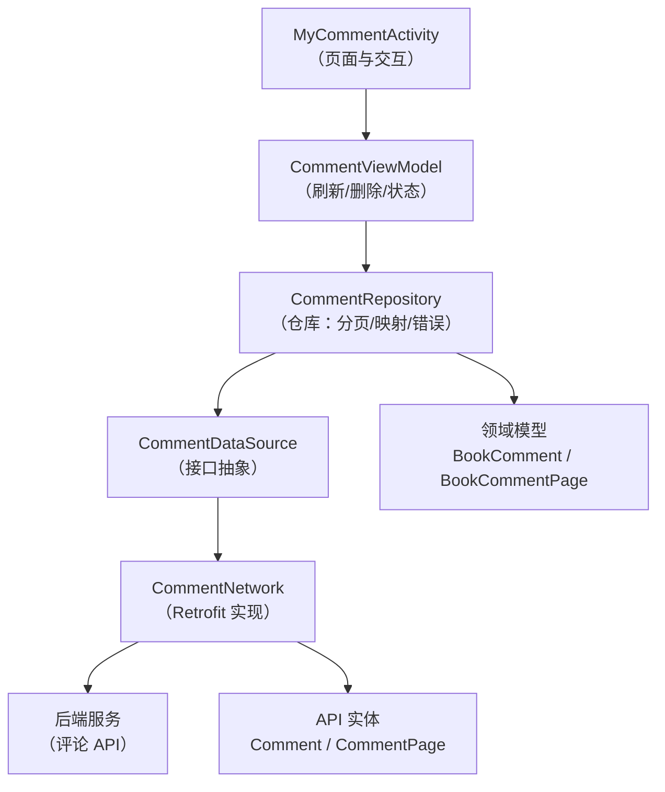
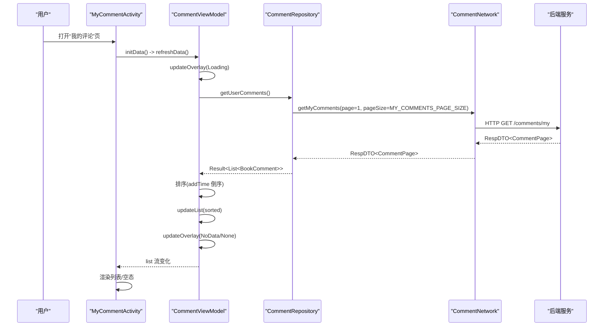
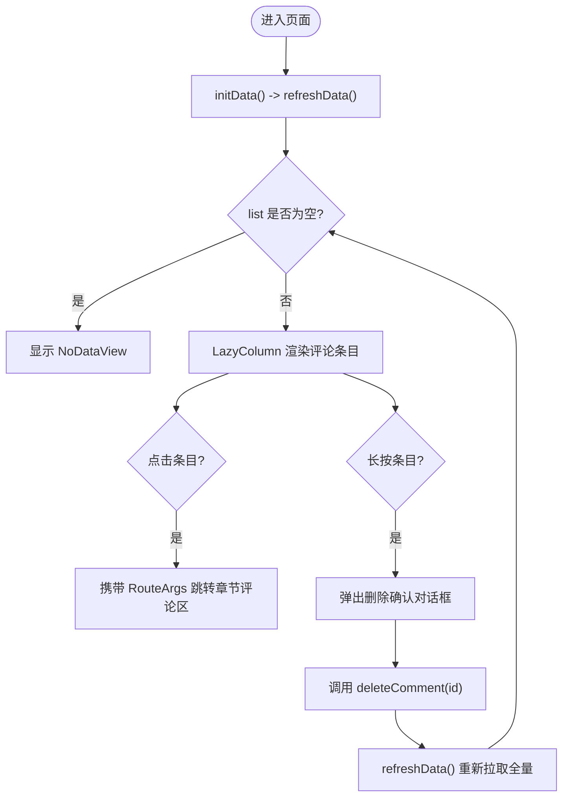
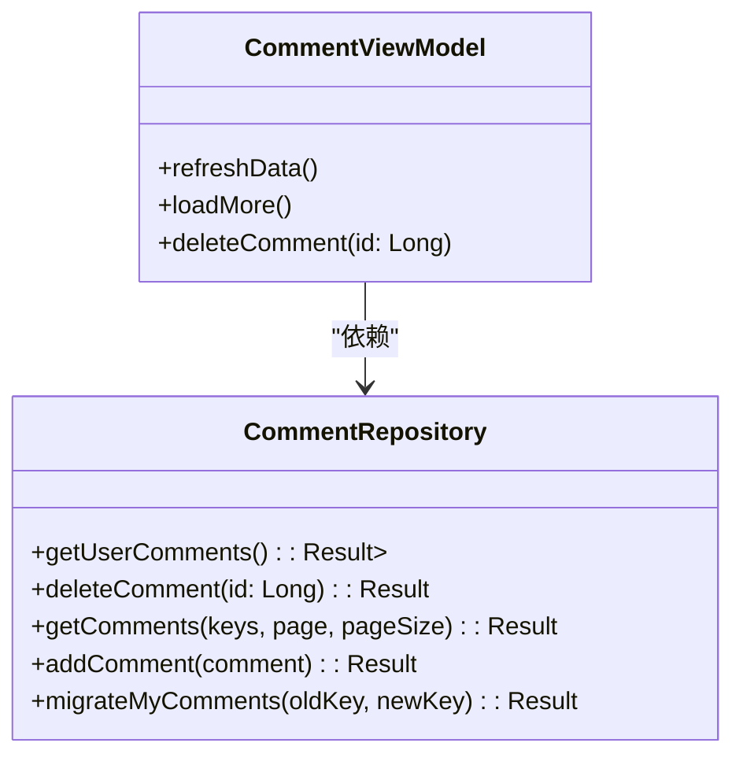
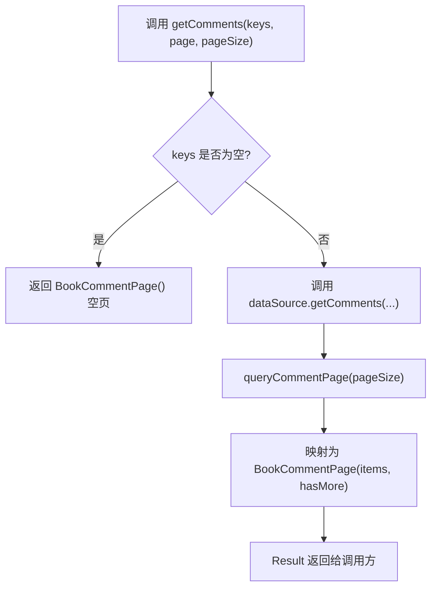
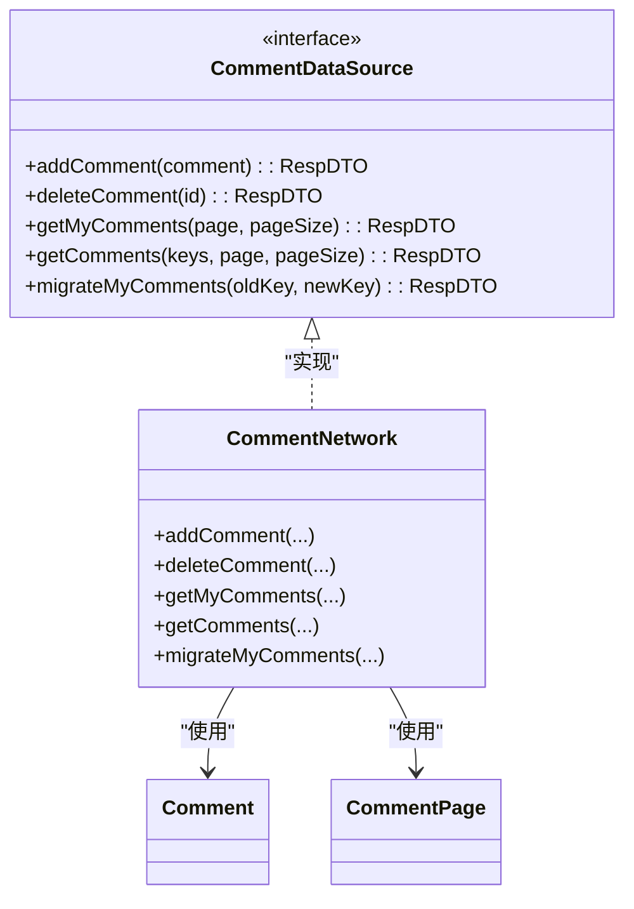
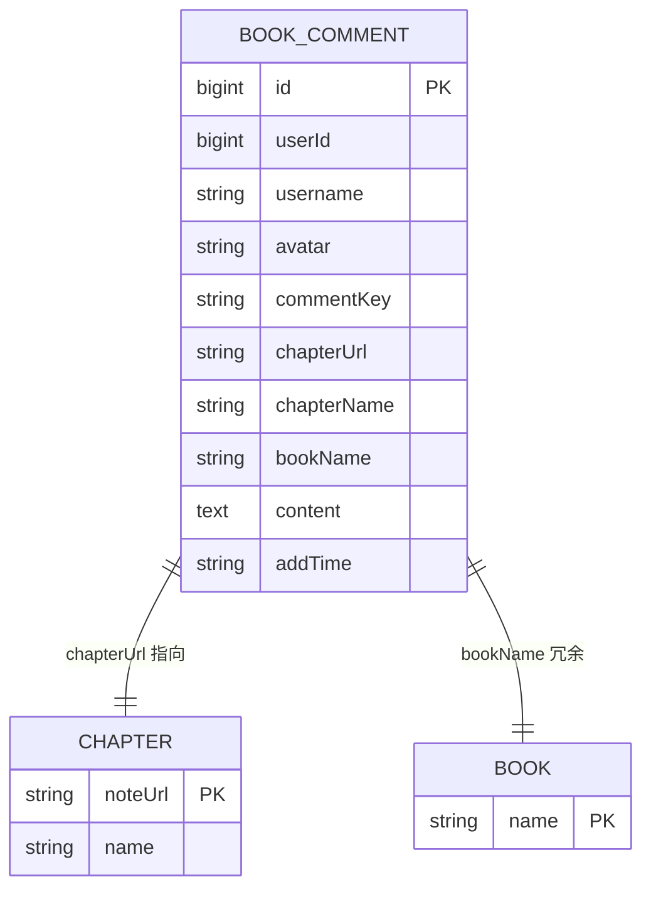
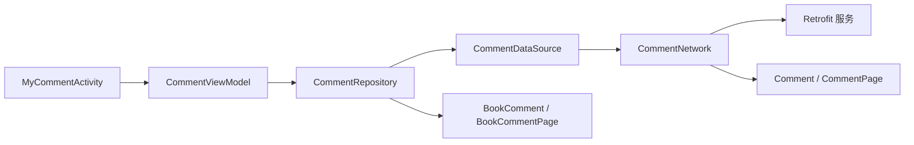

# 评论管理功能

<cite>
**本文引用的文件**
- [MyCommentActivity.kt](file://module_me/src/main/java/com/ebook/me/view/MyCommentActivity.kt)
- [CommentViewModel.kt](file://module_me/src/main/java/com/ebook/me/mvvm/viewmodel/CommentViewModel.kt)
- [CommentRepository.kt](file://lib_book_common/src/main/java/com/ebook/common/repository/CommentRepository.kt)
- [CommentDataSource.kt](file://lib_ebook_api/src/main/java/com/ebook/api/service/comment/CommentDataSource.kt)
- [CommentNetwork.kt](file://lib_ebook_api/src/main/java/com/ebook/api/service/comment/CommentNetwork.kt)
- [Comment.kt](file://lib_ebook_api/src/main/java/com/ebook/api/entity/Comment.kt)
- [CommentPage.kt](file://lib_ebook_api/src/main/java/com/ebook/api/entity/CommentPage.kt)
- [BookComment.kt](file://lib_book_common/src/main/java/com/ebook/common/domain/BookComment.kt)
- [BookCommentPage.kt](file://lib_book_common/src/main/java/com/ebook/common/domain/BookCommentPage.kt)
</cite>

## 目录
1. [简介](#简介)
2. [项目结构](#项目结构)
3. [核心组件](#核心组件)
4. [架构总览](#架构总览)
5. [详细组件分析](#详细组件分析)
6. [依赖关系分析](#依赖关系分析)
7. [性能考虑](#性能考虑)
8. [故障排查指南](#故障排查指南)
9. [结论](#结论)
10. [附录：扩展指南](#附录：扩展指南)

## 简介
本章节围绕“我的评论”与“书籍章节评论区”的评论管理能力展开，重点说明以下目标：
- MyCommentActivity 的评论列表展示、用户交互（点击跳转、长按删除）以及空态处理。
- CommentViewModel 的数据获取、状态更新、删除操作与分页约定（当前为一次性拉取）。
- 评论数据从网络到领域模型的转换、错误处理策略与加载状态管理。
- 评论系统与书架、章节的数据关联（通过聚合键 commentKey 与章节 URL/名称等冗余字段）。
- 如何扩展评论能力（新增操作、搜索筛选思路、与章节评论区的联动）。

## 项目结构
评论相关代码横跨多个模块：
- 页面层：module_me 中的 MyCommentActivity（Compose UI + Activity 基类）。
- 状态层：module_me 中的 CommentViewModel（继承 BaseRefreshViewModel，负责刷新与删除）。
- 仓库层：lib_book_common 中的 CommentRepository（封装 API 调用、分页、领域映射）。
- 网络层：lib_ebook_api 中的 CommentDataSource/CommentNetwork/CommentService（Retrofit 接口透传）。
- 实体与领域模型：API 实体 Comment/CommentPage，领域模型 BookComment/BookCommentPage。

图表来源
- [MyCommentActivity.kt:52-84](file://module_me/src/main/java/com/ebook/me/view/MyCommentActivity.kt#L52-L84)
- [CommentViewModel.kt:17-71](file://module_me/src/main/java/com/ebook/me/mvvm/viewmodel/CommentViewModel.kt#L17-L71)
- [CommentRepository.kt:16-114](file://lib_book_common/src/main/java/com/ebook/common/repository/CommentRepository.kt#L16-L114)
- [CommentDataSource.kt:8-34](file://lib_ebook_api/src/main/java/com/ebook/api/service/comment/CommentDataSource.kt#L8-L34)
- [CommentNetwork.kt:13-47](file://lib_ebook_api/src/main/java/com/ebook/api/service/comment/CommentNetwork.kt#L13-L47)

章节来源
- [MyCommentActivity.kt:52-84](file://module_me/src/main/java/com/ebook/me/view/MyCommentActivity.kt#L52-L84)
- [CommentViewModel.kt:17-71](file://module_me/src/main/java/com/ebook/me/mvvm/viewmodel/CommentViewModel.kt#L17-L71)
- [CommentRepository.kt:16-114](file://lib_book_common/src/main/java/com/ebook/common/repository/CommentRepository.kt#L16-L114)

## 核心组件
- MyCommentActivity：提供“我的评论”页面入口与 Compose 界面，承载点击跳转至章节评论区、长按弹出删除确认等操作。
- CommentViewModel：负责首屏刷新、删除操作、加载/空态覆盖层的切换；当前“我的评论”一次性拉取并按时间倒序排序。
- CommentRepository：统一封装评论的网络请求、分页结果映射、增删改查命令及迁移接口；对外暴露领域级 Result。
- CommentDataSource/CommentNetwork：定义并实现评论 API 访问契约（添加、删除、查询、迁移），将参数转换为后端格式。
- 实体与领域模型：API 实体 Comment/CommentPage 与领域模型 BookComment/BookCommentPage 解耦传输细节与业务语义。

章节来源
- [MyCommentActivity.kt:45-84](file://module_me/src/main/java/com/ebook/me/view/MyCommentActivity.kt#L45-L84)
- [CommentViewModel.kt:17-71](file://module_me/src/main/java/com/ebook/me/mvvm/viewmodel/CommentViewModel.kt#L17-L71)
- [CommentRepository.kt:16-114](file://lib_book_common/src/main/java/com/ebook/common/repository/CommentRepository.kt#L16-L114)
- [CommentDataSource.kt:8-34](file://lib_ebook_api/src/main/java/com/ebook/api/service/comment/CommentDataSource.kt#L8-L34)
- [CommentNetwork.kt:13-47](file://lib_ebook_api/src/main/java/com/ebook/api/service/comment/CommentNetwork.kt#L13-L47)
- [Comment.kt:8-39](file://lib_ebook_api/src/main/java/com/ebook/api/entity/Comment.kt#L8-L39)
- [CommentPage.kt:6-18](file://lib_ebook_api/src/main/java/com/ebook/api/entity/CommentPage.kt#L6-L18)
- [BookComment.kt:1-18](file://lib_book_common/src/main/java/com/ebook/common/domain/BookComment.kt#L1-L18)
- [BookCommentPage.kt:1-17](file://lib_book_common/src/main/java/com/ebook/common/domain/BookCommentPage.kt#L1-L17)

## 架构总览
评论功能采用 MVVM + Repository 分层：
- View（MyCommentActivity）仅持有 UI 逻辑与路由跳转，不直接访问数据源。
- ViewModel 负责协调 Refresh/LoadMore/Delete 等业务动作，并通过 BaseRefreshViewModel 管理 Overlay（Loading/None/NoData）。
- Repository 封装网络调用、分页、错误上报与领域模型转换，屏蔽传输层细节。
- DataSource/Network 通过 Retrofit 与后端交互，返回 RespDTO 信封，由 CoroutineAdapter 统一适配 Result。

图表来源
- [MyCommentActivity.kt:62-84](file://module_me/src/main/java/com/ebook/me/view/MyCommentActivity.kt#L62-L84)
- [CommentViewModel.kt:34-53](file://module_me/src/main/java/com/ebook/me/mvvm/viewmodel/CommentViewModel.kt#L34-L53)
- [CommentRepository.kt:32-38](file://lib_book_common/src/main/java/com/ebook/common/repository/CommentRepository.kt#L32-L38)
- [CommentNetwork.kt:32-33](file://lib_ebook_api/src/main/java/com/ebook/api/service/comment/CommentNetwork.kt#L32-L33)

## 详细组件分析

### MyCommentActivity：评论列表与交互
- 页面职责：
  - 继承 BaseMvvmActivity<CommentViewModel>，使用 viewModels() 注入 ViewModel。
  - 在 initData() 中触发 viewModel.refreshData() 以拉取评论列表。
  - PageContent 中订阅 viewModel.list 流，渲染 MyCommentScreen。
- 交互流程：
  - 点击评论项：携带 RouteArgs（commentKey、chapterUrl、chapterName、bookName）跳转到书籍评论区。
  - 长按评论项：弹出删除确认对话框，确认后调用 viewModel.deleteComment(id)。
- UI 实现要点：
  - 空态：当列表为空时显示 NoDataView，文案来自资源。
  - 列表项：使用 CommonItemCard 包裹，显示书名+时间、章节 InfoChip、内容摘要（最多 3 行）。
  - 删除弹窗：Material AlertDialog，确认按钮带错误色提示。

图表来源
- [MyCommentActivity.kt:57-84](file://module_me/src/main/java/com/ebook/me/view/MyCommentActivity.kt#L57-L84)
- [MyCommentActivity.kt:92-147](file://module_me/src/main/java/com/ebook/me/view/MyCommentActivity.kt#L92-L147)

章节来源
- [MyCommentActivity.kt:52-84](file://module_me/src/main/java/com/ebook/me/view/MyCommentActivity.kt#L52-L84)
- [MyCommentActivity.kt:92-147](file://module_me/src/main/java/com/ebook/me/view/MyCommentActivity.kt#L92-L147)
- [MyCommentActivity.kt:152-201](file://module_me/src/main/java/com/ebook/me/view/MyCommentActivity.kt#L152-L201)

### CommentViewModel：数据获取、状态管理与删除
- 数据获取：
  - refreshData() 中先设置 Loading 覆盖层，再调用 repository.getUserComments()。
  - 成功后按 addTime 倒序排序（使用 CommentTime.sortMillis 作为稳定排序键），然后更新列表与覆盖层（空态或无覆盖）。
  - 失败时通过 reportFailure 上报异常；若未静默且列表仍为空，则显示 NoData。
- 分页约定：
  - loadMore() 为空实现，因为“我的评论”当前一次性拉取（大页 MY_COMMENTS_PAGE_SIZE）。
- 删除操作：
  - deleteComment(id) 调用 repository.deleteComment(id)，成功则发送 Toast 并重新拉取全量；失败走 reportFailure。

图表来源
- [CommentViewModel.kt:17-71](file://module_me/src/main/java/com/ebook/me/mvvm/viewmodel/CommentViewModel.kt#L17-L71)
- [CommentRepository.kt:16-114](file://lib_book_common/src/main/java/com/ebook/common/repository/CommentRepository.kt#L16-L114)

章节来源
- [CommentViewModel.kt:17-71](file://module_me/src/main/java/com/ebook/me/mvvm/viewmodel/CommentViewModel.kt#L17-L71)

### CommentRepository：分页、映射与错误处理
- 方法说明：
  - getUserComments()：调用 dataSource.getMyComments(1, MY_COMMENTS_PAGE_SIZE)，映射为领域列表。
  - getComments(keys, page, pageSize)：当 keys 为空时直接返回空页（避免命中后端“全局最新”分支）。
  - addComment()/deleteComment()/migrateMyComments()：封装写入操作与迁移接口。
  - queryCommentPage()：通用分页映射，根据 items.size >= requestedPageSize 判断 hasMore。
- 错误处理：
  - 通过 CoroutineAdapter.safeApiCall 统一包装网络调用，Result 类型向上抛出。
  - mutateComment() 对 data 为空的情况抛出指定错误，便于上层区分业务失败。
- 分页大小：
  - PAGE_SIZE = 20（章节评论区列表）。
  - MY_COMMENTS_PAGE_SIZE = 100（我的评论一次性拉取）。

图表来源
- [CommentRepository.kt:58-67](file://lib_book_common/src/main/java/com/ebook/common/repository/CommentRepository.kt#L58-L67)
- [CommentRepository.kt:83-91](file://lib_book_common/src/main/java/com/ebook/common/repository/CommentRepository.kt#L83-L91)

章节来源
- [CommentRepository.kt:16-114](file://lib_book_common/src/main/java/com/ebook/common/repository/CommentRepository.kt#L16-L114)

### 网络层：CommentDataSource/CommentNetwork 与 API 实体
- CommentDataSource：定义评论能力接口（添加、删除、我的评论、多键查询、迁移）。
- CommentNetwork：基于 RetrofitBuilder 创建专用 Retrofit 对象（评论域名/端口），实现 DataSource 接口；getComments 将 List<String> 转为逗号分隔字符串（空列表转 null）。
- API 实体：
  - Comment：蛇形字段映射到驼峰属性，包含 id、user、commentKey、chapterUrl/chapterName/bookName、content、addTime。
  - CommentPage：分页响应包裹（items、total、page、pageSize）。

图表来源
- [CommentDataSource.kt:8-34](file://lib_ebook_api/src/main/java/com/ebook/api/service/comment/CommentDataSource.kt#L8-L34)
- [CommentNetwork.kt:13-47](file://lib_ebook_api/src/main/java/com/ebook/api/service/comment/CommentNetwork.kt#L13-L47)
- [Comment.kt:8-39](file://lib_ebook_api/src/main/java/com/ebook/api/entity/Comment.kt#L8-L39)
- [CommentPage.kt:6-18](file://lib_ebook_api/src/main/java/com/ebook/api/entity/CommentPage.kt#L6-L18)

章节来源
- [CommentDataSource.kt:8-34](file://lib_ebook_api/src/main/java/com/ebook/api/service/comment/CommentDataSource.kt#L8-L34)
- [CommentNetwork.kt:13-47](file://lib_ebook_api/src/main/java/com/ebook/api/service/comment/CommentNetwork.kt#L13-L47)
- [Comment.kt:8-39](file://lib_ebook_api/src/main/java/com/ebook/api/entity/Comment.kt#L8-L39)
- [CommentPage.kt:6-18](file://lib_ebook_api/src/main/java/com/ebook/api/entity/CommentPage.kt#L6-L18)

### 数据模型与关联关系
- 领域模型 BookComment：扁平化结构，包含 id、userId、username、avatar、commentKey、chapterUrl、chapterName、bookName、content、addTime。
- 领域分页 BookCommentPage：仅暴露 items 与 hasMore，hasMore 通过返回条数达到请求 pageSize 推断。
- 关联关系：
  - commentKey 作为聚合键（例如 ck1:hash 或 ck1:hash#章序号），用于定位评论归属的书/章。
  - chapterUrl/chapterName/bookName 作为冗余快照，方便 UI 展示与跳转。
  - 章节评论区通过传入 commentKeys 列表进行并集查询，支持跨书/跨章聚合。

图表来源
- [BookComment.kt:1-18](file://lib_book_common/src/main/java/com/ebook/common/domain/BookComment.kt#L1-L18)
- [Comment.kt:8-39](file://lib_ebook_api/src/main/java/com/ebook/api/entity/Comment.kt#L8-L39)

章节来源
- [BookComment.kt:1-18](file://lib_book_common/src/main/java/com/ebook/common/domain/BookComment.kt#L1-L18)
- [Comment.kt:8-39](file://lib_ebook_api/src/main/java/com/ebook/api/entity/Comment.kt#L8-L39)
- [BookCommentPage.kt:1-17](file://lib_book_common/src/main/java/com/ebook/common/domain/BookCommentPage.kt#L1-L17)

## 依赖关系分析
- 页面层依赖 ViewModel（Hilt 注入）。
- ViewModel 依赖 CommentRepository（通过构造函数注入）。
- Repository 依赖 CommentDataSource（接口解耦）、CoroutineAdapter（网络适配）。
- Network 依赖 RetrofitBuilder 与 API 常量，构造专用 Retrofit 实例。
- 实体与领域模型之间通过映射函数转换（如 toApiComment/toBookComment），使传输与业务解耦。

图表来源
- [MyCommentActivity.kt:52-84](file://module_me/src/main/java/com/ebook/me/view/MyCommentActivity.kt#L52-L84)
- [CommentViewModel.kt:24-27](file://module_me/src/main/java/com/ebook/me/mvvm/viewmodel/CommentViewModel.kt#L24-L27)
- [CommentRepository.kt:16-20](file://lib_book_common/src/main/java/com/ebook/common/repository/CommentRepository.kt#L16-L20)
- [CommentNetwork.kt:18-24](file://lib_ebook_api/src/main/java/com/ebook/api/service/comment/CommentNetwork.kt#L18-L24)

章节来源
- [MyCommentActivity.kt:52-84](file://module_me/src/main/java/com/ebook/me/view/MyCommentActivity.kt#L52-L84)
- [CommentViewModel.kt:24-27](file://module_me/src/main/java/com/ebook/me/mvvm/viewmodel/CommentViewModel.kt#L24-L27)
- [CommentRepository.kt:16-20](file://lib_book_common/src/main/java/com/ebook/common/repository/CommentRepository.kt#L16-L20)
- [CommentNetwork.kt:18-24](file://lib_ebook_api/src/main/java/com/ebook/api/service/comment/CommentNetwork.kt#L18-L24)

## 性能考虑
- 分页大小权衡：
  - 章节评论区默认 PAGE_SIZE=20，兼顾首屏速度与翻页体验。
  - “我的评论”使用 MY_COMMENTS_PAGE_SIZE=100，避免大列表被静默截断；未来接入分页后并入 PAGE_SIZE。
- 排序成本：
  - 列表按 addTime 倒序排序，时间解析精度到秒（CommentTime.sortMillis），排序复杂度 O(n log n)，在百级规模下可接受。
- 网络载荷：
  - 评论条目轻量，单页约几 KB，频繁翻页开销低；应避免不必要的重复请求。
- UI 渲染：
  - LazyColumn 配合稳定 key（item.id）减少重绘；CommonItemCard 控制阴影与内边距，避免密集列表叠阴影。

[本节为通用指导，无需特定文件引用]

## 故障排查指南
- 首屏加载失败：
  - 现象：列表为空且显示 NoData。
  - 排查：检查 CommentViewModel.refreshData 中 reportFailure 是否静默；若静默（会话过期），应交由全局跳转登录，不显示空态。
- 删除失败：
  - 现象：删除无反馈或报错。
  - 排查：查看 CommentViewModel.deleteComment 的错误分支是否调用 reportFailure；确认后端返回码与 RespDTO.data 语义。
- 分页异常：
  - 现象：加载更多无效或无限加载。
  - 排查：确认 CommentRepository.queryCommentPage 中 hasMore 判定逻辑；检查 getComments 传入的 commentKeys 是否为空（空键会命中后端“全局最新”分支）。
- 会话过期：
  - 现象：网络请求失败并触发全局登出流程。
  - 排查：reportFailure 已处理静默标记；确保未在调用方重复提示；检查 TokenHolder 与 AuthInterceptor 配置。

章节来源
- [CommentViewModel.kt:34-53](file://module_me/src/main/java/com/ebook/me/mvvm/viewmodel/CommentViewModel.kt#L34-L53)
- [CommentViewModel.kt:61-70](file://module_me/src/main/java/com/ebook/me/mvvm/viewmodel/CommentViewModel.kt#L61-L70)
- [CommentRepository.kt:58-67](file://lib_book_common/src/main/java/com/ebook/common/repository/CommentRepository.kt#L58-L67)

## 结论
评论管理功能采用清晰的 MVVM + Repository 分层，UI 与数据解耦良好；通过领域模型屏蔽传输细节，Repository 统一处理分页与错误；“我的评论”当前一次性拉取并按时间倒序展示，章节评论区支持多键并集分页查询。整体架构易于扩展新操作（如置顶、举报、收藏）与搜索筛选（基于 commentKey/章节名/书名）。

[本节为总结性内容，无需特定文件引用]

## 附录：扩展指南

### 如何添加新的评论操作（示例：置顶/取消置顶）
- 步骤建议：
  1. 在 CommentDataSource 中新增方法（如 toggleTopComment(id, top: Boolean)）。
  2. 在 CommentNetwork 中实现对应 Retrofit 调用。
  3. 在 CommentRepository 中添加高阶方法（如 toggleTop(id, top): Result<Unit>），复用 CoroutineAdapter.safeApiCall。
  4. 在 CommentViewModel 中添加命令方法（toggleTop(id, top)），成功后刷新列表或局部更新状态。
  5. 在 MyCommentActivity 的 CommentItem 中增加操作入口（如菜单项），回调 ViewModel。
- 注意事项：
  - 保持 Result 语义一致，写操作失败通过 reportFailure 上报。
  - 若涉及本地缓存或事件总线，需在 Repository 或 ViewModel 层同步。

章节来源
- [CommentDataSource.kt:8-34](file://lib_ebook_api/src/main/java/com/ebook/api/service/comment/CommentDataSource.kt#L8-L34)
- [CommentNetwork.kt:13-47](file://lib_ebook_api/src/main/java/com/ebook/api/service/comment/CommentNetwork.kt#L13-L47)
- [CommentRepository.kt:16-114](file://lib_book_common/src/main/java/com/ebook/common/repository/CommentRepository.kt#L16-L114)
- [CommentViewModel.kt:17-71](file://module_me/src/main/java/com/ebook/me/mvvm/viewmodel/CommentViewModel.kt#L17-L71)
- [MyCommentActivity.kt:92-147](file://module_me/src/main/java/com/ebook/me/view/MyCommentActivity.kt#L92-L147)

### 如何实现评论搜索和筛选
- 方案一：服务端支持关键词/标签过滤
  - 在 CommentDataSource 新增 search/comments(keys, keyword, filters, page, pageSize) 接口。
  - 在 CommentNetwork 中拼接查询参数（注意 URL 编码）。
  - 在 CommentRepository 中封装 Result<BookCommentPage>，并返回 hasMore。
  - 在 ViewModel 中暴露 searchState（keyword、filters、page），绑定到 UI 搜索栏。
- 方案二：客户端本地筛选（适用于小数据集）
  - 拉取全量后在内存中按 commentKey/chapterName/bookName/content 过滤。
  - 注意性能与用户体验，建议在数据量较小时使用。
- 与章节评论区的集成：
  - 使用 getComments(keys, page, pageSize) 传入多键并集，结合关键词做二次筛选。
  - 空键列表时直接返回空页，避免命中后端“全局最新”分支。

章节来源
- [CommentRepository.kt:58-67](file://lib_book_common/src/main/java/com/ebook/common/repository/CommentRepository.kt#L58-L67)
- [CommentNetwork.kt:35-43](file://lib_ebook_api/src/main/java/com/ebook/api/service/comment/CommentNetwork.kt#L35-L43)

### 评论系统与书架、章节的数据关联
- 关联键：
  - commentKey：聚合键（书/章标识），用于定位评论归属。
  - chapterUrl：章节 URL（noteUrl），与书架章节定位一致。
  - chapterName/bookName：冗余快照，用于 UI 展示与跳转。
- 迁移能力：
  - migrateMyComments(oldKey, newKey) 支持换源后保留评论历史，返回迁移条数供 UI 提示。
- 章节评论区：
  - 通过传入 commentKeys 列表（可能包含多条）发起并集查询，支持跨书/跨章聚合。

章节来源
- [CommentRepository.kt:70-78](file://lib_book_common/src/main/java/com/ebook/common/repository/CommentRepository.kt#L70-L78)
- [CommentNetwork.kt:35-43](file://lib_ebook_api/src/main/java/com/ebook/api/service/comment/CommentNetwork.kt#L35-L43)
- [BookComment.kt:1-18](file://lib_book_common/src/main/java/com/ebook/common/domain/BookComment.kt#L1-L18)