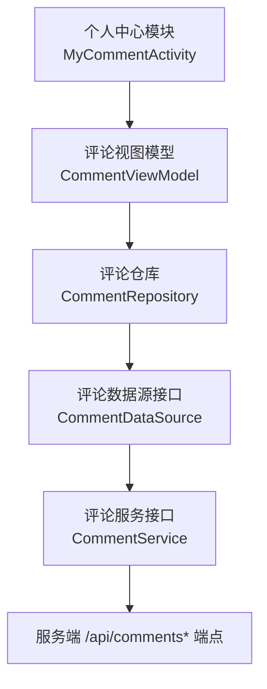
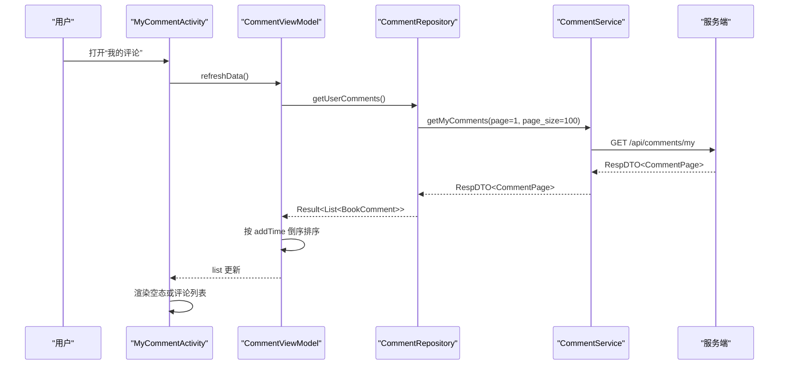
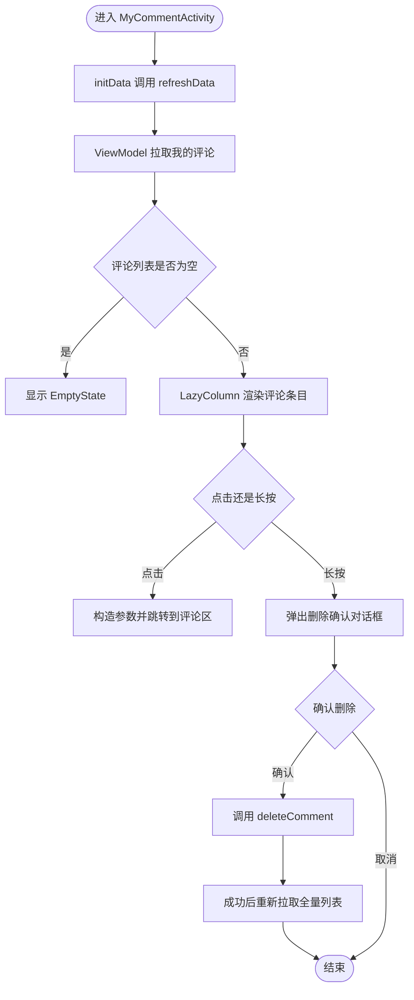
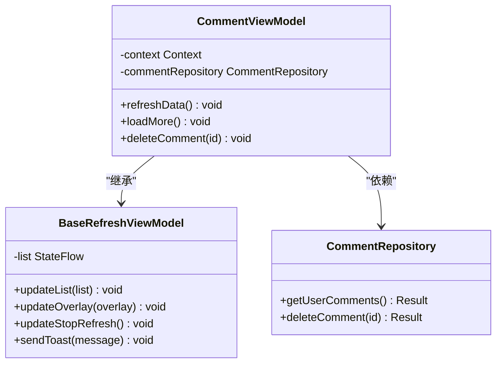
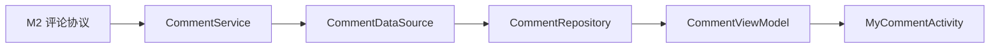

# 评论管理功能

<cite>
**本文引用的文件**   
- [MyCommentActivity.kt](file://module_me/src/main/java/com/ebook/me/view/MyCommentActivity.kt)
- [CommentViewModel.kt](file://module_me/src/main/java/com/ebook/me/mvvm/viewmodel/CommentViewModel.kt)
- [CommentRepository.kt](file://lib_book_common/src/main/java/com/ebook/common/repository/CommentRepository.kt)
- [CommentService.kt](file://lib_ebook_api/src/main/java/com/ebook/api/service/comment/CommentService.kt)
- [CommentDataSource.kt](file://lib_ebook_api/src/main/java/com/ebook/api/service/comment/CommentDataSource.kt)
- [M2 评论标识接口协议.md](file://docs/superpowers/specs/2026-09-05-m2-comment-api-contract.md)
</cite>

## 目录
1. [简介](#简介)
2. [项目结构中的评论相关位置](#项目结构中的评论相关位置)
3. [核心组件](#核心组件)
4. [架构总览](#架构总览)
5. [详细组件分析](#详细组件分析)
6. [依赖关系分析](#依赖关系分析)
7. [性能与分页特性](#性能与分页特性)
8. [错误处理与重试机制](#错误处理与重试机制)
9. [故障排查指南](#故障排查指南)
10. [结论](#结论)

## 简介
本文件围绕“我的评论”页面实现，说明 MyCommentActivity 的个人评论列表展示与管理能力，包括评论加载、排序、删除、点击跳转评论区等交互；并梳理 CommentViewModel 的异步数据加载流程、覆盖层状态管理、删除后刷新策略，以及 CommentRepository 对后端评论接口的封装。文档还解释评论 UI 渲染逻辑：书名、章节名、评论内容摘要、发表时间的展示方式，以及空态与列表态的互斥切换。

## 项目结构中的评论相关位置
评论管理涉及四个主要层次：
- 表现层：`MyCommentActivity`，负责路由、标题、列表预览、条目点击和删除确认。
- ViewModel 层：`CommentViewModel`，负责拉取评论、排序、删除和覆盖层状态。
- 仓库层：`CommentRepository`，封装评论 API 调用、领域模型映射与分页语义。
- 网络接口层：`CommentService` 与 `CommentDataSource`，定义 REST 端点与真实/Mock 数据源抽象。

```mermaid
graph TB
    A["个人中心模块<br/>MyCommentActivity"] --> B["评论视图模型<br/>CommentViewModel"]
    B --> C["评论仓库<br/>CommentRepository"]
    C --> D["评论数据源接口<br/>CommentDataSource"]
    D --> E["评论服务接口<br/>CommentService"]
    E --> F["服务端 /api/comments* 端点"]
```

图表来源
- [MyCommentActivity.kt:1-120](file://module_me/src/main/java/com/ebook/me/view/MyCommentActivity.kt#L1-L120)
- [CommentViewModel.kt:1-71](file://module_me/src/main/java/com/ebook/me/mvvm/viewmodel/CommentViewModel.kt#L1-L71)
- [CommentRepository.kt:1-114](file://lib_book_common/src/main/java/com/ebook/common/repository/CommentRepository.kt#L1-L114)
- [CommentService.kt:1-62](file://lib_ebook_api/src/main/java/com/ebook/api/service/comment/CommentService.kt#L1-L62)
- [CommentDataSource.kt:1-34](file://lib_ebook_api/src/main/java/com/ebook/api/service/comment/CommentDataSource.kt#L1-L34)

章节来源
- [MyCommentActivity.kt:1-120](file://module_me/src/main/java/com/ebook/me/view/MyCommentActivity.kt#L1-L120)
- [CommentViewModel.kt:1-71](file://module_me/src/main/java/com/ebook/me/mvvm/viewmodel/CommentViewModel.kt#L1-L71)

## 核心组件
- MyCommentActivity：个人评论页入口，使用 Compose 渲染评论列表或空态，提供跳转到书籍评论区的能力，并通过长按触发删除确认。
- CommentViewModel：继承通用刷新型 ViewModel，承担首屏加载、排序、失败覆盖层设置、删除操作及删除后的全量刷新。
- CommentRepository：统一评论请求入口，负责将 API 响应映射为领域对象，并提供“我的评论”一次性大页拉取。
- CommentService：Retrofit 接口，声明评论创建、删除、我的评论、按键查询和迁移端点。
- CommentDataSource：评论数据源抽象，便于真实网络实现与测试替换。

章节来源
- [MyCommentActivity.kt:1-200](file://module_me/src/main/java/com/ebook/me/view/MyCommentActivity.kt#L1-L200)
- [CommentViewModel.kt:1-71](file://module_me/src/main/java/com/ebook/me/mvvm/viewmodel/CommentViewModel.kt#L1-L71)
- [CommentRepository.kt:1-114](file://lib_book_common/src/main/java/com/ebook/common/repository/CommentRepository.kt#L1-L114)
- [CommentService.kt:1-62](file://lib_ebook_api/src/main/java/com/ebook/api/service/comment/CommentService.kt#L1-L62)
- [CommentDataSource.kt:1-34](file://lib_ebook_api/src/main/java/com/ebook/api/service/comment/CommentDataSource.kt#L1-L34)

## 架构总览
评论管理采用 MVVM + Repository 分层：
- Activity 只持有 ViewModel 引用，订阅评论列表状态，不直接访问网络。
- ViewModel 通过 Repository 发起异步请求，并将结果转为领域评论列表。
- Repository 通过 DataSource/Service 访问服务端，完成 DTO 到领域模型的转换。
- 业务规则（如按时间倒序）在 ViewModel 中收敛，避免 UI 层分散逻辑。

```mermaid
sequenceDiagram
    participant U as "用户"
    participant A as "MyCommentActivity"
    participant VM as "CommentViewModel"
    participant R as "CommentRepository"
    participant S as "CommentService"
    participant F as "服务端"

    U->>A: 打开“我的评论”
    A->>VM: refreshData()
    VM->>R: getUserComments()
    R->>S: getMyComments(page=1, page_size=100)
    S->>F: GET /api/comments/my
    F-->>S: RespDTO<CommentPage>
    S-->>R: RespDTO<CommentPage>
    R-->>VM: Result<List<BookComment>>
    VM->>VM: 按 addTime 倒序排序
    VM-->>A: list 更新
    A->>A: 渲染空态或评论列表
```

图表来源
- [MyCommentActivity.kt:24-52](file://module_me/src/main/java/com/ebook/me/view/MyCommentActivity.kt#L24-L52)
- [CommentViewModel.kt:24-54](file://module_me/src/main/java/com/ebook/me/mvvm/viewmodel/CommentViewModel.kt#L24-L54)
- [CommentRepository.kt:39-47](file://lib_book_common/src/main/java/com/ebook/common/repository/CommentRepository.kt#L39-L47)
- [CommentService.kt:37-42](file://lib_ebook_api/src/main/java/com/ebook/api/service/comment/CommentService.kt#L37-L42)

## 详细组件分析

### MyCommentActivity：个人评论列表与交互
- 作为 BaseMvvmActivity 的子类，注入 CommentViewModel。
- onCreate 中设置页面标题。
- initData 调用 viewModel.refreshData() 触发首次加载。
- PageContent 订阅 viewModel.list 的 Compose State，根据是否为空显示 EmptyState 或 LazyColumn 列表。
- 点击评论项时，构造 RouteArgs 携带 commentKey、chapterUrl、chapterName、bookName，跳转到书籍评论区。
- 长按评论项弹出 AlertDialog，确认后调用 viewModel.deleteComment(comment.id)，并在成功回调后关闭对话框。
- 列表项 CommentItem 由共享卡片组件承载，展示：
  - 书名（单行省略）。
  - 发表时间（经 CommentTime.displayText 格式化）。
  - 章节名以 InfoChip 显示，为空时整块省略。
  - 评论内容摘要最多三行，超出省略。

```mermaid
flowchart TD
    Start(["进入 MyCommentActivity"]) --> Init["initData 调用 refreshData"]
    Init --> Load["ViewModel 拉取我的评论"]
    Load --> Render{"评论列表是否为空"}
    Render -->|是| Empty["显示 EmptyState"]
    Render -->|否| List["LazyColumn 渲染评论条目"]
    List --> Click{"点击还是长按"}
    Click -->|点击| Navigate["构造参数并跳转到评论区"]
    Click -->|长按| DeleteConfirm["弹出删除确认对话框"]
    DeleteConfirm --> Confirm{"确认删除"}
    Confirm -->|确认| CallDelete["调用 deleteComment"]
    CallDelete --> Refresh["成功后重新拉取全量列表"]
    Refresh --> End(["结束"])
    Confirm -->|取消| End
```

图表来源
- [MyCommentActivity.kt:24-52](file://module_me/src/main/java/com/ebook/me/view/MyCommentActivity.kt#L24-L52)
- [MyCommentActivity.kt:54-120](file://module_me/src/main/java/com/ebook/me/view/MyCommentActivity.kt#L54-L120)
- [MyCommentActivity.kt:201-276](file://module_me/src/main/java/com/ebook/me/view/MyCommentActivity.kt#L201-L276)

章节来源
- [MyCommentActivity.kt:1-120](file://module_me/src/main/java/com/ebook/me/view/MyCommentActivity.kt#L1-L120)
- [MyCommentActivity.kt:201-276](file://module_me/src/main/java/com/ebook/me/view/MyCommentActivity.kt#L201-L276)

### CommentViewModel：评论数据管理与异步请求
- 继承 BaseRefreshViewModel，维护评论列表和覆盖层状态。
- refreshData：
  - 设置 Overlay.Loading。
  - 调用 CommentRepository.getUserComments。
  - 成功分支：对返回评论按 CommentTime.sortMillis 降序排序，更新列表；若为空则设置 Overlay.NoData，否则 Overlay.None；停止刷新指示。
  - 失败分支：通过 reportFailure 判断是否静默；若未静默且当前列表为空，设置 Overlay.NoData，否则保持现有列表；停止刷新指示。
- loadMore：空实现，因为“我的评论”无分页。
- deleteComment：
  - 调用 CommentRepository.deleteComment。
  - 成功：提示删除成功，再次 refreshData 拉取全量。
  - 失败：reportFailure 处理，会话过期等异常由全局处理。

```mermaid
classDiagram
    class CommentViewModel {
        +refreshData() void
        +loadMore() void
        +deleteComment(id) void
        -context Context
        -commentRepository CommentRepository
    }
    class BaseRefreshViewModel {
        +updateList(list) void
        +updateOverlay(overlay) void
        +updateStopRefresh() void
        +sendToast(message) void
        -list StateFlow
    }
    class CommentRepository {
        +getUserComments() Result
        +deleteComment(id) Result
    }

    CommentViewModel --> BaseRefreshViewModel : "继承"
    CommentViewModel --> CommentRepository : "依赖"
```

图表来源
- [CommentViewModel.kt:1-71](file://module_me/src/main/java/com/ebook/me/mvvm/viewmodel/CommentViewModel.kt#L1-L71)
- [CommentRepository.kt:1-114](file://lib_book_common/src/main/java/com/ebook/common/repository/CommentRepository.kt#L1-L114)

章节来源
- [CommentViewModel.kt:1-71](file://module_me/src/main/java/com/ebook/me/mvvm/viewmodel/CommentViewModel.kt#L1-L71)

### CommentRepository：评论请求封装与领域映射
- deleteComment：包装 safeApiCall，忽略响应 data，仅以业务码 00000 为成功判据。
- getUserComments：一次性拉取“我的评论”，使用较大的 MY_COMMENTS_PAGE_SIZE，返回 List<BookComment>。
- getComments：按聚合键列表查询评论，空键列表直接返回空页，避免命中“全局最新”语义。
- queryCommentPage：统一分页封装，将 RespDTO<CommentPage> 映射为 BookCommentPage，hasMore 依据返回条数是否达到 requestedPageSize。
- mutateComment：统一评论变更操作封装，data 为空时抛出指定错误。

章节来源
- [CommentRepository.kt:1-114](file://lib_book_common/src/main/java/com/ebook/common/repository/CommentRepository.kt#L1-L114)

### CommentService 与 CommentDataSource：网络契约与数据源抽象
- CommentService：
  - POST /api/comments：创建评论。
  - DELETE /api/comments/{id}：删除评论。
  - GET /api/comments/my：获取当前用户的评论列表。
  - GET /api/comments：按 comment_keys 查询评论。
  - POST /api/comments/migrate：迁移用户旧键到新键。
- CommentDataSource：定义相同能力的接口，支持真实实现与 Mock 替换。

章节来源
- [CommentService.kt:1-62](file://lib_ebook_api/src/main/java/com/ebook/api/service/comment/CommentService.kt#L1-L62)
- [CommentDataSource.kt:1-34](file://lib_ebook_api/src/main/java/com/ebook/api/service/comment/CommentDataSource.kt#L1-L34)

### 评论 UI 渲染逻辑
- 空态：当评论列表为空时，使用 EmptyState 展示线性图标、标题和提示文案，外层 Box 补背景色以确保深色模式下可见。
- 列表态：使用 LazyColumn 渲染评论条目，间距与内边距遵循共享卡片组件规范。
- 评论条目：
  - 顶部一行显示书名与发表时间；书名单行省略，时间经 CommentTime.displayText 格式化。
  - 章节名以 InfoChip 呈现，为空时整个 chip 区块省略。
  - 内容摘要最多三行，超出省略。
  - 点击事件用于跳转到书籍评论区；长按事件用于弹出删除确认。
- 删除对话框：Material3 AlertDialog，确认按钮颜色使用主题 error，取消按钮正常样式。

章节来源
- [MyCommentActivity.kt:54-120](file://module_me/src/main/java/com/ebook/me/view/MyCommentActivity.kt#L54-L120)
- [MyCommentActivity.kt:201-276](file://module_me/src/main/java/com/ebook/me/view/MyCommentActivity.kt#L201-L276)

## 依赖关系分析
评论管理的依赖链自下而上：
- 服务端 REST 端点由 M2 协议定义。
- CommentService 用 Retrofit 注解描述端点。
- CommentDataSource 暴露数据源能力，便于替换。
- CommentRepository 聚合数据源调用、处理业务码、映射领域模型。
- CommentViewModel 组合 Repository 调用、排序、覆盖层状态和用户提示。
- MyCommentActivity 订阅 ViewModel 状态并处理用户交互。

```mermaid
graph LR
    Spec["M2 评论协议"] --> Service["CommentService"]
    Service --> DataSource["CommentDataSource"]
    DataSource --> Repo["CommentRepository"]
    Repo --> VM["CommentViewModel"]
    VM --> UI["MyCommentActivity"]
```

图表来源
- [M2 评论标识接口协议.md:1-120](file://docs/superpowers/specs/2026-09-05-m2-comment-api-contract.md#L1-L120)
- [CommentService.kt:1-62](file://lib_ebook_api/src/main/java/com/ebook/api/service/comment/CommentService.kt#L1-L62)
- [CommentDataSource.kt:1-34](file://lib_ebook_api/src/main/java/com/ebook/api/service/comment/CommentDataSource.kt#L1-L34)
- [CommentRepository.kt:1-114](file://lib_book_common/src/main/java/com/ebook/common/repository/CommentRepository.kt#L1-L114)
- [CommentViewModel.kt:1-71](file://module_me/src/main/java/com/ebook/me/mvvm/viewmodel/CommentViewModel.kt#L1-L71)
- [MyCommentActivity.kt:1-120](file://module_me/src/main/java/com/ebook/me/view/MyCommentActivity.kt#L1-L120)

章节来源
- [M2 评论标识接口协议.md:1-120](file://docs/superpowers/specs/2026-09-05-m2-comment-api-contract.md#L1-L120)
- [CommentService.kt:1-62](file://lib_ebook_api/src/main/java/com/ebook/api/service/comment/CommentService.kt#L1-L62)
- [CommentRepository.kt:1-114](file://lib_book_common/src/main/java/com/ebook/common/repository/CommentRepository.kt#L1-L114)
- [CommentViewModel.kt:1-71](file://module_me/src/main/java/com/ebook/me/mvvm/viewmodel/CommentViewModel.kt#L1-L71)
- [MyCommentActivity.kt:1-120](file://module_me/src/main/java/com/ebook/me/view/MyCommentActivity.kt#L1-L120)

## 性能与分页特性
- “我的评论”当前采用一次性大页拉取，MY_COMMENTS_PAGE_SIZE 设置为较大值，以避免客户端截断导致的悬崖体验；未来接入分页后会合并至通用 PAGE_SIZE。
- 评论条目较轻，单次请求载荷较小，首屏等待可接受。
- 列表排序在 ViewModel 中进行，使用 CommentTime.sortMillis 保证时间口径一致。
- 删除后重新拉取全量列表，服务端是唯一权威数据源，不在客户端拼接本地移除结果，减少一致性风险。

[本节为通用性能讨论，无需具体文件引用]

## 错误处理与重试机制
- 覆盖层状态：
  - 加载中：Overlay.Loading。
  - 成功且有数据：Overlay.None。
  - 成功但无数据：Overlay.NoData。
  - 失败：若未静默且列表为空，显示 Overlay.NoData；已有数据时保持列表，不覆盖为 NoData。
- 报告失败：
  - reportFailure 用于区分会话过期等需要静默处理的异常与其他异常。
  - 会话过期通常由全局逻辑提示并处理，不再重复弹窗。
- 删除失败：
  - 通过 reportFailure 上报，会话过期走全局处理，其他错误可结合 Toast 或日志提示。
- 重试机制：
  - 代码未实现自动重试；用户可通过重新进入页面或手动刷新触发 refreshData。
  - 建议在需要时扩展 BaseRefreshViewModel 或上层 UI 提供重试按钮。

章节来源
- [CommentViewModel.kt:24-54](file://module_me/src/main/java/com/ebook/me/mvvm/viewmodel/CommentViewModel.kt#L24-L54)
- [CommentViewModel.kt:60-71](file://module_me/src/main/java/com/ebook/me/mvvm/viewmodel/CommentViewModel.kt#L60-L71)

## 故障排查指南
- 列表始终为空：
  - 检查 CommentRepository.getUserComments 是否返回空列表。
  - 确认服务端 /api/comments/my 是否返回有效数据。
  - 观察 ViewModel 的覆盖层是否为 Overlay.NoData。
- 删除后列表未刷新：
  - 确认 deleteComment 成功分支调用了 refreshData。
  - 检查服务端删除端点返回的业务码是否为 00000。
- 点击评论未跳转：
  - 检查 RouteArgs 是否正确传入 commentKey、chapterUrl、chapterName、bookName。
  - 确认目标路由 CODE 配置正确。
- 时间显示为空：
  - CommentTime.displayText 对不可解析时间会返回空串，属于预期行为，避免脏值显示。

章节来源
- [MyCommentActivity.kt:54-120](file://module_me/src/main/java/com/ebook/me/view/MyCommentActivity.kt#L54-L120)
- [CommentViewModel.kt:24-71](file://module_me/src/main/java/com/ebook/me/mvvm/viewmodel/CommentViewModel.kt#L24-L71)
- [CommentRepository.kt:39-47](file://lib_book_common/src/main/java/com/ebook/common/repository/CommentRepository.kt#L39-L47)
- [CommentService.kt:37-42](file://lib_ebook_api/src/main/java/com/ebook/api/service/comment/CommentService.kt#L37-L42)

## 结论
“我的评论”功能通过清晰的分层架构实现了个人评论的加载、展示和管理。MyCommentActivity 负责交互与渲染，CommentViewModel 负责数据流与状态，CommentRepository 统一网络与领域映射，CommentService/CommentDataSource 对接服务端契约。当前“我的评论”采用一次性大页拉取并按时间倒序展示，删除后重新拉取以保证数据一致性。错误处理通过覆盖层和 reportFailure 控制用户体验，暂未内置自动重试，可在需要时扩展。整体设计简洁、职责明确，适合后续接入分页与更多评论管理能力。