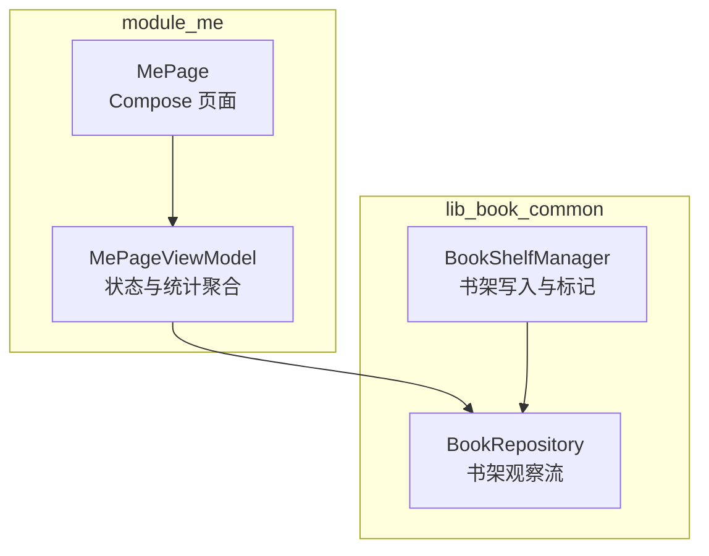
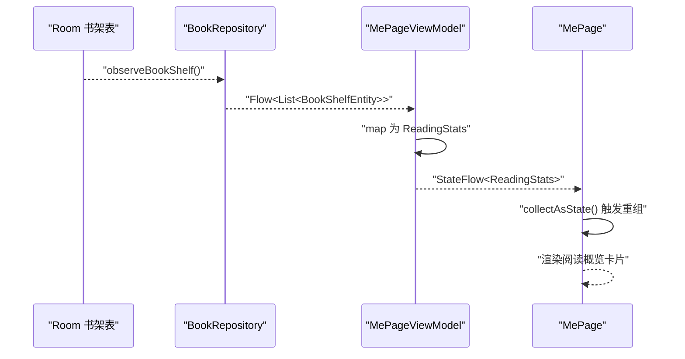
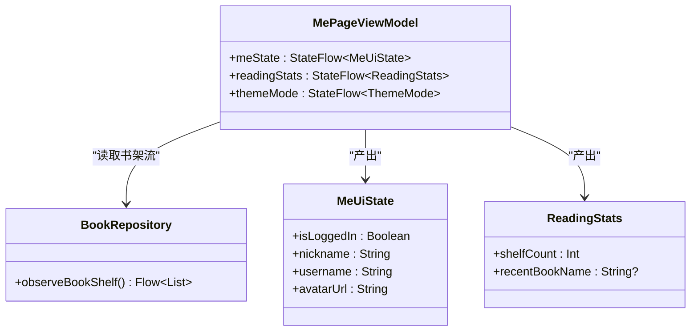
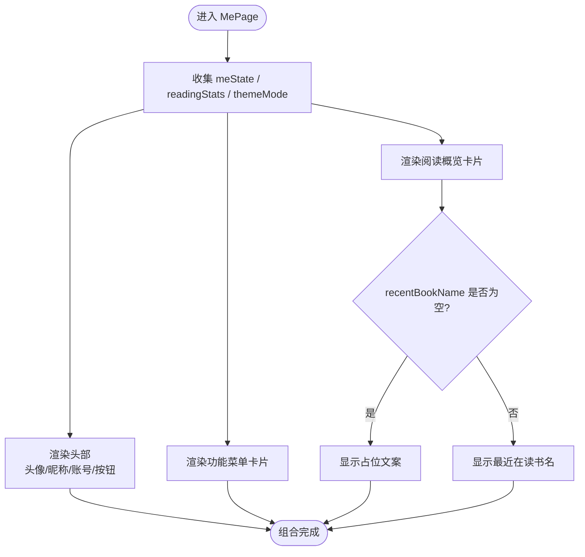
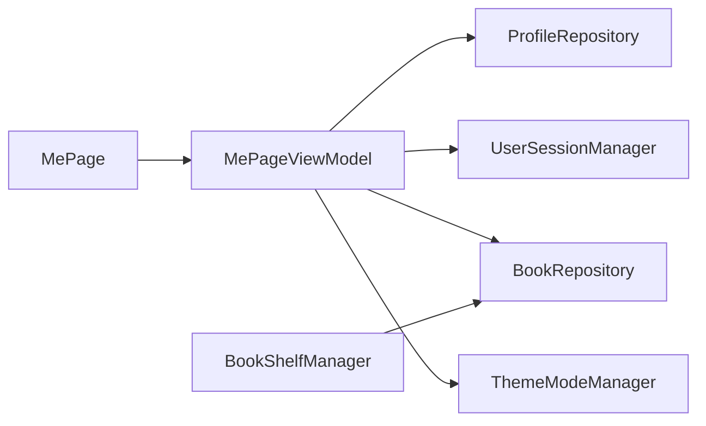

# 阅读统计功能

<cite>
**本文引用的文件**   
- [MePage.kt](file://module_me/src/main/java/com/ebook/me/page/MePage.kt)
- [MePageViewModel.kt](file://module_me/src/main/java/com/ebook/me/mvvm/viewmodel/MePageViewModel.kt)
- [BookRepository.kt](file://lib_book_common/src/main/java/com/ebook/common/repository/BookRepository.kt)
- [BookShelfManager.kt](file://lib_book_common/src/main/java/com/ebook/common/manager/BookShelfManager.kt)
</cite>

## 目录
1. [简介](#简介)
2. [项目结构](#项目结构)
3. [核心组件](#核心组件)
4. [架构总览](#架构总览)
5. [详细组件分析](#详细组件分析)
6. [依赖关系分析](#依赖关系分析)
7. [性能与缓存策略](#性能与缓存策略)
8. [故障排查指南](#故障排查指南)
9. [结论](#结论)

## 简介
本文面向“我的”页面中的阅读统计功能，聚焦以下目标：
- 阅读时长统计、书籍收藏数量、阅读历史等指标在本实现中的实际计算方式。
- MePageViewModel 如何管理 UI 状态与阅读统计数据。
- 如何通过 BookRepository 的书架观察流获取本地书架数据并进行统计分析。
- MePage Compose 页面的布局与渲染逻辑，包括统计卡片设计与空态处理。
- 统计数据更新的生命周期与缓存策略，特别是 StateFlow 的订阅行为。

需要特别说明的是：当前仓库中“阅读统计”并非仅指阅读时长，而是以“我的书架藏书数 + 最近在读书名”为核心的阅读概览。阅读时长统计在当前代码路径中未出现；若未来扩展，应沿用本 ViewModel 的状态流模式。

## 项目结构
阅读统计功能横跨两个模块：
- module_me：UI 层（Compose）与 ViewModel 层，负责展示和聚合状态。
- lib_book_common：领域数据层，提供书架数据源与统一操作入口。

**图示来源**
- [MePage.kt:25-66](file://module_me/src/main/java/com/ebook/me/page/MePage.kt#L25-L66)
- [MePageViewModel.kt:55-119](file://module_me/src/main/java/com/ebook/me/mvvm/viewmodel/MePageViewModel.kt#L55-L119)
- [BookRepository.kt:90-108](file://lib_book_common/src/main/java/com/ebook/common/repository/BookRepository.kt#L90-L108)
- [BookShelfManager.kt:12-74](file://lib_book_common/src/main/java/com/ebook/common/manager/BookShelfManager.kt#L12-L74)

**章节来源**
- [MePage.kt:25-66](file://module_me/src/main/java/com/ebook/me/page/MePage.kt#L25-L66)
- [MePageViewModel.kt:55-119](file://module_me/src/main/java/com/ebook/me/mvvm/viewmodel/MePageViewModel.kt#L55-L119)
- [BookRepository.kt:90-108](file://lib_book_common/src/main/java/com/ebook/common/repository/BookRepository.kt#L90-L108)
- [BookShelfManager.kt:12-74](file://lib_book_common/src/main/java/com/ebook/common/manager/BookShelfManager.kt#L12-L74)

## 核心组件
- MeUiState：登录态与用户资料聚合后的 UI 状态，作为单一数据源供页面收集。
- ReadingStats：阅读概览统计，包含书架藏书数与最近在读书名。
- MePageViewModel：合并登录态、个人资料、主题模式与书架数据，输出可被 Compose 收集的 StateFlow。
- BookRepository.observeBookShelf：基于 Room 的书架观察流，返回按最后阅读时间倒序的书架列表。
- MePage Composable：将 MeUiState 与 ReadingStats 渲染为头部信息、阅读概览卡片与功能菜单卡片。

**章节来源**
- [MePageViewModel.kt:19-53](file://module_me/src/main/java/com/ebook/me/mvvm/viewmodel/MePageViewModel.kt#L19-L53)
- [MePageViewModel.kt:55-119](file://module_me/src/main/java/com/ebook/me/mvvm/viewmodel/MePageViewModel.kt#L55-L119)
- [MePage.kt:158-200](file://module_me/src/main/java/com/ebook/me/page/MePage.kt#L158-L200)
- [BookRepository.kt:90-108](file://lib_book_common/src/main/java/com/ebook/common/repository/BookRepository.kt#L90-L108)

## 架构总览
阅读统计的数据流向如下：Room 书架表通过 BookRepository 暴露 Flow，ViewModel 将其映射为 ReadingStats，Compose 页面通过 collectAsState 订阅并渲染。

**图示来源**
- [BookRepository.kt:90-108](file://lib_book_common/src/main/java/com/ebook/common/repository/BookRepository.kt#L90-L108)
- [MePageViewModel.kt:90-108](file://module_me/src/main/java/com/ebook/me/mvvm/viewmodel/MePageViewModel.kt#L90-L108)
- [MePage.kt:25-66](file://module_me/src/main/java/com/ebook/me/page/MePage.kt#L25-L66)

## 详细组件分析

### MePageViewModel：状态管理与统计计算
MePageViewModel 是阅读统计的核心控制器，职责包括：
- 合并登录态与个人资料，生成 MeUiState。
- 从 BookRepository 获取书架 Flow，映射为 ReadingStats。
- 转发 ThemeMode，供头部渐变深浅色适配。

关键设计点：
- meState 使用 combine 合并多个 SourceFlow，避免在 Composable 中散落多条 collectAsState。
- readingStats 对书架列表进行 map 转换：shelfCount 取集合大小，recentBookName 取 firstOrNull 的书名。
- 所有 StateFlow 使用 stateIn 配合 WhileSubscribed(5s)，保证切走 Tab 时停止合并，切回立即用缓存值刷新。

**图示来源**
- [MePageViewModel.kt:19-53](file://module_me/src/main/java/com/ebook/me/mvvm/viewmodel/MePageViewModel.kt#L19-L53)
- [MePageViewModel.kt:55-119](file://module_me/src/main/java/com/ebook/me/mvvm/viewmodel/MePageViewModel.kt#L55-L119)
- [BookRepository.kt:90-108](file://lib_book_common/src/main/java/com/ebook/common/repository/BookRepository.kt#L90-L108)

**章节来源**
- [MePageViewModel.kt:19-53](file://module_me/src/main/java/com/ebook/me/mvvm/viewmodel/MePageViewModel.kt#L19-L53)
- [MePageViewModel.kt:55-119](file://module_me/src/main/java/com/ebook/me/mvvm/viewmodel/MePageViewModel.kt#L55-L119)

### BookRepository.observeBookShelf：书架数据源
observeBookShelf 暴露 Room 书架的响应式数据流，其实现要点：
- 查询全量书架并关联书籍信息。
- 过滤 info 为 null 的孤立记录，确保下游拿到非空的 bookInfo。
- 返回 Flow，由上层按需 map 为业务统计对象。

注意：getAllBooksWithDetails 会清理孤立记录并对章节排序，但 observeBookShelf 只做轻量填充，不执行写副作用，适合高频失效重发。

**章节来源**
- [BookRepository.kt:90-108](file://lib_book_common/src/main/java/com/ebook/common/repository/BookRepository.kt#L90-L108)

### BookShelfManager：书架写入与标记（辅助说明）
BookShelfManager 主要负责：
- 加载书架列表用于搜索结果比对。
- 为搜索结果标记是否已加入书架。
- 从搜索结果加入书架，解析书源、拉取目录、写入书架。

该管理器并不直接参与阅读统计的计算，但它是书架数据的写入入口之一。统计所依赖的“书架总数”与“最近在读”均来源于 Room 最终落库后的书架表。

**章节来源**
- [BookShelfManager.kt:12-74](file://lib_book_common/src/main/java/com/ebook/common/manager/BookShelfManager.kt#L12-L74)

### MePage Compose：布局与渲染逻辑
MePage 将三个状态注入 MainMeScreen：
- uiState：头像、昵称、账号名、登录态。
- readingStats：书架藏书数与最近在读书名。
- themeMode：浅色/深色/跟随系统，驱动头部渐变配色。

主要子组件：
- MeHeader：渐变沉浸式头部，含头像、昵称、账号副标题与右侧按钮（编辑资料或立即登录）。
- ReadingStatsCard：阅读概览卡片，左列显示藏书数，右列显示最近在读书名；书架为空时显示占位文本。
- StatsColumn：统计列，支持数值模式与书名模式两种排版。
- MeMenuCard：功能菜单，包含评论与设置项。

空态处理：
- recentBookName 为 null 时，UI 使用本地字符串资源作为占位。
- 头像 URL 为空时，Avatar 组件兜底默认头像。
- 未登录时，昵称与账号行切换为占位文案，右侧按钮改为“立即登录”。

动画与交互：
- 统计卡片本身无显式动画；变化通过 StateFlow 重组触发界面更新。
- 渐变头部根据主题深浅切换 primary/tertiary 或容器色，并动态调整状态栏图标深浅。

**图示来源**
- [MePage.kt:25-66](file://module_me/src/main/java/com/ebook/me/page/MePage.kt#L25-L66)
- [MePage.kt:158-200](file://module_me/src/main/java/com/ebook/me/page/MePage.kt#L158-L200)
- [MePage.kt:201-300](file://module_me/src/main/java/com/ebook/me/page/MePage.kt#L201-L300)
- [MePage.kt:301-503](file://module_me/src/main/java/com/ebook/me/page/MePage.kt#L301-L503)

**章节来源**
- [MePage.kt:25-66](file://module_me/src/main/java/com/ebook/me/page/MePage.kt#L25-L66)
- [MePage.kt:158-200](file://module_me/src/main/java/com/ebook/me/page/MePage.kt#L158-L200)
- [MePage.kt:201-300](file://module_me/src/main/java/com/ebook/me/page/MePage.kt#L201-L300)
- [MePage.kt:301-503](file://module_me/src/main/java/com/ebook/me/page/MePage.kt#L301-L503)

## 依赖关系分析
- MePage 依赖 MePageViewModel 提供的三个 StateFlow。
- MePageViewModel 依赖 ProfileRepository、UserSessionManager、BookRepository、ThemeModeManager。
- BookRepository 封装 Room DAO 与数据组装逻辑。
- BookShelfManager 与 BookRepository 协作完成书架写入与标记，但不直接参与统计计算。

**图示来源**
- [MePage.kt:25-66](file://module_me/src/main/java/com/ebook/me/page/MePage.kt#L25-L66)
- [MePageViewModel.kt:55-119](file://module_me/src/main/java/com/ebook/me/mvvm/viewmodel/MePageViewModel.kt#L55-L119)
- [BookShelfManager.kt:12-74](file://lib_book_common/src/main/java/com/ebook/common/manager/BookShelfManager.kt#L12-L74)

**章节来源**
- [MePage.kt:25-66](file://module_me/src/main/java/com/ebook/me/page/MePage.kt#L25-L66)
- [MePageViewModel.kt:55-119](file://module_me/src/main/java/com/ebook/me/mvvm/viewmodel/MePageViewModel.kt#L55-L119)
- [BookShelfManager.kt:12-74](file://lib_book_common/src/main/java/com/ebook/common/manager/BookShelfManager.kt#L12-L74)

## 性能与缓存策略
- 使用 StateFlow.stateIn 配合 SharingStarted.WhileSubscribed(5_000)：当页面不可见或切走 Tab 时，停止合并上游 Flow；重新订阅时使用缓存值立即刷新，兼顾省电与即时性。
- observeBookShelf 返回轻量 Flow，不做写副作用，避免频繁失效导致的额外数据库写入。
- UI 层通过 collectAsState 自动重组，无需手动缓存中间结果。
- 主题模式通过单例 ThemeModeManager 转发，避免多份状态不一致。

潜在优化建议：
- 若未来引入阅读时长统计，应在 ViewModel 侧做增量更新，避免每次完整重算。
- 对于极大数据集，可在 Repository 层考虑分页或只读必要字段，减少内存占用。

[本节为通用性能指导，不直接分析具体文件]

## 故障排查指南
常见问题与定位思路：
- 统计卡片不更新：检查 BookRepository.observeBookShelf 是否正常发出新值；确认 ViewModel 的 readingStats 是否正确 map。
- 最近在读显示为空：确认书架是否为空，或最近一条记录的 bookInfo.name 是否为空。
- 头像显示异常：检查 avatarUrl 是否为空，Avatar 组件会兜底默认头像。
- 主题渐变颜色异常：确认 themeMode 来源是否为 ThemeModeManager，避免使用可空伴生对象单例造成降级。

**章节来源**
- [MePageViewModel.kt:55-119](file://module_me/src/main/java/com/ebook/me/mvvm/viewmodel/MePageViewModel.kt#L55-L119)
- [MePage.kt:158-200](file://module_me/src/main/java/com/ebook/me/page/MePage.kt#L158-L200)
- [BookRepository.kt:90-108](file://lib_book_common/src/main/java/com/ebook/common/repository/BookRepository.kt#L90-L108)

## 结论
当前阅读统计功能以“书架藏书数 + 最近在读书名”为核心指标，通过 BookRepository 的响应式书架流在 ViewModel 层聚合为 ReadingStats，并在 MePage Compose 页面中稳定渲染。该实现：
- 明确区分了登录态/个人资料与阅读统计两类数据源。
- 使用 StateFlow 与 WhileSubscribed 实现了生命周期安全的缓存与刷新。
- 在 UI 层对空态做了降级处理，保证布局稳定。
- 未实现阅读时长统计；如需扩展，应沿用现有 ViewModel 状态流模式，并在 Repository 层提供对应数据源。