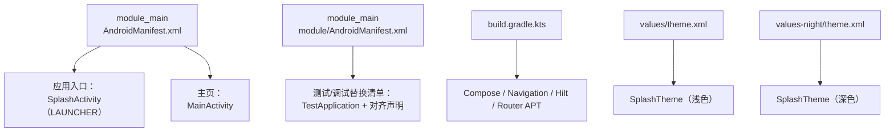
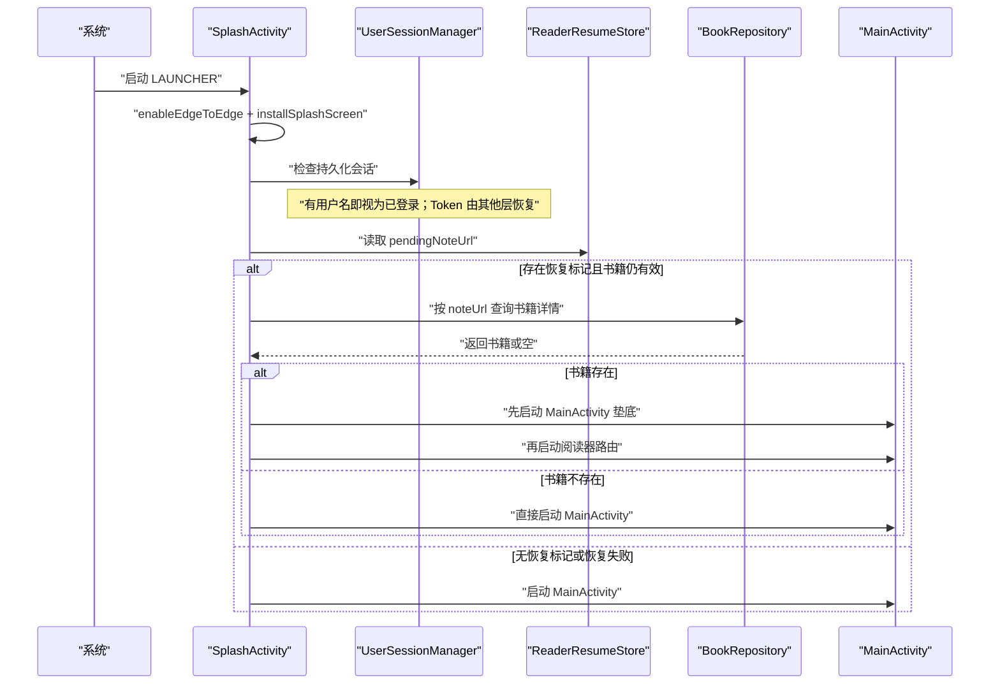
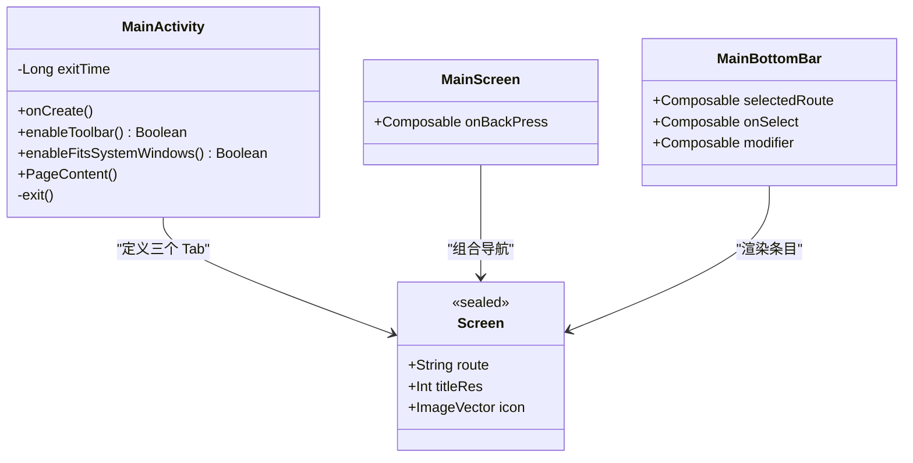
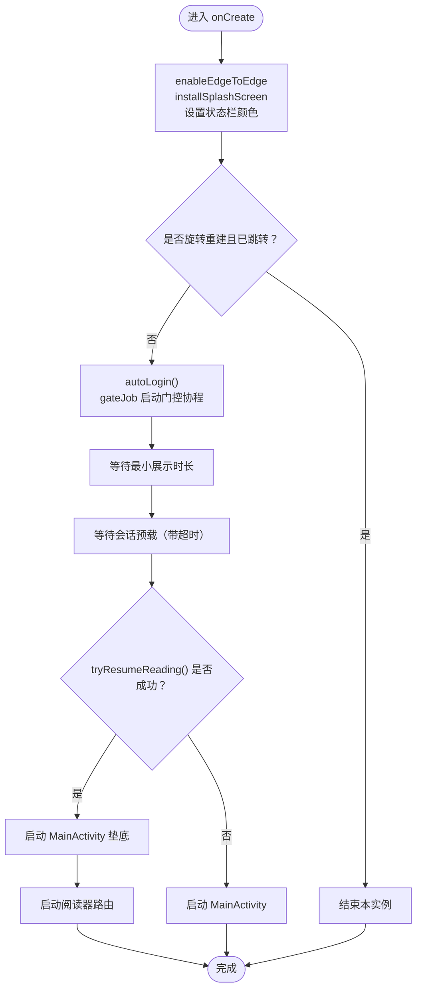
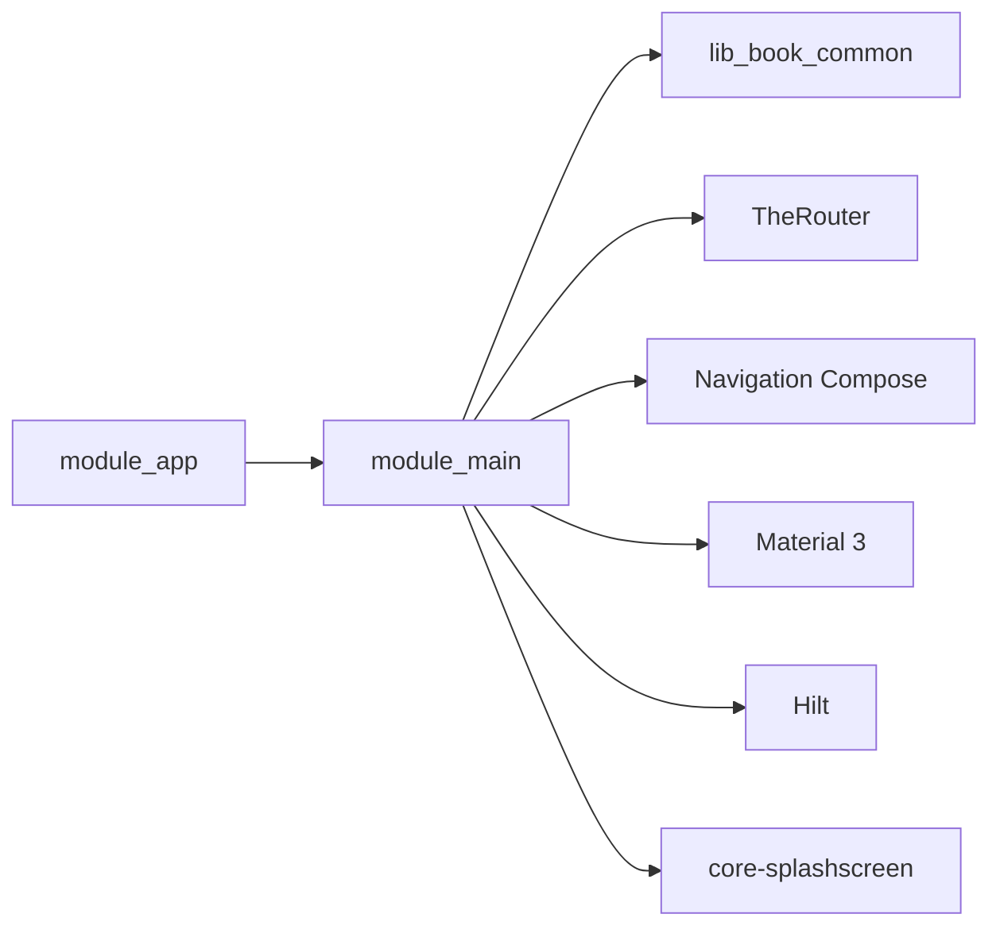

# 主界面模块 (module_main)

<cite>
**本文引用的文件**   
- [MainActivity.kt](file://module_main/src/main/java/com/ebook/main/MainActivity.kt)
- [SplashActivity.kt](file://module_main/src/main/java/com/ebook/main/SplashActivity.kt)
- [AndroidManifest.xml（模块清单）](file://module_main/src/main/module/AndroidManifest.xml)
- [AndroidManifest.xml（应用清单）](file://module_main/src/main/AndroidManifest.xml)
- [build.gradle.kts](file://module_main/build.gradle.kts)
- [theme.xml（浅色）](file://module_main/src/main/res/values/theme.xml)
- [theme.xml（深色）](file://module_main/src/main/res/values-night/theme.xml)
</cite>

## 目录
1. [简介](#简介)
2. [项目结构](#项目结构)
3. [核心组件](#核心组件)
4. [架构总览](#架构总览)
5. [详细组件分析](#详细组件分析)
6. [依赖关系分析](#依赖关系分析)
7. [性能与启动优化](#性能与启动优化)
8. [主题与 Material Design 3 实践](#主题与-material-design-3-实践)
9. [路由与会话处理最佳实践](#路由与会话处理最佳实践)
10. [故障排查](#故障排查)
11. [结论](#结论)

## 简介
module_main 是应用的“外壳”模块，负责：
- 定义应用入口 SplashActivity，承担启动期初始化、自动登录恢复会话与条件跳转。
- 提供主页 MainActivity，作为三个 Tab（书架、书城、我的）的宿主容器。
- 使用 Jetpack Compose + Navigation Compose 实现底部导航栏与页面路由。
- 集成 TheRouter 注解路由，配合各模块 routeMap.json 完成跨模块跳转。
- 通过 Theme.Common 接入 lib_common 的主题装配点，支持浅色与深色模式切换。

该模块本身不承载具体业务内容，而是把 module_book、module_find、module_me 等能力聚合为可导航的应用壳。

## 项目结构
module_main 采用典型 Android 模块布局，同时区分“独立运行态”和“集成库态”两套清单：

**图表来源**
- [AndroidManifest.xml（应用清单）:1-27](file://module_main/src/main/AndroidManifest.xml#L1-L27)
- [AndroidManifest.xml（模块清单）:1-28](file://module_main/src/main/module/AndroidManifest.xml#L1-L28)
- [build.gradle.kts:1-75](file://module_main/build.gradle.kts#L1-L75)
- [theme.xml（浅色）:1-14](file://module_main/src/main/res/values/theme.xml#L1-L14)
- [theme.xml（深色）:1-12](file://module_main/src/main/res/values-night/theme.xml#L1-L12)

**章节来源**
- [AndroidManifest.xml（应用清单）:1-27](file://module_main/src/main/AndroidManifest.xml#L1-L27)
- [AndroidManifest.xml（模块清单）:1-28](file://module_main/src/main/module/AndroidManifest.xml#L1-L28)
- [build.gradle.kts:1-75](file://module_main/build.gradle.kts#L1-L75)

## 核心组件
- **SplashActivity**：启动页，负责展示欢迎图、最小展示时长、自动登录恢复会话、异常退出时尝试恢复阅读界面，最终跳转到 MainActivity。
- **MainActivity**：主页容器，使用 Compose Scaffold + NavigationHost + BottomNavigationBar 管理三个 Tab。
- **Screen 路由枚举**：Bookshelf、Bookstore、Me，作为底部导航的数据源。
- **MainBottomBar**：无状态底部导航组件，仅渲染选中态与点击回调。
- **MainScreen**：主页骨架，持有 NavHost 与回退栈，统一管理 Tab 切换逻辑。

这些组件共同构成“启动 → 会话恢复 → 主页 → 子页面”的主路径。

**章节来源**
- [MainActivity.kt:1-290](file://module_main/src/main/java/com/ebook/main/MainActivity.kt#L1-L290)
- [SplashActivity.kt:1-339](file://module_main/src/main/java/com/ebook/main/SplashActivity.kt#L1-L339)

## 架构总览
从启动到主页的整体流程如下：

**图表来源**
- [SplashActivity.kt:1-339](file://module_main/src/main/java/com/ebook/main/SplashActivity.kt#L1-L339)
- [AndroidManifest.xml（应用清单）:1-27](file://module_main/src/main/AndroidManifest.xml#L1-L27)

**章节来源**
- [SplashActivity.kt:1-339](file://module_main/src/main/java/com/ebook/main/SplashActivity.kt#L1-L339)

## 详细组件分析

### MainActivity：主页容器与底部导航
MainActivity 继承 Common 基类 BaseActivity，并关闭 Toolbar 与系统栏偏移，让每个 Tab 自行处理沉浸式顶栏。它订阅 SessionEventBus 的会话过期事件，统一执行“清会话 → 提示 → 跳转登录页”。

底部导航由 Screen 枚举驱动，MainBottomBar 是无状态 UI 组件，MainScreen 持有 NavHost 并计算当前选中路由。Tab 切换走唯一入口 switchTab，使用 popUpTo(start)、saveState、launchSingleTop、restoreState 保证回退栈状态一致。

**图表来源**
- [MainActivity.kt:1-290](file://module_main/src/main/java/com/ebook/main/MainActivity.kt#L1-L290)

关键行为说明：
- 双击退出：防止误触退出，间隔约两秒。
- 会话过期：收到 SessionExpired 后清理本地会话、Toast 提示、跳转登录页。
- 底部导航：选中态来自 NavHost 回退栈，避免本地状态与回退栈不同步。
- 系统栏 insets：禁用基类默认 padding，交给 TopAppBar 与 NavigationBar 各自处理。

**章节来源**
- [MainActivity.kt:1-290](file://module_main/src/main/java/com/ebook/main/MainActivity.kt#L1-L290)

### SplashActivity：启动流程与条件跳转
SplashActivity 的职责比“只放一张图”更重：它是启动期会话恢复与阅读恢复的协调者。

主要步骤：
1. 设置 Edge-to-Edge 与沉浸式状态栏颜色。
2. 安装 SplashScreen，显示欢迎图。
3. 并行等待：
   - 最小展示时长。
   - 自动登录恢复会话（超时兜底）。
4. 优先尝试恢复阅读：
   - 读取 ReaderResumeStore.pendingNoteUrl。
   - 异步查库确认书籍仍存在。
   - 成功则先垫 MainActivity，再启动阅读器路由。
5. 否则启动 MainActivity。
6. 跳过按钮取消等待，但仍走恢复判定，保证两条入口落点一致。

**图表来源**
- [SplashActivity.kt:1-339](file://module_main/src/main/java/com/ebook/main/SplashActivity.kt#L1-L339)

需要注意的设计约束：
- 自动登录不是“必等登录接口”，而是检查本地会话；若已有用户信息则认为就绪。
- 恢复阅读必须校验书籍实体是否存在，否则清理残留标记。
- 恢复成功时 MainActivity 必须在任务栈中作为根，这样返回键回到书架而非退出应用。
- 跳过按钮不改变“是否恢复阅读”的判据，只影响“是否继续等待会话加载”。

**章节来源**
- [SplashActivity.kt:1-339](file://module_main/src/main/java/com/ebook/main/SplashActivity.kt#L1-L339)

### TheRouter 配置与 routeMap.json 规则
module_main 通过 Gradle 引入 router APT 与运行时依赖，并在源码中使用 @Route 注解声明 MainActivity 的路径：

- MainActivity 被标注为主页路由路径。
- 会话过期时通过 TheRouter.build(path).navigation() 跳转登录页。
- 阅读恢复时通过 TheRouter 启动阅读器路由，而不是直接依赖 Book 模块 Activity。

routeMap.json 由各模块 assets/therouter/routeMap.json 生成，用于在运行时注册路由表。module_main 自身贡献主页路由；module_login、module_book、module_find、module_me 也各自贡献路由。

路由约定建议：
- 路由路径集中在 KeyCode 常量中定义，避免硬编码字符串散落。
- 跨模块跳转一律走 TheRouter，禁止模块间直接 import 对方 Activity。
- 路由参数通过 RouteArgs 传递，避免 Intent 字段名不一致。
- 未注册路由应给出明确日志，避免静默失败。

**章节来源**
- [build.gradle.kts:60-75](file://module_main/build.gradle.kts#L60-L75)
- [MainActivity.kt:1-290](file://module_main/src/main/java/com/ebook/main/MainActivity.kt#L1-L290)
- [SplashActivity.kt:1-339](file://module_main/src/main/java/com/ebook/main/SplashActivity.kt#L1-L339)

### Material Design 3 主题与浅色深色模式
SplashTheme 在 values 与 values-night 下分别定义，背景色取自 lib_common 的颜色资源，postSplashScreenTheme 指向 Theme.Common。这意味着：
- 闪屏背景随系统主题变化。
- 闪屏结束后统一切换到应用主题装配点 AppTheme.Content。
- 应用内动态切换浅色/深色时，SplashActivity 的后续页面与主页保持一致。

MainActivity 本身不维护主题状态，主题由 BaseActivity 与 Theme.Common 装配；底部导航、顶栏、卡片、图标语义色均走 Material 3 语义，不需要为每个页面单独写主题。

**章节来源**
- [theme.xml（浅色）:1-14](file://module_main/src/main/res/values/theme.xml#L1-L14)
- [theme.xml（深色）:1-12](file://module_main/src/main/res/values-night/theme.xml#L1-L12)
- [SplashActivity.kt:1-339](file://module_main/src/main/java/com/ebook/main/SplashActivity.kt#L1-L339)

## 依赖关系分析
module_main 对外暴露两个 Activity，并通过依赖 lib_book_common 获取会话、路由参数、书籍仓库与通用 UI 工具。

耦合点：
- MainActivity 依赖 SessionEventBus 与 UserSessionManager，用于会话过期统一处置。
- SplashActivity 依赖 BookRepository 与 ReaderResumeStore，用于阅读恢复。
- 所有跨模块跳转依赖 TheRouter，避免循环依赖。

**图表来源**
- [build.gradle.kts:60-75](file://module_main/build.gradle.kts#L60-L75)
- [MainActivity.kt:1-290](file://module_main/src/main/java/com/ebook/main/MainActivity.kt#L1-L290)
- [SplashActivity.kt:1-339](file://module_main/src/main/java/com/ebook/main/SplashActivity.kt#L1-L339)

**章节来源**
- [build.gradle.kts:1-75](file://module_main/build.gradle.kts#L1-L75)

## 性能与启动优化
- 最小展示时长：避免闪屏一闪而过，提升品牌感知。
- 会话预载异步化：不阻塞 UI，超时后仍放行启动，防止弱网卡死。
- 阅读恢复优先：异常退出时直接回到阅读界面，减少二次加载。
- 防重复跳转：navigated 标志与 activityScope 控制，避免旋转重建导致重复启动 MainActivity。
- 底部导航状态收敛：选中态来自 NavHost 回退栈，避免本地状态与系统状态不一致导致的重建。
- 构建态混淆开关：独立 application 态启用 R8，library 态禁用，避免 AGP 双态下剥离依赖。

**章节来源**
- [SplashActivity.kt:1-339](file://module_main/src/main/java/com/ebook/main/SplashActivity.kt#L1-L339)
- [MainActivity.kt:1-290](file://module_main/src/main/java/com/ebook/main/MainActivity.kt#L1-L290)
- [build.gradle.kts:10-40](file://module_main/build.gradle.kts#L10-L40)

## 主题与 Material Design 3 实践
- 闪屏主题：SplashTheme 显式关闭 ActionBar，避免欢迎图顶部出现标题栏；背景色区分浅色/深色。
- 应用主题：postSplashScreenTheme 指向 Theme.Common，保证与应用整体主题一致。
- 沉浸式体验：SplashActivity 使用 enableEdgeToEdge 与状态栏颜色设置；MainActivity 关闭基类 insets 消费，交由各 Tab 的 TopAppBar 与 NavigationBar 处理。
- 语义色：图标与文案通过 Material 3 语义色区分选中/常态，无需自定义颜色。

扩展建议：
- 新增 Tab 时只需扩展 Screen 枚举并添加对应路由。
- 新增全局主题变量应在 Theme.Common 或公共 theme 文件中定义，避免在每个模块重复。
- 深色模式资源尽量复用 lib_common 的颜色与样式，保持全 App 一致。

**章节来源**
- [theme.xml（浅色）:1-14](file://module_main/src/main/res/values/theme.xml#L1-L14)
- [theme.xml（深色）:1-12](file://module_main/src/main/res/values-night/theme.xml#L1-L12)
- [MainActivity.kt:1-290](file://module_main/src/main/java/com/ebook/main/MainActivity.kt#L1-L290)
- [SplashActivity.kt:1-339](file://module_main/src/main/java/com/ebook/main/SplashActivity.kt#L1-L339)

## 路由与会话处理最佳实践
- 主页路由：MainActivity 使用 @Route 注解声明路径，避免硬编码字符串。
- 会话过期：由 MainActivity 集中订阅 SessionEventBus，统一清理会话并跳转登录页。
- 跨模块跳转：统一使用 TheRouter，避免模块间强依赖。
- 路由参数：使用 RouteArgs 传递结构化参数，避免 Intent 字段漂移。
- 回退栈：Tab 切换使用 saveState + restoreState，保证切回时保留页面状态。
- 启动页职责：只负责启动期准备与条件跳转，不把业务逻辑下沉到主页。

**章节来源**
- [MainActivity.kt:1-290](file://module_main/src/main/java/com/ebook/main/MainActivity.kt#L1-L290)
- [SplashActivity.kt:1-339](file://module_main/src/main/java/com/ebook/main/SplashActivity.kt#L1-L339)

## 故障排查
常见问题与定位思路：
- 闪屏后出现 ActionBar 标题栏：检查 SplashTheme 是否正确关闭 windowActionBar 与 windowNoTitle。
- 启动页白屏或卡住：检查自动登录超时与网络状态，确认 withTimeoutOrNull 是否放行。
- 异常退出后无法恢复阅读：检查 ReaderResumeStore.pendingNoteUrl 与 BookRepository.getBookWithDetails 返回值。
- 切换 Tab 后页面重置：检查 switchTab 是否同时包含 popUpTo、saveState、launchSingleTop、restoreState。
- 双击退出无效：检查 exitTime 时间差判断与 finish + exitProcess 调用顺序。
- 主题闪烁或深浅色不一致：确认 postSplashScreenTheme 指向 Theme.Common，且 AppTheme.Content 正确包裹 setContent。

**章节来源**
- [theme.xml（浅色）:1-14](file://module_main/src/main/res/values/theme.xml#L1-L14)
- [theme.xml（深色）:1-12](file://module_main/src/main/res/values-night/theme.xml#L1-L12)
- [MainActivity.kt:1-290](file://module_main/src/main/java/com/ebook/main/MainActivity.kt#L1-L290)
- [SplashActivity.kt:1-339](file://module_main/src/main/java/com/ebook/main/SplashActivity.kt#L1-L339)

## 结论
module_main 以轻量外壳的方式组织应用启动与主页导航：SplashActivity 承担启动期会话恢复与阅读恢复，MainActivity 以 Compose 和 Navigation Compose 管理底部导航与三个 Tab，TheRouter 负责跨模块路由，Theme.Common 提供统一的 Material Design 3 主题。这种设计把业务模块解耦，使书架、书城、我的等功能可以独立演进，同时保持一致的启动体验、主题风格与导航行为。