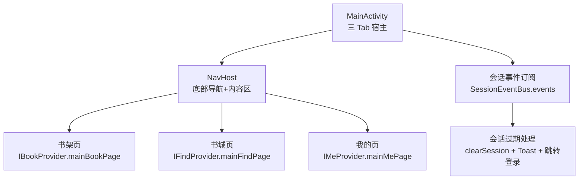
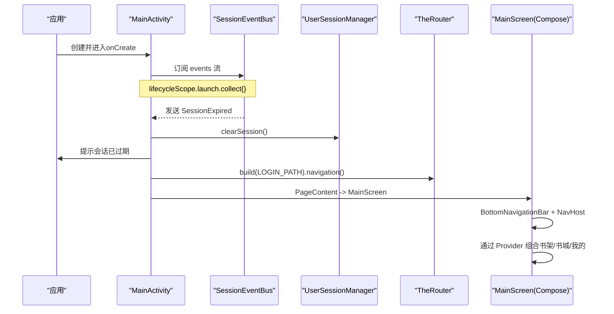
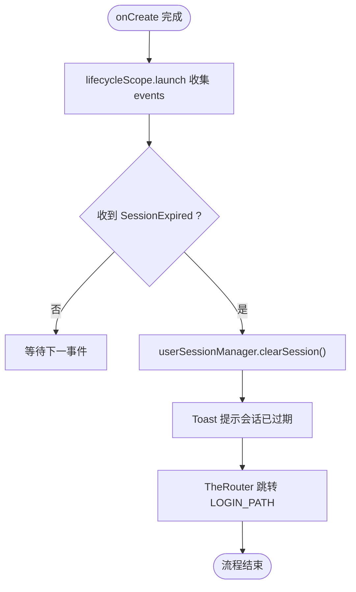
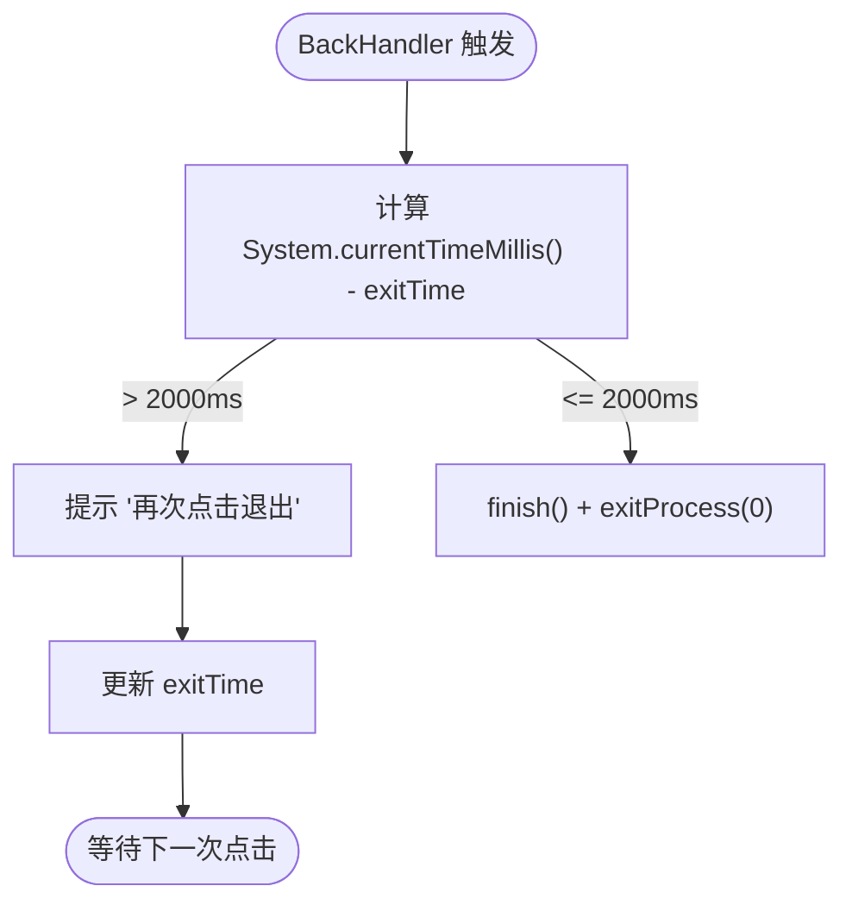
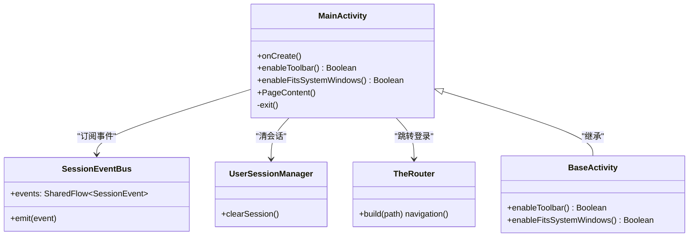

# MainActivity 主入口

<cite>
**本文引用的文件**
- [MainActivity.kt](file://module_main/src/main/java/com/ebook/main/MainActivity.kt)
- [SessionEventBus.kt](file://lib_ebook_api/src/main/java/com/ebook/api/auth/SessionEventBus.kt)
- [KeyCode.kt](file://lib_book_common/src/main/java/com/ebook/common/event/KeyCode.kt)
- [UserSessionManager.kt](file://lib_book_common/src/main/java/com/ebook/common/domain/UserSessionManager.kt)
</cite>

## 目录
1. [简介](#简介)
2. [项目结构](#项目结构)
3. [核心组件](#核心组件)
4. [架构总览](#架构总览)
5. [详细组件分析](#详细组件分析)
6. [依赖关系分析](#依赖关系分析)
7. [性能与可维护性](#性能与可维护性)
8. [故障排查指南](#故障排查指南)
9. [结论](#结论)
10. [附录：常见修改示例](#附录常见修改示例)

## 简介
本文件围绕 module_main 的 MainActivity，系统性说明其作为“三个 Tab 宿主容器”的架构设计、Compose 基类集成方式、会话过期统一处置流程、返回键退出确认逻辑，以及路由与依赖注入的使用。文档同时提供面向实践的扩展建议：如何修改会话过期处理、如何添加全局事件监听、如何自定义退出确认行为。

## 项目结构
MainActivity 位于 module_main 模块，是应用的主入口之一（另一个为启动页 SplashActivity）。它不直接承载具体业务页面，而是通过 Compose 的 NavHost 组合三个 Tab 内容，并通过 Provider + TheRouter 将实际页面解耦到各自模块。

图示来源
- [MainActivity.kt:99-197](file://module_main/src/main/java/com/ebook/main/MainActivity.kt#L99-L197)
- [SessionEventBus.kt:22-44](file://lib_ebook_api/src/main/java/com/ebook/api/auth/SessionEventBus.kt#L22-L44)

章节来源
- [MainActivity.kt:45-115](file://module_main/src/main/java/com/ebook/main/MainActivity.kt#L45-L115)
- [MainActivity.kt:117-197](file://module_main/src/main/java/com/ebook/main/MainActivity.kt#L117-L197)

## 核心组件
- 宿主 Activity：继承 BaseActivity（Compose 版），覆写 enableToolbar() 与 enableFitsSystemWindows()，以适配三 Tab 沉浸式顶栏与手势条避让策略。
- 会话事件总线订阅：在 onCreate 中通过 lifecycleScope.launch 收集 SessionEventBus.events，遇到 SessionExpired 执行幂等清理与会话重置。
- 底部导航与路由：使用 NavigationBar + NavHost 管理三个 Tab；Tab 内容通过 Provider 接口动态组合，实现跨模块解耦。
- 返回键与退出确认：BackHandler 委托给 onBackPress，再由 exit() 实现“两次点击退出”的确认逻辑。
- 路由注册与 Hilt 注入：@Route(path = KeyCode.Main.MAIN_PATH) 暴露主界面路径；@AndroidEntryPoint 注入 SessionEventBus 与 UserSessionManager。

章节来源
- [MainActivity.kt:57-80](file://module_main/src/main/java/com/ebook/main/MainActivity.kt#L57-L80)
- [MainActivity.kt:82-97](file://module_main/src/main/java/com/ebook/main/MainActivity.kt#L82-L97)
- [MainActivity.kt:99-114](file://module_main/src/main/java/com/ebook/main/MainActivity.kt#L99-L114)
- [MainActivity.kt:139-197](file://module_main/src/main/java/com/ebook/main/MainActivity.kt#L139-L197)
- [KeyCode.kt:6-10](file://lib_book_common/src/main/java/com/ebook/common/event/KeyCode.kt#L6-L10)
- [SessionEventBus.kt:9-44](file://lib_ebook_api/src/main/java/com/ebook/api/auth/SessionEventBus.kt#L9-L44)

## 架构总览
下图展示了 MainActivity 作为“三 Tab 宿主”的调用链路与关键协作点：生命周期中的会话事件订阅、UI 层 BackHandler、底部导航切换、以及通过 Provider 加载各 Tab 内容。

图示来源
- [MainActivity.kt:68-80](file://module_main/src/main/java/com/ebook/main/MainActivity.kt#L68-L80)
- [MainActivity.kt:99-197](file://module_main/src/main/java/com/ebook/main/MainActivity.kt#L99-L197)
- [SessionEventBus.kt:22-44](file://lib_ebook_api/src/main/java/com/ebook/api/auth/SessionEventBus.kt#L22-L44)

## 详细组件分析

### 1) 继承 BaseActivity 的 Compose 基类机制与 insets 策略
- enableToolbar(): 返回 false，表示不使用基类 Toolbar，因为三个 Tab 各自渲染自己的顶栏（Material3 TopAppBar），由各自页面控制沉浸式状态栏。
- enableFitsSystemWindows(): 返回 false，关闭基类的系统栏偏移消费，避免把整个 Tab 内容推至状态栏下方，导致“我的”页渐变头部出现断层。改为由各 Tab 页面按 M3 默认 bar insets 自行避让，保证沉浸式效果一致。

章节来源
- [MainActivity.kt:82-97](file://module_main/src/main/java/com/ebook/main/MainActivity.kt#L82-L97)

### 2) 会话过期处理流程
- 事件源：网络层在 refresh token 刷新失败时统一发射 SessionEvent.SessionExpired（见 SessionEventBus 的设计说明）。
- 订阅时机：MainActivity.onCreate 中通过 lifecycleScope.launch 收集 SessionEventBus.events，确保协程与 Activity 生命周期绑定，避免泄漏。
- 处理动作（幂等）：
  - userSessionManager.clearSession()：清除会话（包括内存 token、持久化字段与 Profile 内存镜像）。
  - ToastUtil.showShort(...)：提示用户会话已过期。
  - TheRouter.build(KeyCode.Login.LOGIN_PATH).navigation()：跳转登录页。
- 设计要点：由于 MainActivity 是登录后最长驻留的宿主，集中在此订阅比 SplashActivity 更合适；事件采用 SharedFlow（缓冲容量 1），重复过期风暴会丢弃重复事件，不会阻塞请求线程。

图示来源
- [MainActivity.kt:68-80](file://module_main/src/main/java/com/ebook/main/MainActivity.kt#L68-L80)
- [SessionEventBus.kt:9-44](file://lib_ebook_api/src/main/java/com/ebook/api/auth/SessionEventBus.kt#L9-L44)
- [KeyCode.kt:13-27](file://lib_book_common/src/main/java/com/ebook/common/event/KeyCode.kt#L13-L27)

章节来源
- [MainActivity.kt:68-80](file://module_main/src/main/java/com/ebook/main/MainActivity.kt#L68-L80)
- [SessionEventBus.kt:22-44](file://lib_ebook_api/src/main/java/com/ebook/api/auth/SessionEventBus.kt#L22-L44)

### 3) BackHandler 与两次点击退出确认
- BackHandler：在 MainScreen 中拦截返回键，委托给 onBackPress 回调，最终落到 MainActivity.exit()。
- exit() 逻辑：
  - 若距离上次点击超过 2000ms，显示“再次点击退出”的提示，并记录当前时间戳。
  - 若在 2000ms 内再次点击，则 finish() 并 exitProcess(0)，立即终止进程。
- 注意：该行为属于“应用级退出”，一般仅用于测试或特定场景；生产环境通常不建议强制杀死进程。

图示来源
- [MainActivity.kt:106-114](file://module_main/src/main/java/com/ebook/main/MainActivity.kt#L106-L114)
- [MainActivity.kt:147-149](file://module_main/src/main/java/com/ebook/main/MainActivity.kt#L147-L149)

章节来源
- [MainActivity.kt:106-114](file://module_main/src/main/java/com/ebook/main/MainActivity.kt#L106-L114)
- [MainActivity.kt:147-149](file://module_main/src/main/java/com/ebook/main/MainActivity.kt#L147-L149)

### 4) 路由注册与 Hilt 注入
- @Route(path = KeyCode.Main.MAIN_PATH)：将 MainActivity 注册到 TheRouter，路径常量来自 KeyCode.Main.MAIN_PATH，便于跨模块导航与独立运行时的占位路由。
- @AndroidEntryPoint：启用 Hilt 字段注入，注入 SessionEventBus 与 UserSessionManager，避免手动构造依赖。

章节来源
- [MainActivity.kt:57-67](file://module_main/src/main/java/com/ebook/main/MainActivity.kt#L57-L67)
- [KeyCode.kt:6-10](file://lib_book_common/src/main/java/com/ebook/common/event/KeyCode.kt#L6-L10)

### 5) 三 Tab 宿主与 Provider 组合
- MainScreen 使用 rememberNavController 管理回退栈，选中态从 currentBackStackEntryAsState 派生，避免本地状态与导航状态不一致。
- NavigationBar 列出三个 Tab：书架、书城、我的；点击后 navigate(route, launchSingleTop=true, restoreState=true)，保留状态且避免重复压栈。
- NavHost 中通过 TheRouter.get(IBookProvider/IFindProvider/IMeProvider)?.mainMePage?.invoke() 组合各 Tab 的 Compose 页面，实现模块间解耦与独立运行支持。

章节来源
- [MainActivity.kt:139-197](file://module_main/src/main/java/com/ebook/main/MainActivity.kt#L139-L197)

## 依赖关系分析
- MainActivity 依赖：
  - SessionEventBus（lib_ebook_api）：会话级全局事件，统一在网络层收口并发射。
  - UserSessionManager（lib_book_common）：会话状态唯一 seam，clearSession 负责清理所有镜像（SP、TokenHolder、Profile 内存 StateFlow）。
  - TheRouter：跨模块路由，构建 LOGIN_PATH 跳转登录页。
  - BaseActivity（lib_common）：Compose 基类，提供主题、覆盖层与 insets 钩子。
- 耦合与内聚：
  - MainActivity 对会话过期的处理集中在单一位置，内聚度高；对 Tab 内容的组合通过 Provider 接口降低模块间耦合。
  - 事件流采用 SharedFlow 且带缓冲，避免高并发下阻塞。

图示来源
- [MainActivity.kt:57-114](file://module_main/src/main/java/com/ebook/main/MainActivity.kt#L57-L114)
- [SessionEventBus.kt:22-44](file://lib_ebook_api/src/main/java/com/ebook/api/auth/SessionEventBus.kt#L22-L44)
- [UserSessionManager.kt:44-47](file://lib_book_common/src/main/java/com/ebook/common/domain/UserSessionManager.kt#L44-L47)

章节来源
- [MainActivity.kt:57-114](file://module_main/src/main/java/com/ebook/main/MainActivity.kt#L57-L114)
- [SessionEventBus.kt:22-44](file://lib_ebook_api/src/main/java/com/ebook/api/auth/SessionEventBus.kt#L22-L44)
- [UserSessionManager.kt:44-47](file://lib_book_common/src/main/java/com/ebook/common/domain/UserSessionManager.kt#L44-L47)

## 性能与可维护性
- 事件流性能：SessionEventBus 使用 MutableSharedFlow(extraBufferCapacity=1)，在过期风暴场景下丢弃重复事件，避免阻塞请求线程。
- 生命周期安全：在 lifecycleScope.launch 中收集事件，随 Activity 销毁自动取消，避免内存泄漏。
- 幂等处理：会话过期处理为幂等操作（clearSession + 提示 + 跳转），重复事件不会产生副作用叠加。
- 可维护性：通过 Provider + TheRouter 解耦 Tab 内容；会话相关逻辑集中在 MainActivity，便于定位与维护。

[本节为通用指导，无需引用具体文件]

## 故障排查指南
- 症状：会话过期未跳转登录页
  - 检查 SessionEventBus 是否被正确发射（网络层刷新失败时）。
  - 检查 MainActivity.onCreate 是否执行了 lifecycleScope.launch 订阅。
  - 检查 TheRouter 是否注册了 LOGIN_PATH（独立模式需有占位路由）。
- 症状：退出确认无效
  - 检查 BackHandler 是否正确委托给 onBackPress。
  - 检查 exit() 中时间窗口判断与 exitProcess 调用是否生效。
- 症状：顶部沉浸效果异常
  - 检查 enableToolbar() 与 enableFitsSystemWindows() 返回值是否符合预期（均为 false）。
  - 检查各 Tab 页面是否正确消费/避让系统栏 insets。

章节来源
- [MainActivity.kt:68-97](file://module_main/src/main/java/com/ebook/main/MainActivity.kt#L68-L97)
- [SessionEventBus.kt:22-44](file://lib_ebook_api/src/main/java/com/ebook/api/auth/SessionEventBus.kt#L22-L44)

## 结论
MainActivity 作为三 Tab 宿主容器，职责清晰：集中处理会话过期、提供统一的返回键退出确认、通过 Compose + Navigation + Provider + TheRouter 组合跨模块页面。其设计遵循高内聚低耦合原则，事件处理幂等、生命周期安全，适合长期驻留的主入口角色。

[本节为总结性内容，无需引用具体文件]

## 附录：常见修改示例

- 修改会话过期处理逻辑
  - 在 SessionExpired 分支中添加额外动作（如上报埋点、保存错误码等），保持幂等。
  - 参考路径：[MainActivity.kt:68-80](file://module_main/src/main/java/com/ebook/main/MainActivity.kt#L68-L80)
- 添加新的全局事件监听
  - 在 SessionEventBus 中新增事件类型（sealed class 分支），并在需要处 emit。
  - 在 MainActivity 或其他宿主中订阅 events 流进行处理。
  - 参考路径：[SessionEventBus.kt:9-44](file://lib_ebook_api/src/main/java/com/ebook/api/auth/SessionEventBus.kt#L9-L44)
- 自定义退出确认行为
  - 修改 exit() 的时间窗口或提示文案；如需改为对话框确认，可在 BackHandler 中增加二次确认。
  - 参考路径：[MainActivity.kt:106-114](file://module_main/src/main/java/com/ebook/main/MainActivity.kt#L106-L114)
- 调整三 Tab 内容与路由
  - 在 MainScreen 的 NavigationBar 与 NavHost 中增减 Tab，并确保 Provider 接口与 TheRouter 注册同步。
  - 参考路径：[MainActivity.kt:139-197](file://module_main/src/main/java/com/ebook/main/MainActivity.kt#L139-L197)
- 调整 insets 行为
  - 如需改变基类系统栏偏移策略，调整 enableFitsSystemWindows() 返回值，并确保各 Tab 页面正确处理 insets。
  - 参考路径：[MainActivity.kt:82-97](file://module_main/src/main/java/com/ebook/main/MainActivity.kt#L82-L97)