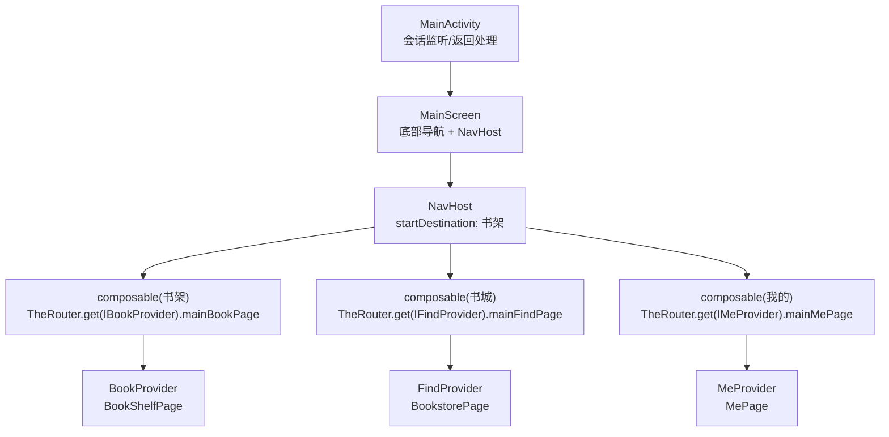
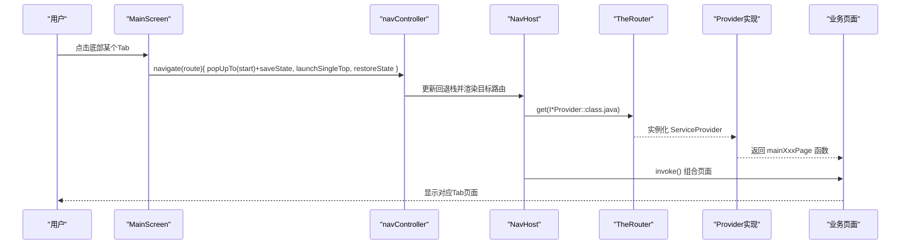
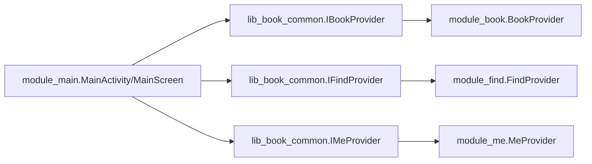

# MainScreen 主界面骨架

<cite>
**本文引用的文件**
- [MainActivity.kt](file://module_main/src/main/java/com/ebook/main/MainActivity.kt)
- [IBookProvider.kt](file://lib_book_common/src/main/java/com/ebook/common/provider/IBookProvider.kt)
- [IFindProvider.kt](file://lib_book_common/src/main/java/com/ebook/common/provider/IFindProvider.kt)
- [IMeProvider.kt](file://lib_book_common/src/main/java/com/ebook/common/provider/IMeProvider.kt)
- [BookProvider.kt](file://module_book/src/main/java/com/ebook/book/provider/BookProvider.kt)
- [FindProvider.kt](file://module_find/src/main/java/com/ebook/find/provider/FindProvider.kt)
- [MeProvider.kt](file://module_me/src/main/java/com/ebook/me/provider/MeProvider.kt)
</cite>

## 目录
1. [简介](#简介)
2. [项目结构](#项目结构)
3. [核心组件](#核心组件)
4. [架构总览](#架构总览)
5. [详细组件分析](#详细组件分析)
6. [依赖关系分析](#依赖关系分析)
7. [性能考量](#性能考量)
8. [故障排查指南](#故障排查指南)
9. [结论](#结论)
10. [附录：扩展与示例指引](#附录：扩展与示例指引)

## 简介
MainScreen 是应用的主界面容器，负责底部导航栏、三个 Tab（书架、书城、我的）的 NavHost 路由组合以及状态保持策略。它通过 rememberNavController() 管理导航栈，使用 currentBackStackEntryAsState() 派生选中态；通过 Provider 接口以 TheRouter 动态加载各模块页面；并配合 popUpTo/saveState、launchSingleTop/restoreState 等参数实现“回到起始目的地并保留页面状态”的体验。同时，通过 contentWindowInsets = WindowInsets(0.dp) 与各 Tab 顶栏自行避让的方式，确保沉浸式顶部与手势条避让正确。

## 项目结构
- 宿主入口：module_main 中的 MainActivity 提供 @AndroidEntryPoint 生命周期、会话过期统一处理、BackHandler 关闭逻辑，并在 PageContent 中组合 MainScreen。
- 主界面 Composable：MainScreen 定义底部 NavigationBar、NavHost、startDestination 与 composable 路由注册，结合 TheRouter.get(...) 动态组合各模块页面。
- 跨模块页面暴露：lib_book_common 定义 IBookProvider、IFindProvider、IMeProvider 三个 Provider 接口；对应 module_book、module_find、module_me 各自提供 ServiceProvider 实现，将具体 Compose 页面以函数形式暴露给宿主组合。

图表来源
- [MainActivity.kt:99-197](file://module_main/src/main/java/com/ebook/main/MainActivity.kt#L99-L197)
- [IBookProvider.kt:1-13](file://lib_book_common/src/main/java/com/ebook/common/provider/IBookProvider.kt#L1-L13)
- [IFindProvider.kt:1-13](file://lib_book_common/src/main/java/com/ebook/common/provider/IFindProvider.kt#L1-L13)
- [IMeProvider.kt:1-13](file://lib_book_common/src/main/java/com/ebook/common/provider/IMeProvider.kt#L1-L13)
- [BookProvider.kt:1-15](file://module_book/src/main/java/com/ebook/book/provider/BookProvider.kt#L1-L15)
- [FindProvider.kt:1-19](file://module_find/src/main/java/com/ebook/find/provider/FindProvider.kt#L1-L19)
- [MeProvider.kt:1-20](file://module_me/src/main/java/com/ebook/me/provider/MeProvider.kt#L1-L20)

章节来源
- [MainActivity.kt:45-115](file://module_main/src/main/java/com/ebook/main/MainActivity.kt#L45-L115)
- [MainActivity.kt:117-197](file://module_main/src/main/java/com/ebook/main/MainActivity.kt#L117-L197)

## 核心组件
- 导航控制器与选中态
  - rememberNavController()：创建并持有导航控制器，用于 navigate、pop 等操作。
  - currentBackStackEntryAsState()：从回退栈派生当前路由，作为 NavigationBarItem 的 selected 数据源，避免本地状态与导航状态不一致。
- 底部导航栏
  - NavigationBar 内循环 screens 列表生成 NavigationBarItem，图标与文案来自 Screen sealed class 的定义。
- 路由与页面组合
  - NavHost startDestination 指向书架路由。
  - 三个 composable 分别按 route 注册，内部通过 TheRouter.get(...).xxx.invoke() 动态获取并组合各模块页面。
- 状态保持机制
  - popUpTo(findStartDestination().id) + saveState=true：点击任一 Tab 时清空到起始目的地上方并保存该目的地状态。
  - launchSingleTop=true：防止重复入栈同一路由。
  - restoreState=true：恢复之前保存的状态，保证切换 Tab 后内容位置、滚动位置等不丢失。
- insets 处理
  - Scaffold 的 contentWindowInsets=WindowInsets(0.dp)：禁用默认的 insets 消费，使底部导航栏自带的手势条避让生效，而顶部状态栏避让由各 Tab 顶栏自行处理。
  - .consumeWindowInsets(paddingValues)：仅消费由 NavigationBar 带来的底部 padding，避免对顶部进行额外偏移。

章节来源
- [MainActivity.kt:139-197](file://module_main/src/main/java/com/ebook/main/MainActivity.kt#L139-L197)

## 架构总览
MainScreen 作为宿主容器，承担“导航+状态保持+insets 协调”的职责；各业务模块通过 Provider 接口暴露页面级 Composable，解耦宿主与业务模块的编译期耦合。TheRouter 在运行时解析并实例化 ServiceProvider，实现“按需组合”。

图表来源
- [MainActivity.kt:151-197](file://module_main/src/main/java/com/ebook/main/MainActivity.kt#L151-L197)
- [IBookProvider.kt:1-13](file://lib_book_common/src/main/java/com/ebook/common/provider/IBookProvider.kt#L1-L13)
- [IFindProvider.kt:1-13](file://lib_book_common/src/main/java/com/ebook/common/provider/IFindProvider.kt#L1-L13)
- [IMeProvider.kt:1-13](file://lib_book_common/src/main/java/com/ebook/common/provider/IMeProvider.kt#L1-L13)
- [BookProvider.kt:1-15](file://module_book/src/main/java/com/ebook/book/provider/BookProvider.kt#L1-L15)
- [FindProvider.kt:1-19](file://module_find/src/main/java/com/ebook/find/provider/FindProvider.kt#L1-L19)
- [MeProvider.kt:1-20](file://module_me/src/main/java/com/ebook/me/provider/MeProvider.kt#L1-L20)

## 详细组件分析

### 底部导航栏与选中态
- 选中态单一数据源：currentBackStackEntryAsState() 的 backStackEntry.destination.route 作为 selected 依据，保证 UI 与导航一致。
- NavigationBarItem 动态生成：通过 screens 列表循环创建，减少重复代码，便于后续扩展。

章节来源
- [MainActivity.kt:143-172](file://module_main/src/main/java/com/ebook/main/MainActivity.kt#L143-L172)

### NavHost 导航配置
- startDestination：设置为书架路由，首次进入默认展示书架。
- composable 路由注册：为每个 tab 注册 route，并在回调中通过 TheRouter 获取 Provider 并组合页面。
- 页面作用域：页面内的 ViewModel 经 hiltViewModel() 绑定调用处的 NavBackStackEntry，切 Tab 时保留状态，退出时销毁。

章节来源
- [MainActivity.kt:175-197](file://module_main/src/main/java/com/ebook/main/MainActivity.kt#L175-L197)

### 状态保持机制
- popUpTo(saveState=true)：点击任一 Tab 时将导航栈清理至起始目的地上方，并保存该目的地状态，以便恢复。
- launchSingleTop(true)：避免重复入栈相同路由。
- restoreState(true)：恢复上一次保存的状态，如滚动位置、展开状态等。

章节来源
- [MainActivity.kt:160-168](file://module_main/src/main/java/com/ebook/main/MainActivity.kt#L160-L168)

### insets 处理策略
- contentWindowInsets=WindowInsets(0.dp)：屏蔽默认的 insets 消费，避免把内容推离状态栏，确保各 Tab 顶栏的沉浸式效果。
- consumeWindowInsets(paddingValues)：仅消费底部导航栏高度（含其已避让的手势条），避免对内容产生二次偏移。
- 顶部状态栏避让下沉到各 Tab 顶栏：符合 Material3 TopAppBar 的行为约定。

章节来源
- [MainActivity.kt:173-182](file://module_main/src/main/java/com/ebook/main/MainActivity.kt#L173-L182)

### 各 Tab 页面的组合方式（Provider 集成）
- 宿主通过 TheRouter.get(I*Provider::class.java)?.xxx?.invoke() 动态加载页面，实现模块间解耦。
- 各模块 ServiceProvider 实现接口，将具体 Compose 页面以函数形式暴露，宿主直接组合。

章节来源
- [MainActivity.kt:186-194](file://module_main/src/main/java/com/ebook/main/MainActivity.kt#L186-L194)
- [IBookProvider.kt:1-13](file://lib_book_common/src/main/java/com/ebook/common/provider/IBookProvider.kt#L1-L13)
- [IFindProvider.kt:1-13](file://lib_book_common/src/main/java/com/ebook/common/provider/IFindProvider.kt#L1-L13)
- [IMeProvider.kt:1-13](file://lib_book_common/src/main/java/com/ebook/common/provider/IMeProvider.kt#L1-L13)
- [BookProvider.kt:1-15](file://module_book/src/main/java/com/ebook/book/provider/BookProvider.kt#L1-L15)
- [FindProvider.kt:1-19](file://module_find/src/main/java/com/ebook/find/provider/FindProvider.kt#L1-L19)
- [MeProvider.kt:1-20](file://module_me/src/main/java/com/ebook/me/provider/MeProvider.kt#L1-L20)

### 会话过期与返回处理
- 会话过期：在主 Activity 订阅 SessionEventBus，收到过期事件后清会话、提示并跳转登录页。
- 返回处理：BackHandler 委托给 onBackPress，支持双击退出或交由上层处理。

章节来源
- [MainActivity.kt:68-80](file://module_main/src/main/java/com/ebook/main/MainActivity.kt#L68-L80)
- [MainActivity.kt:147-149](file://module_main/src/main/java/com/ebook/main/MainActivity.kt#L147-L149)
- [MainActivity.kt:106-114](file://module_main/src/main/java/com/ebook/main/MainActivity.kt#L106-L114)

## 依赖关系分析
- 宿主（module_main）依赖 lib_book_common 的 Provider 接口，通过 TheRouter 在运行时装配具体实现。
- 业务模块（module_book/module_find/module_me）各自提供 ServiceProvider 实现，并以 @ServiceProvider 注解注册。
- 页面层通过 hiltViewModel() 与 NavBackStackEntry 绑定，切 Tab 保留状态。

图表来源
- [MainActivity.kt:186-194](file://module_main/src/main/java/com/ebook/main/MainActivity.kt#L186-L194)
- [IBookProvider.kt:1-13](file://lib_book_common/src/main/java/com/ebook/common/provider/IBookProvider.kt#L1-L13)
- [IFindProvider.kt:1-13](file://lib_book_common/src/main/java/com/ebook/common/provider/IFindProvider.kt#L1-L13)
- [IMeProvider.kt:1-13](file://lib_book_common/src/main/java/com/ebook/common/provider/IMeProvider.kt#L1-L13)
- [BookProvider.kt:1-15](file://module_book/src/main/java/com/ebook/book/provider/BookProvider.kt#L1-L15)
- [FindProvider.kt:1-19](file://module_find/src/main/java/com/ebook/find/provider/FindProvider.kt#L1-L19)
- [MeProvider.kt:1-20](file://module_me/src/main/java/com/ebook/me/provider/MeProvider.kt#L1-L20)

章节来源
- [MainActivity.kt:186-194](file://module_main/src/main/java/com/ebook/main/MainActivity.kt#L186-L194)
- [BookProvider.kt:1-15](file://module_book/src/main/java/com/ebook/book/provider/BookProvider.kt#L1-L15)
- [FindProvider.kt:1-19](file://module_find/src/main/java/com/ebook/find/provider/FindProvider.kt#L1-L19)
- [MeProvider.kt:1-20](file://module_me/src/main/java/com/ebook/me/provider/MeProvider.kt#L1-L20)

## 性能考量
- 选中态基于回退栈派生，避免额外状态维护，降低状态同步成本。
- launchSingleTop 避免重复入栈，减少不必要的页面重建。
- restoreState 恢复页面状态，提升用户体验，避免重复加载与滚动重置。
- Provider 动态组合减少宿主与模块间的编译期耦合，利于模块化独立开发。

[本节为通用指导，无需特定文件引用]

## 故障排查指南
- 切换 Tab 无响应或选中态不正确
  - 检查 currentBackStackEntryAsState 是否正确取到 destination.route，并确保 NavigationBarItem 的 selected 与之对比。
  - 确认 navigate 的参数包含 popUpTo(saveState)、launchSingleTop、restoreState。
- 页面状态未恢复（滚动位置丢失）
  - 确认 popUpTo(saveState=true) 与 restoreState=true 同时存在。
- 顶部出现空白或被遮挡
  - 确认 contentWindowInsets=WindowInsets(0.dp)，且仅在底部消费 paddingValues；顶部避让由各 Tab 顶栏处理。
- 会话过期未跳转登录
  - 检查 SessionEventBus 订阅是否启动，清会话与跳转逻辑是否执行。

章节来源
- [MainActivity.kt:143-197](file://module_main/src/main/java/com/ebook/main/MainActivity.kt#L143-L197)
- [MainActivity.kt:68-80](file://module_main/src/main/java/com/ebook/main/MainActivity.kt#L68-L80)

## 结论
MainScreen 以简洁清晰的导航与状态管理为核心，通过 Provider 接口与 TheRouter 实现模块间解耦与动态加载；借助 popUpTo/saveState、launchSingleTop/restoreState 保障 Tab 切换体验；并通过合理的 insets 策略确保沉浸式 UI。整体设计兼顾可维护性与可扩展性，便于新增 Tab 与页面通信。

[本节为总结，无需特定文件引用]

## 附录：扩展与示例指引

### 如何添加新的 Tab 页面
- 在宿主侧（MainActivity.kt）扩展 Screen 密封类，新增一个 data object 条目（route、titleRes、icon）。
- 在 NavHost 中新增 composable(route) 块，并通过 TheRouter.get(I*Provider::class.java)?.xxx?.invoke() 组合新页面。
- 在各业务模块新增对应的 Provider 实现，将页面以 @Composable () -> Unit 暴露。

章节来源
- [MainActivity.kt:123-127](file://module_main/src/main/java/com/ebook/main/MainActivity.kt#L123-L127)
- [MainActivity.kt:186-194](file://module_main/src/main/java/com/ebook/main/MainActivity.kt#L186-L194)
- [IBookProvider.kt:1-13](file://lib_book_common/src/main/java/com/ebook/common/provider/IBookProvider.kt#L1-L13)
- [IFindProvider.kt:1-13](file://lib_book_common/src/main/java/com/ebook/common/provider/IFindProvider.kt#L1-L13)
- [IMeProvider.kt:1-13](file://lib_book_common/src/main/java/com/ebook/common/provider/IMeProvider.kt#L1-L13)

### 如何处理页面间通信
- 同 Tab 内：通过页面自身的 ViewModel 状态（如 StateFlow）进行通信。
- 跨 Tab：建议通过共享仓库或服务（如下载中心、消息总线）进行事件驱动通信；避免直接强依赖其他 Tab 的内部状态。
- 若需跨模块通信，可通过 TheRouter 路由传递参数或在公共模块暴露服务接口。

[本节为通用指导，无需特定文件引用]

### 如何管理导航状态
- 使用 rememberNavController() 管理导航，currentBackStackEntryAsState() 派生选中态。
- 通过 popUpTo(saveState=true)、launchSingleTop(true)、restoreState(true) 控制入栈行为与状态恢复。
- 如需携带参数跳转，可在 composable 路由中定义参数并传参；注意参数类型与序列化。

章节来源
- [MainActivity.kt:143-197](file://module_main/src/main/java/com/ebook/main/MainActivity.kt#L143-L197)