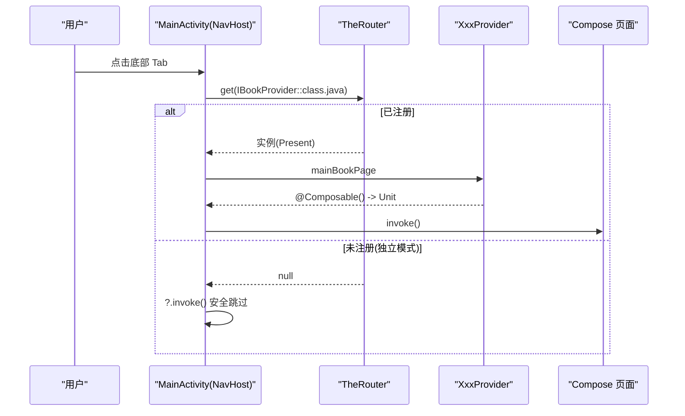
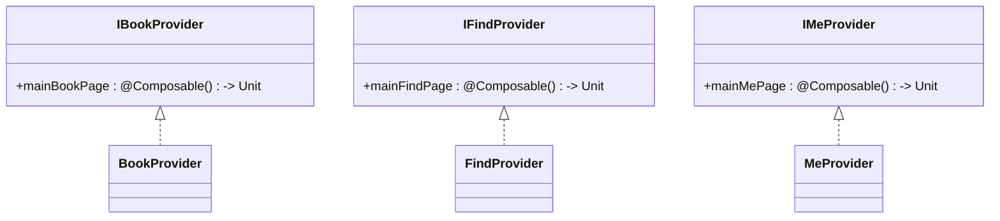
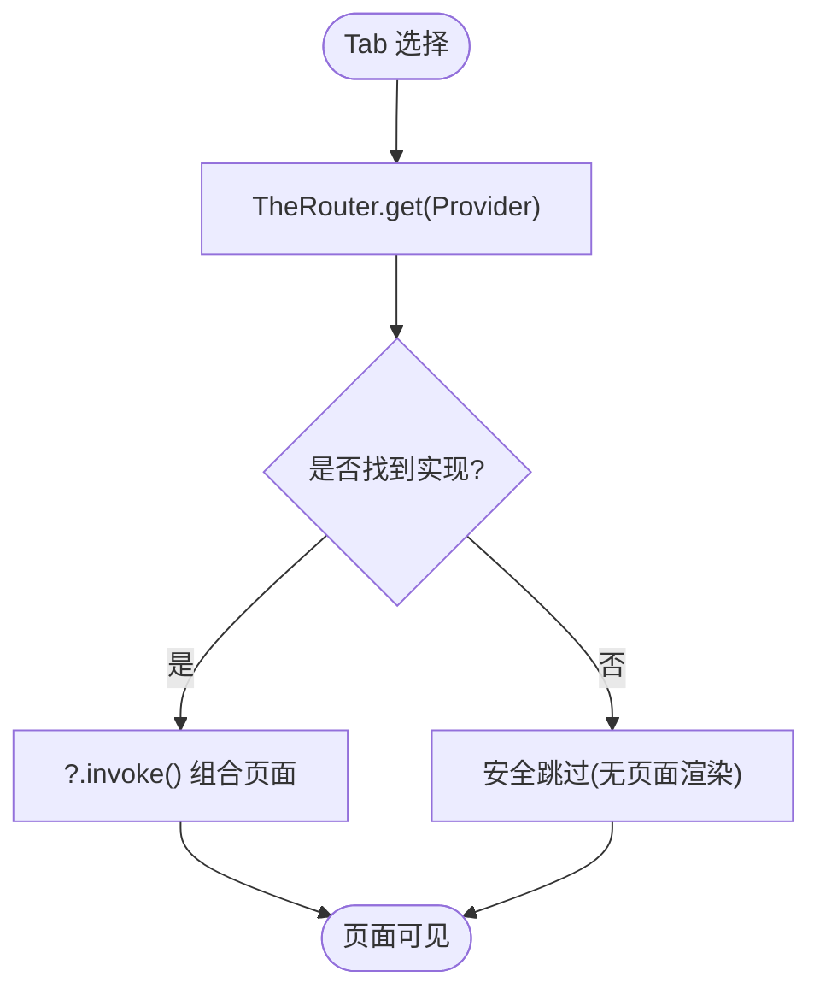

# Provider 接口集成

<cite>
**本文引用的文件**   
- [IBookProvider.kt](file://lib_book_common/src/main/java/com/ebook/common/provider/IBookProvider.kt)
- [IFindProvider.kt](file://lib_book_common/src/main/java/com/ebook/common/provider/IFindProvider.kt)
- [IMeProvider.kt](file://lib_book_common/src/main/java/com/ebook/common/provider/IMeProvider.kt)
- [BookProvider.kt](file://module_book/src/main/java/com/ebook/book/provider/BookProvider.kt)
- [FindProvider.kt](file://module_find/src/main/java/com/ebook/find/provider/FindProvider.kt)
- [MeProvider.kt](file://module_me/src/main/java/com/ebook/me/provider/MeProvider.kt)
- [MainActivity.kt](file://module_main/src/main/java/com/ebook/main/MainActivity.kt)
</cite>

## 目录
1. [简介](#简介)
2. [项目结构](#项目结构)
3. [核心组件](#核心组件)
4. [架构总览](#架构总览)
5. [详细组件分析](#详细组件分析)
6. [依赖关系分析](#依赖关系分析)
7. [性能与生命周期](#性能与生命周期)
8. [故障排查指南](#故障排查指南)
9. [结论](#结论)
10. [附录：新增 Provider 的完整步骤](#附录新增-provider的完整步骤)

## 简介
本文件聚焦跨模块解耦的 Provider 接口集成方案，围绕 IBookProvider、IFindProvider、IMeProvider 三个“页面级服务”契约，说明宿主如何以 TheRouter 的服务发现机制按需组合 Compose 页面，并在独立运行与集成运行时均能安全降级。同时给出 Compose 页面的作用域绑定与生命周期策略，以及新增 Provider 的标准实践与降级方案。

## 项目结构
- 接口契约定义在共享库 lib_book_common，供所有业务模块依赖，避免循环依赖。
- 各功能模块（module_book、module_find、module_me）分别实现对应 Provider，并通过 TheRouter 的服务注解暴露给宿主。
- 宿主 module_main 通过 TheRouter.get() 获取服务实例，并以空安全调用 ?.invoke() 组合页面。

```mermaid
graph TB
    subgraph "共享契约(lib_book_common)"
        IBook["IBookProvider"]
        IFind["IFindProvider"]
        IMe["IMeProvider"]
    end

    subgraph "业务模块"
        BookProv["BookProvider(实现 IBookProvider)"]
        FindProv["FindProvider(实现 IFindProvider)"]
        MeProv["MeProvider(实现 IMeProvider)"]
    end

    subgraph "宿主(module_main)"
        MainAct["MainActivity<br/>NavHost + Tab 路由"]
    end

    IBook --> BookProv
    IFind --> FindProv
    IMe --> MeProv

    MainAct -->|TheRouter.get(...)?.invoke()| BookProv
    MainAct -->|TheRouter.get(...)?.invoke()| FindProv
    MainAct -->|TheRouter.get(...)?.invoke()| MeProv
```

**图示来源**
- [MainActivity.kt:184-194](file://module_main/src/main/java/com/ebook/main/MainActivity.kt#L184-L194)
- [BookProvider.kt:8-14](file://module_book/src/main/java/com/ebook/book/provider/BookProvider.kt#L8-L14)
- [FindProvider.kt:8-18](file://module_find/src/main/java/com/ebook/find/provider/FindProvider.kt#L8-L18)
- [MeProvider.kt:9-19](file://module_me/src/main/java/com/ebook/me/provider/MeProvider.kt#L9-L19)
- [IBookProvider.kt:5-13](file://lib_book_common/src/main/java/com/ebook/common/provider/IBookProvider.kt#L5-L13)
- [IFindProvider.kt:5-13](file://lib_book_common/src/main/java/com/ebook/common/provider/IFindProvider.kt#L5-L13)
- [IMeProvider.kt:5-13](file://lib_book_common/src/main/java/com/ebook/common/provider/IMeProvider.kt#L5-L13)

**章节来源**
- [MainActivity.kt:184-194](file://module_main/src/main/java/com/ebook/main/MainActivity.kt#L184-L194)
- [BookProvider.kt:8-14](file://module_book/src/main/java/com/ebook/book/provider/BookProvider.kt#L8-L14)
- [FindProvider.kt:8-18](file://module_find/src/main/java/com/ebook/find/provider/FindProvider.kt#L8-L18)
- [MeProvider.kt:9-19](file://module_me/src/main/java/com/ebook/me/provider/MeProvider.kt#L9-L19)
- [IBookProvider.kt:5-13](file://lib_book_common/src/main/java/com/ebook/common/provider/IBookProvider.kt#L5-L13)
- [IFindProvider.kt:5-13](file://lib_book_common/src/main/java/com/ebook/common/provider/IFindProvider.kt#L5-L13)
- [IMeProvider.kt:5-13](file://lib_book_common/src/main/java/com/ebook/common/provider/IMeProvider.kt#L5-L13)

## 核心组件
- IBookProvider：书架页服务契约，暴露 mainBookPage 为 @Composable () -> Unit。
- IFindProvider：书城页服务契约，暴露 mainFindPage 为 @Composable () -> Unit。
- IMeProvider：个人中心页服务契约，暴露 mainMePage 为 @Composable () -> Unit。
- 各 Provider 实现类使用 TheRouter 的 @ServiceProvider 注解注册，返回对应模块的 Compose 页面。
- 宿主 MainActivity 通过 NavHost 将三个 Tab 路由到各自 Provider 的 Composable 函数，并使用 TheRouter.get() 空安全调用 ?.invoke()。

**章节来源**
- [IBookProvider.kt:5-13](file://lib_book_common/src/main/java/com/ebook/common/provider/IBookProvider.kt#L5-L13)
- [IFindProvider.kt:5-13](file://lib_book_common/src/main/java/com/ebook/common/provider/IFindProvider.kt#L5-L13)
- [IMeProvider.kt:5-13](file://lib_book_common/src/main/java/com/ebook/common/provider/IMeProvider.kt#L5-L13)
- [BookProvider.kt:8-14](file://module_book/src/main/java/com/ebook/book/provider/BookProvider.kt#L8-L14)
- [FindProvider.kt:8-18](file://module_find/src/main/java/com/ebook/find/provider/FindProvider.kt#L8-L18)
- [MeProvider.kt:9-19](file://module_me/src/main/java/com/ebook/me/provider/MeProvider.kt#L9-L19)
- [MainActivity.kt:184-194](file://module_main/src/main/java/com/ebook/main/MainActivity.kt#L184-L194)

## 架构总览
Provider 模式在本项目中用于“跨模块解耦”：宿主不直接依赖具体业务模块，仅依赖接口契约；具体实现由业务模块提供并通过 TheRouter 在服务表登记，宿主在运行时按类型拉取。



**图示来源**
- [MainActivity.kt:184-194](file://module_main/src/main/java/com/ebook/main/MainActivity.kt#L184-L194)
- [BookProvider.kt:8-14](file://module_book/src/main/java/com/ebook/book/provider/BookProvider.kt#L8-L14)
- [FindProvider.kt:8-18](file://module_find/src/main/java/com/ebook/find/provider/FindProvider.kt#L8-L18)
- [MeProvider.kt:9-19](file://module_me/src/main/java/com/ebook/me/provider/MeProvider.kt#L9-L19)

## 详细组件分析

### 接口契约（IBookProvider / IFindProvider / IMeProvider）
- 三者均为函数式类型 @Composable () -> Unit 的属性，表示“返回一个可组合页面”。
- 约定：该页面由宿主 NavHost 直接组合；页面内部 ViewModel 默认通过 hiltViewModel() 绑定到当前 NavBackStackEntry，切换 Tab 时状态保留，退出返回栈时销毁。

**章节来源**
- [IBookProvider.kt:5-13](file://lib_book_common/src/main/java/com/ebook/common/provider/IBookProvider.kt#L5-L13)
- [IFindProvider.kt:5-13](file://lib_book_common/src/main/java/com/ebook/common/provider/IFindProvider.kt#L5-L13)
- [IMeProvider.kt:5-13](file://lib_book_common/src/main/java/com/ebook/common/provider/IMeProvider.kt#L5-L13)

### 服务提供者实现（BookProvider / FindProvider / MeProvider）
- 每个实现类标注 @ServiceProvider，向 TheRouter 登记自身。
- 实现将对应模块的 Compose 页面封装为 @Composable () -> Unit 属性，供宿主调用。
- 每次组合都会创建新的页面实例，从而获得独立的视图状态与 ViewModel 作用域。



**图示来源**
- [IBookProvider.kt:5-13](file://lib_book_common/src/main/java/com/ebook/common/provider/IBookProvider.kt#L5-L13)
- [IFindProvider.kt:5-13](file://lib_book_common/src/main/java/com/ebook/common/provider/IFindProvider.kt#L5-L13)
- [IMeProvider.kt:5-13](file://lib_book_common/src/main/java/com/ebook/common/provider/IMeProvider.kt#L5-L13)
- [BookProvider.kt:8-14](file://module_book/src/main/java/com/ebook/book/provider/BookProvider.kt#L8-L14)
- [FindProvider.kt:8-18](file://module_find/src/main/java/com/ebook/find/provider/FindProvider.kt#L8-L18)
- [MeProvider.kt:9-19](file://module_me/src/main/java/com/ebook/me/provider/MeProvider.kt#L9-L19)

**章节来源**
- [BookProvider.kt:8-14](file://module_book/src/main/java/com/ebook/book/provider/BookProvider.kt#L8-L14)
- [FindProvider.kt:8-18](file://module_find/src/main/java/com/ebook/find/provider/FindProvider.kt#L8-L18)
- [MeProvider.kt:9-19](file://module_me/src/main/java/com/ebook/me/provider/MeProvider.kt#L9-L19)

### 宿主侧组合与路由（MainActivity）
- 三个 Tab 在 NavHost 中声明 composable(route) 回调，内部通过 TheRouter.get(ProviderClass).invoke() 组合页面。
- 使用空安全 ?.invoke() 保证当 Provider 缺失时（独立模式下）不会崩溃，而是静默跳过。



**图示来源**
- [MainActivity.kt:184-194](file://module_main/src/main/java/com/ebook/main/MainActivity.kt#L184-L194)

**章节来源**
- [MainActivity.kt:184-194](file://module_main/src/main/java/com/ebook/main/MainActivity.kt#L184-L194)

## 依赖关系分析
- 宿主仅依赖接口契约（lib_book_common），不直接依赖业务模块，从而实现编译期解耦。
- 业务模块依赖接口契约并实现 Provider，通过 TheRouter 的注解在服务表中注册。
- 运行时通过类型匹配拉取实现，若未注册则返回 null，宿主做空安全处理。

```mermaid
graph LR
    Lib["lib_book_common(接口)"] --> ImplB["module_book(BookProvider)"]
    Lib --> ImplF["module_find(FindProvider)"]
    Lib --> ImplM["module_me(MeProvider)"]
    Host["module_main(MainActivity)"] --> Lib
    Host -->|TheRouter.get()| ImplB
    Host -->|TheRouter.get()| ImplF
    Host -->|TheRouter.get()| ImplM
```

**图示来源**
- [MainActivity.kt:184-194](file://module_main/src/main/java/com/ebook/main/MainActivity.kt#L184-L194)
- [BookProvider.kt:8-14](file://module_book/src/main/java/com/ebook/book/provider/BookProvider.kt#L8-L14)
- [FindProvider.kt:8-18](file://module_find/src/main/java/com/ebook/find/provider/FindProvider.kt#L8-L18)
- [MeProvider.kt:9-19](file://module_me/src/main/java/com/ebook/me/provider/MeProvider.kt#L9-L19)

**章节来源**
- [MainActivity.kt:184-194](file://module_main/src/main/java/com/ebook/main/MainActivity.kt#L184-L194)
- [BookProvider.kt:8-14](file://module_book/src/main/java/com/ebook/book/provider/BookProvider.kt#L8-L14)
- [FindProvider.kt:8-18](file://module_find/src/main/java/com/ebook/find/provider/FindProvider.kt#L8-L18)
- [MeProvider.kt:9-19](file://module_me/src/main/java/com/ebook/me/provider/MeProvider.kt#L9-L19)

## 性能与生命周期
- 页面级服务：Provider 返回的是 @Composable () -> Unit 函数引用，宿主在组合时才执行 invoke()，因此页面仅在可见时构建，减少不必要的内存占用。
- ViewModel 作用域：页面内通过 hiltViewModel() 默认绑定到当前 NavBackStackEntry，切 Tab 时状态保留；当返回栈被销毁时，ViewModel 随之清理资源。
- 重新实例化策略：每次组合都创建新的页面实例，适合无状态或轻量状态的页面；需要跨 Tab 保持状态的业务逻辑应放在 ViewModel 中。

[本节为通用指导，不直接分析具体文件]

## 故障排查指南
- 现象：某个 Tab 空白或不显示内容。
  - 可能原因：TheRouter 未找到对应 Provider 实现（独立模式下常见）。
  - 检查点：
    - 对应模块是否正确实现接口并标注 @ServiceProvider。
    - 宿主是否通过 TheRouter.get(接口).invoke() 进行空安全调用。
  - 建议：在独立模式下为缺失路由提供占位实现，确保 UI 可交互与调试。
- 现象：切换 Tab 后数据丢失。
  - 可能原因：把状态放在页面而非 ViewModel；或页面组合导致重新创建。
  - 建议：将持久化状态放入 ViewModel，利用 hiltViewModel() 的 NavBackStackEntry 作用域。

**章节来源**
- [MainActivity.kt:184-194](file://module_main/src/main/java/com/ebook/main/MainActivity.kt#L184-L194)
- [BookProvider.kt:8-14](file://module_book/src/main/java/com/ebook/book/provider/BookProvider.kt#L8-L14)
- [FindProvider.kt:8-18](file://module_find/src/main/java/com/ebook/find/provider/FindProvider.kt#L8-L18)
- [MeProvider.kt:9-19](file://module_me/src/main/java/com/ebook/me/provider/MeProvider.kt#L9-L19)

## 结论
本项目通过 Provider 接口集 + TheRouter 服务发现机制，实现了模块间的松耦合与可插拔组合。宿主仅依赖接口契约，具体页面实现由各业务模块提供，运行时按需装配。空安全调用 ?.invoke() 保障了独立运行时的兼容性；结合 Compose 页面作用域与 hiltViewModel() 的生命周期管理，既保证了状态稳定性又避免了资源泄漏。

[本节为总结性内容，不直接分析具体文件]

## 附录：新增 Provider 的完整步骤
- 步骤一：在 lib_book_common 中新增接口契约（如 INewProvider），定义 @Composable () -> Unit 的页面属性。
- 步骤二：在目标业务模块中实现该接口，使用 @ServiceProvider 标注实现类，并将模块的 Compose 页面作为属性值返回。
- 步骤三：在宿主 module_main 的 NavHost 中添加对应路由，并通过 TheRouter.get(接口).invoke() 组合页面；务必使用空安全调用以兼容独立模式。
- 步骤四：如需在独立模式下也能调试，可在对应模块的独立宿主中添加占位路由与页面，保证 UI 链路完整。
- 步骤五：在页面中使用 hiltViewModel() 管理状态，确保切换 Tab 时状态保留，返回栈销毁时资源释放。

[本节为流程指导，不直接分析具体文件]