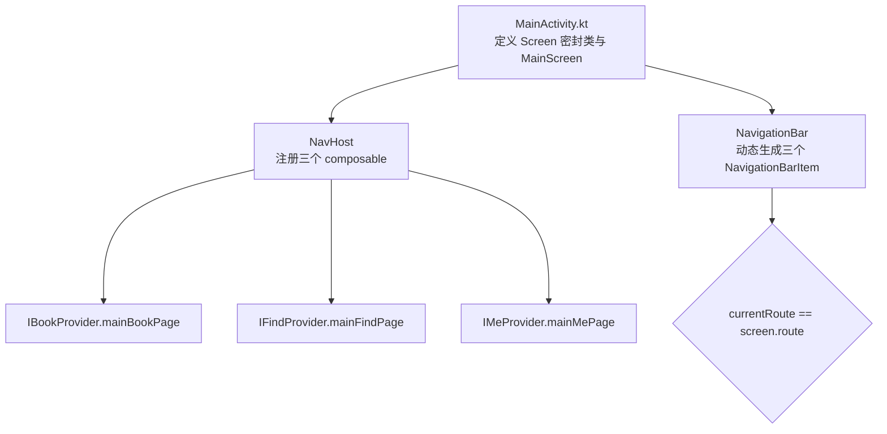
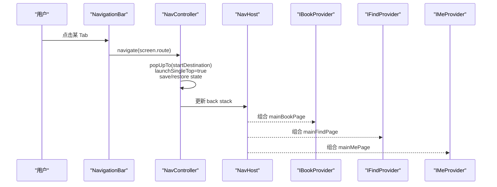
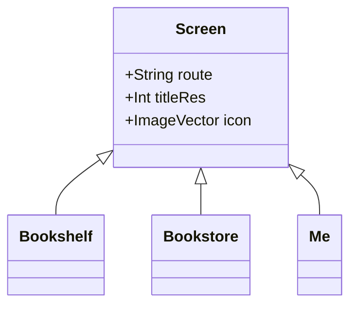
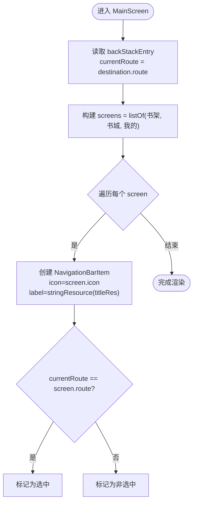
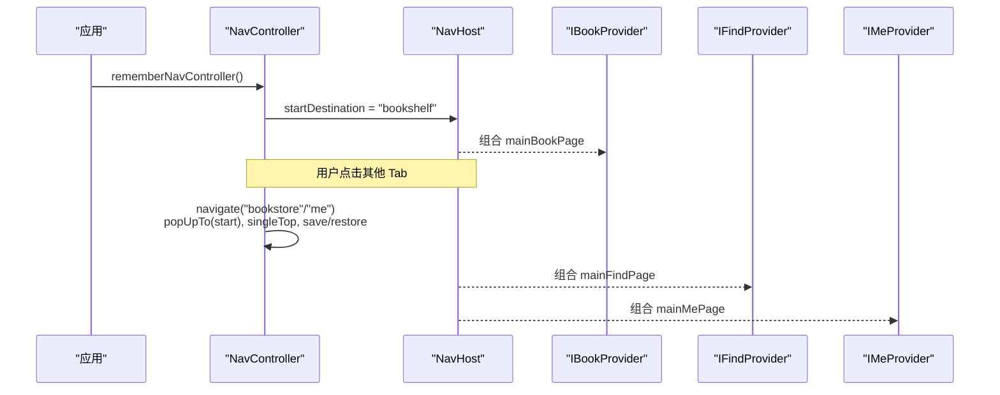
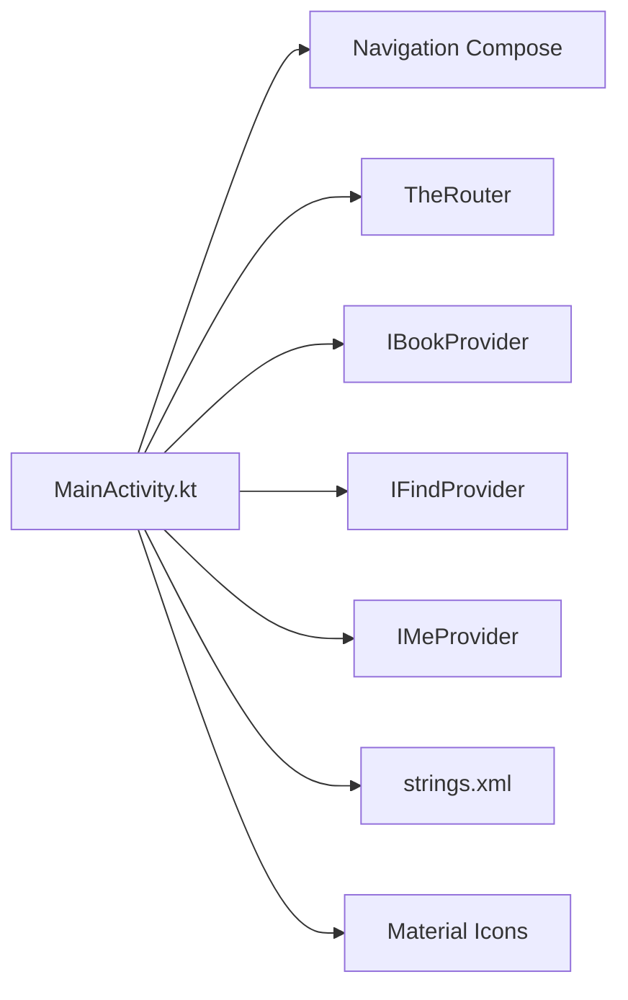

# Screen 路由定义

<cite>
**本文引用的文件**   
- [MainActivity.kt](file://module_main/src/main/java/com/ebook/main/MainActivity.kt)
- [strings.xml](file://module_main/src/main/res/values/strings.xml)
- [IBookProvider.kt](file://lib_book_common/src/main/java/com/ebook/common/provider/IBookProvider.kt)
- [IFindProvider.kt](file://lib_book_common/src/main/java/com/ebook/common/provider/IFindProvider.kt)
- [IMeProvider.kt](file://lib_book_common/src/main/java/com/ebook/common/provider/IMeProvider.kt)
</cite>

## 目录
1. [简介](#简介)
2. [项目结构](#项目结构)
3. [核心组件](#核心组件)
4. [架构总览](#架构总览)
5. [详细组件分析](#详细组件分析)
6. [依赖关系分析](#依赖关系分析)
7. [性能与行为特性](#性能与行为特性)
8. [故障排查指南](#故障排查指南)
9. [结论](#结论)
10. [附录：扩展与示例](#附录：扩展与示例)

## 简介
本文件聚焦于主模块中的 Screen 密封类及其在底部导航（Tab）中的作用。Screen 以 sealed class 的形式集中声明三个内置 Tab：书架、书城、我的，每个条目包含用于 NavHost 的路由字符串、字符串资源引用和图标 ImageVector。主页通过一个 NavHost 管理这三个页面，并以 NavigationBar 动态渲染底部导航项；选中态由当前回退栈的 route 与 Screen.route 比较得出。该设计使新增 Tab 变得可预测且易于维护：只需增加 data object、配置字符串与图标，并在宿主中注册路由即可。

## 项目结构
- 路由与 UI 容器集中在 module_main 的 MainActivity.kt，其中定义了 Screen 密封类与主页骨架 MainScreen Composable。
- 字符串资源位于 module_main 的 strings.xml，提供三个 Tab 的标题文案。
- 各功能模块通过 Provider 接口暴露 Compose 页面入口，被宿主以 TheRouter 获取并组合到 NavHost 中。

图表来源
- [MainActivity.kt:123-197](file://module_main/src/main/java/com/ebook/main/MainActivity.kt#L123-L197)

章节来源
- [MainActivity.kt:123-197](file://module_main/src/main/java/com/ebook/main/MainActivity.kt#L123-L197)
- [strings.xml:3-5](file://module_main/src/main/res/values/strings.xml#L3-L5)

## 核心组件
- Screen 密封类：集中承载三个内置路由的定义，包括 route、titleRes、icon。
- MainScreen Composable：负责创建 NavController、读取当前回退栈、构建底部导航栏与 NavHost。
- Provider 接口：IBookProvider、IFindProvider、IMeProvider，分别对应书架、书城、我的的页面入口。

关键要点
- route：用于 NavHost 的 composable 注册与跳转。
- titleRes：NavigationBarItem 的 label 与 contentDescription 均使用 stringResource(screen.titleRes)。
- icon：使用 Material Icons.Default 的 Book、Explore、Person 作为默认图标。

章节来源
- [MainActivity.kt:123-127](file://module_main/src/main/java/com/ebook/main/MainActivity.kt#L123-L127)
- [IBookProvider.kt:5-13](file://lib_book_common/src/main/java/com/ebook/common/provider/IBookProvider.kt#L5-L13)
- [IFindProvider.kt:5-13](file://lib_book_common/src/main/java/com/ebook/common/provider/IFindProvider.kt#L5-L13)
- [IMeProvider.kt:5-13](file://lib_book_common/src/main/java/com/ebook/common/provider/IMeProvider.kt#L5-L13)

## 架构总览
屏幕路由与导航流程如下：
- 底部导航项通过 listOf(Screen.Bookshelf, Screen.Bookstore, Screen.Me) 遍历生成。
- 点击某个 NavigationBarItem 时，调用 navController.navigate(screen.route)，并使用 launchSingleTop、popUpTo 起始目的地、保存与恢复状态。
- 选中态计算基于 currentBackStackEntryAsState 派生的 currentRoute，并与 screen.route 做相等性比较。
- NavHost 启动目标为 Screen.Bookshelf.route，并通过 TheRouter 获取各模块 Provider 的 Compose 页面进行组合。

图表来源
- [MainActivity.kt:140-197](file://module_main/src/main/java/com/ebook/main/MainActivity.kt#L140-L197)

章节来源
- [MainActivity.kt:140-197](file://module_main/src/main/java/com/ebook/main/MainActivity.kt#L140-L197)

## 详细组件分析

### Screen 密封类与三个内置路由
- Bookshelf：route 为 "bookshelf"，标题来自 R.string.title_bookshelf，图标为 Icons.Default.Book。
- Bookstore：route 为 "bookstore"，标题来自 R.string.title_bookstore，图标为 Icons.Default.Explore。
- Me：route 为 "me"，标题来自 R.string.title_me，图标为 Icons.Default.Person。

语义与用途
- 书架：本地书籍管理与阅读入口。
- 书城：发现与搜索书源内容。
- 我的：个人中心、设置、版本检查等。

图表来源
- [MainActivity.kt:123-127](file://module_main/src/main/java/com/ebook/main/MainActivity.kt#L123-L127)

章节来源
- [MainActivity.kt:123-127](file://module_main/src/main/java/com/ebook/main/MainActivity.kt#L123-L127)
- [strings.xml:3-5](file://module_main/src/main/res/values/strings.xml#L3-L5)

### 导航项的动态生成与选中态判断
- 列表：listOf(Screen.Bookshelf, Screen.Bookstore, Screen.Me) 提供固定三元素集合。
- 遍历：forEach 循环为每个 screen 创建一个 NavigationBarItem。
- 图标与标签：Icon(screen.icon) 与 Text(stringResource(screen.titleRes))。
- 选中态：selected = currentRoute == screen.route，来源于 currentBackStackEntryAsState 的 destination.route。

图表来源
- [MainActivity.kt:140-172](file://module_main/src/main/java/com/ebook/main/MainActivity.kt#L140-L172)

章节来源
- [MainActivity.kt:140-172](file://module_main/src/main/java/com/ebook/main/MainActivity.kt#L140-L172)

### NavHost 路由注册与页面组合
- startDestination 设置为 Screen.Bookshelf.route。
- 三个 composable 分别绑定到各自 route，并通过 TheRouter 获取 Provider 的 @Composable 页面进行组合。
- 切换 Tab 时保持状态：navigate 参数包含 popUpTo 起始目的地、launchSingleTop、saveState/restoreState。

图表来源
- [MainActivity.kt:175-197](file://module_main/src/main/java/com/ebook/main/MainActivity.kt#L175-L197)

章节来源
- [MainActivity.kt:175-197](file://module_main/src/main/java/com/ebook/main/MainActivity.kt#L175-L197)

## 依赖关系分析
- MainActivity 依赖 AndroidX Navigation Compose 与 Material3 组件。
- 通过 TheRouter 获取跨模块 Provider 接口，避免直接耦合具体模块实现。
- 字符串资源与图标资源由 Android 资源系统与 Material Icons 提供。

图表来源
- [MainActivity.kt:123-197](file://module_main/src/main/java/com/ebook/main/MainActivity.kt#L123-L197)
- [IBookProvider.kt:5-13](file://lib_book_common/src/main/java/com/ebook/common/provider/IBookProvider.kt#L5-L13)
- [IFindProvider.kt:5-13](file://lib_book_common/src/main/java/com/ebook/common/provider/IFindProvider.kt#L5-L13)
- [IMeProvider.kt:5-13](file://lib_book_common/src/main/java/com/ebook/common/provider/IMeProvider.kt#L5-L13)

章节来源
- [MainActivity.kt:123-197](file://module_main/src/main/java/com/ebook/main/MainActivity.kt#L123-L197)
- [IBookProvider.kt:5-13](file://lib_book_common/src/main/java/com/ebook/common/provider/IBookProvider.kt#L5-L13)
- [IFindProvider.kt:5-13](file://lib_book_common/src/main/java/com/ebook/common/provider/IFindProvider.kt#L5-L13)
- [IMeProvider.kt:5-13](file://lib_book_common/src/main/java/com/ebook/common/provider/IMeProvider.kt#L5-L13)

## 性能与行为特性
- 单一数据源：选中态由回退栈派生，避免额外本地状态导致不同步问题。
- 状态保留：navigate 参数启用 popUpTo、saveState、restoreState，保证切 Tab 后状态不丢失。
- 启动优化：startDestination 固定为首个 Tab，减少初始导航开销。
- 资源加载：图标与字符串资源按需加载，无额外运行时负担。

[本节为通用性能说明，无需特定文件来源]

## 故障排查指南
- 路由未生效：检查 NavHost 是否注册了对应 composable，以及 TheRouter 是否能获取到 Provider。
- 选中态异常：确认 currentBackStackEntryAsState 是否正常返回 destination.route，并确保 navigate 使用 launchSingleTop 与正确的 popUpTo。
- 文案缺失：确保 strings.xml 中包含对应 title_*. 资源名。
- 图标显示异常：确认使用的是 Material Icons.Default 中存在的图标名称。

章节来源
- [MainActivity.kt:140-197](file://module_main/src/main/java/com/ebook/main/MainActivity.kt#L140-L197)
- [strings.xml:3-5](file://module_main/src/main/res/values/strings.xml#L3-L5)

## 结论
Screen 密封类将路由元数据与展示信息聚合在同一处，配合 MainScreen 的动态渲染与状态管理，形成清晰、可扩展的底部导航方案。通过 Provider 接口解耦模块依赖，新增 Tab 的流程标准化且风险可控。

[本节为总结性内容，无需特定文件来源]

## 附录：扩展与示例

### 如何添加第四个 Tab（例如“发现”页）
步骤清单
- 在 Screen 密封类中添加新的 data object，定义 route、titleRes、icon。
- 在 strings.xml 中新增对应的标题字符串资源。
- 在 MainScreen 的 NavigationBar 列表中将该新 Screen 加入 listOf(...)。
- 在 NavHost 中为该 route 新增 composable，并通过 TheRouter 获取对应 Provider 的页面进行组合。
- 如需要条件显示，可在生成列表前对 screens 进行过滤（例如根据登录状态或功能开关）。

参考路径
- 新增 Screen 与列表位置：[MainActivity.kt:123-155](file://module_main/src/main/java/com/ebook/main/MainActivity.kt#L123-L155)
- 新增 composable 路由：[MainActivity.kt:175-197](file://module_main/src/main/java/com/ebook/main/MainActivity.kt#L175-L197)
- 字符串资源位置：[strings.xml:3-5](file://module_main/src/main/res/values/strings.xml#L3-L5)

### 如何实现条件显示
思路
- 在 MainScreen 中构造可变列表（如 mutableList），先加入基础 Tab，再根据条件追加新 Tab。
- 或者直接在 listOf 之后调用 filter / take 等函数进行筛选。
- 若某些 Tab 需要登录后才可见，可将条件与用户会话状态结合。

参考位置
- 列表构建与 forEach：[MainActivity.kt:151-172](file://module_main/src/main/java/com/ebook/main/MainActivity.kt#L151-L172)

### 如何为不同屏幕适配不同的图标样式
思路
- 使用不同的 Material Icons.Default 图标常量（如 Book、Explore、Person）。
- 如需自定义图标，可替换为自定义 ImageVector 或矢量资源。
- 若需要区分选中/常态颜色，可由 NavigationBar 语义色承担；也可在 Icon 外层包裹 tint 控制。

参考位置
- 图标定义与使用：[MainActivity.kt:123-159](file://module_main/src/main/java/com/ebook/main/MainActivity.kt#L123-L159)