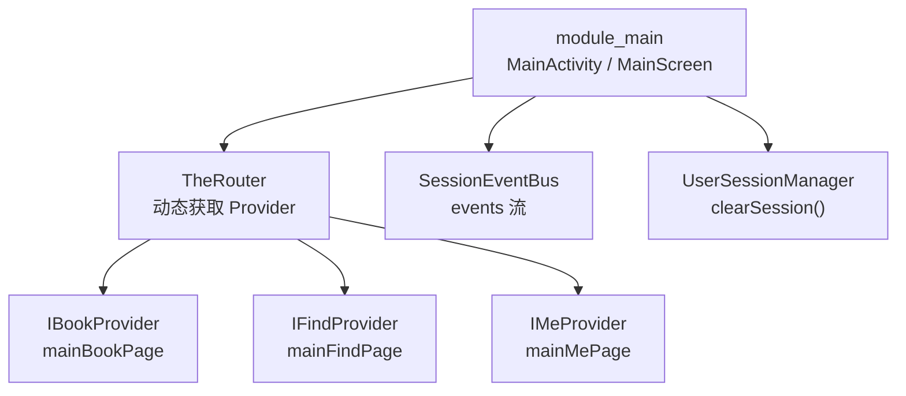
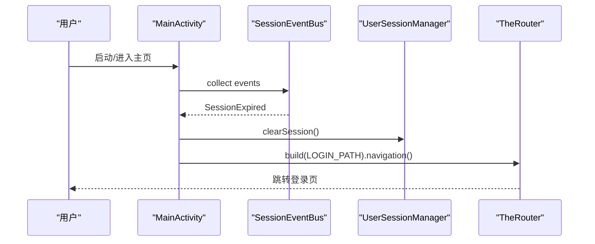
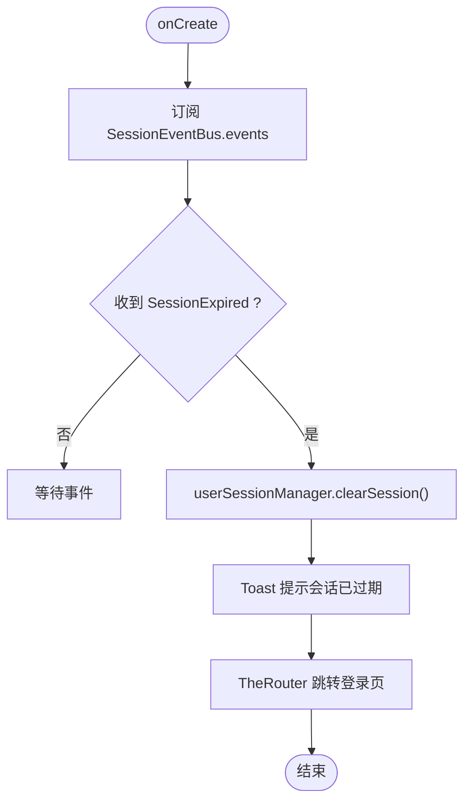
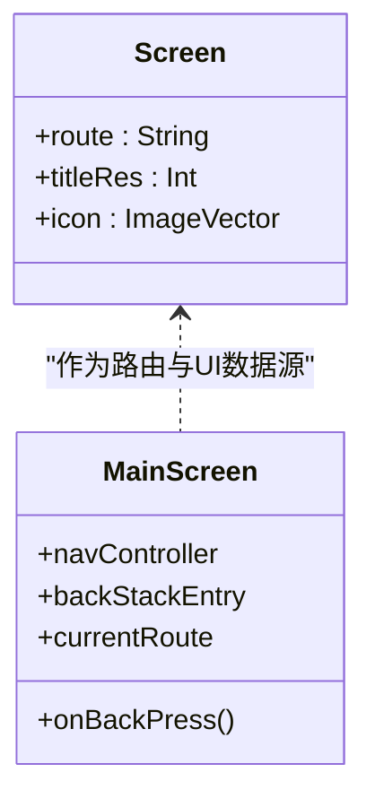
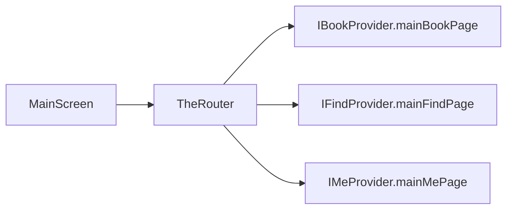
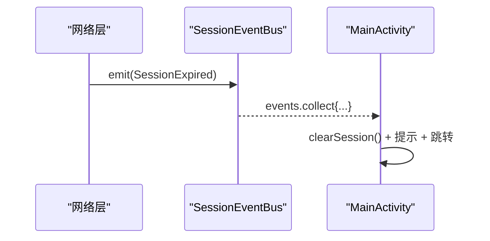
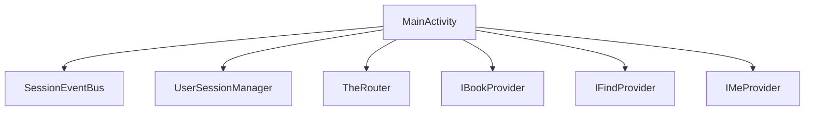

# 主界面模块 (module_main)

<cite>
**本文引用的文件**
- [MainActivity.kt](file://module_main/src/main/java/com/ebook/main/MainActivity.kt)
- [IBookProvider.kt](file://lib_book_common/src/main/java/com/ebook/common/provider/IBookProvider.kt)
- [IFindProvider.kt](file://lib_book_common/src/main/java/com/ebook/common/provider/IFindProvider.kt)
- [IMeProvider.kt](file://lib_book_common/src/main/java/com/ebook/common/provider/IMeProvider.kt)
- [SessionEventBus.kt](file://lib_ebook_api/src/main/java/com/ebook/api/auth/SessionEventBus.kt)
</cite>

## 目录
1. [简介](#简介)
2. [项目结构](#项目结构)
3. [核心组件](#核心组件)
4. [架构总览](#架构总览)
5. [详细组件分析](#详细组件分析)
6. [依赖关系分析](#依赖关系分析)
7. [性能与可维护性](#性能与可维护性)
8. [故障排查指南](#故障排查指南)
9. [结论](#结论)
10. [附录：扩展与最佳实践](#附录：扩展与最佳实践)

## 简介
本模块是应用的主界面容器，承载底部导航与三个 Tab（书架、书城、我的）的导航管理、状态保持与会话过期处理。其采用 Jetpack Compose + Navigation 实现页面组合与回退栈管理；通过 Provider 接口与 TheRouter 动态加载各模块页面；在 MainActivity 中订阅 SessionEventBus，统一处理会话过期（清会话、提示并跳转登录页）。

## 项目结构
- module_main：主页宿主与启动页，包含 MainActivity 与 MainScreen（底部导航 + NavHost），并通过 TheRouter 获取 IBookProvider/IFindProvider/IMeProvider 暴露的 Composable 页面。
- lib_book_common：定义跨模块 Provider 接口（IBookProvider/IFindProvider/IMeProvider），用于解耦模块间直接依赖。
- lib_ebook_api：提供 SessionEventBus 与会话事件模型，供上层统一处理会话过期。

图表来源
- [MainActivity.kt:100-197](file://module_main/src/main/java/com/ebook/main/MainActivity.kt#L100-L197)
- [SessionEventBus.kt:9-44](file://lib_ebook_api/src/main/java/com/ebook/api/auth/SessionEventBus.kt#L9-L44)
- [IBookProvider.kt:1-13](file://lib_book_common/src/main/java/com/ebook/common/provider/IBookProvider.kt#L1-L13)
- [IFindProvider.kt:1-13](file://lib_book_common/src/main/java/com/ebook/common/provider/IFindProvider.kt#L1-L13)
- [IMeProvider.kt:1-13](file://lib_book_common/src/main/java/com/ebook/common/provider/IMeProvider.kt#L1-L13)

章节来源
- [MainActivity.kt:45-197](file://module_main/src/main/java/com/ebook/main/MainActivity.kt#L45-L197)
- [SessionEventBus.kt:9-44](file://lib_ebook_api/src/main/java/com/ebook/api/auth/SessionEventBus.kt#L9-L44)
- [IBookProvider.kt:1-13](file://lib_book_common/src/main/java/com/ebook/common/provider/IBookProvider.kt#L1-L13)
- [IFindProvider.kt:1-13](file://lib_book_common/src/main/java/com/ebook/common/provider/IFindProvider.kt#L1-L13)
- [IMeProvider.kt:1-13](file://lib_book_common/src/main/java/com/ebook/common/provider/IMeProvider.kt#L1-L13)

## 核心组件
- MainActivity：应用主入口 Activity，负责生命周期内的会话事件订阅与退出确认逻辑；使用 Compose 基类控制主题与 insets。
- Screen：密封类定义三个 Tab 的路由键、标题资源与图标，作为导航单一数据源。
- MainScreen：Compose 容器，封装底部导航栏与 NavHost，实现 Tab 切换、状态保持与 BackHandler 退出流程。
- Provider 接口（IBookProvider/IFindProvider/IMeProvider）：跨模块暴露 Composable 页面，使主界面无需知道具体模块实现。
- SessionEventBus：网络层与会话相关的统一事件总线，支持会话过期事件的幂等分发。

章节来源
- [MainActivity.kt:45-197](file://module_main/src/main/java/com/ebook/main/MainActivity.kt#L45-L197)
- [IBookProvider.kt:1-13](file://lib_book_common/src/main/java/com/ebook/common/provider/IBookProvider.kt#L1-L13)
- [IFindProvider.kt:1-13](file://lib_book_common/src/main/java/com/ebook/common/provider/IFindProvider.kt#L1-L13)
- [IMeProvider.kt:1-13](file://lib_book_common/src/main/java/com/ebook/common/provider/IMeProvider.kt#L1-L13)
- [SessionEventBus.kt:9-44](file://lib_ebook_api/src/main/java/com/ebook/api/auth/SessionEventBus.kt#L9-L44)

## 架构总览
主界面以 Compose 为中心，使用 rememberNavController 创建导航控制器，currentBackStackEntryAsState 派生当前路由，NavigationBar 根据路由决定选中态。NavHost 将三个 Tab 路由映射到 Provider 返回的 Composable，从而实现模块解耦与动态加载。会话过期时，MainActivity 收集 SessionEventBus 的事件，调用 UserSessionManager.clearSession 清理会话，Toast 提示后通过 TheRouter 跳转到登录页。

图表来源
- [MainActivity.kt:68-79](file://module_main/src/main/java/com/ebook/main/MainActivity.kt#L68-L79)
- [SessionEventBus.kt:9-44](file://lib_ebook_api/src/main/java/com/ebook/api/auth/SessionEventBus.kt#L9-L44)

## 详细组件分析

### MainActivity 与会话过期处理
- 生命周期内订阅 SessionEventBus.events，收到 SessionExpired 时执行：
  - 清理会话：userSessionManager.clearSession()
  - 提示用户：ToastUtil.showShort(...)
  - 跳转登录：TheRouter.build(KeyCode.Login.LOGIN_PATH).navigation()
- 退出确认：BackHandler 触发 onBackPress，实现双击退出（间隔阈值约2秒），避免误触退出。
- 系统栏避让：关闭基类 Insets 消费，交由各 Tab 顶栏自行处理，保证沉浸式体验一致。

图表来源
- [MainActivity.kt:68-79](file://module_main/src/main/java/com/ebook/main/MainActivity.kt#L68-L79)

章节来源
- [MainActivity.kt:57-114](file://module_main/src/main/java/com/ebook/main/MainActivity.kt#L57-L114)
- [SessionEventBus.kt:9-44](file://lib_ebook_api/src/main/java/com/ebook/api/auth/SessionEventBus.kt#L9-L44)

### 底部导航与 Compose 导航栈管理
- 路由定义：Screen 密封类集中定义 bookshelf/bookstore/me 路由键、标题与图标，确保 UI 与导航一致性。
- 导航控制器：rememberNavController 创建 NavHost 控制器，currentBackStackEntryAsState 派生当前路由，作为选中态唯一数据源。
- 状态保持：navigate 时使用 popUpTo 保存状态、launchSingleTop 去重、restoreState 恢复状态，确保切 Tab 时保留各自页面状态。
- BackHandler：拦截返回键，委托给 onBackPress 进行退出确认。
- 内容区域：Scaffold 的 bottomBar 为 NavigationBar，contentWindowInsets 设为 0.dp，由各 Tab 顶栏自行处理状态栏避让，避免重复偏移。

图表来源
- [MainActivity.kt:123-197](file://module_main/src/main/java/com/ebook/main/MainActivity.kt#L123-L197)

章节来源
- [MainActivity.kt:123-197](file://module_main/src/main/java/com/ebook/main/MainActivity.kt#L123-L197)

### Provider 集成与 TheRouter 动态加载
- 每个功能模块通过 Provider 接口暴露 mainXxxPage 的 Composable 函数，供主界面按需组合。
- 主界面通过 TheRouter.get(IBookProvider::class.java) 等获取 Provider 实例，再调用其 mainXxxPage.invoke() 渲染页面。
- 这种方式解耦了模块间的编译期依赖，新增模块只需实现对应 Provider 并在路由表中注册即可被主界面发现。

图表来源
- [MainActivity.kt:184-194](file://module_main/src/main/java/com/ebook/main/MainActivity.kt#L184-L194)
- [IBookProvider.kt:1-13](file://lib_book_common/src/main/java/com/ebook/common/provider/IBookProvider.kt#L1-L13)
- [IFindProvider.kt:1-13](file://lib_book_common/src/main/java/com/ebook/common/provider/IFindProvider.kt#L1-L13)
- [IMeProvider.kt:1-13](file://lib_book_common/src/main/java/com/ebook/common/provider/IMeProvider.kt#L1-L13)

章节来源
- [MainActivity.kt:184-194](file://module_main/src/main/java/com/ebook/main/MainActivity.kt#L184-L194)
- [IBookProvider.kt:1-13](file://lib_book_common/src/main/java/com/ebook/common/provider/IBookProvider.kt#L1-L13)
- [IFindProvider.kt:1-13](file://lib_book_common/src/main/java/com/ebook/common/provider/IFindProvider.kt#L1-L13)
- [IMeProvider.kt:1-13](file://lib_book_common/src/main/java/com/ebook/common/provider/IMeProvider.kt#L1-L13)

### 会话事件总线（SessionEventBus）设计
- 事件模型：SessionEvent.SessionExpired 表示 refresh token 失败，无法恢复会话。
- 事件总线：基于 MutableSharedFlow，extraBufferCapacity=1，非阻塞 tryEmit，允许丢弃重复事件，避免阻塞请求线程。
- 订阅约定：上层（如 MainActivity）收集 events，收到 SessionExpired 时幂等执行“清会话+提示+跳转登录”。

图表来源
- [SessionEventBus.kt:9-44](file://lib_ebook_api/src/main/java/com/ebook/api/auth/SessionEventBus.kt#L9-L44)
- [MainActivity.kt:68-79](file://module_main/src/main/java/com/ebook/main/MainActivity.kt#L68-L79)

章节来源
- [SessionEventBus.kt:9-44](file://lib_ebook_api/src/main/java/com/ebook/api/auth/SessionEventBus.kt#L9-L44)
- [MainActivity.kt:68-79](file://module_main/src/main/java/com/ebook/main/MainActivity.kt#L68-L79)

## 依赖关系分析
- MainActivity 依赖：
  - SessionEventBus：接收会话过期事件
  - UserSessionManager：清理会话
  - TheRouter：跳转到登录页
  - Provider 接口：动态加载各模块页面
- 模块间解耦：
  - 通过 Provider 接口与 TheRouter，主界面不直接依赖模块内部实现
  - 各模块只需实现对应 Provider 并在路由表注册即可被主界面发现

图表来源
- [MainActivity.kt:68-79](file://module_main/src/main/java/com/ebook/main/MainActivity.kt#L68-L79)
- [MainActivity.kt:184-194](file://module_main/src/main/java/com/ebook/main/MainActivity.kt#L184-L194)

章节来源
- [MainActivity.kt:68-79](file://module_main/src/main/java/com/ebook/main/MainActivity.kt#L68-L79)
- [MainActivity.kt:184-194](file://module_main/src/main/java/com/ebook/main/MainActivity.kt#L184-L194)

## 性能与可维护性
- 状态保持：使用 Navigation 的状态保存机制（saveState/restoreState），避免额外状态同步问题。
- 事件处理：SessionEventBus 使用 SharedFlow 与缓冲容量限制，防止并发风暴导致阻塞或重复处理。
- 模块化：Provider 接口与 TheRouter 降低耦合，便于扩展新模块与替换实现。
- 可测试性：各模块可通过 Provider 接口进行 Mock，便于单元测试与独立运行。

## 故障排查指南
- 会话不过期但无提示：检查 SessionEventBus 是否正确发射事件，以及 MainActivity 是否正确订阅并处理。
- 跳转登录失败：确认 TheRouter 是否已配置 LOGIN_PATH，或在独立模式下存在占位路由。
- Tab 状态丢失：检查 navigate 参数是否包含 saveState/restoreState，并确保 startDestination 正确设置。
- Provider 为空：确认对应模块已实现 Provider 接口并在路由表中注册。

章节来源
- [MainActivity.kt:68-79](file://module_main/src/main/java/com/ebook/main/MainActivity.kt#L68-L79)
- [MainActivity.kt:184-194](file://module_main/src/main/java/com/ebook/main/MainActivity.kt#L184-L194)

## 结论
主界面模块通过 Compose Navigation 与 Provider 接口实现了模块解耦与动态加载，结合 SessionEventBus 提供了统一的会话过期处理机制。其设计清晰、可扩展性强，适合多模块协作与独立开发调试。

## 附录：扩展与最佳实践
- 添加新 Tab：
  - 在 Screen 密封类中新增路由定义
  - 在 NavHost 中添加 composable 映射
  - 通过 TheRouter 获取新 Provider 的 Composable 页面
- 页面间通信：
  - 使用 ViewModel + Flow 进行状态共享
  - 通过 Provider 接口传递必要参数（如回调函数）
- 导航状态管理：
  - 使用 currentBackStackEntryAsState 派生选中态
  - 合理使用 popUpTo/saveState/restoreState 保持状态
- 会话处理：
  - 在主界面统一订阅 SessionEventBus
  - 清会话后跳转登录页，避免状态不一致

章节来源
- [MainActivity.kt:123-197](file://module_main/src/main/java/com/ebook/main/MainActivity.kt#L123-L197)
- [IBookProvider.kt:1-13](file://lib_book_common/src/main/java/com/ebook/common/provider/IBookProvider.kt#L1-L13)
- [IFindProvider.kt:1-13](file://lib_book_common/src/main/java/com/ebook/common/provider/IFindProvider.kt#L1-L13)
- [IMeProvider.kt:1-13](file://lib_book_common/src/main/java/com/ebook/common/provider/IMeProvider.kt#L1-L13)
- [SessionEventBus.kt:9-44](file://lib_ebook_api/src/main/java/com/ebook/api/auth/SessionEventBus.kt#L9-L44)