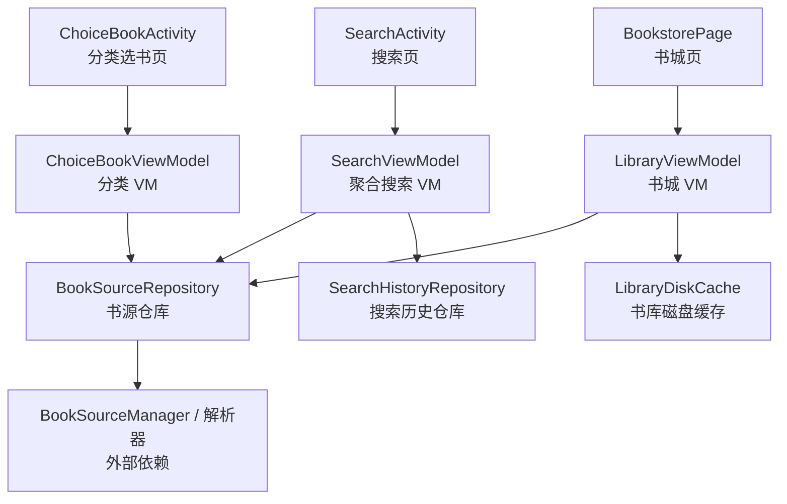
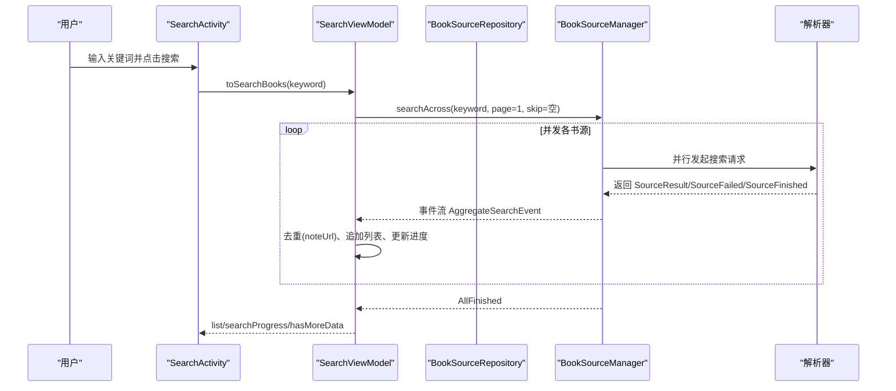
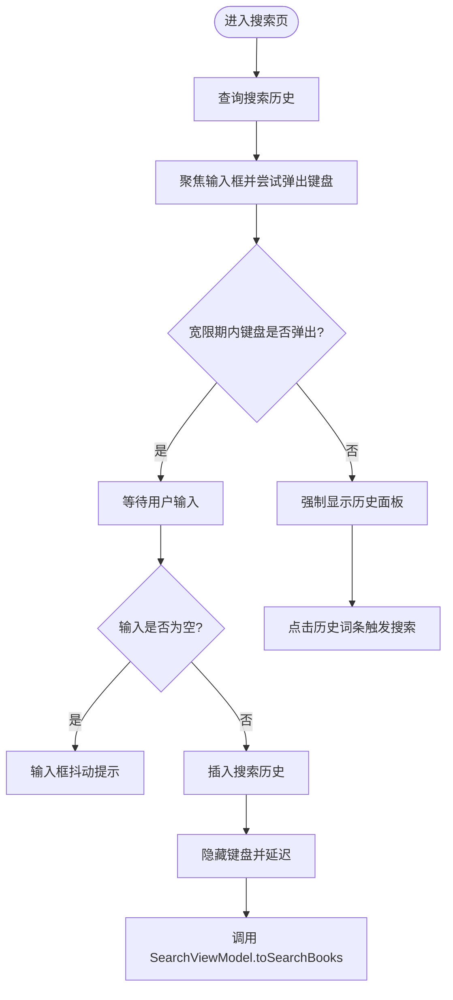
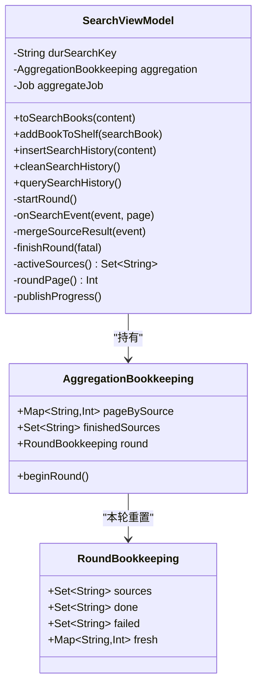
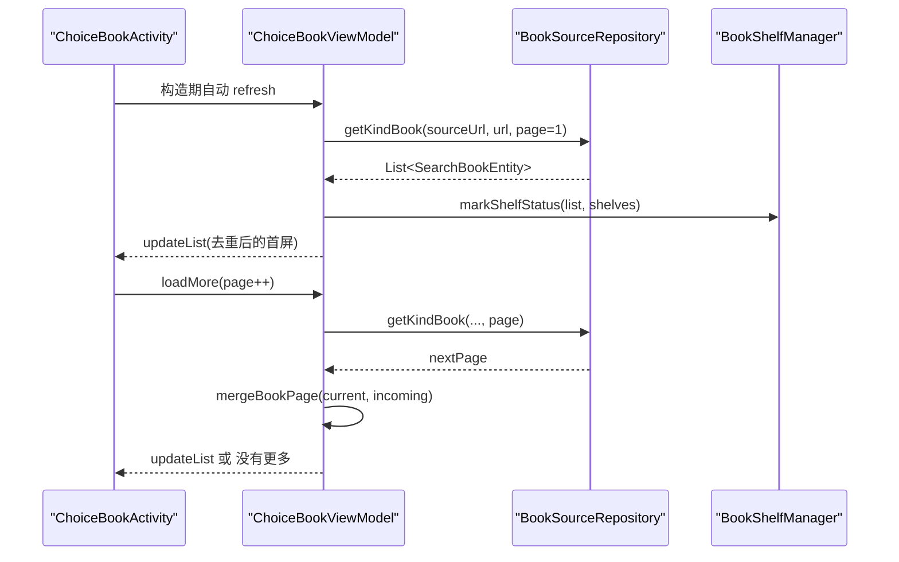
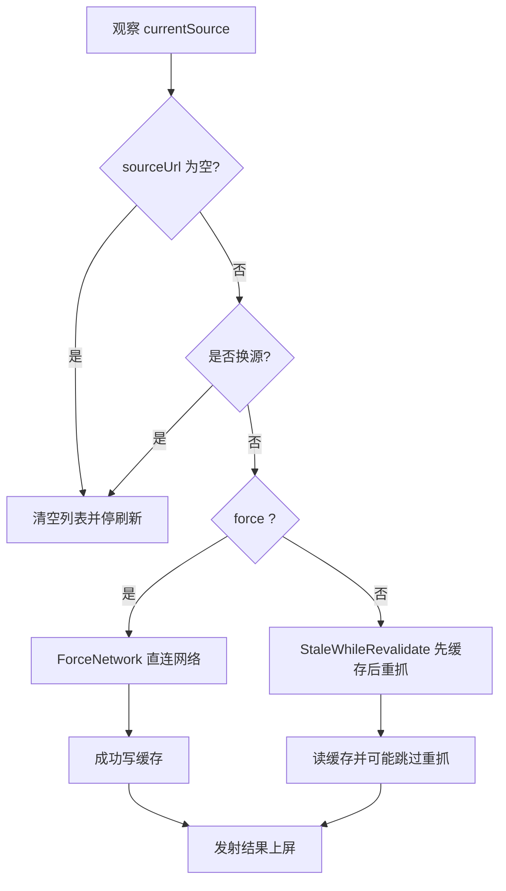
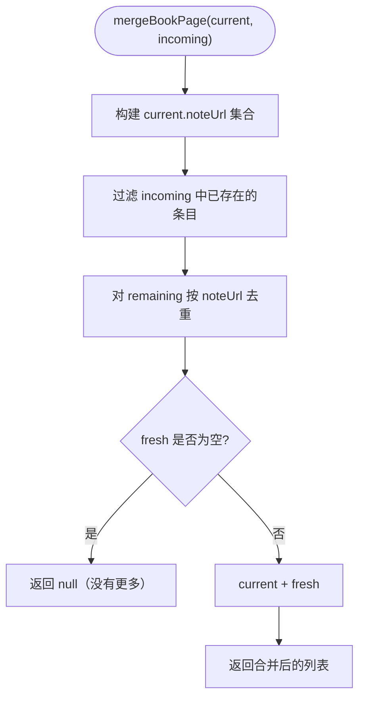
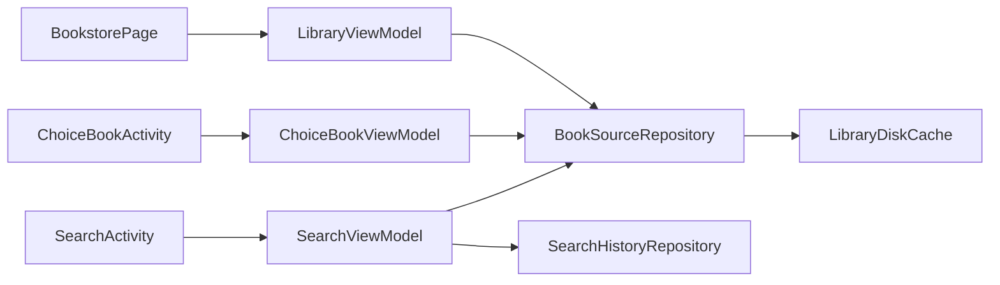

# 书城搜索模块 (module_find)

<cite>
**本文引用的文件**   
- [SearchActivity.kt](file://module_find/src/main/java/com/ebook/find/SearchActivity.kt)
- [ChoiceBookActivity.kt](file://module_find/src/main/java/com/ebook/find/ChoiceBookActivity.kt)
- [SearchViewModel.kt](file://module_find/src/main/java/com/ebook/find/mvvm/viewmodel/SearchViewModel.kt)
- [ChoiceBookViewModel.kt](file://module_find/src/main/java/com/ebook/find/mvvm/viewmodel/ChoiceBookViewModel.kt)
- [LibraryViewModel.kt](file://module_find/src/main/java/com/ebook/find/mvvm/viewmodel/LibraryViewModel.kt)
- [BookPageMerge.kt](file://module_find/src/main/java/com/ebook/find/mvvm/viewmodel/BookPageMerge.kt)
- [BookSourceRepository.kt](file://module_find/src/main/java/com/ebook/find/repository/BookSourceRepository.kt)
- [SearchHistoryRepository.kt](file://module_find/src/main/java/com/ebook/find/repository/SearchHistoryRepository.kt)
- [LibraryCacheModule.kt](file://module_find/src/main/java/com/ebook/find/di/LibraryCacheModule.kt)
- [BookType.kt](file://module_find/src/main/java/com/ebook/find/entity/BookType.kt)
- [FindProvider.kt](file://module_find/src/main/java/com/ebook/find/provider/FindProvider.kt)
- [BookstorePage.kt](file://module_find/src/main/java/com/ebook/find/page/BookstorePage.kt)
- [SearchBookItem.kt](file://module_find/src/main/java/com/ebook/find/view/SearchBookItem.kt)
</cite>

## 目录
1. [引言](#引言)
2. [项目结构](#项目结构)
3. [核心组件](#核心组件)
4. [架构总览](#架构总览)
5. [详细组件分析](#详细组件分析)
6. [依赖关系分析](#依赖关系分析)
7. [性能与优化策略](#性能与优化策略)
8. [故障排查指南](#故障排查指南)
9. [结论](#结论)
10. [附录：扩展点与配置说明](#附录扩展点与配置说明)

## 引言
本模块负责“书城搜索”相关能力，包含三类用户流程：
- 搜索页：输入关键词后并发请求多个书源，边收边聚合结果，支持按源分页加载更多。
- 分类选书页：从书城分类入口进入，查看同一分类下某书源的多页书籍列表。
- 书城主页：顶部书源切换、分类入口展示、书库数据加载（与本模块搜索强相关）。

该实现遵循 MVVM 架构：Activity/Compose 页面仅持有 UI 状态并消费 ViewModel 的 StateFlow；ViewModel 通过 Repository 协调网络与本地缓存；Repository 调用底层 BookSourceManager 与解析器，完成多书源数据获取。

## 项目结构
module_find 以功能维度组织代码：
- Activity 层：SearchActivity、ChoiceBookActivity。
- MVVM 层：SearchViewModel、ChoiceBookViewModel、LibraryViewModel、BookPageMerge。
- Repository 层：BookSourceRepository、SearchHistoryRepository。
- DI 与实体：LibraryCacheModule、BookType。
- Provider 与页面：FindProvider、BookstorePage。
- 视图组件：SearchBookItem。

**图示来源**
- [SearchActivity.kt:1-781](file://module_find/src/main/java/com/ebook/find/SearchActivity.kt#L1-L781)
- [SearchViewModel.kt:1-499](file://module_find/src/main/java/com/ebook/find/mvvm/viewmodel/SearchViewModel.kt#L1-L499)
- [ChoiceBookActivity.kt:1-93](file://module_find/src/main/java/com/ebook/find/ChoiceBookActivity.kt#L1-L93)
- [ChoiceBookViewModel.kt:1-174](file://module_find/src/main/java/com/ebook/find/mvvm/viewmodel/ChoiceBookViewModel.kt#L1-L174)
- [LibraryViewModel.kt:1-294](file://module_find/src/main/java/com/ebook/find/mvvm/viewmodel/LibraryViewModel.kt#L1-L294)
- [BookSourceRepository.kt:1-199](file://module_find/src/main/java/com/ebook/find/repository/BookSourceRepository.kt#L1-L199)
- [SearchHistoryRepository.kt:1-42](file://module_find/src/main/java/com/ebook/find/repository/SearchHistoryRepository.kt#L1-L42)
- [LibraryCacheModule.kt:1-47](file://module_find/src/main/java/com/ebook/find/di/LibraryCacheModule.kt#L1-L47)

**章节来源**
- [SearchActivity.kt:1-200](file://module_find/src/main/java/com/ebook/find/SearchActivity.kt#L1-L200)
- [BookstorePage.kt:1-200](file://module_find/src/main/java/com/ebook/find/page/BookstorePage.kt#L1-L200)

## 核心组件
- SearchActivity：搜索入口，处理输入、键盘交互、历史面板动画、搜索结果列表渲染与加载更多。
- SearchViewModel：一次搜全站的聚合搜索，维护按源分页游标、去重集合、进度和失败态。
- ChoiceBookActivity + ChoiceBookViewModel：分类书籍列表，锁定单一书源会话，支持分页加载与书架同步。
- LibraryViewModel + BookstorePage：书城主 Tab，按当前书源驱动分类与书库数据，并提供 SWR 缓存策略。
- BookSourceRepository：统一封装分类条目、分类书籍、书库数据，集中管理缓存策略与异常语义。
- SearchHistoryRepository：搜索历史的 upsert、清空、查询。
- BookPageMerge：跨页合并去重的纯函数，被分类页与搜索页复用。

**章节来源**
- [SearchActivity.kt:1-200](file://module_find/src/main/java/com/ebook/find/SearchActivity.kt#L1-L200)
- [SearchViewModel.kt:1-200](file://module_find/src/main/java/com/ebook/find/mvvm/viewmodel/SearchViewModel.kt#L1-L200)
- [ChoiceBookActivity.kt:1-93](file://module_find/src/main/java/com/ebook/find/ChoiceBookActivity.kt#L1-L93)
- [ChoiceBookViewModel.kt:1-174](file://module_find/src/main/java/com/ebook/find/mvvm/viewmodel/ChoiceBookViewModel.kt#L1-L174)
- [LibraryViewModel.kt:1-200](file://module_find/src/main/java/com/ebook/find/mvvm/viewmodel/LibraryViewModel.kt#L1-L200)
- [BookSourceRepository.kt:1-199](file://module_find/src/main/java/com/ebook/find/repository/BookSourceRepository.kt#L1-L199)
- [SearchHistoryRepository.kt:1-42](file://module_find/src/main/java/com/ebook/find/repository/SearchHistoryRepository.kt#L1-L42)
- [BookPageMerge.kt:1-23](file://module_find/src/main/java/com/ebook/find/mvvm/viewmodel/BookPageMerge.kt#L1-L23)

## 架构总览
模块采用分层职责清晰的 MVVM：
- UI 层（Activity/Compose）只消费 StateFlow，不直接发起网络。
- ViewModel 负责状态机、分页游标、并发调度与错误收敛。
- Repository 封装缓存策略、异常类型与数据流形状。
- 外部 BookSourceManager/解析器负责具体书源协议。

**图示来源**
- [SearchActivity.kt:201-535](file://module_find/src/main/java/com/ebook/find/SearchActivity.kt#L201-L535)
- [SearchViewModel.kt:201-499](file://module_find/src/main/java/com/ebook/find/mvvm/viewmodel/SearchViewModel.kt#L201-L499)

## 详细组件分析

### SearchActivity：搜索页与历史面板
职责要点：
- 使用 Compose 重写页面骨架：搜索栏 + 基类列表区 + 覆盖的历史面板。
- 软键盘状态驱动历史面板开合：弹出→揭示；收起→未搜索过则退出，否则收起面板。
- 圆形揭示动画：Animatable + GenericShape 裁剪，对齐旧 ViewAnimationUtils 体验。
- 搜索结果列表：key 必须为 noteUrl；条目支持查看详情与加入书架。
- 加载更多：委托给 SearchViewModel.loadMore，由基类 LoadMoreFooter 呈现。

**图示来源**
- [SearchActivity.kt:1-200](file://module_find/src/main/java/com/ebook/find/SearchActivity.kt#L1-L200)
- [SearchActivity.kt:201-535](file://module_find/src/main/java/com/ebook/find/SearchActivity.kt#L201-L535)

**章节来源**
- [SearchActivity.kt:1-200](file://module_find/src/main/java/com/ebook/find/SearchActivity.kt#L1-L200)
- [SearchActivity.kt:201-535](file://module_find/src/main/java/com/ebook/find/SearchActivity.kt#L201-L535)

### SearchViewModel：多书源聚合搜索
关键机制：
- 并发聚合：searchAcross 订阅事件流，逐源 SourceStarted/SourceResult/SourceFailed/SourceFinished/AllFinished。
- 去重策略：全局按 noteUrl 去重，同名不同源的条目保留，为后续跨源换源留空间。
- 分页游标：每源独立 pageBySource；一轮结束后只有 hasMore 且带来新条目的源才递增游标。
- 轮次控制：新一轮搜索先取消 aggregateJob，避免旧流污染新列表；loadMore 在 aggregateJob 仍活跃时忽略第二轮，避免共享簿记交错。
- 进度与失败：进度 = 已完成源数/参与源数；全部失败才置 NetworkError 覆盖层。

**图示来源**
- [SearchViewModel.kt:1-499](file://module_find/src/main/java/com/ebook/find/mvvm/viewmodel/SearchViewModel.kt#L1-L499)

**章节来源**
- [SearchViewModel.kt:1-200](file://module_find/src/main/java/com/ebook/find/mvvm/viewmodel/SearchViewModel.kt#L1-L200)
- [SearchViewModel.kt:201-499](file://module_find/src/main/java/com/ebook/find/mvvm/viewmodel/SearchViewModel.kt#L201-L499)

### ChoiceBookActivity 与 ChoiceBookViewModel：分类选书
职责要点：
- ChoiceBookActivity：标题来自路由 extras；列表项 key 为 noteUrl；整段会话锁定 sourceUrl。
- ChoiceBookViewModel：
  - 首屏自动刷新：SavedStateHandle 读取 url/source_url，构造期只执行一次，旋转重建幂等。
  - 分页加载：page=1 替换列表并按 noteUrl 去重；page>1 用 mergeBookPage 去重追加，无新条目即没有更多。
  - 书架同步：markShelfStatus 标记已加书架状态；addBookToShelf 调用 BookShelfManager 并处理失败。
  - 异常区分：BookSourceNotFoundException 表示书源失效，需引导重新导入或换源。

**图示来源**
- [ChoiceBookActivity.kt:1-93](file://module_find/src/main/java/com/ebook/find/ChoiceBookActivity.kt#L1-L93)
- [ChoiceBookViewModel.kt:1-174](file://module_find/src/main/java/com/ebook/find/mvvm/viewmodel/ChoiceBookViewModel.kt#L1-L174)

**章节来源**
- [ChoiceBookActivity.kt:1-93](file://module_find/src/main/java/com/ebook/find/ChoiceBookActivity.kt#L1-L93)
- [ChoiceBookViewModel.kt:1-174](file://module_find/src/main/java/com/ebook/find/mvvm/viewmodel/ChoiceBookViewModel.kt#L1-L174)

### LibraryViewModel 与 BookstorePage：书城主页
职责要点：
- 书源切换：sources 提供启用中的书源候选；currentSource 作为所有数据的基准。
- 书库加载：SWR 缓存策略——进页/换源优先读缓存再重抓；下拉刷新走 ForceNetwork。
- 异常状态：NoSource/BrokenSource/Ready/Unknown 四档，保证“无源”和“源坏”不互相误报。
- 分类入口：getBookTypeList 过滤空白标题，映射到 BookType。

**图示来源**
- [LibraryViewModel.kt:1-294](file://module_find/src/main/java/com/ebook/find/mvvm/viewmodel/LibraryViewModel.kt#L1-L294)
- [BookSourceRepository.kt:1-199](file://module_find/src/main/java/com/ebook/find/repository/BookSourceRepository.kt#L1-L199)

**章节来源**
- [LibraryViewModel.kt:1-200](file://module_find/src/main/java/com/ebook/find/mvvm/viewmodel/LibraryViewModel.kt#L1-L200)
- [LibraryViewModel.kt:201-294](file://module_find/src/main/java/com/ebook/find/mvvm/viewmodel/LibraryViewModel.kt#L201-L294)
- [BookstorePage.kt:1-200](file://module_find/src/main/java/com/ebook/find/page/BookstorePage.kt#L1-L200)

### BookPageMerge：分页合并与去重
BookPageMerge.mergeBookPage 是分类页与搜索页共用的纯函数：
- 将 incoming 中未在 current 出现的条目去重后追加。
- 若 incoming 没有带来任何新条目，返回 null，调用方据此设置“没有更多”。

**图示来源**
- [BookPageMerge.kt:1-23](file://module_find/src/main/java/com/ebook/find/mvvm/viewmodel/BookPageMerge.kt#L1-L23)

**章节来源**
- [BookPageMerge.kt:1-23](file://module_find/src/main/java/com/ebook/find/mvvm/viewmodel/BookPageMerge.kt#L1-L23)

### SearchBookItem：搜索结果条目
SearchBookItem 根据有效信息行数选择 TwoLine/ThreeLine 形态：
- 书名恒为一行；简介第二行；作者/书源第三行。
- 封面尺寸与列高按 3:4 比例计算，避免裁切书名。
- 右上角动作槽：已加入显示对勾且禁用，未加入显示加书架图标。
- showOrigin=false 时隐藏书源字段，适用于分类选书页。

**章节来源**
- [SearchBookItem.kt:1-200](file://module_find/src/main/java/com/ebook/find/view/SearchBookItem.kt#L1-L200)

## 依赖关系分析
模块内主要依赖方向如下：
- SearchActivity → SearchViewModel → BookSourceRepository → BookSourceManager/解析器。
- ChoiceBookActivity → ChoiceBookViewModel → BookSourceRepository。
- BookstorePage → LibraryViewModel → BookSourceRepository。
- SearchViewModel → SearchHistoryRepository。
- LibraryViewModel 与 BookSourceRepository 共用 LibraryDiskCache。

**图示来源**
- [SearchActivity.kt:1-200](file://module_find/src/main/java/com/ebook/find/SearchActivity.kt#L1-L200)
- [SearchViewModel.kt:1-200](file://module_find/src/main/java/com/ebook/find/mvvm/viewmodel/SearchViewModel.kt#L1-L200)
- [ChoiceBookActivity.kt:1-93](file://module_find/src/main/java/com/ebook/find/ChoiceBookActivity.kt#L1-L93)
- [ChoiceBookViewModel.kt:1-174](file://module_find/src/main/java/com/ebook/find/mvvm/viewmodel/ChoiceBookViewModel.kt#L1-L174)
- [BookstorePage.kt:1-200](file://module_find/src/main/java/com/ebook/find/page/BookstorePage.kt#L1-L200)
- [LibraryViewModel.kt:1-200](file://module_find/src/main/java/com/ebook/find/mvvm/viewmodel/LibraryViewModel.kt#L1-L200)
- [BookSourceRepository.kt:1-199](file://module_find/src/main/java/com/ebook/find/repository/BookSourceRepository.kt#L1-L199)
- [SearchHistoryRepository.kt:1-42](file://module_find/src/main/java/com/ebook/find/repository/SearchHistoryRepository.kt#L1-L42)
- [LibraryCacheModule.kt:1-47](file://module_find/src/main/java/com/ebook/find/di/LibraryCacheModule.kt#L1-L47)

**章节来源**
- [BookSourceRepository.kt:1-199](file://module_find/src/main/java/com/ebook/find/repository/BookSourceRepository.kt#L1-L199)
- [LibraryCacheModule.kt:1-47](file://module_find/src/main/java/com/ebook/find/di/LibraryCacheModule.kt#L1-L47)

## 性能与优化策略
- 并发聚合：SearchViewModel 通过 searchAcross 的事件流并行拉取各书源，UI 边收边渲染，减少首屏等待时间。
- 请求合并：分页游标 per-source，只在仍有结果的源继续翻页；finishedSources 集合用于 skipSourceUrls，避免无效请求。
- 缓存策略：
  - 书库数据使用 SWR（StaleWhileRevalidate）：先展示缓存，过期再重抓，避免白屏。
  - 下拉刷新走 ForceNetwork，满足“给我最新”的手势契约。
  - TTL 为 6 小时，平衡内容新鲜度与站点压力。
  - 回写守卫：至少一个分类有书才写缓存，防止坏站点的空结果长期冻结。
- 内存与集合：
  - 列表去重使用 set+distinctBy，避免重复 item key 导致崩溃。
  - 聚合簿记使用值对象整块替换，避免多处手写 clear 造成状态泄漏。
- 动画与重组：
  - 历史面板揭示动画仅在 Shape.createOutline 内读取半径，避免组合期逐帧重组。
  - 输入框抖动使用 Animatable，不影响列表布局稳定性。

**章节来源**
- [SearchViewModel.kt:201-499](file://module_find/src/main/java/com/ebook/find/mvvm/viewmodel/SearchViewModel.kt#L201-L499)
- [BookSourceRepository.kt:1-199](file://module_find/src/main/java/com/ebook/find/repository/BookSourceRepository.kt#L1-L199)
- [SearchActivity.kt:201-535](file://module_find/src/main/java/com/ebook/find/SearchActivity.kt#L201-L535)

## 故障排查指南
常见问题与定位建议：
- 搜索结果为空：
  - 检查 SearchViewModel.finishRound 的 allFailed 分支是否命中；确认是否有源发出 SourceFinished。
  - 注意软 404：部分站点越界页返回首页书目，去重后 fresh=0，会判到底。
- 加载更多异常：
  - 若 aggregateJob 仍在活跃，loadMore 会忽略第二轮；等待首轮结束后再触底。
  - activeSources 为空时直接停止加载更多。
- 分类选书“书源无效”：
  - ChoiceBookViewModel 捕获 BookSourceNotFoundException，提示用户重新导入或换源。
- 书城页“源坏了”：
  - LibraryViewModel 捕获 BookSourceNotFoundException，置位 _sourceUnusable=true，页面显示 BrokenSource 状态。
- 缓存问题：
  - 书库缓存 TTL 为 6 小时；如需立刻刷新，使用下拉刷新触发 ForceNetwork。
  - 清理旧 ACache SharedPreferences 由 LibraryCacheModule 启动时执行，失败仅记录日志。

**章节来源**
- [SearchViewModel.kt:201-499](file://module_find/src/main/java/com/ebook/find/mvvm/viewmodel/SearchViewModel.kt#L201-L499)
- [ChoiceBookViewModel.kt:1-174](file://module_find/src/main/java/com/ebook/find/mvvm/viewmodel/ChoiceBookViewModel.kt#L1-L174)
- [LibraryViewModel.kt:201-294](file://module_find/src/main/java/com/ebook/find/mvvm/viewmodel/LibraryViewModel.kt#L201-L294)
- [LibraryCacheModule.kt:1-47](file://module_find/src/main/java/com/ebook/find/di/LibraryCacheModule.kt#L1-L47)

## 结论
module_find 通过 MVVM 清晰分层与多书源聚合搜索，实现了：
- 搜索页并发聚合、边收边渲染、按源分页与去重。
- 分类选书锁定单源会话、分页合并去重、书架状态同步。
- 书城页按当前书源驱动分类与书库，提供 SWR 缓存与下拉强刷。
- Repository 层集中缓存策略与异常语义，便于测试与扩展。

整体设计兼顾用户体验与可维护性，同时为未来扩展新的书源与分页策略提供了稳定接口。

## 附录：扩展点与配置说明
- 新增书源：
  - 通过 BookSourceManager 注册解析器；SearchViewModel 的 searchAcross 会自动发现并并发请求。
  - 确保解析器写入 SearchBookEntity 的 origin/tag/noteUrl，以保证去重与加书架正确。
- 自定义搜索历史类型：
  - SearchViewModel.BOOK 常量对应 SearchHistoryEntity.type；可在 SearchHistoryRepository 中按 type 操作。
- 书城缓存目录：
  - LibraryCacheModule 使用 cacheDir/library_cache；与系统缓存管理一致，可被用户清理。
- 书城入口服务：
  - FindProvider 暴露 mainFindPage，供宿主 module_main 通过 TheRouter SPI 组合书城页。

**章节来源**
- [FindProvider.kt:1-19](file://module_find/src/main/java/com/ebook/find/provider/FindProvider.kt#L1-L19)
- [BookType.kt:1-20](file://module_find/src/main/java/com/ebook/find/entity/BookType.kt#L1-L20)
- [LibraryCacheModule.kt:1-47](file://module_find/src/main/java/com/ebook/find/di/LibraryCacheModule.kt#L1-L47)
- [SearchHistoryRepository.kt:1-42](file://module_find/src/main/java/com/ebook/find/repository/SearchHistoryRepository.kt#L1-L42)