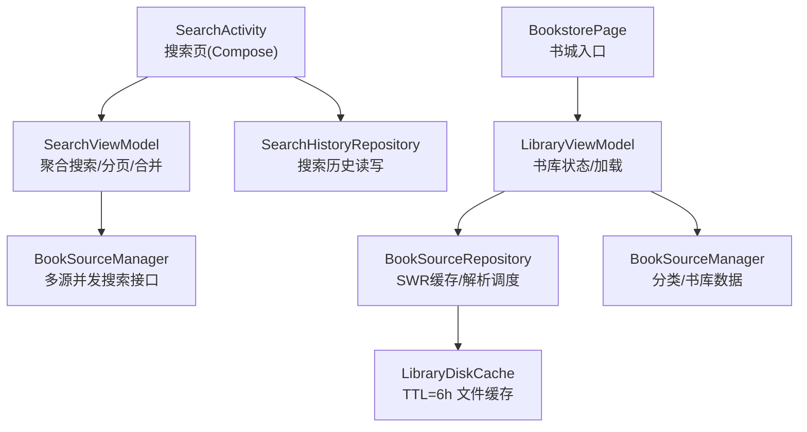
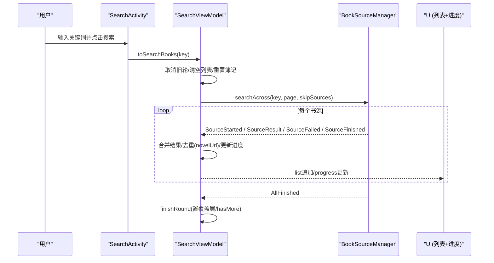
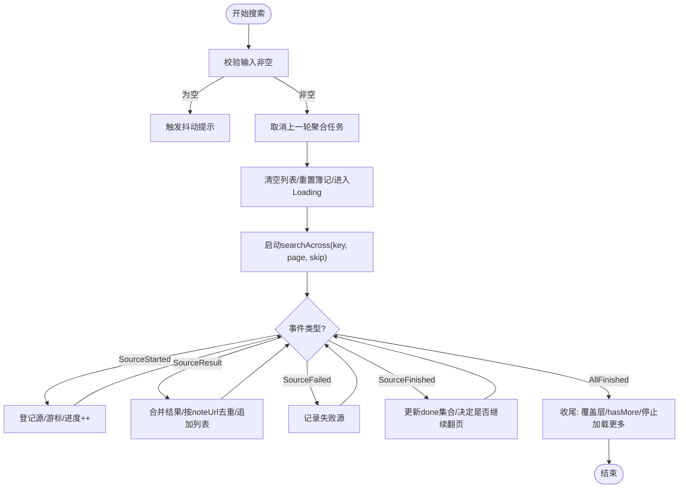
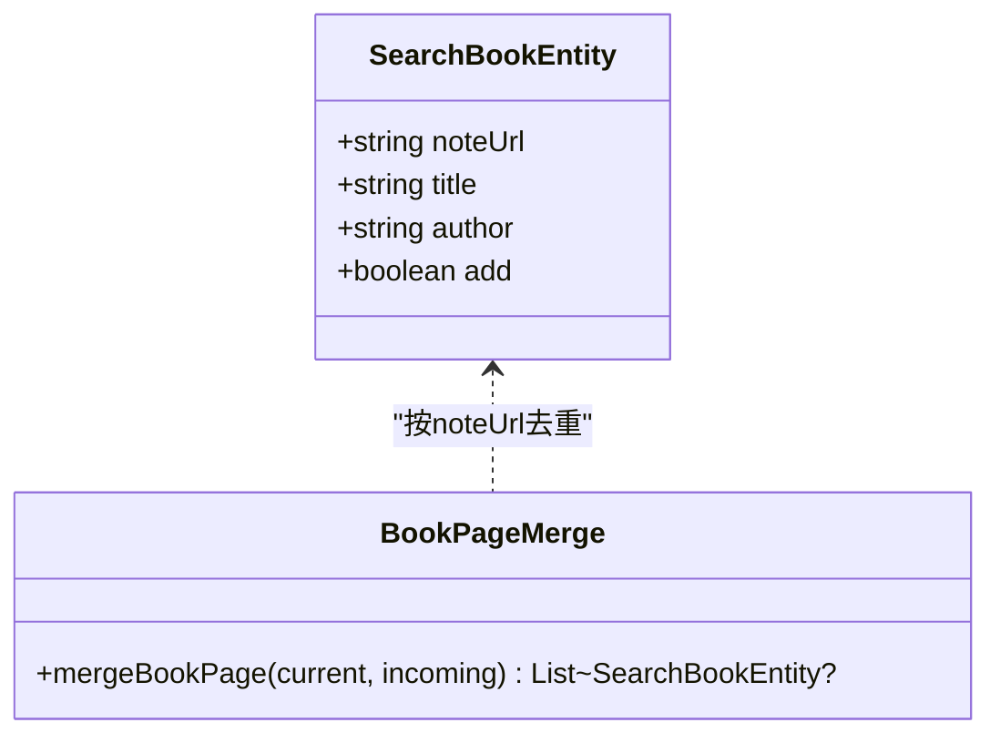
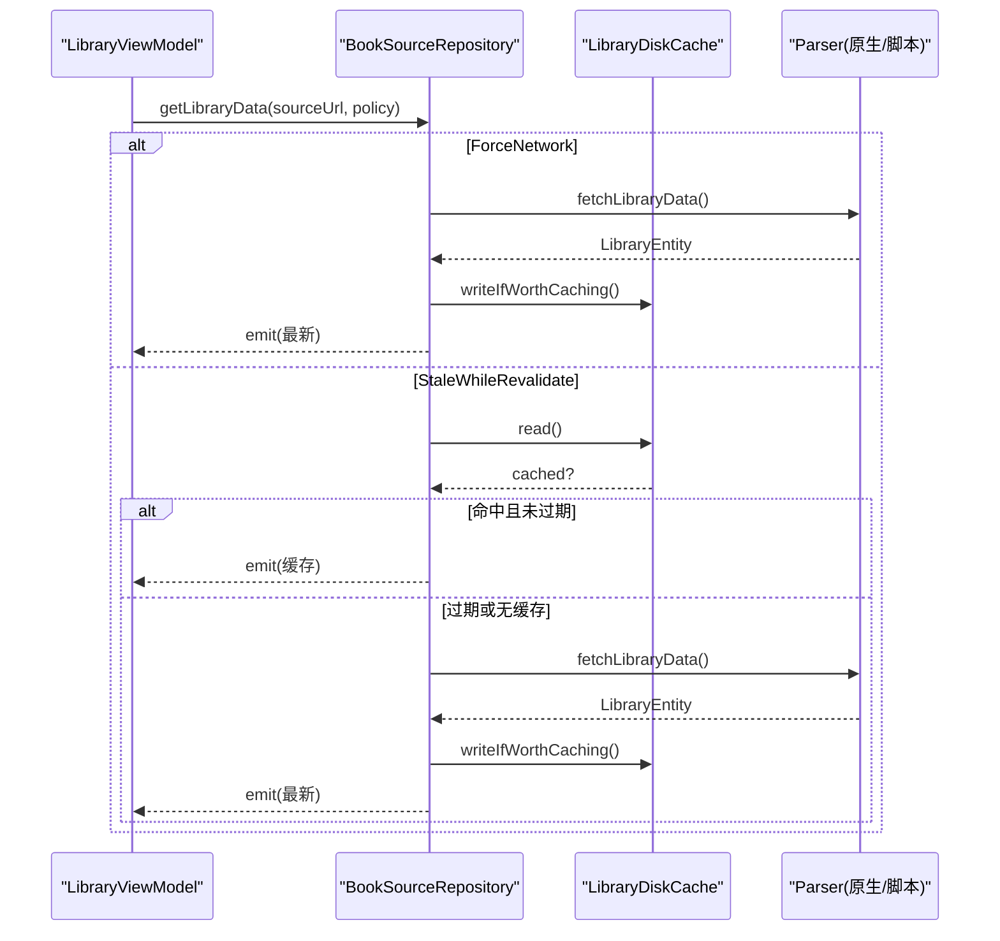
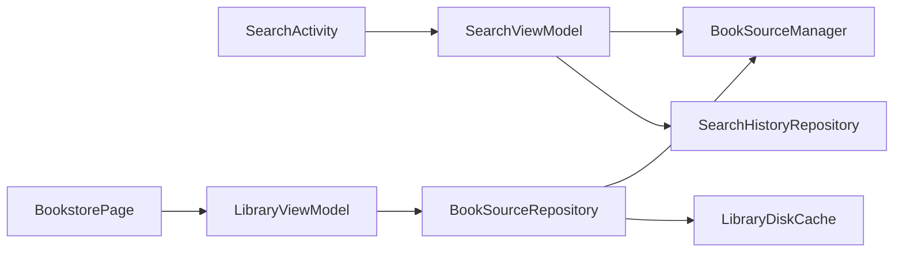

# 书城搜索模块 (module_find)

<cite>
**本文引用的文件**   
- [SearchActivity.kt](file://module_find/src/main/java/com/ebook/find/SearchActivity.kt)
- [SearchViewModel.kt](file://module_find/src/main/java/com/ebook/find/mvvm/viewmodel/SearchViewModel.kt)
- [BookPageMerge.kt](file://module_find/src/main/java/com/ebook/find/mvvm/viewmodel/BookPageMerge.kt)
- [LibraryViewModel.kt](file://module_find/src/main/java/com/ebook/find/mvvm/viewmodel/LibraryViewModel.kt)
- [BookSourceRepository.kt](file://module_find/src/main/java/com/ebook/find/repository/BookSourceRepository.kt)
- [SearchHistoryRepository.kt](file://module_find/src/main/java/com/ebook/find/repository/SearchHistoryRepository.kt)
- [BookstorePage.kt](file://module_find/src/main/java/com/ebook/find/page/BookstorePage.kt)
- [LibraryCacheModule.kt](file://module_find/src/main/java/com/ebook/find/di/LibraryCacheModule.kt)
- [BookType.kt](file://module_find/src/main/java/com/ebook/find/entity/BookType.kt)
- [FindProvider.kt](file://module_find/src/main/java/com/ebook/find/provider/FindProvider.kt)
- [SearchBookItem.kt](file://module_find/src/main/java/com/ebook/find/view/SearchBookItem.kt)
</cite>

## 目录
1. [简介](#简介)
2. [项目结构](#项目结构)
3. [核心组件](#核心组件)
4. [架构总览](#架构总览)
5. [详细组件分析](#详细组件分析)
6. [依赖关系分析](#依赖关系分析)
7. [性能与并发优化](#性能与并发优化)
8. [故障排查指南](#故障排查指南)
9. [结论](#结论)
10. [附录：新增书源适配与实践示例](#附录新增书源适配与实践示例)

## 简介
本模块负责“书城搜索”与“书库浏览”。核心能力包括：
- 多书源聚合搜索：并发请求多个书源，边收边合并、去重、分页，提供稳定的进度展示。
- 分类浏览与书库数据加载：按当前默认书源加载分类入口与书库列表，支持 SWR 缓存与下拉强刷。
- 状态管理：以 ViewModel 为核心，使用 Flow/StateFlow 驱动 UI，统一处理书架事件同步与搜索结果状态。
- 仓库层封装：网络请求、缓存策略（TTL 6h）、错误处理与异常区分（无源 vs 源失效）。
- 本地缓存与离线支持：书库数据落盘缓存；搜索历史持久化；软 404 场景下通过去重保证“到底”判断正确。

## 项目结构
module_find 采用 MVVM + Repository 分层：
- UI 层：SearchActivity（搜索页，Compose），BookstorePage（书城页面入口）
- VM 层：SearchViewModel（聚合搜索与结果合并），LibraryViewModel（书库状态与加载）
- Repository 层：BookSourceRepository（书库缓存与解析调度），SearchHistoryRepository（搜索历史读写）
- DI 与实体：LibraryCacheModule（缓存装配），BookType/Entity（类型与数据模型）
- Provider：FindProvider（跨模块路由与页面暴露）

图表来源
- [SearchActivity.kt:129-380](file://module_find/src/main/java/com/ebook/find/SearchActivity.kt#L129-L380)
- [SearchViewModel.kt:55-479](file://module_find/src/main/java/com/ebook/find/mvvm/viewmodel/SearchViewModel.kt#L55-L479)
- [LibraryViewModel.kt:102-294](file://module_find/src/main/java/com/ebook/find/mvvm/viewmodel/LibraryViewModel.kt#L102-L294)
- [BookSourceRepository.kt:54-199](file://module_find/src/main/java/com/ebook/find/repository/BookSourceRepository.kt#L54-L199)

章节来源
- [SearchActivity.kt:129-380](file://module_find/src/main/java/com/ebook/find/SearchActivity.kt#L129-L380)
- [BookstorePage.kt](file://module_find/src/main/java/com/ebook/find/page/BookstorePage.kt)
- [FindProvider.kt](file://module_find/src/main/java/com/ebook/find/provider/FindProvider.kt)

## 核心组件
- SearchActivity：搜索页主界面，负责输入、历史面板、触发搜索、显示进度与结果列表。
- SearchViewModel：聚合搜索的编排者，维护每源游标、结束集、本轮簿记；处理去重、书架状态同步、加载更多。
- BookPageMerge：通用分页合并工具，按 noteUrl 去重并返回新增条目，避免重复 key 导致的崩溃。
- LibraryViewModel：书城状态机（Unknown/Ready/NoSource/BrokenSource），驱动分类入口与书库数据加载，支持 SWR 与强刷。
- BookSourceRepository：书库数据仓库，实现 SWR 缓存、TTL 过期控制、回写守卫、分类与书库数据读取。
- SearchHistoryRepository：搜索历史增删查，供搜索页历史面板渲染。

章节来源
- [SearchActivity.kt:129-380](file://module_find/src/main/java/com/ebook/find/SearchActivity.kt#L129-L380)
- [SearchViewModel.kt:55-479](file://module_find/src/main/java/com/ebook/find/mvvm/viewmodel/SearchViewModel.kt#L55-L479)
- [BookPageMerge.kt:5-23](file://module_find/src/main/java/com/ebook/find/mvvm/viewmodel/BookPageMerge.kt#L5-L23)
- [LibraryViewModel.kt:27-294](file://module_find/src/main/java/com/ebook/find/mvvm/viewmodel/LibraryViewModel.kt#L27-L294)
- [BookSourceRepository.kt:21-199](file://module_find/src/main/java/com/ebook/find/repository/BookSourceRepository.kt#L21-L199)
- [SearchHistoryRepository.kt](file://module_find/src/main/java/com/ebook/find/repository/SearchHistoryRepository.kt)

## 架构总览
书城搜索由两层协同：
- 搜索链路：Activity → ViewModel → BookSourceManager.searchAcross（并发各源）→ 事件流聚合 → UI 增量更新。
- 书库链路：Page/VM → Repository → Parser（原生或脚本）→ 解析库数据 → DiskCache（TTL 6h）→ UI 逐步刷新。

图表来源
- [SearchActivity.kt:365-380](file://module_find/src/main/java/com/ebook/find/SearchActivity.kt#L365-L380)
- [SearchViewModel.kt:212-386](file://module_find/src/main/java/com/ebook/find/mvvm/viewmodel/SearchViewModel.kt#L212-L386)

## 详细组件分析

### 搜索流程与状态管理（SearchActivity + SearchViewModel）
- 搜索触发：输入非空才发起；空输入触发抖动提示。
- 多源并发：调用 BookSourceManager.searchAcross，收集 AggregateSearchEvent 流，逐条合并。
- 分页与去重：每源独立游标，未结束的源继续翻页；全局按 noteUrl 去重，保留同名不同源的条目以便换源。
- 进度展示：SourceProgressRow 显示“已收到 X/Y 书源结果”，全部结束后消失。
- 加载更多：仅对活跃源翻下一页，若全已结束则停止。

图表来源
- [SearchViewModel.kt:212-386](file://module_find/src/main/java/com/ebook/find/mvvm/viewmodel/SearchViewModel.kt#L212-L386)
- [SearchActivity.kt:365-380](file://module_find/src/main/java/com/ebook/find/SearchActivity.kt#L365-L380)

章节来源
- [SearchActivity.kt:129-380](file://module_find/src/main/java/com/ebook/find/SearchActivity.kt#L129-L380)
- [SearchViewModel.kt:55-479](file://module_find/src/main/java/com/ebook/find/mvvm/viewmodel/SearchViewModel.kt#L55-L479)

### 搜索结果聚合与去重（SearchViewModel + BookPageMerge）
- 去重策略：按 noteUrl 全局去重；同名不同源的条目保留，为后续“换源阅读”提供可能。
- 分页边界：软 404（HTTP 200 但返回首页书目）时，去重后“零新条目”即判该源到底。
- 合并工具：BookPageMerge.mergeBookPage 用于分类页与搜索页的统一合并逻辑。

图表来源
- [BookPageMerge.kt:5-23](file://module_find/src/main/java/com/ebook/find/mvvm/viewmodel/BookPageMerge.kt#L5-L23)
- [SearchViewModel.kt:323-342](file://module_find/src/main/java/com/ebook/find/mvvm/viewmodel/SearchViewModel.kt#L323-L342)

章节来源
- [BookPageMerge.kt:5-23](file://module_find/src/main/java/com/ebook/find/mvvm/viewmodel/BookPageMerge.kt#L5-L23)
- [SearchViewModel.kt:323-342](file://module_find/src/main/java/com/ebook/find/mvvm/viewmodel/SearchViewModel.kt#L323-L342)

### 书库数据加载与缓存（LibraryViewModel + BookSourceRepository）
- 状态机：Unknown（首帧未知）→ Ready/NoSource/BrokenSource（根据默认源与解析器可用性判定）。
- 缓存策略：StaleWhileRevalidate（先上屏缓存，再后台重抓），ForceNetwork（下拉强刷）。
- TTL 控制：书库缓存有效期 6 小时；只有至少一个分类有书才回写，避免缓存“空站”。
- 错误处理：无源（发空实体，引导导入）vs 源失效（抛异常，引导切换/重导）。

图表来源
- [LibraryViewModel.kt:176-289](file://module_find/src/main/java/com/ebook/find/mvvm/viewmodel/LibraryViewModel.kt#L176-L289)
- [BookSourceRepository.kt:92-146](file://module_find/src/main/java/com/ebook/find/repository/BookSourceRepository.kt#L92-L146)

章节来源
- [LibraryViewModel.kt:27-294](file://module_find/src/main/java/com/ebook/find/mvvm/viewmodel/LibraryViewModel.kt#L27-L294)
- [BookSourceRepository.kt:21-199](file://module_find/src/main/java/com/ebook/find/repository/BookSourceRepository.kt#L21-L199)

### 分类浏览与默认源动态计算（LibraryViewModel）
- 默认源：来自 BookSourceManager.observeDefaultSource，首帧 Unknown，Room 查询后落定。
- 分类入口：随 currentSource 变化而更新，空白标题过滤，脚本行同样支持 exploreUrl 条目。
- 切换体验：切换源后立即生效，列表清空后拉取新源数据，避免“新源名+旧书目”错配。

章节来源
- [LibraryViewModel.kt:102-212](file://module_find/src/main/java/com/ebook/find/mvvm/viewmodel/LibraryViewModel.kt#L102-L212)

### 搜索历史与本地存储（SearchActivity + SearchHistoryRepository）
- 历史记录：插入时 upsert（同词条仅更新时间戳），清理后发射空列表刷新面板。
- 面板交互：圆形揭示动画开合，标签点击回填搜索框，清除时粒子爆炸动效。

章节来源
- [SearchActivity.kt:185-352](file://module_find/src/main/java/com/ebook/find/SearchActivity.kt#L185-L352)
- [SearchHistoryRepository.kt](file://module_find/src/main/java/com/ebook/find/repository/SearchHistoryRepository.kt)

## 依赖关系分析
- SearchActivity 依赖 SearchViewModel 与 SearchHistoryRepository。
- SearchViewModel 依赖 BookSourceManager、BookShelfManager、BookRepository。
- LibraryViewModel 依赖 BookSourceRepository 与 BookSourceManager。
- BookSourceRepository 依赖 BookSourceManager 与 LibraryDiskCache。
- 模块间通过 Provider 暴露页面，TheRouter 进行导航。

图表来源
- [SearchActivity.kt:129-380](file://module_find/src/main/java/com/ebook/find/SearchActivity.kt#L129-L380)
- [SearchViewModel.kt:55-479](file://module_find/src/main/java/com/ebook/find/mvvm/viewmodel/SearchViewModel.kt#L55-L479)
- [LibraryViewModel.kt:102-294](file://module_find/src/main/java/com/ebook/find/mvvm/viewmodel/LibraryViewModel.kt#L102-L294)
- [BookSourceRepository.kt:54-199](file://module_find/src/main/java/com/ebook/find/repository/BookSourceRepository.kt#L54-L199)

章节来源
- [FindProvider.kt](file://module_find/src/main/java/com/ebook/find/provider/FindProvider.kt)
- [LibraryCacheModule.kt](file://module_find/src/main/java/com/ebook/find/di/LibraryCacheModule.kt)

## 性能与并发优化
- 多源并发：searchAcross 内部并发执行各源请求，事件流有序聚合，UI 边收边更新。
- 分页优化：每源独立游标，跳过已到底源；软 404 通过去重判断到底，避免无效请求。
- 缓存优化：书库 SWR 策略，先缓存后重抓；TTL 6h 平衡新鲜度与请求频率；只缓存“有内容”的结果。
- 内存与重组：历史面板在布局期读取动画进度，避免组合期频繁重组；列表 item key 使用稳定 noteUrl。
- 防抖与节流：搜索前延迟隐藏键盘，避免 UI 抖动；加载更多忽略仍在进行的聚合任务。

[本节为通用指导，不直接分析具体文件]

## 故障排查指南
- 搜索无结果：检查是否所有源都失败（Overlay.NetworkError），查看日志中各源失败原因；尝试更换关键词。
- 加载更多卡住：确认是否有活跃源；若全部源已结束，footer 会显示“没有更多”。
- 书库空白：区分“无源”与“源失效”，前者引导导入，后者提示切换/重导。
- 缓存异常：检查 TTL 与回写条件；若站点挂掉，空结果不会落缓存，下次进页会重试。
- 历史面板不更新：确认 SearchHistoryRepository 操作成功，successEvent 是否发射。

章节来源
- [SearchViewModel.kt:352-374](file://module_find/src/main/java/com/ebook/find/mvvm/viewmodel/SearchViewModel.kt#L352-L374)
- [LibraryViewModel.kt:274-289](file://module_find/src/main/java/com/ebook/find/mvvm/viewmodel/LibraryViewModel.kt#L274-L289)
- [BookSourceRepository.kt:141-146](file://module_find/src/main/java/com/ebook/find/repository/BookSourceRepository.kt#L141-L146)

## 结论
module_find 实现了健壮的多书源搜索与书库浏览能力：
- 搜索端通过事件流聚合与去重，提供流畅的增量更新与准确的进度反馈。
- 书库端通过 SWR 缓存与 TTL 控制，兼顾速度与新鲜度，支持下拉强刷。
- 状态机清晰区分无源与源失效，用户体验友好。
- 本地缓存与历史持久化提升了离线与重复访问体验。

[本节总结性内容，不直接分析具体文件]

## 附录：新增书源适配与实践示例

### 新增书源适配步骤
- 在书源管理中导入 JSON 规则（原生或脚本），确保 rule_json 可解析。
- 验证默认源计算：观察 LibraryViewModel.sourceState 是否从 Unknown 落至 Ready。
- 测试分类入口：确认 getExploreEntries 返回有效条目，空白标题被过滤。
- 测试书库数据：调用 fetchLibraryData，检查返回数据并写入缓存。
- 测试搜索：通过 searchAcross 验证多源聚合与去重。

章节来源
- [LibraryViewModel.kt:176-212](file://module_find/src/main/java/com/ebook/find/mvvm/viewmodel/LibraryViewModel.kt#L176-L212)
- [BookSourceRepository.kt:148-179](file://module_find/src/main/java/com/ebook/find/repository/BookSourceRepository.kt#L148-L179)

### 优化搜索性能建议
- 合理设置 skipSourceUrls：仅对活跃源翻页，避免无效请求。
- 利用 BookPageMerge 统一去重，避免重复 key 导致崩溃。
- 监控 searchAcross 事件流，分析各源响应时间与失败率。

章节来源
- [SearchViewModel.kt:261-386](file://module_find/src/main/java/com/ebook/find/mvvm/viewmodel/SearchViewModel.kt#L261-L386)
- [BookPageMerge.kt:5-23](file://module_find/src/main/java/com/ebook/find/mvvm/viewmodel/BookPageMerge.kt#L5-L23)

### 处理并发请求最佳实践
- 使用协程与 Flow 管理异步任务，确保取消传播正确。
- 聚合搜索中，每源异常被收敛为事件，整条流出错时才终止。
- 书库加载 SWR 模式下，取消收集时不应吞掉异常，需原样上抛。

章节来源
- [SearchViewModel.kt:269-283](file://module_find/src/main/java/com/ebook/find/mvvm/viewmodel/SearchViewModel.kt#L269-L283)
- [BookSourceRepository.kt:115-128](file://module_find/src/main/java/com/ebook/find/repository/BookSourceRepository.kt#L115-L128)