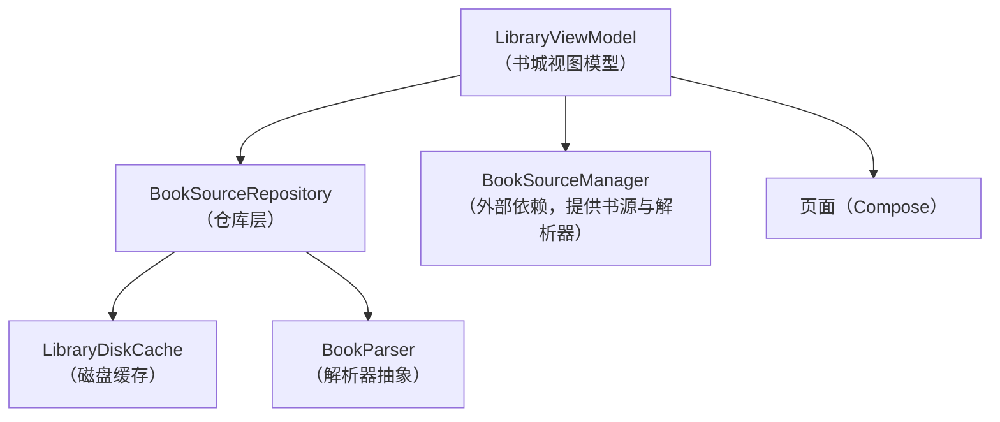
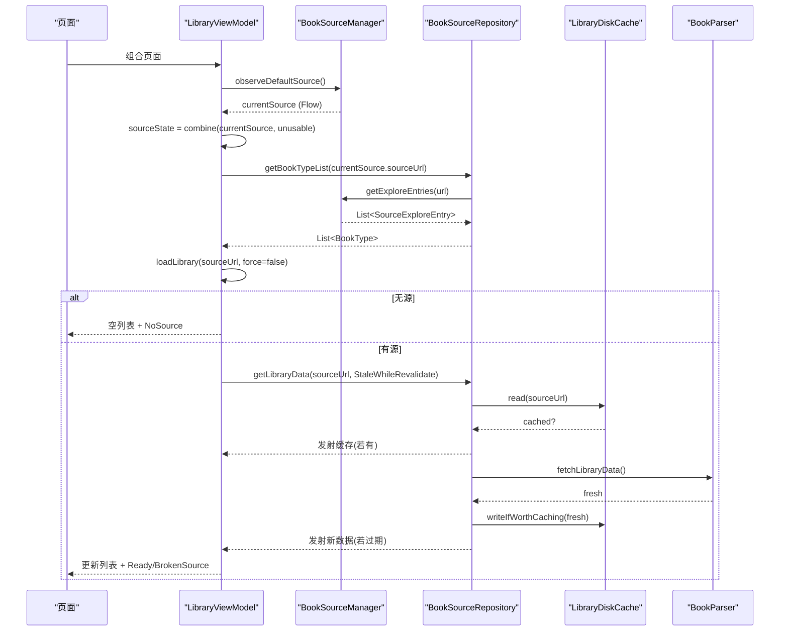
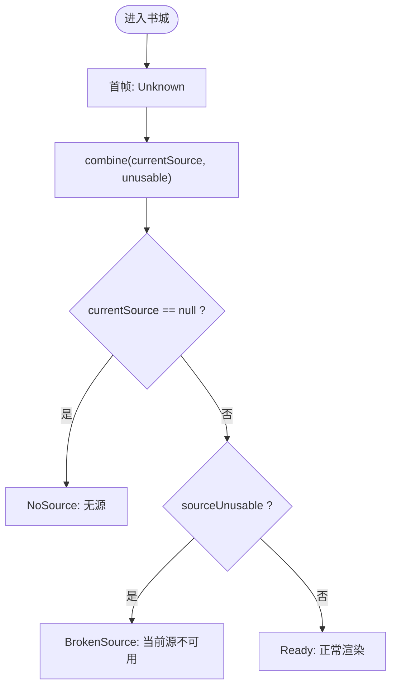
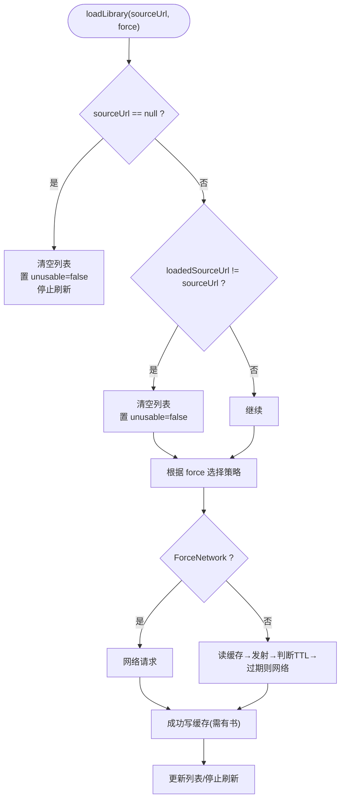
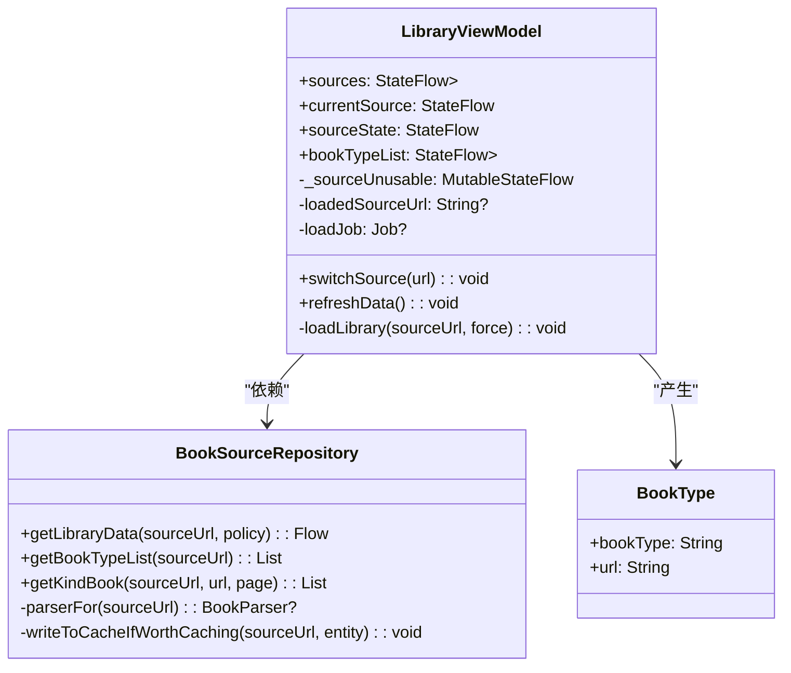
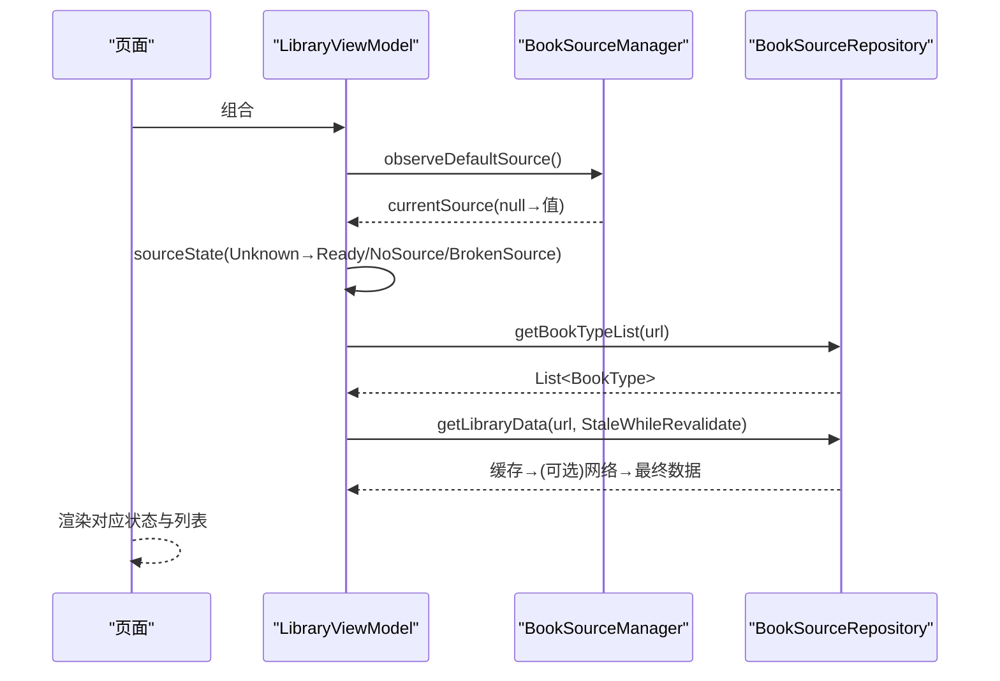

# 书城视图模型（LibraryViewModel）

<cite>
**本文引用的文件**
- [LibraryViewModel.kt](file://module_find/src/main/java/com/ebook/find/mvvm/viewmodel/LibraryViewModel.kt)
- [BookSourceRepository.kt](file://module_find/src/main/java/com/ebook/find/repository/BookSourceRepository.kt)
- [BookType.kt](file://module_find/src/main/java/com/ebook/find/entity/BookType.kt)
- [LibraryViewModelTest.kt](file://module_find/src/test/java/com/ebook/find/mvvm/viewmodel/LibraryViewModelTest.kt)
</cite>

## 目录
1. [简介](#简介)
2. [项目结构](#项目结构)
3. [核心组件](#核心组件)
4. [架构总览](#架构总览)
5. [详细组件分析](#详细组件分析)
6. [依赖关系分析](#依赖关系分析)
7. [性能考量](#性能考量)
8. [故障排查指南](#故障排查指南)
9. [结论](#结论)
10. [附录](#附录)

## 简介
本文件聚焦书城模块的视图模型 LibraryViewModel，围绕“数据驱动 + 响应式书源切换”展开，解释：
- 当前书源的响应式管理（默认源、候选清单、切换动作）
- 书库数据的加载策略（SWR 缓存、下拉刷新强刷）
- 分类入口的动态生成（随源变化）
- LibrarySourceState 状态机（Ready / NoSource / BrokenSource / Unknown）的设计与转换条件
- 默认源动态计算、错误降级、用户体验设计
- 扩展点与最佳实践：如何新增功能、优化加载性能、处理异常与状态同步

## 项目结构
书城视图模型位于 module_find，遵循 MVVM 分层：
- ViewModel（LibraryViewModel）：负责书源状态、列表数据、刷新与切换逻辑
- Repository（BookSourceRepository）：封装书库缓存策略（SWR）、网络请求、分类入口获取
- Entity（BookType）：分类胶囊的数据载体
- 测试（LibraryViewModelTest）：覆盖多书源切换、状态机、SWR、空态与失效态等关键路径

图表来源
- [LibraryViewModel.kt:102-294](file://module_find/src/main/java/com/ebook/find/mvvm/viewmodel/LibraryViewModel.kt#L102-L294)
- [BookSourceRepository.kt:54-199](file://module_find/src/main/java/com/ebook/find/repository/BookSourceRepository.kt#L54-L199)

章节来源
- [LibraryViewModel.kt:102-294](file://module_find/src/main/java/com/ebook/find/mvvm/viewmodel/LibraryViewModel.kt#L102-L294)
- [BookSourceRepository.kt:21-199](file://module_find/src/main/java/com/ebook/find/repository/BookSourceRepository.kt#L21-L199)

## 核心组件
- LibrarySourceState：书城“能不能出数据”的状态档，用于页面渲染决策
- LibraryViewModel：书城主 Tab 视图模型，响应式跟随当前书源，驱动分类与书库
- BookSourceRepository：书库加载策略（SWR 与强刷）、分类入口映射、缓存守卫
- BookType：分类胶囊的数据模型（名称、URL）

章节来源
- [LibraryViewModel.kt:27-100](file://module_find/src/main/java/com/ebook/find/mvvm/viewmodel/LibraryViewModel.kt#L27-L100)
- [BookSourceRepository.kt:21-70](file://module_find/src/main/java/com/ebook/find/repository/BookSourceRepository.kt#L21-L70)
- [BookType.kt:1-21](file://module_find/src/main/java/com/ebook/find/entity/BookType.kt#L1-L21)

## 架构总览
书城采用“以书源为中心”的响应式架构：
- 当前书源由 BookSourceManager.observeDefaultSource() 提供，作为一切数据的基准
- 候选书源清单由 observeSources() 提供，仅包含启用中的源，供顶部切换器展示
- 分类入口 bookTypeList 随 currentSource 变化重算
- 书库数据 loadLibrary(sourceUrl, force) 按策略从仓库拉取，支持 SWR 双发射（先缓存后新数据）
- 状态 sourceState 由 currentSource 与“当前源是否可用”两路事实合成，保证页面文案与引导正确

图表来源
- [LibraryViewModel.kt:123-294](file://module_find/src/main/java/com/ebook/find/mvvm/viewmodel/LibraryViewModel.kt#L123-L294)
- [BookSourceRepository.kt:92-146](file://module_find/src/main/java/com/ebook/find/repository/BookSourceRepository.kt#L92-L146)

## 详细组件分析

### LibrarySourceState 状态机
- Ready：有可用源，正常渲染书库
- NoSource：没有启用中的源，发引导（去启用或导入），不发请求
- BrokenSource：有源但当前源解析不出来（规则读不出/行被删），提示换源或重导
- Unknown：首帧“还不知道”，等待 Room 答复；避免冷启动闪误导文案

转换规则（librarySourceStateOf）：
- currentSource == null → NoSource
- sourceUnusable == true → BrokenSource
- 否则 → Ready

首帧初值设置为 Unknown，由 stateIn 指定，确保页面整片留空，直到两路事实合成为 Ready/NoSource/BrokenSource。

图表来源
- [LibraryViewModel.kt:42-76](file://module_find/src/main/java/com/ebook/find/mvvm/viewmodel/LibraryViewModel.kt#L42-L76)
- [LibraryViewModel.kt:159-167](file://module_find/src/main/java/com/ebook/find/mvvm/viewmodel/LibraryViewModel.kt#L159-L167)

章节来源
- [LibraryViewModel.kt:27-76](file://module_find/src/main/java/com/ebook/find/mvvm/viewmodel/LibraryViewModel.kt#L27-L76)
- [LibraryViewModel.kt:151-167](file://module_find/src/main/java/com/ebook/find/mvvm/viewmodel/LibraryViewModel.kt#L151-L167)

### 当前书源的响应式管理
- sources：候选书源清单，过滤 enabled=true，并只暴露 rule（不含 format 等管理面元数据），便于切换器展示“可切到的源”
- currentSource：默认源 Flow，首次为 null（Unknown 占位），Room 返回后稳定为 SourceDefinition（原生或脚本）
- switchSource(url)：仅调用 BookSourceManager.setDefaultSource(url)，后续由订阅回流自动重拉书库

注意：
- 切换器候选不包含禁用项，因为切换器回答的是“我能切到哪个源”
- 脚本书源也进入候选，因为 setDefaultSource 对脚本行有效且 getParserFor 会返回真实解析器

章节来源
- [LibraryViewModel.kt:108-140](file://module_find/src/main/java/com/ebook/find/mvvm/viewmodel/LibraryViewModel.kt#L108-L140)
- [LibraryViewModel.kt:202-212](file://module_find/src/main/java/com/ebook/find/mvvm/viewmodel/LibraryViewModel.kt#L202-L212)

### 分类入口的动态生成（BookType）
- bookTypeList 基于 currentSource 映射：读取 BookSourceRepository.getBookTypeList(sourceUrl)
- 失败时 catch 日志并回退为空列表，避免整个主 Tab 崩溃
- BookType 承载分类名与 URL，空白标题条目在仓库层过滤

章节来源
- [LibraryViewModel.kt:169-182](file://module_find/src/main/java/com/ebook/find/mvvm/viewmodel/LibraryViewModel.kt#L169-L182)
- [BookSourceRepository.kt:148-165](file://module_find/src/main/java/com/ebook/find/repository/BookSourceRepository.kt#L148-L165)
- [BookType.kt:1-21](file://module_find/src/main/java/com/ebook/find/entity/BookType.kt#L1-L21)

### 书库数据加载策略（SWR 与下拉刷新）
- loadLibrary(sourceUrl, force=false)：
  - 无源：清空列表与刷新态，置 _sourceUnusable=false，进入 NoSource
  - 换源：先清空列表，再重置 _sourceUnusable=false，然后发起加载
  - 同源重拉：直接更新列表
- 仓库层策略：
  - StaleWhileRevalidate：先发射缓存（若有），若 TTL 过期则网络重抓后再发射一次
  - ForceNetwork：跳过缓存读，强制网络，成功后回写缓存
- 缓存守卫：只有至少一个分类有书才写入缓存，避免坏站点的空结果长期冻住

图表来源
- [LibraryViewModel.kt:224-289](file://module_find/src/main/java/com/ebook/find/mvvm/viewmodel/LibraryViewModel.kt#L224-L289)
- [BookSourceRepository.kt:92-146](file://module_find/src/main/java/com/ebook/find/repository/BookSourceRepository.kt#L92-L146)

章节来源
- [LibraryViewModel.kt:224-289](file://module_find/src/main/java/com/ebook/find/mvvm/viewmodel/LibraryViewModel.kt#L224-L289)
- [BookSourceRepository.kt:21-70](file://module_find/src/main/java/com/ebook/find/repository/BookSourceRepository.kt#L21-L70)
- [BookSourceRepository.kt:92-146](file://module_find/src/main/java/com/ebook/find/repository/BookSourceRepository.kt#L92-L146)

### 默认源动态计算与用户体验
- 默认源由 Room 现算（不再随包携带），因此首帧为 null，页面显示 Unknown 整片留空
- 切换书源只做 setDefaultSource，不主动拉取，全部通过订阅回流完成
- 体验要点：
  - 首帧不闪“无源”误导文案（Unknown 整片留空）
  - 无源不发请求，避免拿不相干站点填充
  - 同源下拉刷新保留旧屏，避免闪烁空页
  - 换源先清空列表，避免“新书源名 + 旧书目”错配

章节来源
- [LibraryViewModel.kt:127-140](file://module_find/src/main/java/com/ebook/find/mvvm/viewmodel/LibraryViewModel.kt#L127-L140)
- [LibraryViewModel.kt:195-222](file://module_find/src/main/java/com/ebook/find/mvvm/viewmodel/LibraryViewModel.kt#L195-L222)

### 错误状态的优雅降级
- BrokenSource：当 getLibraryData 抛出 BookSourceNotFoundException（源被删或规则解码失败），设置 _sourceUnusable=true，state 落入 BrokenSource，提示“换一个源或重导这条源”
- 网络失败（强刷期间）：保留旧屏，不误报 BrokenSource（这是网络问题而非源规则问题）
- 分类入口加载失败：catch 日志并返回空列表，页面仍可正常使用

章节来源
- [LibraryViewModel.kt:257-289](file://module_find/src/main/java/com/ebook/find/mvvm/viewmodel/LibraryViewModel.kt#L257-L289)
- [BookSourceRepository.kt:115-129](file://module_find/src/main/java/com/ebook/find/repository/BookSourceRepository.kt#L115-L129)

### 类图（代码级关系）

图表来源
- [LibraryViewModel.kt:102-294](file://module_find/src/main/java/com/ebook/find/mvvm/viewmodel/LibraryViewModel.kt#L102-L294)
- [BookSourceRepository.kt:54-199](file://module_find/src/main/java/com/ebook/find/repository/BookSourceRepository.kt#L54-L199)
- [BookType.kt:17-20](file://module_find/src/main/java/com/ebook/find/entity/BookType.kt#L17-L20)

## 依赖关系分析
- ViewModel 依赖：
  - BookSourceRepository：书库数据与分类入口
  - BookSourceManager（外部注入）：默认源与候选源、解析器获取
- Repository 依赖：
  - BookSourceManager：获取解析器、探索入口
  - LibraryDiskCache：磁盘缓存读写
  - BookParser：解析器接口（实际实现来自 Manager）

耦合与内聚：
- ViewModel 将“书源切换”与“数据加载”解耦，通过 Flow 与状态机收敛页面行为
- Repository 集中缓存策略与网络/解析器调用，避免散落在解析器内部
- 错误路径清晰：无源、源坏、网络失败各有明确分支与兜底

潜在循环依赖：无（ViewModel → Repository → Manager/Caches，无反向）

章节来源
- [LibraryViewModel.kt:102-140](file://module_find/src/main/java/com/ebook/find/mvvm/viewmodel/LibraryViewModel.kt#L102-L140)
- [BookSourceRepository.kt:54-99](file://module_find/src/main/java/com/ebook/find/repository/BookSourceRepository.kt#L54-L99)

## 性能考量
- SWR 缓存：
  - 进页/换源走 StaleWhileRevalidate，先显示缓存，再按需重抓，提升首屏速度
  - TTL 6 小时，平衡内容新鲜度与第三方站点压力
- 下拉刷新：
  - 使用 ForceNetwork，绕过缓存命中，满足“给我最新的”语义
- 列表保持：
  - 同源刷新期间保留旧屏，避免闪烁
  - 换源先清空列表，避免“书名源与书目源不一致”
- 缓存守卫：
  - 仅当至少一个分类有书时才写缓存，避免坏站点的空结果长期冻结

[本节为通用指导，无需具体文件引用]

## 故障排查指南
常见问题与定位：
- 首帧空白：检查 sourceState 是否为 Unknown，待 Room 答复后应落定
- 无源引导：确认 currentSource 为 null，且不触发任何网络请求
- 源失效提示：检查是否抛出 BookSourceNotFoundException，_sourceUnusable 是否置位
- 刷新无效：确认是否命中缓存（SWR 未过期），下拉刷新是否走 ForceNetwork
- 分类入口为空：检查 BookSourceRepository.getBookTypeList 是否返回空（规则缺少 kinds 或 exploreUrl）

建议调试步骤：
- 打印/断言 sourceState 的变化序列（Unknown → Ready/NoSource/BrokenSource）
- 验证 loadLibrary 的 force 参数与策略选择
- 查看缓存是否命中（SWR 双发射）
- 确认解析器是否被调用（BookParser.fetchLibraryData）

章节来源
- [LibraryViewModel.kt:159-167](file://module_find/src/main/java/com/ebook/find/mvvm/viewmodel/LibraryViewModel.kt#L159-L167)
- [LibraryViewModel.kt:257-289](file://module_find/src/main/java/com/ebook/find/mvvm/viewmodel/LibraryViewModel.kt#L257-L289)
- [BookSourceRepository.kt:92-146](file://module_find/src/main/java/com/ebook/find/repository/BookSourceRepository.kt#L92-L146)

## 结论
LibraryViewModel 以“当前书源”为核心，结合 Flow 与状态机，实现了书城的多书源响应式体验：
- 首帧 Unknown 避免误导，NoSource/BrokenSource 区分两类空态，Ready 正常渲染
- 分类与书库随源变化，切换即生效，无需手动刷新
- SWR 与强刷兼顾速度与新鲜度，列表保持与清空策略保障视觉一致性
- 错误路径优雅降级，网络失败不清屏、源失效给明确指引

## 附录

### 状态机时序图（端到端）

图表来源
- [LibraryViewModel.kt:123-294](file://module_find/src/main/java/com/ebook/find/mvvm/viewmodel/LibraryViewModel.kt#L123-L294)
- [BookSourceRepository.kt:92-146](file://module_find/src/main/java/com/ebook/find/repository/BookSourceRepository.kt#L92-L146)

### 测试用例要点（参考）
- 初始默认源到位后，分类与书库按该源给出
- 切换器只列启用中的源且只带规则
- 脚本源进入候选并能成为当前源
- 无任何启用源时进引导态且不发请求
- 有源但解析不出时报 BrokenSource 而不是 NoSource
- 首帧档位是 Unknown 而不是 NoSource
- 换源后分类入口跟着更换
- 同源下拉刷新保留列表，换源先清空
- 切回已缓存的书源立即显示缓存且不再发请求
- 刷新期间网络失败保留旧数据且不误报源失效

章节来源
- [LibraryViewModelTest.kt:315-641](file://module_find/src/test/java/com/ebook/find/mvvm/viewmodel/LibraryViewModelTest.kt#L315-L641)