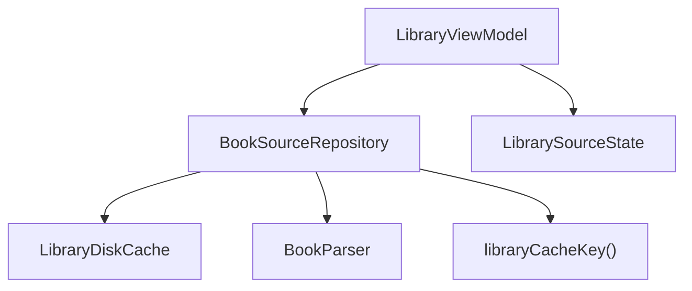
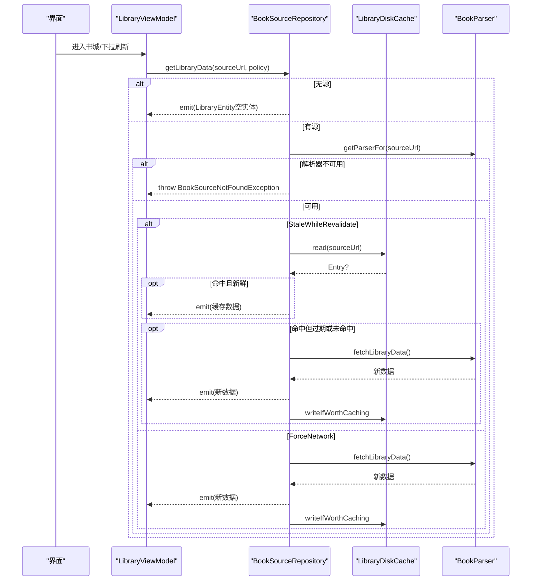
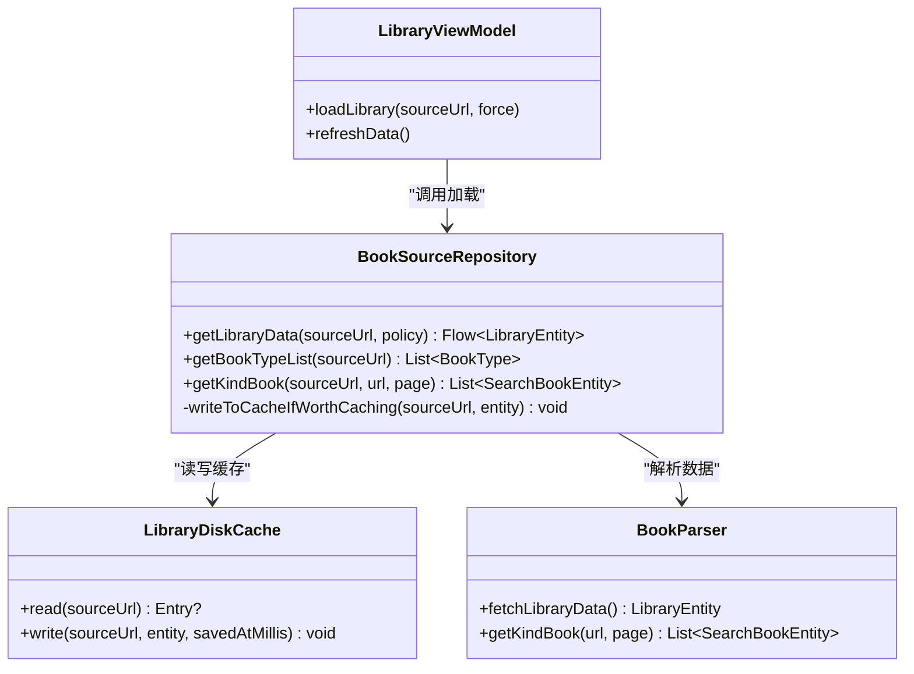

# 书源仓库 (BookSourceRepository)

<cite>
**本文引用的文件**
- [BookSourceRepository.kt](file://module_find/src/main/java/com/ebook/find/repository/BookSourceRepository.kt)
- [LibraryDiskCache.kt](file://lib_book_common/src/main/java/com/ebook/common/analyze/source/LibraryDiskCache.kt)
- [Constant.kt](file://lib_book_common/src/main/java/com/ebook/common/event/Constant.kt)
- [BookParser.kt](file://lib_book_source/src/main/java/com/ebook/source/analyze/BookParser.kt)
- [BookSourceNotFoundException.kt](file://lib_book_source/src/main/java/com/ebook/source/analyze/BookSourceNotFoundException.kt)
- [LibraryViewModel.kt](file://module_find/src/main/java/com/ebook/find/mvvm/viewmodel/LibraryViewModel.kt)
- [BookSourceRepositoryLibraryCacheTest.kt](file://module_find/src/test/java/com/ebook/find/repository/BookSourceRepositoryLibraryCacheTest.kt)
</cite>

## 目录
1. [简介](#简介)
2. [项目结构](#项目结构)
3. [核心组件](#核心组件)
4. [架构总览](#架构总览)
5. [详细组件分析](#详细组件分析)
6. [依赖关系分析](#依赖关系分析)
7. [性能考量](#性能考量)
8. [故障排查指南](#故障排查指南)
9. [结论](#结论)
10. [附录](#附录)

## 简介
本文件围绕“书库数据仓库”的职责边界与实现进行系统化说明，重点覆盖：
- 分类入口获取、分类书籍查询、书库数据加载的 API 设计与调用约定
- LibraryLoadPolicy 两种策略（StaleWhileRevalidate / ForceNetwork）的实现差异与使用场景
- 书库缓存策略的核心机制：LibraryDiskCache、TTL 过期控制、回写守卫
- 解析器获取的错误处理：BookSourceNotFoundException 抛出时机与业务含义
- IO 线程调度、Flow 异步数据处理、取消传播机制
- 实践示例：新增加载策略、优化缓存命中率、扩展书源解析能力

## 项目结构
本项目采用多模块分层：
- module_find：书城与书库页面及其 ViewModel、Repository
- lib_book_common：通用缓存、事件常量等共享件
- lib_book_source：书源解析层（接口与实现）
- lib_ebook_api / lib_ebook_db：网络与数据库

图表来源
- [LibraryViewModel.kt:103-289](file://module_find/src/main/java/com/ebook/find/mvvm/viewmodel/LibraryViewModel.kt#L103-L289)
- [BookSourceRepository.kt:54-199](file://module_find/src/main/java/com/ebook/find/repository/BookSourceRepository.kt#L54-L199)
- [LibraryDiskCache.kt:35-114](file://lib_book_common/src/main/java/com/ebook/common/analyze/source/LibraryDiskCache.kt#L35-L114)
- [BookParser.kt:8-30](file://lib_book_source/src/main/java/com/ebook/source/analyze/BookParser.kt#L8-L30)
- [Constant.kt:6-24](file://lib_book_common/src/main/java/com/ebook/common/event/Constant.kt#L6-L24)

章节来源
- [BookSourceRepository.kt:21-53](file://module_find/src/main/java/com/ebook/find/repository/BookSourceRepository.kt#L21-L53)
- [LibraryDiskCache.kt:13-34](file://lib_book_common/src/main/java/com/ebook/common/analyze/source/LibraryDiskCache.kt#L13-L34)
- [BookParser.kt:8-30](file://lib_book_source/src/main/java/com/ebook/source/analyze/BookParser.kt#L8-L30)

## 核心组件
- BookSourceRepository：书库数据仓库，封装分类入口、分类书籍、书库数据加载策略与缓存编排。
- LibraryDiskCache：书库数据的磁盘缓存，按源分区落盘 JSON，提供读写与自愈逻辑。
- BookParser：书源解析器接口，规定搜索、详情、目录、分类书籍、书库首屏数据拉取契约。
- LibraryViewModel：书城页面状态机，驱动当前书源、分类入口、书库数据流，统一错误态与刷新语义。

章节来源
- [BookSourceRepository.kt:54-199](file://module_find/src/main/java/com/ebook/find/repository/BookSourceRepository.kt#L54-L199)
- [LibraryDiskCache.kt:35-114](file://lib_book_common/src/main/java/com/ebook/common/analyze/source/LibraryDiskCache.kt#L35-L114)
- [BookParser.kt:8-30](file://lib_book_source/src/main/java/com/ebook/source/analyze/BookParser.kt#L8-L30)
- [LibraryViewModel.kt:103-289](file://module_find/src/main/java/com/ebook/find/mvvm/viewmodel/LibraryViewModel.kt#L103-L289)

## 架构总览
仓库层负责“策略编排”，解析器层只负责“纯网络解析”，两者解耦清晰：
- Repository 决定何时读缓存、何时发起网络、何时回写缓存、如何处理异常与取消
- 解析器仅暴露 fetchLibraryData/getKindBook 等接口，不感知缓存与策略

图表来源
- [BookSourceRepository.kt:92-131](file://module_find/src/main/java/com/ebook/find/repository/BookSourceRepository.kt#L92-L131)
- [LibraryDiskCache.kt:51-94](file://lib_book_common/src/main/java/com/ebook/common/analyze/source/LibraryDiskCache.kt#L51-L94)
- [BookParser.kt:18-29](file://lib_book_source/src/main/java/com/ebook/source/analyze/BookParser.kt#L18-L29)
- [LibraryViewModel.kt:214-289](file://module_find/src/main/java/com/ebook/find/mvvm/viewmodel/LibraryViewModel.kt#L214-L289)

## 详细组件分析

### BookSourceRepository：书库数据仓库
职责边界
- 以 sourceUrl 为入参，避免在仓库层猜测“当前默认源”，防止跨源错配
- 缓存策略集中在此层：TTL、SWR、ForceNetwork、回写守卫、异常与取消处理
- 返回 Flow<LibraryEntity>，支持 SWR 双发射；无源时发空实体后正常结束

关键 API
- getLibraryData(sourceUrl, policy): Flow<LibraryEntity>
  - StaleWhileRevalidate：先缓存，若过期在同一次收集内重抓再发新结果；失败保留旧屏或上抛
  - ForceNetwork：跳过缓存读，强制网络并成功后覆盖回写
- getBookTypeList(sourceUrl): List<BookType>
  - 通过 BookSourceManager 获取分类条目，过滤空白标题并映射
- getKindBook(sourceUrl, url, page): List<SearchBookEntity>
  - 解析器侧执行分类书籍分页查询，归属由解析器写入 tag/sourceUrl

IO 与并发
- 所有数据流通过 flowOn(Dispatchers.IO) 在 IO 线程执行
- 取消原样上抛，保证上层能区分“已取消”和“失败”

错误处理
- 解析器获取失败：直接抛出 BookSourceNotFoundException，不先发缓存
- 网络失败：SWR 下已有缓存则保留旧屏，否则上抛给调用方

章节来源
- [BookSourceRepository.kt:21-53](file://module_find/src/main/java/com/ebook/find/repository/BookSourceRepository.kt#L21-L53)
- [BookSourceRepository.kt:92-131](file://module_find/src/main/java/com/ebook/find/repository/BookSourceRepository.kt#L92-L131)
- [BookSourceRepository.kt:141-146](file://module_find/src/main/java/com/ebook/find/repository/BookSourceRepository.kt#L141-L146)
- [BookSourceRepository.kt:161-179](file://module_find/src/main/java/com/ebook/find/repository/BookSourceRepository.kt#L161-L179)
- [BookSourceRepository.kt:182-199](file://module_find/src/main/java/com/ebook/find/repository/BookSourceRepository.kt#L182-L199)

### LibraryDiskCache：书库磁盘缓存
职责边界
- 只做存取，不做策略：读取时带 savedAtMillis，交由调用方判断 TTL
- 按源分区：文件名取 libraryCacheKey(sourceUrl) 的 MD5，避免 URL 非法字符与过长问题
- 原子写入：临时文件 + Files.move 替换，崩溃不产生截断 JSON
- 损坏自愈：读取异常即删除损坏文件，下次自然重建

核心方法
- read(sourceUrl): Entry?
  - 未命中或损坏返回 null，损坏会顺手删除
- write(sourceUrl, entity, savedAtMillis)
  - 失败只记日志不抛，不影响本次加载成功路径

TTL 与回写守卫
- TTL 判定在 Repository 层（LIBRARY_CACHE_TTL_MILLIS = 6 小时）
- 回写守卫：至少一个分类有书才回写，避免“站点挂了/规则失效”的空结果被冻住

章节来源
- [LibraryDiskCache.kt:13-34](file://lib_book_common/src/main/java/com/ebook/common/analyze/source/LibraryDiskCache.kt#L13-L34)
- [LibraryDiskCache.kt:51-94](file://lib_book_common/src/main/java/com/ebook/common/analyze/source/LibraryDiskCache.kt#L51-L94)
- [LibraryDiskCache.kt:96-114](file://lib_book_common/src/main/java/com/ebook/common/analyze/source/LibraryDiskCache.kt#L96-L114)
- [Constant.kt:6-24](file://lib_book_common/src/main/java/com/ebook/common/event/Constant.kt#L6-L24)

### BookParser：解析器接口
契约要点
- fetchLibraryData(): LibraryEntity
  - 纯网络解析，不碰缓存；单个分类失败按空区块计入，整体“全空”是可见失败形态
- getKindBook(url, page): List<SearchBookEntity>
  - 分类书籍分页查询，归属由解析器写入 tag/sourceUrl

章节来源
- [BookParser.kt:8-30](file://lib_book_source/src/main/java/com/ebook/source/analyze/BookParser.kt#L8-L30)

### LibraryViewModel：书城页面状态机
职责要点
- 管理当前书源、分类入口、书库数据流
- 下拉刷新走 ForceNetwork，进页/换源走 StaleWhileRevalidate
- 统一错误态：NoSource/BrokenSource/Ready/Unknown，避免误导用户
- 取消传播：换源时取消上次 loadJob，避免慢请求覆盖新源画面

章节来源
- [LibraryViewModel.kt:27-76](file://module_find/src/main/java/com/ebook/find/mvvm/viewmodel/LibraryViewModel.kt#L27-L76)
- [LibraryViewModel.kt:103-289](file://module_find/src/main/java/com/ebook/find/mvvm/viewmodel/LibraryViewModel.kt#L103-L289)

### 异常：BookSourceNotFoundException
抛出时机
- 当 sourceUrl 非空但解析器不可用（源被删或规则解码失败），Repository 直接抛出异常
- 无源（sourceUrl 为空）不走此异常，而是发空实体让页面走引导态

业务含义
- 告诉页面“当前源不可用”，需要换源或重导
- 与“无源”明确区分，避免误导用户去启用一条坏源

章节来源
- [BookSourceRepository.kt:82-99](file://module_find/src/main/java/com/ebook/find/repository/BookSourceRepository.kt#L82-L99)
- [BookSourceNotFoundException.kt:1-27](file://lib_book_source/src/main/java/com/ebook/source/analyze/BookSourceNotFoundException.kt#L1-L27)

## 依赖关系分析
- Repository 依赖：
  - BookSourceManager：获取解析器与分类入口
  - LibraryDiskCache：书库缓存读写
  - BookParser：解析器接口
- ViewModel 依赖：
  - BookSourceRepository：数据加载与策略
  - BookSourceManager：观察当前源与候选源
- 缓存 key：
  - libraryCacheKey(sourceUrl) 唯一生成，避免不同源共用 key 导致串数据

图表来源
- [BookSourceRepository.kt:54-199](file://module_find/src/main/java/com/ebook/find/repository/BookSourceRepository.kt#L54-L199)
- [LibraryDiskCache.kt:35-114](file://lib_book_common/src/main/java/com/ebook/common/analyze/source/LibraryDiskCache.kt#L35-L114)
- [BookParser.kt:8-30](file://lib_book_source/src/main/java/com/ebook/source/analyze/BookParser.kt#L8-L30)
- [LibraryViewModel.kt:103-289](file://module_find/src/main/java/com/ebook/find/mvvm/viewmodel/LibraryViewModel.kt#L103-L289)

章节来源
- [Constant.kt:6-24](file://lib_book_common/src/main/java/com/ebook/common/event/Constant.kt#L6-L24)
- [BookSourceRepository.kt:161-199](file://module_find/src/main/java/com/ebook/find/repository/BookSourceRepository.kt#L161-L199)

## 性能考量
- 冷启动体验：SWR 先展示缓存（秒开），再在后台重抓新数据，避免白屏等待
- 请求节流：TTL 6 小时，减少频繁网络请求；分类首页内容以天粒度变化
- 回写守卫：仅当至少一个分类有书才回写，避免空结果污染缓存
- 原子写入：临时文件 + 原子替换，降低崩溃导致的脏数据风险
- 取消传播：换源时取消上次任务，避免慢请求覆盖新源画面

章节来源
- [BookSourceRepository.kt:67-70](file://module_find/src/main/java/com/ebook/find/repository/BookSourceRepository.kt#L67-L70)
- [BookSourceRepository.kt:107-131](file://module_find/src/main/java/com/ebook/find/repository/BookSourceRepository.kt#L107-L131)
- [LibraryDiskCache.kt:73-94](file://lib_book_common/src/main/java/com/ebook/common/analyze/source/LibraryDiskCache.kt#L73-L94)
- [LibraryViewModel.kt:239-289](file://module_find/src/main/java/com/ebook/find/mvvm/viewmodel/LibraryViewModel.kt#L239-L289)

## 故障排查指南
常见问题与定位
- 每次进书城都重拉网络
  - 检查缓存 key 是否一致：确保读写均使用 libraryCacheKey(sourceUrl)，避免字符串拼接漂移
  - 检查回写守卫：空结果不会落缓存，确认是否真的拉到了数据
- 下拉刷新无效（仍显示旧数据）
  - 确认调用方使用 ForceNetwork 策略，绕过缓存读
- 书城显示“书源已失效”
  - 检查 BookSourceNotFoundException 是否被正确捕获并设置 BrokenSource 状态
  - 确认解析器获取失败发生在 getLibraryData 早期，不先发缓存
- 取消后状态异常
  - 确认 CancellationException 原样上抛，不被吞成“成功结束”

章节来源
- [BookSourceRepository.kt:92-131](file://module_find/src/main/java/com/ebook/find/repository/BookSourceRepository.kt#L92-L131)
- [BookSourceRepository.kt:182-199](file://module_find/src/main/java/com/ebook/find/repository/BookSourceRepository.kt#L182-L199)
- [LibraryViewModel.kt:271-289](file://module_find/src/main/java/com/ebook/find/mvvm/viewmodel/LibraryViewModel.kt#L271-L289)
- [BookSourceRepositoryLibraryCacheTest.kt:233-275](file://module_find/src/test/java/com/ebook/find/repository/BookSourceRepositoryLibraryCacheTest.kt#L233-L275)

## 结论
BookSourceRepository 将书库缓存策略从解析器中剥离，集中在仓库层实现，带来以下收益：
- 清晰的职责边界：解析器专注网络解析，仓库负责策略编排
- 更好的用户体验：SWR 秒开 + 后台更新，下拉强刷语义明确
- 更强的健壮性：回写守卫、原子写入、异常与取消正确处理
- 更易维护：TTL、策略、回写逻辑集中一处，便于测试与演进

## 附录

### 实践示例与最佳实践

- 新增数据加载策略
  - 在 LibraryLoadPolicy 中添加新枚举值
  - 在 getLibraryData 的 when 分支中实现策略逻辑（如优先本地、再网络、合并结果等）
  - 通过测试用例验证行为（参考现有 SWR/ForceNetwork 测试）

- 优化缓存命中率
  - 调整 LIBRARY_CACHE_TTL_MILLIS 以平衡新鲜度与请求频率
  - 确保回写守卫条件合理（至少一个分类有书）
  - 监控 libraryCacheKey 一致性，避免键漂移导致缓存失效

- 扩展书源解析能力
  - 在 BookParser 中新增方法（如分页、聚合搜索等）
  - 在 Repository 中编排调用顺序与错误处理
  - 在 ViewModel 中接入新能力，保持状态机清晰

章节来源
- [BookSourceRepository.kt:31-34](file://module_find/src/main/java/com/ebook/find/repository/BookSourceRepository.kt#L31-L34)
- [BookSourceRepository.kt:92-131](file://module_find/src/main/java/com/ebook/find/repository/BookSourceRepository.kt#L92-L131)
- [BookSourceRepository.kt:141-146](file://module_find/src/main/java/com/ebook/find/repository/BookSourceRepository.kt#L141-L146)
- [BookParser.kt:8-30](file://lib_book_source/src/main/java/com/ebook/source/analyze/BookParser.kt#L8-L30)
- [BookSourceRepositoryLibraryCacheTest.kt:151-363](file://module_find/src/test/java/com/ebook/find/repository/BookSourceRepositoryLibraryCacheTest.kt#L151-L363)