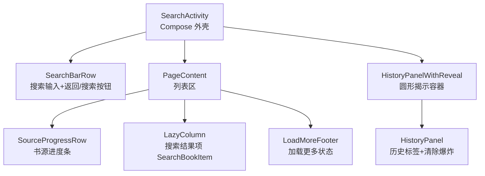
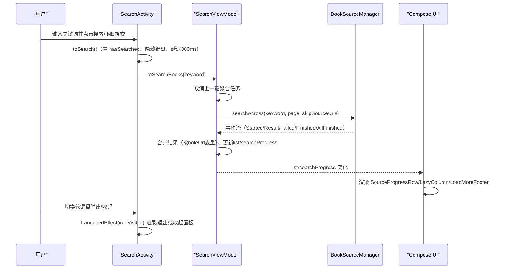
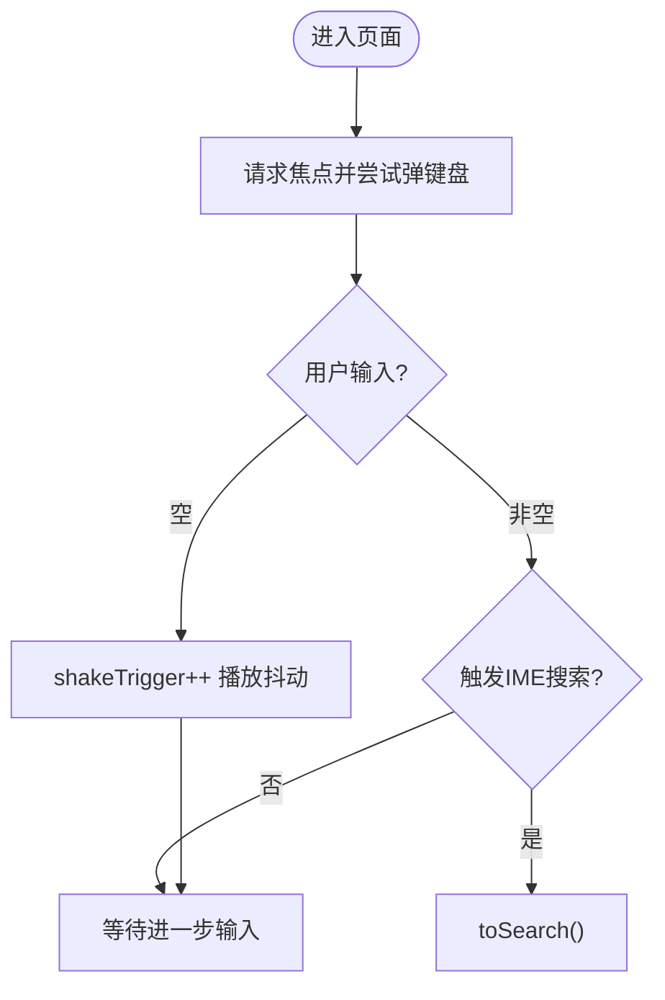
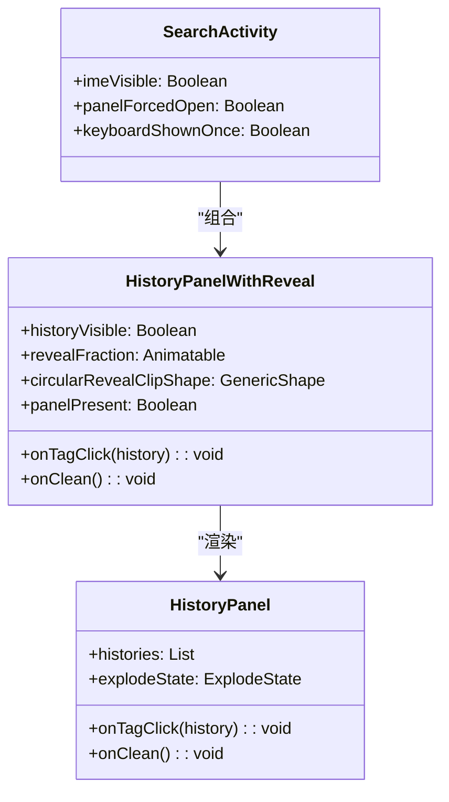
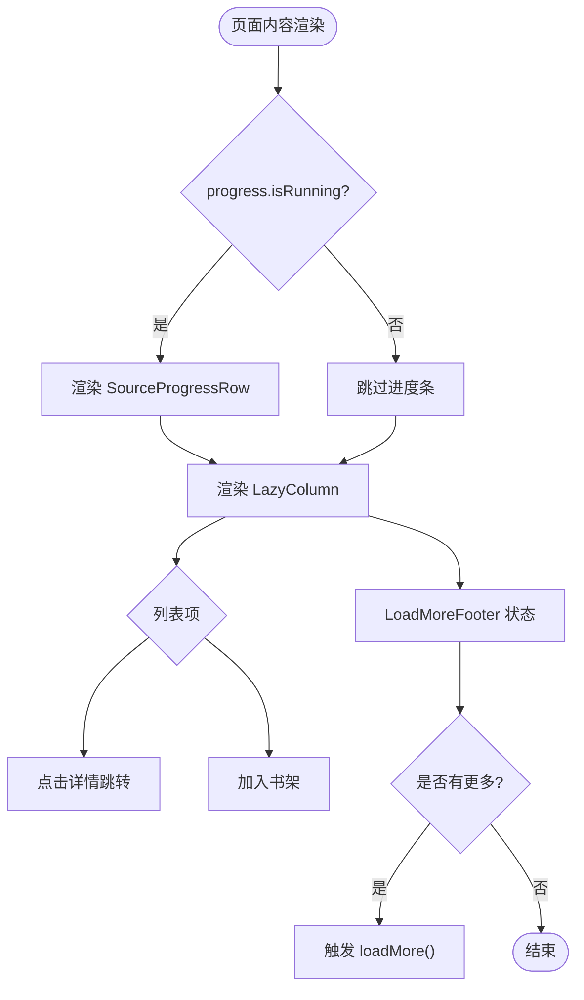
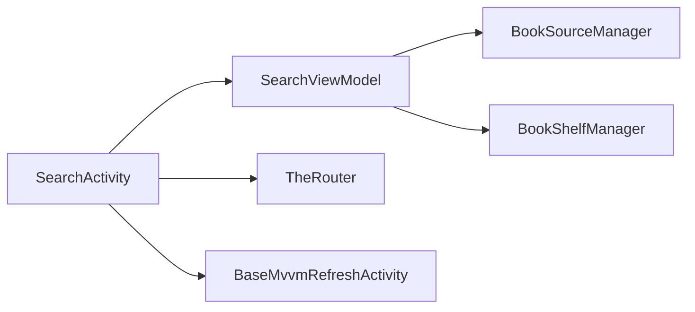

# 搜索 UI 层（SearchActivity）

<cite>
**本文引用的文件**
- [SearchActivity.kt](file://module_find/src/main/java/com/ebook/find/SearchActivity.kt)
- [SearchViewModel.kt](file://module_find/src/main/java/com/ebook/find/mvvm/viewmodel/SearchViewModel.kt)
- [SearchBookItem.kt](file://module_find/src/main/java/com/ebook/find/view/SearchBookItem.kt)
- [0005-search-history-semantics.md](file://docs/adr/0005-search-history-semantics.md)
</cite>

## 目录
1. [简介](#简介)
2. [项目结构](#项目结构)
3. [核心组件](#核心组件)
4. [架构总览](#架构总览)
5. [详细组件分析](#详细组件分析)
6. [依赖关系分析](#依赖关系分析)
7. [性能与动画优化](#性能与动画优化)
8. [键盘与面板层级处理](#键盘与面板层级处理)
9. [故障排查指南](#故障排查指南)
10. [结论](#结论)
11. [附录：扩展新搜索界面组件的示例路径](#附录扩展新搜索界面组件的示例路径)

## 简介
本章节面向搜索页面的 Compose 实现，围绕 SearchActivity 的 UI 结构、状态流与交互行为展开。重点包括：
- 搜索栏（输入框、IME 搜索动作、焦点管理、空输入抖动）
- 历史面板（圆形揭示动画、触发逻辑、粒子爆炸清理）
- 搜索结果列表（聚合搜索结果追加、按 noteUrl 去重、加载更多）
- 书源进度条（SourceProgressRow）与加载更多（LoadMoreFooter）
- 软键盘监听与面板层级关系

## 项目结构
SearchActivity 位于 module_find，作为纯 Compose 页面继承 BaseMvvmRefreshActivity，通过 ViewModel 驱动数据，UI 由多个可组合函数构成：
- SearchBarRow：顶部搜索栏
- HistoryPanelWithReveal + HistoryPanel：历史面板及圆形揭示动画
- PageContent：包含 SourceProgressRow 与 LazyColumn 结果列表
- LoadMoreFooter：基类提供的加载更多底部反馈

图表来源
- [SearchActivity.kt:168-236](file://module_find/src/main/java/com/ebook/find/SearchActivity.kt#L168-L236)
- [SearchActivity.kt:244-294](file://module_find/src/main/java/com/ebook/find/SearchActivity.kt#L244-L294)
- [SearchActivity.kt:304-352](file://module_find/src/main/java/com/ebook/find/SearchActivity.kt#L304-L352)
- [SearchBookItem.kt:44-138](file://module_find/src/main/java/com/ebook/find/view/SearchBookItem.kt#L44-L138)

章节来源
- [SearchActivity.kt:168-236](file://module_find/src/main/java/com/ebook/find/SearchActivity.kt#L168-L236)
- [SearchActivity.kt:244-294](file://module_find/src/main/java/com/ebook/find/SearchActivity.kt#L244-L294)
- [SearchBookItem.kt:44-138](file://module_find/src/main/java/com/ebook/find/view/SearchBookItem.kt#L44-L138)

## 核心组件
- SearchActivity：页面外壳与状态协调（搜索词、是否已搜索、键盘显示状态、历史面板显隐）
- SearchViewModel：聚合搜索、分页、书架事件同步、历史查询/清理
- SearchBookItem：搜索结果条目卡片（封面、作者、来源、标签、加入书架）
- SourceProgressRow：书源聚合进度指示
- LoadMoreFooter：基类提供，展示加载中/失败重试/没有更多
- HistoryPanelWithReveal + HistoryPanel：历史面板与圆形揭示动画、粒子爆炸

章节来源
- [SearchActivity.kt:129-381](file://module_find/src/main/java/com/ebook/find/SearchActivity.kt#L129-L381)
- [SearchViewModel.kt:29-55](file://module_find/src/main/java/com/ebook/find/mvvm/viewmodel/SearchViewModel.kt#L29-L55)
- [SearchBookItem.kt:33-138](file://module_find/src/main/java/com/ebook/find/view/SearchBookItem.kt#L33-L138)

## 架构总览
SearchActivity 采用 MVVM + Compose 架构：
- View（Compose）负责渲染与用户交互，仅持有纯 View 状态（如 query、hasSearched）
- ViewModel 暴露 Flow（list、searchProgress、successEvent），承载业务逻辑（聚合搜索、分页、书架事件同步）
- 列表使用基类 RefreshableList（无下拉刷新、有触底加载更多），列表项通过 SearchBookItem 渲染
- 历史面板叠加在列表之上，通过 isImeVisible 控制显隐；圆形揭示动画由 Animatable + GenericShape 驱动

图表来源
- [SearchActivity.kt:175-194](file://module_find/src/main/java/com/ebook/find/SearchActivity.kt#L175-L194)
- [SearchActivity.kt:365-380](file://module_find/src/main/java/com/ebook/find/SearchActivity.kt#L365-L380)
- [SearchViewModel.kt:212-226](file://module_find/src/main/java/com/ebook/find/mvvm/viewmodel/SearchViewModel.kt#L212-L226)
- [SearchViewModel.kt:261-284](file://module_find/src/main/java/com/ebook/find/mvvm/viewmodel/SearchViewModel.kt#L261-L284)

## 详细组件分析

### 搜索栏（SearchBarRow）
- 输入框使用 BasicTextField，配置 IME 动作（ImeAction.Search）与 KeyboardActions(onSearch)
- 焦点管理：通过 FocusRequester 进入页面后请求焦点并尝试弹出软键盘
- 空输入抖动：shakeTrigger 自增触发衰减振荡动画（近似旧 YoYo Shake 观感）
- 右侧按钮文案与颜色随历史面板可见性切换（搜索/返回），主操作色为 primary，中性为 onSurface
- 左侧放大镜图标使用矢量图标，尺寸 20dp，适配深色模式

图表来源
- [SearchActivity.kt:187-194](file://module_find/src/main/java/com/ebook/find/SearchActivity.kt#L187-L194)
- [SearchActivity.kt:354-380](file://module_find/src/main/java/com/ebook/find/SearchActivity.kt#L354-L380)
- [SearchActivity.kt:433-524](file://module_find/src/main/java/com/ebook/find/SearchActivity.kt#L433-L524)

章节来源
- [SearchActivity.kt:187-194](file://module_find/src/main/java/com/ebook/find/SearchActivity.kt#L187-L194)
- [SearchActivity.kt:354-380](file://module_find/src/main/java/com/ebook/find/SearchActivity.kt#L354-L380)
- [SearchActivity.kt:433-524](file://module_find/src/main/java/com/ebook/find/SearchActivity.kt#L433-L524)

### 历史面板与圆形揭示动画（HistoryPanelWithReveal + HistoryPanel）
- 触发逻辑：由 WindowInsets.isImeVisible 驱动，键盘弹出时显示面板；若从未搜索过且键盘收起则退出页面；无键盘环境宽限期后直接开面板
- 圆形揭示动画：Animatable 进度值 revealFraction 在形状轮廓生成（布局期）读取，避免逐帧重组；以面板左上角为圆心绘制圆形裁剪
- 历史面板内容：标题行（搜索历史 + 清除）、流式胶囊标签（InfoChip）、粒子爆炸层（ExplodeOverlay）
- 清除历史：先计算各标签中心坐标触发爆炸动画，再调用清理接口

图表来源
- [SearchActivity.kt:175-196](file://module_find/src/main/java/com/ebook/find/SearchActivity.kt#L175-L196)
- [SearchActivity.kt:304-352](file://module_find/src/main/java/com/ebook/find/SearchActivity.kt#L304-L352)
- [SearchActivity.kt:545-626](file://module_find/src/main/java/com/ebook/find/SearchActivity.kt#L545-L626)

章节来源
- [SearchActivity.kt:175-196](file://module_find/src/main/java/com/ebook/find/SearchActivity.kt#L175-L196)
- [SearchActivity.kt:304-352](file://module_find/src/main/java/com/ebook/find/SearchActivity.kt#L304-L352)
- [SearchActivity.kt:545-626](file://module_find/src/main/java/com/ebook/find/SearchActivity.kt#L545-L626)

### 搜索结果列表与加载更多（PageContent + LoadMoreFooter）
- 列表上方显示 SourceProgressRow，仅在 progress.isRunning 时组合
- LazyColumn 使用 key = it.noteUrl，确保跨源追加时的稳定性与去重安全
- 加载更多由基类 RefreshableList 管理，LoadMoreFooter 根据 isLoadingMore/loadMoreFailed/hasMoreData 状态显示
- 条目 SearchBookItem 支持点击查看详情与加入书架

图表来源
- [SearchActivity.kt:244-294](file://module_find/src/main/java/com/ebook/find/SearchActivity.kt#L244-L294)
- [SearchBookItem.kt:44-138](file://module_find/src/main/java/com/ebook/find/view/SearchBookItem.kt#L44-L138)

章节来源
- [SearchActivity.kt:244-294](file://module_find/src/main/java/com/ebook/find/SearchActivity.kt#L244-L294)
- [SearchBookItem.kt:44-138](file://module_find/src/main/java/com/ebook/find/view/SearchBookItem.kt#L44-L138)

### 书源进度条（SourceProgressRow）
- 使用 LinearProgressIndicator 展示当前轮次已结束书源比例
- 文字提示“已收到 X/Y 书源结果”，Y 为本轮参与源数，X 为已结束源数
- 全部源结束后整行消失，加载更多时重新出现

章节来源
- [SearchActivity.kt:383-416](file://module_find/src/main/java/com/ebook/find/SearchActivity.kt#L383-L416)
- [SearchViewModel.kt:482-499](file://module_find/src/main/java/com/ebook/find/mvvm/viewmodel/SearchViewModel.kt#L482-L499)

### 加载更多（LoadMoreFooter）
- 由基类提供，状态包括：加载中、失败重试、没有更多
- 触发条件：列表触底且存在未结束的源

章节来源
- [SearchActivity.kt:284-291](file://module_find/src/main/java/com/ebook/find/SearchActivity.kt#L284-L291)

## 依赖关系分析
SearchActivity 依赖：
- SearchViewModel：提供 list、searchProgress、successEvent 等状态流
- BookSourceManager：发起多书源并发聚合搜索
- BookShelfManager：书架快照与事件同步
- TheRouter：跳转到书籍详情页
- lib_common 基类：BaseMvvmRefreshActivity、LoadMoreFooter、通用 UI 组件

图表来源
- [SearchActivity.kt:129-381](file://module_find/src/main/java/com/ebook/find/SearchActivity.kt#L129-L381)
- [SearchViewModel.kt:56-61](file://module_find/src/main/java/com/ebook/find/mvvm/viewmodel/SearchViewModel.kt#L56-L61)

章节来源
- [SearchActivity.kt:129-381](file://module_find/src/main/java/com/ebook/find/SearchActivity.kt#L129-L381)
- [SearchViewModel.kt:56-61](file://module_find/src/main/java/com/ebook/find/mvvm/viewmodel/SearchViewModel.kt#L56-L61)

## 性能与动画优化
- 圆形揭示动画使用 Animatable 配合 GenericShape，在布局期读取进度值，避免逐帧重组历史面板子树
- 历史面板的 clip 形状只创建一次，动画期间仅触发裁剪轮廓重算（重布局），不重组整个面板
- 搜索列表使用稳定 key（noteUrl），避免重复键导致的异常与锚点错乱
- 字数格式化使用顶层 DecimalFormat 实例，避免每次组合新建对象
- 加载更多忽略正在进行的聚合任务，防止共享集合交错改写

章节来源
- [SearchActivity.kt:304-352](file://module_find/src/main/java/com/ebook/find/SearchActivity.kt#L304-L352)
- [SearchBookItem.kt:140-155](file://module_find/src/main/java/com/ebook/find/view/SearchBookItem.kt#L140-L155)
- [SearchViewModel.kt:130-167](file://module_find/src/main/java/com/ebook/find/mvvm/viewmodel/SearchViewModel.kt#L130-L167)

## 键盘与面板层级关系
- 键盘弹出：记录 keyboardShownOnce，取消 panelForcedOpen
- 键盘收起：若 keyboardShownOnce 且未搜索过，则退出页面；否则收起历史面板
- 无键盘环境：进入页面宽限期后仍未弹出键盘，则直接打开历史面板
- 面板层级：历史面板覆盖列表区（含加载浮层），但不覆盖搜索栏；顶部阴影条在最上层

章节来源
- [SearchActivity.kt:175-196](file://module_find/src/main/java/com/ebook/find/SearchActivity.kt#L175-L196)
- [SearchActivity.kt:198-235](file://module_find/src/main/java/com/ebook/find/SearchActivity.kt#L198-L235)

## 故障排查指南
- 搜索无结果：检查 SearchViewModel 的聚合搜索流程与 AllSourcesFailedException 上报
- 加载更多无效：确认 aggregateJob 是否仍在运行，以及 activeSources() 是否为空
- 历史面板不显示：检查 isImeVisible 状态与 panelForcedOpen 兜底逻辑
- 圆形揭示动画卡顿：确认 revealFraction 仅在布局期读取，避免组合期频繁取值

章节来源
- [SearchViewModel.kt:352-375](file://module_find/src/main/java/com/ebook/find/mvvm/viewmodel/SearchViewModel.kt#L352-L375)
- [SearchActivity.kt:304-352](file://module_find/src/main/java/com/ebook/find/SearchActivity.kt#L304-L352)

## 结论
SearchActivity 通过 Compose 实现了模块化的搜索 UI，结合 ViewModel 的聚合搜索能力与流畅的动画效果，提供了良好的用户体验。历史面板的圆形揭示动画与键盘状态监听确保了交互的自然过渡。列表的分页加载与去重机制保证了数据的准确性与性能。整体架构清晰，易于扩展与维护。

## 附录：扩展新搜索界面组件的示例路径
- 新增搜索栏控件：参考 SearchBarRow 的实现，复用 Material Theme 语义色与 InfoChip 设计语言
- 新增历史面板功能：参考 HistoryPanelWithReveal 的圆形揭示动画与 HistoryPanel 的标签渲染
- 新增搜索结果项：参考 SearchBookItem 的卡片设计与书架状态同步
- 新增进度指示：参考 SourceProgressRow 的进度条与文本提示

章节来源
- [SearchActivity.kt:433-524](file://module_find/src/main/java/com/ebook/find/SearchActivity.kt#L433-L524)
- [SearchActivity.kt:545-626](file://module_find/src/main/java/com/ebook/find/SearchActivity.kt#L545-L626)
- [SearchBookItem.kt:44-138](file://module_find/src/main/java/com/ebook/find/view/SearchBookItem.kt#L44-L138)
- [SearchActivity.kt:383-416](file://module_find/src/main/java/com/ebook/find/SearchActivity.kt#L383-L416)