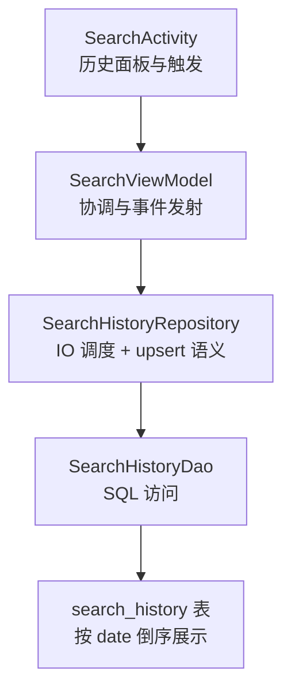
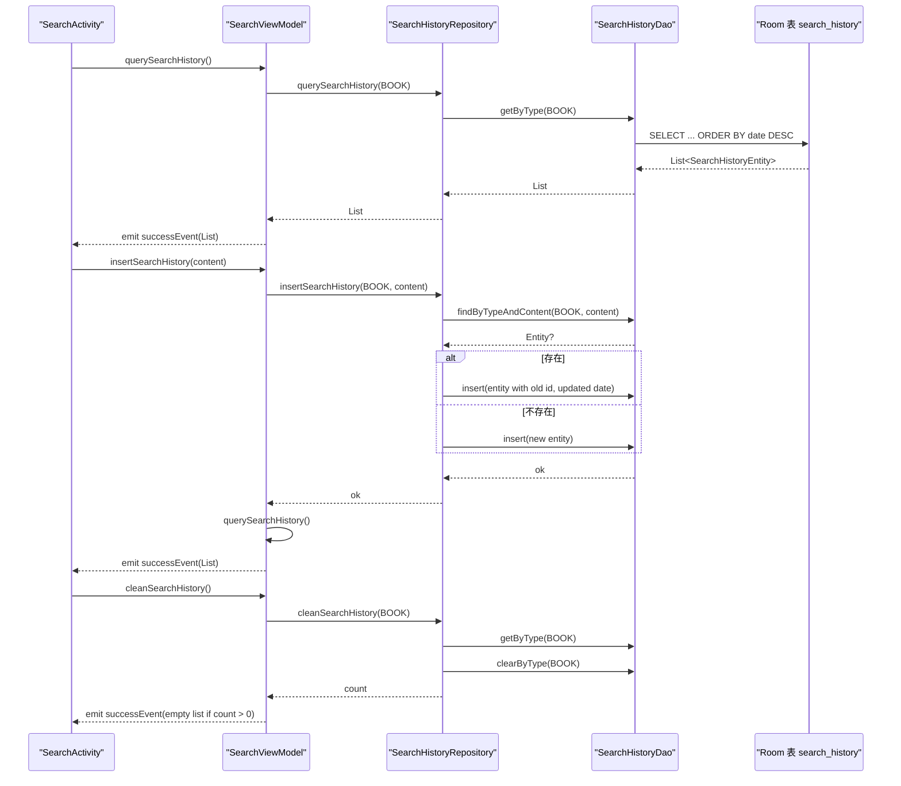
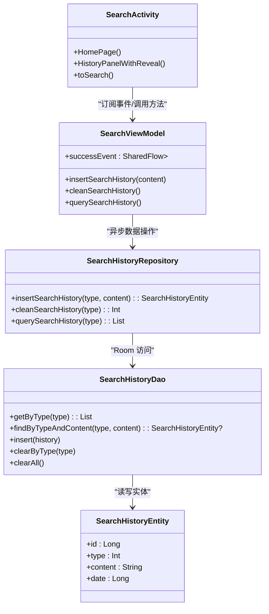

# 搜索历史管理

<cite>
**本文引用的文件**
- [SearchHistoryEntity.kt](file://lib_ebook_db/src/main/java/com/ebook/db/entity/SearchHistoryEntity.kt)
- [SearchHistoryDao.kt](file://lib_ebook_db/src/main/java/com/ebook/db/dao/SearchHistoryDao.kt)
- [SearchHistoryRepository.kt](file://module_find/src/main/java/com/ebook/find/repository/SearchHistoryRepository.kt)
- [SearchViewModel.kt](file://module_find/src/main/java/com/ebook/find/mvvm/viewmodel/SearchViewModel.kt)
- [SearchActivity.kt](file://module_find/src/main/java/com/ebook/find/SearchActivity.kt)
- [0005-search-history-semantics.md](file://docs/adr/0005-search-history-semantics.md)
- [SearchHistoryDaoTest.kt](file://lib_ebook_db/src/test/java/com/ebook/db/dao/SearchHistoryDaoTest.kt)
</cite>

## 目录
1. [简介](#简介)
2. [项目结构](#项目结构)
3. [核心组件](#核心组件)
4. [架构总览](#架构总览)
5. [详细组件分析](#详细组件分析)
6. [依赖关系分析](#依赖关系分析)
7. [性能考量](#性能考量)
8. [故障排查指南](#故障排查指南)
9. [结论](#结论)
10. [附录：使用示例与扩展建议](#附录使用示例与扩展建议)

## 简介
本文件聚焦“搜索历史”的完整生命周期管理，覆盖增删查改（以 upsert 语义为主）、事件流设计、类型常量对齐、错误处理以及与仓库层的交互。目标是让读者既能理解数据如何持久化、又如何被 UI 消费，也能在需要时安全地扩展新的历史操作。

## 项目结构
搜索历史相关代码横跨三个层次：
- 数据层：Room 实体与 DAO，负责本地存储与查询
- 仓库层：SearchHistoryRepository，封装 IO 调度与业务规则（upsert）
- 视图模型与页面：SearchViewModel 与 SearchActivity，负责协程编排、状态发布与 UI 消费

图表来源
- [SearchActivity.kt:185-194](file://module_find/src/main/java/com/ebook/find/SearchActivity.kt#L185-L194)
- [SearchViewModel.kt:169-206](file://module_find/src/main/java/com/ebook/find/mvvm/viewmodel/SearchViewModel.kt#L169-L206)
- [SearchHistoryRepository.kt:22-41](file://module_find/src/main/java/com/ebook/find/repository/SearchHistoryRepository.kt#L22-L41)
- [SearchHistoryDao.kt:18-66](file://lib_ebook_db/src/main/java/com/ebook/db/dao/SearchHistoryDao.kt#L18-L66)

章节来源
- [SearchActivity.kt:185-194](file://module_find/src/main/java/com/ebook/find/SearchActivity.kt#L185-L194)
- [SearchViewModel.kt:169-206](file://module_find/src/main/java/com/ebook/find/mvvm/viewmodel/SearchViewModel.kt#L169-L206)
- [SearchHistoryRepository.kt:22-41](file://module_find/src/main/java/com/ebook/find/repository/SearchHistoryRepository.kt#L22-L41)
- [SearchHistoryDao.kt:18-66](file://lib_ebook_db/src/main/java/com/ebook/db/dao/SearchHistoryDao.kt#L18-L66)

## 核心组件
- SearchHistoryEntity：搜索历史条目，包含自增主键 id、类型 type、内容 content、时间戳 date。type 用于隔离不同入口的历史（当前为书籍搜索），date 既是排序键也是重搜时更新时间戳的目标。
- SearchHistoryDao：提供全量查询 getByType、精确查找 findByTypeAndContent（upsert 查重用）、插入 insert、按类型清除 clearByType 与清空 clearAll。
- SearchHistoryRepository：将 DAO 调用迁移到 IO 线程，实现 upsert 语义：同一 type+content 仅更新时间戳，不新增重复记录；并提供 cleanSearchHistory 返回清理数量。
- SearchViewModel：对外暴露 successEvent SharedFlow<List<SearchHistoryEntity>>，承载历史数据变更事件；提供 insertSearchHistory、cleanSearchHistory、querySearchHistory 等方法，并在异常时记录日志。
- SearchActivity：页面启动即加载历史列表，点击词条发起搜索，点击清除执行爆炸动画后调用 VM 的清理方法。

章节来源
- [SearchHistoryEntity.kt:9-43](file://lib_ebook_db/src/main/java/com/ebook/db/entity/SearchHistoryEntity.kt#L9-L43)
- [SearchHistoryDao.kt:18-66](file://lib_ebook_db/src/main/java/com/ebook/db/dao/SearchHistoryDao.kt#L18-L66)
- [SearchHistoryRepository.kt:11-41](file://module_find/src/main/java/com/ebook/find/repository/SearchHistoryRepository.kt#L11-L41)
- [SearchViewModel.kt:99-101](file://module_find/src/main/java/com/ebook/find/mvvm/viewmodel/SearchViewModel.kt#L99-L101)
- [SearchActivity.kt:185-194](file://module_find/src/main/java/com/ebook/find/SearchActivity.kt#L185-L194)

## 架构总览
搜索历史的读写路径遵循 Repository 模式：UI → ViewModel → Repository → DAO → Room。事件通过 SharedFlow 单向推送，避免 UI 直接轮询数据库。

图表来源
- [SearchActivity.kt:185-194](file://module_find/src/main/java/com/ebook/find/SearchActivity.kt#L185-L194)
- [SearchViewModel.kt:169-206](file://module_find/src/main/java/com/ebook/find/mvvm/viewmodel/SearchViewModel.kt#L169-L206)
- [SearchHistoryRepository.kt:22-41](file://module_find/src/main/java/com/ebook/find/repository/SearchHistoryRepository.kt#L22-L41)
- [SearchHistoryDao.kt:18-66](file://lib_ebook_db/src/main/java/com/ebook/db/dao/SearchHistoryDao.kt#L18-L66)

## 详细组件分析

### 数据模型与语义
- SearchHistoryEntity.type：用于隔离不同入口的历史，当前书籍搜索固定为 BOOK=2，与 SearchViewModel.companion.BOOK 严格对齐，确保 DAO 查询范围正确。
- SearchHistoryEntity.date：毫秒时间戳，作为排序键（DESC）。re-insert 时只更新该字段，避免重复行。
- upsert 语义：先 findByTypeAndContent 精确匹配，若存在则 copy(date = now) 并带上旧 id 再 insert(REPLACE)，否则新建行。

章节来源
- [SearchHistoryEntity.kt:21-43](file://lib_ebook_db/src/main/java/com/ebook/db/entity/SearchHistoryEntity.kt#L21-L43)
- [SearchHistoryRepository.kt:22-29](file://module_find/src/main/java/com/ebook/find/repository/SearchHistoryRepository.kt#L22-L29)
- [SearchViewModel.kt:476-479](file://module_find/src/main/java/com/ebook/find/mvvm/viewmodel/SearchViewModel.kt#L476-L479)

### DAO 层设计与约束
- getByType(type)：全量查询并按 date 倒序，是历史面板的读取入口。
- findByTypeAndContent(type, content)：精确匹配，仅供 upsert 查重使用，禁止模糊匹配以免误判重复。
- insert(history)：REPLACE 策略，带 id 则覆盖原行（重搜更新时间戳），id=0 则由数据库分配新主键。
- clearByType(type)/clearAll()：按类型整体清除或清空所有类型，保证“清除”与“展示”的范围一致。

章节来源
- [SearchHistoryDao.kt:18-66](file://lib_ebook_db/src/main/java/com/ebook/db/dao/SearchHistoryDao.kt#L18-L66)

### 仓库层：异步与线程安全
- 所有 DAO 调用经 withContext(Dispatchers.IO) 切换到 IO 线程，ViewModel 可在主线程直接调用。
- insertSearchHistory 的 upsert 逻辑在同一协程中顺序执行，避免并发导致重复写入。
- cleanSearchHistory 先读后删，返回删除数量，供 UI 决定是否发射空列表事件。

章节来源
- [SearchHistoryRepository.kt:11-41](file://module_find/src/main/java/com/ebook/find/repository/SearchHistoryRepository.kt#L11-L41)

### 视图模型：事件流与协程管理
- successEvent：MutableSharedFlow<List<SearchHistoryEntity>>，extraBufferCapacity=1，用于向 UI 广播历史数据变更（查询结果、清空后的空列表等）。
- insertSearchHistory：插入后自动调用 querySearchHistory，保证历史面板刷新。
- cleanSearchHistory：当清理数量大于 0 时发射空列表，驱动 UI 隐藏清除按钮等。
- querySearchHistory：查询该类型全部历史并通过 successEvent 发射。
- 异常处理：各方法 catch Throwable 并使用 Logger.e 记录错误，避免上层崩溃。

章节来源
- [SearchViewModel.kt:99-101](file://module_find/src/main/java/com/ebook/find/mvvm/viewmodel/SearchViewModel.kt#L99-L101)
- [SearchViewModel.kt:169-206](file://module_find/src/main/java/com/ebook/find/mvvm/viewmodel/SearchViewModel.kt#L169-L206)

### 页面层：交互与事件消费
- 进入页面时调用 querySearchHistory 加载全量历史，随后聚焦输入框并等待键盘弹出；无键盘环境兜底显示历史面板。
- 点击历史词条设置 query 并发起搜索；点击清除先播放粒子爆炸动画，再调用 VM 的清理方法。
- 历史面板通过 collectAsState 订阅 successEvent，渲染标签胶囊。

章节来源
- [SearchActivity.kt:185-194](file://module_find/src/main/java/com/ebook/find/SearchActivity.kt#L185-L194)
- [SearchActivity.kt:304-351](file://module_find/src/main/java/com/ebook/find/SearchActivity.kt#L304-L351)
- [SearchActivity.kt:354-380](file://module_find/src/main/java/com/ebook/find/SearchActivity.kt#L354-L380)

### ADR 对历史语义的约束
- 历史面板纯展示全量，不做子串过滤；清除按类型整体清除。
- upsert 查重保持精确匹配，与全量展示语义正交。
- 这些约定体现在 DAO 方法与仓库/VM 的调用方式中。

章节来源
- [0005-search-history-semantics.md:1-22](file://docs/adr/0005-search-history-semantics.md#L1-L22)

### 测试验证
- SearchHistoryDaoTest 锁定以下行为：
  - getByType 返回该类型全部历史且按 date 倒序
  - clearByType 仅清该类型，不影响其他类型
  - findByTypeAndContent 精确匹配用于 upsert 查重

章节来源
- [SearchHistoryDaoTest.kt:58-101](file://lib_ebook_db/src/test/java/com/ebook/db/dao/SearchHistoryDaoTest.kt#L58-L101)

## 依赖关系分析
- SearchActivity 依赖 SearchViewModel 提供的成功事件流与操作方法
- SearchViewModel 依赖 SearchHistoryRepository 进行数据操作
- SearchHistoryRepository 依赖 SearchHistoryDao 完成数据库访问
- SearchHistoryDao 依赖 Room 生成的 SQL 与实体映射

图表来源
- [SearchActivity.kt:185-194](file://module_find/src/main/java/com/ebook/find/SearchActivity.kt#L185-L194)
- [SearchViewModel.kt:169-206](file://module_find/src/main/java/com/ebook/find/mvvm/viewmodel/SearchViewModel.kt#L169-L206)
- [SearchHistoryRepository.kt:22-41](file://module_find/src/main/java/com/ebook/find/repository/SearchHistoryRepository.kt#L22-L41)
- [SearchHistoryDao.kt:18-66](file://lib_ebook_db/src/main/java/com/ebook/db/dao/SearchHistoryDao.kt#L18-L66)
- [SearchHistoryEntity.kt:21-43](file://lib_ebook_db/src/main/java/com/ebook/db/entity/SearchHistoryEntity.kt#L21-L43)

## 性能考量
- 历史面板每次取全量：适合条目数有限的场景，避免复杂过滤带来的 SQL 开销与转义问题。
- upsert 查重走精确匹配，避免 LIKE 导致的索引失效与性能退化。
- 所有 IO 操作统一切到 IO 线程，避免阻塞主线程。
- 历史面板动画与组合优化：仅在布局期计算裁剪形状，减少重组频率。

[本节为通用指导，不直接分析具体文件]

## 故障排查指南
- 现象：进入搜索页历史面板为空
  - 可能原因：未调用 querySearchHistory 或 DAO 查询条件不正确
  - 定位：检查页面 LaunchedEffect 是否调用 VM.querySearchHistory；确认 getByType 的参数与类型常量一致
- 现象：重复搜索同一词条产生多条记录
  - 可能原因：upsert 未带旧 id 或 findByTypeAndContent 改为模糊匹配
  - 定位：检查 Repository 的 insertSearchHistory 流程；确认 DAO 的 findByTypeAndContent 为精确匹配
- 现象：点击“清除”后 UI 未更新
  - 可能原因：cleanSearchHistory 返回 0 未发射空列表
  - 定位：检查 Repository 返回值与 VM 的条件判断；确认 Activity 订阅了 successEvent
- 异常捕获：所有仓库与 VM 的异常均被 catch 并记录日志，优先查看日志定位根因

章节来源
- [SearchViewModel.kt:169-206](file://module_find/src/main/java/com/ebook/find/mvvm/viewmodel/SearchViewModel.kt#L169-L206)
- [SearchHistoryRepository.kt:22-41](file://module_find/src/main/java/com/ebook/find/repository/SearchHistoryRepository.kt#L22-L41)
- [SearchHistoryDaoTest.kt:58-101](file://lib_ebook_db/src/test/java/com/ebook/db/dao/SearchHistoryDaoTest.kt#L58-L101)

## 结论
搜索历史模块通过清晰的三层结构与明确的语义约定，实现了稳定可靠的“增删查改”能力。upsert 语义保证了历史记录的唯一性与时效性；SharedFlow 事件流避免了 UI 轮询，简化了状态同步；类型常量与 DAO 的强约束确保了多入口历史隔离与正确范围操作。结合测试与日志，可快速定位并修复问题。

[本节为总结，不直接分析具体文件]

## 附录：使用示例与扩展建议

### 正确使用示例
- 页面启动加载历史
  - 在页面初始化时调用 VM.querySearchHistory()，UI 通过 successEvent 收集列表渲染
  - 参考路径：[SearchActivity.kt:185-194](file://module_find/src/main/java/com/ebook/find/SearchActivity.kt#L185-L194)
- 用户搜索后保存历史并重载
  - 调用 VM.insertSearchHistory(content)，内部会执行 upsert 并再次查询全量历史
  - 参考路径：[SearchActivity.kt:365-380](file://module_find/src/main/java/com/ebook/find/SearchActivity.kt#L365-L380), [SearchViewModel.kt:169-180](file://module_find/src/main/java/com/ebook/find/mvvm/viewmodel/SearchViewModel.kt#L169-L180)
- 用户清除历史
  - 调用 VM.cleanSearchHistory()，若清理数量大于 0 则发射空列表，UI 据此隐藏清除按钮
  - 参考路径：[SearchActivity.kt:340-351](file://module_find/src/main/java/com/ebook/find/SearchActivity.kt#L340-L351), [SearchViewModel.kt:182-194](file://module_find/src/main/java/com/ebook/find/mvvm/viewmodel/SearchViewModel.kt#L182-L194)

### 异常处理与日志
- 仓库与 VM 层对异常进行 catch 并记录日志，避免上层崩溃
- 建议在新增历史操作时也遵循此模式：try-catch + Logger.e，必要时上报失败原因

章节来源
- [SearchViewModel.kt:169-206](file://module_find/src/main/java/com/ebook/find/mvvm/viewmodel/SearchViewModel.kt#L169-L206)

### 扩展新历史操作的建议
- 新增只读操作（如分页加载历史）：
  - 在 DAO 增加对应 Query，Repository 封装为 suspend 函数并切换 IO 线程
  - 在 VM 暴露新方法并通过 successEvent 或其他专用 Flow 下发结果
- 新增写操作（如批量导入历史）：
  - 在 DAO 提供批量 Insert 或事务接口
  - 在 Repository 中实现事务边界，保证一致性
  - 在 VM 中统一捕获异常并通过事件通知 UI

[本节为通用指导，不直接分析具体文件]