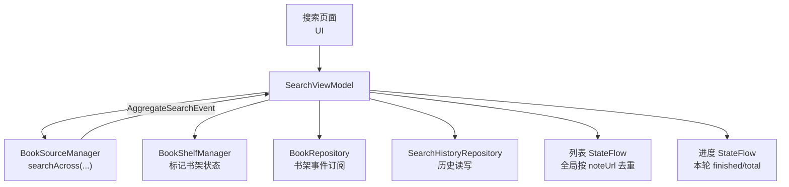
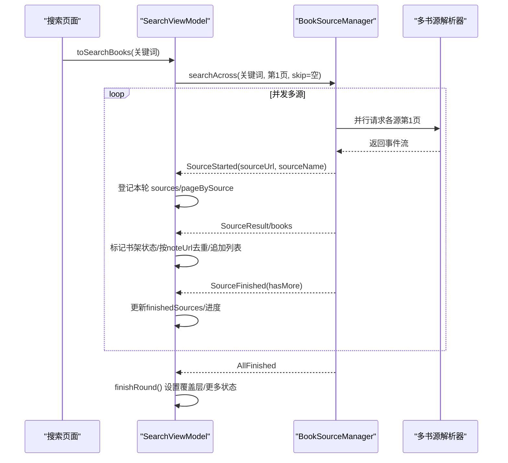
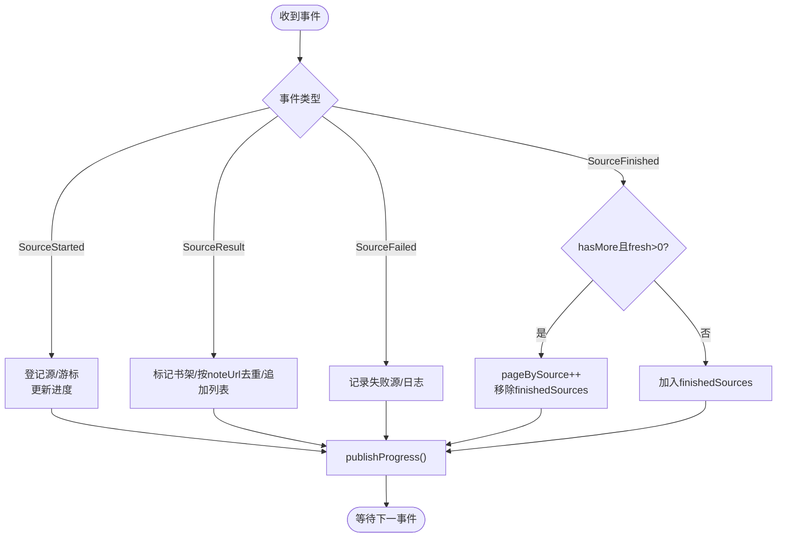
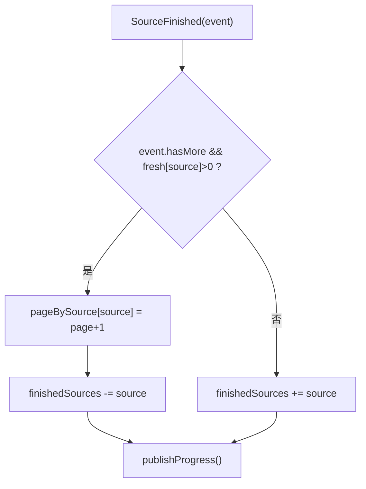
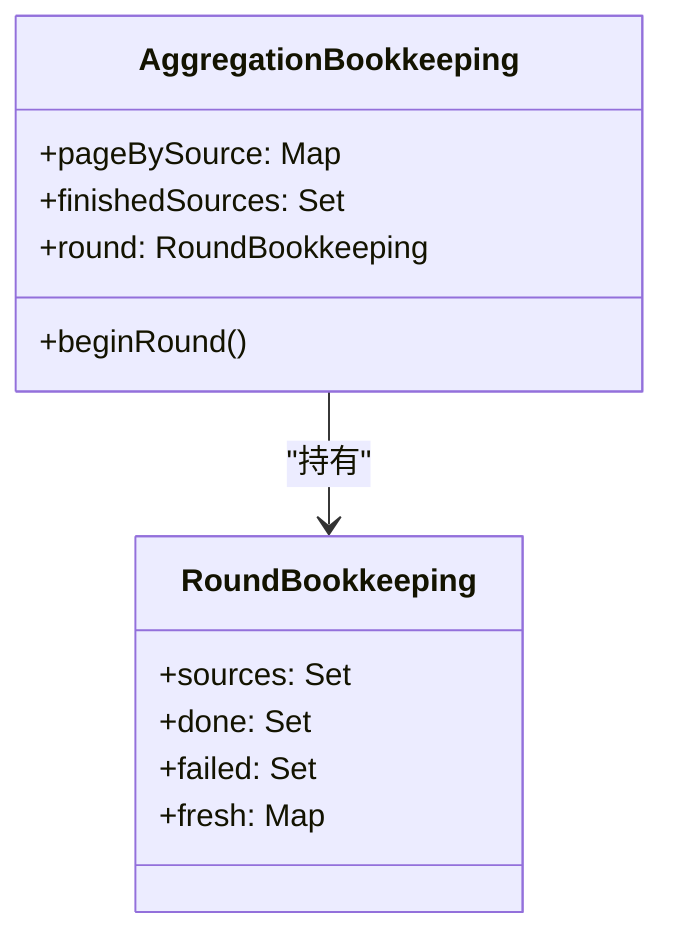
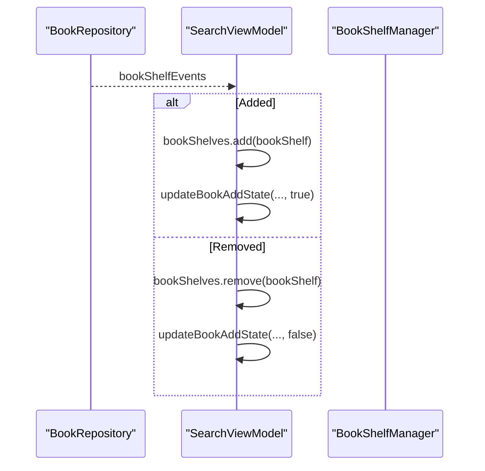
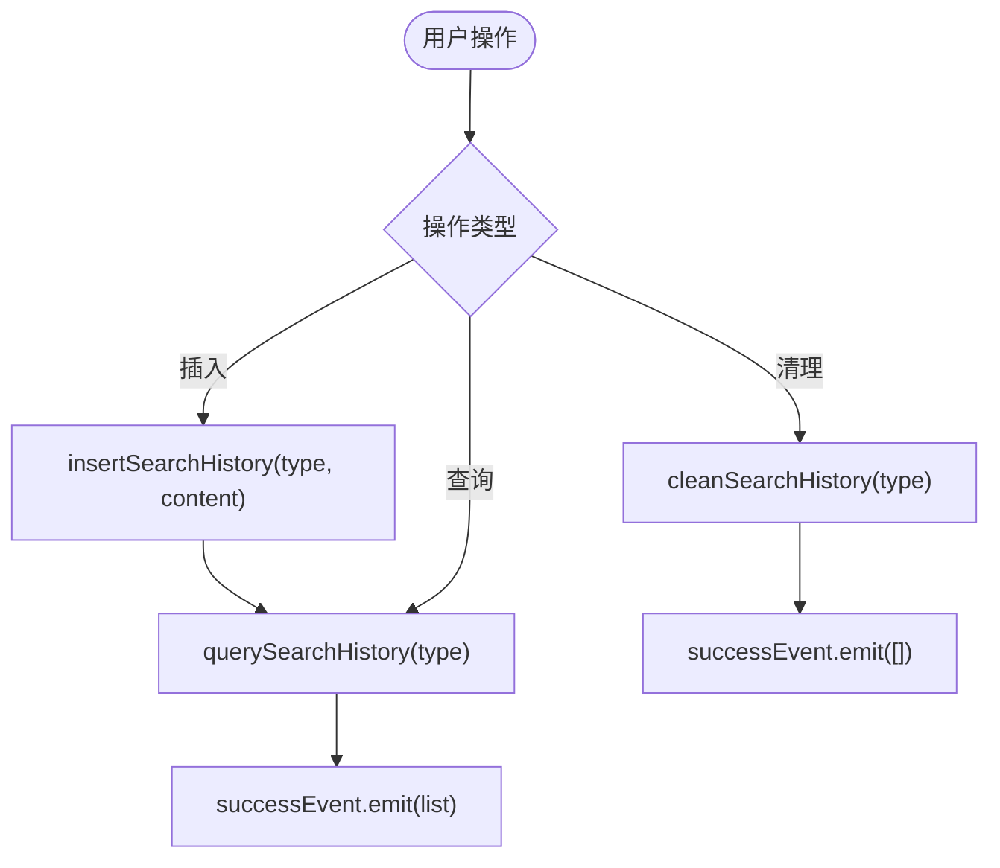
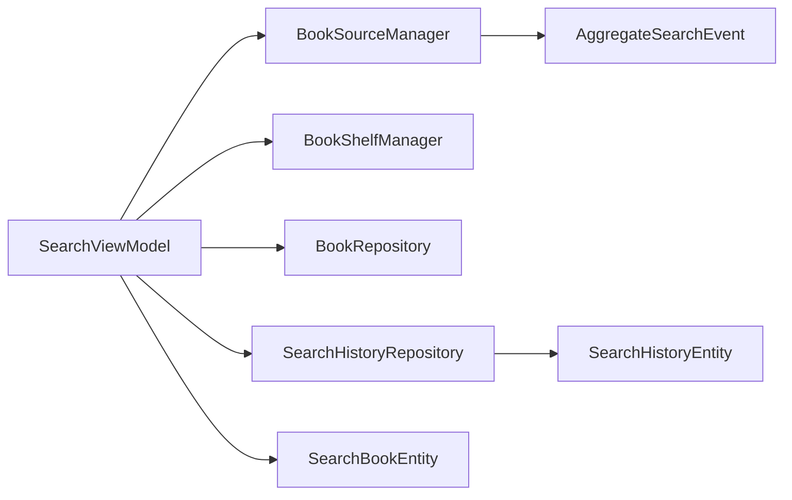

# 搜索视图模型 (SearchViewModel)

<cite>
**本文引用的文件**
- [SearchViewModel.kt](file://module_find/src/main/java/com/ebook/find/mvvm/viewmodel/SearchViewModel.kt)
- [AggregateSearchEvent.kt](file://lib_book_source/src/main/java/com/ebook/source/analyze/AggregateSearchEvent.kt)
- [BookSourceManager.kt](file://lib_book_common/src/main/java/com/ebook/common/analyze/source/BookSourceManager.kt)
- [SearchHistoryEntity.kt](file://lib_ebook_db/src/main/java/com/ebook/db/entity/SearchHistoryEntity.kt)
- [SearchHistoryRepository.kt](file://module_find/src/main/java/com/ebook/find/repository/SearchHistoryRepository.kt)
- [SearchViewModelTest.kt](file://module_find/src/test/java/com/ebook/find/mvvm/viewmodel/SearchViewModelTest.kt)
</cite>

## 目录
1. [简介](#简介)
2. [项目结构](#项目结构)
3. [核心组件](#核心组件)
4. [架构总览](#架构总览)
5. [详细组件分析](#详细组件分析)
6. [依赖关系分析](#依赖关系分析)
7. [性能考量](#性能考量)
8. [故障排查指南](#故障排查指南)
9. [结论](#结论)
10. [附录：实现新搜索策略与优化建议](#附录实现新搜索策略与优化建议)

## 简介
本文件围绕 SearchViewModel 的聚合搜索能力，系统化说明“一次搜全站”的核心机制：多书源并发、事件流处理、结果合并去重、每源独立翻页策略、状态簿记（AggregationBookkeeping）、书架状态同步、搜索历史管理、错误与重试、以及并发冲突下的状态一致性。文档同时给出可操作的实践指引，帮助新增搜索策略、优化聚合性能、正确处理并发与一致性问题。

## 项目结构
SearchViewModel 位于 find 模块，负责汇聚 BookSourceManager 的多源搜索事件流，维护 UI 列表与进度，并协调书架状态与搜索历史。关键协作方包括：
- BookSourceManager.searchAcross：并发触发各书源解析，以 AggregateSearchEvent 增量返回
- BookShelfManager/BookRepository：书架快照与事件同步
- SearchHistoryRepository：搜索历史的 upsert、清理与查询
- VM 内部 AggregationBookkeeping：按源分页游标、结束源集合、轮次簿记

图表来源
- [SearchViewModel.kt:56-97](file://module_find/src/main/java/com/ebook/find/mvvm/viewmodel/SearchViewModel.kt#L56-L97)
- [BookSourceManager.kt:114-155](file://lib_book_common/src/main/java/com/ebook/common/analyze/source/BookSourceManager.kt#L114-L155)
- [AggregateSearchEvent.kt:5-75](file://lib_book_source/src/main/java/com/ebook/source/analyze/AggregateSearchEvent.kt#L5-L75)

章节来源
- [SearchViewModel.kt:29-97](file://module_find/src/main/java/com/ebook/find/mvvm/viewmodel/SearchViewModel.kt#L29-L97)
- [BookSourceManager.kt:114-155](file://lib_book_common/src/main/java/com/ebook/common/analyze/source/BookSourceManager.kt#L114-L155)

## 核心组件
- SearchViewModel：聚合搜索入口，编排一轮 searchAcross 的收集，维护列表、进度、错误覆盖层、加载更多控制
- AggregationBookkeeping：聚合状态容器，包含：
  - pageBySource：每源下一页页码
  - finishedSources：跨轮已结束的源（到底/失败/去重后零新增）
  - round：本轮参与源、已结束源、失败源、各源新增条目数
- AggregateSearchEvent：事件流类型（SourceStarted → SourceResult/SourceFailed → SourceFinished → AllFinished）
- SearchHistoryRepository：搜索历史的 upsert、清理、查询
- BookShelfManager/BookRepository：书架快照与增删事件同步，用于在搜索结果中标注“已加书架”

章节来源
- [SearchViewModel.kt:397-460](file://module_find/src/main/java/com/ebook/find/mvvm/viewmodel/SearchViewModel.kt#L397-L460)
- [AggregateSearchEvent.kt:5-75](file://lib_book_source/src/main/java/com/ebook/source/analyze/AggregateSearchEvent.kt#L5-L75)
- [SearchHistoryRepository.kt:11-42](file://module_find/src/main/java/com/ebook/find/repository/SearchHistoryRepository.kt#L11-L42)

## 架构总览
聚合搜索采用“流式聚合 + 每源独立翻页”的架构。VM 不持有单源结果数组，而是消费事件流，边到边渲染；翻页通过“每源游标 + 结束集”推进，直到所有源都无新增或全部失败。

图表来源
- [SearchViewModel.kt:261-320](file://module_find/src/main/java/com/ebook/find/mvvm/viewmodel/SearchViewModel.kt#L261-L320)
- [BookSourceManager.kt:114-155](file://lib_book_common/src/main/java/com/ebook/common/analyze/source/BookSourceManager.kt#L114-L155)
- [AggregateSearchEvent.kt:5-75](file://lib_book_source/src/main/java/com/ebook/source/analyze/AggregateSearchEvent.kt#L5-L75)

## 详细组件分析

### 聚合搜索流程与事件处理
- 启动一轮：startRound 计算本轮页码与跳过集，beginRound 重置轮次簿记，collect searchAcross 的事件流，逐一 onSearchEvent
- 事件分支：
  - SourceStarted：登记本轮参与源，首次见该源时登记其当前页作为游标
  - SourceResult：标记书架状态、按 noteUrl 全局去重、追加列表、若为第一条则关闭 Loading
  - SourceFailed：记录失败源，仅日志与进度分子累积，不终止聚合流
  - SourceFinished：根据 hasMore 与 fresh 计数决定是否继续翻页；done 递增
  - AllFinished：统一收尾，判断是否进入错误态、是否有更多、停止加载更多

图表来源
- [SearchViewModel.kt:286-342](file://module_find/src/main/java/com/ebook/find/mvvm/viewmodel/SearchViewModel.kt#L286-L342)
- [AggregateSearchEvent.kt:21-75](file://lib_book_source/src/main/java/com/ebook/source/analyze/AggregateSearchEvent.kt#L21-L75)

章节来源
- [SearchViewModel.kt:261-375](file://module_find/src/main/java/com/ebook/find/mvvm/viewmodel/SearchViewModel.kt#L261-L375)
- [AggregateSearchEvent.kt:21-75](file://lib_book_source/src/main/java/com/ebook/source/analyze/AggregateSearchEvent.kt#L21-L75)

### 每源独立翻页策略与条件判断
- 翻页起点：roundPage 取 activeSources 的最小游标，未登记默认第1页
- 翻页推进：SourceFinished 中若 hasMore 且该源去重后带来新条目（fresh > 0），则 pageBySource[source] = page + 1，并从 finishedSources 移除
- 到底判定：即使 hasMore=true，若 fresh==0（软404导致整页重复），仍将该源放入 finishedSources，后续不再请求
- 跳过集：skipSourceUrls = finishedSources.toSet()，传递给 searchAcross，确保只请求“还活着”的源

图表来源
- [SearchViewModel.kt:306-317](file://module_find/src/main/java/com/ebook/find/mvvm/viewmodel/SearchViewModel.kt#L306-L317)
- [SearchViewModel.kt:377-386](file://module_find/src/main/java/com/ebook/find/mvvm/viewmodel/SearchViewModel.kt#L377-L386)

章节来源
- [SearchViewModel.kt:306-317](file://module_find/src/main/java/com/ebook/find/mvvm/viewmodel/SearchViewModel.kt#L306-L317)
- [SearchViewModel.kt:377-386](file://module_find/src/main/java/com/ebook/find/mvvm/viewmodel/SearchViewModel.kt#L377-L386)

### AggregationBookkeeping 状态管理
- 会话级状态（跨轮存活）：
  - pageBySource：每源下一页页码
  - finishedSources：跨轮已结束源（到底/失败/去重后零新增）
- 轮级状态（每轮重置）：
  - round.sources：本轮参与源（进度分母）
  - round.done：本轮已结束源（进度分子）
  - round.failed：本轮失败源（全部失败才进错误态）
  - round.fresh：每源去重后新增条目数（软404判据）
- beginRound：将 round 整体替换为新实例，保证原子清零，避免漏清导致状态污染

图表来源
- [SearchViewModel.kt:408-460](file://module_find/src/main/java/com/ebook/find/mvvm/viewmodel/SearchViewModel.kt#L408-L460)

章节来源
- [SearchViewModel.kt:408-460](file://module_find/src/main/java/com/ebook/find/mvvm/viewmodel/SearchViewModel.kt#L408-L460)

### 书架状态同步机制
- 初始化加载书架快照，用于搜索结果标注“已加书架”
- 订阅 BookRepository.bookShelfEvents：
  - Added：添加到快照并更新对应列表项 add 标志
  - Removed：从快照移除并更新列表项
  - ProgressUpdated/ChaptersUpdated：忽略（与搜索无关）
- markShelfStatus：对某页结果批量标记书架状态

图表来源
- [SearchViewModel.kt:103-127](file://module_find/src/main/java/com/ebook/find/mvvm/viewmodel/SearchViewModel.kt#L103-L127)
- [SearchViewModel.kt:246-257](file://module_find/src/main/java/com/ebook/find/mvvm/viewmodel/SearchViewModel.kt#L246-L257)

章节来源
- [SearchViewModel.kt:103-127](file://module_find/src/main/java/com/ebook/find/mvvm/viewmodel/SearchViewModel.kt#L103-L127)
- [SearchViewModel.kt:246-257](file://module_find/src/main/java/com/ebook/find/mvvm/viewmodel/SearchViewModel.kt#L246-L257)

### 搜索历史记录管理
- insertSearchHistory：upsert（同 type+content 仅更新时间戳），插入后查询全量历史并通过 successEvent 发射
- cleanSearchHistory：清除 BOOK 类型全部历史，成功后 emit 空列表
- querySearchHistory：查询 BOOK 类型全部历史，emit 列表
- 数据实体 SearchHistoryEntity：自增主键，type/content/date，按 date 倒序展示

图表来源
- [SearchViewModel.kt:169-206](file://module_find/src/main/java/com/ebook/find/mvvm/viewmodel/SearchViewModel.kt#L169-L206)
- [SearchHistoryRepository.kt:22-41](file://module_find/src/main/java/com/ebook/find/repository/SearchHistoryRepository.kt#L22-L41)
- [SearchHistoryEntity.kt:9-43](file://lib_ebook_db/src/main/java/com/ebook/db/entity/SearchHistoryEntity.kt#L9-L43)

章节来源
- [SearchViewModel.kt:169-206](file://module_find/src/main/java/com/ebook/find/mvvm/viewmodel/SearchViewModel.kt#L169-L206)
- [SearchHistoryRepository.kt:22-41](file://module_find/src/main/java/com/ebook/find/repository/SearchHistoryRepository.kt#L22-L41)
- [SearchHistoryEntity.kt:9-43](file://lib_ebook_db/src/main/java/com/ebook/db/entity/SearchHistoryEntity.kt#L9-L43)

### 错误处理与重试逻辑
- 单源失败：SourceFailed 仅记录失败源，不影响其他源；SourceFinished 照常到达，保证进度完整
- 全部失败：finishRound 检测 failed.size == sources.size 时进入 NetworkError 覆盖层，并 reportFailure
- 流异常：catch Throwable 视为整条流出问题，按“全部源失败”处置，避免覆盖层永驻
- 取消传播：CancellationException 原样上抛，确保旧轮被取消，不会往新结果灌旧数据
- 重试：VM 层未内置自动重试；可通过重新触发 toSearchBooks/loadMore 发起新一轮聚合

章节来源
- [SearchViewModel.kt:286-375](file://module_find/src/main/java/com/ebook/find/mvvm/viewmodel/SearchViewModel.kt#L286-L375)
- [AggregateSearchEvent.kt:40-75](file://lib_book_source/src/main/java/com/ebook/source/analyze/AggregateSearchEvent.kt#L40-L75)

### 并发冲突与状态一致性
- 换词重搜：toSearchBooks 先 cancel 上一轮 aggregateJob，再清空列表与簿记，确保旧流结果不污染新结果
- 触底防抖：loadMore 检查 aggregateJob?.isActive，若仍在运行则忽略，避免共享簿记被两轮交错改写
- 每源游标隔离：pageBySource 按源存储，避免不同源翻页互相干扰
- 去重策略：全局按 noteUrl 去重，保留同名不同源的条目（换源备选），避免 Compose item key 重复崩溃

章节来源
- [SearchViewModel.kt:212-226](file://module_find/src/main/java/com/ebook/find/mvvm/viewmodel/SearchViewModel.kt#L212-L226)
- [SearchViewModel.kt:154-167](file://module_find/src/main/java/com/ebook/find/mvvm/viewmodel/SearchViewModel.kt#L154-L167)
- [SearchViewModel.kt:323-342](file://module_find/src/main/java/com/ebook/find/mvvm/viewmodel/SearchViewModel.kt#L323-L342)

## 依赖关系分析
- SearchViewModel 依赖：
  - BookSourceManager：提供 searchAcross 事件流
  - BookShelfManager：标记书架状态
  - BookRepository：订阅书架事件
  - SearchHistoryRepository：搜索历史读写
- 事件契约：
  - AggregateSearchEvent：严格顺序 SourceStarted → SourceResult/SourceFailed → SourceFinished → AllFinished
- 数据模型：
  - SearchBookEntity：携带 tag/origin/noteUrl，用于归属与去重
  - SearchHistoryEntity：搜索历史实体

图表来源
- [SearchViewModel.kt:56-61](file://module_find/src/main/java/com/ebook/find/mvvm/viewmodel/SearchViewModel.kt#L56-L61)
- [BookSourceManager.kt:114-155](file://lib_book_common/src/main/java/com/ebook/common/analyze/source/BookSourceManager.kt#L114-L155)
- [AggregateSearchEvent.kt:21-75](file://lib_book_source/src/main/java/com/ebook/source/analyze/AggregateSearchEvent.kt#L21-L75)

章节来源
- [SearchViewModel.kt:56-61](file://module_find/src/main/java/com/ebook/find/mvvm/viewmodel/SearchViewModel.kt#L56-L61)
- [BookSourceManager.kt:114-155](file://lib_book_common/src/main/java/com/ebook/common/analyze/source/BookSourceManager.kt#L114-L155)
- [AggregateSearchEvent.kt:21-75](file://lib_book_source/src/main/java/com/ebook/source/analyze/AggregateSearchEvent.kt#L21-L75)

## 性能考量
- 并发上限：BookSourceManager 限制并发数为 5，避免对第三方站点造成风控压力
- 去重成本：按 noteUrl 去重使用 set 过滤，时间复杂度 O(n)，n 为单页条目数
- 翻页优化：finishedSources 减少无效请求，避免软404导致的冗余网络调用
- 进度计算：仅在本轮 scope 内统计 finished/total，避免跨轮污染
- 列表更新：首次结果到来即关闭 Loading，提升首屏体验

章节来源
- [BookSourceManager.kt:120-124](file://lib_book_common/src/main/java/com/ebook/common/analyze/source/BookSourceManager.kt#L120-L124)
- [SearchViewModel.kt:329-342](file://module_find/src/main/java/com/ebook/find/mvvm/viewmodel/SearchViewModel.kt#L329-L342)
- [SearchViewModel.kt:388-394](file://module_find/src/main/java/com/ebook/find/mvvm/viewmodel/SearchViewModel.kt#L388-L394)

## 故障排查指南
- 现象：进度条永远差一格
  - 原因：某路协程被取消，连 SourceFinished 都不发
  - 解决：以 AllFinished 为准一次性收满进度，见 finishRound
- 现象：软404导致误判到底
  - 原因：hasMore=true 但整页重复
  - 解决：依据 fresh[source] > 0 才认为有新增，否则置 finishedSources
- 现象：换词后旧结果污染新列表
  - 原因：旧轮未取消
  - 解决：toSearchBooks 先 cancel 上一轮 aggregateJob
- 现象：部分源失败显示空白
  - 原因：错误态判定不当
  - 解决：仅当全部源失败才进 NetworkError，部分失败照常展示已有结果

章节来源
- [SearchViewModel.kt:352-375](file://module_find/src/main/java/com/ebook/find/mvvm/viewmodel/SearchViewModel.kt#L352-L375)
- [SearchViewModel.kt:306-317](file://module_find/src/main/java/com/ebook/find/mvvm/viewmodel/SearchViewModel.kt#L306-L317)
- [SearchViewModel.kt:212-226](file://module_find/src/main/java/com/ebook/find/mvvm/viewmodel/SearchViewModel.kt#L212-L226)

## 结论
SearchViewModel 通过事件流驱动、每源独立翻页、全局去重与轮次化簿记，实现了稳定高效的聚合搜索。其设计在并发安全、状态一致性、用户体验方面均有细致考量。配合测试用例，可验证关键路径行为，便于扩展与维护。

## 附录：实现新搜索策略与优化建议
- 新增搜索策略：
  - 复用 searchAcross 事件流，保持 SourceStarted/SourceResult/SourceFinished/AllFinished 语义
  - 在 onSearchEvent 中按事件类型更新 AggregationBookkeeping
  - 遵循“每源独立游标 + 结束集”的翻页规则
- 优化聚合性能：
  - 合理设置并发上限（当前为 5）
  - 利用 finishedSources 跳过已到底源，减少无效请求
  - 去重策略尽量基于唯一标识（noteUrl），避免重复计算
- 处理并发冲突：
  - 换词重搜务必取消旧轮
  - loadMore 防抖，避免两轮聚合交错
  - 每源状态隔离，避免共享集合竞态
- 状态一致性：
  - 轮次化簿记保证清零原子性
  - 进度以 AllFinished 兜底，避免差格
  - 错误态仅在全部失败时触发，部分失败不阻断

章节来源
- [SearchViewModel.kt:212-226](file://module_find/src/main/java/com/ebook/find/mvvm/viewmodel/SearchViewModel.kt#L212-L226)
- [SearchViewModel.kt:352-375](file://module_find/src/main/java/com/ebook/find/mvvm/viewmodel/SearchViewModel.kt#L352-L375)
- [SearchViewModelTest.kt:421-464](file://module_find/src/test/java/com/ebook/find/mvvm/viewmodel/SearchViewModelTest.kt#L421-L464)